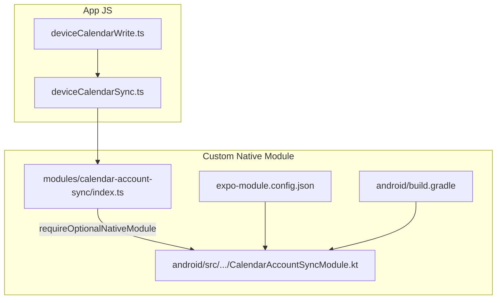
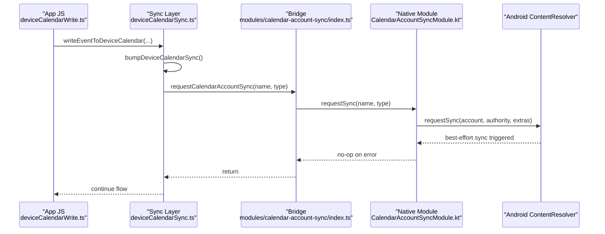
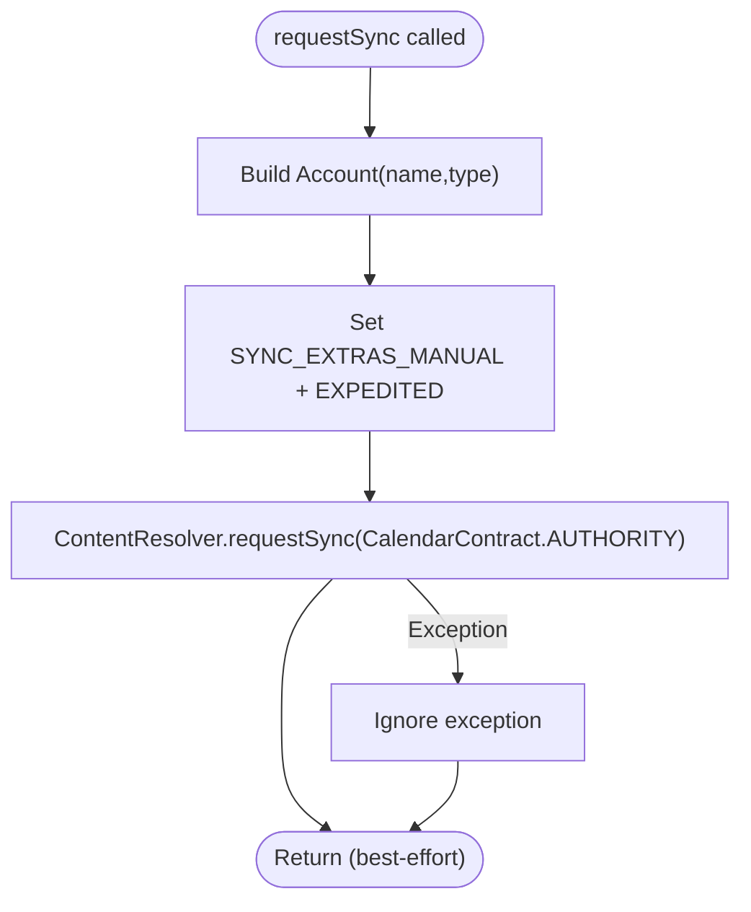
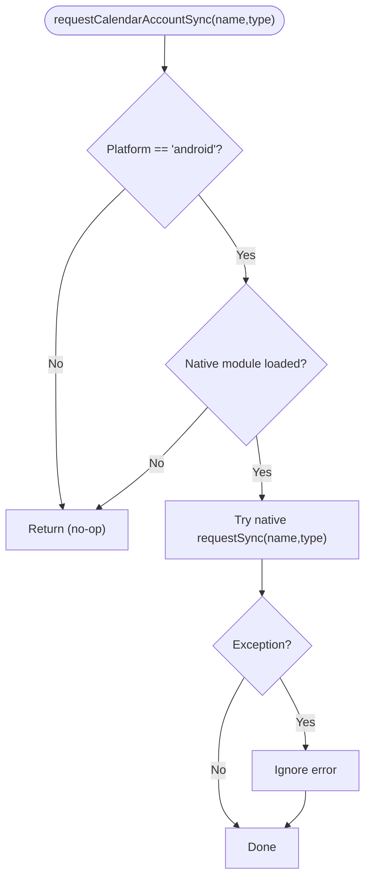
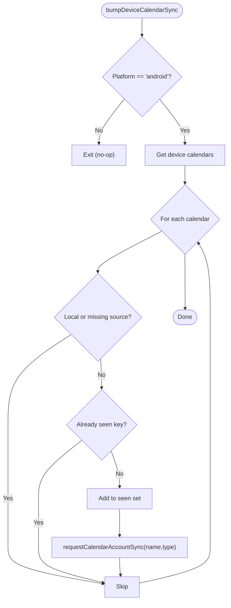
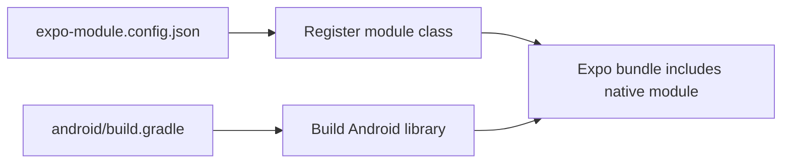
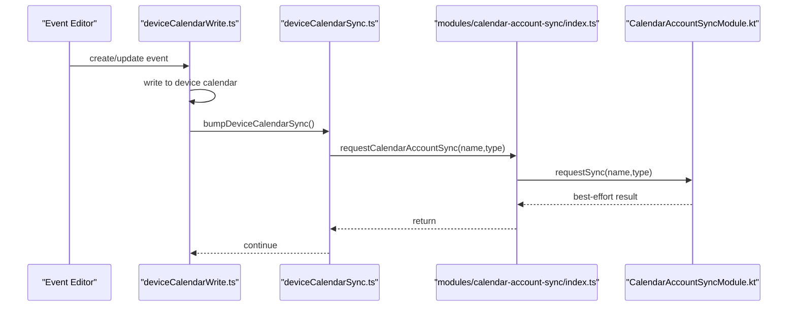
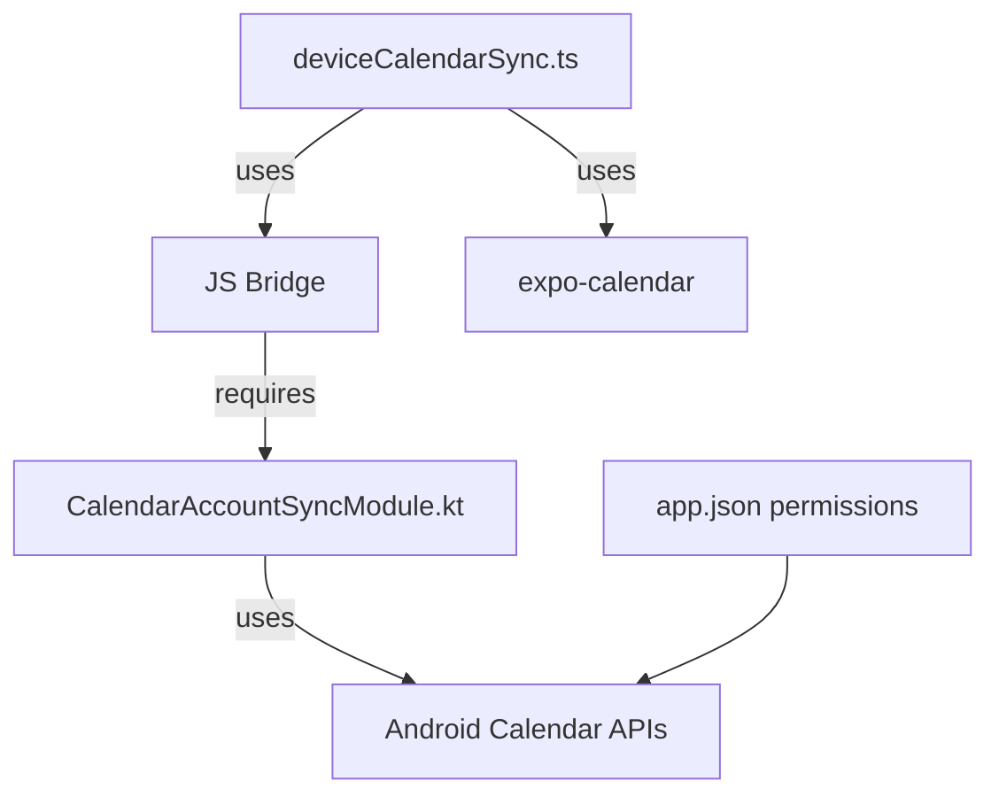

# Native Modules

<cite>
**Referenced Files in This Document**
- [CalendarAccountSyncModule.kt](file://modules/calendar-account-sync/android/src/main/java/expo/modules/calendaraccountsync/CalendarAccountSyncModule.kt)
- [index.ts (module JS API)](file://modules/calendar-account-sync/index.ts)
- [expo-module.config.json](file://modules/calendar-account-sync/expo-module.config.json)
- [build.gradle (Android module)](file://modules/calendar-account-sync/android/build.gradle)
- [deviceCalendarSync.ts](file://src/deviceCalendarSync.ts)
- [deviceCalendarWrite.ts](file://src/deviceCalendarWrite.ts)
- [app.json](file://app.json)
</cite>

## Table of Contents
1. [Introduction](#introduction)
2. [Project Structure](#project-structure)
3. [Core Components](#core-components)
4. [Architecture Overview](#architecture-overview)
5. [Detailed Component Analysis](#detailed-component-analysis)
6. [Dependency Analysis](#dependency-analysis)
7. [Performance Considerations](#performance-considerations)
8. [Troubleshooting Guide](#troubleshooting-guide)
9. [Conclusion](#conclusion)

## Introduction
This document explains the native modules implementation used to integrate Android calendar account synchronization with the React Native application via Expo’s module system. It focuses on how a custom Kotlin module is structured, exposed to JavaScript, and invoked from the app to trigger immediate sync for device calendar accounts. It also covers build configuration, integration points, and platform-specific behavior for calendar access on Android.

## Project Structure
The native module lives under a dedicated folder and follows Expo’s modular structure:
- Android implementation in Kotlin
- A thin JavaScript wrapper that conditionally loads the native module on Android
- Module registration via Expo’s module config
- Gradle build configuration for the Android library

**Diagram sources**
- [deviceCalendarSync.ts:1-30](file://src/deviceCalendarSync.ts#L1-L30)
- [deviceCalendarWrite.ts:62-145](file://src/deviceCalendarWrite.ts#L62-L145)
- [index.ts (module JS API):1-16](file://modules/calendar-account-sync/index.ts#L1-L16)
- [expo-module.config.json:1-7](file://modules/calendar-account-sync/expo-module.config.json#L1-L7)
- [CalendarAccountSyncModule.kt:1-31](file://modules/calendar-account-sync/android/src/main/java/expo/modules/calendaraccountsync/CalendarAccountSyncModule.kt#L1-L31)
- [build.gradle (Android module):1-16](file://modules/calendar-account-sync/android/build.gradle#L1-L16)

**Section sources**
- [index.ts (module JS API):1-16](file://modules/calendar-account-sync/index.ts#L1-L16)
- [expo-module.config.json:1-7](file://modules/calendar-account-sync/expo-module.config.json#L1-L7)
- [build.gradle (Android module):1-16](file://modules/calendar-account-sync/android/build.gradle#L1-L16)
- [deviceCalendarSync.ts:1-30](file://src/deviceCalendarSync.ts#L1-L30)
- [deviceCalendarWrite.ts:62-145](file://src/deviceCalendarWrite.ts#L62-L145)

## Core Components
- CalendarAccountSyncModule (Kotlin): Exposes a single function to request an immediate sync for a given calendar account on Android.
- JavaScript bridge (index.ts): Provides a safe, cross-platform wrapper that calls the native method only on Android when available.
- Integration layer (deviceCalendarSync.ts): Discovers synced calendars and triggers the native sync after writes or updates.
- Build configuration (expo-module.config.json, build.gradle): Registers the module with Expo and builds it as an Android library.

Key responsibilities:
- Android: Use ContentResolver.requestSync with manual/expedited flags to prompt the OS to sync immediately.
- JavaScript: Guard against non-Android platforms and missing native modules; swallow errors to keep user flows resilient.

**Section sources**
- [CalendarAccountSyncModule.kt:10-30](file://modules/calendar-account-sync/android/src/main/java/expo/modules/calendaraccountsync/CalendarAccountSyncModule.kt#L10-L30)
- [index.ts (module JS API):1-16](file://modules/calendar-account-sync/index.ts#L1-L16)
- [deviceCalendarSync.ts:13-30](file://src/deviceCalendarSync.ts#L13-L30)

## Architecture Overview
The call path from the app to the Android native layer:

**Diagram sources**
- [deviceCalendarWrite.ts:62-145](file://src/deviceCalendarWrite.ts#L62-L145)
- [deviceCalendarSync.ts:13-30](file://src/deviceCalendarSync.ts#L13-L30)
- [index.ts (module JS API):1-16](file://modules/calendar-account-sync/index.ts#L1-L16)
- [CalendarAccountSyncModule.kt:10-30](file://modules/calendar-account-sync/android/src/main/java/expo/modules/calendaraccountsync/CalendarAccountSyncModule.kt#L10-L30)

## Detailed Component Analysis

### Kotlin Module: CalendarAccountSyncModule
- Purpose: Trigger an expedited sync for a specific calendar account so changes propagate to Google/Exchange quickly.
- Registration: Declares a module name and exposes a function to the JS bridge.
- Function signature:
  - Name: requestSync
  - Parameters:
    - accountName: String — The account name (e.g., email address)
    - accountType: String — The account type (e.g., com.google, com.microsoft.exchange)
  - Return type: void (best-effort; exceptions are swallowed)
- Behavior:
  - Constructs an Account object from the provided parameters.
  - Sets manual and expedited sync extras.
  - Calls ContentResolver.requestSync with the Calendar provider authority.
  - Catches and ignores exceptions to ensure failures do not disrupt app flows.

**Diagram sources**
- [CalendarAccountSyncModule.kt:14-29](file://modules/calendar-account-sync/android/src/main/java/expo/modules/calendaraccountsync/CalendarAccountSyncModule.kt#L14-L29)

**Section sources**
- [CalendarAccountSyncModule.kt:10-30](file://modules/calendar-account-sync/android/src/main/java/expo/modules/calendaraccountsync/CalendarAccountSyncModule.kt#L10-L30)

### JavaScript Bridge: modules/calendar-account-sync/index.ts
- Purpose: Provide a safe, cross-platform API to trigger native sync only on Android when the native module is present.
- Behavior:
  - Conditionally requires the native module only on Android.
  - Exports a function that validates inputs and invokes the native method inside a try/catch to remain resilient.
  - No-op on iOS/web or when the native module is unavailable (e.g., Expo Go).

**Diagram sources**
- [index.ts (module JS API):1-16](file://modules/calendar-account-sync/index.ts#L1-L16)

**Section sources**
- [index.ts (module JS API):1-16](file://modules/calendar-account-sync/index.ts#L1-L16)

### Integration Layer: deviceCalendarSync.ts
- Purpose: After writing or updating events on the device calendar, discover all synced accounts and trigger native sync for each.
- Behavior:
  - On Android, enumerates calendars via expo-calendar.
  - Filters out local-only accounts and duplicates by source name/type.
  - Calls the bridge’s requestCalendarAccountSync for each unique synced account.
  - Swallows errors to avoid impacting user workflows.

**Diagram sources**
- [deviceCalendarSync.ts:13-30](file://src/deviceCalendarSync.ts#L13-L30)

**Section sources**
- [deviceCalendarSync.ts:13-30](file://src/deviceCalendarSync.ts#L13-L30)

### Build Configuration and Expo Integration
- expo-module.config.json:
  - Declares platform support (Android).
  - Registers the Kotlin class as a module for Expo to include at build time.
- android/build.gradle:
  - Applies Android library plugin and Expo module Gradle plugin.
  - Defines namespace matching the package declaration.
  - Sets group/version metadata.

**Diagram sources**
- [expo-module.config.json:1-7](file://modules/calendar-account-sync/expo-module.config.json#L1-L7)
- [build.gradle (Android module):1-16](file://modules/calendar-account-sync/android/build.gradle#L1-L16)

**Section sources**
- [expo-module.config.json:1-7](file://modules/calendar-account-sync/expo-module.config.json#L1-L7)
- [build.gradle (Android module):1-16](file://modules/calendar-account-sync/android/build.gradle#L1-L16)

### Usage Example: From App to Native
- Writing an event to the device calendar triggers a sync bump:
  - deviceCalendarWrite.ts writes or updates an event using expo-calendar.
  - After a successful write/update, it calls bumpDeviceCalendarSync().
  - deviceCalendarSync.ts enumerates synced accounts and calls the native module via the bridge.
  - The native module requests an expedited sync for each account.

**Diagram sources**
- [deviceCalendarWrite.ts:62-145](file://src/deviceCalendarWrite.ts#L62-L145)
- [deviceCalendarSync.ts:13-30](file://src/deviceCalendarSync.ts#L13-L30)
- [index.ts (module JS API):1-16](file://modules/calendar-account-sync/index.ts#L1-L16)
- [CalendarAccountSyncModule.kt:10-30](file://modules/calendar-account-sync/android/src/main/java/expo/modules/calendaraccountsync/CalendarAccountSyncModule.kt#L10-L30)

**Section sources**
- [deviceCalendarWrite.ts:62-145](file://src/deviceCalendarWrite.ts#L62-L145)
- [deviceCalendarSync.ts:13-30](file://src/deviceCalendarSync.ts#L13-L30)
- [index.ts (module JS API):1-16](file://modules/calendar-account-sync/index.ts#L1-L16)
- [CalendarAccountSyncModule.kt:10-30](file://modules/calendar-account-sync/android/src/main/java/expo/modules/calendaraccountsync/CalendarAccountSyncModule.kt#L10-L30)

## Dependency Analysis
- Platform gating:
  - The bridge checks Platform.OS === 'android' before loading the native module.
  - The integration layer only runs on Android.
- External dependencies:
  - Android SDK: android.accounts.Account, android.content.ContentResolver, android.provider.CalendarContract.
  - Expo Modules: expo-modules-core (for requireOptionalNativeModule), expo-calendar (for calendar enumeration).
- Permissions:
  - READ_CALENDAR and WRITE_CALENDAR are declared in app.json for Android.

**Diagram sources**
- [index.ts (module JS API):1-16](file://modules/calendar-account-sync/index.ts#L1-L16)
- [deviceCalendarSync.ts:1-30](file://src/deviceCalendarSync.ts#L1-L30)
- [CalendarAccountSyncModule.kt:1-31](file://modules/calendar-account-sync/android/src/main/java/expo/modules/calendaraccountsync/CalendarAccountSyncModule.kt#L1-L31)
- [app.json:22-37](file://app.json#L22-L37)

**Section sources**
- [app.json:22-37](file://app.json#L22-L37)
- [deviceCalendarSync.ts:1-30](file://src/deviceCalendarSync.ts#L1-L30)
- [index.ts (module JS API):1-16](file://modules/calendar-account-sync/index.ts#L1-L16)
- [CalendarAccountSyncModule.kt:1-31](file://modules/calendar-account-sync/android/src/main/java/expo/modules/calendaraccountsync/CalendarAccountSyncModule.kt#L1-L31)

## Performance Considerations
- Best-effort design: Exceptions are intentionally ignored to avoid blocking UI or failing user actions. This keeps the sync “nudge” non-intrusive.
- Deduplication: The integration layer deduplicates accounts by source name/type to avoid redundant sync requests.
- Conditional execution: The bridge and integration layer short-circuit on non-Android platforms or when the native module is absent, minimizing overhead.
- Batch nudges: After a write/update, a single pass enumerates all synced accounts and triggers sync once per account.

[No sources needed since this section provides general guidance]

## Troubleshooting Guide
Common issues and mitigations:
- Native module not found:
  - Occurs on iOS/web or when running in environments without the native module (e.g., Expo Go). The bridge safely returns without calling native code.
- Missing permissions:
  - Ensure READ_CALENDAR and WRITE_CALENDAR are granted. The app declares these permissions in app.json; runtime permission prompts are handled by expo-calendar where applicable.
- No effect observed:
  - The sync request is best-effort; if the OS ignores it, normal periodic sync will still occur. Errors are swallowed to prevent regressions.
- Duplicate sync requests:
  - The integration layer deduplicates by source name/type. If you see repeated calls, verify that the same account appears multiple times in the calendar list due to different sources.

**Section sources**
- [index.ts (module JS API):1-16](file://modules/calendar-account-sync/index.ts#L1-L16)
- [deviceCalendarSync.ts:13-30](file://src/deviceCalendarSync.ts#L13-L30)
- [app.json:22-37](file://app.json#L22-L37)

## Conclusion
The native module implementation provides a focused, best-effort mechanism to accelerate Android calendar account synchronization. By combining a minimal Kotlin module, a robust JavaScript bridge, and careful integration within the app’s calendar workflow, the solution improves perceived responsiveness while remaining resilient to platform differences and environment constraints. The configuration ensures seamless inclusion in the Expo build pipeline, and the design avoids surfacing errors to preserve smooth user experiences.

[No sources needed since this section summarizes without analyzing specific files]