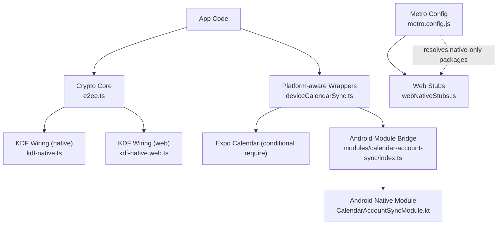
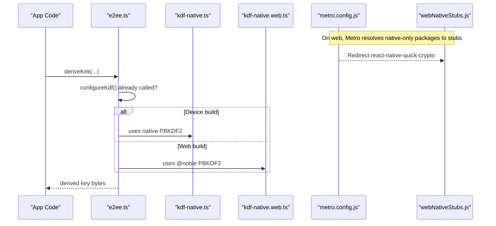
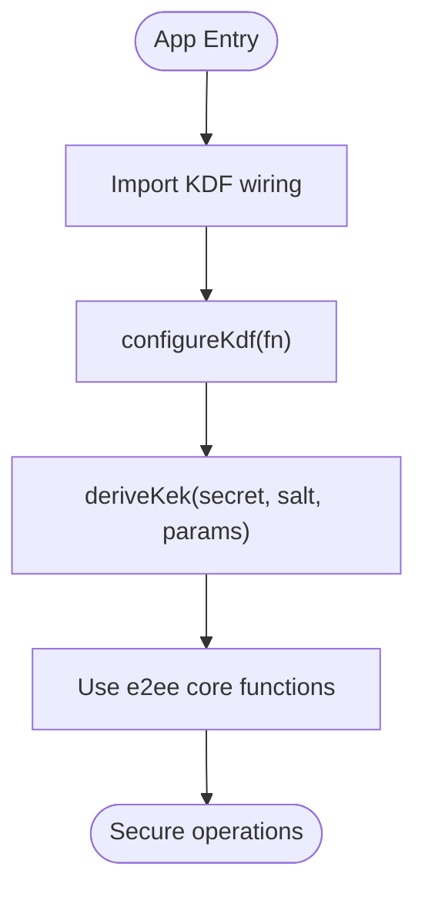
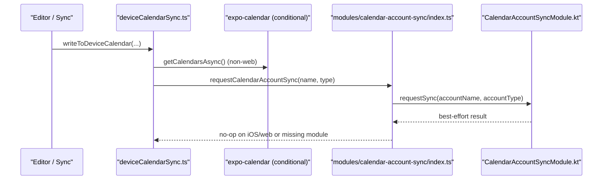
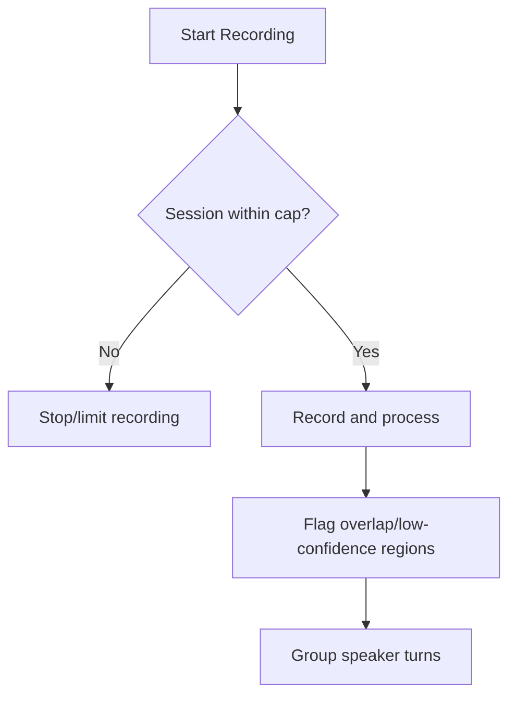
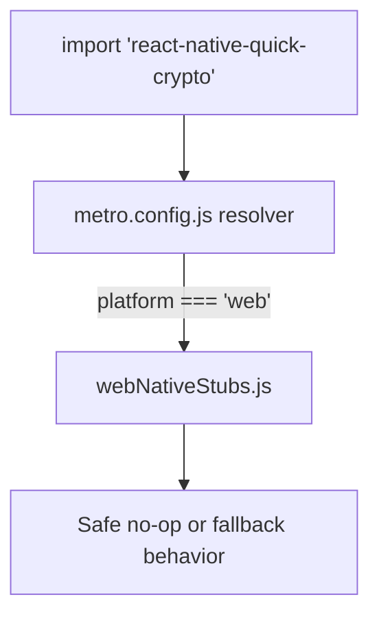
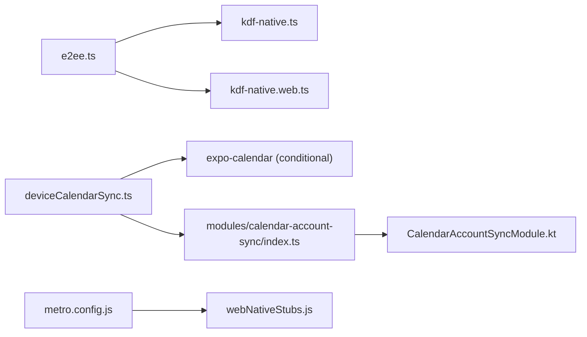

# Platform Abstraction

<cite>
**Referenced Files in This Document**
- [metro.config.js](file://metro.config.js)
- [webNativeStubs.js](file://src/webNativeStubs.js)
- [kdf-native.ts](file://src/crypto/kdf-native.ts)
- [kdf-native.web.ts](file://src/crypto/kdf-native.web.ts)
- [e2ee.ts](file://src/crypto/e2ee.ts)
- [index.ts](file://modules/calendar-account-sync/index.ts)
- [CalendarAccountSyncModule.kt](file://modules/calendar-account-sync/android/src/main/java/expo/modules/calendaraccountsync/CalendarAccountSyncModule.kt)
- [deviceCalendarSync.ts](file://src/deviceCalendarSync.ts)
- [calendarSyncCore.ts](file://src/calendarSyncCore.ts)
- [conversation.ts](file://src/audio/conversation.ts)
- [attachmentCryptoCore.test.ts](file://src/crypto/attachmentCryptoCore.test.ts)
- [calendarSyncCore.test.ts](file://src/calendarSyncCore.test.ts)
</cite>

## Table of Contents
1. Introduction
2. Project Structure
3. Core Components
4. Architecture Overview
5. Detailed Component Analysis
6. Dependency Analysis
7. Performance Considerations
8. Troubleshooting Guide
9. Conclusion

## Introduction
This document explains how the application abstracts platform-specific behavior across iOS, Android, and web. It focuses on:
- Conditional imports and platform detection to keep a unified API surface
- The stub pattern used for web compatibility when native modules are unavailable
- Native module bridging via Expo Modules for Android-only features
- Concrete examples for cryptography (KDF), calendar access/sync, and audio recording policy
- Testing strategies for multi-platform code and debugging techniques for platform-specific issues

## Project Structure
The platform abstraction is implemented through:
- Metro configuration that swaps native-only dependencies with minimal web stubs during bundling
- File-level platform variants (for example, kdf-native.ts vs kdf-native.web.ts) resolved by the bundler
- Thin wrappers around native modules that guard calls based on platform and availability
- Pure logic modules that remain platform-agnostic and are unit-tested without device SDKs

**Diagram sources**
- [metro.config.js:14-31](file://metro.config.js#L14-L31)
- [webNativeStubs.js:1-12](file://src/webNativeStubs.js#L1-L12)
- [kdf-native.ts:1-22](file://src/crypto/kdf-native.ts#L1-L22)
- [kdf-native.web.ts:1-16](file://src/crypto/kdf-native.web.ts#L1-L16)
- [deviceCalendarSync.ts:1-30](file://src/deviceCalendarSync.ts#L1-L30)
- [index.ts:1-16](file://modules/calendar-account-sync/index.ts#L1-L16)
- [CalendarAccountSyncModule.kt:10-29](file://modules/calendar-account-sync/android/src/main/java/expo/modules/calendaraccountsync/CalendarAccountSyncModule.kt#L10-L29)

**Section sources**
- [metro.config.js:14-31](file://metro.config.js#L14-L31)
- [webNativeStubs.js:1-12](file://src/webNativeStubs.js#L1-L12)

## Core Components
- Web stubbing layer: Metro redirects specific native-only packages to a small stub module on web builds so the bundle does not crash at import time.
- KDF wiring: A pluggable key derivation function allows the portable encryption core to use a fast native PBKDF2 on devices and a pure-JS implementation on web.
- Calendar bridge: A thin wrapper conditionally loads expo-calendar and invokes an Android-only native module to expedite account sync after writes.
- Audio conversation policy: Pure logic that governs session length, consent, and transcript region flagging independent of platform.

**Section sources**
- [metro.config.js:14-31](file://metro.config.js#L14-L31)
- [webNativeStubs.js:1-12](file://src/webNativeStubs.js#L1-L12)
- [kdf-native.ts:1-22](file://src/crypto/kdf-native.ts#L1-L22)
- [kdf-native.web.ts:1-16](file://src/crypto/kdf-native.web.ts#L1-L16)
- [e2ee.ts:131-150](file://src/crypto/e2ee.ts#L131-L150)
- [deviceCalendarSync.ts:1-30](file://src/deviceCalendarSync.ts#L1-L30)
- [index.ts:1-16](file://modules/calendar-account-sync/index.ts#L1-L16)
- [conversation.ts:14-39](file://src/audio/conversation.ts#L14-L39)

## Architecture Overview
The system separates platform concerns from business logic:
- Portable core modules define APIs and data shapes without importing platform-specific code directly.
- Platform-specific implementations are wired in at startup or resolved conditionally at runtime.
- Metro config ensures web builds never load native-only dependencies by substituting them with safe stubs.
- Native modules are exposed via Expo Modules and called only when available and necessary.

**Diagram sources**
- [metro.config.js:14-31](file://metro.config.js#L14-L31)
- [webNativeStubs.js:1-12](file://src/webNativeStubs.js#L1-L12)
- [kdf-native.ts:1-22](file://src/crypto/kdf-native.ts#L1-L22)
- [kdf-native.web.ts:1-16](file://src/crypto/kdf-native.web.ts#L1-L16)
- [e2ee.ts:131-150](file://src/crypto/e2ee.ts#L131-L150)

## Detailed Component Analysis

### Cryptography: Pluggable KDF and Portable Core
- The encryption core defines a pluggable KDF interface and exposes configureKdf to wire in platform-specific implementations.
- On native platforms, a fast PBKDF2 backed by a native library is registered at app entry.
- On web, a pure-JS PBKDF2 is used instead, avoiding native dependencies.
- The core throws if the KDF is not configured, ensuring correct initialization order.

**Diagram sources**
- [kdf-native.ts:1-22](file://src/crypto/kdf-native.ts#L1-L22)
- [kdf-native.web.ts:1-16](file://src/crypto/kdf-native.web.ts#L1-L16)
- [e2ee.ts:131-150](file://src/crypto/e2ee.ts#L131-L150)

**Section sources**
- [e2ee.ts:131-150](file://src/crypto/e2ee.ts#L131-L150)
- [kdf-native.ts:1-22](file://src/crypto/kdf-native.ts#L1-L22)
- [kdf-native.web.ts:1-16](file://src/crypto/kdf-native.web.ts#L1-L16)

### Calendar Access and Sync: Conditional Imports and Native Bridging
- Calendar access is wrapped in a module that conditionally requires expo-calendar only on non-web platforms.
- After writing to the device calendar, the wrapper enumerates accounts and triggers an Android-only native module to expedite sync.
- The Android module requests an immediate sync for a given account using the platform’s calendar provider.
- Pure sync decision logic lives in a separate file and is fully unit-testable without device SDKs.

**Diagram sources**
- [deviceCalendarSync.ts:1-30](file://src/deviceCalendarSync.ts#L1-L30)
- [index.ts:1-16](file://modules/calendar-account-sync/index.ts#L1-L16)
- [CalendarAccountSyncModule.kt:10-29](file://modules/calendar-account-sync/android/src/main/java/expo/modules/calendaraccountsync/CalendarAccountSyncModule.kt#L10-L29)

**Section sources**
- [deviceCalendarSync.ts:1-30](file://src/deviceCalendarSync.ts#L1-L30)
- [index.ts:1-16](file://modules/calendar-account-sync/index.ts#L1-L16)
- [CalendarAccountSyncModule.kt:10-29](file://modules/calendar-account-sync/android/src/main/java/expo/modules/calendaraccountsync/CalendarAccountSyncModule.kt#L10-L29)
- [calendarSyncCore.ts:80-149](file://src/calendarSyncCore.ts#L80-L149)

### Audio Recording: Policy and Platform Separation
- Conversation-mode policy (session caps, consent records, flagged regions) is implemented as pure logic with no platform dependencies.
- This separation allows testing and reasoning about behavior independently of platform-specific recording implementations.

**Diagram sources**
- [conversation.ts:14-39](file://src/audio/conversation.ts#L14-L39)
- [conversation.ts:56-106](file://src/audio/conversation.ts#L56-L106)
- [conversation.ts:108-129](file://src/audio/conversation.ts#L108-L129)

**Section sources**
- [conversation.ts:14-39](file://src/audio/conversation.ts#L14-L39)
- [conversation.ts:56-106](file://src/audio/conversation.ts#L56-L106)
- [conversation.ts:108-129](file://src/audio/conversation.ts#L108-L129)

### Web Compatibility: Stub Pattern and Metro Resolution
- Metro config maps certain native-only packages to a single stub module when building for web.
- The stub provides minimal, safe exports so imports do not fail and calls degrade gracefully.
- This enables running web bundles without native dependencies while preserving the same import paths.

**Diagram sources**
- [metro.config.js:14-31](file://metro.config.js#L14-L31)
- [webNativeStubs.js:1-12](file://src/webNativeStubs.js#L1-L12)

**Section sources**
- [metro.config.js:14-31](file://metro.config.js#L14-L31)
- [webNativeStubs.js:1-12](file://src/webNativeStubs.js#L1-L12)

## Dependency Analysis
- The crypto core depends on a pluggable KDF; platform wiring files provide concrete implementations.
- Calendar flows depend on conditional loading of expo-calendar and an Android-only native module.
- Metro config introduces a dependency between native-only packages and the web stubs during web builds.

**Diagram sources**
- [e2ee.ts:131-150](file://src/crypto/e2ee.ts#L131-L150)
- [kdf-native.ts:1-22](file://src/crypto/kdf-native.ts#L1-L22)
- [kdf-native.web.ts:1-16](file://src/crypto/kdf-native.web.ts#L1-L16)
- [deviceCalendarSync.ts:1-30](file://src/deviceCalendarSync.ts#L1-L30)
- [index.ts:1-16](file://modules/calendar-account-sync/index.ts#L1-L16)
- [CalendarAccountSyncModule.kt:10-29](file://modules/calendar-account-sync/android/src/main/java/expo/modules/calendaraccountsync/CalendarAccountSyncModule.kt#L10-L29)
- [metro.config.js:14-31](file://metro.config.js#L14-L31)

**Section sources**
- [e2ee.ts:131-150](file://src/crypto/e2ee.ts#L131-L150)
- [deviceCalendarSync.ts:1-30](file://src/deviceCalendarSync.ts#L1-L30)
- [metro.config.js:14-31](file://metro.config.js#L14-L31)

## Performance Considerations
- Prefer native-backed KDF on devices for acceptable login times; pure-JS KDF is suitable for local web runs but may be slow under heavy iteration counts.
- Avoid unnecessary native calls; wrap platform features behind guards and best-effort error handling to prevent blocking user flows.
- Keep pure logic isolated to enable offline tests and reduce coupling to slow platform I/O.

[No sources needed since this section provides general guidance]

## Troubleshooting Guide
- If web builds crash due to native modules, verify Metro is redirecting those packages to the stubs and that the stub exports match expected interfaces.
- If calendar sync does not appear immediately on Android, ensure the wrapper enumerates calendars and calls the native sync request after writes.
- If encryption fails with “KDF not configured,” confirm the KDF wiring module is imported early at app entry before any cryptographic operations.
- For calendar date drift, rely on the pure sync logic that handles all-day dates correctly regardless of timezone.

**Section sources**
- [metro.config.js:14-31](file://metro.config.js#L14-L31)
- [webNativeStubs.js:1-12](file://src/webNativeStubs.js#L1-L12)
- [deviceCalendarSync.ts:1-30](file://src/deviceCalendarSync.ts#L1-L30)
- [index.ts:1-16](file://modules/calendar-account-sync/index.ts#L1-L16)
- [kdf-native.ts:1-22](file://src/crypto/kdf-native.ts#L1-L22)
- [calendarSyncCore.ts:27-39](file://src/calendarSyncCore.ts#L27-L39)

## Conclusion
The platform abstraction layer achieves a clean separation between portable logic and platform-specific behavior:
- Metro-based stubs enable web builds without native dependencies
- Conditional imports and platform checks protect native-only code paths
- A pluggable KDF keeps the encryption core portable while leveraging native performance where available
- Calendar integration uses a thin bridge to an Android-only native module, with pure decision logic that is fully testable
- Audio recording policy remains platform-independent, simplifying testing and maintenance

[No sources needed since this section summarizes without analyzing specific files]

## Appendices

### Testing Strategies for Multi-Platform Code
- Unit-test pure logic in isolation (for example, calendar sync decisions and attachment encryption) without requiring device SDKs or network access.
- Run tests in Node using a TypeScript resolver to execute test files directly.
- Validate tamper resistance and round-trip correctness for cryptographic primitives.

**Section sources**
- [calendarSyncCore.test.ts:1-165](file://src/calendarSyncCore.test.ts#L1-L165)
- [attachmentCryptoCore.test.ts:1-143](file://src/crypto/attachmentCryptoCore.test.ts#L1-L143)