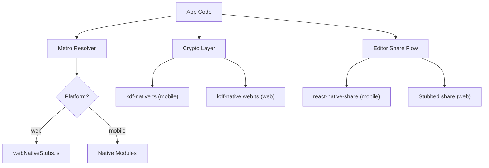
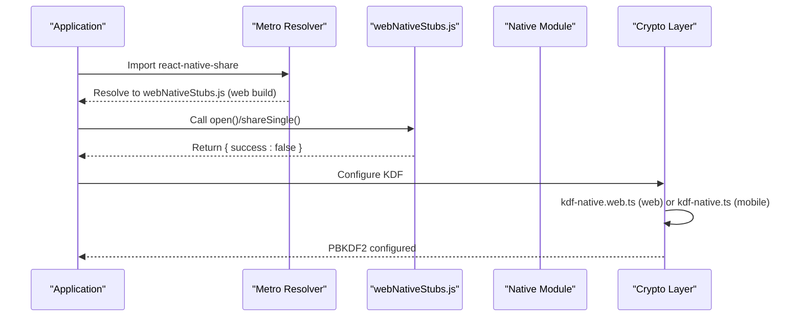
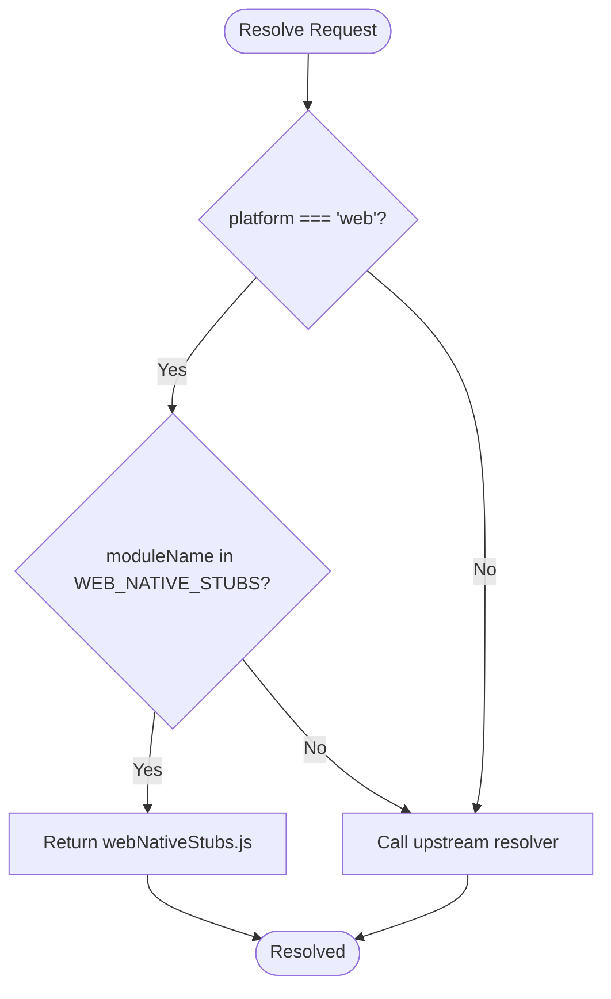
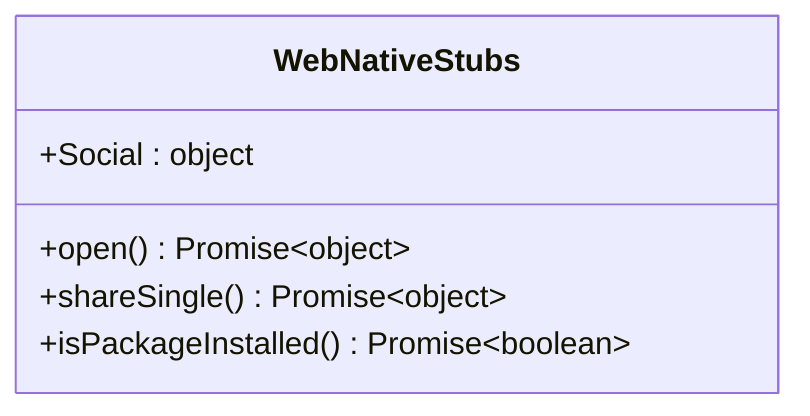
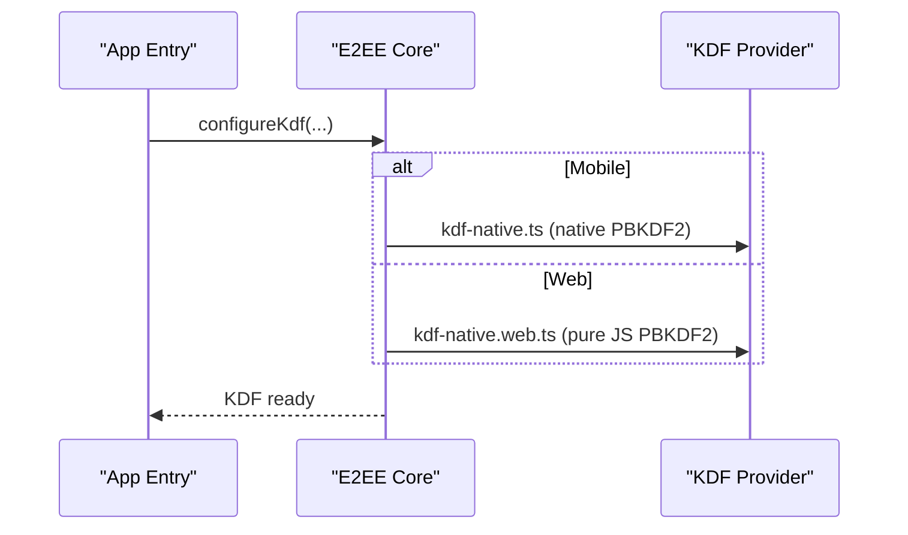
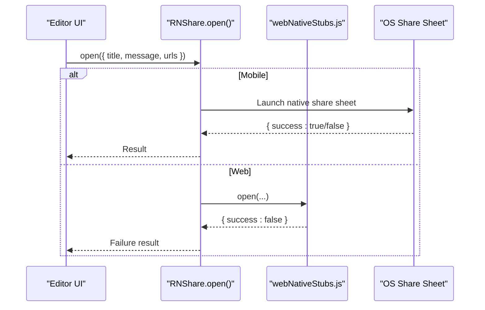
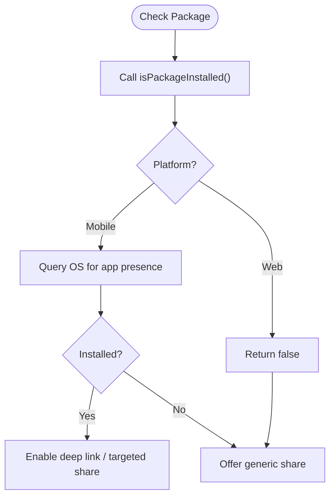
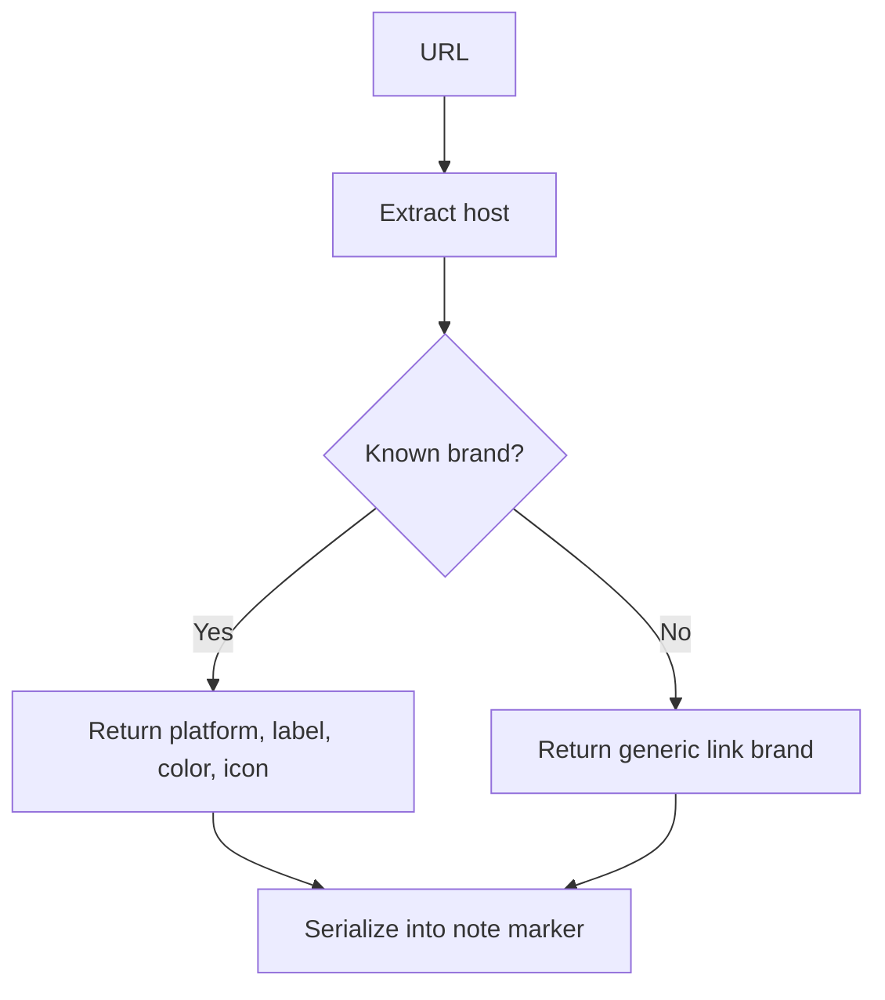
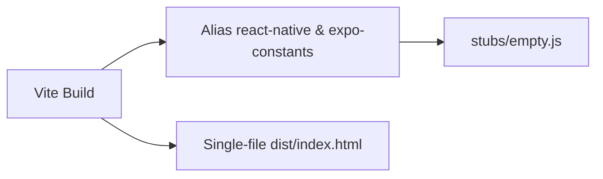
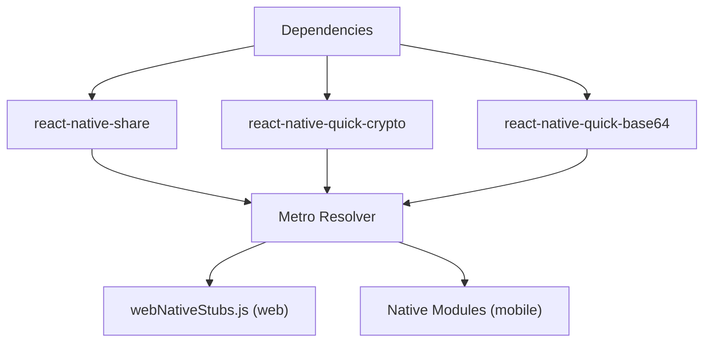

# Web Compatibility

<cite>
**Referenced Files in This Document**
- [metro.config.js](file://metro.config.js)
- [src/webNativeStubs.js](file://src/webNativeStubs.js)
- [webEditor/vite.config.ts](file://webEditor/vite.config.ts)
- [webEditor/stubs/empty.js](file://webEditor/stubs/empty.js)
- [src/crypto/kdf-native.ts](file://src/crypto/kdf-native.ts)
- [src/crypto/kdf-native.web.ts](file://src/crypto/kdf-native.web.ts)
- [app/editor.tsx](file://app/editor.tsx)
- [src/components/ShareIntentHandler.tsx](file://src/components/ShareIntentHandler.tsx)
- [src/share/socialSource.ts](file://src/share/socialSource.ts)
- [package.json](file://package.json)
</cite>

## Table of Contents
1. [Introduction](#introduction)
2. [Project Structure](#project-structure)
3. [Core Components](#core-components)
4. [Architecture Overview](#architecture-overview)
5. [Detailed Component Analysis](#detailed-component-analysis)
6. [Dependency Analysis](#dependency-analysis)
7. [Performance Considerations](#performance-considerations)
8. [Troubleshooting Guide](#troubleshooting-guide)
9. [Conclusion](#conclusion)

## Introduction
This document explains how the application maintains functionality across platforms by using a web compatibility layer. It covers:
- Metro bundler configuration that swaps native-only modules for safe stubs on web builds
- The stub pattern used to gracefully degrade features when native capabilities are unavailable
- Platform-specific implementations for cryptographic primitives and share flows
- How file sharing, package detection, and social integration behave differently on web versus mobile

The goal is to ensure the app runs on web without crashing while preserving core UX through fallback behaviors.

## Project Structure
At a high level, the web compatibility strategy spans three areas:
- Metro resolver overrides to intercept native-only imports during web builds
- Stub modules that provide no-op or safe defaults for missing native APIs
- Platform-specific files selected by Metro based on platform suffixes (e.g., .native.ts vs .web.ts)

**Diagram sources**
- [metro.config.js:14-31](file://metro.config.js#L14-L31)
- [src/webNativeStubs.js:1-12](file://src/webNativeStubs.js#L1-L12)
- [src/crypto/kdf-native.ts:1-22](file://src/crypto/kdf-native.ts#L1-L22)
- [src/crypto/kdf-native.web.ts:1-16](file://src/crypto/kdf-native.web.ts#L1-L16)
- [app/editor.tsx:1696-1727](file://app/editor.tsx#L1696-L1727)

**Section sources**
- [metro.config.js:1-37](file://metro.config.js#L1-L37)
- [src/webNativeStubs.js:1-12](file://src/webNativeStubs.js#L1-L12)
- [src/crypto/kdf-native.ts:1-22](file://src/crypto/kdf-native.ts#L1-L22)
- [src/crypto/kdf-native.web.ts:1-16](file://src/crypto/kdf-native.web.ts#L1-L16)
- [app/editor.tsx:1696-1727](file://app/editor.tsx#L1696-L1727)

## Core Components
- Metro resolver override: Intercepts specific native-only packages during web builds and resolves them to a single stub module.
- Web native stubs: Exports minimal functions that return safe defaults so calling code can continue without errors.
- Platform-specific crypto: Uses a native PBKDF2 implementation on mobile and a pure-JS implementation on web via Metro’s platform resolution.
- Editor share flow: On mobile, uses a native share sheet with attachments; on web, falls back to stub behavior.
- Social source detection: Pure logic that works identically on all platforms, enabling consistent handling of shared URLs.

**Section sources**
- [metro.config.js:14-31](file://metro.config.js#L14-L31)
- [src/webNativeStubs.js:1-12](file://src/webNativeStubs.js#L1-L12)
- [src/crypto/kdf-native.ts:1-22](file://src/crypto/kdf-native.ts#L1-L22)
- [src/crypto/kdf-native.web.ts:1-16](file://src/crypto/kdf-native.web.ts#L1-L16)
- [app/editor.tsx:1696-1727](file://app/editor.tsx#L1696-L1727)
- [src/share/socialSource.ts:1-164](file://src/share/socialSource.ts#L1-L164)

## Architecture Overview
The web compatibility architecture relies on two complementary mechanisms:
- Build-time resolution: Metro selects platform-specific files and redirects known native-only modules to stubs when building for web.
- Runtime degradation: Callers handle stub results gracefully, often treating failures as “not available” rather than fatal errors.

**Diagram sources**
- [metro.config.js:14-31](file://metro.config.js#L14-L31)
- [src/webNativeStubs.js:1-12](file://src/webNativeStubs.js#L1-L12)
- [src/crypto/kdf-native.ts:1-22](file://src/crypto/kdf-native.ts#L1-L22)
- [src/crypto/kdf-native.web.ts:1-16](file://src/crypto/kdf-native.web.ts#L1-L16)

## Detailed Component Analysis

### Metro Bundler Configuration for Conditional Imports
- Purpose: Prevent web bundles from loading native-only modules that crash at import time due to TurboModuleRegistry usage.
- Mechanism:
  - Maintains a set of native-only packages to intercept.
  - Overrides the resolver to return a stub file path when platform is web.
  - Falls back to default resolution otherwise.
- Impact: Ensures web builds avoid native dependencies entirely for those packages.

**Diagram sources**
- [metro.config.js:14-31](file://metro.config.js#L14-L31)

**Section sources**
- [metro.config.js:14-31](file://metro.config.js#L14-L31)

### Web Native Stubs Pattern
- Purpose: Provide safe defaults for native-only APIs so callers do not need platform checks everywhere.
- Implementation:
  - Exports an empty object plus a default export with methods like open, shareSingle, and isPackageInstalled returning safe values.
  - Exposes a Social namespace placeholder to satisfy imports expecting it.
- Usage:
  - Any code importing these modules on web receives non-crashing, no-op behavior.

**Diagram sources**
- [src/webNativeStubs.js:1-12](file://src/webNativeStubs.js#L1-L12)

**Section sources**
- [src/webNativeStubs.js:1-12](file://src/webNativeStubs.js#L1-L12)

### Platform-Specific Cryptography
- Mobile path:
  - Uses a native PBKDF2 implementation for performance-critical key derivation.
  - Configured once at app entry to register the KDF globally.
- Web path:
  - Uses a pure-JS PBKDF2 implementation via a library suitable for browsers.
  - Slightly slower but acceptable for local web runs and screenshots.
- Resolution:
  - Metro selects kdf-native.ts on mobile and kdf-native.web.ts on web automatically based on file extension.

**Diagram sources**
- [src/crypto/kdf-native.ts:1-22](file://src/crypto/kdf-native.ts#L1-L22)
- [src/crypto/kdf-native.web.ts:1-16](file://src/crypto/kdf-native.web.ts#L1-L16)

**Section sources**
- [src/crypto/kdf-native.ts:1-22](file://src/crypto/kdf-native.ts#L1-L22)
- [src/crypto/kdf-native.web.ts:1-16](file://src/crypto/kdf-native.web.ts#L1-L16)

### File Sharing: Mobile vs Web
- Mobile:
  - Uses a native share sheet to attach multiple files and text in one prompt.
  - Writes embedded images to temporary files and downloads attachments before sharing.
  - Tracks share method (email, message, social, link) for analytics.
- Web:
  - The same import is resolved to the web stub, which returns a failure result.
  - Callers should treat this as “sharing unavailable” and optionally offer alternative actions (e.g., copy link).

**Diagram sources**
- [app/editor.tsx:1696-1727](file://app/editor.tsx#L1696-L1727)
- [src/webNativeStubs.js:1-12](file://src/webNativeStubs.js#L1-L12)

**Section sources**
- [app/editor.tsx:1696-1727](file://app/editor.tsx#L1696-L1727)
- [src/webNativeStubs.js:1-12](file://src/webNativeStubs.js#L1-L12)

### Package Detection: Mobile vs Web
- Mobile:
  - Can call isPackageInstalled to check if a target app is present before deep-linking or sharing.
- Web:
  - The stub returns false, indicating the package is not installed.
  - Callers should disable platform-specific actions or fall back to generic options.

**Diagram sources**
- [src/webNativeStubs.js:1-12](file://src/webNativeStubs.js#L1-L12)

**Section sources**
- [src/webNativeStubs.js:1-12](file://src/webNativeStubs.js#L1-L12)

### Social Integration: URL Recognition and Branding
- Behavior:
  - Detects social platforms from URLs and provides branding metadata (label, color, icon).
  - Works identically on web and mobile because it is pure logic without native dependencies.
  - Serializes a compact marker into note content to preserve social post context.
- Use cases:
  - When users share links from social apps, the editor can render branded cards consistently across platforms.

**Diagram sources**
- [src/share/socialSource.ts:60-89](file://src/share/socialSource.ts#L60-L89)
- [src/share/socialSource.ts:120-164](file://src/share/socialSource.ts#L120-L164)

**Section sources**
- [src/share/socialSource.ts:1-164](file://src/share/socialSource.ts#L1-L164)

### Web Editor Build-Time Stubs
- Purpose: Ensure the embedded web editor bundle does not pull in native modules during Vite build.
- Mechanism:
  - Aliases expo-constants and react-native to an empty stub module.
  - Forces mainFields and conditions to prefer browser-friendly builds.
- Outcome: Produces a self-contained HTML bundle that avoids native code paths.

**Diagram sources**
- [webEditor/vite.config.ts:15-31](file://webEditor/vite.config.ts#L15-L31)
- [webEditor/stubs/empty.js:1-8](file://webEditor/stubs/empty.js#L1-L8)

**Section sources**
- [webEditor/vite.config.ts:1-40](file://webEditor/vite.config.ts#L1-L40)
- [webEditor/stubs/empty.js:1-8](file://webEditor/stubs/empty.js#L1-L8)

## Dependency Analysis
Key dependencies and their role in web compatibility:
- react-native-share: Intercepted by Metro on web to resolve to webNativeStubs.js.
- react-native-quick-crypto and react-native-quick-base64: Also intercepted to prevent native crashes on web.
- Platform-specific crypto modules: Selected by Metro based on file extensions (.native.ts vs .web.ts).
- Social source utilities: No platform dependencies; work uniformly across environments.

**Diagram sources**
- [metro.config.js:14-31](file://metro.config.js#L14-L31)
- [package.json:88-96](file://package.json#L88-L96)

**Section sources**
- [metro.config.js:14-31](file://metro.config.js#L14-L31)
- [package.json:88-96](file://package.json#L88-L96)

## Performance Considerations
- Crypto KDF:
  - Mobile uses native PBKDF2 for speed; web uses pure JS which is slower but acceptable for development and local runs.
- Metro workers:
  - Reduced worker count to lower resource usage during builds.
- Web editor bundle:
  - Inlined assets and disabled code splitting to produce a single file suitable for embedding in a WebView.

[No sources needed since this section provides general guidance]

## Troubleshooting Guide
Common issues and resolutions:
- Web build crashes on import of native modules:
  - Verify Metro resolver includes the native-only packages in the interception set and points to the stub.
- Share fails silently on web:
  - Expect stub to return failure; implement fallback UX such as copying a link or showing a notice.
- Slow login on web due to KDF:
  - Understand that web uses pure JS PBKDF2; acceptable for dev/screenshot builds but not a substitute for native performance on device.
- Web editor fails to load:
  - Confirm Vite aliases map to empty stubs and that mainFields/conditions prioritize browser builds.

**Section sources**
- [metro.config.js:14-31](file://metro.config.js#L14-L31)
- [src/webNativeStubs.js:1-12](file://src/webNativeStubs.js#L1-L12)
- [src/crypto/kdf-native.web.ts:1-16](file://src/crypto/kdf-native.web.ts#L1-L16)
- [webEditor/vite.config.ts:15-31](file://webEditor/vite.config.ts#L15-L31)

## Conclusion
The application achieves cross-platform compatibility through a layered approach:
- Metro-level interception replaces native-only modules with safe stubs on web.
- Platform-specific implementations provide optimal behavior on mobile while maintaining graceful degradation on web.
- Pure logic components (like social source detection) remain consistent across platforms.
Together, these strategies ensure the app remains functional and user-friendly regardless of environment, with clear upgrade paths for adding richer web experiences where appropriate.