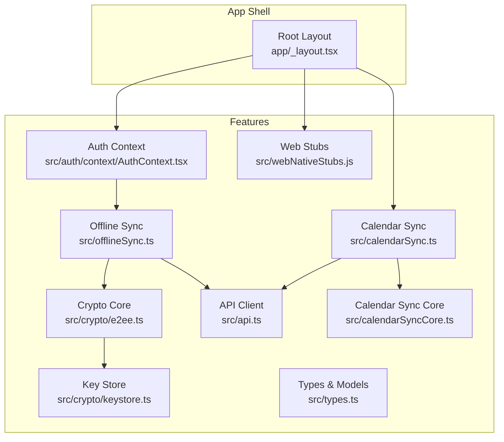
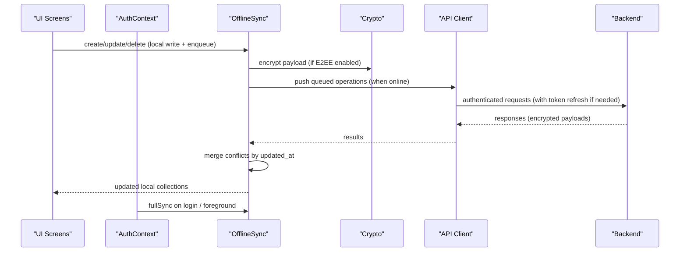
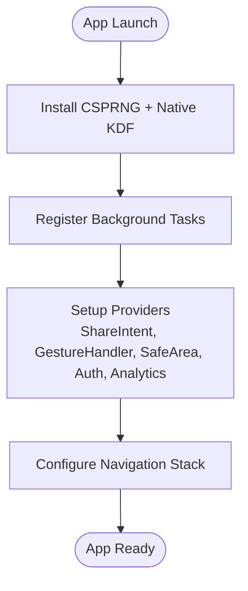
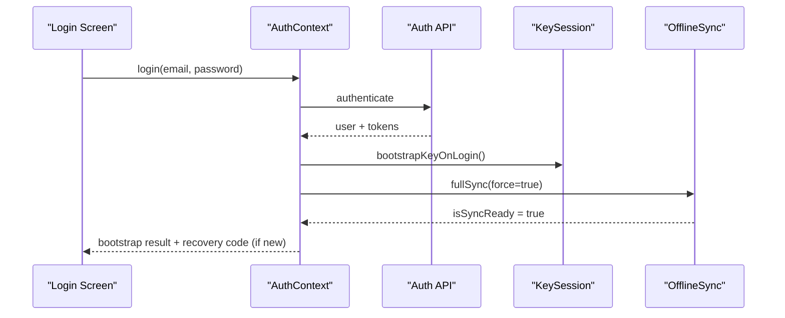
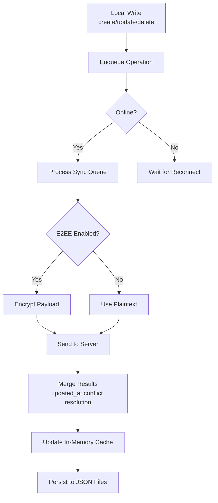
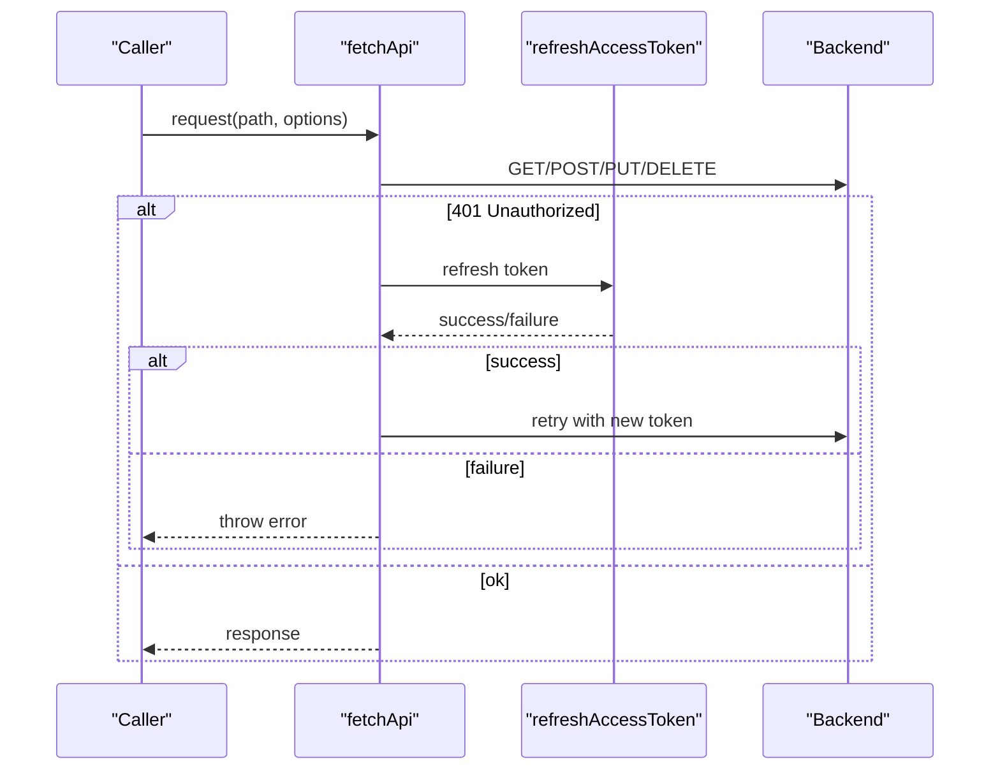
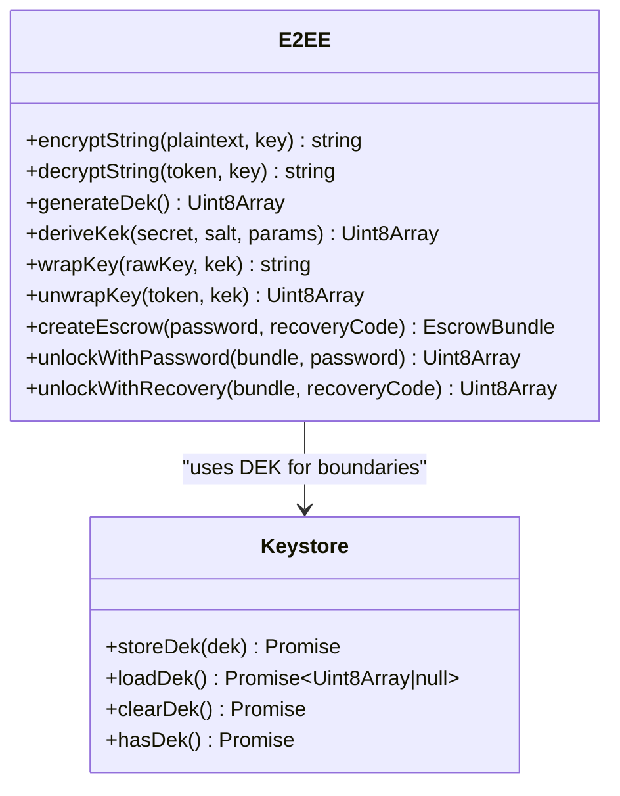
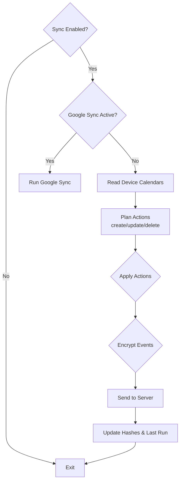
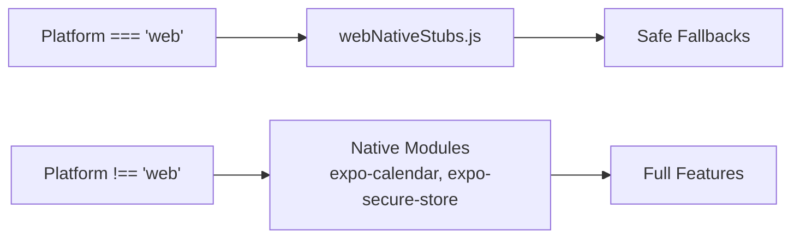
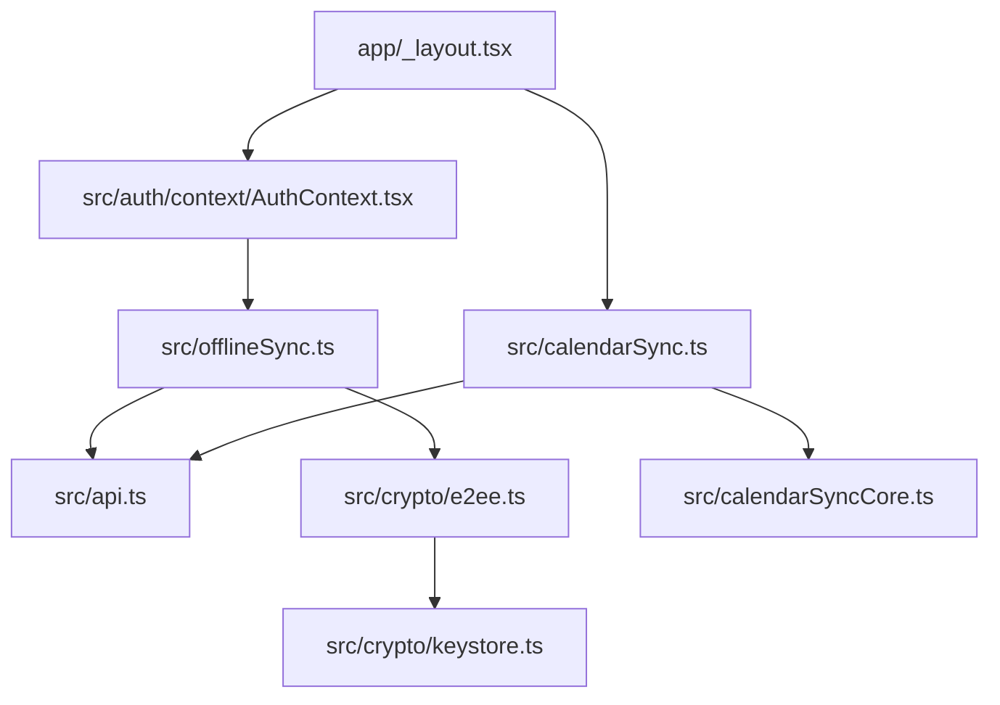

# System Overview

<cite>
**Referenced Files in This Document**
- [package.json](file://package.json)
- [app.config.js](file://app.config.js)
- [README.md](file://README.md)
- [app/_layout.tsx](file://app/_layout.tsx)
- [src/types.ts](file://src/types.ts)
- [src/offlineSync.ts](file://src/offlineSync.ts)
- [src/crypto/e2ee.ts](file://src/crypto/e2ee.ts)
- [src/crypto/keystore.ts](file://src/crypto/keystore.ts)
- [src/auth/context/AuthContext.tsx](file://src/auth/context/AuthContext.tsx)
- [src/api.ts](file://src/api.ts)
- [src/calendarSyncCore.ts](file://src/calendarSyncCore.ts)
- [src/calendarSync.ts](file://src/calendarSync.ts)
- [src/webNativeStubs.js](file://src/webNativeStubs.js)
</cite>

## Table of Contents
1. Introduction
2. Project Structure
3. Core Components
4. Architecture Overview
5. Detailed Component Analysis
6. Dependency Analysis
7. Performance Considerations
8. Troubleshooting Guide
9. Conclusion

## Introduction
This document provides a comprehensive overview of the Nueco frontend system. It explains the high-level architecture built around an offline-first pattern, modular feature organization, and cross-platform design using React Native with Expo and TypeScript. It also documents the zero-knowledge end-to-end encryption (E2EE) approach and how it integrates into the core data flow, as well as platform abstractions that keep native-only features safe on web builds.

## Project Structure
Nueco uses Expo Router’s file-based routing under app/, with feature modules organized under src/. The root layout wires up global providers, navigation, background tasks, and crypto initialization. Feature areas include:
- Authentication and user session management
- Offline storage and sync queue for notes, events, and trips
- Zero-knowledge encryption for notes, events, trips, and attachments
- Calendar synchronization (device calendar and Google Calendar)
- API client layer with token refresh, paging, and caching
- Platform abstractions to support web builds while preserving native capabilities on mobile

**Diagram sources**
- [app/_layout.tsx:1-102](file://app/_layout.tsx#L1-L102)
- [src/auth/context/AuthContext.tsx:1-259](file://src/auth/context/AuthContext.tsx#L1-L259)
- [src/offlineSync.ts:1-800](file://src/offlineSync.ts#L1-L800)
- [src/crypto/e2ee.ts:1-228](file://src/crypto/e2ee.ts#L1-L228)
- [src/crypto/keystore.ts:1-53](file://src/crypto/keystore.ts#L1-L53)
- [src/api.ts:1-559](file://src/api.ts#L1-L559)
- [src/calendarSync.ts:1-199](file://src/calendarSync.ts#L1-L199)
- [src/calendarSyncCore.ts:1-149](file://src/calendarSyncCore.ts#L1-L149)
- [src/webNativeStubs.js:1-12](file://src/webNativeStubs.js#L1-L12)

**Section sources**
- [README.md:1-51](file://README.md#L1-L51)
- [app/_layout.tsx:1-102](file://app/_layout.tsx#L1-L102)

## Core Components
- Root layout and app bootstrap: Initializes secure random values, registers native KDF, sets up background tasks, share intents, notifications, and navigation stack.
- Authentication context: Manages login, logout, token refresh, E2EE key bootstrap, full sync orchestration, and post-login flows.
- Offline sync manager: Local-first persistence with JSON files, sync queue, conflict resolution by timestamps, and background reconciliation.
- API client: Centralized fetch wrapper with auth headers, token refresh, timeouts, paging, and per-feature endpoints.
- Crypto subsystem: Zero-knowledge encryption using AES-GCM, PBKDF2-derived KEKs, DEK escrow, and secure local storage via OS keystore.
- Calendar sync: Device calendar and Google Calendar integration with conservative deletion rules and throttling.
- Types and models: Shared interfaces for notes, events, trips, attachments, and voice intents.

**Section sources**
- [app/_layout.tsx:1-102](file://app/_layout.tsx#L1-L102)
- [src/auth/context/AuthContext.tsx:1-259](file://src/auth/context/AuthContext.tsx#L1-L259)
- [src/offlineSync.ts:1-800](file://src/offlineSync.ts#L1-L800)
- [src/api.ts:1-559](file://src/api.ts#L1-L559)
- [src/crypto/e2ee.ts:1-228](file://src/crypto/e2ee.ts#L1-L228)
- [src/crypto/keystore.ts:1-53](file://src/crypto/keystore.ts#L1-L53)
- [src/calendarSync.ts:1-199](file://src/calendarSync.ts#L1-L199)
- [src/calendarSyncCore.ts:1-149](file://src/calendarSyncCore.ts#L1-L149)
- [src/types.ts:1-125](file://src/types.ts#L1-L125)

## Architecture Overview
The system follows an offline-first pattern:
- All writes are persisted locally first (notes, events, trips), then enqueued for server sync when online.
- A sync queue persists operations and retries them on reconnect or background runs.
- Full sync reconciles local state with the server using timestamp-based conflict resolution.
- E2EE ensures the server never sees plaintext; data is encrypted on-device before upload and decrypted on-device after download.
- Calendar sync bridges device calendars and Nueco events with safety checks to avoid accidental deletions.

**Diagram sources**
- [src/offlineSync.ts:417-783](file://src/offlineSync.ts#L417-L783)
- [src/api.ts:84-121](file://src/api.ts#L84-L121)
- [src/crypto/e2ee.ts:116-158](file://src/crypto/e2ee.ts#L116-L158)
- [src/auth/context/AuthContext.tsx:147-177](file://src/auth/context/AuthContext.tsx#L147-L177)

## Detailed Component Analysis

### Root Layout and App Bootstrap
- Installs a secure CSPRNG and registers native PBKDF2 for performance.
- Registers background calendar sync task at module scope so it can run headlessly.
- Sets up share intent handling, notification handlers, and analytics provider.
- Defines the navigation stack with screens and transitions.

**Diagram sources**
- [app/_layout.tsx:1-102](file://app/_layout.tsx#L1-L102)

**Section sources**
- [app/_layout.tsx:1-102](file://app/_layout.tsx#L1-L102)

### Authentication and Session Management
- Handles login, token refresh, and session recovery across app restarts.
- Orchestrates E2EE key bootstrap, full sync, migrations, and permission prompts.
- Ensures calendar permissions are requested early after login.
- On logout, flushes pending sync operations and clears E2EE keys and calendar sync state.

**Diagram sources**
- [src/auth/context/AuthContext.tsx:147-177](file://src/auth/context/AuthContext.tsx#L147-L177)
- [src/auth/context/AuthContext.tsx:206-228](file://src/auth/context/AuthContext.tsx#L206-L228)

**Section sources**
- [src/auth/context/AuthContext.tsx:1-259](file://src/auth/context/AuthContext.tsx#L1-L259)

### Offline Sync Manager
- Persists large collections to JSON files to avoid AsyncStorage row-size limits.
- Maintains an in-memory cache with shallow copies to prevent mutation issues.
- Uses a mutex to serialize note read-modify-write cycles and alias maps to handle ID swaps during sync.
- Enqueues create/update/delete operations and processes them when online; supports immediate pushes for specific flows.
- Performs full sync with throttling and merges server data using updated_at timestamps.

**Diagram sources**
- [src/offlineSync.ts:112-193](file://src/offlineSync.ts#L112-L193)
- [src/offlineSync.ts:207-244](file://src/offlineSync.ts#L207-L244)
- [src/offlineSync.ts:365-415](file://src/offlineSync.ts#L365-L415)
- [src/offlineSync.ts:417-783](file://src/offlineSync.ts#L417-L783)

**Section sources**
- [src/offlineSync.ts:1-800](file://src/offlineSync.ts#L1-L800)

### API Client Layer
- Centralizes HTTP requests with automatic authentication headers and token refresh.
- Implements single-flight token refresh to avoid concurrent refresh races.
- Adds request timeouts to prevent hung syncs from blocking future operations.
- Provides paged collection pulls and caches monthly event lists to reduce redundant decrypt work.
- Supports attachment uploads with presigned URLs and optional client-side encryption.

**Diagram sources**
- [src/api.ts:15-72](file://src/api.ts#L15-L72)
- [src/api.ts:84-121](file://src/api.ts#L84-L121)
- [src/api.ts:123-138](file://src/api.ts#L123-L138)
- [src/api.ts:169-208](file://src/api.ts#L169-L208)
- [src/api.ts:283-354](file://src/api.ts#L283-L354)

**Section sources**
- [src/api.ts:1-559](file://src/api.ts#L1-L559)

### Zero-Knowledge Encryption Integration
- Uses AES-GCM for authenticated encryption and PBKDF2-derived KEKs for key wrapping.
- Stores the Data Encryption Key (DEK) securely in the OS keystore via SecureStore; web builds have no-op behavior.
- Integrates encryption boundaries at sync time: notes, events, trips, and attachments are encrypted before upload and decrypted after download.
- Supports recovery codes and password-based unlocking without exposing plaintext to the server.

**Diagram sources**
- [src/crypto/e2ee.ts:1-228](file://src/crypto/e2ee.ts#L1-L228)
- [src/crypto/keystore.ts:1-53](file://src/crypto/keystore.ts#L1-L53)

**Section sources**
- [src/crypto/e2ee.ts:1-228](file://src/crypto/e2ee.ts#L1-L228)
- [src/crypto/keystore.ts:1-53](file://src/crypto/keystore.ts#L1-L53)

### Calendar Synchronization
- Reads device calendars (or uses Google Calendar sync when active) and plans create/update/delete actions conservatively.
- Throttles runs and uses a storage-based lock to avoid overlapping background tasks.
- Deletes Nueco events only when calendar selection is unchanged and the device fetch returns events, preventing accidental mass deletes.
- Encrypts event payloads before sending to the server and leverages the offline queue for durability.

**Diagram sources**
- [src/calendarSync.ts:47-199](file://src/calendarSync.ts#L47-L199)
- [src/calendarSyncCore.ts:87-149](file://src/calendarSyncCore.ts#L87-L149)

**Section sources**
- [src/calendarSync.ts:1-199](file://src/calendarSync.ts#L1-L199)
- [src/calendarSyncCore.ts:1-149](file://src/calendarSyncCore.ts#L1-L149)

### Platform Abstractions
- Web builds use minimal stubs for native-only modules to prevent runtime crashes.
- Calendar sync and other native features gracefully degrade on web by checking platform and returning empty or no-op results.
- Secure store operations are no-ops on web, ensuring E2EE remains native-only where supported.

**Diagram sources**
- [src/webNativeStubs.js:1-12](file://src/webNativeStubs.js#L1-L12)
- [src/calendarSync.ts:26-29](file://src/calendarSync.ts#L26-L29)
- [src/crypto/keystore.ts:14-41](file://src/crypto/keystore.ts#L14-L41)

**Section sources**
- [src/webNativeStubs.js:1-12](file://src/webNativeStubs.js#L1-L12)
- [src/calendarSync.ts:1-199](file://src/calendarSync.ts#L1-L199)
- [src/crypto/keystore.ts:1-53](file://src/crypto/keystore.ts#L1-L53)

## Dependency Analysis
- Root layout depends on auth, analytics, components, notifications, audio cleanup, and offline repair utilities.
- AuthContext orchestrates login workflow, E2EE key bootstrap, full sync, and migrations.
- OfflineSync depends on API clients, crypto modules, and sync merge logic.
- Calendar sync depends on device calendar APIs, Google sync, and offline operations.
- API client depends on auth storage, crypto decryption, and paging utilities.

**Diagram sources**
- [app/_layout.tsx:1-102](file://app/_layout.tsx#L1-L102)
- [src/auth/context/AuthContext.tsx:1-259](file://src/auth/context/AuthContext.tsx#L1-L259)
- [src/offlineSync.ts:1-800](file://src/offlineSync.ts#L1-L800)
- [src/api.ts:1-559](file://src/api.ts#L1-L559)
- [src/crypto/e2ee.ts:1-228](file://src/crypto/e2ee.ts#L1-L228)
- [src/crypto/keystore.ts:1-53](file://src/crypto/keystore.ts#L1-L53)
- [src/calendarSync.ts:1-199](file://src/calendarSync.ts#L1-L199)
- [src/calendarSyncCore.ts:1-149](file://src/calendarSyncCore.ts#L1-L149)

**Section sources**
- [package.json:1-125](file://package.json#L1-L125)
- [app.config.js:1-57](file://app.config.js#L1-L57)

## Performance Considerations
- Large collections are persisted to JSON files to avoid AsyncStorage row-size limits and improve reliability.
- In-memory caches return shallow copies to prevent mutation side effects and reduce repeated parsing costs.
- Full sync is throttled to avoid competing with UI transitions and heavy decrypt loops.
- Token refresh is single-flighted to prevent concurrent refresh races and reduce unnecessary network calls.
- Request timeouts prevent hung requests from blocking the entire sync pipeline.
- Monthly event list caching reduces redundant decrypt work across multiple callers.

[No sources needed since this section provides general guidance]

## Troubleshooting Guide
- If sync appears stuck, check for hung requests due to missing timeouts; ensure fetchApi timeout is active.
- If notes disappear after adding images, verify the notes mutex and alias map are functioning to serialize writes and resolve temp IDs.
- If calendar sync deletes events unexpectedly, confirm calendar selection tracking and hash-based change detection are intact.
- If E2EE fails on web, remember SecureStore is a no-op; encryption boundaries will not load a DEK on web.
- If token refresh fails repeatedly, inspect 401 handling and ensure refresh token storage is consistent.

**Section sources**
- [src/api.ts:84-121](file://src/api.ts#L84-L121)
- [src/offlineSync.ts:207-244](file://src/offlineSync.ts#L207-L244)
- [src/calendarSync.ts:133-199](file://src/calendarSync.ts#L133-L199)
- [src/crypto/keystore.ts:14-41](file://src/crypto/keystore.ts#L14-L41)

## Conclusion
Nueco’s frontend implements a robust offline-first architecture with strong security through zero-knowledge encryption. The modular design separates concerns across authentication, sync, crypto, API, and calendar features, while platform abstractions ensure safe operation on both mobile and web. The system balances performance and reliability through careful caching, throttling, and durable queues, providing a resilient user experience even under poor connectivity.

[No sources needed since this section summarizes without analyzing specific files]