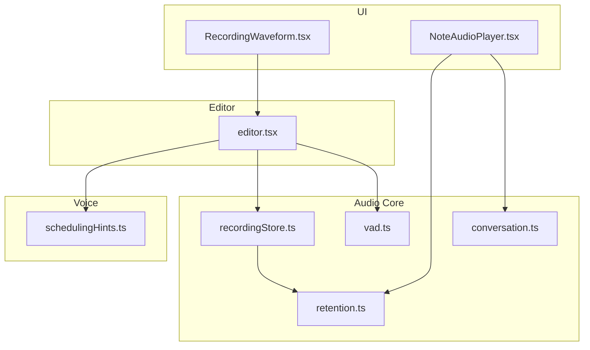
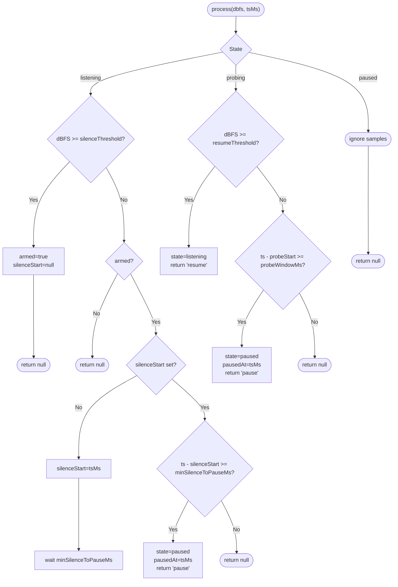
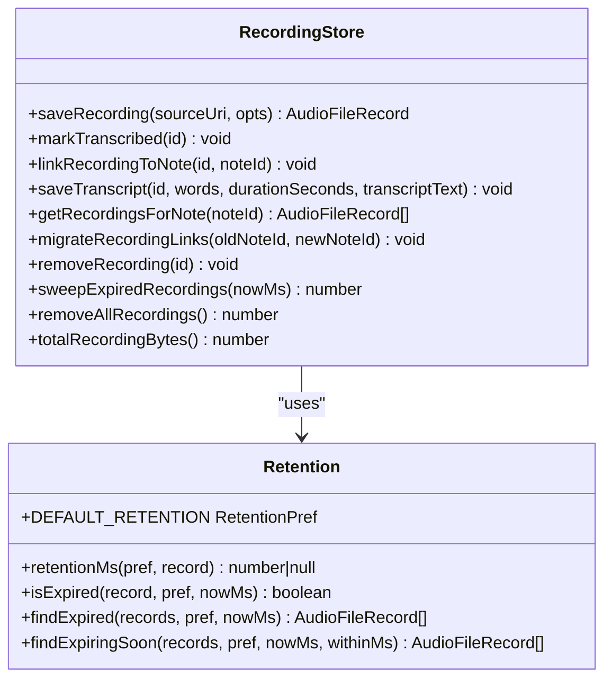
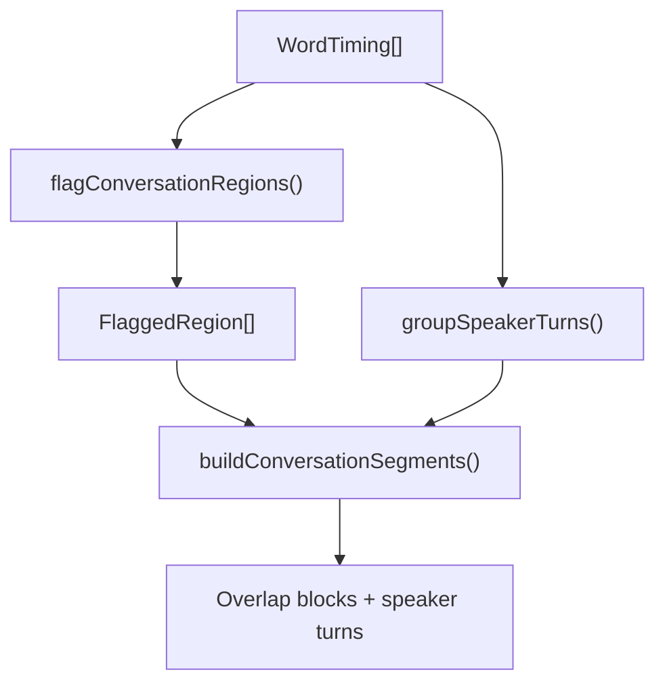
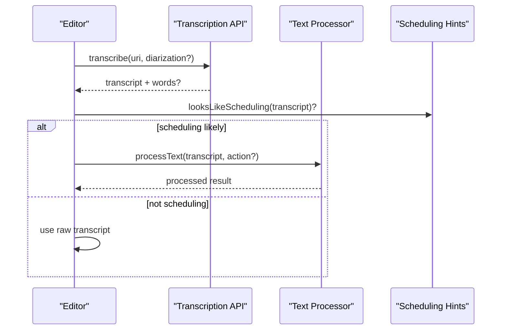
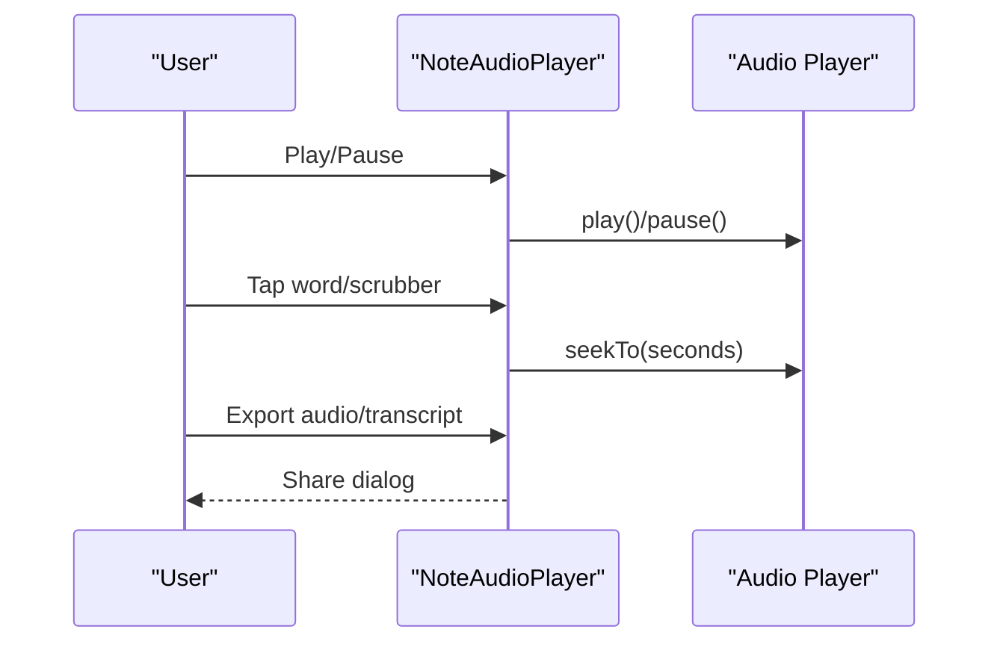
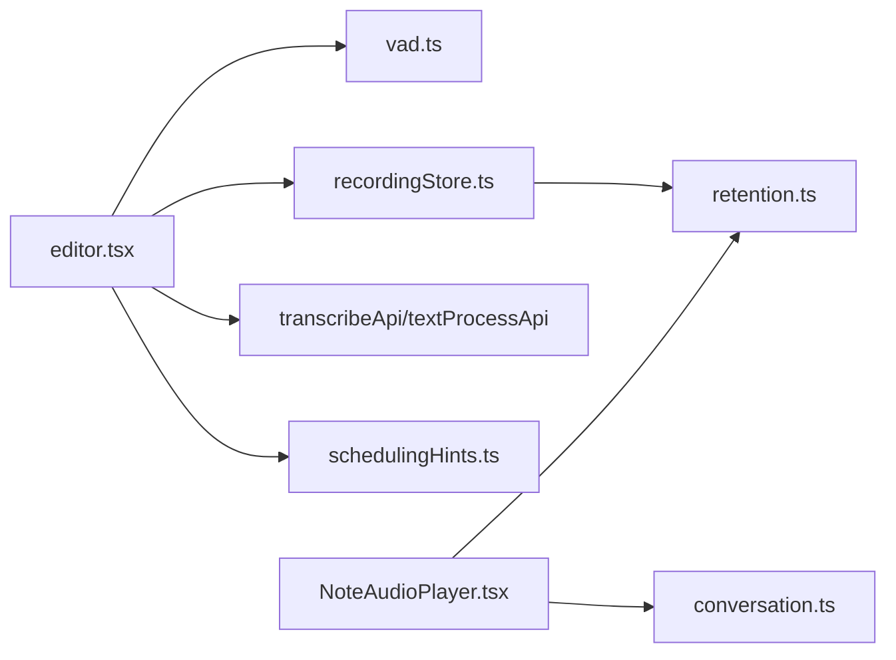

# Audio Processing

<cite>
**Referenced Files in This Document**
- [editor.tsx](file://app/editor.tsx)
- [vad.ts](file://src/audio/vad.ts)
- [recordingStore.ts](file://src/audio/recordingStore.ts)
- [retention.ts](file://src/audio/retention.ts)
- [conversation.ts](file://src/audio/conversation.ts)
- [RecordingWaveform.tsx](file://src/components/RecordingWaveform.tsx)
- [NoteAudioPlayer.tsx](file://src/components/NoteAudioPlayer.tsx)
- [schedulingHints.ts](file://src/voice/schedulingHints.ts)
</cite>

## Table of Contents
1. [Introduction](#introduction)
2. [Project Structure](#project-structure)
3. [Core Components](#core-components)
4. [Architecture Overview](#architecture-overview)
5. [Detailed Component Analysis](#detailed-component-analysis)
6. [Dependency Analysis](#dependency-analysis)
7. [Performance Considerations](#performance-considerations)
8. [Troubleshooting Guide](#troubleshooting-guide)
9. [Conclusion](#conclusion)

## Introduction
This document explains the audio processing and voice recording system, focusing on:
- Recording workflow with permission handling, file management, and quality settings
- Voice activity detection (VAD) for efficient silence handling
- Speech-to-text integration and language preferences
- Conversation processing pipeline that turns recordings into structured note content
- Retention policies, storage optimization, and cleanup strategies
- Examples of workflows and troubleshooting guidance for permissions, device compatibility, and performance

## Project Structure
The audio subsystem spans UI components, core logic, and storage utilities:
- Editor orchestrates recording, transcription, and note creation
- VAD controls pause/resume based on silence thresholds
- Recording store manages local files, manifest, retention, and transcript metadata
- Retention module defines policies and helpers
- Conversation module flags overlaps and groups speaker turns
- Player and waveform components render playback and live metering



**Diagram sources**
- [editor.tsx](file://app/editor.tsx)
- [vad.ts](file://src/audio/vad.ts)
- [conversation.ts](file://src/audio/conversation.ts)
- [retention.ts](file://src/audio/retention.ts)
- [recordingStore.ts](file://src/audio/recordingStore.ts)
- [RecordingWaveform.tsx](file://src/components/RecordingWaveform.tsx)
- [NoteAudioPlayer.tsx](file://src/components/NoteAudioPlayer.tsx)
- [schedulingHints.ts](file://src/voice/schedulingHints.ts)

**Section sources**
- [editor.tsx](file://app/editor.tsx)
- [vad.ts](file://src/audio/vad.ts)
- [recordingStore.ts](file://src/audio/recordingStore.ts)
- [retention.ts](file://src/audio/retention.ts)
- [conversation.ts](file://src/audio/conversation.ts)
- [RecordingWaveform.tsx](file://src/components/RecordingWaveform.tsx)
- [NoteAudioPlayer.tsx](file://src/components/NoteAudioPlayer.tsx)
- [schedulingHints.ts](file://src/voice/schedulingHints.ts)

## Core Components
- VAD: Pauses recording during extended silence and probes to resume when speech is detected
- Recording Store: Persists captured files, maintains a JSON manifest, links to notes, saves transcripts, and enforces retention
- Retention: Defines policy options and expiration rules, including stricter limits for conversation-mode captures
- Conversation Logic: Flags overlap or low-confidence regions and groups words into speaker turns
- Player/Waveform: Renders playback, seek-by-word, speed control, export, and live metering
- Editor: Orchestrates permissions, recording, transcription, text processing, and note insertion
- Scheduling Hints: Local heuristic to decide whether to call server-side scheduling classification

**Section sources**
- [vad.ts](file://src/audio/vad.ts)
- [recordingStore.ts](file://src/audio/recordingStore.ts)
- [retention.ts](file://src/audio/retention.ts)
- [conversation.ts](file://src/audio/conversation.ts)
- [NoteAudioPlayer.tsx](file://src/components/NoteAudioPlayer.tsx)
- [RecordingWaveform.tsx](file://src/components/RecordingWaveform.tsx)
- [editor.tsx](file://app/editor.tsx)
- [schedulingHints.ts](file://src/voice/schedulingHints.ts)

## Architecture Overview
End-to-end flow from capture to note content:

```mermaid
sequenceDiagram
participant U as "User"
participant ED as "Editor"
participant REC as "Recorder"
participant VAD as "SilencePauseVad"
participant ST as "RecordingStore"
participant API as "Transcription API"
participant TP as "Text Processor"
participant NOTE as "Note Editor"
U->>ED : Start recording
ED->>REC : startRecording()
loop Metering
REC-->>VAD : dBFS samples
VAD-->>REC : pause/resume
end
U->>ED : Stop recording
ED->>ST : saveRecording(sourceUri, opts)
ED->>API : transcribe(uri, diarization?)
API-->>ED : transcript + words?
ED->>TP : processText(transcript, action?)
TP-->>ED : processed text
ED->>NOTE : insert/transcript/stream
ED->>ST : saveTranscript(id, words, duration, text)
ED->>ST : linkRecordingToNote(id, noteId)
```

**Diagram sources**
- [editor.tsx](file://app/editor.tsx)
- [vad.ts](file://src/audio/vad.ts)
- [recordingStore.ts](file://src/audio/recordingStore.ts)

## Detailed Component Analysis

### Voice Activity Detection (VAD)
- Strategy: Segment by pausing during extended silence; do not strip pauses from the file
- States: listening, paused, probing
- Thresholds: silence threshold, hysteresis for resume, minimum silence before pause
- Probing: periodically resume briefly while paused to detect speech and avoid getting stuck
- Configuration: arm-on-first-speech to keep recorder armed until user speaks



**Diagram sources**
- [vad.ts](file://src/audio/vad.ts)

**Section sources**
- [vad.ts](file://src/audio/vad.ts)

### Recording Storage and Retention
- File management: copies captured files into a managed directory and tracks them via a JSON manifest
- Manifest operations: read/write with a lock to prevent concurrent clobbering
- Transcript persistence: stores word timings, duration, and full transcript text per recording
- Linking: associates recordings with notes and migrates temporary IDs to server-assigned IDs
- Retention policy: supports immediate deletion after transcription, rolling 30-day window, or indefinite retention; conversation-mode recordings are capped at 24 hours regardless of preference
- Cleanup: sweeps expired files and removes manifest entries; bulk delete supported



**Diagram sources**
- [recordingStore.ts](file://src/audio/recordingStore.ts)
- [retention.ts](file://src/audio/retention.ts)

**Section sources**
- [recordingStore.ts](file://src/audio/recordingStore.ts)
- [retention.ts](file://src/audio/retention.ts)

### Conversation Processing Pipeline
- Flagging: marks regions where speakers overlap or confidence is low
- Grouping: builds contiguous speaker turns for display
- Player rendering: shows overlap blocks without fabricated attribution; allows renaming speakers locally for the session



**Diagram sources**
- [conversation.ts](file://src/audio/conversation.ts)
- [NoteAudioPlayer.tsx](file://src/components/NoteAudioPlayer.tsx)

**Section sources**
- [conversation.ts](file://src/audio/conversation.ts)
- [NoteAudioPlayer.tsx](file://src/components/NoteAudioPlayer.tsx)

### Transcription and Text Processing Integration
- The editor calls a transcription API with optional diarization for conversation mode
- If diarization is unavailable, a message informs the user that the capture was transcribed as single voice
- After transcription, the editor can call a text processor to transform raw transcript into structured actions or note content
- A local heuristic decides whether to invoke server-side scheduling classification to reduce latency for common cases



**Diagram sources**
- [editor.tsx](file://app/editor.tsx)
- [schedulingHints.ts](file://src/voice/schedulingHints.ts)

**Section sources**
- [editor.tsx](file://app/editor.tsx)
- [schedulingHints.ts](file://src/voice/schedulingHints.ts)

### User Interface: Waveform and Player
- Live waveform: polls metering values to show real-time audio levels, helping users confirm mic access and activity
- Player: provides play/pause, scrubber, speed control, tap-to-seek by word, export audio or transcript, and deletion
- For conversation-mode recordings, player renders flagged overlap blocks and speaker turns with optional rename



**Diagram sources**
- [NoteAudioPlayer.tsx](file://src/components/NoteAudioPlayer.tsx)
- [RecordingWaveform.tsx](file://src/components/RecordingWaveform.tsx)

**Section sources**
- [NoteAudioPlayer.tsx](file://src/components/NoteAudioPlayer.tsx)
- [RecordingWaveform.tsx](file://src/components/RecordingWaveform.tsx)

## Dependency Analysis
- Editor depends on:
  - VAD for pause/resume decisions
  - Recording store for persistence and retention enforcement
  - Transcription and text processing APIs
  - Scheduling hints to optimize network calls
- Player depends on:
  - Conversation logic to build segments
  - Retention utilities for formatting and time helpers
- Recording store depends on:
  - Retention policy to determine expiry
  - File system for copy/delete/read/write
  - Async storage for preferences



**Diagram sources**
- [editor.tsx](file://app/editor.tsx)
- [vad.ts](file://src/audio/vad.ts)
- [recordingStore.ts](file://src/audio/recordingStore.ts)
- [retention.ts](file://src/audio/retention.ts)
- [conversation.ts](file://src/audio/conversation.ts)
- [NoteAudioPlayer.tsx](file://src/components/NoteAudioPlayer.tsx)
- [schedulingHints.ts](file://src/voice/schedulingHints.ts)

**Section sources**
- [editor.tsx](file://app/editor.tsx)
- [vad.ts](file://src/audio/vad.ts)
- [recordingStore.ts](file://src/audio/recordingStore.ts)
- [retention.ts](file://src/audio/retention.ts)
- [conversation.ts](file://src/audio/conversation.ts)
- [NoteAudioPlayer.tsx](file://src/components/NoteAudioPlayer.tsx)
- [schedulingHints.ts](file://src/voice/schedulingHints.ts)

## Performance Considerations
- VAD reduces upload size by pausing during long silences; short pauses remain to preserve rhythm
- Probing prevents the recorder from staying paused indefinitely
- Manifest operations are serialized to avoid race conditions during concurrent writes
- Word-level timings enable efficient seek and waveform approximation without heavy decoding
- Scheduling hints skip unnecessary server calls for non-scheduling dictations

[No sources needed since this section provides general guidance]

## Troubleshooting Guide
- Audio permissions
  - Ensure microphone permission is granted before starting recording
  - Use the live waveform to verify the app is receiving metering data
- Device compatibility
  - Some devices may not support diarization; if unavailable, the capture will be transcribed as single voice
  - On Android, ensure speech recognition models are installed for on-device recognition when applicable
- Retention and storage
  - Recordings may be deleted automatically based on retention policy; check Settings → Voice recordings
  - If a recording appears missing in the player, it may have expired; transcript remains available
- Transcription accuracy
  - Language preference can be set to auto-detect or fixed languages to improve accuracy
  - Low-confidence words are surfaced visually; review flagged regions in conversation mode
- Performance
  - Adjust VAD thresholds if you experience premature pauses or missed speech
  - Use scheduling hints to reduce perceived latency for non-scheduling dictations

**Section sources**
- [RecordingWaveform.tsx](file://src/components/RecordingWaveform.tsx)
- [editor.tsx](file://app/editor.tsx)
- [retention.ts](file://src/audio/retention.ts)
- [recordingStore.ts](file://src/audio/recordingStore.ts)
- [conversation.ts](file://src/audio/conversation.ts)
- [schedulingHints.ts](file://src/voice/schedulingHints.ts)

## Conclusion
The audio system combines robust VAD, reliable local storage with retention policies, and a conversation-aware processing pipeline to turn voice recordings into structured note content. It balances privacy, performance, and usability through features like overlap flagging, speaker turn grouping, and smart scheduling heuristics. Proper configuration of permissions, language preferences, and retention settings ensures a smooth experience across devices and use cases.