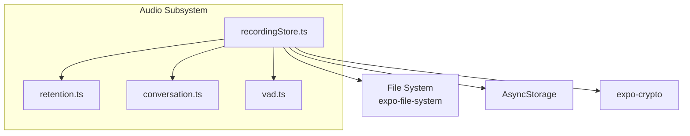
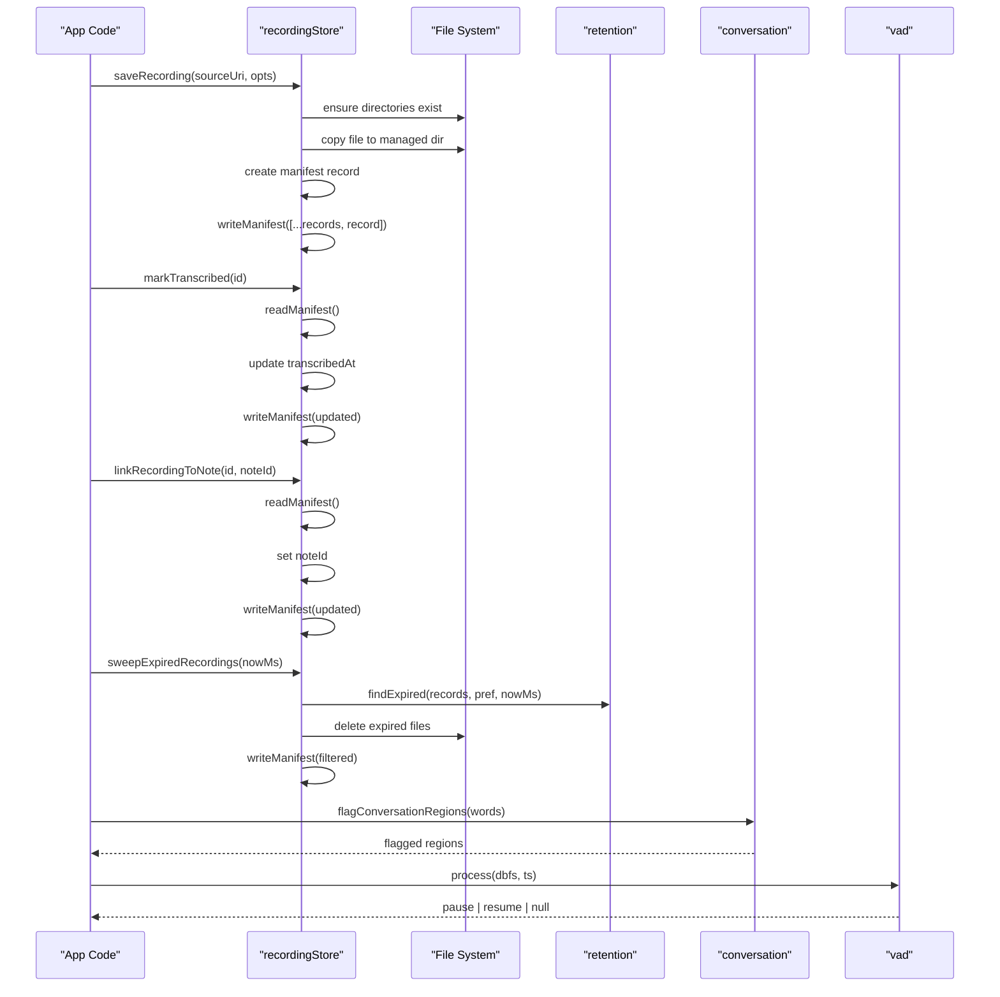
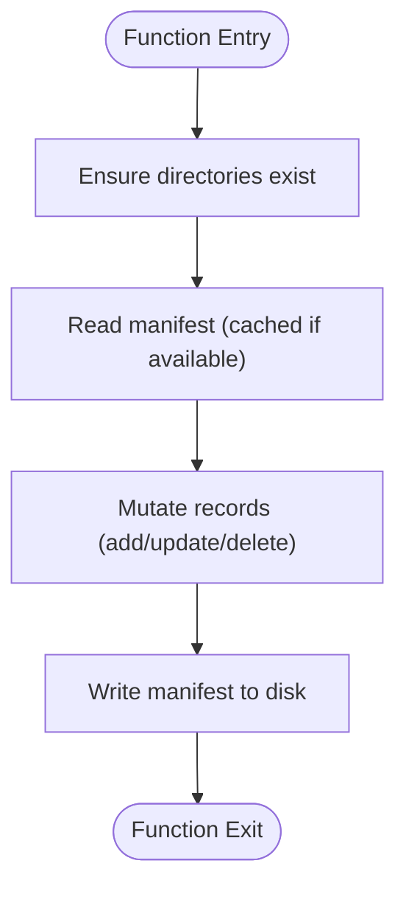
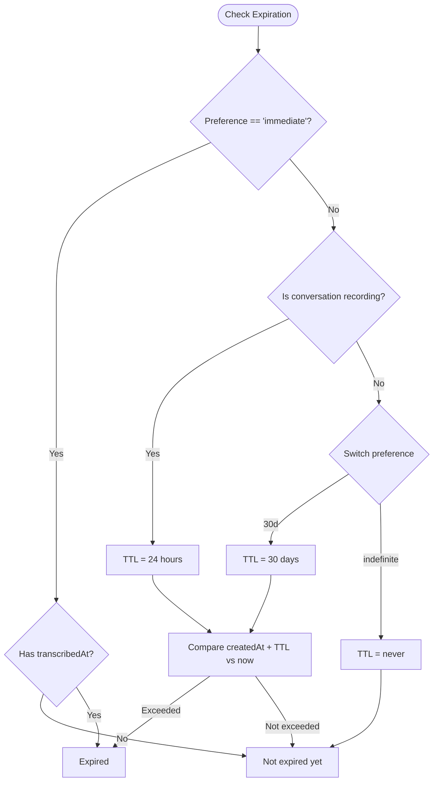
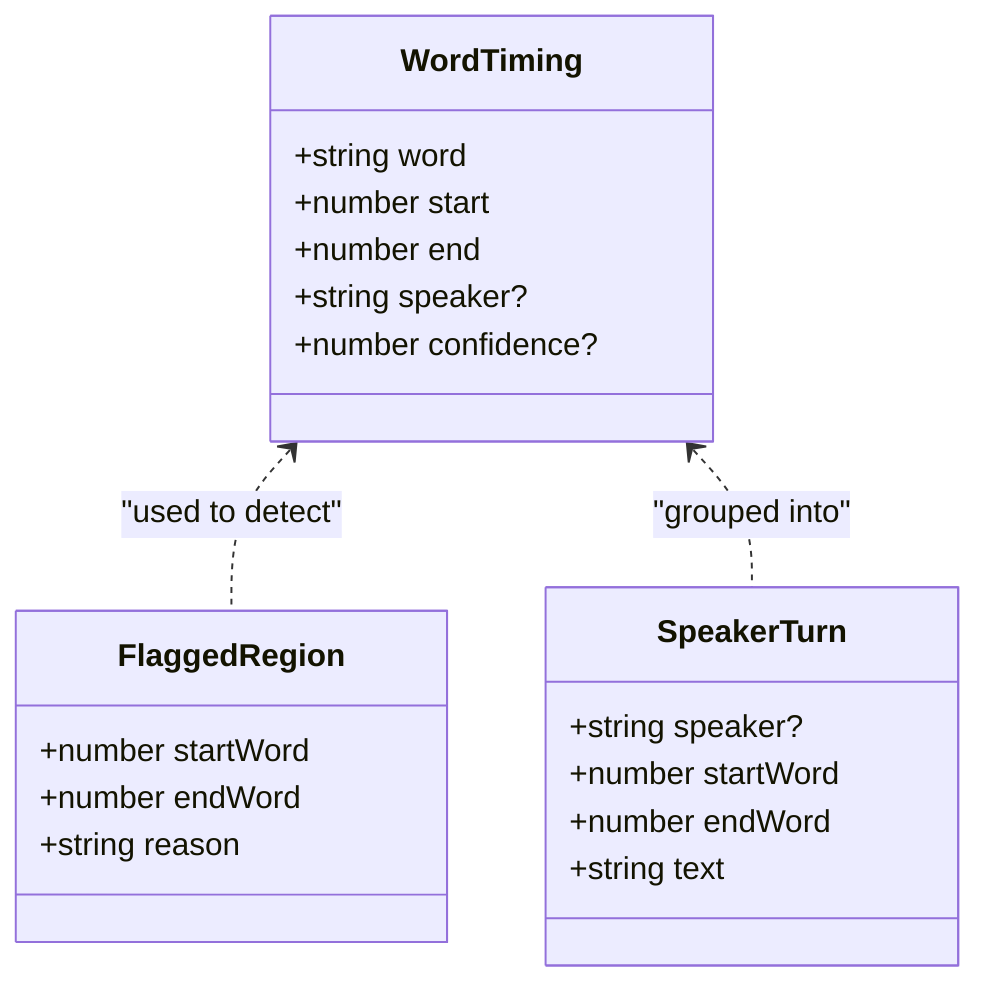
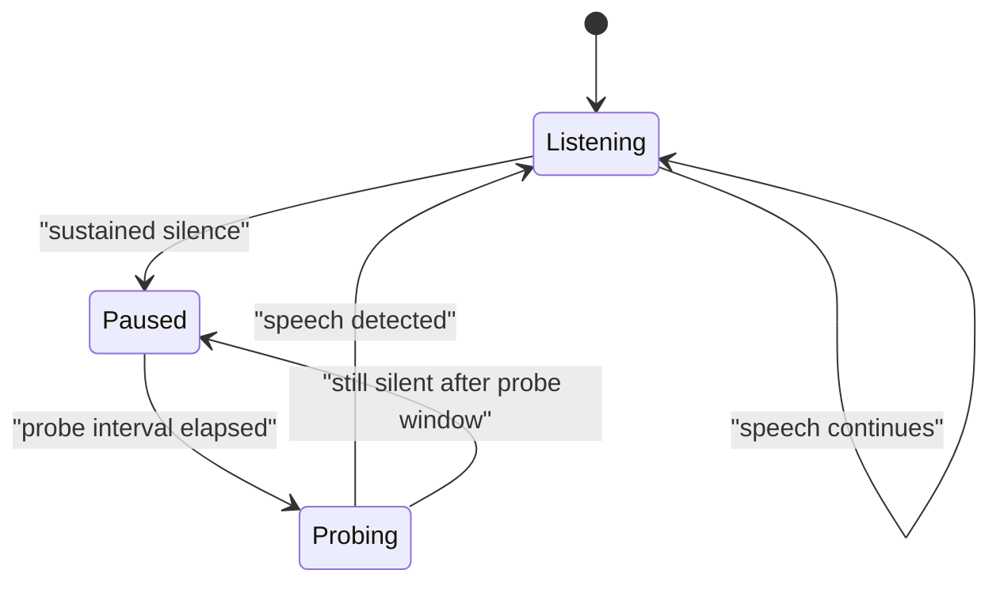
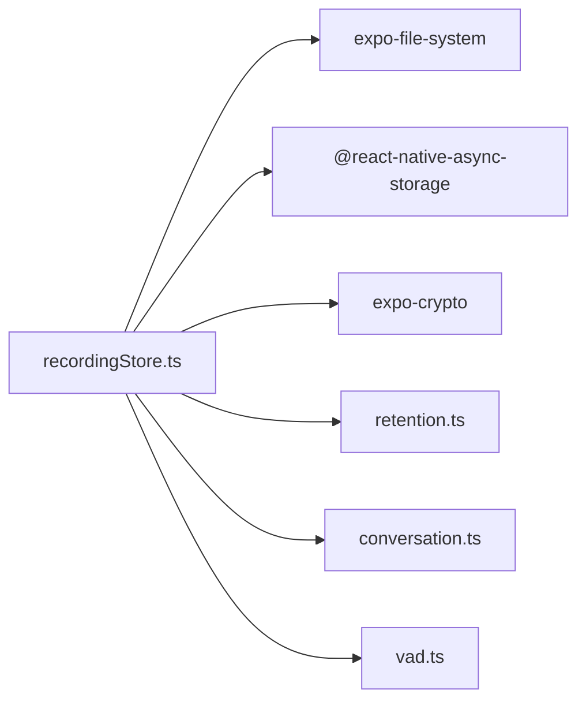

# Audio Recording & Storage

<cite>
**Referenced Files in This Document**
- [recordingStore.ts](file://src/audio/recordingStore.ts)
- [retention.ts](file://src/audio/retention.ts)
- [conversation.ts](file://src/audio/conversation.ts)
- [vad.ts](file://src/audio/vad.ts)
- [retention.test.ts](file://src/audio/retention.test.ts)
- [conversation.test.ts](file://src/audio/conversation.test.ts)
- [vad.test.ts](file://src/audio/vad.test.ts)
</cite>

## Table of Contents
1. [Introduction](#introduction)
2. [Project Structure](#project-structure)
3. [Core Components](#core-components)
4. [Architecture Overview](#architecture-overview)
5. [Detailed Component Analysis](#detailed-component-analysis)
6. [Dependency Analysis](#dependency-analysis)
7. [Performance Considerations](#performance-considerations)
8. [Troubleshooting Guide](#troubleshooting-guide)
9. [Conclusion](#conclusion)

## Introduction
This document explains the on-device audio recording and storage system, focusing on:
- How recordings are captured, saved, and tracked locally
- The manifest-based metadata model that links files to notes and transcripts
- Retention policies that automatically clean up expired recordings
- Conversation-mode safeguards and session limits
- Voice activity detection (VAD) used to reduce upload size by pausing during extended silence
- Practical examples for common lifecycle operations such as saving a recording, marking it transcribed, linking to a note, and sweeping expired files

The system is designed to be resilient under concurrent access, safe with respect to user retention preferences, and optimized for large audio files through VAD-driven pauses and efficient file management.

## Project Structure
The audio subsystem lives under src/audio and is composed of four cohesive modules:
- recordingStore.ts: Filesystem-backed recording store with manifest tracking and concurrency control
- retention.ts: Pure logic for retention policies, expiration checks, and formatting utilities
- conversation.ts: Policy and helpers for conversation-mode sessions, consent, overlap detection, and speaker grouping
- vad.ts: Client-side voice activity detection that segments recordings by pausing during long silences

**Diagram sources**
- [recordingStore.ts:11-26](file://src/audio/recordingStore.ts#L11-L26)
- [retention.ts:1-10](file://src/audio/retention.ts#L1-L10)
- [conversation.ts:1-12](file://src/audio/conversation.ts#L1-L12)
- [vad.ts:1-14](file://src/audio/vad.ts#L1-L14)

**Section sources**
- [recordingStore.ts:1-26](file://src/audio/recordingStore.ts#L1-L26)
- [retention.ts:1-10](file://src/audio/retention.ts#L1-L10)
- [conversation.ts:1-12](file://src/audio/conversation.ts#L1-L12)
- [vad.ts:1-14](file://src/audio/vad.ts#L1-L14)

## Core Components
- Recording Store (recordingStore.ts): Manages persistent storage of audio files under a managed directory, maintains a JSON manifest of records, and serializes all mutations to prevent race conditions. It exposes functions to save, link, mark transcribed, query by note, migrate links, remove, sweep expired, and compute totals.
- Retention Policy (retention.ts): Defines retention preferences, computes TTLs per record type (including stricter rules for conversation-mode), determines expiration, finds soon-to-expire items, and provides formatting helpers for bytes and clock display.
- Conversation Mode (conversation.ts): Enforces session caps, tracks consent, flags regions where diarization or confidence is unreliable, and groups words into speaker turns for UI presentation.
- Voice Activity Detection (vad.ts): Implements a state machine that listens, pauses during sustained silence, probes periodically while paused, and resumes when speech is detected. This reduces upload size without stripping natural short pauses.

**Section sources**
- [recordingStore.ts:23-76](file://src/audio/recordingStore.ts#L23-L76)
- [retention.ts:11-54](file://src/audio/retention.ts#L11-L54)
- [conversation.ts:14-34](file://src/audio/conversation.ts#L14-L34)
- [vad.ts:16-55](file://src/audio/vad.ts#L16-L55)

## Architecture Overview
At a high level:
- Captured audio is copied from the temporary cache into a managed directory.
- A manifest JSON tracks each recording’s metadata (id, uri, timestamps, noteId, conversation flag, transcript info).
- All manifest mutations are serialized via a lock to avoid interleaved writes.
- Retention policies determine when recordings expire; sweeps delete expired files and update the manifest.
- Conversation mode enforces session length and flags unreliable transcript regions.
- VAD reduces upload size by pausing during long silences and probing to resume when speech returns.

**Diagram sources**
- [recordingStore.ts:78-141](file://src/audio/recordingStore.ts#L78-L141)
- [recordingStore.ts:226-242](file://src/audio/recordingStore.ts#L226-L242)
- [retention.ts:59-81](file://src/audio/retention.ts#L59-L81)
- [conversation.ts:64-106](file://src/audio/conversation.ts#L64-L106)
- [vad.ts:57-127](file://src/audio/vad.ts#L57-L127)

## Detailed Component Analysis

### Recording Store Implementation
Responsibilities:
- Ensure the managed directory exists before any operation.
- Copy captured files from expo-audio cache to a stable location so they survive cache eviction.
- Maintain a JSON manifest next to the files with rich metadata.
- Serialize all manifest mutations to protect against concurrent access issues.
- Provide APIs for listing, saving, linking, marking transcribed, querying by note, migrating links, removing, sweeping expired, clearing all, and computing total bytes.

Concurrency protection:
- A promise-based lock ensures that parallel calls to list/save/link/mark/migrate/remove/sweep do not clobber each other’s writes.

Manifest caching:
- In-memory cache avoids repeated reads unless explicitly refreshed by writes.

Retention integration:
- Uses retention policy to identify expired recordings and deletes both files and manifest entries.

**Diagram sources**
- [recordingStore.ts:29-62](file://src/audio/recordingStore.ts#L29-L62)
- [recordingStore.ts:64-72](file://src/audio/recordingStore.ts#L64-L72)

**Section sources**
- [recordingStore.ts:23-76](file://src/audio/recordingStore.ts#L23-L76)
- [recordingStore.ts:78-141](file://src/audio/recordingStore.ts#L78-L141)
- [recordingStore.ts:143-174](file://src/audio/recordingStore.ts#L143-L174)
- [recordingStore.ts:226-242](file://src/audio/recordingStore.ts#L226-L242)

### Retention Policies
Key behaviors:
- Default retention is 30 days.
- Immediate deletion waits until transcription completes to avoid deleting untranscribed content.
- Conversation-mode recordings have a strict 24-hour ceiling regardless of general preference.
- Indefinite keeps files until manually removed.
- Utilities support finding expired and soon-to-expire recordings, plus formatting helpers for bytes and clock display.

**Diagram sources**
- [retention.ts:59-81](file://src/audio/retention.ts#L59-L81)

**Section sources**
- [retention.ts:11-54](file://src/audio/retention.ts#L11-L54)
- [retention.ts:59-81](file://src/audio/retention.ts#L59-L81)
- [retention.ts:83-104](file://src/audio/retention.ts#L83-L104)

### Conversation Mode
Policies and helpers:
- Session cap enforced at a fixed maximum duration.
- Consent record tracks attestation timestamp, choice, and whether an audible announcement was played.
- Overlap detection flags regions where multiple speakers overlap or confidence is low; adjacent flagged words merge into contiguous regions.
- Speaker turn grouping organizes words into blocks for display.

**Diagram sources**
- [retention.ts:15-25](file://src/audio/retention.ts#L15-L25)
- [conversation.ts:41-48](file://src/audio/conversation.ts#L41-L48)
- [conversation.ts:108-114](file://src/audio/conversation.ts#L108-L114)

**Section sources**
- [conversation.ts:14-34](file://src/audio/conversation.ts#L14-L34)
- [conversation.ts:64-106](file://src/audio/conversation.ts#L64-L106)
- [conversation.ts:116-129](file://src/audio/conversation.ts#L116-L129)

### Voice Activity Detection (VAD)
Behavior:
- Starts in listening state; arms after first speech if configured.
- Pauses after sustained silence exceeding a threshold.
- While paused, periodically probes by briefly resuming to check for speech.
- Resumes when speech exceeds a higher threshold; re-pauses if still silent after probe window.
- Ignores stale samples while paused to avoid flapping.

**Diagram sources**
- [vad.ts:57-127](file://src/audio/vad.ts#L57-L127)

**Section sources**
- [vad.ts:16-55](file://src/audio/vad.ts#L16-L55)
- [vad.ts:57-127](file://src/audio/vad.ts#L57-L127)

## Dependency Analysis
- recordingStore depends on:
  - File system for directory creation, copying, reading/writing manifest, and deletion
  - AsyncStorage for storing user preferences (retention, spoken language, announcement)
  - Crypto for generating unique IDs
  - retention module for expiration logic and constants
  - conversation module for conversation-mode semantics
  - vad module indirectly via application flow that uses VAD decisions to manage recording pauses/resumes

**Diagram sources**
- [recordingStore.ts:11-26](file://src/audio/recordingStore.ts#L11-L26)
- [retention.ts:1-10](file://src/audio/retention.ts#L1-L10)
- [conversation.ts:1-12](file://src/audio/conversation.ts#L1-L12)
- [vad.ts:1-14](file://src/audio/vad.ts#L1-L14)

**Section sources**
- [recordingStore.ts:11-26](file://src/audio/recordingStore.ts#L11-L26)

## Performance Considerations
- Manifest serialization prevents race conditions but introduces sequential writes; batch operations should minimize redundant reads/writes.
- File copying occurs at capture time; ensure source URIs are valid and accessible to avoid I/O errors.
- VAD reduces upload size by pausing during long silences; tune thresholds based on environment noise and speech patterns.
- For large audio files:
  - Prefer streaming or chunked processing where possible
  - Avoid unnecessary reads of large files; rely on manifest metadata (sizeBytes) for UI calculations
  - Use sweepExpiredRecordings regularly to reclaim space
- Formatting helpers provide efficient string conversions for UI rendering without heavy computation.

[No sources needed since this section provides general guidance]

## Troubleshooting Guide
Common issues and resolutions:
- Storage permissions:
  - Ensure the app has permission to write to the document directory. If directory creation fails, verify platform-specific storage permissions and paths.
  - If file copy fails, confirm the source URI is valid and readable.
- File system issues:
  - Manifest read/write failures are handled gracefully; the code falls back to an empty manifest on error. Check disk space and path validity.
  - Deletion failures are idempotent; missing files are ignored while still updating the manifest.
- Performance for large audio files:
  - Use VAD to pause during extended silence to reduce file sizes and improve upload performance.
  - Sweep expired recordings regularly to free space and keep the manifest lean.
  - Monitor totalRecordingBytes to inform users about storage usage.

Operational examples:
- Save a recording: call saveRecording with the source URI and optional noteId/conversation flag.
- Mark as transcribed: call markTranscribed with the recording id once transcription completes.
- Link to a note: call linkRecordingToNote with the recording id and note id.
- Sweep expired: call sweepExpiredRecordings to delete expired files and update the manifest.

**Section sources**
- [recordingStore.ts:78-141](file://src/audio/recordingStore.ts#L78-L141)
- [recordingStore.ts:226-242](file://src/audio/recordingStore.ts#L226-L242)
- [retention.ts:59-81](file://src/audio/retention.ts#L59-L81)

## Conclusion
The audio recording and storage system provides a robust, local-first approach to managing audio captures with strong guarantees around data integrity, retention compliance, and performance. Key strengths include:
- Safe, serialized manifest updates preventing concurrent write corruption
- Clear retention policies with special handling for conversation-mode recordings
- VAD-driven segmentation to reduce upload size without losing natural speech rhythm
- Comprehensive APIs for the full recording lifecycle, from capture to cleanup

By following the recommended practices and troubleshooting steps, developers can maintain a reliable and performant audio experience across devices and usage patterns.

[No sources needed since this section summarizes without analyzing specific files]