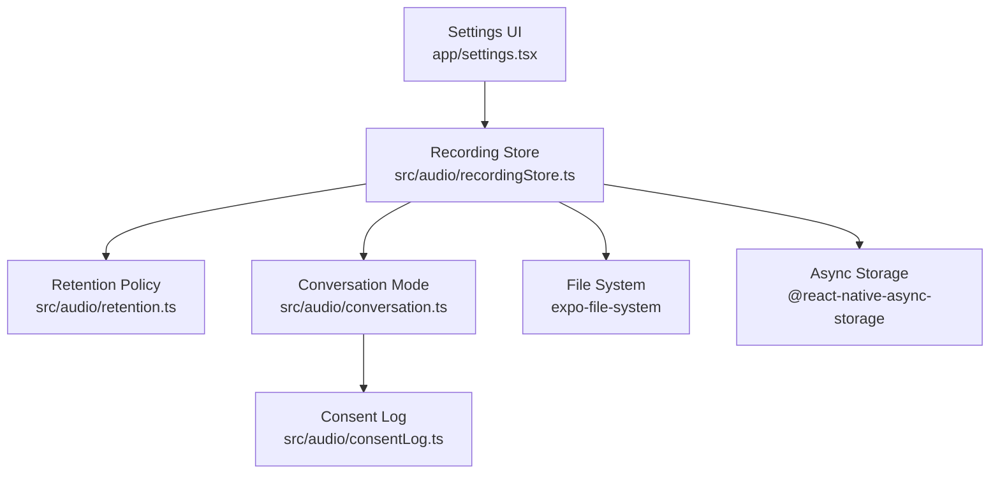
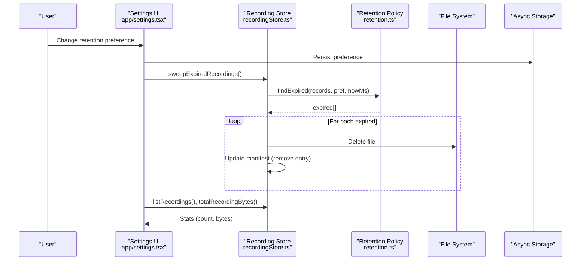
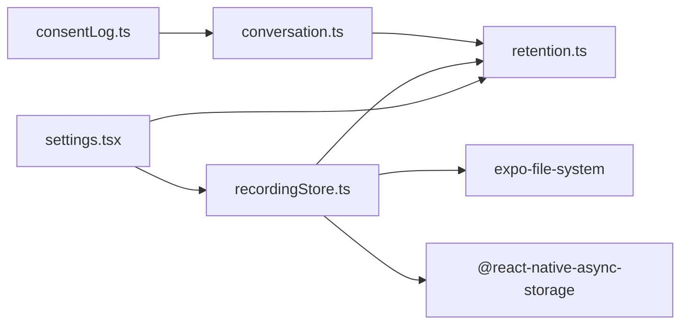
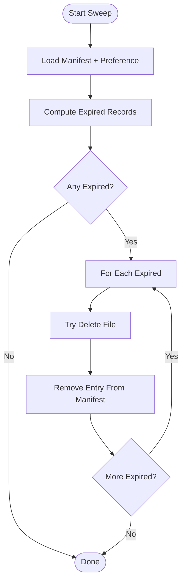
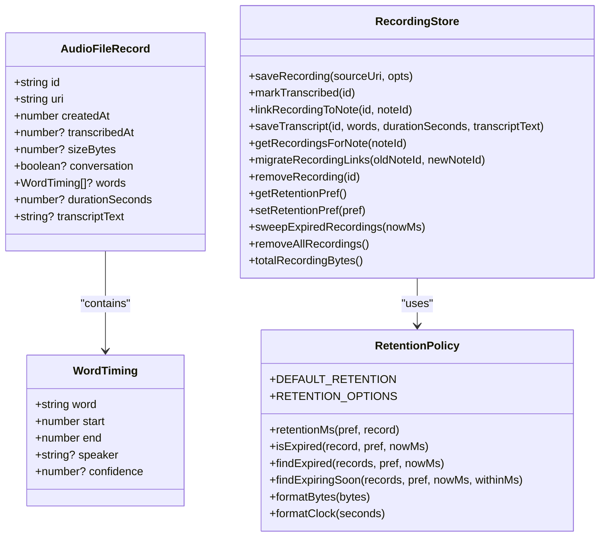

# Audio Retention & Cleanup

<cite>
**Referenced Files in This Document**
- [retention.ts](file://src/audio/retention.ts)
- [recordingStore.ts](file://src/audio/recordingStore.ts)
- [conversation.ts](file://src/audio/conversation.ts)
- [consentLog.ts](file://src/audio/consentLog.ts)
- [settings.tsx](file://app/settings.tsx)
- [retention.test.ts](file://src/audio/retention.test.ts)
</cite>

## Table of Contents
1. [Introduction](#introduction)
2. [Project Structure](#project-structure)
3. [Core Components](#core-components)
4. [Architecture Overview](#architecture-overview)
5. [Detailed Component Analysis](#detailed-component-analysis)
6. [Dependency Analysis](#dependency-analysis)
7. [Performance Considerations](#performance-considerations)
8. [Troubleshooting Guide](#troubleshooting-guide)
9. [Conclusion](#conclusion)
10. [Appendices](#appendices)

## Introduction
This document explains the audio retention policies and cleanup mechanisms for voice recordings stored on-device. It covers:
- Retention preferences: immediate deletion, 30-day rolling window, and indefinite storage
- Automated cleanup that scans recordings based on creation timestamps and user preferences
- Storage optimization strategies including space monitoring, cleanup scheduling, and resource management
- Configuration examples, cleanup operations, and storage usage monitoring
- Troubleshooting guidance for storage issues, cleanup failures, and preference synchronization across app sessions

The system is designed to be safe by default: local recordings are kept only as long as necessary, with stricter rules for conversation-mode captures that include other people’s voices.

## Project Structure
Audio retention and cleanup are implemented in a small set of focused modules:
- Policy logic (pure functions): retention.ts
- On-device storage and enforcement: recordingStore.ts
- Conversation-mode policy and consent logging: conversation.ts, consentLog.ts
- User-facing settings UI: settings.tsx
- Unit tests validating policy behavior: retention.test.ts

**Diagram sources**
- [settings.tsx:118-176](file://app/settings.tsx#L118-L176)
- [recordingStore.ts:1-263](file://src/audio/recordingStore.ts#L1-L263)
- [retention.ts:1-114](file://src/audio/retention.ts#L1-L114)
- [conversation.ts:1-130](file://src/audio/conversation.ts#L1-L130)
- [consentLog.ts:1-37](file://src/audio/consentLog.ts#L1-L37)

**Section sources**
- [retention.ts:1-114](file://src/audio/retention.ts#L1-L114)
- [recordingStore.ts:1-263](file://src/audio/recordingStore.ts#L1-L263)
- [conversation.ts:1-130](file://src/audio/conversation.ts#L1-L130)
- [consentLog.ts:1-37](file://src/audio/consentLog.ts#L1-L37)
- [settings.tsx:118-176](file://app/settings.tsx#L118-L176)

## Core Components
- Retention policy module defines:
  - Preference type and options: immediate, 30-day, indefinite
  - TTL calculation per preference and special handling for conversation-mode
  - Expiration checks and helpers to find expired or soon-expiring recordings
  - Utilities for formatting bytes and clock times
- Recording store module implements:
  - Local file copy and manifest tracking under a dedicated directory
  - Manifest persistence and thread-safe read-modify-write via a lock
  - CRUD operations for recordings and transcript metadata
  - Preferences for retention and spoken language persisted in Async Storage
  - Sweep function to delete expired files and update manifest
  - Bulk removal and total size computation
- Conversation mode module provides:
  - Session length cap and remaining time helpers
  - Flagging of overlap or low-confidence regions in transcripts
  - Grouping words into speaker turns
- Consent log module stores local-only attestation records for conversation-mode sessions

Key behaviors:
- Immediate deletion occurs after transcription completes to avoid deleting active dictation
- Conversation-mode recordings always expire within 24 hours regardless of general preference
- The sweep runs safely at any time and tolerates per-file errors without stopping

**Section sources**
- [retention.ts:11-114](file://src/audio/retention.ts#L11-L114)
- [recordingStore.ts:23-263](file://src/audio/recordingStore.ts#L23-L263)
- [conversation.ts:14-130](file://src/audio/conversation.ts#L14-L130)
- [consentLog.ts:1-37](file://src/audio/consentLog.ts#L1-L37)

## Architecture Overview
The architecture separates pure policy from storage and UI concerns. The settings UI reads/writes preferences and triggers cleanup; the recording store coordinates file I/O and manifest updates; the retention module computes expiration; conversation mode adds safety constraints and consent logging.

**Diagram sources**
- [settings.tsx:127-138](file://app/settings.tsx#L127-L138)
- [recordingStore.ts:176-242](file://src/audio/recordingStore.ts#L176-L242)
- [retention.ts:70-81](file://src/audio/retention.ts#L70-L81)

## Detailed Component Analysis

### Retention Policy (retention.ts)
- Defines three retention preferences:
  - immediate: delete after transcription completes
  - 30d: keep for 30 days from capture time
  - indefinite: never auto-delete
- Enforces a strict 24-hour ceiling for conversation-mode recordings even under indefinite
- Provides helpers:
  - retentionMs(pref, record) returns TTL or null
  - isExpired(record, pref, nowMs) applies preference and conversation rules
  - findExpired(records, pref, nowMs) filters expired items
  - findExpiringSoon(records, pref, nowMs, withinMs) flags upcoming expirations
  - formatBytes(bytes), formatClock(seconds) for UI display

Complexity:
- All operations are O(n) over the number of records scanned
- No external dependencies; pure functions ensure testability

Edge cases handled:
- Immediate mode waits until transcribedAt exists before deletion
- Conversation mode overrides indefinite to enforce 24h expiry
- Formatting guards against NaN/negative values

**Section sources**
- [retention.ts:11-114](file://src/audio/retention.ts#L11-L114)

### Recording Store (recordingStore.ts)
Storage model:
- Files copied to a managed directory under documentDirectory
- JSON manifest tracks metadata (id, uri, createdAt, noteId, conversation flag, size, transcript info)
- Manifest cached in memory to reduce I/O; serialized mutations via a promise-based lock

Key operations:
- saveRecording(sourceUri, opts): copies file, records metadata, appends to manifest
- markTranscribed(id): sets transcribedAt timestamp
- linkRecordingToNote(id, noteId): associates recording with a note
- saveTranscript(id, words, durationSeconds, transcriptText): persists word timings and full text
- getRecordingsForNote(noteId): lists all captures linked to a note, oldest first
- migrateRecordingLinks(oldNoteId, newNoteId): re-links when server assigns a permanent id
- removeRecording(id): deletes file and manifest entry
- getRetentionPref/setRetentionPref: persist user preference
- sweepExpiredRecordings(nowMs): deletes expired files and cleans manifest entries
- removeAllRecordings(): bulk delete all files and clear manifest
- totalRecordingBytes(): sum of recorded sizes

Concurrency and safety:
- withManifestLock serializes all manifest mutations to prevent race conditions
- File deletions use idempotent deletes; failures do not abort the sweep
- Manifest writes are best-effort but consistent due to locking

Error handling:
- Missing directories created automatically
- Manifest parse errors fall back to empty array
- Size detection failures ignored to avoid failing saves

**Section sources**
- [recordingStore.ts:23-263](file://src/audio/recordingStore.ts#L23-L263)

### Conversation Mode (conversation.ts)
Policies:
- Session cap enforced (e.g., maximum minutes)
- Remaining seconds helper for UI countdowns
- Flagging regions where diarization indicates overlap or low confidence
- Grouping words into contiguous speaker turns for display

Design principles:
- Do not fabricate single-speaker transcripts when overlap is likely
- Surface low-confidence segments to maintain honesty about ASR limitations

**Section sources**
- [conversation.ts:14-130](file://src/audio/conversation.ts#L14-L130)

### Consent Logging (consentLog.ts)
Local-only log of conversation-mode session attestations:
- Append and retrieve consent records
- Count confirmed sessions for visibility in settings
- Never transmitted to server; included in exports for transparency

**Section sources**
- [consentLog.ts:1-37](file://src/audio/consentLog.ts#L1-L37)

### Settings UI Integration (settings.tsx)
User interactions:
- Displays current retention preference and options
- Persists selected preference immediately
- Triggers cleanup sweep upon preference change to apply tightened rules right away
- Shows storage usage (count and formatted bytes)
- Offers “Delete all recordings” action with confirmation
- Supports spoken language preference and conversation announcement toggle

Flow highlights:
- On focus, loads current preference and refreshes stats
- On preference change, persists and sweeps expired recordings, then refreshes stats

**Section sources**
- [settings.tsx:118-176](file://app/settings.tsx#L118-L176)
- [settings.tsx:280-317](file://app/settings.tsx#L280-L317)

## Dependency Analysis
High-level dependencies:
- settings.tsx depends on retention.ts for options and formatting, and on recordingStore.ts for storage and preferences
- recordingStore.ts depends on retention.ts for policy logic and uses expo-file-system and AsyncStorage for persistence
- conversation.ts depends on WordTiming type from retention.ts
- consentLog.ts depends on conversation types and AsyncStorage

**Diagram sources**
- [settings.tsx:18-37](file://app/settings.tsx#L18-L37)
- [recordingStore.ts:11-21](file://src/audio/recordingStore.ts#L11-L21)
- [conversation.ts:12-16](file://src/audio/conversation.ts#L12-L16)
- [consentLog.ts:7-8](file://src/audio/consentLog.ts#L7-L8)

**Section sources**
- [settings.tsx:18-37](file://app/settings.tsx#L18-L37)
- [recordingStore.ts:11-21](file://src/audio/recordingStore.ts#L11-L21)
- [conversation.ts:12-16](file://src/audio/conversation.ts#L12-L16)
- [consentLog.ts:7-8](file://src/audio/consentLog.ts#L7-L8)

## Performance Considerations
- Manifest caching reduces repeated reads; lock serialization prevents interleaved writes
- Sweep operation is O(n) over manifest entries; per-file deletions are best-effort to avoid blocking
- File size metadata is captured once at save time; total size computed by summation
- Avoid heavy synchronous work; all operations are async and error-tolerant

Recommendations:
- Run sweep on app start or when preferences tighten to minimize storage growth
- Use findExpiringSoon to proactively warn users before recordings are deleted
- Monitor totalRecordingBytes to surface storage pressure in UI

[No sources needed since this section provides general guidance]

## Troubleshooting Guide

Common issues and resolutions:
- Storage space running low
  - Use “Delete all recordings” in settings to reclaim space
  - Tighten retention preference to immediate or 30-day to auto-clean older files
  - Check totalRecordingBytes to understand current usage
- Cleanup not removing files
  - Ensure sweepExpiredRecordings is called after changing preferences
  - Verify manifest integrity; corrupted manifests fall back to empty arrays
  - Confirm file paths exist; missing files are still removed from manifest during sweep
- Preference not syncing across sessions
  - Preferences are stored in AsyncStorage; verify keys and fallback defaults
  - On settings screen focus, preferences are loaded and displayed; changes are persisted immediately
- Conversation-mode recordings persist beyond expectations
  - Conversation-mode enforces a 24-hour ceiling regardless of preference; this is intentional
  - If you see longer retention, confirm conversation flag is set correctly at capture time

Operational tips:
- After setting immediate retention, transcription must complete before deletion; if no transcription occurred, recordings remain until transcribed
- When migrating note ids, ensure links are updated so reopened notes show their recordings
- Consent logs are local-only; they appear in exports and settings counts but do not affect retention

**Section sources**
- [recordingStore.ts:176-242](file://src/audio/recordingStore.ts#L176-L242)
- [retention.ts:60-81](file://src/audio/retention.ts#L60-L81)
- [settings.tsx:127-138](file://app/settings.tsx#L127-L138)

## Conclusion
The audio retention system balances user control with privacy and storage efficiency. Users can choose immediate, 30-day, or indefinite retention, while conversation-mode recordings are protected by a strict 24-hour limit. The automated sweep ensures expired recordings are cleaned up reliably, and the settings UI provides transparent control and visibility into storage usage. With robust error handling and concurrency safeguards, the system remains resilient across app sessions and device states.

[No sources needed since this section summarizes without analyzing specific files]

## Appendices

### Retention Policy Configuration Examples
- Set immediate deletion:
  - In settings, select “Delete after transcription”
  - Recordings are removed once transcription completes
- Set 30-day retention:
  - Select “Keep for 30 days”
  - Recordings older than 30 days are cleaned up automatically
- Set indefinite retention:
  - Select “Keep until I delete them”
  - Recordings remain until manually removed; conversation-mode still expires within 24 hours

Cleanup Operations:
- Triggered automatically when tightening preferences
- Can be invoked programmatically via sweepExpiredRecordings
- Deletes files and removes manifest entries atomically using a lock

Storage Usage Monitoring:
- Display count and formatted bytes in settings
- Use totalRecordingBytes to compute totals
- Use findExpiringSoon to warn users before deletion

**Section sources**
- [settings.tsx:280-317](file://app/settings.tsx#L280-L317)
- [recordingStore.ts:226-263](file://src/audio/recordingStore.ts#L226-L263)
- [retention.ts:83-114](file://src/audio/retention.ts#L83-L114)

### Flowchart: Cleanup Decision Logic

**Diagram sources**
- [recordingStore.ts:226-242](file://src/audio/recordingStore.ts#L226-L242)
- [retention.ts:70-81](file://src/audio/retention.ts#L70-L81)

### Class Diagram: Core Types and Relationships

**Diagram sources**
- [retention.ts:15-114](file://src/audio/retention.ts#L15-L114)
- [recordingStore.ts:78-263](file://src/audio/recordingStore.ts#L78-L263)

### Validation Tests
Unit tests validate core policy behaviors such as default retention, expiration windows, immediate deletion semantics, conversation-mode overrides, and utility formatting.

**Section sources**
- [retention.test.ts:1-86](file://src/audio/retention.test.ts#L1-L86)