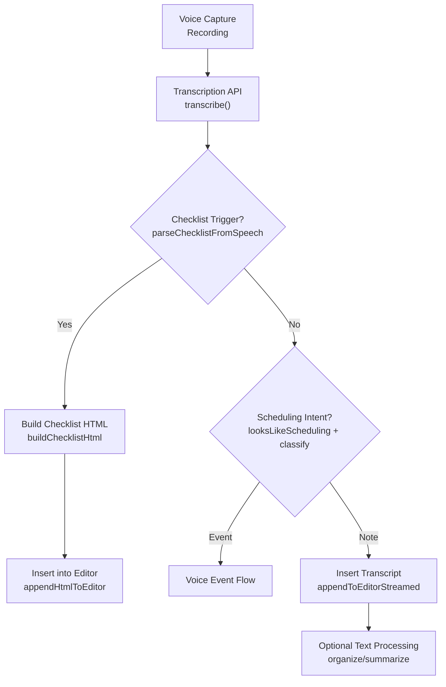
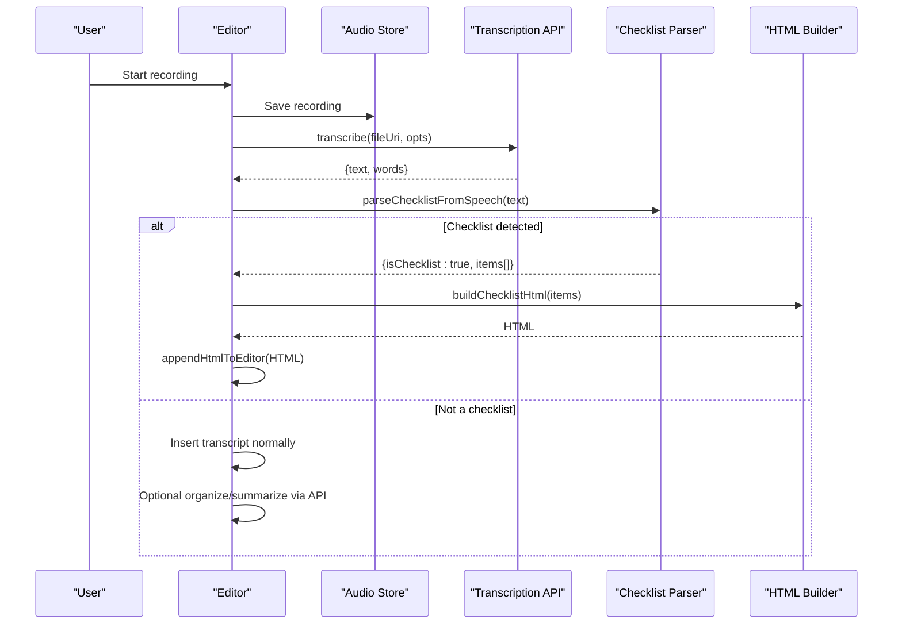
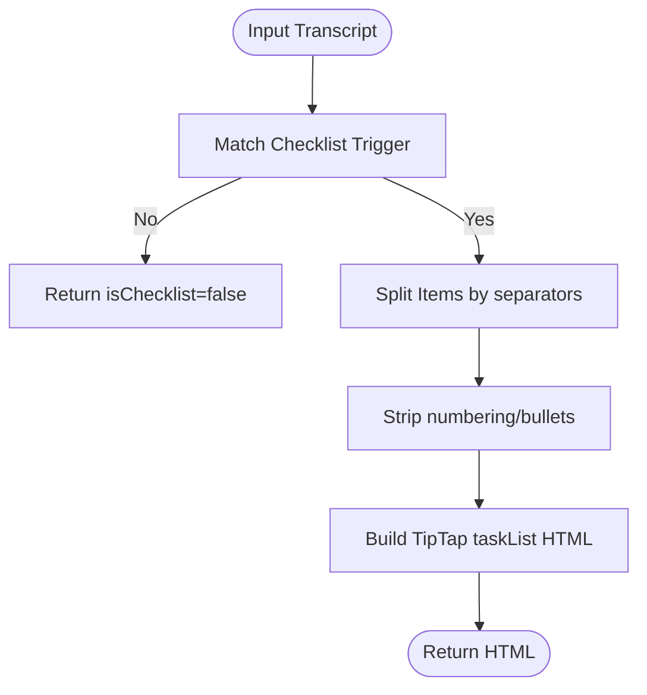
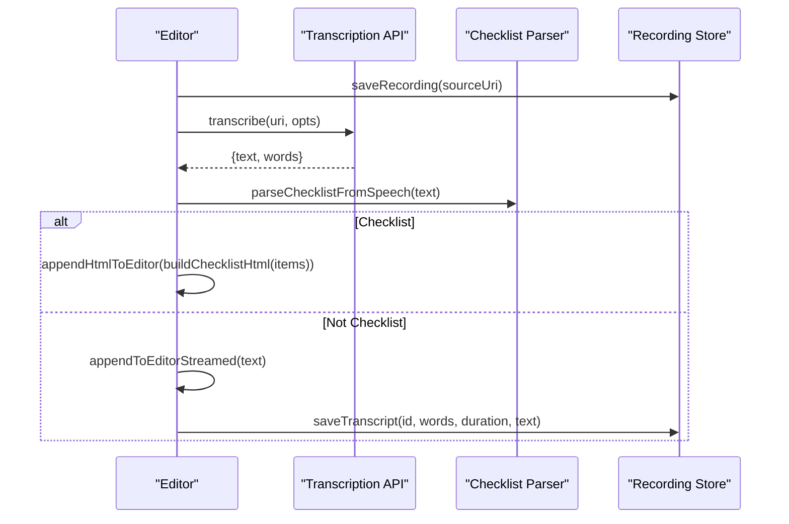
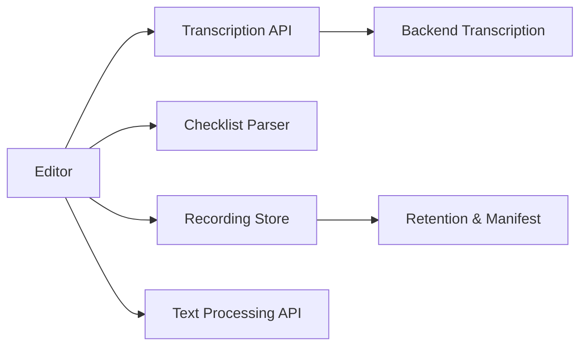

# Checklist Generation System

<cite>
**Referenced Files in This Document**
- [checklistFromSpeech.ts](file://src/checklistFromSpeech.ts)
- [checklistFromSpeech.test.ts](file://src/checklistFromSpeech.test.ts)
- [editor.tsx](file://app/editor.tsx)
- [api.ts](file://src/api.ts)
- [recordingStore.ts](file://src/audio/recordingStore.ts)
- [conversation.ts](file://src/audio/conversation.ts)
- [schedulingHints.ts](file://src/voice/schedulingHints.ts)
</cite>

## Table of Contents
1. [Introduction](#introduction)
2. [Project Structure](#project-structure)
3. [Core Components](#core-components)
4. [Architecture Overview](#architecture-overview)
5. [Detailed Component Analysis](#detailed-component-analysis)
6. [Dependency Analysis](#dependency-analysis)
7. [Performance Considerations](#performance-considerations)
8. [Troubleshooting Guide](#troubleshooting-guide)
9. [Conclusion](#conclusion)

## Introduction
This document explains the checklist generation system that transforms spoken content into structured, actionable checklists. It covers how the app recognizes a user’s voice request to create a checklist, extracts items from conversational speech, and inserts interactive checklist markup into the note editor without additional AI calls. It also documents the integration with speech-to-text services, the flow from raw transcripts to structured checklists, and provides troubleshooting guidance for common issues such as missed triggers, incorrect categorization, and formatting problems.

## Project Structure
The checklist generation feature spans several modules:
- Speech capture and transcription pipeline (audio storage, transcription API, conversation diarization)
- Local pattern recognition for checklist requests and item extraction
- Editor integration to insert native interactive checklist markup
- Optional text processing for organizing or summarizing non-checklist dictation

**Diagram sources**
- [editor.tsx:1965-2018](file://app/editor.tsx#L1965-L2018)
- [checklistFromSpeech.ts:24-56](file://src/checklistFromSpeech.ts#L24-L56)
- [api.ts:361-423](file://src/api.ts#L361-L423)
- [schedulingHints.ts:68-81](file://src/voice/schedulingHints.ts#L68-L81)

**Section sources**
- [editor.tsx:1950-2149](file://app/editor.tsx#L1950-L2149)
- [api.ts:361-458](file://src/api.ts#L361-L458)
- [checklistFromSpeech.ts:1-72](file://src/checklistFromSpeech.ts#L1-L72)

## Core Components
- Checklist recognizer and builder:
  - Pattern-based detection of checklist commands at the start of a transcript
  - Item splitting by commas, semicolons, newlines, and “and”
  - HTML builder producing TipTap-compatible task list markup
- Editor integration:
  - After transcription, checks for checklist trigger and inserts interactive checklist directly
  - Falls back to normal dictation insertion and optional AI organization if not a checklist
- Transcription service:
  - Uploads audio to backend, returns text and optional word timings
  - Supports language preference and diarization flags
- Conversation diarization and quality flags:
  - Detects overlap and low-confidence regions to inform UI presentation

**Section sources**
- [checklistFromSpeech.ts:24-72](file://src/checklistFromSpeech.ts#L24-L72)
- [editor.tsx:2002-2018](file://app/editor.tsx#L2002-L2018)
- [api.ts:361-423](file://src/api.ts#L361-L423)
- [conversation.ts:64-106](file://src/audio/conversation.ts#L64-L106)

## Architecture Overview
The system uses a deterministic local parser to recognize checklist requests immediately after transcription, avoiding extra AI calls. If recognized, it builds native checklist markup and inserts it into the editor. Otherwise, it proceeds through scheduling intent detection and standard dictation handling.

**Diagram sources**
- [editor.tsx:1965-2018](file://app/editor.tsx#L1965-L2018)
- [checklistFromSpeech.ts:46-72](file://src/checklistFromSpeech.ts#L46-L72)
- [api.ts:361-423](file://src/api.ts#L361-L423)

## Detailed Component Analysis

### Checklist Recognizer and Builder
- Trigger detection:
  - Matches commands like “create me a checklist”, “make a to-do list”, “start a shopping list”, “build a task list”
  - Allows polite fillers (“hey”, “okay”, “please”, “can you”) at the beginning
  - Requires the command to be at the transcript’s start to avoid mid-sentence misfires
- Item extraction:
  - Splits on commas, semicolons, newlines, and standalone “and”
  - Strips leading numbering/bullets (e.g., “1.”, “•”)
  - Returns an empty item array when no items are present; defaults to one empty item to match toolbar behavior
- HTML generation:
  - Produces TipTap-compatible task list markup with unchecked items
  - Escapes HTML entities in item text to prevent injection

**Diagram sources**
- [checklistFromSpeech.ts:24-72](file://src/checklistFromSpeech.ts#L24-L72)

**Section sources**
- [checklistFromSpeech.ts:24-72](file://src/checklistFromSpeech.ts#L24-L72)
- [checklistFromSpeech.test.ts:14-90](file://src/checklistFromSpeech.test.ts#L14-L90)

### Editor Integration and Voice Flow
- After transcription, the editor:
  - Checks for checklist trigger locally
  - If matched, inserts interactive checklist markup directly into the editor
  - Otherwise, proceeds to scheduling intent detection or inserts plain transcript
  - Offers optional AI organization/summarization for non-checklist content
- Recording lifecycle:
  - Saves recordings to managed storage
  - Persists word timings, duration, and transcript text
  - Manages retention and cleanup

**Diagram sources**
- [editor.tsx:1950-2149](file://app/editor.tsx#L1950-L2149)
- [api.ts:361-423](file://src/api.ts#L361-L423)
- [recordingStore.ts:78-141](file://src/audio/recordingStore.ts#L78-L141)

**Section sources**
- [editor.tsx:1950-2149](file://app/editor.tsx#L1950-L2149)
- [recordingStore.ts:78-141](file://src/audio/recordingStore.ts#L78-L141)

### Transcription Service Integration
- Uploads base64-encoded audio to backend endpoint
- Supports optional diarization flag for conversation mode
- Handles language preference (auto-detect or pinned language)
- Returns text and optional per-word timings for speaker turns and confidence

**Section sources**
- [api.ts:361-423](file://src/api.ts#L361-L423)
- [recordingStore.ts:186-205](file://src/audio/recordingStore.ts#L186-L205)

### Conversation Diarization and Quality Flags
- Detects overlapping speech and low-confidence segments
- Groups words into speaker turns for display
- Marks regions to avoid presenting unreliable single-speaker transcripts

**Section sources**
- [conversation.ts:64-106](file://src/audio/conversation.ts#L64-L106)
- [conversation.ts:116-129](file://src/audio/conversation.ts#L116-L129)

### Scheduling Intent Detection (Complementary Flow)
- Lightweight local heuristic determines whether to call the server classifier for event extraction
- Uses time/date patterns and keyword sets (English and Indonesian)
- Prevents unnecessary network calls for ordinary notes

**Section sources**
- [schedulingHints.ts:30-81](file://src/voice/schedulingHints.ts#L30-L81)
- [editor.tsx:2020-2044](file://app/editor.tsx#L2020-L2044)

## Dependency Analysis
- The editor depends on:
  - Transcription API for converting audio to text
  - Checklist parser for immediate checklist recognition
  - Recording store for managing audio files and metadata
  - Optional text processing API for organizing/summarizing notes
- The checklist parser is self-contained and deterministic, minimizing coupling and latency
- Diarization utilities provide quality signals but do not alter checklist parsing

**Diagram sources**
- [editor.tsx:1950-2149](file://app/editor.tsx#L1950-L2149)
- [api.ts:361-458](file://src/api.ts#L361-L458)
- [recordingStore.ts:78-141](file://src/audio/recordingStore.ts#L78-L141)

**Section sources**
- [editor.tsx:1950-2149](file://app/editor.tsx#L1950-L2149)
- [api.ts:361-458](file://src/api.ts#L361-L458)
- [recordingStore.ts:78-141](file://src/audio/recordingStore.ts#L78-L141)

## Performance Considerations
- Checklist recognition runs locally with regex matching and string operations, avoiding network latency
- Item splitting and cleaning are O(n) over transcript length
- HTML building is O(m) where m is number of items; escaping ensures safe rendering
- Transcription involves a network call; caching or batching could reduce overhead in high-frequency scenarios
- Diarization adds minimal CPU cost and improves UX by marking uncertain regions

[No sources needed since this section provides general guidance]

## Troubleshooting Guide
- Missed action items:
  - Ensure the transcript starts with a recognized checklist command; mid-sentence mentions will not trigger
  - Verify item separators: commas, semicolons, newlines, and “and” are supported; unusual separators may merge items
  - Check for leading numbering/bullets being stripped; ensure they are formatted consistently
- Incorrect categorization:
  - If the transcript resembles scheduling language, the editor may route to event creation instead of checklist; adjust phrasing to clearly indicate a checklist
  - Use explicit commands like “create me a checklist” to avoid ambiguity
- Formatting issues:
  - Generated checklist markup must match TipTap’s expected structure; avoid injecting custom HTML outside the builder
  - HTML entities in item text are escaped automatically; if manual edits occur, ensure proper escaping
- Transcription errors:
  - Network failures or unsupported formats can cause transcription to fail; retry with a different format or check backend availability
  - Empty transcripts due to silence are handled gracefully; prompt the user to try again
- Diarization limitations:
  - Overlapping speech or missing speaker labels result in flagged regions; UI should mark these rather than attributing confidently

**Section sources**
- [checklistFromSpeech.ts:24-72](file://src/checklistFromSpeech.ts#L24-L72)
- [checklistFromSpeech.test.ts:14-90](file://src/checklistFromSpeech.test.ts#L14-L90)
- [editor.tsx:2002-2018](file://app/editor.tsx#L2002-L2018)
- [api.ts:361-423](file://src/api.ts#L361-L423)
- [conversation.ts:64-106](file://src/audio/conversation.ts#L64-L106)

## Conclusion
The checklist generation system provides a fast, reliable way to convert spoken requests into interactive checklists using local pattern recognition. By detecting checklist commands at the start of transcripts and building native markup, it avoids unnecessary AI calls and delivers immediate value. The integration with transcription and editor components ensures seamless workflows, while optional scheduling detection and text processing support broader use cases. Proper handling of edge cases and clear user prompts help maintain reliability and usability across diverse speaking styles and environments.