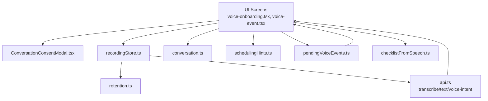
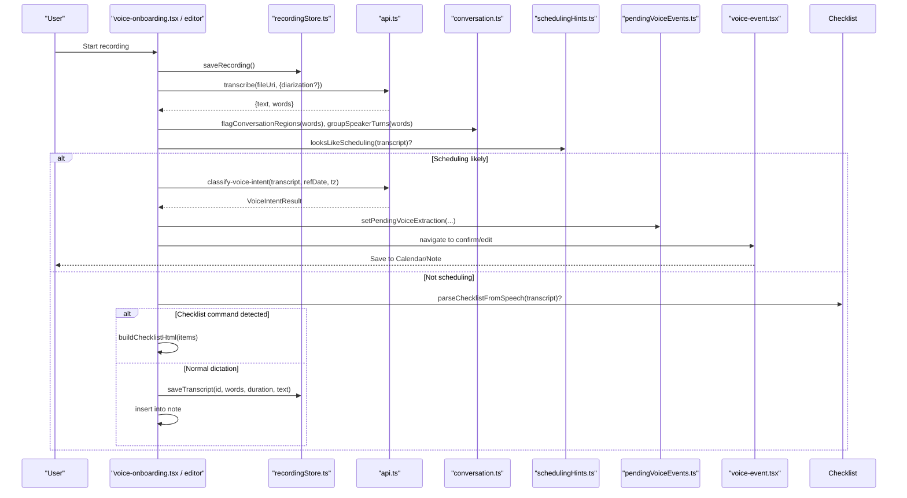
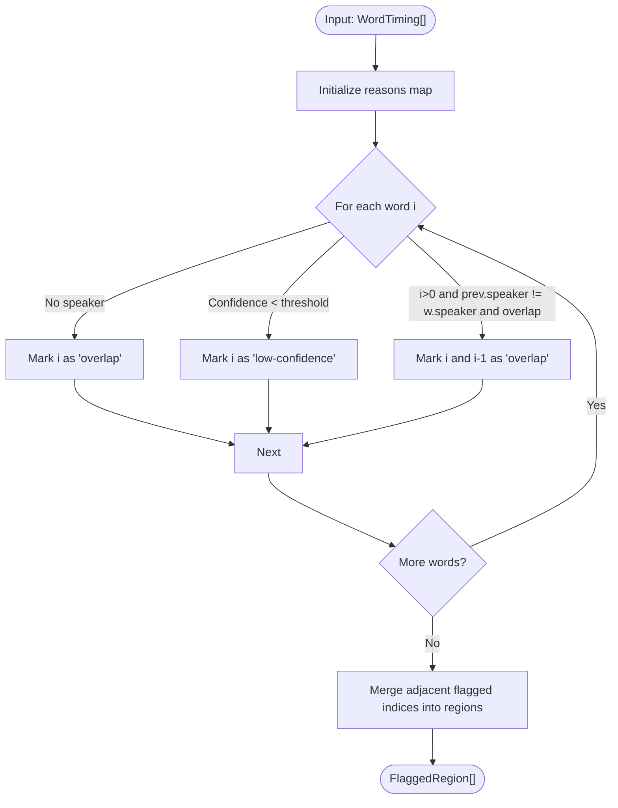
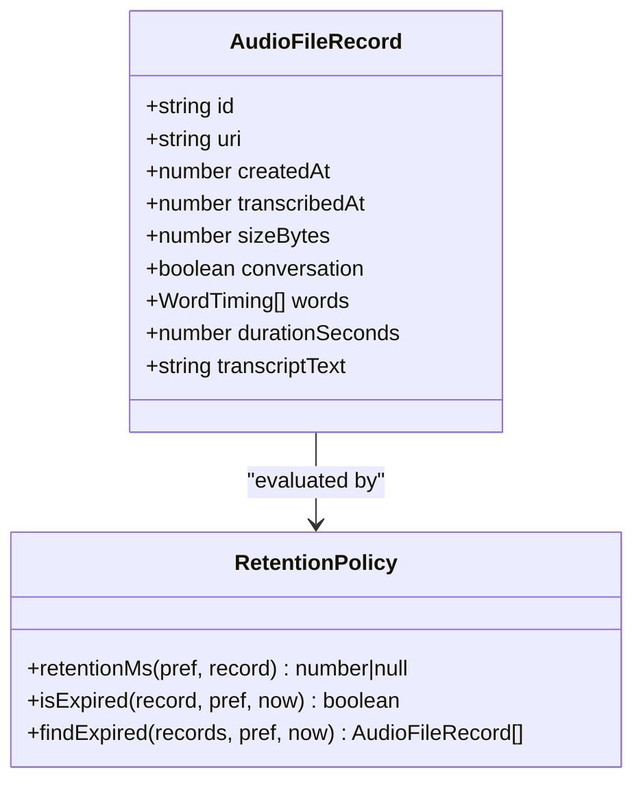
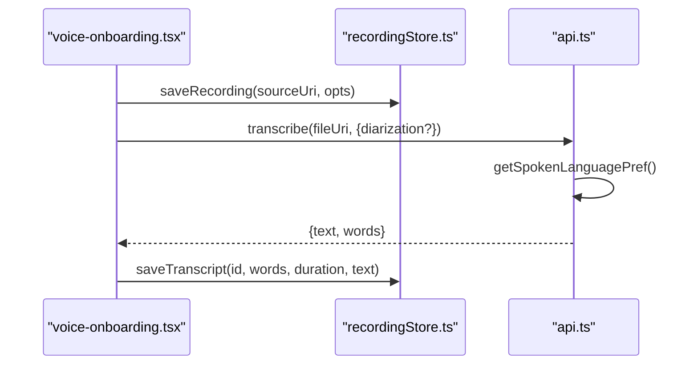
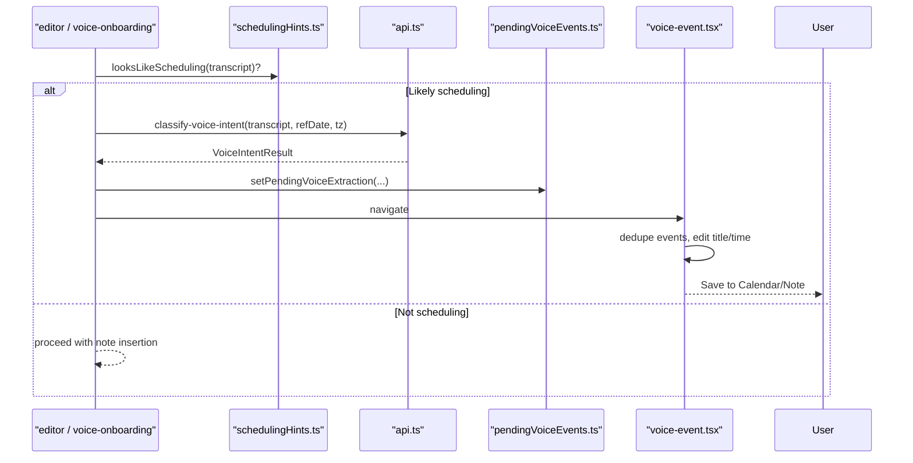
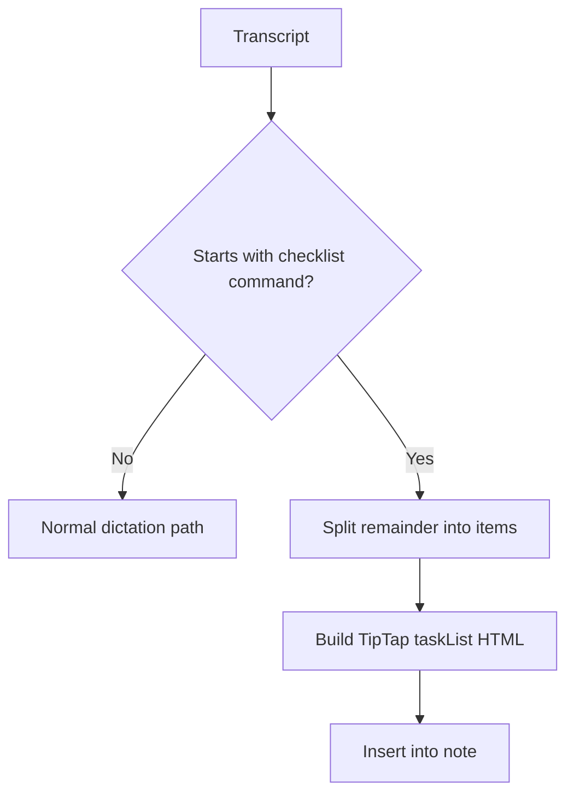
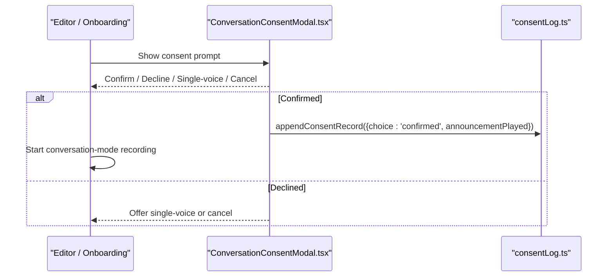
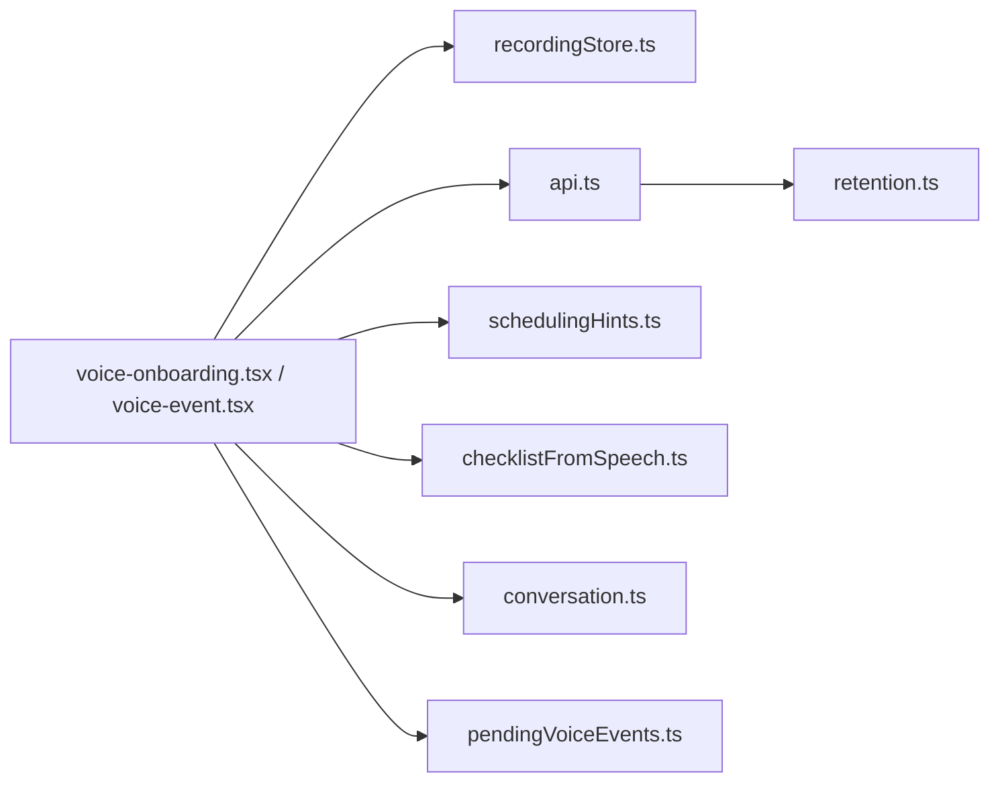

# Conversation Processing Pipeline

<cite>
**Referenced Files in This Document**
- [conversation.ts](file://src/audio/conversation.ts)
- [retention.ts](file://src/audio/retention.ts)
- [recordingStore.ts](file://src/audio/recordingStore.ts)
- [consentLog.ts](file://src/audio/consentLog.ts)
- [checklistFromSpeech.ts](file://src/checklistFromSpeech.ts)
- [schedulingHints.ts](file://src/voice/schedulingHints.ts)
- [api.ts](file://src/api.ts)
- [pendingVoiceEvents.ts](file://src/pendingVoiceEvents.ts)
- [voice-event.tsx](file://app/voice-event.tsx)
- [ConversationConsentModal.tsx](file://src/components/ConversationConsentModal.tsx)
- [voice-onboarding.tsx](file://app/voice-onboarding.tsx)
</cite>

## Table of Contents
1. [Introduction](#introduction)
2. [Project Structure](#project-structure)
3. [Core Components](#core-components)
4. [Architecture Overview](#architecture-overview)
5. [Detailed Component Analysis](#detailed-component-analysis)
6. [Dependency Analysis](#dependency-analysis)
7. [Performance Considerations](#performance-considerations)
8. [Troubleshooting Guide](#troubleshooting-guide)
9. [Conclusion](#conclusion)

## Introduction
This document explains the conversation processing pipeline that converts voice recordings into structured note content. It covers:
- Conversation mode workflow, including multi-speaker detection signals, turn-taking grouping, and contextual handling of overlaps and low-confidence segments.
- Checklist generation from spoken requests into actionable items and TipTap-compatible markup.
- Integration with speech-to-text services, language preferences, and content formatting.
- End-to-end workflows for capturing audio, transcribing, classifying intent, and producing structured outputs (notes, events, checklists).
- Troubleshooting guidance for accuracy, speaker identification, and structuring issues.

## Project Structure
The conversation pipeline spans UI screens, local storage, transcription APIs, and logic modules:
- Audio capture and retention: recordingStore, retention, consentLog
- Conversation logic: conversation (overlap flagging, turn grouping), consent modal
- Speech-to-text and text processing: api (transcribeApi, textProcessApi, voiceIntentApi)
- Intent-driven flows: schedulingHints (local pre-filter), pendingVoiceEvents handoff, voice-event screen
- Checklist extraction: checklistFromSpeech

**Diagram sources**
- [voice-onboarding.tsx:122-149](file://app/voice-onboarding.tsx#L122-L149)
- [voice-event.tsx:71-102](file://app/voice-event.tsx#L71-L102)
- [ConversationConsentModal.tsx:22-81](file://src/components/ConversationConsentModal.tsx#L22-L81)
- [recordingStore.ts:78-141](file://src/audio/recordingStore.ts#L78-L141)
- [retention.ts:56-81](file://src/audio/retention.ts#L56-L81)
- [conversation.ts:64-129](file://src/audio/conversation.ts#L64-L129)
- [api.ts:361-486](file://src/api.ts#L361-L486)
- [schedulingHints.ts:68-81](file://src/voice/schedulingHints.ts#L68-L81)
- [pendingVoiceEvents.ts:19-30](file://src/pendingVoiceEvents.ts#L19-L30)
- [checklistFromSpeech.ts:46-71](file://src/checklistFromSpeech.ts#L46-L71)

**Section sources**
- [voice-onboarding.tsx:122-149](file://app/voice-onboarding.tsx#L122-L149)
- [voice-event.tsx:71-102](file://app/voice-event.tsx#L71-L102)
- [ConversationConsentModal.tsx:22-81](file://src/components/ConversationConsentModal.tsx#L22-L81)
- [recordingStore.ts:78-141](file://src/audio/recordingStore.ts#L78-L141)
- [retention.ts:56-81](file://src/audio/retention.ts#L56-L81)
- [conversation.ts:64-129](file://src/audio/conversation.ts#L64-L129)
- [api.ts:361-486](file://src/api.ts#L361-L486)
- [schedulingHints.ts:68-81](file://src/voice/schedulingHints.ts#L68-L81)
- [pendingVoiceEvents.ts:19-30](file://src/pendingVoiceEvents.ts#L19-L30)
- [checklistFromSpeech.ts:46-71](file://src/checklistFromSpeech.ts#L46-L71)

## Core Components
- Conversation mode policy and analysis: overlap detection, low-confidence marking, and speaker turn grouping.
- Recording storage and retention: secure on-device persistence, manifest management, and expiration policies.
- Transcription and text processing: base64 upload to backend, optional diarization, language preference, and text organization/formatting.
- Intent classification and event creation: local heuristic pre-check, server-side classification, and user confirmation flow.
- Checklist extraction: deterministic parsing of spoken “create a checklist” commands into interactive task lists.

**Section sources**
- [conversation.ts:14-129](file://src/audio/conversation.ts#L14-L129)
- [recordingStore.ts:23-141](file://src/audio/recordingStore.ts#L23-L141)
- [retention.ts:11-81](file://src/audio/retention.ts#L11-L81)
- [api.ts:361-486](file://src/api.ts#L361-L486)
- [schedulingHints.ts:24-81](file://src/voice/schedulingHints.ts#L24-L81)
- [checklistFromSpeech.ts:15-71](file://src/checklistFromSpeech.ts#L15-L71)

## Architecture Overview
End-to-end flow from voice capture to structured output:

**Diagram sources**
- [voice-onboarding.tsx:122-149](file://app/voice-onboarding.tsx#L122-L149)
- [recordingStore.ts:78-141](file://src/audio/recordingStore.ts#L78-L141)
- [api.ts:361-486](file://src/api.ts#L361-L486)
- [conversation.ts:64-129](file://src/audio/conversation.ts#L64-L129)
- [schedulingHints.ts:68-81](file://src/voice/schedulingHints.ts#L68-L81)
- [pendingVoiceEvents.ts:19-30](file://src/pendingVoiceEvents.ts#L19-L30)
- [voice-event.tsx:141-231](file://app/voice-event.tsx#L141-L231)
- [checklistFromSpeech.ts:46-71](file://src/checklistFromSpeech.ts#L46-L71)

## Detailed Component Analysis

### Conversation Mode: Multi-Speaker Detection and Turn-Taking
- Overlap and low-confidence regions are flagged from word-level timings returned by providers that support diarization. Overlap is inferred when adjacent words have different speakers and overlapping intervals; unattributed words are treated conservatively as overlap. Low-confidence words are marked below a threshold.
- Flagged regions are merged into contiguous blocks for UI presentation.
- Speaker turns are grouped by consecutive same-speaker segments to produce readable blocks.

**Diagram sources**
- [conversation.ts:64-106](file://src/audio/conversation.ts#L64-L106)

**Section sources**
- [conversation.ts:14-129](file://src/audio/conversation.ts#L14-L129)

### Recording Storage and Retention
- Recordings are copied into managed storage with a JSON manifest tracking metadata (id, uri, timestamps, size, noteId, flags).
- Manifest mutations are serialized to avoid concurrent write races.
- Retention policies enforce deletion based on user preference and stricter rules for conversation-mode captures (24-hour ceiling).
- Transcript data (words, duration, full text) can be persisted per recording for playback and export.

**Diagram sources**
- [retention.ts:11-81](file://src/audio/retention.ts#L11-L81)
- [recordingStore.ts:33-54](file://src/audio/recordingStore.ts#L33-L54)

**Section sources**
- [recordingStore.ts:23-141](file://src/audio/recordingStore.ts#L23-L141)
- [retention.ts:56-81](file://src/audio/retention.ts#L56-L81)

### Speech-to-Text Integration and Language Handling
- The app reads the recording file as base64 and sends it to a backend endpoint with optional diarization and explicit language preference.
- Language preference defaults to auto-detect but can be pinned to English or Bahasa Indonesia to avoid misclassification on short clips.
- Responses include plain text and optional word-level timings for seekable playback and conversation analysis.

**Diagram sources**
- [voice-onboarding.tsx:122-149](file://app/voice-onboarding.tsx#L122-L149)
- [api.ts:361-423](file://src/api.ts#L361-L423)
- [recordingStore.ts:131-141](file://src/audio/recordingStore.ts#L131-L141)

**Section sources**
- [api.ts:361-423](file://src/api.ts#L361-L423)
- [recordingStore.ts:186-205](file://src/audio/recordingStore.ts#L186-L205)

### Intent Classification and Event Creation Workflow
- A lightweight local heuristic checks if the transcript looks like a scheduling request before calling the server classifier, reducing latency for common cases.
- If classified as an event or itinerary, results are staged in-process and presented for user review/editing before saving to calendar and/or linking back to the note.

**Diagram sources**
- [schedulingHints.ts:68-81](file://src/voice/schedulingHints.ts#L68-L81)
- [api.ts:460-486](file://src/api.ts#L460-L486)
- [pendingVoiceEvents.ts:19-30](file://src/pendingVoiceEvents.ts#L19-L30)
- [voice-event.tsx:57-69](file://app/voice-event.tsx#L57-L69)
- [voice-event.tsx:141-231](file://app/voice-event.tsx#L141-L231)

**Section sources**
- [schedulingHints.ts:24-81](file://src/voice/schedulingHints.ts#L24-L81)
- [api.ts:460-486](file://src/api.ts#L460-L486)
- [pendingVoiceEvents.ts:1-35](file://src/pendingVoiceEvents.ts#L1-L35)
- [voice-event.tsx:71-231](file://app/voice-event.tsx#L71-L231)

### Checklist Generation System
- Recognizes spoken commands that start with phrases like “create me a checklist” and extracts items separated by commas, semicolons, newlines, or “and”.
- Produces TipTap-compatible HTML for interactive task lists, ensuring compatibility with the editor’s TaskList extensions.

**Diagram sources**
- [checklistFromSpeech.ts:15-71](file://src/checklistFromSpeech.ts#L15-L71)

**Section sources**
- [checklistFromSpeech.ts:15-71](file://src/checklistFromSpeech.ts#L15-L71)

### Conversation Consent and Safety
- A blocking modal asks for per-session attestation before starting conversation-mode recording, with first-run explanation and options to proceed, switch to single-voice, or cancel.
- Consent decisions are logged locally with timestamps and whether an audible announcement was played.

**Diagram sources**
- [ConversationConsentModal.tsx:22-81](file://src/components/ConversationConsentModal.tsx#L22-L81)
- [consentLog.ts:12-36](file://src/audio/consentLog.ts#L12-L36)

**Section sources**
- [ConversationConsentModal.tsx:22-81](file://src/components/ConversationConsentModal.tsx#L22-L81)
- [consentLog.ts:1-37](file://src/audio/consentLog.ts#L1-L37)

## Dependency Analysis
- UI components depend on recordingStore for capture and persistence, and on api for transcription and classification.
- conversation.ts depends on WordTiming types from retention.ts.
- schedulingHints.ts is framework-agnostic and used as a fast pre-filter before invoking voiceIntentApi.
- pendingVoiceEvents.ts bridges between editor and voice-event screen without route payload limits.
- checklistFromSpeech.ts is independent and deterministic, avoiding extra AI calls.

**Diagram sources**
- [api.ts:361-486](file://src/api.ts#L361-L486)
- [conversation.ts:12-129](file://src/audio/conversation.ts#L12-L129)
- [retention.ts:11-81](file://src/audio/retention.ts#L11-L81)
- [schedulingHints.ts:24-81](file://src/voice/schedulingHints.ts#L24-L81)
- [checklistFromSpeech.ts:15-71](file://src/checklistFromSpeech.ts#L15-L71)
- [pendingVoiceEvents.ts:1-35](file://src/pendingVoiceEvents.ts#L1-L35)
- [voice-onboarding.tsx:122-149](file://app/voice-onboarding.tsx#L122-L149)
- [voice-event.tsx:71-231](file://app/voice-event.tsx#L71-L231)

**Section sources**
- [api.ts:361-486](file://src/api.ts#L361-L486)
- [conversation.ts:12-129](file://src/audio/conversation.ts#L12-L129)
- [retention.ts:11-81](file://src/audio/retention.ts#L11-L81)
- [schedulingHints.ts:24-81](file://src/voice/schedulingHints.ts#L24-L81)
- [checklistFromSpeech.ts:15-71](file://src/checklistFromSpeech.ts#L15-L71)
- [pendingVoiceEvents.ts:1-35](file://src/pendingVoiceEvents.ts#L1-L35)
- [voice-onboarding.tsx:122-149](file://app/voice-onboarding.tsx#L122-L149)
- [voice-event.tsx:71-231](file://app/voice-event.tsx#L71-L231)

## Performance Considerations
- Local scheduling pre-check reduces unnecessary network calls for non-scheduling dictations, improving perceived latency.
- Manifest mutations are serialized to prevent race conditions during parallel operations (links, sweeps, saves).
- Conversation-mode recordings have a strict retention ceiling to limit storage and privacy exposure.
- Checklist parsing is deterministic and avoids additional AI round-trips.

[No sources needed since this section provides general guidance]

## Troubleshooting Guide
- Conversation accuracy and overlaps:
  - Use flagged regions to identify overlapping or low-confidence segments; present them to users for manual review or listening.
  - Ensure diarization is enabled when supported by the provider to improve speaker attribution.
- Speaker identification issues:
  - Verify word-level timings include speaker labels; unattributed words are treated conservatively as overlap.
  - Group speaker turns to aid readability and debugging.
- Content structuring problems:
  - For checklists, ensure transcripts begin with recognized commands; otherwise fall back to normal dictation.
  - For events, use the local heuristic to decide whether to call the classifier; confirm extracted details before saving.
- Retention and storage:
  - Check retention preferences and conversation-mode 24h cap; expired recordings are swept automatically.
  - Use manifest functions to list, link, and migrate recordings safely.

**Section sources**
- [conversation.ts:64-129](file://src/audio/conversation.ts#L64-L129)
- [retention.ts:56-81](file://src/audio/retention.ts#L56-L81)
- [recordingStore.ts:78-141](file://src/audio/recordingStore.ts#L78-L141)
- [checklistFromSpeech.ts:46-71](file://src/checklistFromSpeech.ts#L46-L71)
- [schedulingHints.ts:68-81](file://src/voice/schedulingHints.ts#L68-L81)

## Conclusion
The conversation processing pipeline combines robust local logic with selective backend integration to transform voice recordings into structured notes, checklists, and events. It emphasizes transparency around multi-speaker limitations, enforces privacy via retention policies, and streamlines user workflows through consent prompts, local heuristics, and clear confirmation screens. By leveraging word-level timings, deterministic checklist parsing, and careful state management, the system delivers accurate, actionable outputs while maintaining performance and user trust.