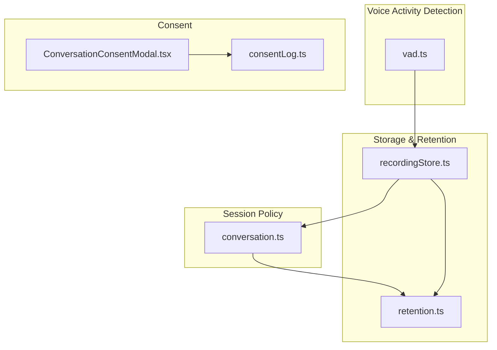
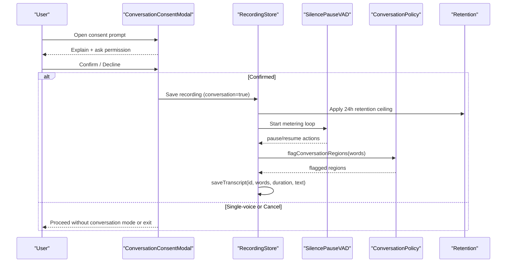
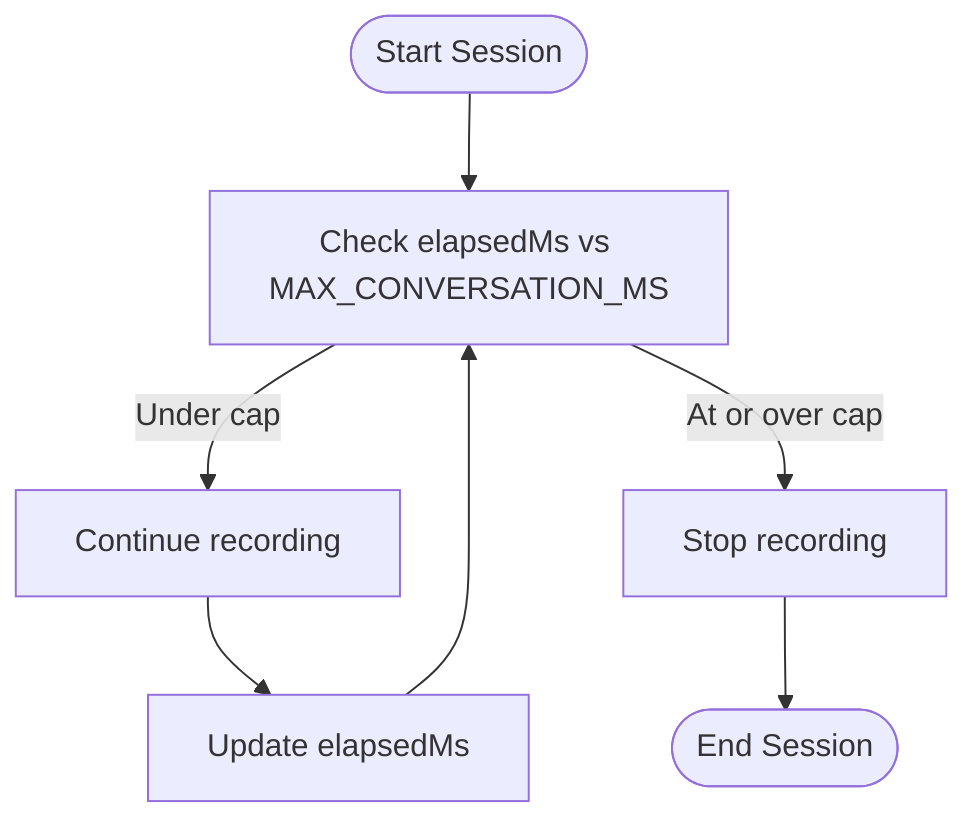
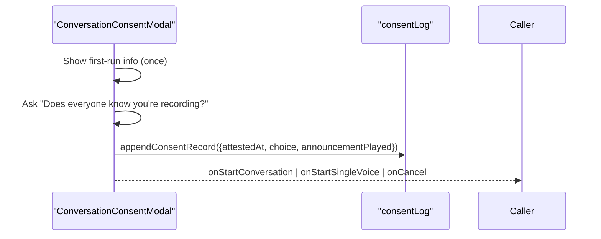
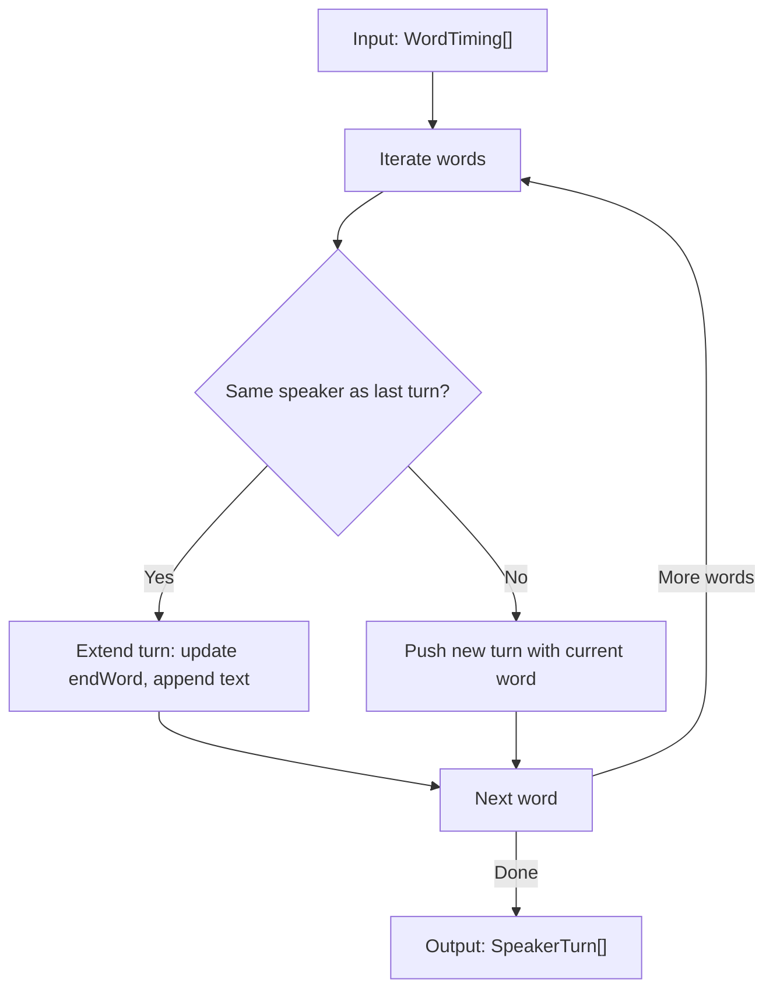
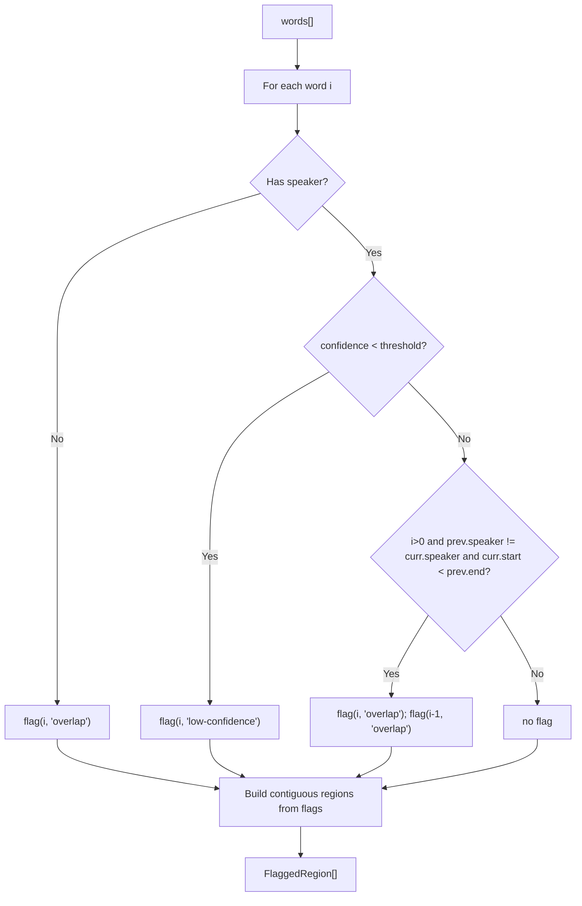
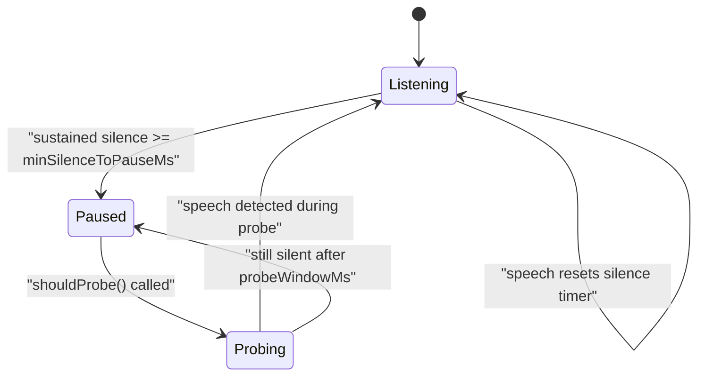
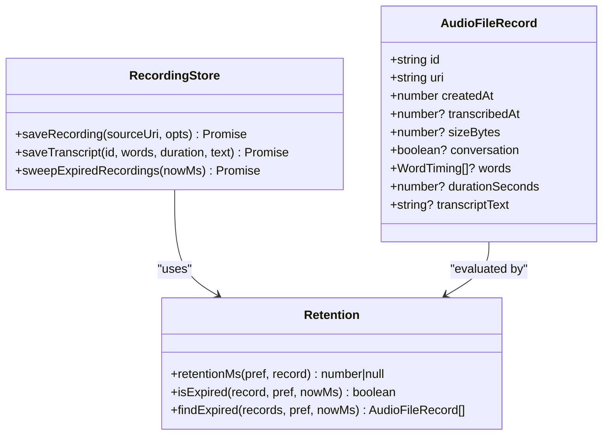
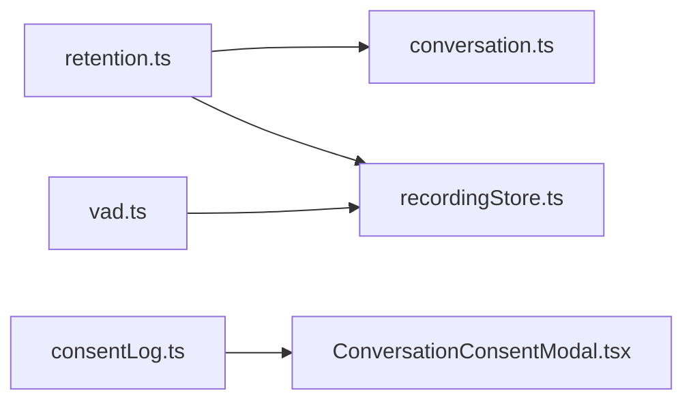

# Conversation Workflow Management

<cite>
**Referenced Files in This Document**
- [conversation.ts](file://src/audio/conversation.ts)
- [conversation.test.ts](file://src/audio/conversation.test.ts)
- [vad.ts](file://src/audio/vad.ts)
- [vad.test.ts](file://src/audio/vad.test.ts)
- [recordingStore.ts](file://src/audio/recordingStore.ts)
- [retention.ts](file://src/audio/retention.ts)
- [consentLog.ts](file://src/audio/consentLog.ts)
- [ConversationConsentModal.tsx](file://src/components/ConversationConsentModal.tsx)
</cite>

## Table of Contents
1. [Introduction](#introduction)
2. [Project Structure](#project-structure)
3. [Core Components](#core-components)
4. [Architecture Overview](#architecture-overview)
5. [Detailed Component Analysis](#detailed-component-analysis)
6. [Dependency Analysis](#dependency-analysis)
7. [Performance Considerations](#performance-considerations)
8. [Troubleshooting Guide](#troubleshooting-guide)
9. [Conclusion](#conclusion)

## Introduction
This document explains the conversation workflow management system for multi-speaker recording sessions. It covers the session lifecycle (consent handling, 45-minute cap, and conversation mode enablement), speaker turn detection that groups consecutive words by speaker identity, overlap detection that flags simultaneous speech or unattributable audio, and a confidence scoring system that highlights low-confidence transcriptions. It also provides examples of session management patterns, speaker identification behavior, and overlap detection logic, plus troubleshooting guidance for timeouts, speaker confusion, and transcription accuracy issues.

## Project Structure
The conversation workflow spans several modules:
- Session policy and grouping: conversation.ts
- Voice activity detection and pause/resume control: vad.ts
- Recording storage, retention, and transcript persistence: recordingStore.ts, retention.ts
- Consent UI and local attestation logging: ConversationConsentModal.tsx, consentLog.ts

**Diagram sources**
- [conversation.ts:1-130](file://src/audio/conversation.ts#L1-L130)
- [vad.ts:1-128](file://src/audio/vad.ts#L1-L128)
- [recordingStore.ts:1-263](file://src/audio/recordingStore.ts#L1-L263)
- [retention.ts:1-114](file://src/audio/retention.ts#L1-L114)
- [ConversationConsentModal.tsx:1-210](file://src/components/ConversationConsentModal.tsx#L1-L210)
- [consentLog.ts:1-37](file://src/audio/consentLog.ts#L1-L37)

**Section sources**
- [conversation.ts:1-130](file://src/audio/conversation.ts#L1-L130)
- [vad.ts:1-128](file://src/audio/vad.ts#L1-L128)
- [recordingStore.ts:1-263](file://src/audio/recordingStore.ts#L1-L263)
- [retention.ts:1-114](file://src/audio/retention.ts#L1-L114)
- [ConversationConsentModal.tsx:1-210](file://src/components/ConversationConsentModal.tsx#L1-L210)
- [consentLog.ts:1-37](file://src/audio/consentLog.ts#L1-L37)

## Core Components
- Conversation policy: feature gate, session duration cap, region flagging for overlaps and low confidence, and speaker turn grouping.
- Voice activity detection: silence-pause strategy with probing to reduce upload size while preserving natural pauses.
- Recording store: persistent manifest, retention enforcement, transcript saving, and language/announcement preferences.
- Retention rules: per-record TTLs, stricter 24-hour ceiling for conversation-mode recordings, expiry helpers.
- Consent flow: blocking modal, first-run explanation, local attestation log.

**Section sources**
- [conversation.ts:14-130](file://src/audio/conversation.ts#L14-L130)
- [vad.ts:16-128](file://src/audio/vad.ts#L16-L128)
- [recordingStore.ts:23-263](file://src/audio/recordingStore.ts#L23-L263)
- [retention.ts:11-114](file://src/audio/retention.ts#L11-L114)
- [ConversationConsentModal.tsx:11-210](file://src/components/ConversationConsentModal.tsx#L11-L210)
- [consentLog.ts:1-37](file://src/audio/consentLog.ts#L1-L37)

## Architecture Overview
The system orchestrates a multi-speaker recording session through these phases:
1. Consent gating before microphone access.
2. Optional audible announcement based on user preference.
3. Live capture with voice activity detection to pause during extended silence and probe periodically.
4. Transcription with word-level timings, speaker labels, and confidence scores.
5. Flagging of overlapping speech and low-confidence segments; grouping into speaker turns for display.
6. Persisting transcripts and managing retention (including strict 24-hour limit for conversation-mode).

**Diagram sources**
- [ConversationConsentModal.tsx:22-81](file://src/components/ConversationConsentModal.tsx#L22-L81)
- [recordingStore.ts:78-141](file://src/audio/recordingStore.ts#L78-L141)
- [retention.ts:56-77](file://src/audio/retention.ts#L56-L77)
- [vad.ts:57-128](file://src/audio/vad.ts#L57-L128)
- [conversation.ts:64-106](file://src/audio/conversation.ts#L64-L106)

## Detailed Component Analysis

### Session Lifecycle and Duration Cap
- Feature gate: conversation mode is enabled via a constant for testing.
- Session cap: hard limit at 45 minutes; helpers compute whether elapsed time exceeds the cap and how many seconds remain.
- Enforcement: callers should stop recording when the cap is reached.

**Diagram sources**
- [conversation.ts:14-39](file://src/audio/conversation.ts#L14-L39)

**Section sources**
- [conversation.ts:14-39](file://src/audio/conversation.ts#L14-L39)
- [conversation.test.ts:27-35](file://src/audio/conversation.test.ts#L27-L35)

### Consent Handling and Announcements
- Blocking modal prevents dismissal until answered.
- First-run explanation appears once per device; subsequent prompts show a concise question.
- Local attestation log records each choice with timestamp and whether an audible announcement played.
- Announcement preference stored locally; default off.

**Diagram sources**
- [ConversationConsentModal.tsx:22-81](file://src/components/ConversationConsentModal.tsx#L22-L81)
- [consentLog.ts:12-36](file://src/audio/consentLog.ts#L12-L36)

**Section sources**
- [ConversationConsentModal.tsx:22-81](file://src/components/ConversationConsentModal.tsx#L22-L81)
- [consentLog.ts:1-37](file://src/audio/consentLog.ts#L1-L37)
- [recordingStore.ts:207-220](file://src/audio/recordingStore.ts#L207-L220)

### Speaker Turn Detection and Grouping
- Groups consecutive words by identical speaker identity into contiguous blocks for display.
- Unattributed words are treated as null speaker and can start a new group.

**Diagram sources**
- [conversation.ts:108-129](file://src/audio/conversation.ts#L108-L129)

**Section sources**
- [conversation.ts:108-129](file://src/audio/conversation.ts#L108-L129)
- [conversation.test.ts:90-107](file://src/audio/conversation.test.ts#L90-L107)

### Overlap Detection Algorithm
- Flags regions where:
  - Two different speakers have overlapping time intervals.
  - A word has no speaker label (unattributable).
  - Confidence falls below threshold.
- Adjacent flagged words merge into one region; if any flagged word is overlap, the merged region reason is overlap.

**Diagram sources**
- [conversation.ts:50-106](file://src/audio/conversation.ts#L50-L106)

**Section sources**
- [conversation.ts:50-106](file://src/audio/conversation.ts#L50-L106)
- [conversation.test.ts:37-88](file://src/audio/conversation.test.ts#L37-L88)

### Confidence Scoring System
- Words with provider confidence below a threshold are flagged as low-confidence.
- Low-confidence regions are surfaced to users so they can review audio rather than trust uncertain text.

**Section sources**
- [conversation.ts:54-78](file://src/audio/conversation.ts#L54-L78)
- [retention.ts:15-25](file://src/audio/retention.ts#L15-L25)

### Voice Activity Detection (VAD) Strategy
- Pauses recording after sustained silence above a configured threshold; preserves short pauses to keep natural rhythm.
- While paused, periodically probes by briefly resuming to detect speech; resumes if speech detected, otherwise re-pauses.
- Hysteresis between silence and resume thresholds avoids flapping due to ambient noise.

**Diagram sources**
- [vad.ts:16-128](file://src/audio/vad.ts#L16-L128)

**Section sources**
- [vad.ts:16-128](file://src/audio/vad.ts#L16-L128)
- [vad.test.ts:22-147](file://src/audio/vad.test.ts#L22-L147)

### Recording Storage and Retention
- Recordings are copied to managed storage and tracked in a JSON manifest.
- Transcript data (word timings, duration, full text) saved alongside recordings.
- Retention policies:
  - Immediate: delete after transcription completes.
  - 30 days: rolling window.
  - Indefinite: keep until deleted.
  - Conversation-mode recordings: strict 24-hour ceiling regardless of preference.

**Diagram sources**
- [retention.ts:11-114](file://src/audio/retention.ts#L11-L114)
- [recordingStore.ts:78-263](file://src/audio/recordingStore.ts#L78-L263)

**Section sources**
- [recordingStore.ts:78-263](file://src/audio/recordingStore.ts#L78-L263)
- [retention.ts:11-114](file://src/audio/retention.ts#L11-L114)

## Dependency Analysis
- conversation.ts depends on WordTiming type from retention.ts.
- recordingStore.ts depends on retention types and functions for expiry and formatting.
- ConversationConsentModal.tsx depends on consentLog.ts for local attestation.
- vad.ts is independent pure logic used by recorder controllers elsewhere.

**Diagram sources**
- [conversation.ts:12-13](file://src/audio/conversation.ts#L12-L13)
- [recordingStore.ts:15-21](file://src/audio/recordingStore.ts#L15-L21)
- [ConversationConsentModal.tsx:7-8](file://src/components/ConversationConsentModal.tsx#L7-L8)

**Section sources**
- [conversation.ts:12-13](file://src/audio/conversation.ts#L12-L13)
- [recordingStore.ts:15-21](file://src/audio/recordingStore.ts#L15-L21)
- [ConversationConsentModal.tsx:7-8](file://src/components/ConversationConsentModal.tsx#L7-L8)

## Performance Considerations
- VAD reduces upload size by pausing during extended silence and only probing briefly, avoiding large gaps in recorded audio.
- Flagging regions merges adjacent flags to minimize UI overhead and avoid excessive small segments.
- Manifest operations are serialized to prevent concurrent writes from clobbering each other.

[No sources needed since this section provides general guidance]

## Troubleshooting Guide

### Session Timeouts
- Symptom: Recording stops unexpectedly near the end of a long session.
- Cause: 45-minute cap enforced by conversation policy.
- Resolution: Ensure caller checks elapsed time against the cap and stops recording at or before the limit.

**Section sources**
- [conversation.ts:18-39](file://src/audio/conversation.ts#L18-L39)
- [conversation.test.ts:30-35](file://src/audio/conversation.test.ts#L30-L35)

### Speaker Confusion and Overlaps
- Symptom: Transcript shows mixed speakers or unclear attribution.
- Cause: Overlapping speech or missing speaker labels produce flagged regions.
- Resolution: Use flagged regions to guide users to listen back; rely on grouped speaker turns for clean sections.

**Section sources**
- [conversation.ts:50-106](file://src/audio/conversation.ts#L50-L106)
- [conversation.test.ts:47-88](file://src/audio/conversation.test.ts#L47-L88)

### Low-Confidence Transcriptions
- Symptom: Text seems unreliable in certain segments.
- Cause: Provider confidence below threshold triggers low-confidence flags.
- Resolution: Surface flagged regions to users; encourage reviewing audio for those parts.

**Section sources**
- [conversation.ts:54-78](file://src/audio/conversation.ts#L54-L78)
- [retention.ts:15-25](file://src/audio/retention.ts#L15-L25)

### VAD Pausing Issues
- Symptom: Recorder stays paused even when someone speaks.
- Cause: Probe not scheduled or ambient noise below resume threshold.
- Resolution: Ensure shouldProbe is called at the configured interval; verify hysteresis thresholds are appropriate for environment.

**Section sources**
- [vad.ts:57-128](file://src/audio/vad.ts#L57-L128)
- [vad.test.ts:62-120](file://src/audio/vad.test.ts#L62-L120)

### Retention and Data Loss
- Symptom: Audio disappears sooner than expected.
- Cause: Immediate retention deletes after transcription; conversation-mode recordings expire within 24 hours regardless of preference.
- Resolution: Adjust retention preference if not using conversation mode; understand that conversation-mode audio is intentionally short-lived.

**Section sources**
- [retention.ts:56-81](file://src/audio/retention.ts#L56-L81)
- [recordingStore.ts:226-242](file://src/audio/recordingStore.ts#L226-L242)

## Conclusion
The conversation workflow management system provides a robust, privacy-aware approach to multi-speaker recording. It enforces consent, caps session length, detects and flags overlaps and low-confidence segments, groups speaker turns for clear presentation, and applies strict retention rules for conversation-mode content. The VAD strategy balances quality and efficiency by preserving natural pauses while reducing upload size. Together, these components deliver a reliable experience for capturing, processing, and presenting multi-speaker conversations with transparency about limitations.