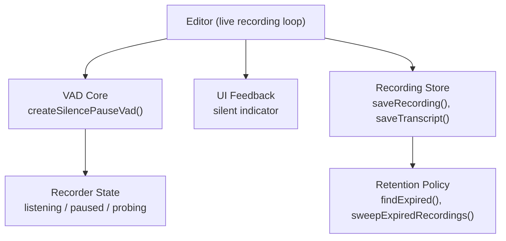
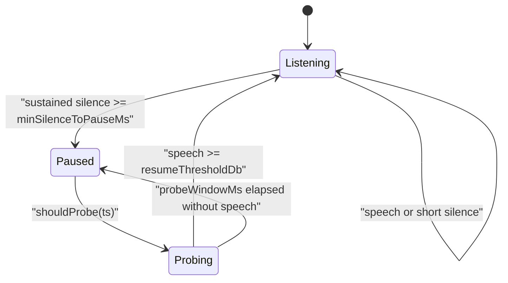
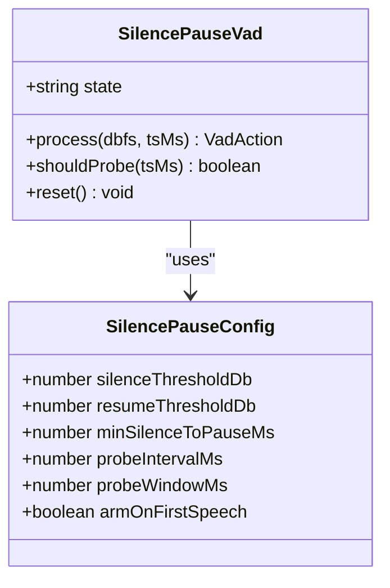
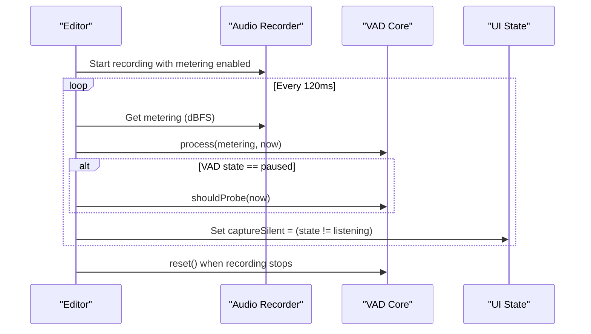
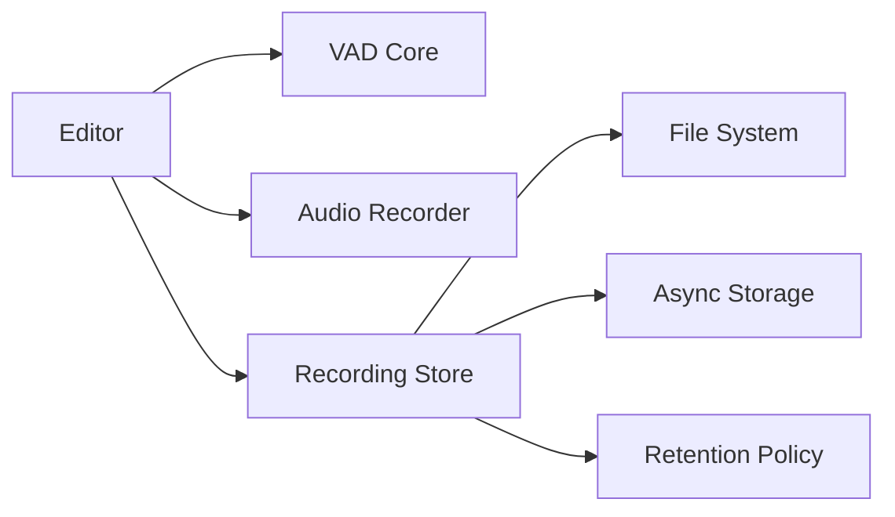

# Voice Activity Detection (VAD)

<cite>
**Referenced Files in This Document**
- [vad.ts](file://src/audio/vad.ts)
- [vad.test.ts](file://src/audio/vad.test.ts)
- [editor.tsx](file://app/editor.tsx)
- [recordingStore.ts](file://src/audio/recordingStore.ts)
- [retention.ts](file://src/audio/retention.ts)
</cite>

## Table of Contents
1. [Introduction](#introduction)
2. [Project Structure](#project-structure)
3. [Core Components](#core-components)
4. [Architecture Overview](#architecture-overview)
5. [Detailed Component Analysis](#detailed-component-analysis)
6. [Dependency Analysis](#dependency-analysis)
7. [Performance Considerations](#performance-considerations)
8. [Troubleshooting Guide](#troubleshooting-guide)
9. [Conclusion](#conclusion)

## Introduction
This document explains the Voice Activity Detection (VAD) system used to optimize audio capture and transcription. The VAD identifies speech segments within recordings to reduce unnecessary processing and API calls by pausing during extended silence while preserving natural pauses that carry speech rhythm. It is implemented as a pure logic module with clear configuration for sensitivity thresholds, minimum silence duration, and probe behavior. The editor integrates VAD into the live recording loop to provide real-time feedback and ensure robust handling of device metering variability.

## Project Structure
The VAD system is composed of:
- A pure logic core that processes dBFS samples and decides when to pause/resume based on configured thresholds and timing windows.
- An integration layer in the editor that feeds metering data into the VAD and updates UI state accordingly.
- Supporting modules for recording storage and retention policies that manage captured files and their lifecycle.

**Diagram sources**
- [editor.tsx:664-695](file://app/editor.tsx#L664-L695)
- [vad.ts:57-127](file://src/audio/vad.ts#L57-L127)
- [recordingStore.ts:78-140](file://src/audio/recordingStore.ts#L78-L140)
- [retention.ts:56-81](file://src/audio/retention.ts#L56-L81)

**Section sources**
- [vad.ts:1-128](file://src/audio/vad.ts#L1-L128)
- [editor.tsx:664-695](file://app/editor.tsx#L664-L695)
- [recordingStore.ts:1-263](file://src/audio/recordingStore.ts#L1-L263)
- [retention.ts:1-114](file://src/audio/retention.ts#L1-L114)

## Core Components
- SilencePauseConfig: Defines thresholds and timing parameters for detecting silence and resuming from probes.
- createSilencePauseVad: Factory that returns a VAD instance with process(), shouldProbe(), reset(), and state accessors.
- Editor integration: Periodically queries metering, feeds it to VAD, and toggles a silent indicator based on VAD state.

Key behaviors:
- Natural pauses under ~0.9s are preserved; only extended silence triggers pause.
- Hysteresis between silence and resume thresholds prevents flapping due to ambient noise.
- Probing ensures the recorder can recover if the user starts speaking after a pause.

**Section sources**
- [vad.ts:19-55](file://src/audio/vad.ts#L19-L55)
- [vad.ts:57-127](file://src/audio/vad.ts#L57-L127)
- [editor.tsx:664-695](file://app/editor.tsx#L664-L695)

## Architecture Overview
The VAD operates as a state machine driven by dBFS samples and timestamps. The editor supplies metering at a fixed interval, and the VAD transitions between listening, paused, and probing states. When paused, periodic probes briefly listen for speech to resume recording if needed.

**Diagram sources**
- [vad.ts:66-117](file://src/audio/vad.ts#L66-L117)

## Detailed Component Analysis

### VAD Core: createSilencePauseVad
Responsibilities:
- Track current state (listening, paused, probing).
- Process incoming dBFS samples with time-based decisions.
- Manage armed state to avoid pausing before any speech occurs (armOnFirstSpeech).
- Provide shouldProbe() to transition into probing mode and reset() to reinitialize.

Algorithm highlights:
- isSpeech(dbfs, threshold): Treats undefined/NaN as silence; uses finite checks.
- Silence detection: Starts counting silence when speech stops; pauses after sustained silence exceeds minSilenceToPauseMs.
- Resume hysteresis: Uses a higher resumeThresholdDb than silenceThresholdDb to prevent false resumes from ambient noise.
- Probe cycle: While paused, periodically switch to probing; if speech detected within probeWindowMs, resume; otherwise re-pause.

Complexity:
- Time complexity per sample: O(1).
- Space complexity: O(1) state variables.

Error handling:
- Gracefully handles missing or invalid metering by treating it as silence.
- Resets maintain consistent initial conditions.

**Section sources**
- [vad.ts:19-55](file://src/audio/vad.ts#L19-L55)
- [vad.ts:57-127](file://src/audio/vad.ts#L57-L127)

#### Class Diagram

**Diagram sources**
- [vad.ts:19-55](file://src/audio/vad.ts#L19-L55)
- [vad.ts:46-55](file://src/audio/vad.ts#L46-L55)

### Editor Integration: Live Metering Loop
Responsibilities:
- Enable metering on the audio recorder.
- Poll metering at a fixed interval and feed values into VAD.
- Update UI state to reflect whether the recording is currently considered silent.
- Reset VAD when recording stops.

Integration details:
- Uses DEFAULT_SILENCE_PAUSE_CONFIG with probeIntervalMs set to 0 and probeWindowMs set to 120ms to drive immediate evaluation rather than waiting for recorder-probe timing.
- Calls vad.shouldProbe() when paused to transition to probing and evaluate quickly.
- Sets captureSilent based on vad.state !== 'listening'.

**Diagram sources**
- [editor.tsx:664-695](file://app/editor.tsx#L664-L695)
- [vad.ts:57-127](file://src/audio/vad.ts#L57-L127)

**Section sources**
- [editor.tsx:664-695](file://app/editor.tsx#L664-L695)

### Recording Storage and Retention
While not part of VAD logic, these modules manage recorded files and their lifecycle, which complements VAD’s goal of reducing unnecessary uploads and processing.

Key functions:
- saveRecording(): Copies captured file to managed storage and registers metadata.
- saveTranscript(): Persists word timings, duration, and transcript text for playback and export.
- sweepExpiredRecordings(): Deletes expired files according to retention policy.

Retention rules:
- Immediate deletion after transcription for non-conversation recordings.
- 30-day rolling window default.
- Conversation-mode recordings have stricter expiration (24h ceiling).

**Section sources**
- [recordingStore.ts:78-140](file://src/audio/recordingStore.ts#L78-L140)
- [recordingStore.ts:222-241](file://src/audio/recordingStore.ts#L222-L241)
- [retention.ts:56-81](file://src/audio/retention.ts#L56-L81)

## Dependency Analysis
- VAD depends only on numeric inputs and timestamps; no external libraries or React imports.
- Editor depends on VAD and audio recorder to supply metering.
- Recording store depends on file system APIs and async storage for manifest management.
- Retention policy provides rules applied by the recording store.

**Diagram sources**
- [editor.tsx:664-695](file://app/editor.tsx#L664-L695)
- [recordingStore.ts:11-21](file://src/audio/recordingStore.ts#L11-L21)
- [retention.ts:1-114](file://src/audio/retention.ts#L1-L114)

**Section sources**
- [vad.ts:1-128](file://src/audio/vad.ts#L1-L128)
- [editor.tsx:664-695](file://app/editor.tsx#L664-L695)
- [recordingStore.ts:1-263](file://src/audio/recordingStore.ts#L1-L263)
- [retention.ts:1-114](file://src/audio/retention.ts#L1-L114)

## Performance Considerations
- VAD is O(1) per sample and avoids heavy computation; suitable for frequent polling.
- Using a fixed polling interval (e.g., 120ms) balances responsiveness and CPU usage.
- Hysteresis reduces state flapping caused by ambient noise spikes.
- Probing window limits how long the recorder stays in probing mode, minimizing overhead.
- Default thresholds (-42 dBFS silence, -38 dBFS resume) provide a practical baseline; tune based on environment.

[No sources needed since this section provides general guidance]

## Troubleshooting Guide
Common issues and remedies:
- False pauses due to low-volume speech: Increase minSilenceToPauseMs or adjust silenceThresholdDb lower.
- Frequent resume/pause flapping: Increase gap between silenceThresholdDb and resumeThresholdDb to strengthen hysteresis.
- Missed speech after pause: Ensure shouldProbe() is called regularly and probeWindowMs is sufficient for typical speech onset.
- Device-specific metering differences: Validate getMetering() returns valid dBFS; treat undefined/NaN as silence (already handled).
- Environmental noise: Lower silenceThresholdDb slightly or increase minSilenceToPauseMs to ignore transient noise.

Validation via tests:
- Continuous speech never pauses.
- Natural pauses under threshold do not trigger pause.
- Stale samples while paused are ignored.
- Probe correctly resumes on speech and re-pauses on continued silence.
- Undefined/NaN metering treated as silence without crashes.

**Section sources**
- [vad.test.ts:25-147](file://src/audio/vad.test.ts#L25-L147)
- [vad.ts:66-117](file://src/audio/vad.ts#L66-L117)

## Conclusion
The VAD system provides efficient silence detection and segmentation for audio capture, preserving natural speech rhythm while avoiding unnecessary processing during extended silence. Its pure logic design, configurable thresholds, and robust probe mechanism make it adaptable to various environments and devices. Integrated into the editor’s live recording loop, it offers immediate feedback and reliable state transitions, complementing storage and retention policies to optimize overall transcription workflow.