# Authentication & Security

<cite>
**Referenced Files in This Document**
- [loginWorkflow.ts](file://src/auth/loginWorkflow.ts)
- [authApi.ts](file://src/auth/api/authApi.ts)
- [authStorage.ts](file://src/auth/storage/authStorage.ts)
- [auth.types.ts](file://src/auth/types/auth.types.ts)
- [e2ee.ts](file://src/crypto/e2ee.ts)
- [keySession.ts](file://src/crypto/keySession.ts)
- [keystore.ts](file://src/crypto/keystore.ts)
- [escrowApi.ts](file://src/crypto/escrowApi.ts)
- [accountCrypto.ts](file://src/crypto/accountCrypto.ts)
- [noteCryptoCore.ts](file://src/crypto/noteCryptoCore.ts)
- [kdf-native.ts](file://src/crypto/kdf-native.ts)
- [flags.ts](file://src/crypto/flags.ts)
</cite>

## Table of Contents
1. [Introduction](#introduction)
2. [Project Structure](#project-structure)
3. [Core Components](#core-components)
4. [Architecture Overview](#architecture-overview)
5. [Detailed Component Analysis](#detailed-component-analysis)
6. [Dependency Analysis](#dependency-analysis)
7. [Performance Considerations](#performance-considerations)
8. [Troubleshooting Guide](#troubleshooting-guide)
9. [Conclusion](#conclusion)
10. [Appendices](#appendices)

## Introduction
This document explains the authentication and end-to-end encryption (E2EE) system implemented in the frontend. It covers:
- JWT-based authentication flow, secure token storage, and session management
- Zero-knowledge architecture where user data is encrypted client-side before transmission
- Key derivation using PBKDF2, password-based encryption, and recovery code generation
- The crypto engine with AES-256-GCM, key rotation, and secure backup mechanisms
- Secure storage practices and vulnerability mitigation strategies
- Common security workflows such as password changes, account recovery, and secure data export

The design ensures that the server never sees plaintext secrets or data when E2EE is enabled. Sensitive keys remain on-device, while only ciphertext and opaque wrapped keys are stored on the server.

## Project Structure
Security-related modules are organized into two main areas:
- Authentication: login, logout, token handling, and API interactions
- Encryption: key management, escrow, and per-field encryption for notes and account data

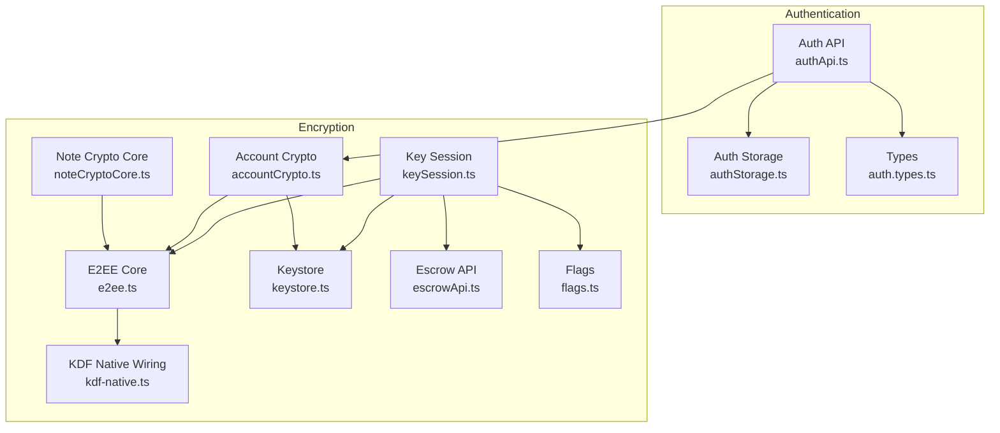

**Diagram sources**
- [authApi.ts:1-259](file://src/auth/api/authApi.ts#L1-L259)
- [authStorage.ts:1-150](file://src/auth/storage/authStorage.ts#L1-L150)
- [auth.types.ts:1-66](file://src/auth/types/auth.types.ts#L1-L66)
- [e2ee.ts:1-228](file://src/crypto/e2ee.ts#L1-L228)
- [keySession.ts:1-82](file://src/crypto/keySession.ts#L1-L82)
- [keystore.ts:1-53](file://src/crypto/keystore.ts#L1-L53)
- [escrowApi.ts:1-39](file://src/crypto/escrowApi.ts#L1-L39)
- [accountCrypto.ts:1-47](file://src/crypto/accountCrypto.ts#L1-L47)
- [noteCryptoCore.ts:1-158](file://src/crypto/noteCryptoCore.ts#L1-L158)
- [kdf-native.ts:1-22](file://src/crypto/kdf-native.ts#L1-L22)
- [flags.ts:1-34](file://src/crypto/flags.ts#L1-L34)

**Section sources**
- [authApi.ts:1-259](file://src/auth/api/authApi.ts#L1-L259)
- [authStorage.ts:1-150](file://src/auth/storage/authStorage.ts#L1-L150)
- [auth.types.ts:1-66](file://src/auth/types/auth.types.ts#L1-L66)
- [e2ee.ts:1-228](file://src/crypto/e2ee.ts#L1-L228)
- [keySession.ts:1-82](file://src/crypto/keySession.ts#L1-L82)
- [keystore.ts:1-53](file://src/crypto/keystore.ts#L1-L53)
- [escrowApi.ts:1-39](file://src/crypto/escrowApi.ts#L1-L39)
- [accountCrypto.ts:1-47](file://src/crypto/accountCrypto.ts#L1-L47)
- [noteCryptoCore.ts:1-158](file://src/crypto/noteCryptoCore.ts#L1-L158)
- [kdf-native.ts:1-22](file://src/crypto/kdf-native.ts#L1-L22)
- [flags.ts:1-34](file://src/crypto/flags.ts#L1-L34)

## Core Components
- Authentication API: Handles signup, login, logout, token refresh, profile retrieval, password change/reset, and name updates. It attaches JWT tokens to requests and decrypts account names when needed.
- Auth Storage: Persists access and refresh tokens securely using platform-appropriate storage (SecureStore on native, AsyncStorage on web).
- E2EE Core: Implements AES-256-GCM encryption, PBKDF2 key derivation, DEK generation/wrapping, and recovery code generation.
- Key Session: Orchestrates DEK bootstrap at login, recovery via recovery code, authenticated password changes, and logout cleanup.
- Keystore: Stores the Data Encryption Key (DEK) in the OS keystore with memoization to minimize native calls.
- Escrow API: Communicates with the server to store/retrieve the opaque EscrowBundle containing wrapped DEK blobs and salts.
- Account Crypto: Decrypts the account name from server responses when it is stored as ciphertext.
- Note Crypto Core: Encrypts/decrypts note fields (title, content, tag names, attachment filenames) under the DEK and handles migration flags.
- KDF Native Wiring: Registers a native PBKDF2 implementation for performance-critical key derivation.
- Flags: Feature flags controlling E2EE key bootstrap and migration behavior across environments.

**Section sources**
- [authApi.ts:1-259](file://src/auth/api/authApi.ts#L1-L259)
- [authStorage.ts:1-150](file://src/auth/storage/authStorage.ts#L1-L150)
- [e2ee.ts:1-228](file://src/crypto/e2ee.ts#L1-L228)
- [keySession.ts:1-82](file://src/crypto/keySession.ts#L1-L82)
- [keystore.ts:1-53](file://src/crypto/keystore.ts#L1-L53)
- [escrowApi.ts:1-39](file://src/crypto/escrowApi.ts#L1-L39)
- [accountCrypto.ts:1-47](file://src/crypto/accountCrypto.ts#L1-L47)
- [noteCryptoCore.ts:1-158](file://src/crypto/noteCryptoCore.ts#L1-L158)
- [kdf-native.ts:1-22](file://src/crypto/kdf-native.ts#L1-L22)
- [flags.ts:1-34](file://src/crypto/flags.ts#L1-L34)

## Architecture Overview
The system follows a zero-knowledge model:
- User credentials authenticate via JWT; tokens are stored securely on-device.
- On first login or new device, a DEK is generated and wrapped by two KEKs: one derived from the user’s password, another from a recovery code.
- The wrapped DEK bundle is stored on the server; the DEK itself remains in the device keystore.
- All sensitive data (notes, account name) is encrypted client-side with AES-256-GCM under the DEK before transmission.
- The server stores only ciphertext and opaque wrapped keys; it cannot read plaintext.

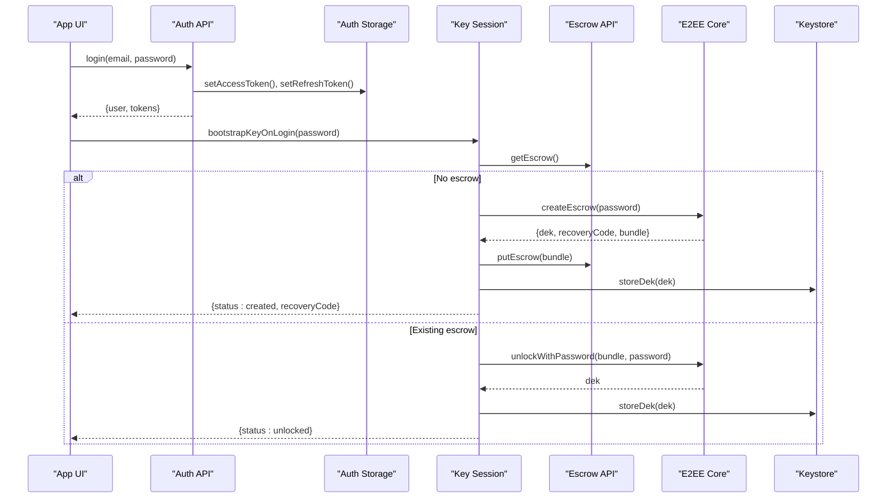

**Diagram sources**
- [authApi.ts:69-105](file://src/auth/api/authApi.ts#L69-L105)
- [keySession.ts:35-54](file://src/crypto/keySession.ts#L35-L54)
- [e2ee.ts:179-202](file://src/crypto/e2ee.ts#L179-L202)
- [escrowApi.ts:21-38](file://src/crypto/escrowApi.ts#L21-L38)
- [keystore.ts:30-42](file://src/crypto/keystore.ts#L30-L42)

**Section sources**
- [authApi.ts:69-105](file://src/auth/api/authApi.ts#L69-L105)
- [keySession.ts:35-54](file://src/crypto/keySession.ts#L35-L54)
- [e2ee.ts:179-202](file://src/crypto/e2ee.ts#L179-L202)
- [escrowApi.ts:21-38](file://src/crypto/escrowApi.ts#L21-L38)
- [keystore.ts:30-42](file://src/crypto/keystore.ts#L30-L42)

## Detailed Component Analysis

### JWT-Based Authentication Flow
- Login sends email/password plus device info to the backend and receives access_token, refresh_token, and user object.
- Tokens are persisted securely; subsequent requests include Authorization header with the access token.
- Token refresh uses the refresh token endpoint; on 401/403, tokens are cleared to force re-authentication.
- Logout clears local tokens and optionally notifies the server.

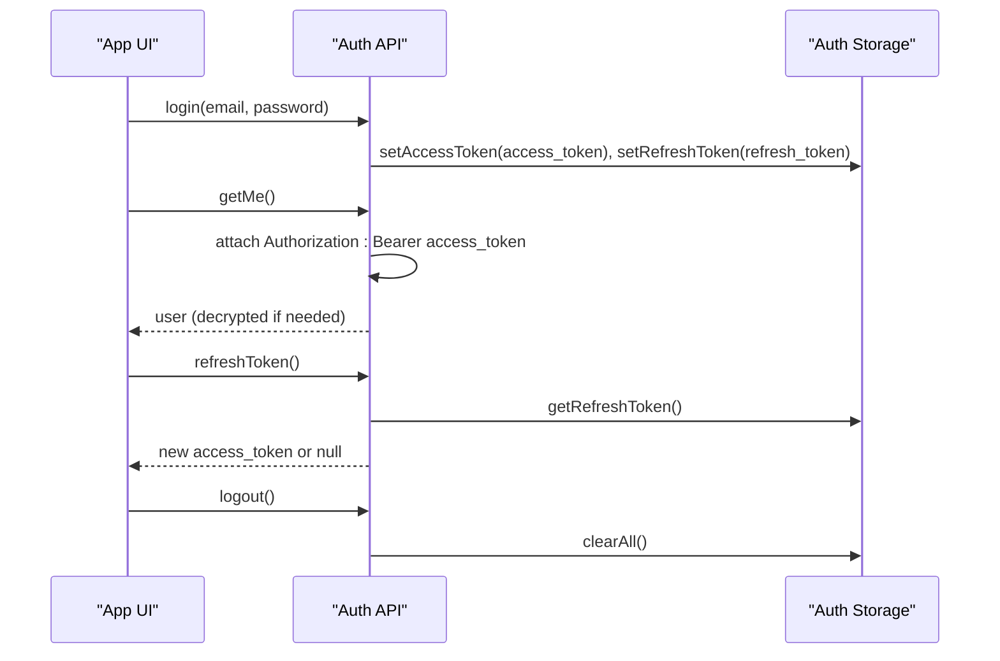

**Diagram sources**
- [authApi.ts:69-105](file://src/auth/api/authApi.ts#L69-L105)
- [authApi.ts:122-151](file://src/auth/api/authApi.ts#L122-L151)
- [authApi.ts:153-164](file://src/auth/api/authApi.ts#L153-L164)
- [authApi.ts:107-120](file://src/auth/api/authApi.ts#L107-L120)
- [authStorage.ts:16-67](file://src/auth/storage/authStorage.ts#L16-L67)

**Section sources**
- [authApi.ts:69-105](file://src/auth/api/authApi.ts#L69-L105)
- [authApi.ts:107-120](file://src/auth/api/authApi.ts#L107-L120)
- [authApi.ts:122-151](file://src/auth/api/authApi.ts#L122-L151)
- [authApi.ts:153-164](file://src/auth/api/authApi.ts#L153-L164)
- [authStorage.ts:16-67](file://src/auth/storage/authStorage.ts#L16-L67)

### Secure Token Storage and Session Management
- Access and refresh tokens are stored using SecureStore on native platforms and AsyncStorage on web.
- The storage layer provides getters/setters and a clear-all function for sign-out flows.
- Session integrity is maintained by clearing tokens on explicit logout or invalid refresh responses.

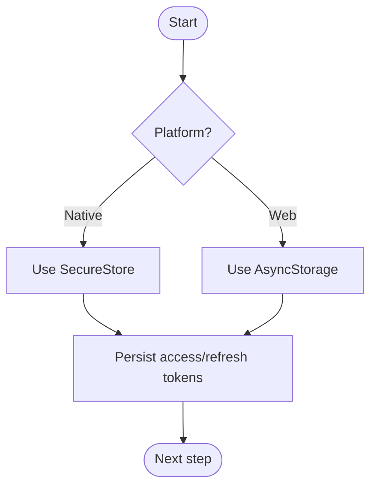

**Diagram sources**
- [authStorage.ts:16-67](file://src/auth/storage/authStorage.ts#L16-L67)

**Section sources**
- [authStorage.ts:16-67](file://src/auth/storage/authStorage.ts#L16-L67)

### Zero-Knowledge Architecture and Client-Side Encryption
- Notes and account names can be stored as ciphertext on the server; only the client holds the DEK.
- The E2EE core encrypts strings using AES-256-GCM with unique nonces and versioned tokens.
- Account name decryption occurs after receiving server responses; if the name is ciphertext, it is decrypted locally using the DEK.

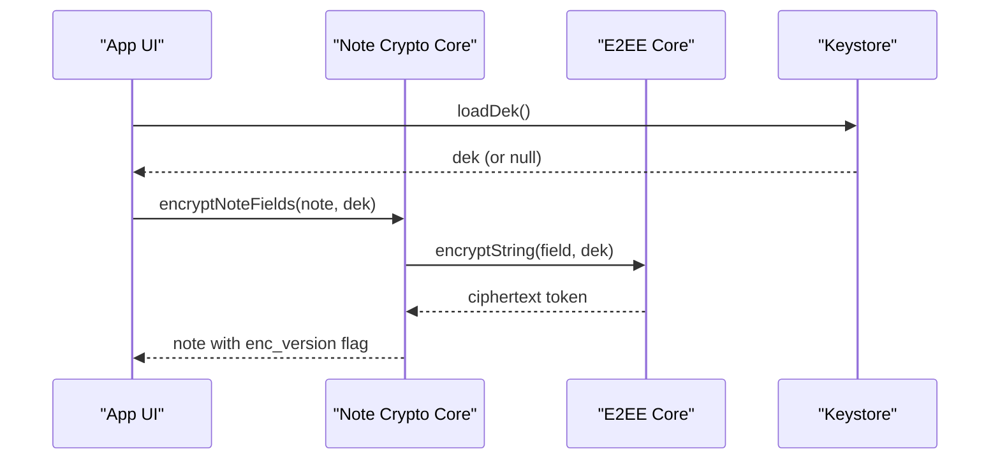

**Diagram sources**
- [noteCryptoCore.ts:65-95](file://src/crypto/noteCryptoCore.ts#L65-L95)
- [e2ee.ts:117-124](file://src/crypto/e2ee.ts#L117-L124)
- [keystore.ts:36-42](file://src/crypto/keystore.ts#L36-L42)

**Section sources**
- [noteCryptoCore.ts:65-95](file://src/crypto/noteCryptoCore.ts#L65-L95)
- [e2ee.ts:117-124](file://src/crypto/e2ee.ts#L117-L124)
- [keystore.ts:36-42](file://src/crypto/keystore.ts#L36-L42)

### Key Derivation and Recovery Code Generation
- PBKDF2 is used to derive KEKs from passwords and recovery codes with configurable parameters.
- A native PBKDF2 implementation is wired in for performance; pure-JS fallback is not used in production paths.
- Recovery codes are generated with a safe alphabet and sufficient entropy; formatting is normalized before use.

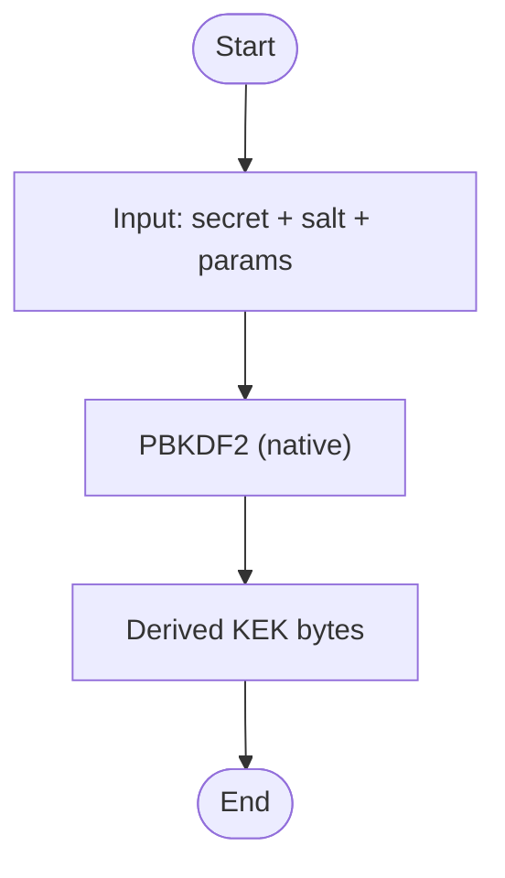

**Diagram sources**
- [kdf-native.ts:15-21](file://src/crypto/kdf-native.ts#L15-L21)
- [e2ee.ts:145-150](file://src/crypto/e2ee.ts#L145-L150)
- [e2ee.ts:165-175](file://src/crypto/e2ee.ts#L165-L175)

**Section sources**
- [kdf-native.ts:15-21](file://src/crypto/kdf-native.ts#L15-L21)
- [e2ee.ts:145-150](file://src/crypto/e2ee.ts#L145-L150)
- [e2ee.ts:165-175](file://src/crypto/e2ee.ts#L165-L175)

### AES-256-GCM Encryption Engine
- Uses AES-GCM with random nonces and versioned ciphertext tokens.
- Supports encrypting/decrypting strings and wrapping/unwrapping keys.
- Throws on tampered or malformed ciphertext, ensuring integrity checks.

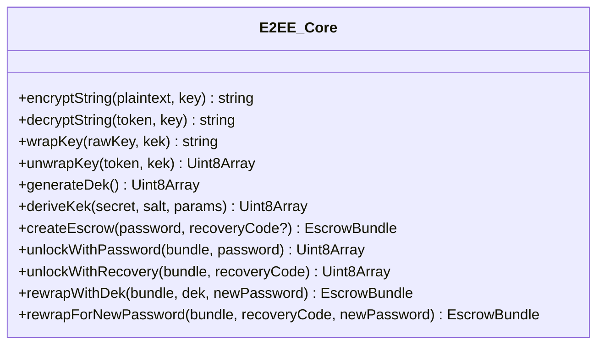

**Diagram sources**
- [e2ee.ts:99-158](file://src/crypto/e2ee.ts#L99-L158)
- [e2ee.ts:179-227](file://src/crypto/e2ee.ts#L179-L227)

**Section sources**
- [e2ee.ts:99-158](file://src/crypto/e2ee.ts#L99-L158)
- [e2ee.ts:179-227](file://src/crypto/e2ee.ts#L179-L227)

### Key Rotation and Secure Backup Mechanisms
- Key rotation is achieved by re-wrapping the DEK under a new password without exposing the DEK to the server.
- Secure backup is provided via the EscrowBundle stored on the server; it contains wrapped DEK blobs and salts, enabling recovery without plaintext exposure.
- Logout clears the DEK from the device keystore to prevent persistence beyond the session.

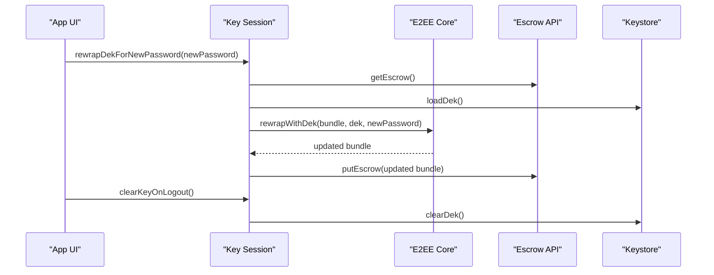

**Diagram sources**
- [keySession.ts:73-81](file://src/crypto/keySession.ts#L73-L81)
- [e2ee.ts:214-220](file://src/crypto/e2ee.ts#L214-L220)
- [escrowApi.ts:31-38](file://src/crypto/escrowApi.ts#L31-L38)
- [keystore.ts:44-48](file://src/crypto/keystore.ts#L44-L48)

**Section sources**
- [keySession.ts:73-81](file://src/crypto/keySession.ts#L73-L81)
- [e2ee.ts:214-220](file://src/crypto/e2ee.ts#L214-L220)
- [escrowApi.ts:31-38](file://src/crypto/escrowApi.ts#L31-L38)
- [keystore.ts:44-48](file://src/crypto/keystore.ts#L44-L48)

### Biometric Authentication Support
- There is no biometric-specific implementation found in the analyzed files. Authentication relies on password-based JWT and optional recovery code flows.
- If biometrics are desired in the future, they could integrate with SecureStore-backed key protection or device-bound key usage patterns.

[No sources needed since this section summarizes findings without analyzing specific files]

### Secure Storage Practices
- Sensitive tokens and user data are stored using SecureStore on native platforms and AsyncStorage on web.
- The DEK is stored exclusively in the OS keystore via SecureStore and memoized to reduce native calls.
- Web builds do not support SecureStore; E2EE features are effectively disabled on web until alternative secure storage is implemented.

**Section sources**
- [authStorage.ts:16-67](file://src/auth/storage/authStorage.ts#L16-L67)
- [keystore.ts:1-53](file://src/crypto/keystore.ts#L1-L53)

### Vulnerability Mitigation Strategies
- Integrity verification: AES-GCM auth tags detect tampering; malformed or wrong-key ciphertext throws errors.
- Safe defaults: Migration and diagnostics are feature-flagged to avoid unintended exposure or behavior in production.
- Graceful degradation: Undecryptable fields display placeholders instead of crashing the UI.
- Network resilience: Token refresh failures handle network errors without wiping valid tokens; explicit 401/403 triggers cleanup.

**Section sources**
- [e2ee.ts:106-114](file://src/crypto/e2ee.ts#L106-L114)
- [flags.ts:1-34](file://src/crypto/flags.ts#L1-L34)
- [noteCryptoCore.ts:147-157](file://src/crypto/noteCryptoCore.ts#L147-L157)
- [authApi.ts:122-151](file://src/auth/api/authApi.ts#L122-L151)

## Dependency Analysis
The authentication and encryption components have clear separation of concerns:
- Auth API depends on Auth Storage and Account Crypto for token handling and name decryption.
- Key Session depends on E2EE Core, Escrow API, and Keystore for DEK lifecycle management.
- Note Crypto Core depends on E2EE Core for field-level encryption.
- KDF wiring is injected into E2EE Core to provide platform-specific performance.

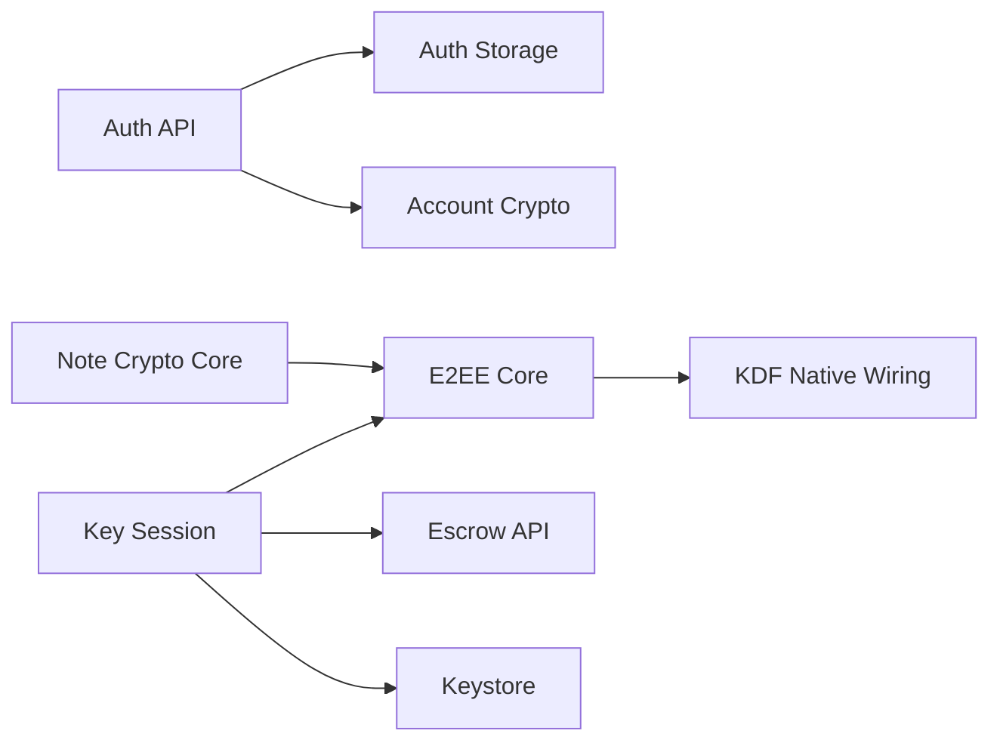

**Diagram sources**
- [authApi.ts:1-259](file://src/auth/api/authApi.ts#L1-L259)
- [keySession.ts:1-82](file://src/crypto/keySession.ts#L1-L82)
- [noteCryptoCore.ts:1-158](file://src/crypto/noteCryptoCore.ts#L1-L158)
- [e2ee.ts:1-228](file://src/crypto/e2ee.ts#L1-L228)
- [kdf-native.ts:1-22](file://src/crypto/kdf-native.ts#L1-L22)

**Section sources**
- [authApi.ts:1-259](file://src/auth/api/authApi.ts#L1-L259)
- [keySession.ts:1-82](file://src/crypto/keySession.ts#L1-L82)
- [noteCryptoCore.ts:1-158](file://src/crypto/noteCryptoCore.ts#L1-L158)
- [e2ee.ts:1-228](file://src/crypto/e2ee.ts#L1-L228)
- [kdf-native.ts:1-22](file://src/crypto/kdf-native.ts#L1-L22)

## Performance Considerations
- PBKDF2 iterations are tuned for acceptable login times on mid-range devices; native implementation ensures responsiveness.
- DEK caching reduces repeated SecureStore reads during operations like note saves or sync passes.
- Background post-login work (sync, migrations) does not block login return, improving perceived performance.

[No sources needed since this section provides general guidance]

## Troubleshooting Guide
Common issues and resolutions:
- Wrong password after email reset: The flow returns needs_recovery; use the recovery code to re-wrap the DEK under the new password.
- Network errors during token refresh: Tokens are preserved unless the server explicitly rejects them; retry when online.
- Undecryptable fields: Display placeholders rather than failing; investigate whether the DEK was available and correct.
- Feature flags: Ensure E2EE keys and migration flags are correctly configured for the environment.

**Section sources**
- [keySession.ts:35-54](file://src/crypto/keySession.ts#L35-L54)
- [authApi.ts:122-151](file://src/auth/api/authApi.ts#L122-L151)
- [noteCryptoCore.ts:147-157](file://src/crypto/noteCryptoCore.ts#L147-L157)
- [flags.ts:1-34](file://src/crypto/flags.ts#L1-L34)

## Conclusion
The frontend implements a robust, zero-knowledge authentication and encryption system:
- JWT-based authentication with secure token storage and session management
- Client-side encryption of sensitive data using AES-256-GCM
- Password-derived and recovery-code-derived key wrapping for resilient key management
- Secure storage of the DEK in the OS keystore with careful caching and cleanup
- Feature flags and graceful error handling to maintain reliability and safety

This design minimizes trust in the server for sensitive data and provides strong protections against unauthorized access.

[No sources needed since this section summarizes without analyzing specific files]

## Appendices

### Common Security Workflows

#### Password Change (Authenticated)
- The user provides current and new passwords; the server validates and updates credentials.
- Locally, the DEK is re-wrapped under the new password to keep the escrow consistent.

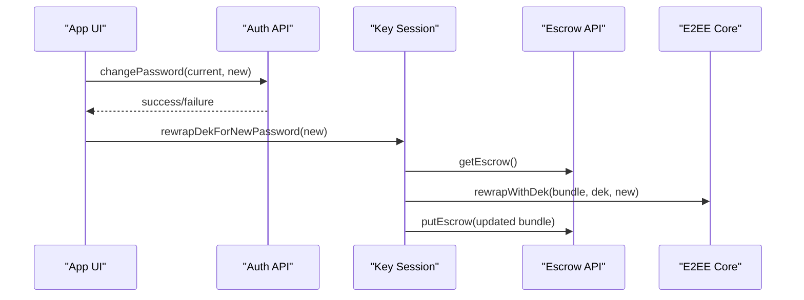

**Diagram sources**
- [authApi.ts:215-233](file://src/auth/api/authApi.ts#L215-L233)
- [keySession.ts:73-77](file://src/crypto/keySession.ts#L73-L77)
- [e2ee.ts:214-220](file://src/crypto/e2ee.ts#L214-L220)
- [escrowApi.ts:31-38](file://src/crypto/escrowApi.ts#L31-L38)

**Section sources**
- [authApi.ts:215-233](file://src/auth/api/authApi.ts#L215-L233)
- [keySession.ts:73-77](file://src/crypto/keySession.ts#L73-L77)
- [e2ee.ts:214-220](file://src/crypto/e2ee.ts#L214-L220)
- [escrowApi.ts:31-38](file://src/crypto/escrowApi.ts#L31-L38)

#### Account Recovery (Using Recovery Code)
- When the password no longer unwraps the escrow (e.g., after email reset), the user supplies the recovery code.
- The DEK is recovered and re-wrapped under the new password; the updated escrow is stored on the server.

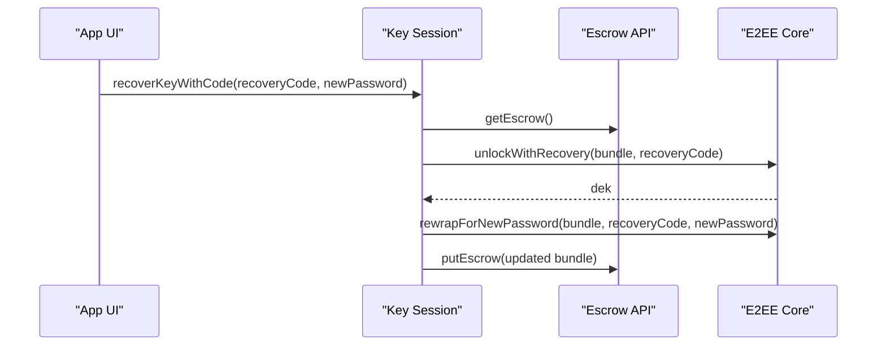

**Diagram sources**
- [keySession.ts:60-67](file://src/crypto/keySession.ts#L60-L67)
- [e2ee.ts:209-227](file://src/crypto/e2ee.ts#L209-L227)
- [escrowApi.ts:31-38](file://src/crypto/escrowApi.ts#L31-L38)

**Section sources**
- [keySession.ts:60-67](file://src/crypto/keySession.ts#L60-L67)
- [e2ee.ts:209-227](file://src/crypto/e2ee.ts#L209-L227)
- [escrowApi.ts:31-38](file://src/crypto/escrowApi.ts#L31-L38)

#### Secure Data Export
- While not directly implemented in the analyzed files, exporting encrypted data would involve retrieving ciphertext and metadata from local storage or synced state.
- For secure export, ensure exported payloads retain enc_version flags and ciphertext tokens so recipients can decrypt with the appropriate DEK.

[No sources needed since this section provides general guidance]