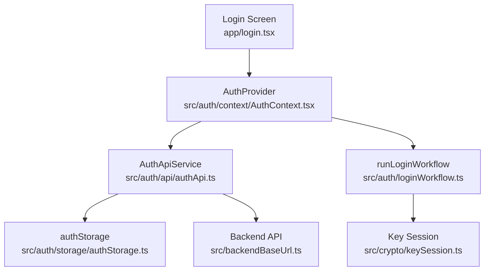
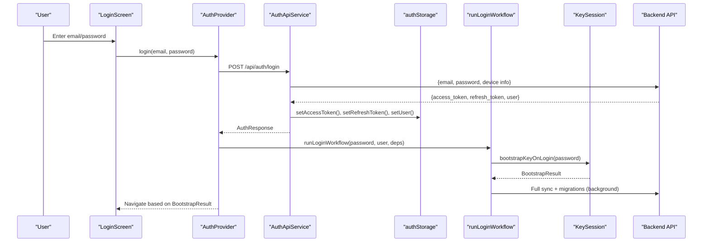
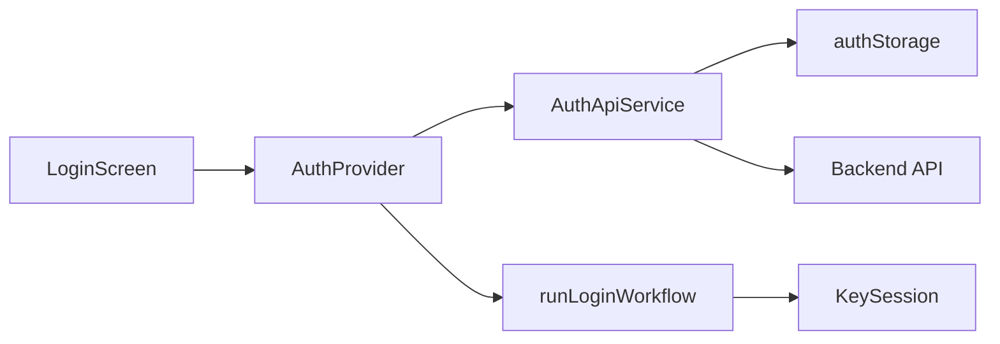

# Authentication Flow

<cite>
**Referenced Files in This Document**
- [AuthContext.tsx](file://src/auth/context/AuthContext.tsx)
- [authApi.ts](file://src/auth/api/authApi.ts)
- [authStorage.ts](file://src/auth/storage/authStorage.ts)
- [loginWorkflow.ts](file://src/auth/loginWorkflow.ts)
- [auth.types.ts](file://src/auth/types/auth.types.ts)
- [keySession.ts](file://src/crypto/keySession.ts)
- [login.tsx](file://app/login.tsx)
- [backendBaseUrl.ts](file://src/backendBaseUrl.ts)
</cite>

## Table of Contents
1. [Introduction](#introduction)
2. [Project Structure](#project-structure)
3. [Core Components](#core-components)
4. [Architecture Overview](#architecture-overview)
5. [Detailed Component Analysis](#detailed-component-analysis)
6. [Dependency Analysis](#dependency-analysis)
7. [Performance Considerations](#performance-considerations)
8. [Troubleshooting Guide](#troubleshooting-guide)
9. [Conclusion](#conclusion)

## Introduction
This document explains the JWT-based authentication flow implemented in the frontend application. It covers login, token management, session persistence, automatic token refresh, and the AuthProvider context that manages user state across the app. It also documents API endpoints, request/response formats, error handling strategies, security considerations for tokens, and troubleshooting guidance for common issues such as expired tokens and network failures.

## Project Structure
The authentication system is organized into focused modules:
- Context and hooks for managing auth state (AuthProvider, useAuth)
- API service layer for REST calls and token handling
- Secure storage abstraction for tokens and user data
- Post-login workflow orchestrating E2EE key bootstrap, sync, and migrations
- Types defining request/response contracts
- Crypto integration for end-to-end encryption key lifecycle

**Diagram sources**
- [login.tsx:22-73](file://app/login.tsx#L22-L73)
- [AuthContext.tsx:77-249](file://src/auth/context/AuthContext.tsx#L77-L249)
- [authApi.ts:8-259](file://src/auth/api/authApi.ts#L8-L259)
- [authStorage.ts:16-103](file://src/auth/storage/authStorage.ts#L16-L103)
- [loginWorkflow.ts:49-141](file://src/auth/loginWorkflow.ts#L49-L141)
- [keySession.ts:35-82](file://src/crypto/keySession.ts#L35-L82)
- [backendBaseUrl.ts:1-14](file://src/backendBaseUrl.ts#L1-L14)

**Section sources**
- [login.tsx:22-73](file://app/login.tsx#L22-L73)
- [AuthContext.tsx:77-249](file://src/auth/context/AuthContext.tsx#L77-L249)
- [authApi.ts:8-259](file://src/auth/api/authApi.ts#L8-L259)
- [authStorage.ts:16-103](file://src/auth/storage/authStorage.ts#L16-L103)
- [loginWorkflow.ts:49-141](file://src/auth/loginWorkflow.ts#L49-L141)
- [keySession.ts:35-82](file://src/crypto/keySession.ts#L35-L82)
- [backendBaseUrl.ts:1-14](file://src/backendBaseUrl.ts#L1-L14)

## Core Components
- AuthProvider: React context provider that holds user state, exposes login/logout/refresh methods, initializes session on mount, and coordinates post-login tasks.
- AuthApiService: Encapsulates all authentication-related HTTP requests, handles headers with Bearer tokens, parses responses, decrypts sensitive fields, and persists tokens.
- authStorage: Cross-platform secure storage for access/refresh tokens and user data using SecureStore on native and AsyncStorage on web.
- runLoginWorkflow: Orchestrates post-login steps including calendar permission prompts, E2EE key bootstrap, full sync, and encrypted data migration.
- Key Session: Manages device-bound decryption keys (DEK), escrow creation/unlocking/recovery, and rewrapping on password changes.

**Section sources**
- [AuthContext.tsx:52-73](file://src/auth/context/AuthContext.tsx#L52-L73)
- [authApi.ts:8-46](file://src/auth/api/authApi.ts#L8-L46)
- [authStorage.ts:16-103](file://src/auth/storage/authStorage.ts#L16-L103)
- [loginWorkflow.ts:18-41](file://src/auth/loginWorkflow.ts#L18-L41)
- [keySession.ts:25-82](file://src/crypto/keySession.ts#L25-L82)

## Architecture Overview
The authentication architecture follows a layered approach:
- UI triggers login via AuthProvider
- AuthProvider calls AuthApiService to authenticate and store tokens
- Post-login workflow runs E2EE key bootstrap and background sync/migrations
- Subsequent API calls attach Authorization headers using stored access tokens
- Token refresh is attempted when needed; invalid tokens clear the session

**Diagram sources**
- [login.tsx:48-73](file://app/login.tsx#L48-L73)
- [AuthContext.tsx:147-177](file://src/auth/context/AuthContext.tsx#L147-L177)
- [authApi.ts:69-105](file://src/auth/api/authApi.ts#L69-L105)
- [authStorage.ts:18-67](file://src/auth/storage/authStorage.ts#L18-L67)
- [loginWorkflow.ts:49-83](file://src/auth/loginWorkflow.ts#L49-L83)
- [keySession.ts:35-54](file://src/crypto/keySession.ts#L35-L54)

## Detailed Component Analysis

### AuthProvider Context
Responsibilities:
- Initialize session on mount by loading stored user and attempting token refresh
- Provide login/logout/refresh/updateUserName/updateNewsPreferences methods
- Manage recovery code display and key recovery flow
- Coordinate post-login tasks via runLoginWorkflow
- Ensure calendar permissions are requested early on non-web platforms

Key behaviors:
- On mount, if a stored user exists, attempts background token refresh; if not, tries to fetch current user from server using stored tokens
- On login success, sets user state, resets sync readiness, then runs login workflow
- On logout, flushes pending sync queue, calls backend logout, clears E2EE keys, resets calendar sync state, and clears in-memory state

Error handling:
- Background token refresh failures do not immediately clear user state unless tokens were cleared by the server
- Network errors during init or refresh are caught and logged without crashing

Security:
- Ensures plaintext account name push-back only occurs when DEK is available to avoid persisting ciphertext as display name

**Section sources**
- [AuthContext.tsx:86-145](file://src/auth/context/AuthContext.tsx#L86-L145)
- [AuthContext.tsx:147-228](file://src/auth/context/AuthContext.tsx#L147-L228)
- [AuthContext.tsx:41-50](file://src/auth/context/AuthContext.tsx#L41-L50)

### AuthApiService
Endpoints and flows:
- Signup: POST /api/auth/signup
- Login: POST /api/auth/login
- Logout: POST /api/auth/logout (with refresh token)
- Refresh: POST /api/auth/refresh
- Get Me: GET /api/auth/me
- Update Name: PUT /api/auth/me
- Forgot Password: POST /api/auth/forgot-password
- Reset Password: POST /api/auth/reset-password
- Change Password: POST /api/auth/change-password
- Resend Verification: POST /api/auth/resend-verification
- Sync Status: GET /api/auth/sync-status

Request/response details:
- All authenticated requests include Authorization: Bearer <access_token> header
- Login response includes access_token, refresh_token, token_type, and user object
- Responses are parsed as JSON; empty or unparseable bodies throw a network-like error
- Sensitive user fields are decrypted before being stored or returned to callers

Token management:
- Access and refresh tokens are persisted via authStorage
- On refresh failure with 401/403, tokens are cleared; network errors leave tokens intact for retry

Error handling:
- Non-OK responses throw descriptive errors; changePassword preserves status code for UI differentiation
- Network errors are wrapped with user-friendly messages

**Section sources**
- [authApi.ts:55-105](file://src/auth/api/authApi.ts#L55-L105)
- [authApi.ts:107-151](file://src/auth/api/authApi.ts#L107-L151)
- [authApi.ts:153-185](file://src/auth/api/authApi.ts#L153-L185)
- [authApi.ts:187-255](file://src/auth/api/authApi.ts#L187-L255)

### Secure Storage (authStorage)
- Stores access_token and refresh_token in both AsyncStorage and SecureStore (native); reads from AsyncStorage first, falls back to SecureStore
- Stores user_data securely (SecureStore on native, AsyncStorage on web)
- Provides clearAll to wipe all auth data on logout
- Includes auxiliary flags for UI state (modal dismissed, first note saved)

Security considerations:
- Tokens are stored in platform-native secure storage where available
- Web uses AsyncStorage; ensure HTTPS and consider additional protections at the browser level

**Section sources**
- [authStorage.ts:16-103](file://src/auth/storage/authStorage.ts#L16-L103)

### Post-Login Workflow (runLoginWorkflow)
Orchestrates:
- Request calendar sync permission (non-web)
- Bootstrap E2EE key (create escrow if new, unlock if existing, detect needs_recovery)
- Run full sync in background
- Migrate notes/events to encrypted format when enabled and not pending recovery
- Re-fetch user after bootstrap to ensure plaintext name push-back uses fresh data

Design:
- Framework-free and testable by injecting dependencies
- Returns immediately after key bootstrap; background work continues independently

**Section sources**
- [loginWorkflow.ts:49-141](file://src/auth/loginWorkflow.ts#L49-L141)

### Key Session (E2EE Integration)
Lifecycle:
- First login: create escrow, store DEK, return recovery code
- Normal login: unlock escrow with password, store DEK
- Post-reset: detect needs_recovery and require recovery code to re-wrap under new password
- Password change: re-wrap DEK under new password
- Logout: clear DEK

**Section sources**
- [keySession.ts:35-82](file://src/crypto/keySession.ts#L35-L82)

### Login Screen
- Validates email and password inputs
- Calls AuthProvider.login and navigates based on bootstrap result:
  - created: show recovery code once
  - needs_recovery: prompt for recovery code
  - unlocked: navigate to main tabs
- Displays inline errors for verification or general failures

**Section sources**
- [login.tsx:31-73](file://app/login.tsx#L31-L73)

## Dependency Analysis

**Diagram sources**
- [login.tsx:22-73](file://app/login.tsx#L22-L73)
- [AuthContext.tsx:77-249](file://src/auth/context/AuthContext.tsx#L77-L249)
- [authApi.ts:8-259](file://src/auth/api/authApi.ts#L8-L259)
- [authStorage.ts:16-103](file://src/auth/storage/authStorage.ts#L16-L103)
- [loginWorkflow.ts:49-141](file://src/auth/loginWorkflow.ts#L49-L141)
- [keySession.ts:35-82](file://src/crypto/keySession.ts#L35-L82)

**Section sources**
- [AuthContext.tsx:77-249](file://src/auth/context/AuthContext.tsx#L77-L249)
- [authApi.ts:8-259](file://src/auth/api/authApi.ts#L8-L259)
- [authStorage.ts:16-103](file://src/auth/storage/authStorage.ts#L16-L103)
- [loginWorkflow.ts:49-141](file://src/auth/loginWorkflow.ts#L49-L141)
- [keySession.ts:35-82](file://src/crypto/keySession.ts#L35-L82)

## Performance Considerations
- Background token refresh avoids blocking UI; failures are logged and tolerated
- Post-login sync and migrations run asynchronously so login returns quickly
- Calendar permission prompts are fire-and-forget to avoid blocking critical paths
- Decryption of user data happens before storage to keep in-memory state plaintext

[No sources needed since this section provides general guidance]

## Troubleshooting Guide

Common issues and resolutions:
- Expired access token:
  - The app attempts to refresh using the refresh token; if the server rejects it (401/403), tokens are cleared and the user is logged out
  - If network errors occur during refresh, tokens remain intact for retry when connectivity resumes
  - Reference: [authApi.ts:122-151](file://src/auth/api/authApi.ts#L122-L151)

- Network failures during login or refresh:
  - Errors are wrapped with user-friendly messages; users should retry when connectivity is restored
  - Reference: [authApi.ts:98-104](file://src/auth/api/authApi.ts#L98-L104), [authApi.ts:147-150](file://src/auth/api/authApi.ts#L147-L150)

- Needs recovery after password reset:
  - If the escrow cannot be unwrapped with the current password, the workflow signals needs_recovery; the UI prompts for the recovery code to re-wrap under the new password
  - Reference: [loginWorkflow.ts:64-76](file://src/auth/loginWorkflow.ts#L64-L76), [keySession.ts:45-53](file://src/crypto/keySession.ts#L45-L53)

- Incorrect credentials:
  - Login errors surface as generic messages; verify email/password and check for email verification requirements
  - Reference: [login.tsx:62-70](file://app/login.tsx#L62-L70)

- Calendar permission denied:
  - Permission requests are attempted on non-web platforms; failures are logged but do not block login
  - Reference: [AuthContext.tsx:31-39](file://src/auth/context/AuthContext.tsx#L31-L39)

Security best practices observed:
- Tokens are stored in secure storage on native devices; on web, they reside in AsyncStorage with HTTPS enforced by the backend origin configuration
- Authorization headers are attached automatically for authenticated requests
- Sensitive user fields are decrypted before being stored or exposed to UI
- Reference: [authStorage.ts:18-67](file://src/auth/storage/authStorage.ts#L18-L67), [authApi.ts:33-46](file://src/auth/api/authApi.ts#L33-L46)

**Section sources**
- [authApi.ts:98-104](file://src/auth/api/authApi.ts#L98-L104)
- [authApi.ts:122-151](file://src/auth/api/authApi.ts#L122-L151)
- [loginWorkflow.ts:64-76](file://src/auth/loginWorkflow.ts#L64-L76)
- [keySession.ts:45-53](file://src/crypto/keySession.ts#L45-L53)
- [login.tsx:62-70](file://app/login.tsx#L62-L70)
- [AuthContext.tsx:31-39](file://src/auth/context/AuthContext.tsx#L31-L39)
- [authStorage.ts:18-67](file://src/auth/storage/authStorage.ts#L18-L67)
- [authApi.ts:33-46](file://src/auth/api/authApi.ts#L33-L46)

## Conclusion
The authentication flow combines JWT-based sessions with robust token management, secure storage, and end-to-end encryption key lifecycle. AuthProvider centralizes user state and orchestrates login, refresh, and logout, while AuthApiService encapsulates API interactions and error handling. The post-login workflow ensures E2EE keys are bootstrapped and data is synchronized efficiently. Security is reinforced through secure token storage, automatic header injection, and careful handling of sensitive fields. The system gracefully handles common issues like expired tokens and network failures, providing a resilient user experience.

[No sources needed since this section summarizes without analyzing specific files]