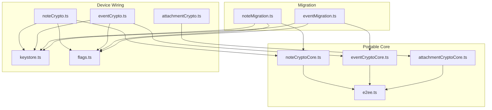
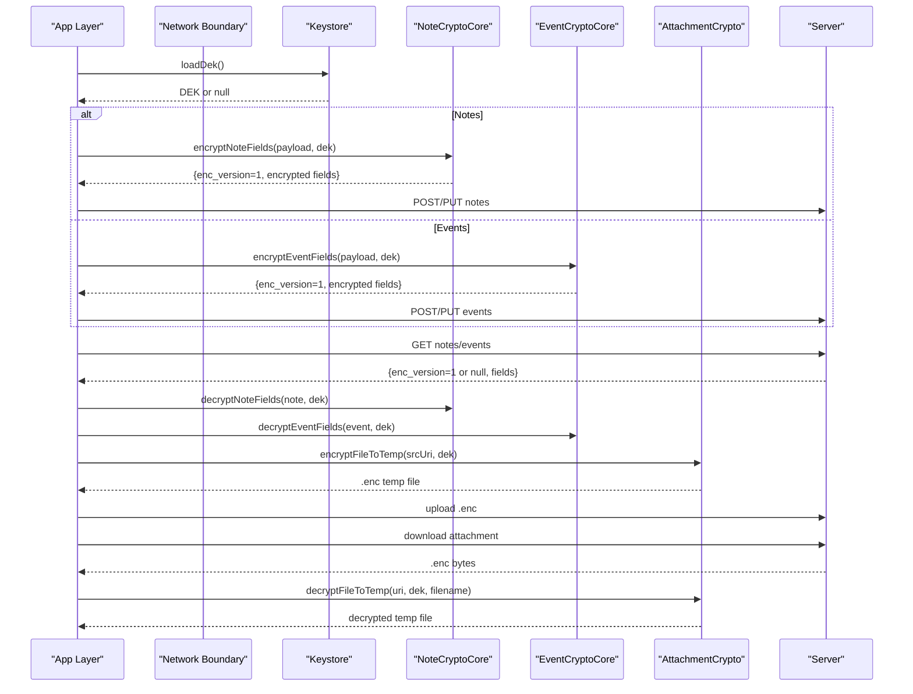
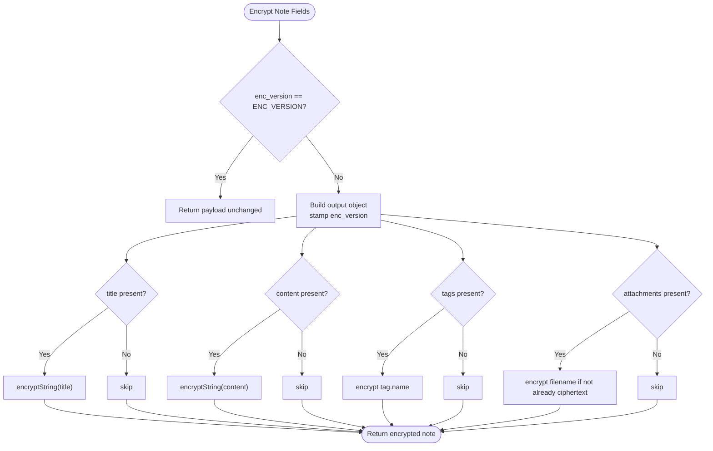
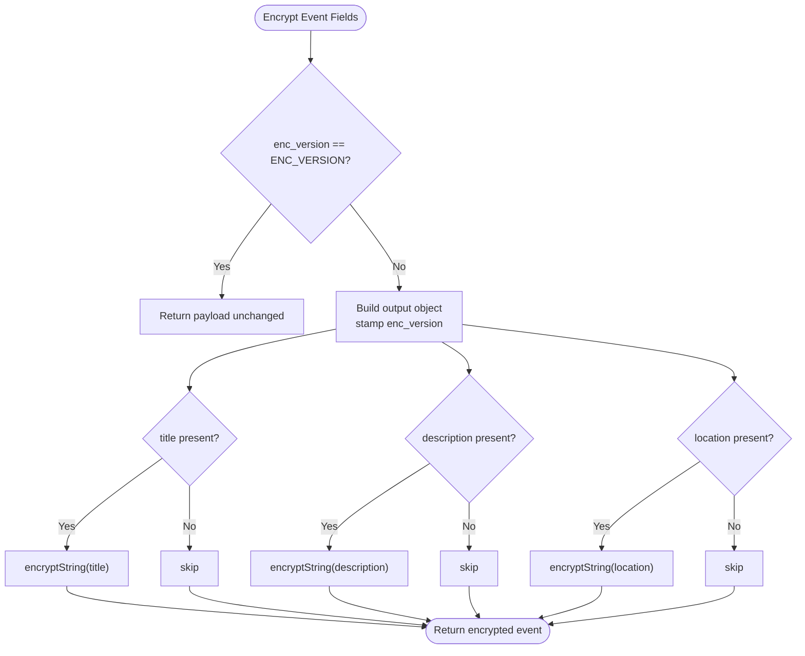
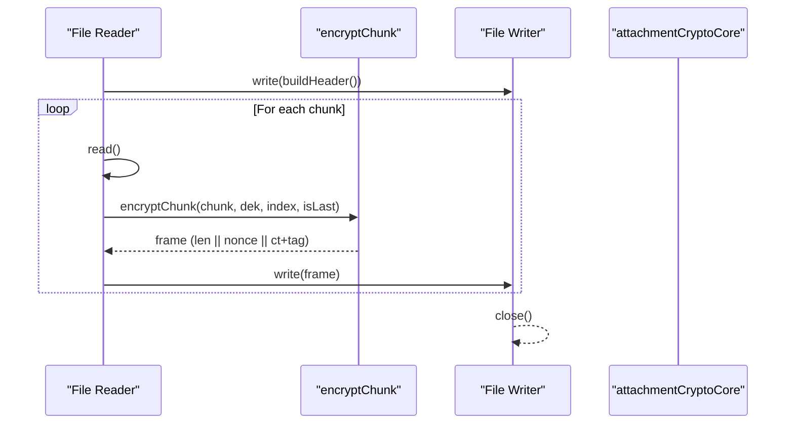
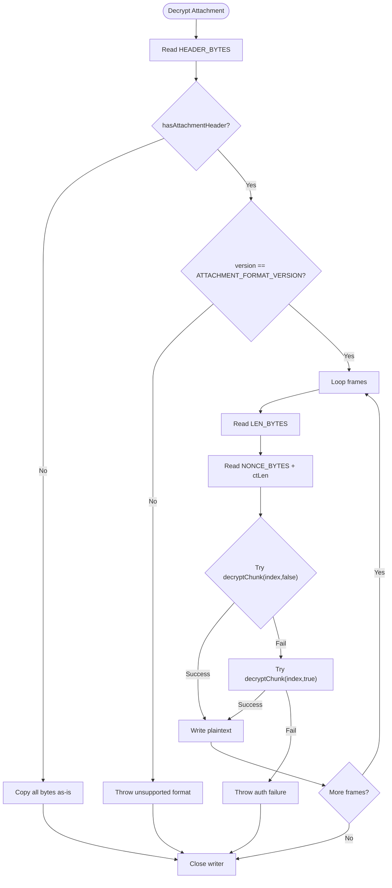
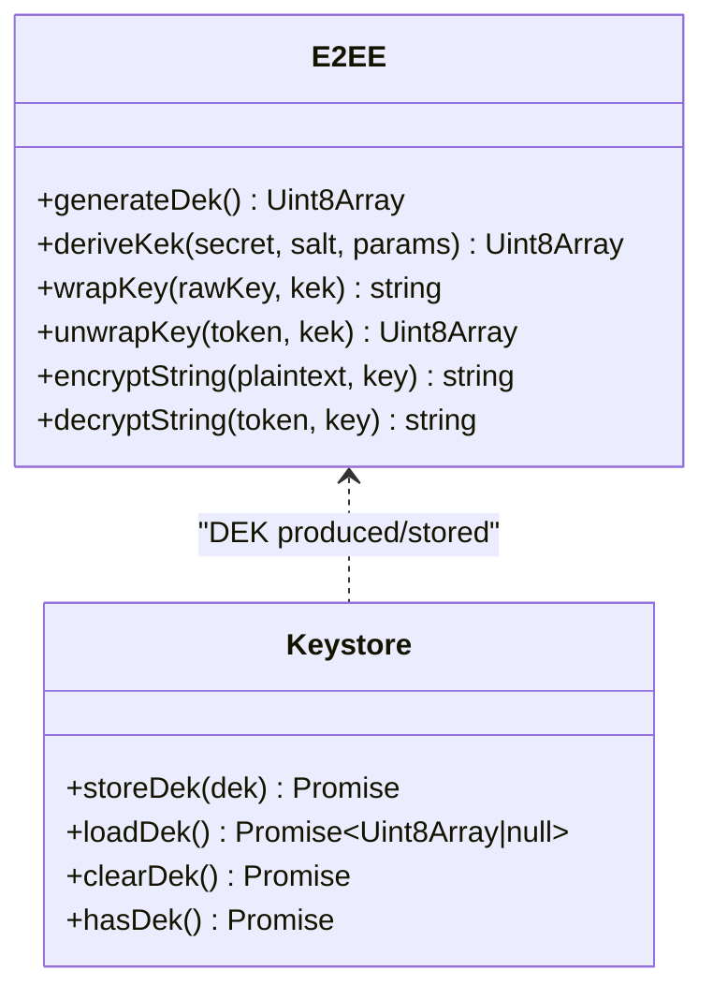
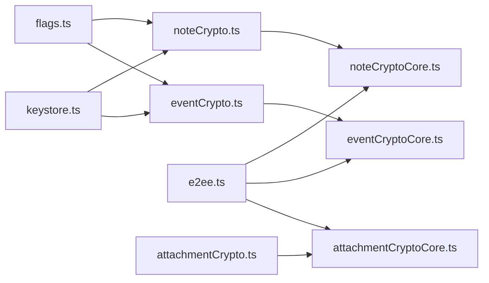

# Data Encryption

<cite>
**Referenced Files in This Document**
- [e2ee.ts](file://src/crypto/e2ee.ts)
- [noteCrypto.ts](file://src/crypto/noteCrypto.ts)
- [noteCryptoCore.ts](file://src/crypto/noteCryptoCore.ts)
- [eventCrypto.ts](file://src/crypto/eventCrypto.ts)
- [eventCryptoCore.ts](file://src/crypto/eventCryptoCore.ts)
- [attachmentCrypto.ts](file://src/crypto/attachmentCrypto.ts)
- [attachmentCryptoCore.ts](file://src/crypto/attachmentCryptoCore.ts)
- [keystore.ts](file://src/crypto/keystore.ts)
- [flags.ts](file://src/crypto/flags.ts)
- [noteMigration.ts](file://src/crypto/noteMigration.ts)
- [eventMigration.ts](file://src/crypto/eventMigration.ts)
</cite>

## Table of Contents
1. [Introduction](#introduction)
2. [Project Structure](#project-structure)
3. [Core Components](#core-components)
4. [Architecture Overview](#architecture-overview)
5. [Detailed Component Analysis](#detailed-component-analysis)
6. [Dependency Analysis](#dependency-analysis)
7. [Performance Considerations](#performance-considerations)
8. [Troubleshooting Guide](#troubleshooting-guide)
9. [Conclusion](#conclusion)
10. [Appendices](#appendices)

## Introduction
This document explains the data-specific encryption implementations for notes, events, and attachments. It covers what is encrypted, how metadata is protected, the cryptographic context (keys, initialization vectors, authentication tags), and how large files are handled with streaming to optimize memory usage. It also documents migration strategies for updating encryption formats while preserving backwards compatibility.

## Project Structure
The encryption system is split into portable core modules (pure crypto, no platform dependencies) and device wiring modules that integrate with the keystore and feature flags:
- Portable cores: e2ee.ts, noteCryptoCore.ts, eventCryptoCore.ts, attachmentCryptoCore.ts
- Device wiring: noteCrypto.ts, eventCrypto.ts, attachmentCrypto.ts, keystore.ts, flags.ts
- Migration: noteMigration.ts, eventMigration.ts

**Diagram sources**
- [noteCrypto.ts:1-93](file://src/crypto/noteCrypto.ts#L1-L93)
- [eventCrypto.ts:1-73](file://src/crypto/eventCrypto.ts#L1-L73)
- [attachmentCrypto.ts:1-224](file://src/crypto/attachmentCrypto.ts#L1-L224)
- [noteCryptoCore.ts:1-158](file://src/crypto/noteCryptoCore.ts#L1-L158)
- [eventCryptoCore.ts:1-109](file://src/crypto/eventCryptoCore.ts#L1-L109)
- [attachmentCryptoCore.ts:1-111](file://src/crypto/attachmentCryptoCore.ts#L1-L111)
- [e2ee.ts:1-228](file://src/crypto/e2ee.ts#L1-L228)
- [keystore.ts:1-53](file://src/crypto/keystore.ts#L1-L53)
- [flags.ts:1-34](file://src/crypto/flags.ts#L1-L34)
- [noteMigration.ts:1-87](file://src/crypto/noteMigration.ts#L1-L87)
- [eventMigration.ts:1-90](file://src/crypto/eventMigration.ts#L1-L90)

**Section sources**
- [noteCrypto.ts:1-93](file://src/crypto/noteCrypto.ts#L1-L93)
- [eventCrypto.ts:1-73](file://src/crypto/eventCrypto.ts#L1-L73)
- [attachmentCrypto.ts:1-224](file://src/crypto/attachmentCrypto.ts#L1-L224)
- [noteCryptoCore.ts:1-158](file://src/crypto/noteCryptoCore.ts#L1-L158)
- [eventCryptoCore.ts:1-109](file://src/crypto/eventCryptoCore.ts#L1-L109)
- [attachmentCryptoCore.ts:1-111](file://src/crypto/attachmentCryptoCore.ts#L1-L111)
- [e2ee.ts:1-228](file://src/crypto/e2ee.ts#L1-L228)
- [keystore.ts:1-53](file://src/crypto/keystore.ts#L1-L53)
- [flags.ts:1-34](file://src/crypto/flags.ts#L1-L34)
- [noteMigration.ts:1-87](file://src/crypto/noteMigration.ts#L1-L87)
- [eventMigration.ts:1-90](file://src/crypto/eventMigration.ts#L1-L90)

## Core Components
- End-to-end primitives: AES-256-GCM authenticated encryption with per-field random nonces; base64-encoded tokens carrying version, nonce, and ciphertext; key derivation via PBKDF2; DEK wrapping/unwrapping.
- Notes: Encrypts title, content, tag names, and attachment filenames; leaves other metadata plaintext for storage functionality.
- Events: Encrypts title, description, location; leaves scheduling fields plaintext for calendar operations.
- Attachments: Streaming chunked encryption with a file header, length-prefixed frames, per-chunk nonces, and AAD binding index and finality to prevent reordering/truncation.

Key constants and formats:
- ENC_VERSION for field-level tokens
- Attachment format version, header size, chunk size, frame overhead
- KDF parameters and salts for KEK derivation

**Section sources**
- [e2ee.ts:24-41](file://src/crypto/e2ee.ts#L24-L41)
- [e2ee.ts:99-124](file://src/crypto/e2ee.ts#L99-L124)
- [e2ee.ts:145-158](file://src/crypto/e2ee.ts#L145-L158)
- [noteCryptoCore.ts:27-43](file://src/crypto/noteCryptoCore.ts#L27-L43)
- [eventCryptoCore.ts:20-28](file://src/crypto/eventCryptoCore.ts#L20-L28)
- [attachmentCryptoCore.ts:13-48](file://src/crypto/attachmentCryptoCore.ts#L13-L48)

## Architecture Overview
Notes and events follow a consistent pattern:
- On push: encrypt only present sensitive fields and stamp enc_version.
- On pull: decrypt if enc_version indicates ciphertext; otherwise pass through legacy plaintext.
- If no DEK is available on native, pushes are refused when there are encryptable fields to avoid corrupting server state; on web, encryption is disabled.

Attachments use a separate streaming pipeline:
- Encrypt: stream input chunks, write a header, then write length-prefixed frames containing nonce + ciphertext (+tag).
- Decrypt: read header, detect legacy vs encrypted, then stream frames and authenticate each chunk with AAD.

**Diagram sources**
- [noteCrypto.ts:46-72](file://src/crypto/noteCrypto.ts#L46-L72)
- [eventCrypto.ts:37-61](file://src/crypto/eventCrypto.ts#L37-L61)
- [attachmentCrypto.ts:67-119](file://src/crypto/attachmentCrypto.ts#L67-L119)
- [attachmentCrypto.ts:128-224](file://src/crypto/attachmentCrypto.ts#L128-L224)
- [noteCryptoCore.ts:65-95](file://src/crypto/noteCryptoCore.ts#L65-L95)
- [eventCryptoCore.ts:36-56](file://src/crypto/eventCryptoCore.ts#L36-L56)

## Detailed Component Analysis

### Notes: Field-Level Encryption
- Encrypted fields: title, content, tag names, and attachment filenames.
- Metadata protection: tag colors and attachment metadata (id, S3 key, size, mime type) remain plaintext so storage and UI can function without decryption.
- Context: Uses AES-256-GCM with a fresh random nonce per field; token format includes version, base64 nonce, and base64 ciphertext.
- Authentication: GCM tag verifies integrity and authenticity; tampered fields yield a placeholder rather than crashing.
- Migration: Legacy plaintext notes (enc_version null) pass through; migration re-encrypts them once and stamps enc_version.

**Diagram sources**
- [noteCryptoCore.ts:65-95](file://src/crypto/noteCryptoCore.ts#L65-L95)

**Section sources**
- [noteCryptoCore.ts:27-43](file://src/crypto/noteCryptoCore.ts#L27-L43)
- [noteCryptoCore.ts:65-95](file://src/crypto/noteCryptoCore.ts#L65-L95)
- [noteCryptoCore.ts:97-127](file://src/crypto/noteCryptoCore.ts#L97-L127)
- [noteCrypto.ts:46-72](file://src/crypto/noteCrypto.ts#L46-L72)
- [e2ee.ts:99-124](file://src/crypto/e2ee.ts#L99-L124)

### Events: Field-Level Encryption
- Encrypted fields: title, description, location.
- Non-sensitive scheduling fields (start_time, end_time, reminder_minutes, linked_note_ids, device_calendar_event_id) stay plaintext for calendar sync and reminders.
- Same token format and error handling as notes; mislabeled plaintext passes through to self-heal.

**Diagram sources**
- [eventCryptoCore.ts:36-56](file://src/crypto/eventCryptoCore.ts#L36-L56)

**Section sources**
- [eventCryptoCore.ts:20-28](file://src/crypto/eventCryptoCore.ts#L20-L28)
- [eventCryptoCore.ts:36-56](file://src/crypto/eventCryptoCore.ts#L36-L56)
- [eventCryptoCore.ts:65-79](file://src/crypto/eventCryptoCore.ts#L65-L79)
- [eventCrypto.ts:37-61](file://src/crypto/eventCrypto.ts#L37-L61)
- [e2ee.ts:99-124](file://src/crypto/e2ee.ts#L99-L124)

### Attachments: Streaming Chunked Encryption
- Format: Header (magic + version), followed by frames where each frame is length-prefixed body containing nonce + ciphertext (+GCM tag).
- Per-chunk security: Each chunk uses a unique nonce and an AAD composed of chunk index and finality flag to prevent reordering, duplication, and truncation attacks.
- Streaming: Reads/writes in fixed-size chunks to keep peak memory proportional to CHUNK_SIZE, not file size.
- Backwards compatibility: If no Nueco header is detected, treat as legacy plaintext and copy through.

**Diagram sources**
- [attachmentCrypto.ts:67-119](file://src/crypto/attachmentCrypto.ts#L67-L119)
- [attachmentCryptoCore.ts:78-92](file://src/crypto/attachmentCryptoCore.ts#L78-L92)

**Diagram sources**
- [attachmentCrypto.ts:128-224](file://src/crypto/attachmentCrypto.ts#L128-L224)
- [attachmentCryptoCore.ts:57-69](file://src/crypto/attachmentCryptoCore.ts#L57-L69)
- [attachmentCryptoCore.ts:94-105](file://src/crypto/attachmentCryptoCore.ts#L94-L105)

**Section sources**
- [attachmentCryptoCore.ts:13-48](file://src/crypto/attachmentCryptoCore.ts#L13-L48)
- [attachmentCryptoCore.ts:71-92](file://src/crypto/attachmentCryptoCore.ts#L71-L92)
- [attachmentCryptoCore.ts:94-105](file://src/crypto/attachmentCryptoCore.ts#L94-L105)
- [attachmentCrypto.ts:67-119](file://src/crypto/attachmentCrypto.ts#L67-L119)
- [attachmentCrypto.ts:128-224](file://src/crypto/attachmentCrypto.ts#L128-L224)

### Key Management and Context
- DEK: Random 32-byte key used to encrypt data fields and attachment chunks.
- KEKs: Two keys derived from password and recovery code via PBKDF2; DEK wrapped under both for escrow.
- Storage: DEK stored in OS keystore via SecureStore; never sent to server.
- Feature flags: E2EE_KEYS_ENABLED gates whether encryption is active; E2EE_MIGRATION_ENABLED gates bulk migration.

**Diagram sources**
- [e2ee.ts:127-158](file://src/crypto/e2ee.ts#L127-L158)
- [keystore.ts:30-53](file://src/crypto/keystore.ts#L30-L53)

**Section sources**
- [e2ee.ts:24-41](file://src/crypto/e2ee.ts#L24-L41)
- [e2ee.ts:145-158](file://src/crypto/e2ee.ts#L145-L158)
- [keystore.ts:1-53](file://src/crypto/keystore.ts#L1-L53)
- [flags.ts:1-34](file://src/crypto/flags.ts#L1-L34)

## Dependency Analysis
- noteCrypto.ts depends on noteCryptoCore.ts, keystore.ts, flags.ts, and yieldToJS for performance.
- eventCrypto.ts depends on eventCryptoCore.ts, keystore.ts, flags.ts, and yieldToJS.
- attachmentCrypto.ts depends on attachmentCryptoCore.ts and platform I/O; it does not depend on keystore directly but receives a DEK from callers.
- All cores depend on e2ee.ts for primitives.

**Diagram sources**
- [noteCrypto.ts:1-93](file://src/crypto/noteCrypto.ts#L1-L93)
- [eventCrypto.ts:1-73](file://src/crypto/eventCrypto.ts#L1-L73)
- [attachmentCrypto.ts:1-224](file://src/crypto/attachmentCrypto.ts#L1-L224)
- [noteCryptoCore.ts:1-158](file://src/crypto/noteCryptoCore.ts#L1-L158)
- [eventCryptoCore.ts:1-109](file://src/crypto/eventCryptoCore.ts#L1-L109)
- [attachmentCryptoCore.ts:1-111](file://src/crypto/attachmentCryptoCore.ts#L1-L111)
- [e2ee.ts:1-228](file://src/crypto/e2ee.ts#L1-L228)
- [keystore.ts:1-53](file://src/crypto/keystore.ts#L1-L53)
- [flags.ts:1-34](file://src/crypto/flags.ts#L1-L34)

**Section sources**
- [noteCrypto.ts:1-93](file://src/crypto/noteCrypto.ts#L1-L93)
- [eventCrypto.ts:1-73](file://src/crypto/eventCrypto.ts#L1-L73)
- [attachmentCrypto.ts:1-224](file://src/crypto/attachmentCrypto.ts#L1-L224)
- [noteCryptoCore.ts:1-158](file://src/crypto/noteCryptoCore.ts#L1-L158)
- [eventCryptoCore.ts:1-109](file://src/crypto/eventCryptoCore.ts#L1-L109)
- [attachmentCryptoCore.ts:1-111](file://src/crypto/attachmentCryptoCore.ts#L1-L111)
- [e2ee.ts:1-228](file://src/crypto/e2ee.ts#L1-L228)
- [keystore.ts:1-53](file://src/crypto/keystore.ts#L1-L53)
- [flags.ts:1-34](file://src/crypto/flags.ts#L1-L34)

## Performance Considerations
- Large files: Attachment encryption streams in fixed-size chunks (CHUNK_SIZE) to bound peak memory to roughly the chunk size plus small buffers, avoiding OOM on mid-range devices.
- Yielding during decryption: Bulk decryption of notes and events yields to the JS event loop periodically to prevent UI stalls during fullSync operations.
- Memory optimization: Avoid loading entire files into memory; process byte-by-byte via readable/writable streams.
- Overhead: Frame overhead per chunk is constant; total overhead remains negligible relative to large payloads.

[No sources needed since this section provides general guidance]

## Troubleshooting Guide
- Wrong or missing DEK:
  - Push refusal: On native, pushing plaintext when a DEK is required throws to prevent corrupting server state.
  - Decrypt fallback: Without a DEK, notes/events pass through; ciphertext fields render as-is to avoid crashes.
- Tampering or corruption:
  - Field-level: Decryption failures replace fields with a placeholder instead of throwing, keeping lists usable.
  - Attachment-level: Reordered, truncated, or tampered chunks fail authentication; errors are thrown and temporary files cleaned up.
- Migration issues:
  - Migration runs only when enabled and a DEK exists; it is idempotent and marks completion per user.
  - Errors during migration are logged and retried next login; completion marker set only after success.

**Section sources**
- [noteCrypto.ts:46-72](file://src/crypto/noteCrypto.ts#L46-L72)
- [eventCrypto.ts:37-61](file://src/crypto/eventCrypto.ts#L37-L61)
- [noteCryptoCore.ts:97-127](file://src/crypto/noteCryptoCore.ts#L97-L127)
- [eventCryptoCore.ts:65-79](file://src/crypto/eventCryptoCore.ts#L65-L79)
- [attachmentCrypto.ts:128-224](file://src/crypto/attachmentCrypto.ts#L128-L224)
- [noteMigration.ts:55-87](file://src/crypto/noteMigration.ts#L55-L87)
- [eventMigration.ts:58-90](file://src/crypto/eventMigration.ts#L58-L90)

## Conclusion
The encryption system applies strong, authenticated encryption consistently across notes, events, and attachments:
- Notes and events encrypt only sensitive fields while preserving necessary metadata in plaintext.
- Attachments use streaming chunked encryption with robust AAD-based integrity to protect against reordering and truncation.
- Keys are managed securely in the OS keystore, with escrow via password and recovery code.
- Migration paths ensure safe, idempotent upgrades with backwards compatibility for mixed server states.

[No sources needed since this section summarizes without analyzing specific files]

## Appendices

### Examples

- Encrypting rich text content (notes):
  - Use noteCryptoCore.encryptNoteFields to encrypt title/content/tags/filenames and stamp enc_version before sending to the server.
  - Reference: [noteCryptoCore.ts:65-95](file://src/crypto/noteCryptoCore.ts#L65-L95)

- Encrypting calendar events with recurrence rules:
  - Use eventCryptoCore.encryptEventFields to encrypt title/description/location; leave scheduling fields like start_time/end_time plaintext.
  - Reference: [eventCryptoCore.ts:36-56](file://src/crypto/eventCryptoCore.ts#L36-L56)

- Encrypting binary attachments:
  - Stream the file via attachmentCrypto.encryptFileToTemp to produce a .enc file with a header and authenticated frames; upload and later decrypt via decryptFileToTemp.
  - Reference: [attachmentCrypto.ts:67-119](file://src/crypto/attachmentCrypto.ts#L67-L119), [attachmentCrypto.ts:128-224](file://src/crypto/attachmentCrypto.ts#L128-L224)

### Migration Strategies and Backwards Compatibility
- Notes:
  - Legacy plaintext notes (enc_version null) are identified and migrated once; already-encrypted notes are skipped.
  - Reference: [noteMigration.ts:55-87](file://src/crypto/noteMigration.ts#L55-L87), [noteCryptoCore.ts:138-145](file://src/crypto/noteCryptoCore.ts#L138-L145)

- Events:
  - Same approach as notes; independent “done” marker ensures separate schedules.
  - Reference: [eventMigration.ts:58-90](file://src/crypto/eventMigration.ts#L58-L90), [eventCryptoCore.ts:90-97](file://src/crypto/eventCryptoCore.ts#L90-L97)

- Attachments:
  - Files without the Nueco header are treated as legacy plaintext and copied through; new files include a header and version for future format evolution.
  - Reference: [attachmentCrypto.ts:128-177](file://src/crypto/attachmentCrypto.ts#L128-L177), [attachmentCryptoCore.ts:57-69](file://src/crypto/attachmentCryptoCore.ts#L57-L69)

**Section sources**
- [noteMigration.ts:55-87](file://src/crypto/noteMigration.ts#L55-L87)
- [eventMigration.ts:58-90](file://src/crypto/eventMigration.ts#L58-L90)
- [attachmentCrypto.ts:128-177](file://src/crypto/attachmentCrypto.ts#L128-L177)
- [attachmentCryptoCore.ts:57-69](file://src/crypto/attachmentCryptoCore.ts#L57-L69)