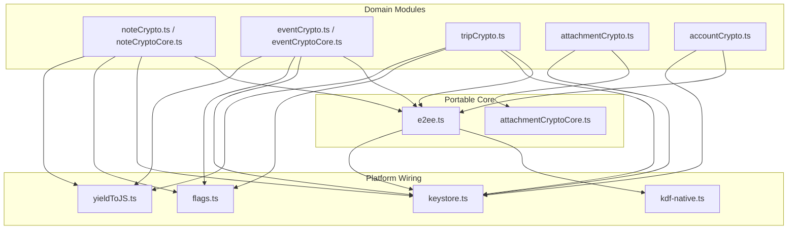
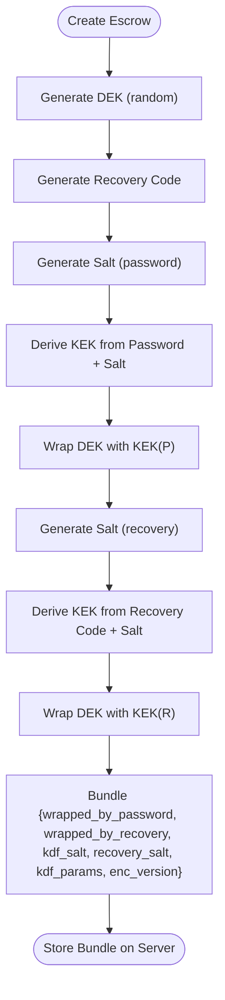
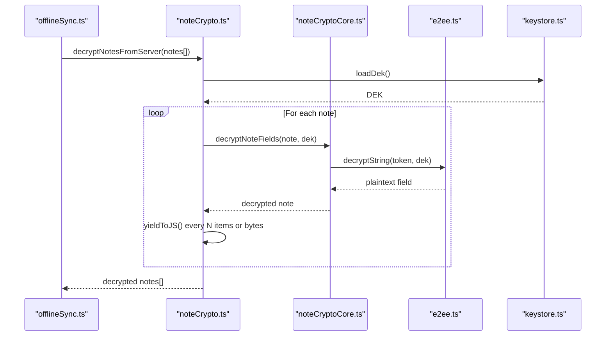
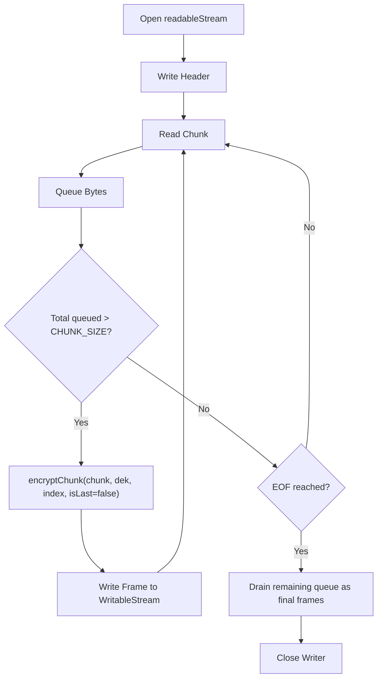
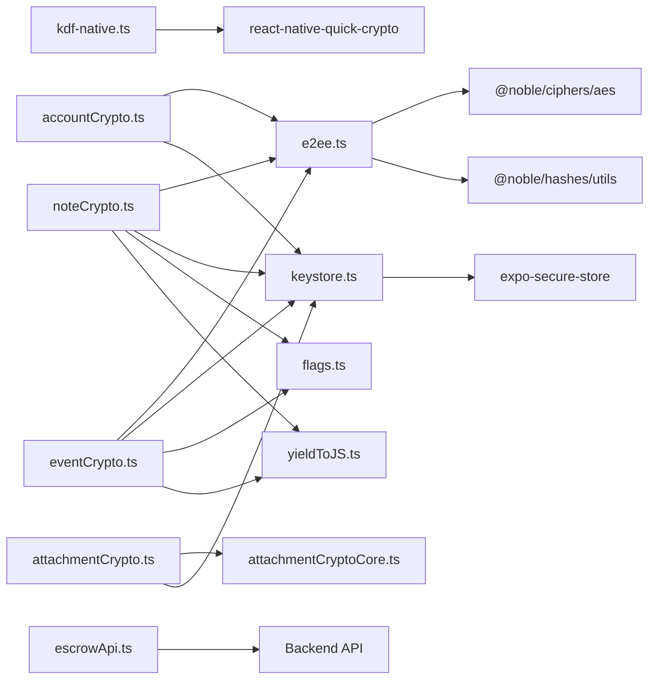

# End-to-End Encryption

<cite>
**Referenced Files in This Document**
- [e2ee.ts](file://src/crypto/e2ee.ts)
- [kdf-native.ts](file://src/crypto/kdf-native.ts)
- [keystore.ts](file://src/crypto/keystore.ts)
- [flags.ts](file://src/crypto/flags.ts)
- [yieldToJS.ts](file://src/crypto/yieldToJS.ts)
- [noteCrypto.ts](file://src/crypto/noteCrypto.ts)
- [noteCryptoCore.ts](file://src/crypto/noteCryptoCore.ts)
- [eventCrypto.ts](file://src/crypto/eventCrypto.ts)
- [eventCryptoCore.ts](file://src/crypto/eventCryptoCore.ts)
- [attachmentCrypto.ts](file://src/crypto/attachmentCrypto.ts)
- [attachmentCryptoCore.ts](file://src/crypto/attachmentCryptoCore.ts)
- [accountCrypto.ts](file://src/crypto/accountCrypto.ts)
- [tripCrypto.ts](file://src/crypto/tripCrypto.ts)
- [escrowApi.ts](file://src/crypto/escrowApi.ts)
- [e2ee.test.ts](file://src/crypto/e2ee.test.ts)
</cite>

## Table of Contents
1. [Introduction](#introduction)
2. [Project Structure](#project-structure)
3. [Core Components](#core-components)
4. [Architecture Overview](#architecture-overview)
5. [Detailed Component Analysis](#detailed-component-analysis)
6. [Dependency Analysis](#dependency-analysis)
7. [Performance Considerations](#performance-considerations)
8. [Troubleshooting Guide](#troubleshooting-guide)
9. [Conclusion](#conclusion)
10. [Appendices](#appendices)

## Introduction
This document explains the end-to-end encryption (E2EE) system that implements a zero-knowledge architecture: data is encrypted on the device before transmission so the server never sees plaintext. It covers AES-256-GCM usage, key derivation via PBKDF2, secure random number generation, and the encryption workflows for notes, events, attachments, account data, and trips. It also details keys, salts, iteration counts, performance optimizations for large files and batch operations, examples of encrypting/decrypting data, and graceful error handling.

## Project Structure
The E2EE implementation is split into a portable core and platform wiring:
- Portable core primitives: AES-256-GCM encryption, base64 helpers, KDF configuration, escrow bundle structure, and recovery code utilities.
- Platform wiring: native PBKDF2 integration, secure storage of the Data Encryption Key (DEK), feature flags, and UI-safe decryption with yielding to avoid UI freezes.
- Domain modules: per-data-type encryption boundaries for notes, events, trips, attachments, and account display name.



**Diagram sources**
- [e2ee.ts:1-228](file://src/crypto/e2ee.ts#L1-L228)
- [attachmentCryptoCore.ts:1-111](file://src/crypto/attachmentCryptoCore.ts#L1-L111)
- [kdf-native.ts:1-22](file://src/crypto/kdf-native.ts#L1-L22)
- [keystore.ts:1-53](file://src/crypto/keystore.ts#L1-L53)
- [flags.ts:1-34](file://src/crypto/flags.ts#L1-L34)
- [yieldToJS.ts:1-9](file://src/crypto/yieldToJS.ts#L1-L9)
- [noteCrypto.ts:1-93](file://src/crypto/noteCrypto.ts#L1-L93)
- [noteCryptoCore.ts:1-158](file://src/crypto/noteCryptoCore.ts#L1-L158)
- [eventCrypto.ts:1-73](file://src/crypto/eventCrypto.ts#L1-L73)
- [eventCryptoCore.ts:1-109](file://src/crypto/eventCryptoCore.ts#L1-L109)
- [tripCrypto.ts:1-72](file://src/crypto/tripCrypto.ts#L1-L72)
- [attachmentCrypto.ts:1-224](file://src/crypto/attachmentCrypto.ts#L1-L224)
- [accountCrypto.ts:1-47](file://src/crypto/accountCrypto.ts#L1-L47)

**Section sources**
- [e2ee.ts:1-228](file://src/crypto/e2ee.ts#L1-L228)
- [attachmentCryptoCore.ts:1-111](file://src/crypto/attachmentCryptoCore.ts#L1-L111)
- [kdf-native.ts:1-22](file://src/crypto/kdf-native.ts#L1-L22)
- [keystore.ts:1-53](file://src/crypto/keystore.ts#L1-L53)
- [flags.ts:1-34](file://src/crypto/flags.ts#L1-L34)
- [yieldToJS.ts:1-9](file://src/crypto/yieldToJS.ts#L1-L9)
- [noteCrypto.ts:1-93](file://src/crypto/noteCrypto.ts#L1-L93)
- [noteCryptoCore.ts:1-158](file://src/crypto/noteCryptoCore.ts#L1-L158)
- [eventCrypto.ts:1-73](file://src/crypto/eventCrypto.ts#L1-L73)
- [eventCryptoCore.ts:1-109](file://src/crypto/eventCryptoCore.ts#L1-L109)
- [tripCrypto.ts:1-72](file://src/crypto/tripCrypto.ts#L1-L72)
- [attachmentCrypto.ts:1-224](file://src/crypto/attachmentCrypto.ts#L1-L224)
- [accountCrypto.ts:1-47](file://src/crypto/accountCrypto.ts#L1-L47)

## Core Components
- AES-256-GCM authenticated encryption for strings and chunks, producing versioned tokens or frames.
- PBKDF2-based key derivation with configurable parameters; injected at app entry for native performance.
- Secure random number generation via an audited library; requires CSPRNG polyfill on React Native.
- DEK management stored in OS keystore; never leaves the device.
- Escrow bundle containing wrapped DEKs under password-derived and recovery-code-derived KEKs, plus salts and KDF parameters.
- Per-domain encryption boundaries that selectively encrypt only sensitive fields while preserving necessary metadata.

Key constants and defaults:
- Versioned token format: v1.<nonce>.<ciphertext>
- Nonce size: 12 bytes (AES-GCM standard)
- Key size: 32 bytes (AES-256)
- Salt size: 16 bytes
- PBKDF2 default: 600,000 iterations, SHA-512, 32-byte derived key length

**Section sources**
- [e2ee.ts:24-41](file://src/crypto/e2ee.ts#L24-L41)
- [e2ee.ts:99-158](file://src/crypto/e2ee.ts#L99-L158)
- [e2ee.ts:177-227](file://src/crypto/e2ee.ts#L177-L227)
- [kdf-native.ts:1-22](file://src/crypto/kdf-native.ts#L1-L22)
- [keystore.ts:1-53](file://src/crypto/keystore.ts#L1-L53)

## Architecture Overview
The system follows a layered design:
- At the bottom, the portable core provides cryptographic primitives and escrow logic.
- Platform wiring injects a native PBKDF2 implementation and stores the DEK securely.
- Domain modules wrap each data type’s encryption boundary, integrating flags, keystore access, and UI-friendly batching/yielding.

```mermaid
sequenceDiagram
participant App as "App Code"
participant Note as "noteCrypto.ts"
participant Core as "noteCryptoCore.ts"
participant E2EE as "e2ee.ts"
participant KDF as "kdf-native.ts"
participant KS as "keystore.ts"
App->>Note : encryptNoteForServer(payload)
Note->>KS : loadDek()
KS-->>Note : DEK or null
alt DEK available
Note->>Core : encryptNoteFields(payload, dek)
Core->>E2EE : encryptString(field, dek)
E2EE->>E2EE : randomBytes(12)
E2EE-->>Core : ciphertext token
Core-->>Note : encrypted payload
Note-->>App : payload ready to send
else No DEK
Note-->>App : return payload unchanged (or throw on native if encryptable)
end
```

**Diagram sources**
- [noteCrypto.ts:46-60](file://src/crypto/noteCrypto.ts#L46-L60)
- [noteCryptoCore.ts:65-95](file://src/crypto/noteCryptoCore.ts#L65-L95)
- [e2ee.ts:116-124](file://src/crypto/e2ee.ts#L116-L124)
- [kdf-native.ts:15-21](file://src/crypto/kdf-native.ts#L15-L21)
- [keystore.ts:36-42](file://src/crypto/keystore.ts#L36-L42)

## Detailed Component Analysis

### Cryptographic Primitives and Key Management
- AES-256-GCM encryption/decryption for strings produces versioned tokens that include nonce and ciphertext. Decryption throws on authentication failure (tamper or wrong key).
- PBKDF2 is configured once at startup using a native implementation for performance. Default parameters are chosen to balance security and login time budgets.
- The DEK is generated randomly and stored in the OS keystore via secure storage. It is memoized in-process to reduce repeated keystore calls during sync batches.
- Escrow bundle creation generates two KEKs (password-derived and recovery-code-derived) and wraps the DEK under both. Salts and KDF parameters are included. Unlock functions derive KEKs and unwrap the DEK.



**Diagram sources**
- [e2ee.ts:177-202](file://src/crypto/e2ee.ts#L177-L202)
- [e2ee.ts:145-158](file://src/crypto/e2ee.ts#L145-L158)
- [e2ee.ts:161-175](file://src/crypto/e2ee.ts#L161-L175)

**Section sources**
- [e2ee.ts:24-41](file://src/crypto/e2ee.ts#L24-L41)
- [e2ee.ts:99-158](file://src/crypto/e2ee.ts#L99-L158)
- [e2ee.ts:177-227](file://src/crypto/e2ee.ts#L177-L227)
- [kdf-native.ts:1-22](file://src/crypto/kdf-native.ts#L1-L22)
- [keystore.ts:1-53](file://src/crypto/keystore.ts#L1-L53)

### Notes Encryption Workflow
- Encrypts title, content, tag names, and attachment filenames. Metadata like tag colors and attachment S3 keys remain plaintext to support storage and rendering.
- Idempotent: already-encrypted payloads (enc_version set) are returned unchanged.
- Decrypts safely: failed field decryption yields a placeholder instead of crashing the list view.
- Batch decryption yields periodically to keep the UI responsive when processing large collections.



**Diagram sources**
- [noteCrypto.ts:74-92](file://src/crypto/noteCrypto.ts#L74-L92)
- [noteCryptoCore.ts:104-127](file://src/crypto/noteCryptoCore.ts#L104-L127)
- [e2ee.ts:116-124](file://src/crypto/e2ee.ts#L116-L124)
- [keystore.ts:36-42](file://src/crypto/keystore.ts#L36-L42)

**Section sources**
- [noteCrypto.ts:1-93](file://src/crypto/noteCrypto.ts#L1-L93)
- [noteCryptoCore.ts:1-158](file://src/crypto/noteCryptoCore.ts#L1-L158)

### Events Encryption Workflow
- Encrypts title, description, and location. Time-related fields and identifiers stay plaintext for scheduling and matching.
- Same idempotency and safe-decryption patterns as notes.
- Batch decryption yields periodically to prevent UI stalls.

**Section sources**
- [eventCrypto.ts:1-73](file://src/crypto/eventCrypto.ts#L1-L73)
- [eventCryptoCore.ts:1-109](file://src/crypto/eventCryptoCore.ts#L1-L109)

### Attachments Encryption Workflow
- Streams file bytes in fixed-size chunks to avoid OOM on large files. Each chunk is authenticated with AES-GCM and bound to its index and final-flag via additional authenticated data (AAD).
- On-disk format includes a header, then frames of length-prefixed ciphertext with nonce and GCM tag. Legacy plaintext attachments (no header) pass through transparently.
- Decryption reads frame-by-frame, validates headers, and tries non-final then final authentications to detect truncation or reordering.



**Diagram sources**
- [attachmentCrypto.ts:67-119](file://src/crypto/attachmentCrypto.ts#L67-L119)
- [attachmentCryptoCore.ts:44-92](file://src/crypto/attachmentCryptoCore.ts#L44-L92)

**Section sources**
- [attachmentCrypto.ts:1-224](file://src/crypto/attachmentCrypto.ts#L1-L224)
- [attachmentCryptoCore.ts:1-111](file://src/crypto/attachmentCryptoCore.ts#L1-L111)

### Account Data Encryption
- Decrypts account display name from server responses when present as ciphertext. If decryption fails, shows a placeholder rather than crashing profile UI.
- Does not clear enc_version after decrypt because the write path is explicit and needs to know whether the server copy is already encrypted.

**Section sources**
- [accountCrypto.ts:1-47](file://src/crypto/accountCrypto.ts#L1-L47)

### Trips Encryption Workflow
- Mirrors notes/events pattern: encrypts trip fields on push, decrypts on pull, yields periodically during batch decryption.

**Section sources**
- [tripCrypto.ts:1-72](file://src/crypto/tripCrypto.ts#L1-L72)

## Dependency Analysis
- e2ee.ts depends on @noble/ciphers/aes and @noble/hashes/utils for crypto and randomness.
- kdf-native.ts wires react-native-quick-crypto PBKDF2 into e2ee.ts via configureKdf.
- keystore.ts uses expo-secure-store to persist the DEK and caches it in-process.
- Domain modules depend on e2ee.ts for string encryption and keystore.ts for DEK retrieval. They also use flags.ts to gate features and yieldToJS.ts for UI responsiveness.
- escrowApi.ts communicates with the server to store/fetch the opaque EscrowBundle.



**Diagram sources**
- [e2ee.ts:21-23](file://src/crypto/e2ee.ts#L21-L23)
- [kdf-native.ts:12-21](file://src/crypto/kdf-native.ts#L12-L21)
- [keystore.ts:9-11](file://src/crypto/keystore.ts#L9-L11)
- [noteCrypto.ts:10-19](file://src/crypto/noteCrypto.ts#L10-L19)
- [eventCrypto.ts:11-20](file://src/crypto/eventCrypto.ts#L11-L20)
- [attachmentCrypto.ts:13-24](file://src/crypto/attachmentCrypto.ts#L13-L24)
- [accountCrypto.ts:9-10](file://src/crypto/accountCrypto.ts#L9-L10)
- [escrowApi.ts:8-10](file://src/crypto/escrowApi.ts#L8-L10)

**Section sources**
- [e2ee.ts:21-23](file://src/crypto/e2ee.ts#L21-L23)
- [kdf-native.ts:12-21](file://src/crypto/kdf-native.ts#L12-L21)
- [keystore.ts:9-11](file://src/crypto/keystore.ts#L9-L11)
- [noteCrypto.ts:10-19](file://src/crypto/noteCrypto.ts#L10-L19)
- [eventCrypto.ts:11-20](file://src/crypto/eventCrypto.ts#L11-L20)
- [attachmentCrypto.ts:13-24](file://src/crypto/attachmentCrypto.ts#L13-L24)
- [accountCrypto.ts:9-10](file://src/crypto/accountCrypto.ts#L9-L10)
- [escrowApi.ts:8-10](file://src/crypto/escrowApi.ts#L8-L10)

## Performance Considerations
- PBKDF2 performance: Native PBKDF2 is used to meet login-time budgets (~350 ms on mid-range Android). Default iteration count is 600,000 with SHA-512 and 32-byte derived key length.
- Large file encryption: Attachment encryption streams in 1 MiB chunks to keep peak memory low and avoid OOM on constrained devices.
- Batch decryption: Notes, events, and trips decrypt in batches with periodic yields to keep the UI responsive. Yield thresholds are based on item count and byte volume for notes to account for inline images.
- Keystore caching: DEK is cached in-process to minimize repeated secure storage calls during sync passes.

[No sources needed since this section provides general guidance]

## Troubleshooting Guide
Common issues and how the system handles them:
- Wrong password or recovery code: unlock functions throw, signaling invalid credentials.
- Tampered ciphertext: decryption throws due to GCM authentication failure; UI should handle gracefully by showing placeholders where applicable.
- Missing DEK:
  - On native, pushing plaintext while enc_version indicates encryption will throw to prevent corruption.
  - On web, E2EE is disabled; payloads pass through unchanged.
  - Decrypting without DEK returns data untouched; ciphertext may render as-is but avoids crashes.
- Unsupported attachment format: decryption throws with a clear message indicating unsupported version.
- Truncated attachments: decryption detects missing frames and throws; cleanup ensures temporary files are removed.

Operational tips:
- Ensure CSPRNG polyfill is imported at app entry for @noble's randomBytes to be secure on React Native.
- Import the native KDF wiring early in app initialization to avoid runtime errors when deriving keys.
- Use feature flags to control E2EE behavior across environments.

**Section sources**
- [e2ee.ts:106-114](file://src/crypto/e2ee.ts#L106-L114)
- [e2ee.ts:145-150](file://src/crypto/e2ee.ts#L145-L150)
- [noteCrypto.ts:46-60](file://src/crypto/noteCrypto.ts#L46-L60)
- [eventCrypto.ts:37-49](file://src/crypto/eventCrypto.ts#L37-L49)
- [attachmentCrypto.ts:128-178](file://src/crypto/attachmentCrypto.ts#L128-L178)
- [attachmentCrypto.ts:180-212](file://src/crypto/attachmentCrypto.ts#L180-L212)
- [flags.ts:1-34](file://src/crypto/flags.ts#L1-L34)

## Conclusion
The E2EE system enforces a zero-knowledge model by encrypting all sensitive data client-side using AES-256-GCM and storing only ciphertext and opaque wrapped keys on the server. Keys are derived via PBKDF2 with strong parameters and managed securely in the OS keystore. Workflows for notes, events, trips, attachments, and account data follow consistent patterns: selective field encryption, idempotent operations, safe decryption with placeholders, and performance-conscious streaming and batching. Error handling is robust, ensuring resilience against tampering, corruption, and transient states.

[No sources needed since this section summarizes without analyzing specific files]

## Appendices

### Examples of Encrypting/Decrypting Data
- String encryption/decryption:
  - Generate a DEK and encrypt a string to a versioned token; decrypt back to plaintext using the same DEK.
  - Reference: [e2ee.ts:116-124](file://src/crypto/e2ee.ts#L116-L124)
- Notes:
  - Encrypt note fields before sending to server; decrypt received notes locally.
  - Reference: [noteCrypto.ts:46-72](file://src/crypto/noteCrypto.ts#L46-L72), [noteCryptoCore.ts:65-127](file://src/crypto/noteCryptoCore.ts#L65-L127)
- Events:
  - Encrypt event fields before sending; decrypt received events locally.
  - Reference: [eventCrypto.ts:37-61](file://src/crypto/eventCrypto.ts#L37-L61), [eventCryptoCore.ts:36-79](file://src/crypto/eventCryptoCore.ts#L36-L79)
- Attachments:
  - Stream-encrypt a file to a temp file; stream-decrypt back to plaintext, handling legacy formats.
  - Reference: [attachmentCrypto.ts:67-119](file://src/crypto/attachmentCrypto.ts#L67-L119), [attachmentCrypto.ts:128-212](file://src/crypto/attachmentCrypto.ts#L128-L212)
- Account:
  - Decrypt account display name if ciphertext; show placeholder on failure.
  - Reference: [accountCrypto.ts:35-46](file://src/crypto/accountCrypto.ts#L35-L46)

### Key Parameters and Security Details
- AES-256-GCM: 32-byte keys, 12-byte nonces, authenticated tags.
- PBKDF2: 600,000 iterations, SHA-512, 32-byte derived key length.
- Salts: 16 bytes for password and recovery code KEKs.
- Randomness: Secure random via @noble; requires CSPRNG polyfill on React Native.
- References:
  - [e2ee.ts:24-41](file://src/crypto/e2ee.ts#L24-L41)
  - [e2ee.ts:145-150](file://src/crypto/e2ee.ts#L145-L150)
  - [kdf-native.ts:15-21](file://src/crypto/kdf-native.ts#L15-L21)

### Unit Tests Coverage
- Validates base64 encoding, AES-256-GCM roundtrips, nonce uniqueness, wrong-key rejection, tamper detection, PBKDF2 determinism, key wrapping/unwrapping, escrow creation/unlocking, password reset flows, and recovery code normalization.
- Reference: [e2ee.test.ts:1-155](file://src/crypto/e2ee.test.ts#L1-L155)