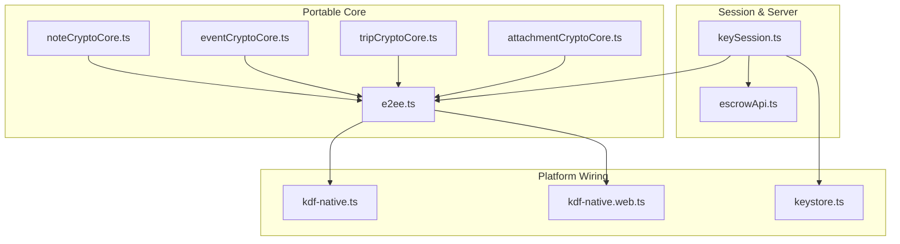
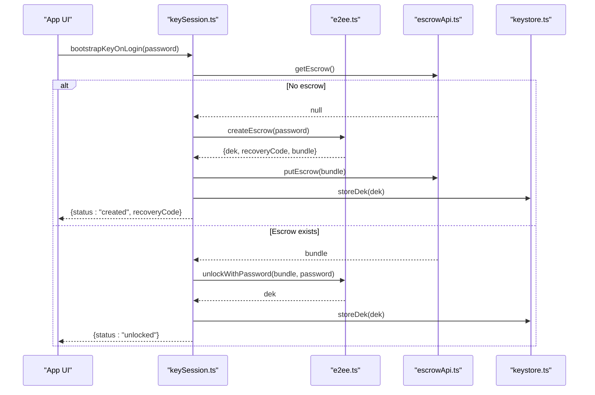
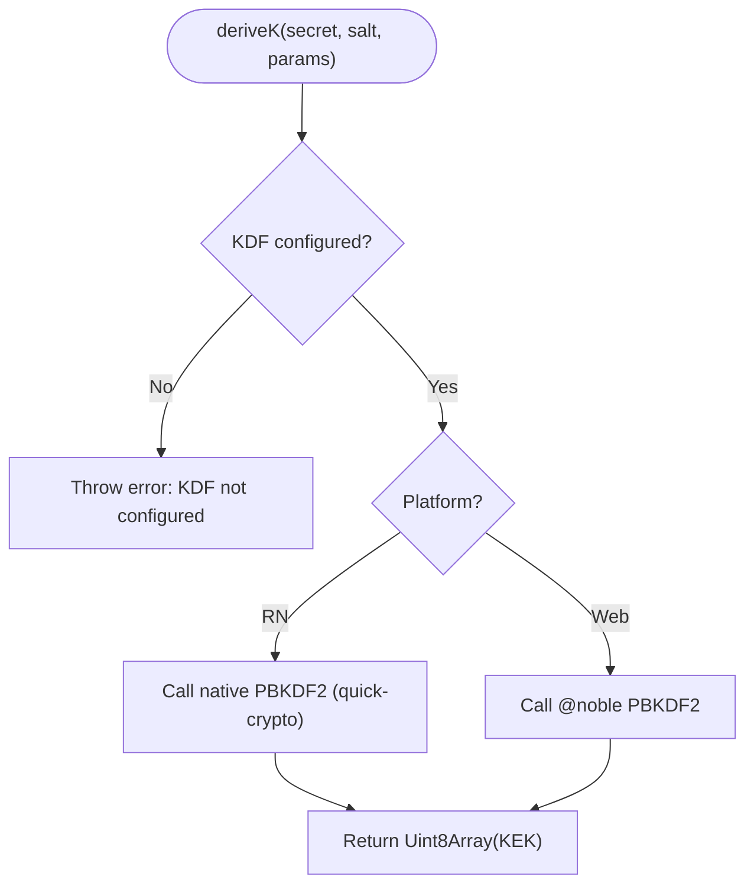
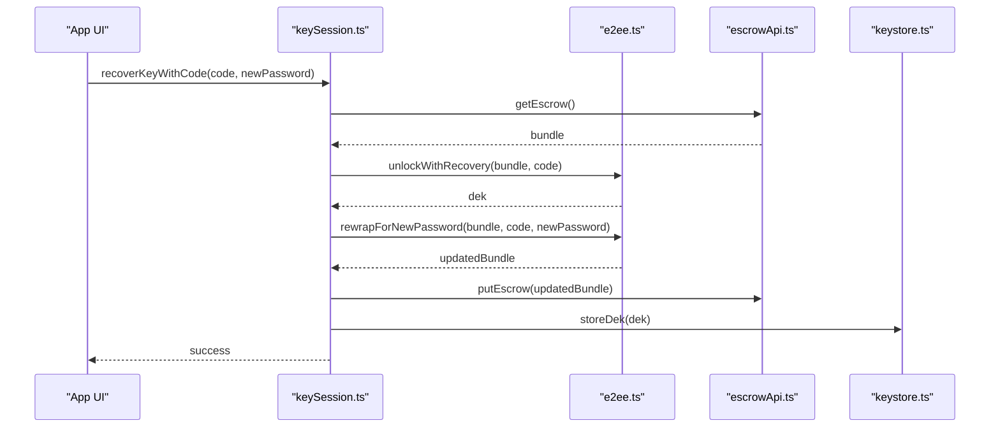
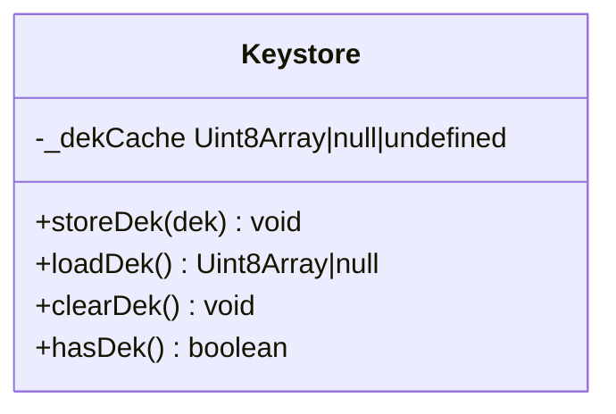
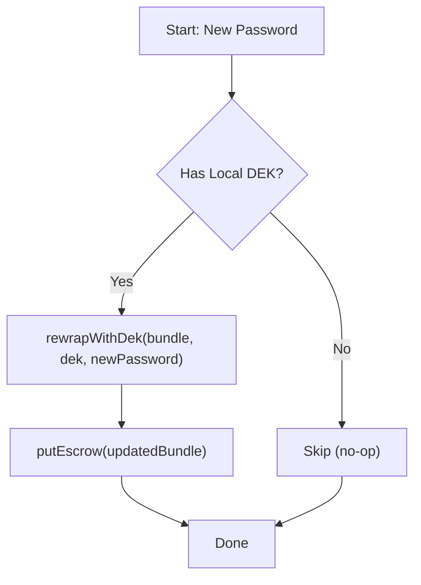
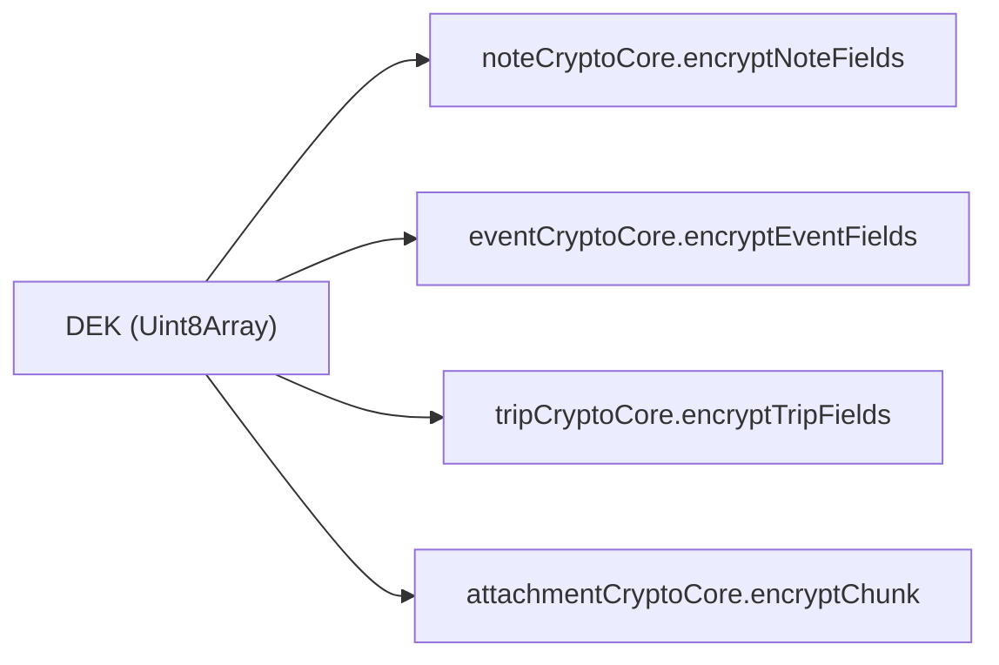
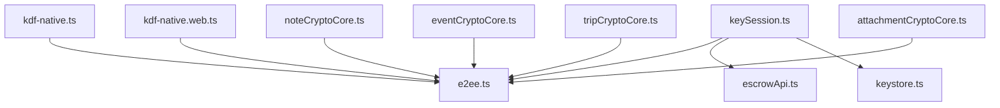

# Key Management

<cite>
**Referenced Files in This Document**
- [e2ee.ts](file://src/crypto/e2ee.ts)
- [kdf-native.ts](file://src/crypto/kdf-native.ts)
- [kdf-native.web.ts](file://src/crypto/kdf-native.web.ts)
- [keystore.ts](file://src/crypto/keystore.ts)
- [keySession.ts](file://src/crypto/keySession.ts)
- [escrowApi.ts](file://src/crypto/escrowApi.ts)
- [noteCryptoCore.ts](file://src/crypto/noteCryptoCore.ts)
- [eventCryptoCore.ts](file://src/crypto/eventCryptoCore.ts)
- [tripCryptoCore.ts](file://src/crypto/tripCryptoCore.ts)
- [attachmentCryptoCore.ts](file://src/crypto/attachmentCryptoCore.ts)
- [crypto-check.tsx](file://app/crypto-check.tsx)
- [recover-key.tsx](file://app/recover-key.tsx)
- [recovery-code.tsx](file://app/recovery-code.tsx)
</cite>

## Table of Contents
1. [Introduction](#introduction)
2. [Project Structure](#project-structure)
3. [Core Components](#core-components)
4. [Architecture Overview](#architecture-overview)
5. [Detailed Component Analysis](#detailed-component-analysis)
6. [Dependency Analysis](#dependency-analysis)
7. [Performance Considerations](#performance-considerations)
8. [Troubleshooting Guide](#troubleshooting-guide)
9. [Conclusion](#conclusion)
10. [Appendices](#appendices)

## Introduction
This document explains the cryptographic key management system used to protect user data end-to-end. It covers:
- Derivation of keys from passwords using PBKDF2 with platform-specific implementations (native on React Native, pure JS on web).
- Key session lifecycle: bootstrap at login, recovery after password reset, and logout cleanup.
- Secure storage of the Data Encryption Key (DEK) via the OS keystore-backed secure store.
- The keystore abstraction layer that handles platform differences between iOS, Android, and web.
- Key rotation flows for authenticated password changes and post-reset recovery.
- Examples of key generation, import/export operations, and secure backup considerations.
- Security considerations for storage, memory management, and protection against extraction attacks.

## Project Structure
The crypto subsystem is organized into a portable core plus platform wiring and per-domain encryption modules:
- Portable core: e2ee.ts defines primitives (AES-GCM, base64, escrow bundle format), KDF configuration, and escrow operations.
- Platform KDF wiring: kdf-native.ts wires native PBKDF2 on React Native; kdf-native.web.ts provides a pure-JS fallback for web.
- Secure storage: keystore.ts abstracts device-local DEK persistence via expo-secure-store with a process-level cache.
- Session orchestration: keySession.ts manages login, recovery, password change, and logout flows.
- Escrow API: escrowApi.ts communicates with the server to fetch/store the opaque escrow bundle.
- Domain encryption: noteCryptoCore.ts, eventCryptoCore.ts, tripCryptoCore.ts encrypt/decrypt domain fields under the DEK.
- Attachment encryption: attachmentCryptoCore.ts streams large files securely in chunks.

**Diagram sources**
- [e2ee.ts:1-228](file://src/crypto/e2ee.ts#L1-L228)
- [kdf-native.ts:1-22](file://src/crypto/kdf-native.ts#L1-L22)
- [kdf-native.web.ts:1-16](file://src/crypto/kdf-native.web.ts#L1-L16)
- [keystore.ts:1-53](file://src/crypto/keystore.ts#L1-L53)
- [keySession.ts:1-82](file://src/crypto/keySession.ts#L1-L82)
- [escrowApi.ts:1-39](file://src/crypto/escrowApi.ts#L1-L39)
- [noteCryptoCore.ts:1-158](file://src/crypto/noteCryptoCore.ts#L1-L158)
- [eventCryptoCore.ts:1-109](file://src/crypto/eventCryptoCore.ts#L1-L109)
- [tripCryptoCore.ts:1-97](file://src/crypto/tripCryptoCore.ts#L1-L97)
- [attachmentCryptoCore.ts:1-111](file://src/crypto/attachmentCryptoCore.ts#L1-L111)

**Section sources**
- [e2ee.ts:1-228](file://src/crypto/e2ee.ts#L1-L228)
- [keystore.ts:1-53](file://src/crypto/keystore.ts#L1-L53)
- [keySession.ts:1-82](file://src/crypto/keySession.ts#L1-L82)
- [escrowApi.ts:1-39](file://src/crypto/escrowApi.ts#L1-L39)

## Core Components
- PBKDF2-based key derivation:
  - Portable core exposes configureKdf and deriveKek; default parameters use PBKDF2-HMAC-SHA-512 with high iteration count tuned for on-device performance.
  - Platform wiring injects native PBKDF2 on React Native (fast) or pure JS PBKDF2 on web.
- Escrow bundle:
  - Stores two wrapped versions of the DEK: one derived from the user’s password, another from a recovery code. Includes salts, KDF params, and versioning.
- Secure storage:
  - Device-local DEK stored in OS keystore-backed secure store (iOS Keychain / Android Keystore via expo-secure-store). Web path is a no-op; E2EE is native-only there.
- Session orchestration:
  - At login: create escrow if missing, unlock DEK with password and persist it locally; handle recovery flow when password cannot unwrap escrow.
  - Password change: re-wrap escrow under new password while preserving DEK.
  - Logout: clear local DEK from secure store.
- Domain encryption:
  - Notes, events, trips, and attachments are encrypted under the DEK with AES-GCM, using field-level or chunked encryption as appropriate.

**Section sources**
- [e2ee.ts:29-51](file://src/crypto/e2ee.ts#L29-L51)
- [e2ee.ts:126-158](file://src/crypto/e2ee.ts#L126-L158)
- [e2ee.ts:177-227](file://src/crypto/e2ee.ts#L177-L227)
- [kdf-native.ts:1-22](file://src/crypto/kdf-native.ts#L1-L22)
- [kdf-native.web.ts:1-16](file://src/crypto/kdf-native.web.ts#L1-L16)
- [keystore.ts:1-53](file://src/crypto/keystore.ts#L1-L53)
- [keySession.ts:1-82](file://src/crypto/keySession.ts#L1-L82)

## Architecture Overview
The system separates concerns into layers:
- Portable crypto core: platform-independent primitives and escrow logic.
- Platform KDF injection: fast native PBKDF2 on RN; pure JS on web.
- Secure storage abstraction: hides platform details behind load/store/clear APIs.
- Session manager: orchestrates login, recovery, rotation, and logout.
- Domain modules: apply encryption to notes, events, trips, and attachments.

**Diagram sources**
- [keySession.ts:35-54](file://src/crypto/keySession.ts#L35-L54)
- [e2ee.ts:177-207](file://src/crypto/e2ee.ts#L177-L207)
- [escrowApi.ts:21-28](file://src/crypto/escrowApi.ts#L21-L28)
- [keystore.ts:30-42](file://src/crypto/keystore.ts#L30-L42)

## Detailed Component Analysis

### PBKDF2 Key Derivation (Platform-Specific)
- Configuration:
  - e2ee.ts exposes configureKdf and DEFAULT_KDF (PBKDF2-HMAC-SHA-512, high iterations).
  - deriveKek uses the configured implementation to produce KEKs from password or recovery code.
- Native path (React Native):
  - kdf-native.ts imports react-native-quick-crypto and configures PBKDF2 via pbkdf2Sync for performance.
- Web path:
  - kdf-native.web.ts uses @noble/hashes PBKDF2 with SHA-256/SHA-512 based on params.

**Diagram sources**
- [e2ee.ts:131-150](file://src/crypto/e2ee.ts#L131-L150)
- [kdf-native.ts:12-21](file://src/crypto/kdf-native.ts#L12-L21)
- [kdf-native.web.ts:8-15](file://src/crypto/kdf-native.web.ts#L8-L15)

**Section sources**
- [e2ee.ts:29-41](file://src/crypto/e2ee.ts#L29-L41)
- [e2ee.ts:131-150](file://src/crypto/e2ee.ts#L131-L150)
- [kdf-native.ts:1-22](file://src/crypto/kdf-native.ts#L1-L22)
- [kdf-native.web.ts:1-16](file://src/crypto/kdf-native.web.ts#L1-L16)

### Key Session Management
- Login bootstrap:
  - If no escrow: create DEK + recovery code, store escrow server-side, persist DEK locally, return recovery code once.
  - If escrow exists: attempt to unwrap DEK with password; on failure, signal needs_recovery.
- Recovery:
  - Unwrap DEK with recovery code, re-wrap escrow under new password, persist updated escrow and DEK.
- Authenticated password change:
  - Re-wrap escrow under new password using current DEK; preserves existing encrypted data.
- Logout:
  - Clear local DEK from secure store.

**Diagram sources**
- [keySession.ts:60-67](file://src/crypto/keySession.ts#L60-L67)
- [e2ee.ts:209-227](file://src/crypto/e2ee.ts#L209-L227)
- [escrowApi.ts:31-38](file://src/crypto/escrowApi.ts#L31-L38)
- [keystore.ts:30-42](file://src/crypto/keystore.ts#L30-L42)

**Section sources**
- [keySession.ts:1-82](file://src/crypto/keySession.ts#L1-L82)
- [e2ee.ts:177-227](file://src/crypto/e2ee.ts#L177-L227)

### Secure Storage Mechanisms (Keystore Abstraction)
- Purpose:
  - Store the DEK in OS keystore-backed secure store (iOS Keychain / Android Keystore) via expo-secure-store.
  - Web environment has no SecureStore; functions become no-ops and load returns null.
- Process-level caching:
  - In-memory memoization avoids repeated SecureStore calls during a single operation.
- Operations:
  - storeDek: write base64-encoded DEK to secure store and update cache.
  - loadDek: read from cache or secure store; return null if absent.
  - clearDek: delete from secure store and invalidate cache.
  - hasDek: check presence.

**Diagram sources**
- [keystore.ts:1-53](file://src/crypto/keystore.ts#L1-L53)

**Section sources**
- [keystore.ts:1-53](file://src/crypto/keystore.ts#L1-L53)

### Key Rotation Processes
- Authenticated password change:
  - Uses current DEK to re-wrap escrow under new password; preserves DEK and existing ciphertext.
- Post-reset recovery:
  - Uses recovery code to unwrap DEK, then re-wraps escrow under new password; updates server escrow and persists DEK locally.

**Diagram sources**
- [keySession.ts:73-77](file://src/crypto/keySession.ts#L73-L77)
- [e2ee.ts:214-220](file://src/crypto/e2ee.ts#L214-L220)

**Section sources**
- [keySession.ts:69-77](file://src/crypto/keySession.ts#L69-L77)
- [e2ee.ts:214-227](file://src/crypto/e2ee.ts#L214-L227)

### Domain Encryption (Notes, Events, Trips, Attachments)
- Notes:
  - Encrypts title, content, tag names, and attachment filenames under DEK; marks with enc_version to enable migration and idempotent encryption.
- Events:
  - Encrypts title, description, location; leaves scheduling fields plaintext for functionality.
- Trips:
  - Encrypts name and description; similar migration handling.
- Attachments:
  - Chunked AES-GCM encryption with per-chunk nonces and AAD binding index and finality to prevent tampering/malleability; supports large files without OOM.

**Diagram sources**
- [noteCryptoCore.ts:65-95](file://src/crypto/noteCryptoCore.ts#L65-L95)
- [eventCryptoCore.ts:36-56](file://src/crypto/eventCryptoCore.ts#L36-L56)
- [tripCryptoCore.ts:32-46](file://src/crypto/tripCryptoCore.ts#L32-L46)
- [attachmentCryptoCore.ts:78-92](file://src/crypto/attachmentCryptoCore.ts#L78-L92)

**Section sources**
- [noteCryptoCore.ts:1-158](file://src/crypto/noteCryptoCore.ts#L1-L158)
- [eventCryptoCore.ts:1-109](file://src/crypto/eventCryptoCore.ts#L1-L109)
- [tripCryptoCore.ts:1-97](file://src/crypto/tripCryptoCore.ts#L1-L97)
- [attachmentCryptoCore.ts:1-111](file://src/crypto/attachmentCryptoCore.ts#L1-L111)

## Dependency Analysis
- e2ee.ts depends on:
  - @noble/ciphers/aes.js for AES-GCM.
  - @noble/hashes/utils.js for randomBytes.
  - Platform KDF injected via configureKdf.
- keySession.ts depends on:
  - e2ee.ts for escrow operations.
  - escrowApi.ts for server communication.
  - keystore.ts for local DEK persistence.
- Domain cores depend on:
  - e2ee.ts for encryptString/decryptString and version constants.
- Platform wiring:
  - kdf-native.ts and kdf-native.web.ts both call configureKdf to set the PBKDF2 implementation.

**Diagram sources**
- [e2ee.ts:1-228](file://src/crypto/e2ee.ts#L1-L228)
- [kdf-native.ts:1-22](file://src/crypto/kdf-native.ts#L1-L22)
- [kdf-native.web.ts:1-16](file://src/crypto/kdf-native.web.ts#L1-L16)
- [keySession.ts:1-82](file://src/crypto/keySession.ts#L1-L82)
- [escrowApi.ts:1-39](file://src/crypto/escrowApi.ts#L1-L39)
- [keystore.ts:1-53](file://src/crypto/keystore.ts#L1-L53)
- [noteCryptoCore.ts:1-158](file://src/crypto/noteCryptoCore.ts#L1-L158)
- [eventCryptoCore.ts:1-109](file://src/crypto/eventCryptoCore.ts#L1-L109)
- [tripCryptoCore.ts:1-97](file://src/crypto/tripCryptoCore.ts#L1-L97)
- [attachmentCryptoCore.ts:1-111](file://src/crypto/attachmentCryptoCore.ts#L1-L111)

**Section sources**
- [e2ee.ts:1-228](file://src/crypto/e2ee.ts#L1-L228)
- [keySession.ts:1-82](file://src/crypto/keySession.ts#L1-L82)
- [escrowApi.ts:1-39](file://src/crypto/escrowApi.ts#L1-L39)
- [keystore.ts:1-53](file://src/crypto/keystore.ts#L1-L53)

## Performance Considerations
- PBKDF2 cost:
  - Default parameters use PBKDF2-HMAC-SHA-512 with high iterations; native PBKDF2 ensures acceptable login times on devices.
- Memory usage:
  - Attachment encryption processes files in fixed-size chunks to avoid OOM on large files.
- SecureStore overhead:
  - In-process DEK cache reduces repeated native keystore calls during a single operation.

[No sources needed since this section provides general guidance]

## Troubleshooting Guide
- Self-check diagnostics:
  - Use the on-device crypto-check screen to validate CSPRNG, AES-GCM round-trips, escrow unlock, SecureStore persistence, and PBKDF2 costs.
- Common issues:
  - Wrong password or recovery code: unlock functions throw; UI should prompt user to retry or enter recovery code.
  - Missing escrow: indicates first-time setup or legacy user; bootstrap creates escrow and shows recovery code once.
  - Web environment: SecureStore is unavailable; E2EE features are native-only.

**Section sources**
- [crypto-check.tsx:1-75](file://app/crypto-check.tsx#L1-L75)
- [recover-key.tsx:1-42](file://app/recover-key.tsx#L1-L42)
- [recovery-code.tsx:1-37](file://app/recovery-code.tsx#L1-L37)
- [keystore.ts:1-53](file://src/crypto/keystore.ts#L1-L53)

## Conclusion
The key management system provides robust end-to-end encryption by:
- Deriving strong KEKs via PBKDF2 with platform-optimized implementations.
- Managing the DEK lifecycle securely through OS keystore-backed storage.
- Supporting seamless recovery and rotation without exposing secrets to the server.
- Applying efficient, safe encryption across notes, events, trips, and large attachments.
Adhering to these patterns ensures confidentiality, integrity, and resilience against common threats while maintaining usability.

[No sources needed since this section summarizes without analyzing specific files]

## Appendices

### Examples and Procedures

- Key generation:
  - Generate a random DEK using the portable core’s key generation function.
  - Path reference: [e2ee.ts:126-129](file://src/crypto/e2ee.ts#L126-L129)

- Create escrow (signup/first login):
  - Create DEK and recovery code, wrap DEK under password and recovery KEKs, store bundle server-side, persist DEK locally, show recovery code once.
  - Path references:
    - [e2ee.ts:177-202](file://src/crypto/e2ee.ts#L177-L202)
    - [keySession.ts:35-43](file://src/crypto/keySession.ts#L35-L43)
    - [escrowApi.ts:31-38](file://src/crypto/escrowApi.ts#L31-L38)
    - [keystore.ts:30-34](file://src/crypto/keystore.ts#L30-L34)

- Import/Export operations:
  - Export: Not implemented directly; the system stores only ciphertext and opaque wrapped keys server-side.
  - Import: Not applicable; DEK is generated per-user and never imported externally.

- Secure backup procedures:
  - Backup the recovery code securely offline; it is the only way to recover access if the password is reset via email and can no longer unwrap the escrow.
  - Path references:
    - [keySession.ts:5-13](file://src/crypto/keySession.ts#L5-L13)
    - [recovery-code.tsx:1-37](file://app/recovery-code.tsx#L1-L37)

- Secure storage and memory management:
  - DEK is stored in OS keystore-backed secure store; web path is a no-op.
  - In-process cache minimizes native calls; ensure cache invalidation on logout or rotation.
  - Path references:
    - [keystore.ts:1-53](file://src/crypto/keystore.ts#L1-L53)
    - [attachmentCryptoCore.ts:1-25](file://src/crypto/attachmentCryptoCore.ts#L1-L25)

- Protection against extraction attacks:
  - Use platform secure storage for DEK.
  - Avoid logging or persisting plaintext keys or secrets.
  - Validate ciphertext integrity via AES-GCM tags; reject tampered data.
  - Path references:
    - [e2ee.ts:99-114](file://src/crypto/e2ee.ts#L99-L114)
    - [keystore.ts:1-53](file://src/crypto/keystore.ts#L1-L53)