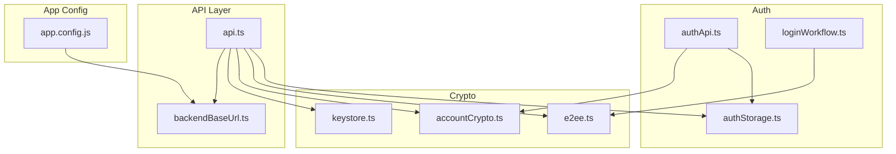
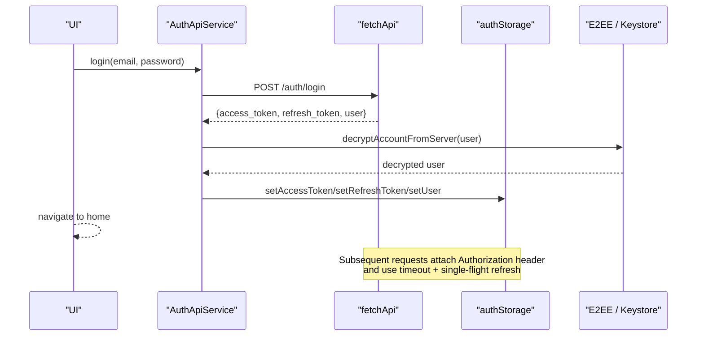
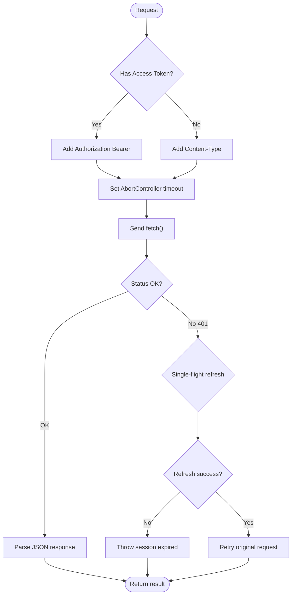
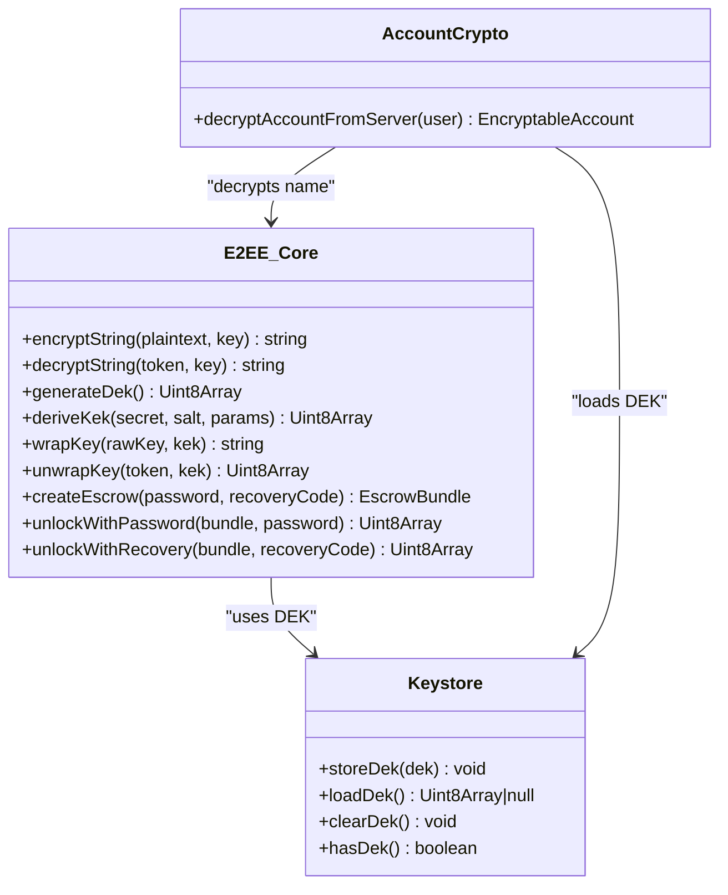
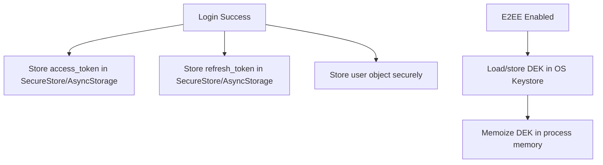
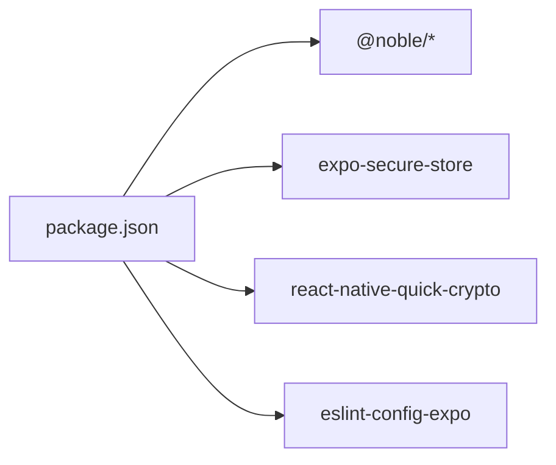

# Security Best Practices

<cite>
**Referenced Files in This Document**
- [authApi.ts](file://src/auth/api/authApi.ts)
- [api.ts](file://src/api.ts)
- [backendBaseUrl.ts](file://src/backendBaseUrl.ts)
- [authStorage.ts](file://src/auth/storage/authStorage.ts)
- [e2ee.ts](file://src/crypto/e2ee.ts)
- [accountCrypto.ts](file://src/crypto/accountCrypto.ts)
- [keystore.ts](file://src/crypto/keystore.ts)
- [loginWorkflow.ts](file://src/auth/loginWorkflow.ts)
- [ErrorBoundary.tsx](file://src/components/ErrorBoundary.tsx)
- [app.config.js](file://app.config.js)
- [package.json](file://package.json)
</cite>

## Table of Contents
1. [Introduction](#introduction)
2. [Project Structure](#project-structure)
3. [Core Components](#core-components)
4. [Architecture Overview](#architecture-overview)
5. [Detailed Component Analysis](#detailed-component-analysis)
6. [Dependency Analysis](#dependency-analysis)
7. [Performance Considerations](#performance-considerations)
8. [Troubleshooting Guide](#troubleshooting-guide)
9. [Conclusion](#conclusion)
10. [Appendices](#appendices)

## Introduction
This document provides security best practices derived from the frontend codebase, focusing on secure coding patterns, vulnerability mitigation, and security monitoring. It covers secure storage for sensitive data, input validation techniques, output encoding strategies, HTTPS enforcement, logging and monitoring without leaking secrets, secure dependency management, code review practices, and security testing methodologies. It also addresses common threats such as XSS, CSRF, and injection attacks with prevention strategies grounded in the implemented code.

## Project Structure
The application is a React Native/Expo app with a clear separation between authentication, API access, cryptography, and UI components. Security-critical areas include:
- Authentication and token handling
- End-to-end encryption (E2EE) for notes, events, trips, attachments, and account names
- Secure storage via platform keystore
- Centralized HTTP client with timeouts, retries, and token refresh
- Build-time configuration to enforce HTTPS and disable cleartext in production

**Diagram sources**
- [authApi.ts:1-259](file://src/auth/api/authApi.ts#L1-L259)
- [authStorage.ts:1-150](file://src/auth/storage/authStorage.ts#L1-L150)
- [loginWorkflow.ts:1-141](file://src/auth/loginWorkflow.ts#L1-L141)
- [e2ee.ts:1-228](file://src/crypto/e2ee.ts#L1-L228)
- [accountCrypto.ts:1-47](file://src/crypto/accountCrypto.ts#L1-L47)
- [keystore.ts:1-53](file://src/crypto/keystore.ts#L1-L53)
- [api.ts:1-559](file://src/api.ts#L1-L559)
- [backendBaseUrl.ts:1-14](file://src/backendBaseUrl.ts#L1-L14)
- [app.config.js:1-57](file://app.config.js#L1-L57)

**Section sources**
- [authApi.ts:1-259](file://src/auth/api/authApi.ts#L1-L259)
- [api.ts:1-559](file://src/api.ts#L1-L559)
- [backendBaseUrl.ts:1-14](file://src/backendBaseUrl.ts#L1-L14)
- [authStorage.ts:1-150](file://src/auth/storage/authStorage.ts#L1-L150)
- [e2ee.ts:1-228](file://src/crypto/e2ee.ts#L1-L228)
- [accountCrypto.ts:1-47](file://src/crypto/accountCrypto.ts#L1-L47)
- [keystore.ts:1-53](file://src/crypto/keystore.ts#L1-L53)
- [loginWorkflow.ts:1-141](file://src/auth/loginWorkflow.ts#L1-L141)
- [app.config.js:1-57](file://app.config.js#L1-L57)

## Core Components
- Authentication API service handles login, signup, password changes, token refresh, and user info retrieval with centralized header management and error parsing.
- Central API layer enforces timeouts, single-flight token refresh, automatic retry on 401, and consistent auth header injection.
- E2EE core implements AES-GCM encryption, PBKDF2 key derivation, escrow bundles, recovery codes, and key wrapping/unwrapping.
- Secure storage uses platform keystore for tokens and DEK; web falls back to AsyncStorage where applicable.
- Build configuration disables cleartext traffic in production builds and sets feature flags at build time.

**Section sources**
- [authApi.ts:33-105](file://src/auth/api/authApi.ts#L33-L105)
- [api.ts:23-121](file://src/api.ts#L23-L121)
- [e2ee.ts:21-51](file://src/crypto/e2ee.ts#L21-L51)
- [authStorage.ts:13-67](file://src/auth/storage/authStorage.ts#L13-L67)
- [app.config.js:14-56](file://app.config.js#L14-L56)

## Architecture Overview
The security architecture centers on:
- Transport security enforced by HTTPS-only base URL and production cleartext gating.
- Token lifecycle managed through a central fetch wrapper that refreshes access tokens and clears sessions on failure.
- Data-at-rest protection via E2EE using per-user DEKs stored in OS keystore; server stores ciphertext only.
- Secure storage abstraction isolates sensitive values from logs and memory leaks.

**Diagram sources**
- [authApi.ts:69-105](file://src/auth/api/authApi.ts#L69-L105)
- [api.ts:84-121](file://src/api.ts#L84-L121)
- [authStorage.ts:16-67](file://src/auth/storage/authStorage.ts#L16-L67)
- [accountCrypto.ts:35-46](file://src/crypto/accountCrypto.ts#L35-L46)

## Detailed Component Analysis

### Authentication and Session Management
- Centralized headers ensure Content-Type and optional Authorization are consistently applied.
- Login flow decrypts user data before persisting to avoid storing ciphertext unnecessarily.
- Logout clears all stored credentials; refresh flow preserves tokens on transient network errors but clears on explicit 401/403.
- Single-flight token refresh prevents race conditions when multiple requests fail concurrently due to rotated refresh tokens.

**Diagram sources**
- [api.ts:15-21](file://src/api.ts#L15-L21)
- [api.ts:23-72](file://src/api.ts#L23-L72)
- [api.ts:84-121](file://src/api.ts#L84-L121)

**Section sources**
- [authApi.ts:33-151](file://src/auth/api/authApi.ts#L33-L151)
- [api.ts:15-121](file://src/api.ts#L15-L121)

### End-to-End Encryption (E2EE)
- Uses AES-GCM with random nonces and PBKDF2-derived KEKs for strong authenticated encryption.
- Escrow bundles store wrapped DEKs under password and recovery code keys with salts and KDF parameters.
- Recovery code generation avoids ambiguous characters and ensures uniform entropy distribution.
- DEK is stored in OS keystore and memoized in-process to minimize keystore calls while limiting exposure window.

**Diagram sources**
- [e2ee.ts:21-51](file://src/crypto/e2ee.ts#L21-L51)
- [e2ee.ts:99-158](file://src/crypto/e2ee.ts#L99-L158)
- [e2ee.ts:177-227](file://src/crypto/e2ee.ts#L177-L227)
- [keystore.ts:1-53](file://src/crypto/keystore.ts#L1-L53)
- [accountCrypto.ts:1-47](file://src/crypto/accountCrypto.ts#L1-L47)

**Section sources**
- [e2ee.ts:21-51](file://src/crypto/e2ee.ts#L21-L51)
- [e2ee.ts:99-158](file://src/crypto/e2ee.ts#L99-L158)
- [e2ee.ts:177-227](file://src/crypto/e2ee.ts#L177-L227)
- [keystore.ts:1-53](file://src/crypto/keystore.ts#L1-L53)
- [accountCrypto.ts:1-47](file://src/crypto/accountCrypto.ts#L1-L47)

### Secure Storage of Sensitive Data
- Tokens and user data are persisted using SecureStore on native platforms; web falls back to AsyncStorage.
- DEK is never written to AsyncStorage or sent to the server; it resides in the OS keystore and is memoized in-process.
- Clear-all operations remove both SecureStore and AsyncStorage entries to prevent residual secrets.

**Diagram sources**
- [authStorage.ts:16-67](file://src/auth/storage/authStorage.ts#L16-L67)
- [authStorage.ts:94-103](file://src/auth/storage/authStorage.ts#L94-L103)
- [keystore.ts:16-41](file://src/crypto/keystore.ts#L16-L41)

**Section sources**
- [authStorage.ts:16-103](file://src/auth/storage/authStorage.ts#L16-L103)
- [keystore.ts:1-53](file://src/crypto/keystore.ts#L1-L53)

### Input Validation and Output Encoding
- All outbound requests set Content-Type to application/json, reducing ambiguity and mitigating certain injection vectors.
- User-provided inputs are serialized via JSON.stringify before transmission, ensuring structured payloads.
- Server-side validation is implied by endpoints returning detail messages on failures; clients surface generic user-friendly errors.
- For text processing and transcription, inputs are validated by backend responses; client throws descriptive errors without leaking internals.

**Section sources**
- [authApi.ts:33-46](file://src/auth/api/authApi.ts#L33-L46)
- [api.ts:84-121](file://src/api.ts#L84-L121)
- [api.ts:361-423](file://src/api.ts#L361-L423)
- [api.ts:427-458](file://src/api.ts#L427-L458)

### HTTPS Enforcement and CORS
- Base URLs are constructed from environment variables with a default HTTPS origin; trailing slashes are trimmed to prevent path traversal issues.
- Production builds disable cleartext traffic, enforcing HTTPS-only communication.
- CORS configuration is not present in the frontend code; assume backend enforces strict CORS policies.

**Section sources**
- [backendBaseUrl.ts:1-14](file://src/backendBaseUrl.ts#L1-L14)
- [app.config.js:14-56](file://app.config.js#L14-L56)

### Logging and Monitoring Without Leaking Secrets
- Error parsing logs status and content type but avoids printing full response bodies or tokens.
- Transcription and text processing log minimal metadata (status, lengths) and throw errors without exposing secrets.
- Debugging details are gated behind development flags and do not include sensitive fields.

**Section sources**
- [authApi.ts:9-31](file://src/auth/api/authApi.ts#L9-L31)
- [api.ts:361-423](file://src/api.ts#L361-L423)
- [api.ts:427-458](file://src/api.ts#L427-L458)
- [ErrorBoundary.tsx:69-81](file://src/components/ErrorBoundary.tsx#L69-L81)

### Secure Dependency Management
- Dependencies include audited cryptographic libraries (@noble/ciphers, @noble/hashes) and platform-specific crypto acceleration (react-native-quick-crypto).
- Dev dependencies include ESLint configured via Expo’s recommended ruleset.
- No built-in vulnerability scanning scripts are present; recommend integrating automated audits into CI.

**Section sources**
- [package.json:21-111](file://package.json#L21-L111)

### Code Review Practices
- The login workflow is decoupled from UI and framework dependencies, enabling testability and focused reviews.
- Cryptographic modules are isolated and well-documented, facilitating targeted security reviews.

**Section sources**
- [loginWorkflow.ts:1-33](file://src/auth/loginWorkflow.ts#L1-L33)
- [e2ee.ts:1-20](file://src/crypto/e2ee.ts#L1-L20)

### Security Testing Methodologies
- Dedicated test scripts exist for crypto, sharing normalization, sync logic, VAD, and Google event mapping.
- Tests run via Node with a custom resolver to support TypeScript and module resolution in headless environments.

**Section sources**
- [package.json:12-19](file://package.json#L12-L19)

## Dependency Analysis
Security-related dependencies and their roles:
- @noble/ciphers and @noble/hashes provide vetted primitives for AES-GCM and hashing.
- expo-secure-store secures tokens and DEK on native platforms.
- react-native-quick-crypto accelerates KDF operations for better UX without compromising security.
- eslint-config-expo standardizes linting rules to catch common issues early.

**Diagram sources**
- [package.json:21-111](file://package.json#L21-L111)

**Section sources**
- [package.json:21-111](file://package.json#L21-L111)

## Performance Considerations
- Fetch timeout prevents indefinite hangs that could stall background sync queues.
- Single-flight token refresh reduces redundant network calls and avoids token invalidation races.
- DEK memoization minimizes expensive keystore reads during bulk operations.
- Attachment uploads stream encrypted chunks to avoid OOM and keep plaintext out of storage.

**Section sources**
- [api.ts:74-82](file://src/api.ts#L74-L82)
- [api.ts:23-72](file://src/api.ts#L23-L72)
- [keystore.ts:16-41](file://src/crypto/keystore.ts#L16-L41)
- [api.ts:271-354](file://src/api.ts#L271-L354)

## Troubleshooting Guide
- Network errors and parse failures return user-friendly messages without exposing internals.
- Token refresh failures clear sessions appropriately; transient network errors preserve tokens for retry.
- Error boundary surfaces a safe message and optionally debug info in development builds.

**Section sources**
- [authApi.ts:9-31](file://src/auth/api/authApi.ts#L9-L31)
- [api.ts:104-121](file://src/api.ts#L104-L121)
- [ErrorBoundary.tsx:28-81](file://src/components/ErrorBoundary.tsx#L28-L81)

## Conclusion
The frontend implements robust security practices:
- Strong transport security via HTTPS and production cleartext gating.
- Comprehensive E2EE protecting notes, events, trips, attachments, and account names.
- Secure storage leveraging OS keystore for tokens and DEK.
- Centralized HTTP client with timeouts, retries, and single-flight token refresh.
- Careful logging and debugging that avoids leaking sensitive information.
To further harden the application, integrate automated dependency auditing, expand input validation checks, and consider adding CSP and other security headers on the backend side.

## Appendices

### Common Threats and Prevention Strategies
- XSS: Mitigated by rendering trusted content and avoiding unsafe HTML injection; rely on frameworks’ escaping and validate outputs server-side.
- CSRF: Not directly visible in frontend; ensure backend enforces CSRF protections for state-changing endpoints.
- Injection: Use parameterized APIs and structured JSON payloads; validate inputs server-side and sanitize outputs.

[No sources needed since this section provides general guidance]