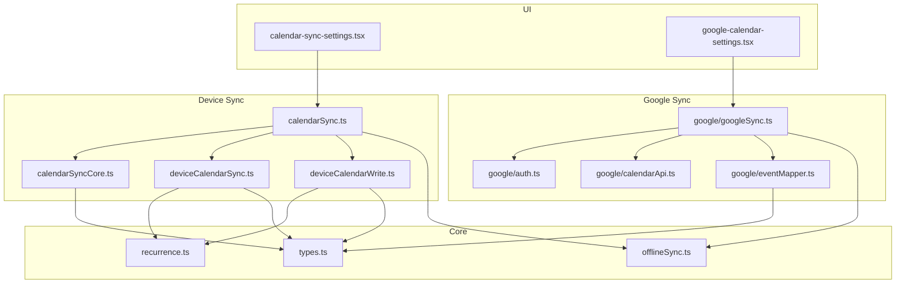
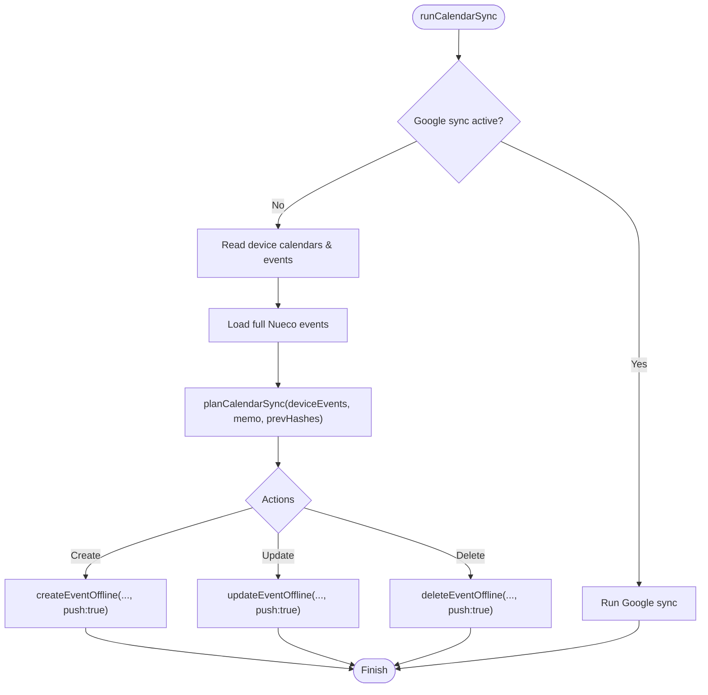
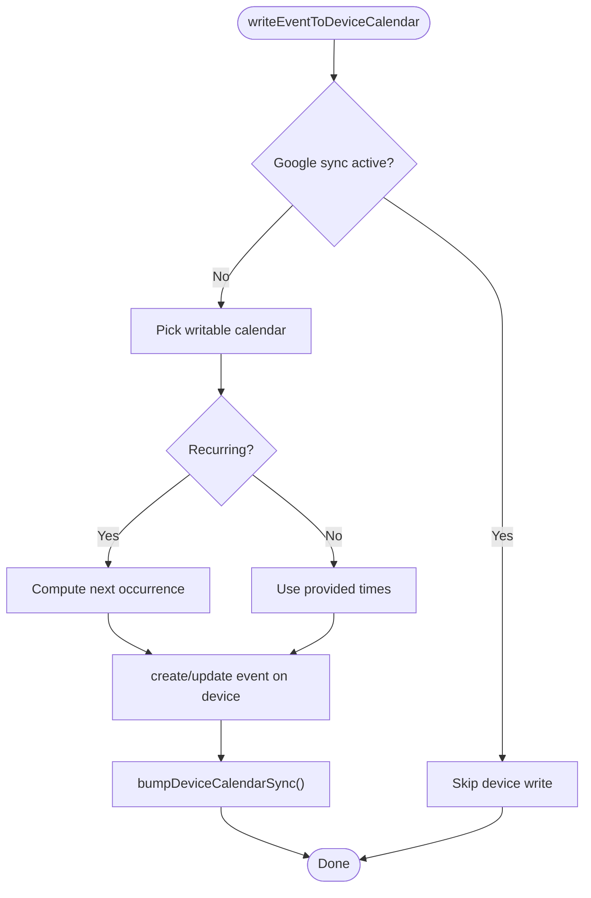
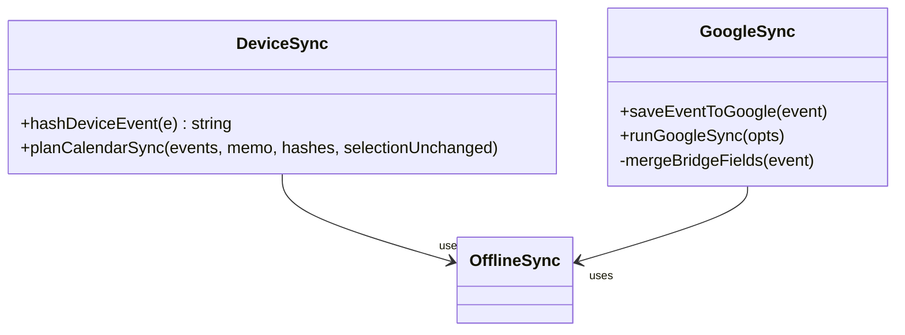
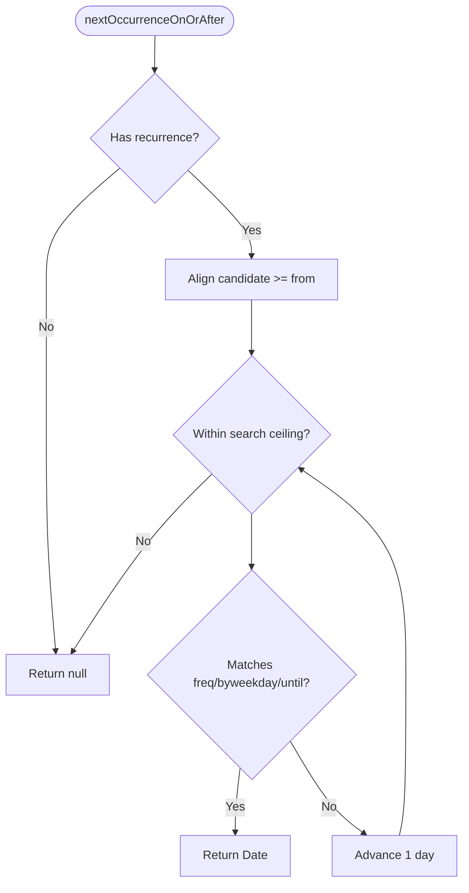
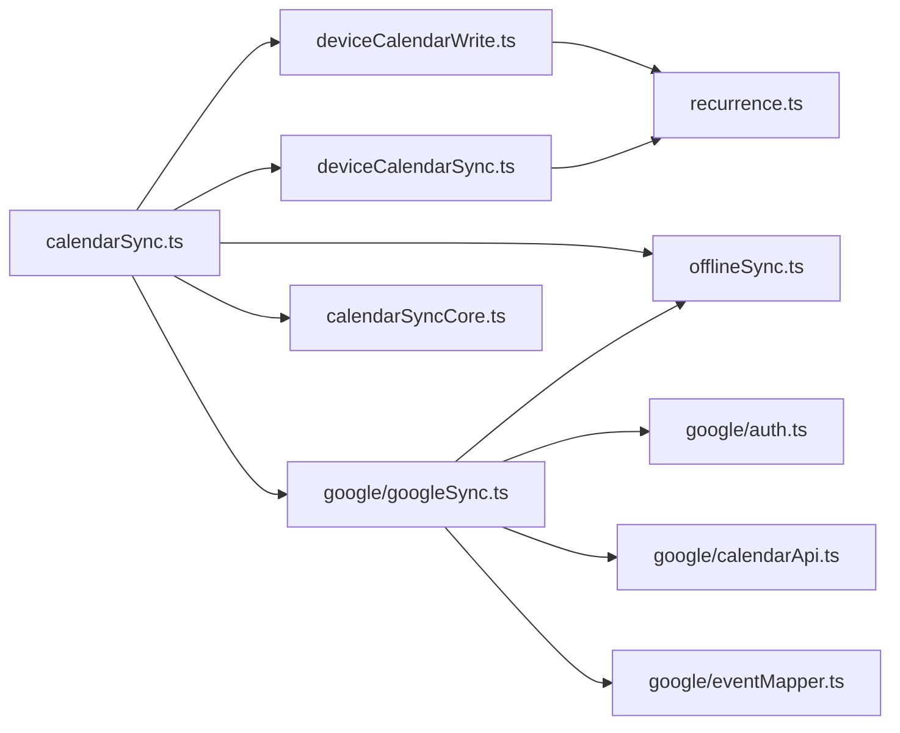

# Calendar Integration

<cite>
**Referenced Files in This Document**
- [calendarSync.ts](file://src/calendarSync.ts)
- [calendarSyncCore.ts](file://src/calendarSyncCore.ts)
- [deviceCalendarSync.ts](file://src/deviceCalendarSync.ts)
- [deviceCalendarWrite.ts](file://src/deviceCalendarWrite.ts)
- [google/auth.ts](file://src/google/auth.ts)
- [google/calendarApi.ts](file://src/google/calendarApi.ts)
- [google/eventMapper.ts](file://src/google/eventMapper.ts)
- [google/googleSync.ts](file://src/google/googleSync.ts)
- [recurrence.ts](file://src/recurrence.ts)
- [offlineSync.ts](file://src/offlineSync.ts)
- [types.ts](file://src/types.ts)
- [calendar-sync-settings.tsx](file://app/calendar-sync-settings.tsx)
- [google-calendar-settings.tsx](file://app/google-calendar-settings.tsx)
</cite>

## Table of Contents
1. [Introduction](#introduction)
2. [Project Structure](#project-structure)
3. [Core Components](#core-components)
4. [Architecture Overview](#architecture-overview)
5. [Detailed Component Analysis](#detailed-component-analysis)
6. [Dependency Analysis](#dependency-analysis)
7. [Performance Considerations](#performance-considerations)
8. [Troubleshooting Guide](#troubleshooting-guide)
9. [Conclusion](#conclusion)
10. [Appendices](#appendices)

## Introduction
This document explains the calendar synchronization system that keeps Nueco events in sync with:
- Device calendars (Apple/Google/Outlook via the OS), and
- A selected Google Calendar account using OAuth2 and direct API calls from the device.

It covers bidirectional sync, conflict detection and resolution, recurring event handling, timezone management, reminders, error handling, retry mechanisms, offline queue behavior, and performance considerations for large datasets.

## Project Structure
The calendar integration spans UI screens, sync orchestration, native device calendar access, Google OAuth/API, mapping logic, recurrence helpers, and offline persistence.



**Diagram sources**
- [calendarSync.ts:1-199](file://src/calendarSync.ts#L1-L199)
- [calendarSyncCore.ts:1-149](file://src/calendarSyncCore.ts#L1-L149)
- [deviceCalendarSync.ts:1-96](file://src/deviceCalendarSync.ts#L1-L96)
- [deviceCalendarWrite.ts:1-145](file://src/deviceCalendarWrite.ts#L1-L145)
- [google/auth.ts:1-242](file://src/google/auth.ts#L1-L242)
- [google/calendarApi.ts:1-147](file://src/google/calendarApi.ts#L1-L147)
- [google/eventMapper.ts:1-290](file://src/google/eventMapper.ts#L1-L290)
- [google/googleSync.ts:1-388](file://src/google/googleSync.ts#L1-L388)
- [recurrence.ts:1-276](file://src/recurrence.ts#L1-L276)
- [offlineSync.ts:1-800](file://src/offlineSync.ts#L1-L800)
- [types.ts:1-125](file://src/types.ts#L1-L125)
- [calendar-sync-settings.tsx:1-224](file://app/calendar-sync-settings.tsx#L1-L224)
- [google-calendar-settings.tsx:1-270](file://app/google-calendar-settings.tsx#L1-L270)

**Section sources**
- [calendarSync.ts:1-199](file://src/calendarSync.ts#L1-L199)
- [google/googleSync.ts:1-388](file://src/google/googleSync.ts#L1-L388)
- [deviceCalendarWrite.ts:1-145](file://src/deviceCalendarWrite.ts#L1-L145)
- [recurrence.ts:1-276](file://src/recurrence.ts#L1-L276)
- [offlineSync.ts:1-800](file://src/offlineSync.ts#L1-L800)

## Core Components
- Device calendar sync: pulls changes from device calendars into Nueco, with conservative deletion rules and throttling.
- Google Calendar sync: two-way bridge between Nueco and a selected Google calendar using OAuth2 and direct REST calls.
- Device calendar write: creates/updates one-off or next-occurrence entries on the device calendar.
- Recurrence engine: computes next occurrences and day-matching for display and device updates.
- Offline sync: durable local storage, sync queue, and merge semantics used by both sync paths.

Key responsibilities:
- Decide what to create/update/delete based on hashes and selection state.
- Map between Nueco events and Google resources safely, degrading unsupported recurrences gracefully.
- Persist retries and bridge fields so operations survive app restarts and network failures.

**Section sources**
- [calendarSyncCore.ts:1-149](file://src/calendarSyncCore.ts#L1-L149)
- [google/eventMapper.ts:1-290](file://src/google/eventMapper.ts#L1-L290)
- [deviceCalendarWrite.ts:1-145](file://src/deviceCalendarWrite.ts#L1-L145)
- [recurrence.ts:1-276](file://src/recurrence.ts#L1-L276)
- [offlineSync.ts:1-800](file://src/offlineSync.ts#L1-L800)

## Architecture Overview
Two parallel sync paths share common patterns:
- Throttled runs with a storage-based lock to avoid concurrent work across foreground/background contexts.
- Conservative deletions only when safe (selection unchanged and fetch non-empty).
- Full collection reads before planning actions to prevent duplicates.
- Persistent queues for failed outbound operations.

```mermaid
sequenceDiagram
participant UI as "Settings UI"
participant DS as "Device Sync (calendarSync.ts)"
participant DC as "Device Calendars (expo-calendar)"
participant OS as "OS Calendar Accounts"
participant GS as "Google Sync (googleSync.ts)"
participant GA as "Google API (calendarApi.ts)"
participant OFF as "Offline Sync (offlineSync.ts)"
UI->>DS : runCalendarSync(force?)
alt Google sync active
DS->>GS : runGoogleSync(force?)
GS->>GA : listEvents / create / update / delete
GS->>OFF : create/update/delete with push : true
else Device path
DS->>DC : getCalendarsAsync + getEventsAsync
DS->>DS : planCalendarSync(deviceEvents, memo, hashes)
DS->>OFF : create/update/delete with push : true
end
Note over DS,GS : Both paths throttle and use a storage lock
```

**Diagram sources**
- [calendarSync.ts:102-199](file://src/calendarSync.ts#L102-L199)
- [google/googleSync.ts:254-372](file://src/google/googleSync.ts#L254-L372)
- [google/calendarApi.ts:85-147](file://src/google/calendarApi.ts#L85-L147)
- [offlineSync.ts:599-700](file://src/offlineSync.ts#L599-L700)

## Detailed Component Analysis

### Bidirectional Device Calendar Sync
- Reads selected device calendars within a time window.
- Computes per-event hashes to detect changes.
- Plans create/update/delete actions; deletes are guarded by selection stability and non-empty fetch.
- Applies actions through offline sync with push enabled so they reach the server reliably.



**Diagram sources**
- [calendarSync.ts:102-199](file://src/calendarSync.ts#L102-L199)
- [calendarSyncCore.ts:87-149](file://src/calendarSyncCore.ts#L87-L149)
- [offlineSync.ts:599-700](file://src/offlineSync.ts#L599-L700)

**Section sources**
- [calendarSync.ts:102-199](file://src/calendarSync.ts#L102-L199)
- [calendarSyncCore.ts:1-149](file://src/calendarSyncCore.ts#L1-L149)

### Google Calendar Integration (OAuth2, API, Mapping)
- OAuth2 PKCE flow with refresh token handling and silent refresh before expiry.
- Direct REST calls to Google Calendar API v3 with pagination and error classification (retryable vs not).
- Event mapping supports RRULE translation, reminder snapping, attendee mirroring, and graceful degradation for unsupported features.

```mermaid
sequenceDiagram
participant UI as "Google Settings"
participant Auth as "auth.ts"
participant Sync as "googleSync.ts"
participant API as "calendarApi.ts"
participant OFF as "offlineSync.ts"
UI->>Auth : connectGoogleAccount()
Auth-->>UI : tokens (access/refresh/email)
UI->>Sync : setSelectedGoogleCalendar(...)
UI->>Sync : runGoogleSync(force : true)
Sync->>API : listCalendars / listEvents
Sync->>OFF : create/update/delete with push : true
Sync->>API : create/update/delete (outbound)
API-->>Sync : updated timestamps
Sync->>OFF : write back bridge fields
```

**Diagram sources**
- [google/auth.ts:106-218](file://src/google/auth.ts#L106-L218)
- [google/calendarApi.ts:63-147](file://src/google/calendarApi.ts#L63-L147)
- [google/googleSync.ts:205-372](file://src/google/googleSync.ts#L205-L372)
- [offlineSync.ts:599-700](file://src/offlineSync.ts#L599-L700)

**Section sources**
- [google/auth.ts:1-242](file://src/google/auth.ts#L1-L242)
- [google/calendarApi.ts:1-147](file://src/google/calendarApi.ts#L1-L147)
- [google/eventMapper.ts:1-290](file://src/google/eventMapper.ts#L1-L290)
- [google/googleSync.ts:1-388](file://src/google/googleSync.ts#L1-L388)

### Device Calendar Write and Recurring Updates
- Writes one-off or next occurrence to the device calendar, preferring synced accounts on Android and respecting iOS defaults.
- For recurring events, writes the upcoming instance and periodically refreshes it forward using recurrence helpers.



**Diagram sources**
- [deviceCalendarWrite.ts:68-145](file://src/deviceCalendarWrite.ts#L68-L145)
- [deviceCalendarSync.ts:44-96](file://src/deviceCalendarSync.ts#L44-L96)
- [recurrence.ts:75-127](file://src/recurrence.ts#L75-L127)

**Section sources**
- [deviceCalendarWrite.ts:1-145](file://src/deviceCalendarWrite.ts#L1-L145)
- [deviceCalendarSync.ts:1-96](file://src/deviceCalendarSync.ts#L1-L96)
- [recurrence.ts:1-276](file://src/recurrence.ts#L1-L276)

### Conflict Detection and Resolution
- Device sync: uses stable hashes per device event id; deletes only if selection unchanged and fetch non-empty.
- Google sync: last-write-wins policy using Google’s `updated` timestamp stored in `google_event_updated`; inbound applies only when newer than last seen.



**Diagram sources**
- [calendarSyncCore.ts:52-149](file://src/calendarSyncCore.ts#L52-L149)
- [google/googleSync.ts:134-183](file://src/google/googleSync.ts#L134-L183)
- [google/googleSync.ts:290-363](file://src/google/googleSync.ts#L290-L363)

**Section sources**
- [calendarSyncCore.ts:1-149](file://src/calendarSyncCore.ts#L1-L149)
- [google/googleSync.ts:254-372](file://src/google/googleSync.ts#L254-L372)

### Recurrence Handling and Timezone Management
- Recurrence computation advances day-by-day in UTC-instant arithmetic and consults event timezone only to determine local calendar day for matching against byweekday/until.
- All-day events use date-only semantics consistently across device and Google mapping.
- Reminder mapping snaps to allowed offsets; attendees mirrored read-only.



**Diagram sources**
- [recurrence.ts:75-127](file://src/recurrence.ts#L75-L127)
- [google/eventMapper.ts:80-147](file://src/google/eventMapper.ts#L80-L147)
- [google/eventMapper.ts:164-222](file://src/google/eventMapper.ts#L164-L222)

**Section sources**
- [recurrence.ts:1-276](file://src/recurrence.ts#L1-L276)
- [google/eventMapper.ts:1-290](file://src/google/eventMapper.ts#L1-L290)

### Reminder Synchronization
- Device sync does not push reminders to Nueco to preserve user customizations.
- Google sync maps popup reminders to the nearest allowed offset; default reminders are preserved when none specified.

**Section sources**
- [calendarSyncCore.ts:112-130](file://src/calendarSyncCore.ts#L112-L130)
- [google/eventMapper.ts:136-147](file://src/google/eventMapper.ts#L136-L147)
- [google/eventMapper.ts:265-271](file://src/google/eventMapper.ts#L265-L271)

### Error Handling, Retry Mechanisms, and Offline Queue
- Google sync enqueues failed pushes/deletes in a persistent queue and flushes at each run; non-retryable errors drop items.
- Device sync persists action outcomes via hash map updates; failures keep prior hashes so operations retry next run.
- Offline sync provides file-backed JSON stores to avoid AsyncStorage size limits and includes mutexing to prevent race conditions.

```mermaid
sequenceDiagram
participant App as "App"
participant GS as "googleSync.ts"
participant Q as "Retry Queue"
participant API as "calendarApi.ts"
participant OFF as "offlineSync.ts"
App->>GS : saveEventToGoogle(event)
GS->>API : create/update
alt Network/Rate limit
API-->>GS : error (retryable)
GS->>Q : enqueueRetry(push|delete)
else Success
API-->>GS : updated timestamp
GS->>OFF : write bridge fields
end
Note over GS,Q : On next run, flushRetryQueue replays pending ops
```

**Diagram sources**
- [google/googleSync.ts:108-125](file://src/google/googleSync.ts#L108-L125)
- [google/googleSync.ts:205-238](file://src/google/googleSync.ts#L205-L238)
- [google/calendarApi.ts:20-52](file://src/google/calendarApi.ts#L20-L52)
- [offlineSync.ts:388-415](file://src/offlineSync.ts#L388-L415)

**Section sources**
- [google/googleSync.ts:86-125](file://src/google/googleSync.ts#L86-L125)
- [calendarSync.ts:171-187](file://src/calendarSync.ts#L171-L187)
- [offlineSync.ts:122-193](file://src/offlineSync.ts#L122-L193)
- [offlineSync.ts:388-415](file://src/offlineSync.ts#L388-L415)

### Common Sync Scenarios
- New device event appears: imported as a new Nueco event with device id linkage.
- Edited device event: matched by id and updated with title/location/dates/all_day; reminders and linked notes are preserved.
- Deleted device event: mirrored to Nueco only when selection unchanged and fetch non-empty.
- New Google event: imported into Nueco with mapped fields; unsupported recurrences degraded to single occurrence with note.
- Edited Google event: applied when newer than last seen; deleted events mirrored conservatively within the fetched window.
- Outbound edit: pushed to Google; failures queued and retried later.

**Section sources**
- [calendarSyncCore.ts:87-149](file://src/calendarSyncCore.ts#L87-L149)
- [google/googleSync.ts:290-363](file://src/google/googleSync.ts#L290-L363)

## Dependency Analysis
High-level dependencies:
- calendarSync.ts depends on device calendar APIs, offline sync, and optionally delegates to googleSync when connected.
- googleSync.ts depends on auth, calendarApi, eventMapper, and offline sync.
- deviceCalendarWrite.ts and deviceCalendarSync.ts depend on recurrence helpers and optional Google sync check.
- recurrence.ts is pure and consumed by both device write and refresh flows.
- offlineSync.ts provides durable storage and queueing used by both sync paths.



**Diagram sources**
- [calendarSync.ts:1-199](file://src/calendarSync.ts#L1-L199)
- [google/googleSync.ts:1-388](file://src/google/googleSync.ts#L1-L388)
- [deviceCalendarWrite.ts:1-145](file://src/deviceCalendarWrite.ts#L1-L145)
- [deviceCalendarSync.ts:1-96](file://src/deviceCalendarSync.ts#L1-L96)
- [recurrence.ts:1-276](file://src/recurrence.ts#L1-L276)
- [calendarSyncCore.ts:1-149](file://src/calendarSyncCore.ts#L1-L149)

**Section sources**
- [calendarSync.ts:1-199](file://src/calendarSync.ts#L1-L199)
- [google/googleSync.ts:1-388](file://src/google/googleSync.ts#L1-L388)
- [deviceCalendarWrite.ts:1-145](file://src/deviceCalendarWrite.ts#L1-L145)
- [deviceCalendarSync.ts:1-96](file://src/deviceCalendarSync.ts#L1-L96)
- [recurrence.ts:1-276](file://src/recurrence.ts#L1-L276)
- [calendarSyncCore.ts:1-149](file://src/calendarSyncCore.ts#L1-L149)

## Performance Considerations
- Throttling: Both sync paths throttle to every 15 minutes unless forced, reducing redundant work.
- Locking: Storage-based locks prevent overlapping runs across foreground/background contexts.
- Full collection reads: Before planning actions, both paths load the entire Nueco event set to avoid duplicates caused by partial reads.
- File-backed storage: Large collections are persisted to JSON files to avoid AsyncStorage row-size limits and improve reliability.
- In-memory caching: Local collections and sync queue are cached in memory during a session to reduce repeated disk reads.
- Pagination: Google API listing uses page tokens to handle large calendars efficiently.
- Recurrence search cap: Day-stepping capped to ~3 years to bound worst-case searches.

[No sources needed since this section provides general guidance]

## Troubleshooting Guide
- No device calendars found: Ensure calendar permissions are granted and OS accounts are present; settings screen will prompt if needed.
- Google sync not starting: Verify connection and selected calendar; ensure tokens are valid and not revoked.
- Duplicate events: Occurs if full collection read fails mid-run; next run will re-baseline safely.
- Missing deletions: Deletions require selection unchanged and non-empty fetch; adjust expectations accordingly.
- Rate limiting or transient errors: Google sync queues retries; check retry queue after reconnect.
- Large dataset jank: File-backed storage and in-memory caches mitigate heavy loads; consider forcing sync less often.

**Section sources**
- [calendarSync.ts:117-157](file://src/calendarSync.ts#L117-L157)
- [google/googleSync.ts:254-283](file://src/google/googleSync.ts#L254-L283)
- [offlineSync.ts:122-193](file://src/offlineSync.ts#L122-L193)

## Conclusion
The calendar integration provides robust, user-friendly synchronization between Nueco and device/Google calendars. It emphasizes safety (conservative deletions), resilience (retries and offline queues), correctness (timezones and recurrence alignment), and performance (throttling, caching, file-backed storage). Users can opt into device import or enable two-way Google sync with clear controls and immediate feedback.

[No sources needed since this section summarizes without analyzing specific files]

## Appendices

### UI Entry Points
- Device calendar sync settings: toggle enablement, select calendars, manual sync.
- Google Calendar settings: connect/disconnect, choose calendar, manual sync.

**Section sources**
- [calendar-sync-settings.tsx:1-224](file://app/calendar-sync-settings.tsx#L1-L224)
- [google-calendar-settings.tsx:1-270](file://app/google-calendar-settings.tsx#L1-L270)