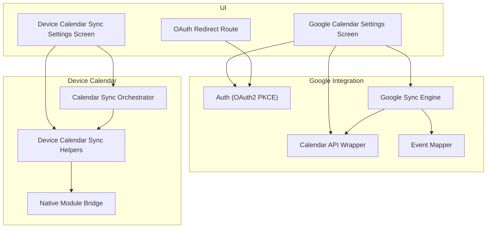
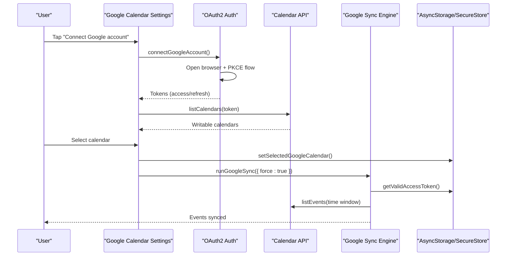
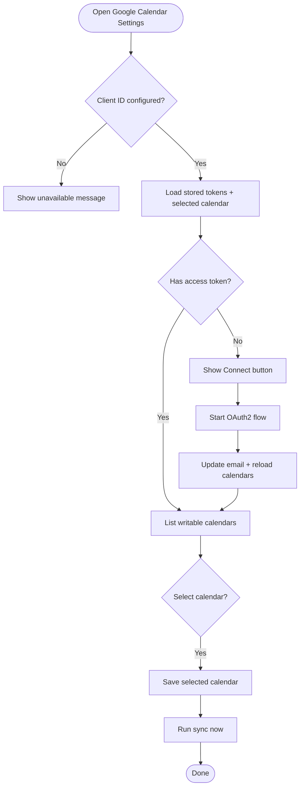
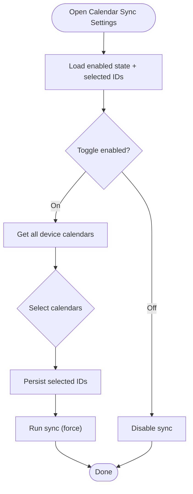
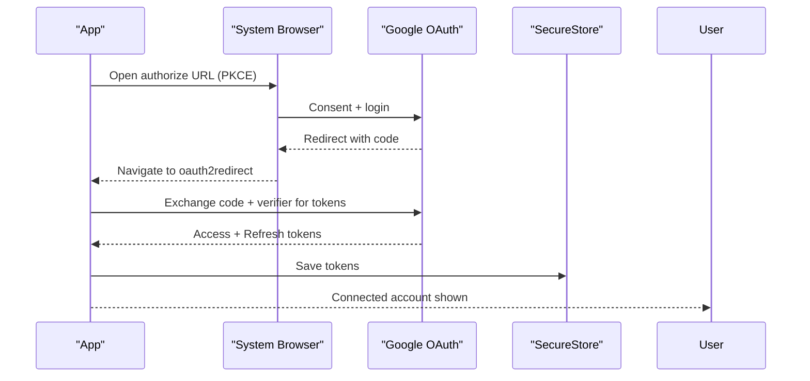
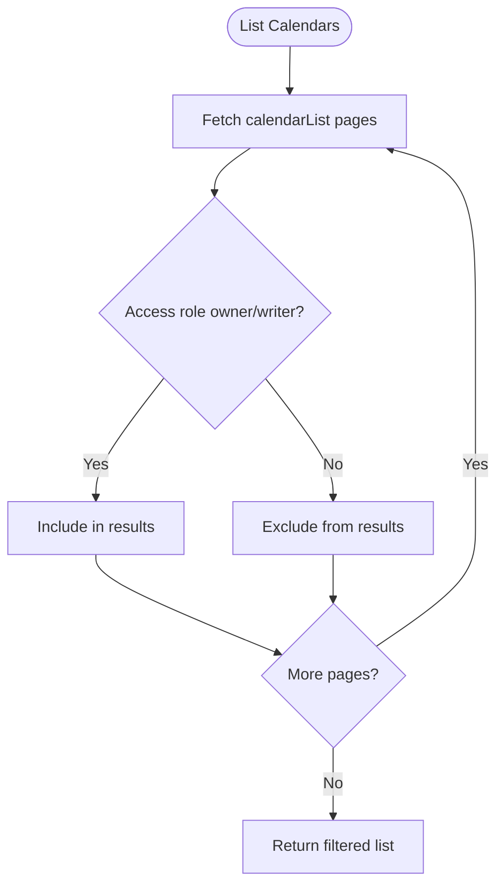
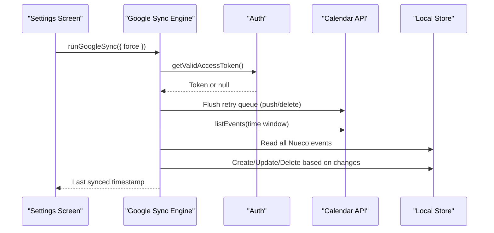
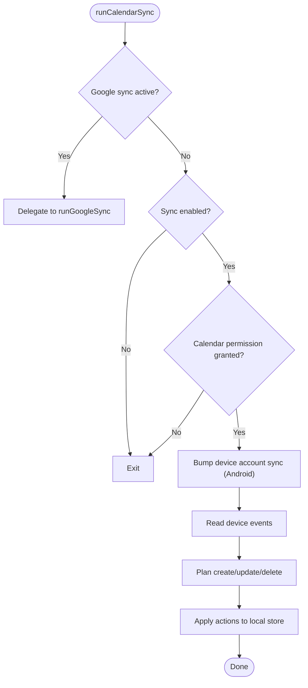
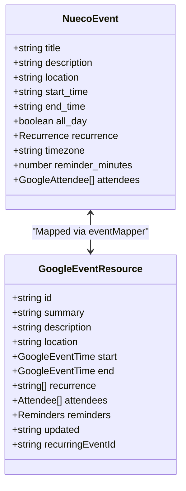
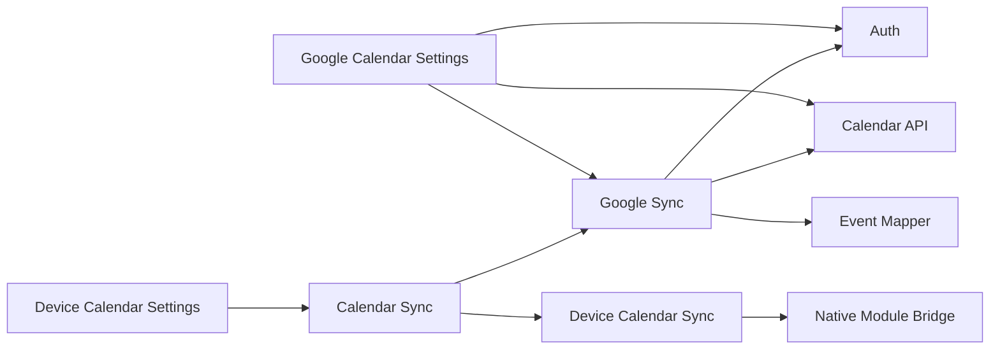

# Calendar Management & Configuration

<cite>
**Referenced Files in This Document**
- [google-calendar-settings.tsx](file://app/google-calendar-settings.tsx)
- [calendar-sync-settings.tsx](file://app/calendar-sync-settings.tsx)
- [oauth2redirect.tsx](file://app/oauth2redirect.tsx)
- [auth.ts](file://src/google/auth.ts)
- [calendarApi.ts](file://src/google/calendarApi.ts)
- [googleSync.ts](file://src/google/googleSync.ts)
- [eventMapper.ts](file://src/google/eventMapper.ts)
- [calendarSync.ts](file://src/calendarSync.ts)
- [deviceCalendarSync.ts](file://src/deviceCalendarSync.ts)
- [calendarSyncCore.ts](file://src/calendarSyncCore.ts)
- [index.ts](file://modules/calendar-account-sync/index.ts)
</cite>

## Table of Contents
1. Introduction
2. Project Structure
3. Core Components
4. Architecture Overview
5. Detailed Component Analysis
6. Dependency Analysis
7. Performance Considerations
8. Troubleshooting Guide
9. Conclusion
10. Appendices

## Introduction
This document explains the calendar management and configuration interfaces for syncing events with device calendars and Google Calendar. It covers enabling/disabling sync, selecting calendars, configuring preferences, the Google OAuth2 connection workflow (authorization, account selection, permissions), settings persistence across sessions, discovery and filtering of calendars, bulk operations, error handling for permission denials and network issues, and guidance for common scenarios and troubleshooting.

## Project Structure
The feature spans UI screens, a Google integration layer, and device calendar sync logic:
- UI screens:
  - Device calendar sync settings screen
  - Google Calendar settings screen
  - OAuth redirect route
- Google integration:
  - OAuth2 authentication and token management
  - REST wrapper over Google Calendar API
  - Two-way sync engine and mapping between Nueco and Google event models
- Device calendar sync:
  - Orchestration and throttling
  - Native module bridge to trigger Android account sync
  - Pure decision logic for create/update/delete planning

**Diagram sources**
- [google-calendar-settings.tsx:28-235](file://app/google-calendar-settings.tsx#L28-L235)
- [calendar-sync-settings.tsx:18-189](file://app/calendar-sync-settings.tsx#L18-L189)
- [oauth2redirect.tsx:10-12](file://app/oauth2redirect.tsx#L10-L12)
- [auth.ts:106-178](file://src/google/auth.ts#L106-L178)
- [calendarApi.ts:20-52](file://src/google/calendarApi.ts#L20-L52)
- [googleSync.ts:254-372](file://src/google/googleSync.ts#L254-L372)
- [eventMapper.ts:113-147](file://src/google/eventMapper.ts#L113-L147)
- [calendarSync.ts:102-198](file://src/calendarSync.ts#L102-L198)
- [deviceCalendarSync.ts:17-30](file://src/deviceCalendarSync.ts#L17-L30)
- [index.ts:10-15](file://modules/calendar-account-sync/index.ts#L10-L15)

**Section sources**
- [google-calendar-settings.tsx:28-235](file://app/google-calendar-settings.tsx#L28-L235)
- [calendar-sync-settings.tsx:18-189](file://app/calendar-sync-settings.tsx#L18-L189)
- [oauth2redirect.tsx:10-12](file://app/oauth2redirect.tsx#L10-L12)
- [auth.ts:106-178](file://src/google/auth.ts#L106-L178)
- [calendarApi.ts:20-52](file://src/google/calendarApi.ts#L20-L52)
- [googleSync.ts:254-372](file://src/google/googleSync.ts#L254-L372)
- [eventMapper.ts:113-147](file://src/google/eventMapper.ts#L113-L147)
- [calendarSync.ts:102-198](file://src/calendarSync.ts#L102-L198)
- [deviceCalendarSync.ts:17-30](file://src/deviceCalendarSync.ts#L17-L30)
- [index.ts:10-15](file://modules/calendar-account-sync/index.ts#L10-L15)

## Core Components
- Google Calendar Settings Screen: Connects/disconnects Google accounts, lists writable calendars, selects one, and triggers immediate sync.
- Device Calendar Sync Settings Screen: Toggles auto-sync, selects device calendars, and runs manual sync.
- OAuth2 Auth: Handles PKCE flow, stores tokens securely, refreshes access tokens, and disconnects gracefully.
- Calendar API Wrapper: Thin REST client for Google Calendar v3 with typed errors and retryable status classification.
- Google Sync Engine: Two-way sync with throttling, locking, retry queue, and conservative deletion; maps events bidirectionally.
- Device Calendar Sync: Orchestrates periodic sync from OS calendars into Nueco, with safety checks and native sync nudges on Android.
- Event Mapper: Converts between Nueco events and Google Calendar resources, degrading unsupported features transparently.

**Section sources**
- [google-calendar-settings.tsx:28-235](file://app/google-calendar-settings.tsx#L28-L235)
- [calendar-sync-settings.tsx:18-189](file://app/calendar-sync-settings.tsx#L18-L189)
- [auth.ts:106-178](file://src/google/auth.ts#L106-L178)
- [calendarApi.ts:20-52](file://src/google/calendarApi.ts#L20-L52)
- [googleSync.ts:254-372](file://src/google/googleSync.ts#L254-L372)
- [calendarSync.ts:102-198](file://src/calendarSync.ts#L102-L198)
- [eventMapper.ts:113-147](file://src/google/eventMapper.ts#L113-L147)

## Architecture Overview
The system supports two parallel sync paths:
- Google Calendar path: Direct client-side calls to Google Calendar API using stored OAuth tokens.
- Device Calendar path: Reads from the OS calendar via Expo Calendar and writes to Nueco’s local store.

When a Google account is connected and a calendar selected, the device calendar sync path defers to the Google sync engine to avoid duplicate imports.

**Diagram sources**
- [google-calendar-settings.tsx:61-91](file://app/google-calendar-settings.tsx#L61-L91)
- [auth.ts:106-178](file://src/google/auth.ts#L106-L178)
- [calendarApi.ts:63-78](file://src/google/calendarApi.ts#L63-L78)
- [googleSync.ts:254-372](file://src/google/googleSync.ts#L254-L372)

## Detailed Component Analysis

### Google Calendar Settings Screen
- Purpose: Enable/disable Google Calendar sync, connect/disconnect accounts, choose a single writable calendar, and trigger sync.
- Key behaviors:
  - Checks availability based on build-time client ID.
  - Loads stored tokens and selected calendar; fetches calendars if connected.
  - Connects via OAuth2, updates UI state, and optionally runs an immediate sync.
  - Disconnect clears tokens and resets UI state.
- Persistence: Uses SecureStore for tokens and AsyncStorage for selected calendar metadata.

**Diagram sources**
- [google-calendar-settings.tsx:39-91](file://app/google-calendar-settings.tsx#L39-L91)
- [auth.ts:106-178](file://src/google/auth.ts#L106-L178)
- [calendarApi.ts:63-78](file://src/google/calendarApi.ts#L63-L78)

**Section sources**
- [google-calendar-settings.tsx:28-235](file://app/google-calendar-settings.tsx#L28-L235)
- [auth.ts:106-178](file://src/google/auth.ts#L106-L178)
- [calendarApi.ts:63-78](file://src/google/calendarApi.ts#L63-L78)

### Device Calendar Sync Settings Screen
- Purpose: Toggle auto-sync, select multiple device calendars, and run manual sync.
- Key behaviors:
  - On enable, loads available device calendars and requests permissions if needed.
  - Toggling a calendar updates persisted selection and triggers a sync.
  - Provides info dialog explaining sync behavior and data copying.
- Throttling and locking: Prevents frequent background runs and concurrent syncs.

**Diagram sources**
- [calendar-sync-settings.tsx:27-76](file://app/calendar-sync-settings.tsx#L27-L76)
- [calendarSync.ts:102-198](file://src/calendarSync.ts#L102-L198)

**Section sources**
- [calendar-sync-settings.tsx:18-189](file://app/calendar-sync-settings.tsx#L18-L189)
- [calendarSync.ts:102-198](file://src/calendarSync.ts#L102-L198)

### Google OAuth2 Authorization Workflow
- Flow highlights:
  - PKCE authorization code flow via expo-auth-session.
  - Redirect handled by a dedicated route to resume the app.
  - Tokens stored in SecureStore; refresh happens automatically before expiry.
  - Disconnection revokes grant server-side when possible and clears local tokens.
- Permissions: Requests calendar.events (read/write), calendar.readonly (for listing), openid/email (to show connected account).

**Diagram sources**
- [auth.ts:106-178](file://src/google/auth.ts#L106-L178)
- [oauth2redirect.tsx:10-12](file://app/oauth2redirect.tsx#L10-L12)

**Section sources**
- [auth.ts:106-178](file://src/google/auth.ts#L106-L178)
- [oauth2redirect.tsx:10-12](file://app/oauth2redirect.tsx#L10-L12)

### Google Calendar Discovery and Filtering
- Discovery: Lists user’s calendars via calendarList endpoint.
- Filtering: Only owner or writer access roles are considered useful for two-way sync.
- Timezone: Calendar timezone is stored and used when pushing timed events without explicit timezone.

**Diagram sources**
- [calendarApi.ts:63-78](file://src/google/calendarApi.ts#L63-L78)

**Section sources**
- [calendarApi.ts:63-78](file://src/google/calendarApi.ts#L63-L78)

### Google Sync Engine (Two-Way Sync)
- Outbound: Pushes Nueco events to Google; failures enqueue retries; deletes mirrored conservatively.
- Inbound: Pulls master events within a time window; creates/updates Nueco events based on last-write-wins policy; mirrors deletions conservatively.
- Concurrency: Uses storage-based lock and throttle to prevent overlapping runs.
- Retry Queue: Persists failed push/delete operations and flushes at start of each sync run.

**Diagram sources**
- [googleSync.ts:254-372](file://src/google/googleSync.ts#L254-L372)
- [auth.ts:185-219](file://src/google/auth.ts#L185-L219)
- [calendarApi.ts:85-146](file://src/google/calendarApi.ts#L85-L146)

**Section sources**
- [googleSync.ts:254-372](file://src/google/googleSync.ts#L254-L372)

### Device Calendar Sync Orchestration
- Behavior: When Google sync is active, device sync delegates to Google sync to avoid duplicates.
- Safety: Conservative deletion only when calendar selection is unchanged and fetch returned events.
- Native nudge: On Android, triggers account sync adapters to pull fresh data before reading device calendars.

**Diagram sources**
- [calendarSync.ts:102-198](file://src/calendarSync.ts#L102-L198)
- [deviceCalendarSync.ts:17-30](file://src/deviceCalendarSync.ts#L17-L30)

**Section sources**
- [calendarSync.ts:102-198](file://src/calendarSync.ts#L102-L198)
- [deviceCalendarSync.ts:17-30](file://src/deviceCalendarSync.ts#L17-L30)

### Event Mapping Between Nueco and Google
- Nueco to Google: Builds RRULE where supported; sets reminders; handles all-day vs timed events; uses calendar timezone fallback.
- Google to Nueco: Parses RRULE; degrades unsupported recurrence features by saving as a single occurrence with explanatory note; maps attendees read-only; snaps reminders to allowed values.

**Diagram sources**
- [eventMapper.ts:113-147](file://src/google/eventMapper.ts#L113-L147)
- [eventMapper.ts:247-289](file://src/google/eventMapper.ts#L247-L289)

**Section sources**
- [eventMapper.ts:113-147](file://src/google/eventMapper.ts#L113-L147)
- [eventMapper.ts:247-289](file://src/google/eventMapper.ts#L247-L289)

## Dependency Analysis
- UI depends on sync modules and auth:
  - Google Calendar Settings depends on auth, calendarApi, googleSync.
  - Device Calendar Settings depends on calendarSync and deviceCalendarSync helpers.
- Sync modules depend on:
  - calendarSync depends on googleSync and deviceCalendarSync.
  - googleSync depends on auth, calendarApi, eventMapper, offlineSync, api.
  - deviceCalendarSync depends on native module bridge and googleSync.
- External dependencies:
  - expo-auth-session for OAuth2.
  - expo-secure-store for secure token storage.
  - expo-calendar for device calendar access.
  - Google Calendar REST API endpoints.

**Diagram sources**
- [google-calendar-settings.tsx:14-26](file://app/google-calendar-settings.tsx#L14-L26)
- [calendar-sync-settings.tsx:6-13](file://app/calendar-sync-settings.tsx#L6-L13)
- [calendarSync.ts:17-24](file://src/calendarSync.ts#L17-L24)
- [googleSync.ts:24-42](file://src/google/googleSync.ts#L24-L42)
- [deviceCalendarSync.ts:1-6](file://src/deviceCalendarSync.ts#L1-L6)
- [index.ts:1-15](file://modules/calendar-account-sync/index.ts#L1-L15)

**Section sources**
- [google-calendar-settings.tsx:14-26](file://app/google-calendar-settings.tsx#L14-L26)
- [calendar-sync-settings.tsx:6-13](file://app/calendar-sync-settings.tsx#L6-L13)
- [calendarSync.ts:17-24](file://src/calendarSync.ts#L17-L24)
- [googleSync.ts:24-42](file://src/google/googleSync.ts#L24-L42)
- [deviceCalendarSync.ts:1-6](file://src/deviceCalendarSync.ts#L1-L6)
- [index.ts:1-15](file://modules/calendar-account-sync/index.ts#L1-L15)

## Performance Considerations
- Throttling: Both Google and device sync enforce a minimum interval between runs to reduce API/network load.
- Locking: Storage-based locks prevent concurrent sync runs across foreground/background contexts.
- Pagination: Calendar and event listing use pagination to handle large datasets efficiently.
- Conservative Deletions: Avoid destructive actions unless safe conditions hold, reducing unnecessary churn.
- Best-effort native sync nudges: Improve freshness without blocking sync flows.

[No sources needed since this section provides general guidance]

## Troubleshooting Guide
Common issues and resolutions:
- Permission denied (device calendars):
  - Ensure calendar permission is granted; the settings screen will prompt if missing.
  - If no calendars appear, check OS-level calendar access and account sync status.
- Network issues:
  - Transient network errors are marked retryable; the sync engine queues and retries later.
  - If persistent, verify connectivity and try “Sync Now”.
- Invalid configurations:
  - Missing build-time client ID disables Google connect; configure the client ID to enable.
  - Without a refresh token, reconnect to obtain one; otherwise the connection expires quickly.
- OAuth2 failures:
  - If sign-in does not complete or redirect fails, ensure the redirect route exists and scheme is registered.
  - If refresh fails due to revoked grants, disconnect and reconnect to re-consent.
- Multiple calendar accounts:
  - Google Calendar sync connects to one account at a time; disconnect to switch accounts.
  - Device calendar sync reads from all OS-managed accounts; select which ones to import.

**Section sources**
- [auth.ts:106-178](file://src/google/auth.ts#L106-L178)
- [auth.ts:185-219](file://src/google/auth.ts#L185-L219)
- [calendarApi.ts:20-52](file://src/google/calendarApi.ts#L20-L52)
- [googleSync.ts:379-387](file://src/google/googleSync.ts#L379-L387)
- [calendarSync.ts:77-86](file://src/calendarSync.ts#L77-L86)

## Conclusion
The calendar management system provides robust two-way sync with Google Calendar and opt-in sync from device calendars. It emphasizes reliability through throttling, locking, retry queues, and conservative deletion policies. The UI guides users through connecting accounts, selecting calendars, and managing sync preferences, while persistence ensures settings survive app restarts. Error handling addresses common failure modes like permission denials and network issues, and the architecture cleanly separates concerns across UI, auth, API, and sync layers.

[No sources needed since this section summarizes without analyzing specific files]

## Appendices

### Common Configuration Scenarios
- Enable device calendar sync:
  - Turn on the toggle in Calendar Sync Settings; select calendars; tap “Sync Now” to import events.
- Connect Google Calendar:
  - Tap “Connect Google account,” complete OAuth2 consent, select a writable calendar, then sync immediately.
- Switch Google accounts:
  - Disconnect current account, then reconnect with the desired account.
- Manage multiple device calendars:
  - Select/deselect calendars in the settings list; changes persist and trigger sync.

[No sources needed since this section provides general guidance]