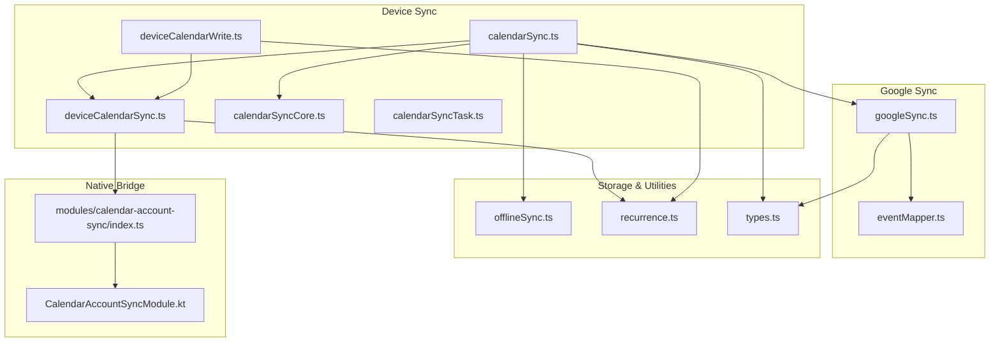
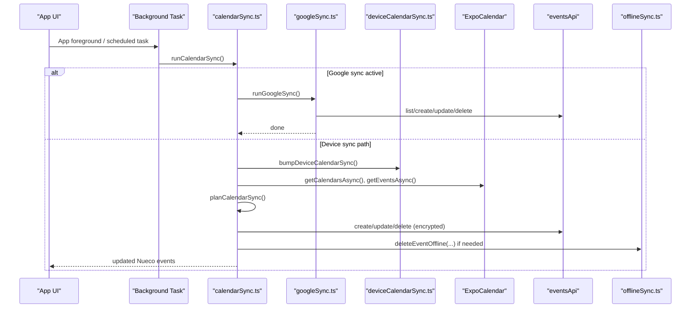
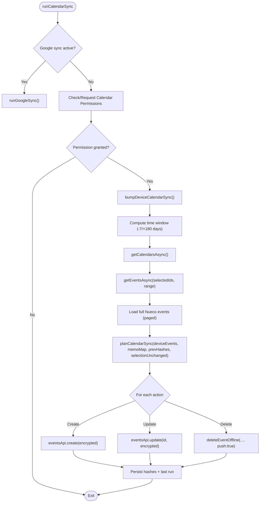
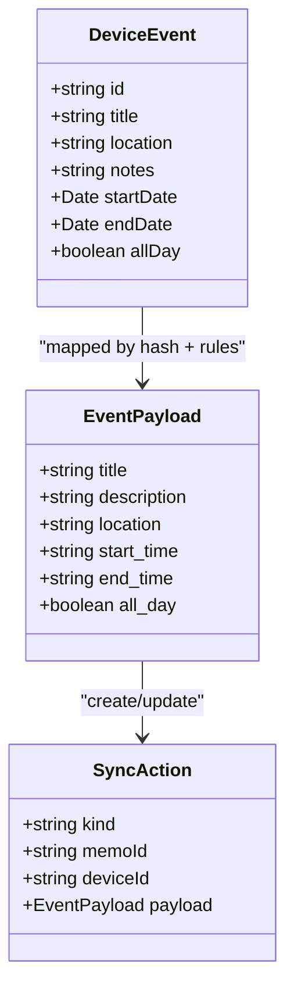
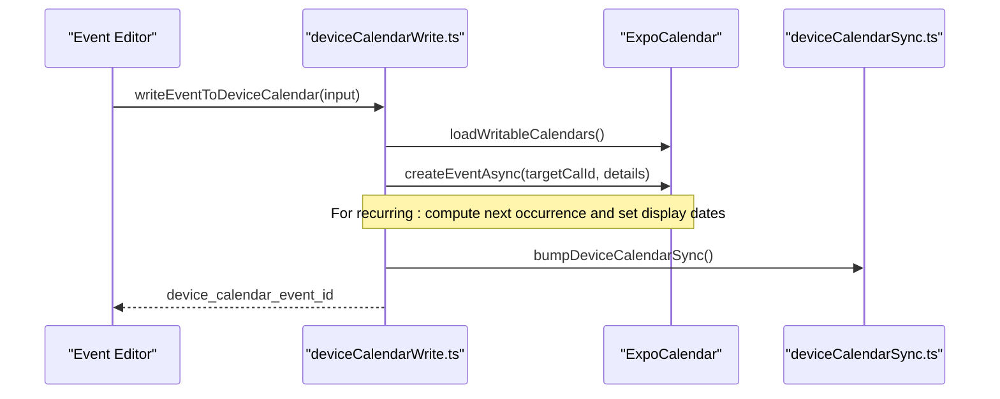
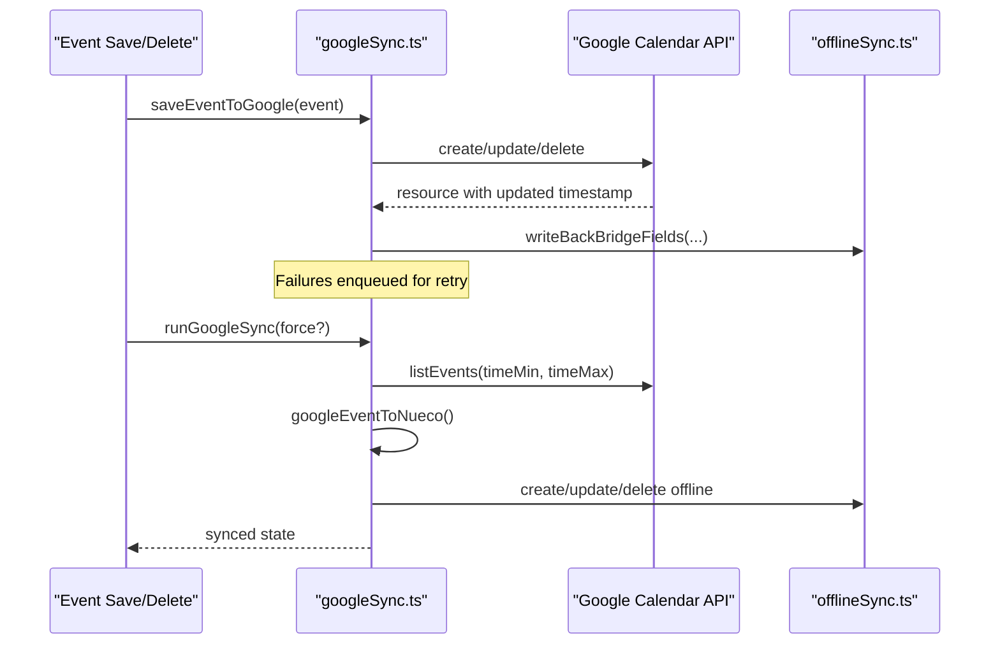
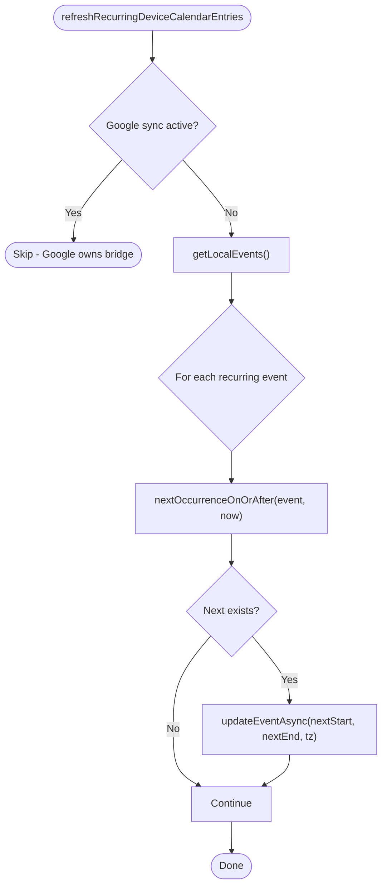
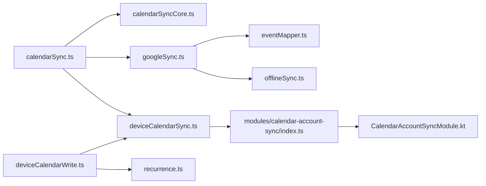

# Device Calendar Synchronization

<cite>
**Referenced Files in This Document**
- [deviceCalendarSync.ts](file://src/deviceCalendarSync.ts)
- [calendarSync.ts](file://src/calendarSync.ts)
- [calendarSyncCore.ts](file://src/calendarSyncCore.ts)
- [calendarSyncTask.ts](file://src/calendarSyncTask.ts)
- [deviceCalendarWrite.ts](file://src/deviceCalendarWrite.ts)
- [googleSync.ts](file://src/google/googleSync.ts)
- [eventMapper.ts](file://src/google/eventMapper.ts)
- [recurrence.ts](file://src/recurrence.ts)
- [offlineSync.ts](file://src/offlineSync.ts)
- [types.ts](file://src/types.ts)
- [index.ts (native module bridge)](file://modules/calendar-account-sync/index.ts)
- [CalendarAccountSyncModule.kt](file://modules/calendar-account-sync/android/src/main/java/expo/modules/calendaraccountsync/CalendarAccountSyncModule.kt)
</cite>

## Table of Contents
1. [Introduction](#introduction)
2. [Project Structure](#project-structure)
3. [Core Components](#core-components)
4. [Architecture Overview](#architecture-overview)
5. [Detailed Component Analysis](#detailed-component-analysis)
6. [Dependency Analysis](#dependency-analysis)
7. [Performance Considerations](#performance-considerations)
8. [Troubleshooting Guide](#troubleshooting-guide)
9. [Conclusion](#conclusion)
10. [Appendices](#appendices)

## Introduction
This document explains how the application synchronizes events between Nueco and native device calendars (Apple, Google, Outlook) using expo-calendar, as well as a dedicated two-way sync with Google Calendar via its API. It covers:
- Reading device calendar events into Nueco
- Mapping device events to Nueco’s internal event model
- Bidirectional synchronization (Nueco ↔ device calendar; Nueco ↔ Google Calendar)
- Recurring event handling, timezone management, and reminders
- Permission handling, error recovery, and offline sync queue management
- Common sync scenarios, conflict resolution strategies, and performance optimizations for large datasets

## Project Structure
The calendar synchronization system is implemented across several modules:
- Device calendar read/write and recurring refresh helpers
- Core sync planning logic (pure decision functions)
- Background task registration for periodic sync
- Google Calendar integration (API-based two-way sync)
- Offline storage, queues, and merge logic
- Types and recurrence utilities

**Diagram sources**
- [calendarSync.ts:1-199](file://src/calendarSync.ts#L1-L199)
- [calendarSyncCore.ts:1-149](file://src/calendarSyncCore.ts#L1-L149)
- [deviceCalendarSync.ts:1-96](file://src/deviceCalendarSync.ts#L1-L96)
- [deviceCalendarWrite.ts:1-145](file://src/deviceCalendarWrite.ts#L1-L145)
- [googleSync.ts:1-388](file://src/google/googleSync.ts#L1-L388)
- [eventMapper.ts:1-290](file://src/google/eventMapper.ts#L1-L290)
- [recurrence.ts:1-276](file://src/recurrence.ts#L1-L276)
- [offlineSync.ts:1-800](file://src/offlineSync.ts#L1-L800)
- [types.ts:1-125](file://src/types.ts#L1-L125)
- [index.ts (native module bridge):1-16](file://modules/calendar-account-sync/index.ts#L1-L16)
- [CalendarAccountSyncModule.kt:1-31](file://modules/calendar-account-sync/android/src/main/java/expo/modules/calendaraccountsync/CalendarAccountSyncModule.kt#L1-L31)

**Section sources**
- [calendarSync.ts:1-199](file://src/calendarSync.ts#L1-L199)
- [calendarSyncCore.ts:1-149](file://src/calendarSyncCore.ts#L1-L149)
- [deviceCalendarSync.ts:1-96](file://src/deviceCalendarSync.ts#L1-L96)
- [deviceCalendarWrite.ts:1-145](file://src/deviceCalendarWrite.ts#L1-L145)
- [googleSync.ts:1-388](file://src/google/googleSync.ts#L1-L388)
- [eventMapper.ts:1-290](file://src/google/eventMapper.ts#L1-L290)
- [recurrence.ts:1-276](file://src/recurrence.ts#L1-L276)
- [offlineSync.ts:1-800](file://src/offlineSync.ts#L1-L800)
- [types.ts:1-125](file://src/types.ts#L1-L125)
- [index.ts (native module bridge):1-16](file://modules/calendar-account-sync/index.ts#L1-L16)
- [CalendarAccountSyncModule.kt:1-31](file://modules/calendar-account-sync/android/src/main/java/expo/modules/calendaraccountsync/CalendarAccountSyncModule.kt#L1-L31)

## Core Components
- Device calendar import pipeline: reads from native calendars, plans create/update/delete actions, applies them to Nueco via the API or offline queue.
- Device calendar write path: creates/updates device calendar entries for Nueco events, including recurring “next occurrence” updates.
- Google Calendar two-way sync: direct API calls to Google, mapping events back and forth, with retry queue and conservative deletion.
- Recurrence engine: finds next occurrences and determines day coverage for display and device entry refresh.
- Offline sync manager: local persistence, sync queue, conflict resolution by timestamps, and background processing.

**Section sources**
- [calendarSync.ts:1-199](file://src/calendarSync.ts#L1-L199)
- [deviceCalendarWrite.ts:1-145](file://src/deviceCalendarWrite.ts#L1-L145)
- [googleSync.ts:1-388](file://src/google/googleSync.ts#L1-L388)
- [recurrence.ts:1-276](file://src/recurrence.ts#L1-L276)
- [offlineSync.ts:1-800](file://src/offlineSync.ts#L1-L800)

## Architecture Overview
The system supports two parallel sync paths:
- Device calendar sync: reads all device calendars known to the OS (Apple/iCloud, Google, Outlook/Exchange) and imports changes into Nueco.
- Google Calendar sync: when connected, bypasses device calendar reads and talks directly to Google Calendar API for two-way sync.

**Diagram sources**
- [calendarSync.ts:1-199](file://src/calendarSync.ts#L1-L199)
- [googleSync.ts:1-388](file://src/google/googleSync.ts#L1-L388)
- [deviceCalendarSync.ts:1-96](file://src/deviceCalendarSync.ts#L1-L96)
- [offlineSync.ts:1-800](file://src/offlineSync.ts#L1-L800)

## Detailed Component Analysis

### Device Calendar Import Pipeline
- Permissions: requests calendar permissions before reading calendars/events.
- Selection tracking: stores selected calendar IDs and last-run state to avoid accidental deletions when selection changes.
- Throttling and locking: prevents overlapping runs and excessive network usage.
- Planning: computes create/update/delete actions based on hashes of device events and existing Nueco mappings.
- Application: encrypts payloads and pushes to server; uses offline queue for deletes to survive connectivity issues.

**Diagram sources**
- [calendarSync.ts:1-199](file://src/calendarSync.ts#L1-L199)
- [calendarSyncCore.ts:1-149](file://src/calendarSyncCore.ts#L1-L149)
- [deviceCalendarSync.ts:1-96](file://src/deviceCalendarSync.ts#L1-L96)
- [offlineSync.ts:1-800](file://src/offlineSync.ts#L1-L800)

**Section sources**
- [calendarSync.ts:1-199](file://src/calendarSync.ts#L1-L199)
- [calendarSyncCore.ts:1-149](file://src/calendarSyncCore.ts#L1-L149)

### Event Mapping: Device → Nueco
- All-day vs timed events: all-day uses date-only strings; timed uses ISO instants.
- Field translation: title, location, notes/description, start/end times, all_day flag.
- Hashing: stable hash per device event to detect changes without reprocessing unchanged items.
- Deletion safety: only deletes Nueco copies when calendar selection is unchanged and fetch returned at least one event.

**Diagram sources**
- [calendarSyncCore.ts:1-149](file://src/calendarSyncCore.ts#L1-L149)

**Section sources**
- [calendarSyncCore.ts:1-149](file://src/calendarSyncCore.ts#L1-L149)

### Device Calendar Write Path
- Writes Nueco events to the device’s native calendar (Apple/Google/Outlook).
- For recurring events, writes a single instance pointing to the next occurrence; periodically refreshed to keep it current.
- Selects appropriate target calendar respecting platform defaults and account type.
- On success, nudges Android account sync adapter to push changes immediately.

**Diagram sources**
- [deviceCalendarWrite.ts:1-145](file://src/deviceCalendarWrite.ts#L1-L145)
- [deviceCalendarSync.ts:1-96](file://src/deviceCalendarSync.ts#L1-L96)

**Section sources**
- [deviceCalendarWrite.ts:1-145](file://src/deviceCalendarWrite.ts#L1-L145)
- [deviceCalendarSync.ts:1-96](file://src/deviceCalendarSync.ts#L1-L96)

### Google Calendar Two-Way Sync
- Outbound: maps Nueco events to Google resources and creates/updates/deletes via API; failures enqueue for retry.
- Inbound: lists events within a time window, maps to Nueco, applies updates when newer than last seen, mirrors deletions conservatively.
- Conflict policy: last-write-wins on Google side; inbound applies only when Google’s update timestamp is newer than last seen.

**Diagram sources**
- [googleSync.ts:1-388](file://src/google/googleSync.ts#L1-L388)
- [eventMapper.ts:1-290](file://src/google/eventMapper.ts#L1-L290)
- [offlineSync.ts:1-800](file://src/offlineSync.ts#L1-L800)

**Section sources**
- [googleSync.ts:1-388](file://src/google/googleSync.ts#L1-L388)
- [eventMapper.ts:1-290](file://src/google/eventMapper.ts#L1-L290)

### Recurring Events and Timezone Management
- Next occurrence calculation: day-stepping in UTC-instant arithmetic with timezone-aware calendar day matching.
- Display logic: determines whether an event occurs on a given day for grid rendering and sorting.
- Device entry refresh: updates device calendar entries for recurring events to point to the upcoming occurrence; skips when Google sync owns the bridge.

**Diagram sources**
- [deviceCalendarSync.ts:1-96](file://src/deviceCalendarSync.ts#L1-L96)
- [recurrence.ts:1-276](file://src/recurrence.ts#L1-L276)

**Section sources**
- [deviceCalendarSync.ts:1-96](file://src/deviceCalendarSync.ts#L1-L96)
- [recurrence.ts:1-276](file://src/recurrence.ts#L1-L276)

### Reminder Synchronization
- Google reminders: mapped to Nueco’s fixed reminder offsets; snapped to nearest allowed value.
- Device reminders: not persisted to device calendar; handled locally via notifications (local_notification_id), which are not sent to the server.

**Section sources**
- [eventMapper.ts:1-290](file://src/google/eventMapper.ts#L1-L290)
- [offlineSync.ts:1-800](file://src/offlineSync.ts#L1-L800)

### Permission Handling
- Calendar permissions requested before reading/writing; best-effort behavior ensures app continues even if denied.
- Platform differences: iOS respects default calendar; Android prefers synced accounts over local-only.

**Section sources**
- [calendarSync.ts:1-199](file://src/calendarSync.ts#L1-L199)
- [deviceCalendarWrite.ts:1-145](file://src/deviceCalendarWrite.ts#L1-L145)

### Error Recovery and Offline Sync Queue
- Retry queue for Google sync operations persists across app restarts until successful.
- Offline-first operations: local writes first, then enqueue and push if online; failures remain queued for background retry.
- Conservative deletion: avoids destructive actions unless safe conditions are met.

**Section sources**
- [googleSync.ts:1-388](file://src/google/googleSync.ts#L1-L388)
- [offlineSync.ts:1-800](file://src/offlineSync.ts#L1-L800)

### Background Sync Task
- Registers OS-level background tasks to run sync periodically; throttled and locked to prevent overlap.
- Foreground sync remains primary; background task provides resilience when app is idle.

**Section sources**
- [calendarSyncTask.ts:1-52](file://src/calendarSyncTask.ts#L1-L52)

## Dependency Analysis
Key dependencies and relationships:
- calendarSync.ts depends on calendarSyncCore.ts for pure planning logic, deviceCalendarSync.ts for native nudges, and googleSync.ts for Google path.
- deviceCalendarWrite.ts uses recurrence.ts for next occurrence computation and deviceCalendarSync.ts for immediate sync nudges.
- googleSync.ts relies on eventMapper.ts for field transformations and offlineSync.ts for persistent queues and local storage.
- Native bridge modules provide Android-specific account sync acceleration.

**Diagram sources**
- [calendarSync.ts:1-199](file://src/calendarSync.ts#L1-L199)
- [calendarSyncCore.ts:1-149](file://src/calendarSyncCore.ts#L1-L149)
- [deviceCalendarWrite.ts:1-145](file://src/deviceCalendarWrite.ts#L1-L145)
- [googleSync.ts:1-388](file://src/google/googleSync.ts#L1-L388)
- [eventMapper.ts:1-290](file://src/google/eventMapper.ts#L1-L290)
- [recurrence.ts:1-276](file://src/recurrence.ts#L1-L276)
- [index.ts (native module bridge):1-16](file://modules/calendar-account-sync/index.ts#L1-L16)
- [CalendarAccountSyncModule.kt:1-31](file://modules/calendar-account-sync/android/src/main/java/expo/modules/calendaraccountsync/CalendarAccountSyncModule.kt#L1-L31)

**Section sources**
- [calendarSync.ts:1-199](file://src/calendarSync.ts#L1-L199)
- [googleSync.ts:1-388](file://src/google/googleSync.ts#L1-L388)
- [deviceCalendarWrite.ts:1-145](file://src/deviceCalendarWrite.ts#L1-L145)
- [recurrence.ts:1-276](file://src/recurrence.ts#L1-L276)
- [index.ts (native module bridge):1-16](file://modules/calendar-account-sync/index.ts#L1-L16)
- [CalendarAccountSyncModule.kt:1-31](file://modules/calendar-account-sync/android/src/main/java/expo/modules/calendaraccountsync/CalendarAccountSyncModule.kt#L1-L31)

## Performance Considerations
- Full collection reads: both device and Google sync paths require loading the entire Nueco event collection to avoid duplicates; this is necessary but can be heavy for large datasets.
- Throttling and locking: sync runs are throttled (e.g., 15 minutes) and locked to prevent concurrent execution and reduce redundant work.
- File-backed storage: large collections stored in JSON files to avoid AsyncStorage row-size limits and improve read/write performance.
- In-memory caching: local collections cached in memory to reduce repeated disk I/O during renders and sync merges.
- Recurrence optimization: bounded search windows for next occurrence calculations to avoid long loops; efficient day-matching for calendar grids.

[No sources needed since this section provides general guidance]

## Troubleshooting Guide
Common issues and resolutions:
- Permission denied: ensure calendar permissions are granted; the code requests permissions before access and gracefully handles denial.
- No events imported: verify selected calendars are correct and that the fetch returned results; deletion is guarded by selection stability and non-empty fetch checks.
- Duplicate events: ensure full collection loads complete; partial pulls are aborted to prevent duplication.
- Recurring events stale: rely on foreground refresh of device entries; if Google sync is active, device entries are managed by Google.
- Google sync failures: check retry queue; non-retryable errors drop silently; reconnect and re-run will flush remaining items.
- Large dataset slowdowns: expect full collection loads; consider reducing sync frequency or limiting calendar selections.

**Section sources**
- [calendarSync.ts:1-199](file://src/calendarSync.ts#L1-L199)
- [calendarSyncCore.ts:1-149](file://src/calendarSyncCore.ts#L1-L149)
- [googleSync.ts:1-388](file://src/google/googleSync.ts#L1-L388)
- [deviceCalendarSync.ts:1-96](file://src/deviceCalendarSync.ts#L1-L96)

## Conclusion
The synchronization system provides robust, bidirectional syncing between Nueco and device calendars, with a specialized two-way path for Google Calendar. It emphasizes safety (conservative deletions, throttling, locking), reliability (offline queues, retries), and correctness (timezone-aware recurrence, precise mapping). For large datasets, performance is optimized through file-backed storage, in-memory caching, and bounded computations.

[No sources needed since this section summarizes without analyzing specific files]

## Appendices

### Common Sync Scenarios
- New device event appears: imported as a new Nueco event with device_calendar_event_id linked.
- Existing device event edited: matched by device id; fields updated while preserving Nueco-side customizations like reminders and linked notes.
- Device event deleted: mirrored to Nueco only when selection unchanged and fetch non-empty.
- Google event created/edited: imported into Nueco with last-write-wins semantics based on updated timestamps.
- Nueco event saved: pushed to Google (if connected) or written to device calendar (if not connected), with retry queue for failures.

**Section sources**
- [calendarSyncCore.ts:1-149](file://src/calendarSyncCore.ts#L1-L149)
- [googleSync.ts:1-388](file://src/google/googleSync.ts#L1-L388)
- [deviceCalendarWrite.ts:1-145](file://src/deviceCalendarWrite.ts#L1-L145)

### Conflict Resolution Strategies
- Device sync: uses hashes to detect changes; preserves Nueco-side customizations by excluding certain fields from updates.
- Google sync: last-write-wins based on updated timestamps; inbound applies only when Google is newer than last seen.

**Section sources**
- [calendarSyncCore.ts:1-149](file://src/calendarSyncCore.ts#L1-L149)
- [googleSync.ts:1-388](file://src/google/googleSync.ts#L1-L388)