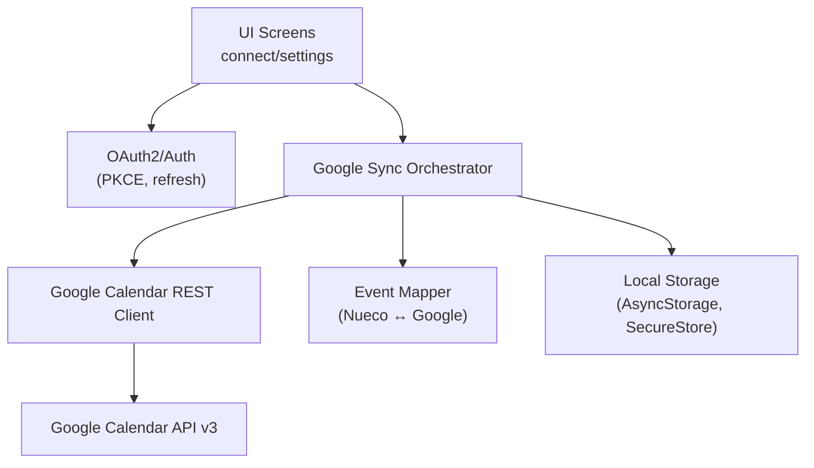
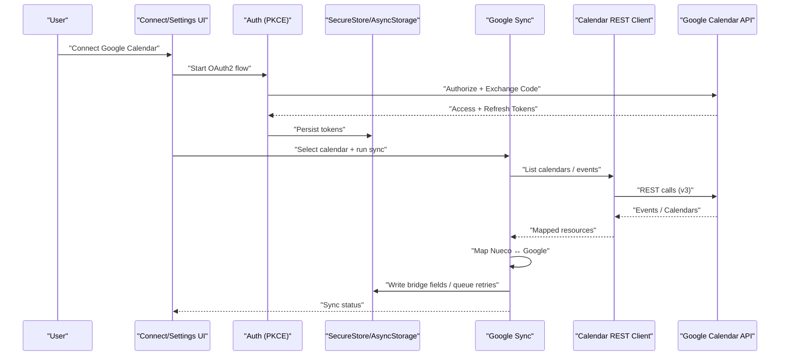
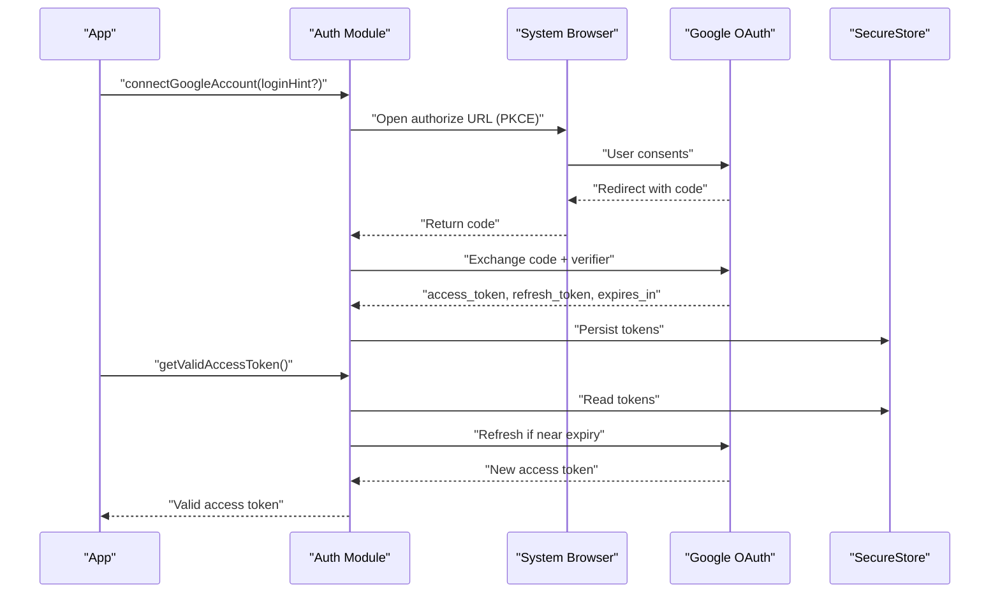
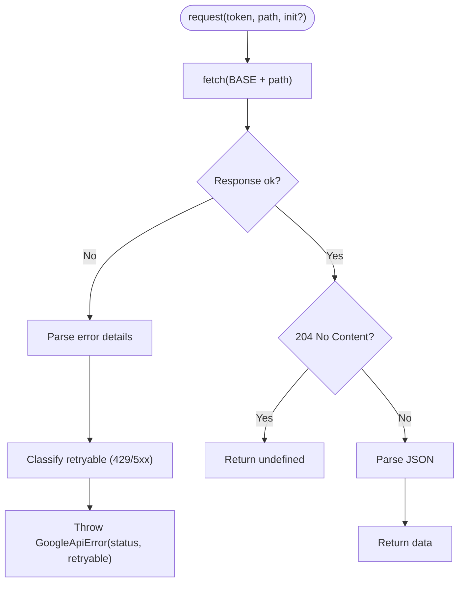
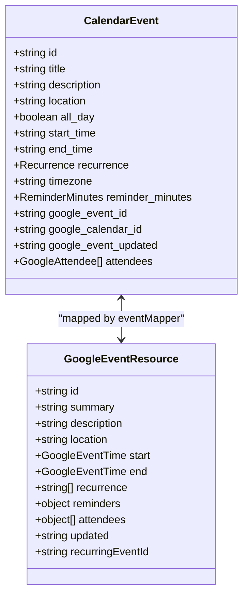
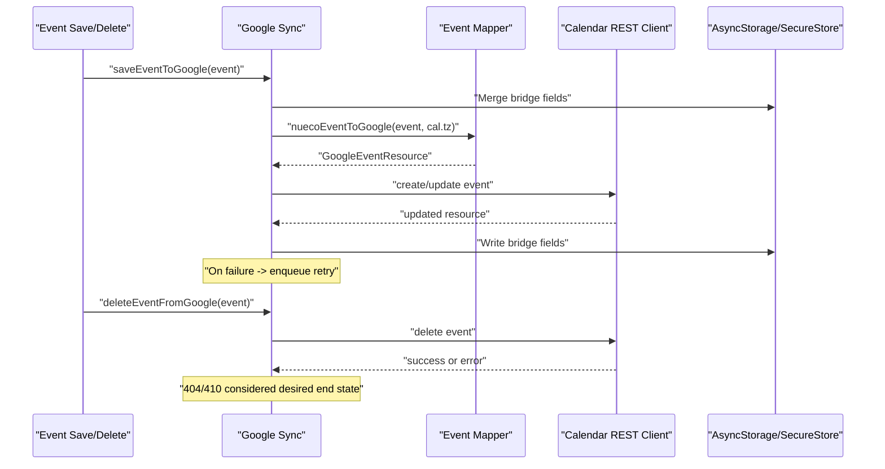
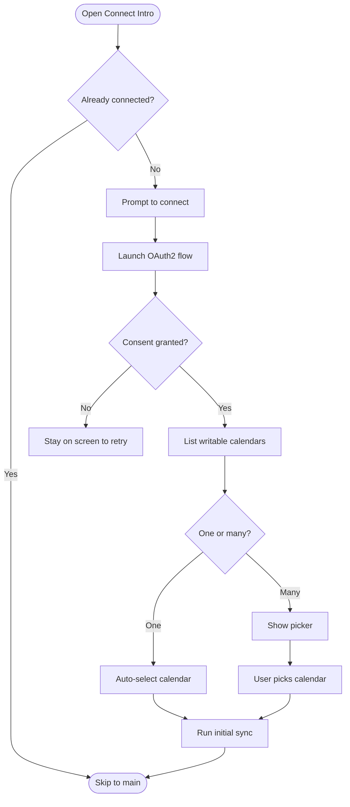
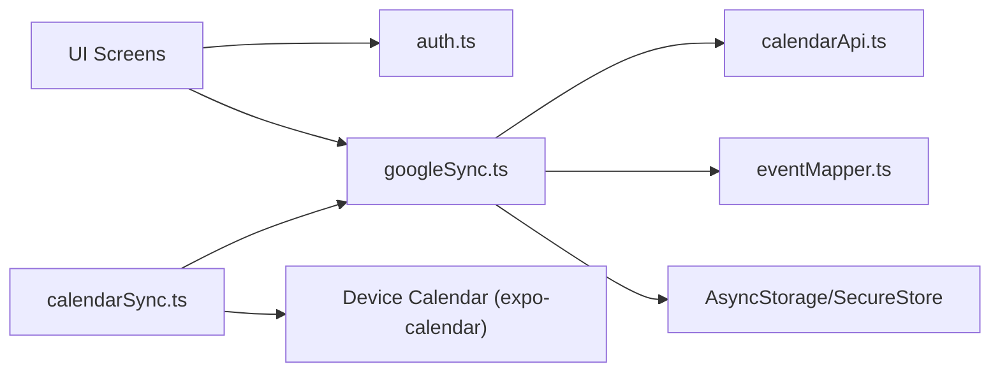

# Google Calendar Integration

<cite>
**Referenced Files in This Document**
- [auth.ts](file://src/google/auth.ts)
- [calendarApi.ts](file://src/google/calendarApi.ts)
- [eventMapper.ts](file://src/google/eventMapper.ts)
- [googleSync.ts](file://src/google/googleSync.ts)
- [calendarSync.ts](file://src/calendarSync.ts)
- [types.ts](file://src/types.ts)
- [google-connect-intro.tsx](file://app/google-connect-intro.tsx)
- [oauth2redirect.tsx](file://app/oauth2redirect.tsx)
- [google-calendar-settings.tsx](file://app/google-calendar-settings.tsx)
- [eventMapper.test.ts](file://src/google/eventMapper.test.ts)
</cite>

## Table of Contents
1. [Introduction](#introduction)
2. [Project Structure](#project-structure)
3. [Core Components](#core-components)
4. [Architecture Overview](#architecture-overview)
5. [Detailed Component Analysis](#detailed-component-analysis)
6. [Dependency Analysis](#dependency-analysis)
7. [Performance Considerations](#performance-considerations)
8. [Troubleshooting Guide](#troubleshooting-guide)
9. [Conclusion](#conclusion)
10. [Appendices](#appendices)

## Introduction
This document explains the client-side integration with Google Calendar that keeps Nueco events and one selected Google calendar synchronized two-way. The design intentionally keeps OAuth tokens and API calls on-device; the Nueco backend never handles Google credentials or raw Google payloads. The flow uses PKCE-based OAuth2, a thin REST wrapper over Google Calendar v3, pure mapping between Nueco’s event model and Google’s event resource, and a robust sync engine with throttling, locking, retry queues, and conservative deletion policies.

## Project Structure
The integration spans UI screens, authentication, API access, mapping, and synchronization:

- Authentication and token management: `src/google/auth.ts`
- Google Calendar REST client: `src/google/calendarApi.ts`
- Event mapping (Nueco ↔ Google): `src/google/eventMapper.ts`
- Two-way sync orchestration: `src/google/googleSync.ts`
- Unified calendar sync entrypoint (device vs Google): `src/calendarSync.ts`
- Data models used by mapping and sync: `src/types.ts`
- User flows for connecting and managing sync: `app/google-connect-intro.tsx`, `app/google-calendar-settings.tsx`, `app/oauth2redirect.tsx`
- Tests validating mapping logic: `src/google/eventMapper.test.ts`

**Diagram sources**
- [google-connect-intro.tsx:60-82](file://app/google-connect-intro.tsx#L60-L82)
- [google-calendar-settings.tsx:61-101](file://app/google-calendar-settings.tsx#L61-L101)
- [auth.ts:106-178](file://src/google/auth.ts#L106-L178)
- [calendarApi.ts:20-52](file://src/google/calendarApi.ts#L20-L52)
- [eventMapper.ts:113-147](file://src/google/eventMapper.ts#L113-L147)
- [googleSync.ts:254-372](file://src/google/googleSync.ts#L254-L372)

**Section sources**
- [auth.ts:1-242](file://src/google/auth.ts#L1-L242)
- [calendarApi.ts:1-147](file://src/google/calendarApi.ts#L1-L147)
- [eventMapper.ts:1-290](file://src/google/eventMapper.ts#L1-L290)
- [googleSync.ts:1-388](file://src/google/googleSync.ts#L1-L388)
- [calendarSync.ts:1-199](file://src/calendarSync.ts#L1-L199)
- [types.ts:61-95](file://src/types.ts#L61-L95)
- [google-connect-intro.tsx:1-176](file://app/google-connect-intro.tsx#L1-L176)
- [oauth2redirect.tsx:1-13](file://app/oauth2redirect.tsx#L1-L13)
- [google-calendar-settings.tsx:1-270](file://app/google-calendar-settings.tsx#L1-L270)
- [eventMapper.test.ts:1-149](file://src/google/eventMapper.test.ts#L1-L149)

## Core Components
- OAuth2 and token lifecycle: PKCE authorization code flow, secure storage, silent refresh, and disconnect/revoke.
- Google Calendar REST client: paginated listing, CRUD operations, error classification (retryable vs not).
- Event mapper: pure functions to convert between Nueco’s CalendarEvent and Google’s event resource, including RRULE handling and timezone rules.
- Sync orchestrator: outbound push/delete with retry queue, inbound pull with last-write-wins conflict resolution, conservative deletion, throttling, and locking.
- Unified entrypoint: chooses Google sync when active, otherwise falls back to device calendar import.

**Section sources**
- [auth.ts:45-86](file://src/google/auth.ts#L45-L86)
- [calendarApi.ts:54-147](file://src/google/calendarApi.ts#L54-L147)
- [eventMapper.ts:78-147](file://src/google/eventMapper.ts#L78-L147)
- [googleSync.ts:86-238](file://src/google/googleSync.ts#L86-L238)
- [calendarSync.ts:102-115](file://src/calendarSync.ts#L102-L115)

## Architecture Overview
The system performs two-way sync between Nueco and one selected Google calendar directly from the device using the user’s OAuth token.

**Diagram sources**
- [google-connect-intro.tsx:60-82](file://app/google-connect-intro.tsx#L60-L82)
- [auth.ts:106-178](file://src/google/auth.ts#L106-L178)
- [calendarApi.ts:63-110](file://src/google/calendarApi.ts#L63-L110)
- [googleSync.ts:254-372](file://src/google/googleSync.ts#L254-L372)

## Detailed Component Analysis

### OAuth2 Authentication Flow and Token Management
- Uses PKCE with an authorization code flow via expo-auth-session. Redirects use a native scheme registered in the app.
- Scopes include read/write for events and readonly for calendar metadata, plus openid/email for account display.
- Tokens are stored securely in SecureStore. A valid access token is returned with automatic refresh before expiry.
- Disconnect revokes the grant server-side (best-effort) and clears local tokens.

**Diagram sources**
- [auth.ts:106-178](file://src/google/auth.ts#L106-L178)
- [auth.ts:185-219](file://src/google/auth.ts#L185-L219)
- [auth.ts:226-242](file://src/google/auth.ts#L226-L242)

**Section sources**
- [auth.ts:27-43](file://src/google/auth.ts#L27-L43)
- [auth.ts:106-178](file://src/google/auth.ts#L106-L178)
- [auth.ts:185-219](file://src/google/auth.ts#L185-L219)
- [auth.ts:226-242](file://src/google/auth.ts#L226-L242)

### Google Calendar API Client Implementation
- Thin REST wrapper around Google Calendar v3 with Authorization header and JSON bodies.
- Paginates calendar list and events, filters writable calendars for two-way sync.
- Provides list, create, update, delete for events. Errors are wrapped with status and retryability flags.

**Diagram sources**
- [calendarApi.ts:20-52](file://src/google/calendarApi.ts#L20-L52)

**Section sources**
- [calendarApi.ts:20-52](file://src/google/calendarApi.ts#L20-L52)
- [calendarApi.ts:63-110](file://src/google/calendarApi.ts#L63-L110)
- [calendarApi.ts:112-147](file://src/google/calendarApi.ts#L112-L147)

### Event Mapping Between Nueco and Google
- Pure mapping functions ensure no fabrication: unsupported RRULE features degrade gracefully to a single occurrence with a note appended to description.
- Timezone handling: timed events carry dateTime and timeZone; all-day events use date-only fields. When event has no timezone, calendar timezone is used as fallback.
- Recurrence conversion: supports daily/weekly/monthly/yearly with BYDAY and UNTIL; INTERVAL/COUNT/EXDATE/RDATE/BYMONTHDAY/BYSETPOS/BYMONTH/BYHOUR/BYMINUTE are treated as unsupported and cause degradation.
- Attendees mirrored read-only; reminders snapped to allowed offsets.

**Diagram sources**
- [types.ts:61-95](file://src/types.ts#L61-L95)
- [eventMapper.ts:32-54](file://src/google/eventMapper.ts#L32-L54)

**Section sources**
- [eventMapper.ts:78-147](file://src/google/eventMapper.ts#L78-L147)
- [eventMapper.ts:160-222](file://src/google/eventMapper.ts#L160-L222)
- [eventMapper.ts:247-290](file://src/google/eventMapper.ts#L247-L290)
- [eventMapper.test.ts:41-149](file://src/google/eventMapper.test.ts#L41-L149)

### Two-Way Synchronization, Conflict Resolution, and Change Tracking
- Outbound: save/delete operations map to Google via the REST client; failures enqueue for retry at next sync run. Bridge fields (google_event_id, google_calendar_id, google_event_updated) are persisted to keep updates aligned.
- Inbound: fetch master events (no instance expansion) within a time window; match by google_event_id; apply updates only when Google’s updated timestamp is newer than last seen (last-write-wins); mirror deletions conservatively when events fall within the fetched window.
- Throttling and locking prevent concurrent runs; selection changes guard destructive actions.

**Diagram sources**
- [googleSync.ts:161-238](file://src/google/googleSync.ts#L161-L238)

**Section sources**
- [googleSync.ts:127-238](file://src/google/googleSync.ts#L127-L238)
- [googleSync.ts:254-372](file://src/google/googleSync.ts#L254-L372)

### Account Connection Workflows
- Onboarding screen prompts to connect; optionally pre-fills login hint for Gmail accounts.
- After consent, lists writable calendars; auto-selects if only one exists, otherwise shows picker.
- Settings screen allows connect/disconnect, calendar selection, manual sync, and displays last synced time.

**Diagram sources**
- [google-connect-intro.tsx:60-82](file://app/google-connect-intro.tsx#L60-L82)
- [google-calendar-settings.tsx:61-101](file://app/google-calendar-settings.tsx#L61-L101)

**Section sources**
- [google-connect-intro.tsx:1-176](file://app/google-connect-intro.tsx#L1-L176)
- [google-calendar-settings.tsx:1-270](file://app/google-calendar-settings.tsx#L1-L270)
- [oauth2redirect.tsx:1-13](file://app/oauth2redirect.tsx#L1-L13)

## Dependency Analysis
- UI depends on auth and sync modules to drive connection and sync flows.
- Sync depends on auth for tokens, calendarApi for network calls, eventMapper for transformations, and offline/local storage for persistence and retry queues.
- Unified calendar sync delegates to Google sync when active; otherwise reads device calendars.

**Diagram sources**
- [calendarSync.ts:102-115](file://src/calendarSync.ts#L102-L115)
- [googleSync.ts:24-43](file://src/google/googleSync.ts#L24-L43)
- [auth.ts:22-25](file://src/google/auth.ts#L22-L25)

**Section sources**
- [calendarSync.ts:1-199](file://src/calendarSync.ts#L1-L199)
- [googleSync.ts:1-388](file://src/google/googleSync.ts#L1-L388)

## Performance Considerations
- Pagination: calendar list and events are fetched page-by-page to avoid large payloads.
- Time windowing: inbound sync limits to a past/future window to reduce load.
- Throttling and locking: prevents frequent re-runs and concurrent execution.
- Last-write-wins: avoids unnecessary writes by comparing timestamps.
- Degrading unsupported RRULE: ensures stable behavior without complex parsing overhead.

[No sources needed since this section provides general guidance]

## Troubleshooting Guide
- Authentication issues:
  - Missing client ID: connect is disabled; ensure build-time configuration includes the Google Android client ID.
  - No refresh token: reconnect to obtain one; without it, the connection expires quickly.
  - Revoked/expired tokens: getValidAccessToken clears tokens on refresh failure; prompt reconnect.
- API errors:
  - Network errors: transient; queued for retry.
  - Rate limiting (429) and server errors (5xx): marked retryable; retried on next sync run.
  - Permission errors (403/404): non-retryable; drop failed items and inform user.
- Sync issues:
  - Selection changed: conservative deletion guarded by selection checks.
  - Partial reads: sync aborts if full collection cannot be read to avoid duplicates.
  - Deletions: only mirrored when within fetched window and fetch completed successfully.

**Section sources**
- [auth.ts:58-67](file://src/google/auth.ts#L58-L67)
- [auth.ts:171-178](file://src/google/auth.ts#L171-L178)
- [auth.ts:185-219](file://src/google/auth.ts#L185-L219)
- [calendarApi.ts:39-52](file://src/google/calendarApi.ts#L39-L52)
- [googleSync.ts:254-372](file://src/google/googleSync.ts#L254-L372)

## Conclusion
The integration implements a secure, client-side two-way sync between Nueco and a selected Google calendar. It emphasizes safety (conservative deletions), correctness (pure mapping with graceful degradation), and resilience (throttling, locking, retry queues, and last-write-wins conflict resolution). The architecture keeps credentials and API calls off the server, aligning with privacy goals while providing a smooth user experience for connecting, selecting calendars, and syncing events.

[No sources needed since this section summarizes without analyzing specific files]

## Appendices

### Common Integration Patterns
- Connect once, select one calendar, then rely on background sync; trigger manual sync from settings when needed.
- Use login hints during OAuth to streamline consent for Gmail accounts.
- Monitor last synced time in settings to confirm sync health.

**Section sources**
- [google-connect-intro.tsx:60-82](file://app/google-connect-intro.tsx#L60-L82)
- [google-calendar-settings.tsx:61-101](file://app/google-calendar-settings.tsx#L61-L101)

### Optimizing API Usage
- Prefer fetching master events (singleEvents=false) to handle recurrences efficiently.
- Keep time windows reasonable to limit payload sizes.
- Leverage pagination and throttle intervals to avoid excessive requests.

**Section sources**
- [calendarApi.ts:85-110](file://src/google/calendarApi.ts#L85-L110)
- [googleSync.ts:51-55](file://src/google/googleSync.ts#L51-L55)