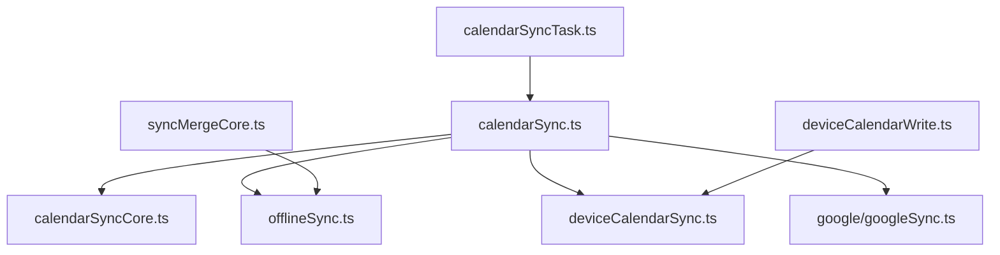
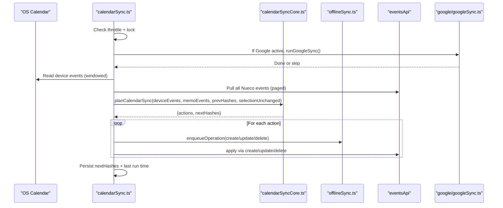
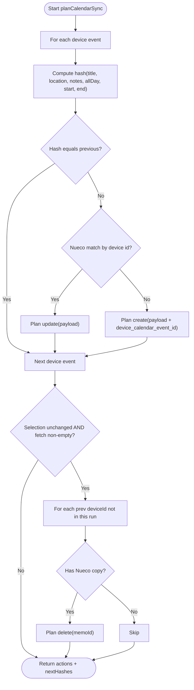
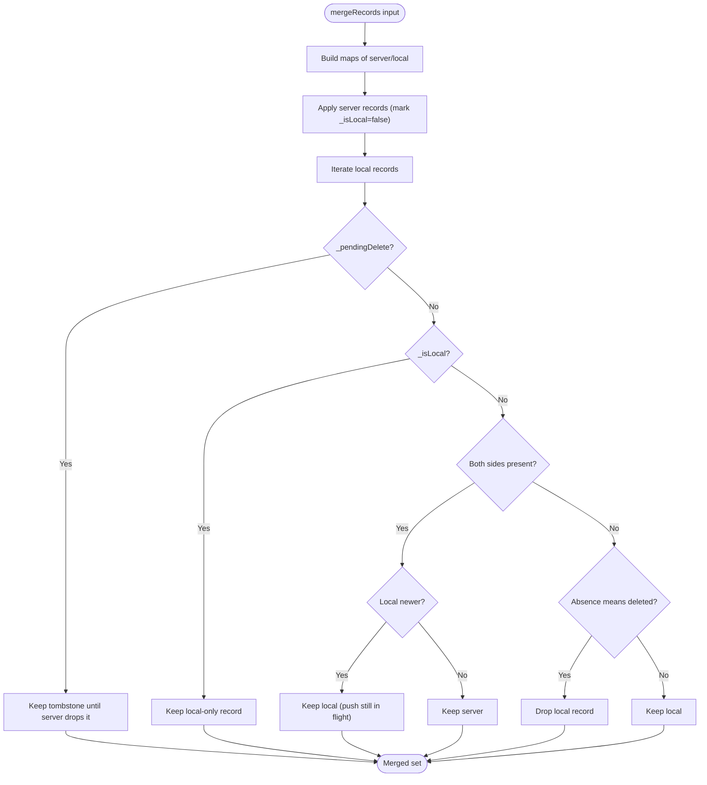
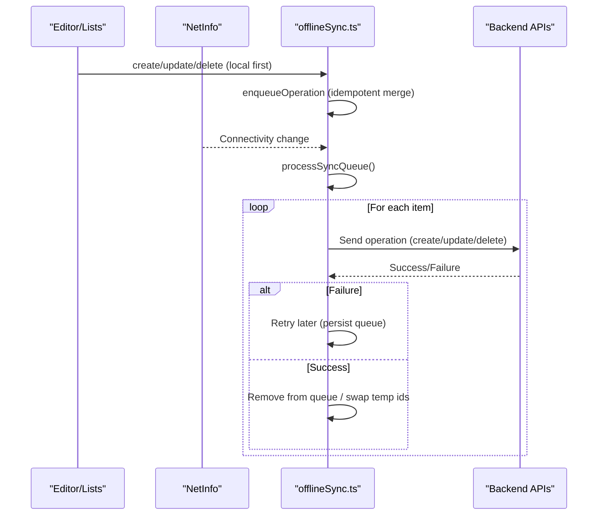
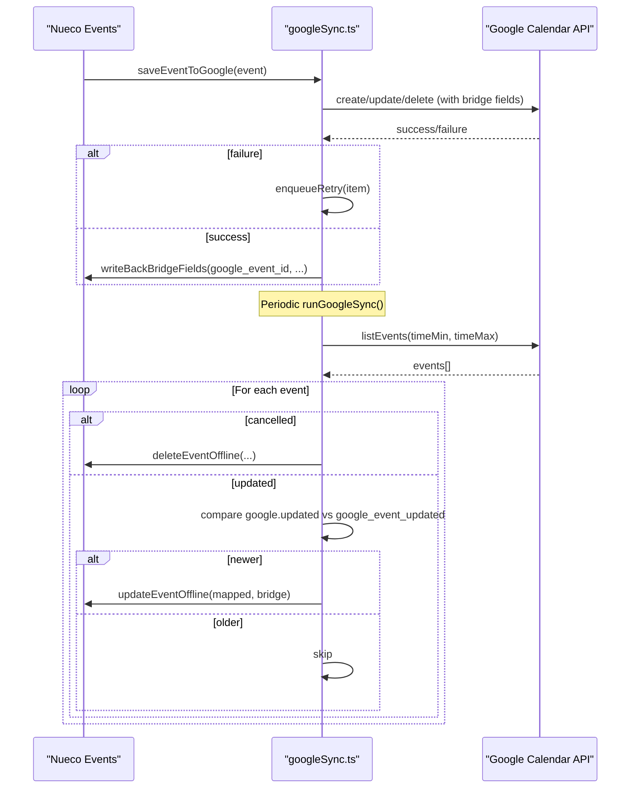
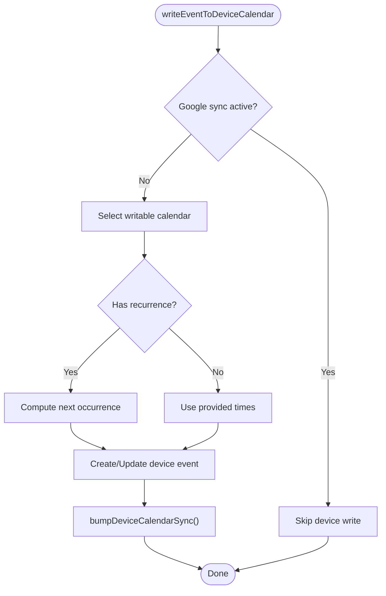
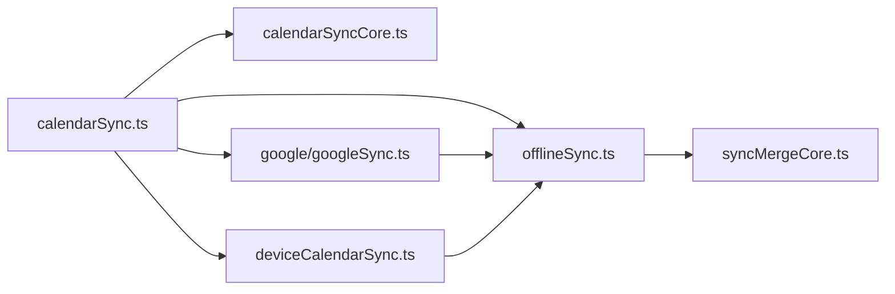

# Synchronization Algorithms

<cite>
**Referenced Files in This Document**
- [calendarSync.ts](file://src/calendarSync.ts)
- [calendarSyncCore.ts](file://src/calendarSyncCore.ts)
- [syncMergeCore.ts](file://src/syncMergeCore.ts)
- [offlineSync.ts](file://src/offlineSync.ts)
- [google/googleSync.ts](file://src/google/googleSync.ts)
- [deviceCalendarSync.ts](file://src/deviceCalendarSync.ts)
- [deviceCalendarWrite.ts](file://src/deviceCalendarWrite.ts)
- [calendarSyncTask.ts](file://src/calendarSyncTask.ts)
</cite>

## Table of Contents
1. [Introduction](#introduction)
2. [Project Structure](#project-structure)
3. [Core Components](#core-components)
4. [Architecture Overview](#architecture-overview)
5. [Detailed Component Analysis](#detailed-component-analysis)
6. [Dependency Analysis](#dependency-analysis)
7. [Performance Considerations](#performance-considerations)
8. [Troubleshooting Guide](#troubleshooting-guide)
9. [Conclusion](#conclusion)
10. [Appendices](#appendices)

## Introduction
This document explains the calendar synchronization algorithms and conflict resolution strategies implemented in the application. It covers:
- The sync planning algorithm that determines create, update, and delete actions based on device calendar changes and existing Nueco events.
- Conflict detection mechanisms that identify when local and remote events have diverged.
- Resolution strategies used to merge changes intelligently.
- Offline-first architecture that queues sync operations and applies them when connectivity is restored.
- Idempotent operations, transaction safety, and rollback-like behavior.
- Edge cases such as concurrent modifications, network failures, and partial sync completion.
- Examples of complex sync scenarios, debugging techniques, and monitoring sync health metrics.

## Project Structure
The calendar sync system spans several modules:
- Calendar sync orchestration and throttling/locking
- Pure decision logic for device-to-Nueco sync planning
- General-purpose reconciliation for server vs. local data
- Offline-first queueing and background processing
- Google Calendar two-way bridge
- Device calendar read/write helpers and recurring event refresh

**Diagram sources**
- [calendarSync.ts:102-199](file://src/calendarSync.ts#L102-L199)
- [calendarSyncCore.ts:87-148](file://src/calendarSyncCore.ts#L87-L148)
- [offlineSync.ts:388-800](file://src/offlineSync.ts#L388-L800)
- [deviceCalendarSync.ts:17-96](file://src/deviceCalendarSync.ts#L17-L96)
- [google/googleSync.ts:254-372](file://src/google/googleSync.ts#L254-L372)
- [deviceCalendarWrite.ts:68-145](file://src/deviceCalendarWrite.ts#L68-L145)
- [calendarSyncTask.ts:26-52](file://src/calendarSyncTask.ts#L26-L52)
- [syncMergeCore.ts:76-140](file://src/syncMergeCore.ts#L76-L140)

**Section sources**
- [calendarSync.ts:1-199](file://src/calendarSync.ts#L1-L199)
- [calendarSyncCore.ts:1-149](file://src/calendarSyncCore.ts#L1-L149)
- [syncMergeCore.ts:1-140](file://src/syncMergeCore.ts#L1-L140)
- [offlineSync.ts:1-800](file://src/offlineSync.ts#L1-L800)
- [google/googleSync.ts:1-388](file://src/google/googleSync.ts#L1-L388)
- [deviceCalendarSync.ts:1-96](file://src/deviceCalendarSync.ts#L1-L96)
- [deviceCalendarWrite.ts:1-145](file://src/deviceCalendarWrite.ts#L1-L145)
- [calendarSyncTask.ts:1-52](file://src/calendarSyncTask.ts#L1-L52)

## Core Components
- Sync planner (device calendar to Nueco): computes create/update/delete actions using hashes and selection checks.
- Reconciliation engine: merges server and local records with newest-wins semantics and safe absence handling.
- Offline queue: durable, file-backed queue for create/update/delete operations with retry and idempotency.
- Google Calendar bridge: two-way sync with last-write-wins policy and conservative deletion.
- Device calendar integration: write/read helpers, recurring entry refresh, and OS-level sync nudges.

**Section sources**
- [calendarSyncCore.ts:87-148](file://src/calendarSyncCore.ts#L87-L148)
- [syncMergeCore.ts:76-140](file://src/syncMergeCore.ts#L76-L140)
- [offlineSync.ts:388-800](file://src/offlineSync.ts#L388-L800)
- [google/googleSync.ts:254-372](file://src/google/googleSync.ts#L254-L372)
- [deviceCalendarSync.ts:17-96](file://src/deviceCalendarSync.ts#L17-L96)

## Architecture Overview
The system supports two primary sync paths:
- Device calendar sync: reads from the OS calendar and mirrors changes into Nueco.
- Google Calendar sync: two-way bridge between Nueco and a selected Google calendar.

Both paths are throttled and locked to avoid overlapping runs. They rely on offline-first persistence and a robust reconciliation strategy to handle conflicts and partial pulls safely.

**Diagram sources**
- [calendarSync.ts:102-199](file://src/calendarSync.ts#L102-L199)
- [calendarSyncCore.ts:87-148](file://src/calendarSyncCore.ts#L87-L148)
- [google/googleSync.ts:254-372](file://src/google/googleSync.ts#L254-L372)
- [offlineSync.ts:388-800](file://src/offlineSync.ts#L388-L800)

## Detailed Component Analysis

### Sync Planning Algorithm (Device Calendar → Nueco)
- Hash-based change detection: Each device event is hashed by title, location, notes, all-day flag, and normalized start/end times. Unchanged events are skipped.
- Matching: Existing Nueco events are keyed by device_calendar_event_id to determine updates vs. creates.
- Deletion safety: Deletes only occur if:
  - Calendar selection has not changed since last run, and
  - The current fetch returned at least one event (guard against transient empty reads).
- All-day date handling: Uses UTC midnight dates to avoid timezone/DST shifts.

**Diagram sources**
- [calendarSyncCore.ts:87-148](file://src/calendarSyncCore.ts#L87-L148)

**Section sources**
- [calendarSyncCore.ts:33-64](file://src/calendarSyncCore.ts#L33-L64)
- [calendarSyncCore.ts:72-78](file://src/calendarSyncCore.ts#L72-L78)
- [calendarSyncCore.ts:87-148](file://src/calendarSyncCore.ts#L87-L148)

### Conflict Detection and Resolution (Server vs. Local)
- Timestamp-based comparison: Uses updated_at when available; falls back to created_at for legacy records.
- Newest-wins rule: When both sides have a record, the newer timestamp wins.
- Local-only survival: Records never seen by the server survive even if absent from an incomplete pull.
- Pending deletes: Tombstones prevent re-import while a delete is in flight; cleared once server confirms absence.
- Safe absence: Absence means deletion only when the pull is complete and the record was not edited after the pull started.

**Diagram sources**
- [syncMergeCore.ts:76-140](file://src/syncMergeCore.ts#L76-L140)

**Section sources**
- [syncMergeCore.ts:17-34](file://src/syncMergeCore.ts#L17-L34)
- [syncMergeCore.ts:40-46](file://src/syncMergeCore.ts#L40-L46)
- [syncMergeCore.ts:76-140](file://src/syncMergeCore.ts#L76-L140)

### Offline-First Queue and Background Processing
- File-backed storage: Large collections and queue are persisted to JSON files to avoid AsyncStorage limits.
- In-memory caching: Reads are cached per process to reduce I/O during frequent access.
- Queue merging: EnqueueOperation merges conflicting ops for the same entity/id (e.g., delete cancels pending create).
- ProcessSyncQueue: Executes queued operations with retries and error handling; background listeners trigger on connectivity changes.
- Throttling and locking: Full syncs are throttled to avoid redundant work; locks prevent overlapping runs across foreground/background contexts.

**Diagram sources**
- [offlineSync.ts:388-800](file://src/offlineSync.ts#L388-L800)

**Section sources**
- [offlineSync.ts:122-193](file://src/offlineSync.ts#L122-L193)
- [offlineSync.ts:365-415](file://src/offlineSync.ts#L365-L415)
- [offlineSync.ts:785-800](file://src/offlineSync.ts#L785-L800)

### Google Calendar Two-Way Bridge
- Outbound: Save/delete Nueco events to Google; failures enqueue for retry; bridge fields (google_event_id, google_calendar_id, google_event_updated) are maintained locally.
- Inbound: Pulls events within a window, maps to Nueco, applies updates only when Google’s updated timestamp is newer than last seen; conservatively mirrors deletions for events within the window.
- Conflict policy: Last-write-wins on the Google side; inbound applies only when newer.

**Diagram sources**
- [google/googleSync.ts:205-238](file://src/google/googleSync.ts#L205-L238)
- [google/googleSync.ts:254-372](file://src/google/googleSync.ts#L254-L372)

**Section sources**
- [google/googleSync.ts:1-23](file://src/google/googleSync.ts#L1-L23)
- [google/googleSync.ts:134-183](file://src/google/googleSync.ts#L134-L183)
- [google/googleSync.ts:254-372](file://src/google/googleSync.ts#L254-L372)

### Device Calendar Integration and Recurring Refresh
- Write path: Creates or updates device calendar entries; skips when Google sync is active to avoid duplicates; handles recurrence by writing the upcoming occurrence.
- Read path: Reads device events within a window; bumps account sync on Android to refresh OS-side caches before reading.
- Recurring refresh: On app foreground, updates device calendar entries for recurring events to their next occurrence; best-effort and resilient to errors.

**Diagram sources**
- [deviceCalendarWrite.ts:68-145](file://src/deviceCalendarWrite.ts#L68-L145)
- [deviceCalendarSync.ts:17-30](file://src/deviceCalendarSync.ts#L17-L30)

**Section sources**
- [deviceCalendarWrite.ts:24-48](file://src/deviceCalendarWrite.ts#L24-L48)
- [deviceCalendarWrite.ts:68-145](file://src/deviceCalendarWrite.ts#L68-L145)
- [deviceCalendarSync.ts:17-96](file://src/deviceCalendarSync.ts#L17-L96)

### Background Task Registration
- Registers a platform background task to periodically invoke runCalendarSync when the app is not in the foreground.
- Intended as a bonus layer; foreground sync remains the reliable source of truth.

**Section sources**
- [calendarSyncTask.ts:1-52](file://src/calendarSyncTask.ts#L1-L52)

## Dependency Analysis
- calendarSync.ts depends on:
  - calendarSyncCore.ts for pure planning logic
  - offlineSync.ts for delete operations and queueing
  - deviceCalendarSync.ts for OS-level sync nudges
  - google/googleSync.ts for two-way bridge when active
- offlineSync.ts depends on:
  - syncMergeCore.ts for reconciliation rules
  - api modules for network calls
- google/googleSync.ts depends on:
  - offlineSync.ts for creating/updating/deleting Nueco events
  - calendarApi for Google API calls
- deviceCalendarWrite.ts and deviceCalendarSync.ts coordinate with OS calendar APIs and each other.

**Diagram sources**
- [calendarSync.ts:102-199](file://src/calendarSync.ts#L102-L199)
- [offlineSync.ts:388-800](file://src/offlineSync.ts#L388-L800)
- [google/googleSync.ts:254-372](file://src/google/googleSync.ts#L254-L372)
- [deviceCalendarSync.ts:17-96](file://src/deviceCalendarSync.ts#L17-L96)
- [syncMergeCore.ts:76-140](file://src/syncMergeCore.ts#L76-L140)

**Section sources**
- [calendarSync.ts:102-199](file://src/calendarSync.ts#L102-L199)
- [offlineSync.ts:388-800](file://src/offlineSync.ts#L388-L800)
- [google/googleSync.ts:254-372](file://src/google/googleSync.ts#L254-L372)
- [deviceCalendarSync.ts:17-96](file://src/deviceCalendarSync.ts#L17-L96)
- [syncMergeCore.ts:76-140](file://src/syncMergeCore.ts#L76-L140)

## Performance Considerations
- Throttling: Both device and Google sync enforce a minimum interval between runs to reduce load.
- Locking: Storage-based locks prevent overlapping runs across foreground and background contexts.
- Paged pulls: Reading the entire Nueco collection ensures accurate matching and avoids duplication; partial reads abort the run to prevent inconsistent state.
- File-backed storage: Avoids AsyncStorage row-size limits and reduces jank from large payloads.
- In-memory caches: Minimize repeated parsing of large JSON files during a session.

[No sources needed since this section provides general guidance]

## Troubleshooting Guide
Common issues and diagnostics:
- Duplicate imports: Ensure Google sync is active only when intended; device sync is bypassed when Google sync is active.
- Missing deletions: Verify selection unchanged check and non-empty fetch guard; confirm hashes are persisted correctly.
- Partial sync failures: If paged pull is incomplete, the run aborts; retry on next run.
- Network failures: Operations remain queued; background sync will retry; inspect retry queues and logs.
- Concurrent edits: Newest-wins reconciliation prevents silent revert of local edits; pending deletes use tombstones to avoid resurrection.
- Timezone/DST edge cases: All-day events use date-only fields; verify start_time/end_time do not include time components.

Debugging steps:
- Inspect stored keys for sync state (enabled flag, calendar IDs, hashes, last run timestamps, locks).
- Review console logs around sync runs, action application, and queue processing.
- Validate Google bridge fields on events (google_event_id, google_calendar_id, google_event_updated).
- Confirm device calendar permissions and writable calendars.

**Section sources**
- [calendarSync.ts:31-45](file://src/calendarSync.ts#L31-L45)
- [calendarSync.ts:102-199](file://src/calendarSync.ts#L102-L199)
- [google/googleSync.ts:254-372](file://src/google/googleSync.ts#L254-L372)
- [offlineSync.ts:388-800](file://src/offlineSync.ts#L388-L800)

## Conclusion
The synchronization system combines robust planning, safe reconciliation, and offline-first queuing to keep device calendars, Google Calendar, and Nueco events consistent. It emphasizes conservative deletions, idempotent operations, and resilience to network and concurrency issues. By leveraging throttling, locking, and careful absence handling, it minimizes data loss and duplication while maintaining performance and reliability.

[No sources needed since this section summarizes without analyzing specific files]

## Appendices

### Idempotency and Transaction Safety
- Idempotent enqueue: Duplicate operations for the same entity/id are merged; deletes cancel pending creates.
- Atomic-ish writes: Local collections are written in full; mutex protects note writes to avoid interleaving mutations.
- Rollback-like behavior: Failed actions preserve prior hashes or queue items so they can be retried; tombstones ensure pending deletes are respected until confirmed.

**Section sources**
- [offlineSync.ts:388-415](file://src/offlineSync.ts#L388-L415)
- [offlineSync.ts:235-244](file://src/offlineSync.ts#L235-L244)
- [syncMergeCore.ts:76-140](file://src/syncMergeCore.ts#L76-L140)

### Complex Sync Scenarios
- Event moved across calendars: Device sync detects disappearance from old calendar and creation in new; deletes old Nueco copy only under safety conditions.
- Recurring series edited mid-cycle: Device sync updates the mapped Nueco event; device calendar refresh updates the next occurrence; Google sync applies updates when newer.
- Offline edits then reconnect: Local edits survive pulls if newer; queue flushes pending operations; reconciliation preserves local wins until server acknowledges.

[No sources needed since this section provides conceptual examples]

### Monitoring Sync Health Metrics
- Track last run timestamps and lock states to detect stuck runs.
- Monitor queue length and retry counts to identify persistent failures.
- Observe throttle intervals and lock TTLs to tune responsiveness vs. resource usage.
- Log counts of create/update/delete actions per run to validate expected deltas.

[No sources needed since this section provides general guidance]