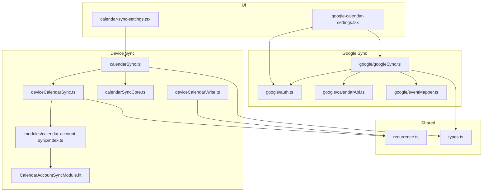
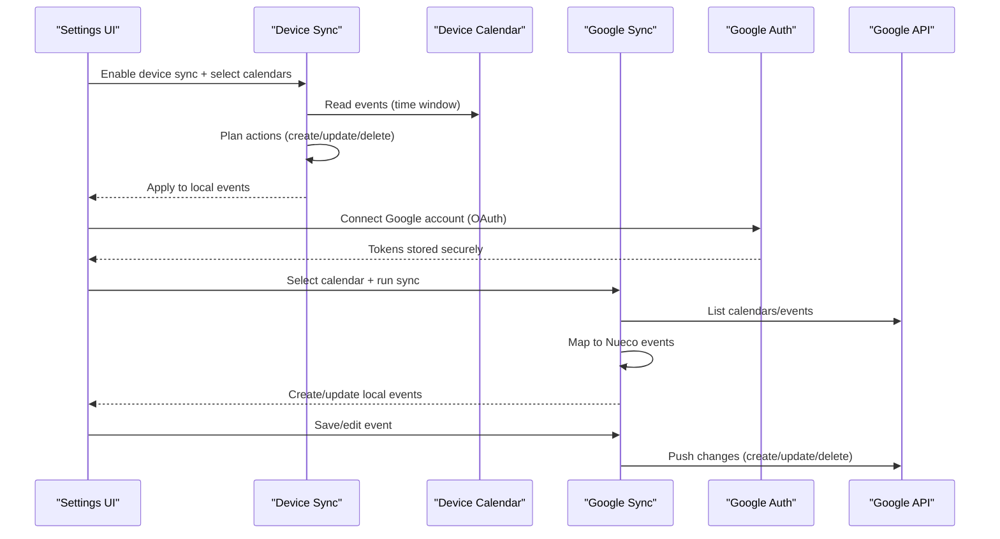
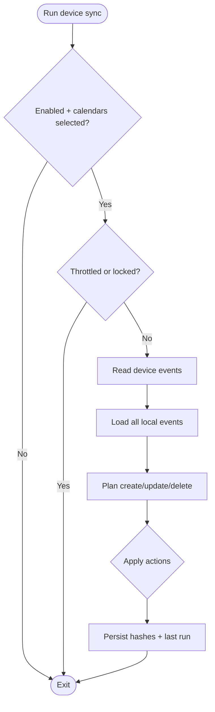
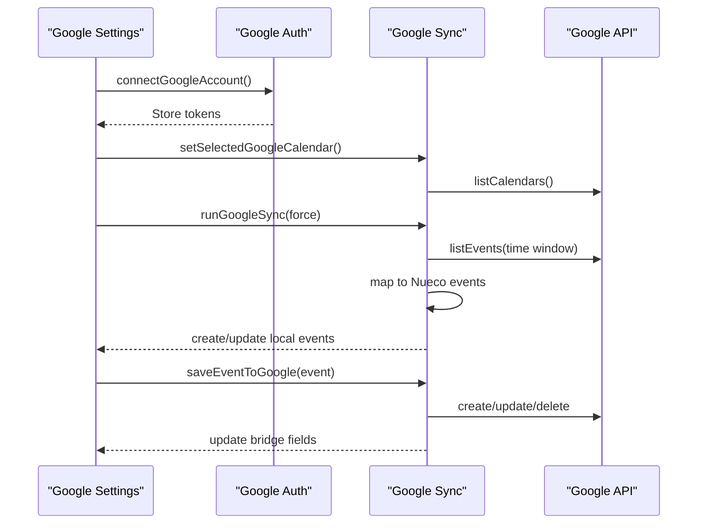
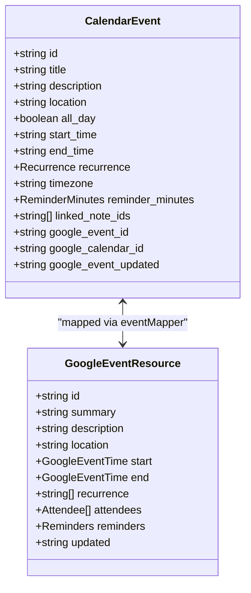
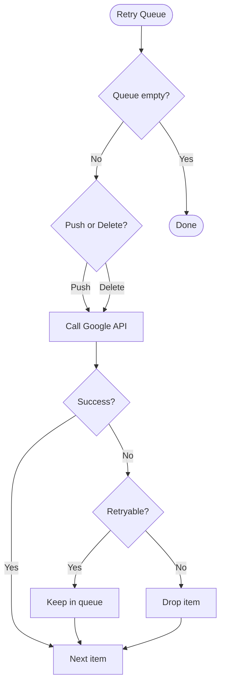
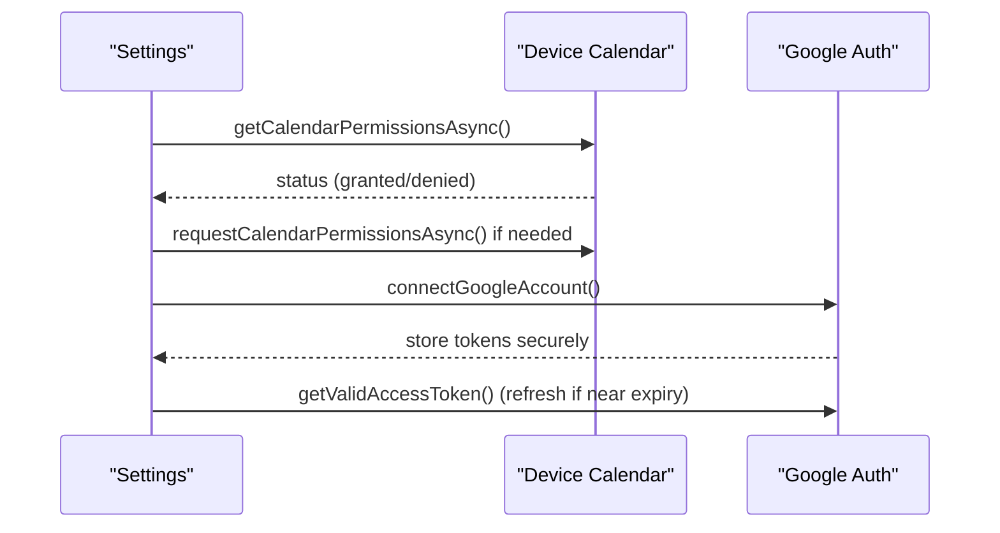
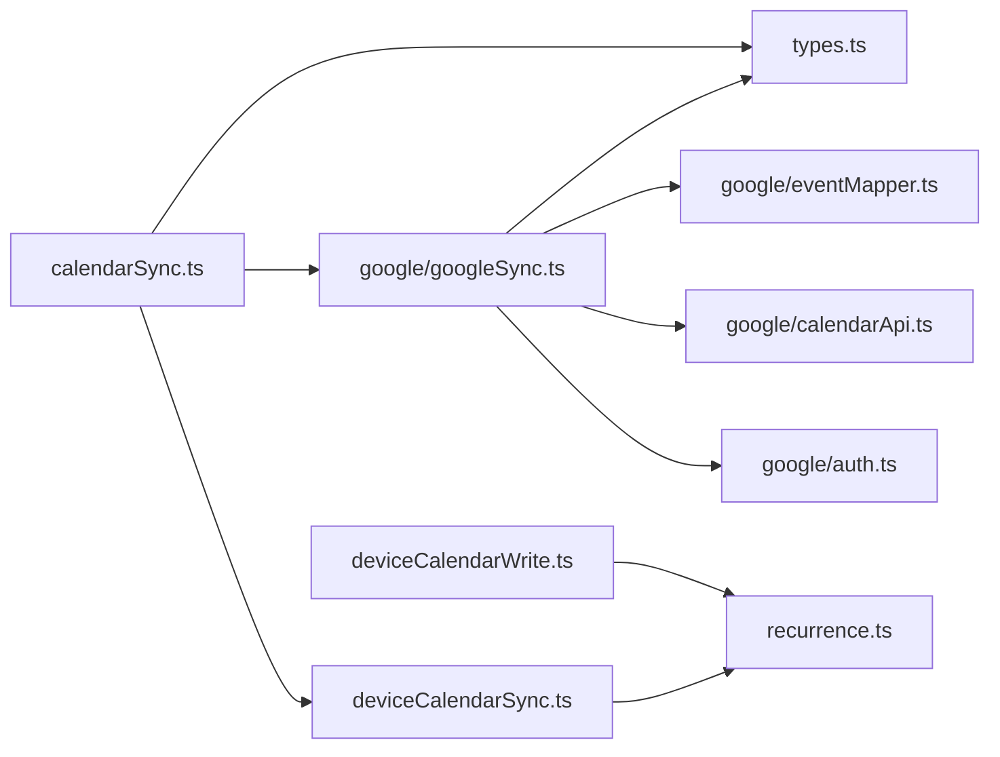

# Calendar Integration

<cite>
**Referenced Files in This Document**
- [calendarSync.ts](file://src/calendarSync.ts)
- [calendarSyncCore.ts](file://src/calendarSyncCore.ts)
- [deviceCalendarSync.ts](file://src/deviceCalendarSync.ts)
- [deviceCalendarWrite.ts](file://src/deviceCalendarWrite.ts)
- [google/auth.ts](file://src/google/auth.ts)
- [google/calendarApi.ts](file://src/google/calendarApi.ts)
- [google/eventMapper.ts](file://src/google/eventMapper.ts)
- [google/googleSync.ts](file://src/google/googleSync.ts)
- [recurrence.ts](file://src/recurrence.ts)
- [types.ts](file://src/types.ts)
- [calendar-sync-settings.tsx](file://app/calendar-sync-settings.tsx)
- [google-calendar-settings.tsx](file://app/google-calendar-settings.tsx)
- [modules/calendar-account-sync/index.ts](file://modules/calendar-account-sync/index.ts)
- [modules/calendar-account-sync/android/src/main/java/expo/modules/calendaraccountsync/CalendarAccountSyncModule.kt](file://modules/calendar-account-sync/android/src/main/java/expo/modules/calendaraccountsync/CalendarAccountSyncModule.kt)
</cite>

## Table of Contents
1. [Introduction](#introduction)
2. [Project Structure](#project-structure)
3. [Core Components](#core-components)
4. [Architecture Overview](#architecture-overview)
5. [Detailed Component Analysis](#detailed-component-analysis)
6. [Dependency Analysis](#dependency-analysis)
7. [Performance Considerations](#performance-considerations)
8. [Troubleshooting Guide](#troubleshooting-guide)
9. [Conclusion](#conclusion)
10. [Appendices](#appendices)

## Introduction
This document explains the calendar integration system that provides bidirectional synchronization between the app’s events and:
- Device calendars (Apple, Google, Outlook/Exchange as exposed by the OS)
- A selected Google Calendar via direct client-side API calls

It covers account setup, permissions, sync configuration, event mapping (including recurrence and timezones), conflict detection and resolution, background sync mechanisms, error handling, retry logic, and practical workflows such as linking notes to events and creating events from voice recordings.

## Project Structure
The calendar integration spans UI screens, core sync logic, device calendar access, and Google-specific modules:
- UI for enabling and configuring sync flows
- Core orchestration for device calendar sync and Google sync
- Native bridge for Android account sync nudges
- Mapping utilities for recurrence rules and timezone handling
- Types shared across components

**Diagram sources**
- [calendar-sync-settings.tsx:1-224](file://app/calendar-sync-settings.tsx#L1-L224)
- [google-calendar-settings.tsx:1-270](file://app/google-calendar-settings.tsx#L1-L270)
- [calendarSync.ts:1-199](file://src/calendarSync.ts#L1-L199)
- [calendarSyncCore.ts:1-149](file://src/calendarSyncCore.ts#L1-L149)
- [deviceCalendarSync.ts:1-96](file://src/deviceCalendarSync.ts#L1-L96)
- [deviceCalendarWrite.ts:1-145](file://src/deviceCalendarWrite.ts#L1-L145)
- [modules/calendar-account-sync/index.ts:1-16](file://modules/calendar-account-sync/index.ts#L1-L16)
- [modules/calendar-account-sync/android/src/main/java/expo/modules/calendaraccountsync/CalendarAccountSyncModule.kt:1-31](file://modules/calendar-account-sync/android/src/main/java/expo/modules/calendaraccountsync/CalendarAccountSyncModule.kt#L1-L31)
- [google/auth.ts:1-242](file://src/google/auth.ts#L1-L242)
- [google/calendarApi.ts:1-147](file://src/google/calendarApi.ts#L1-L147)
- [google/eventMapper.ts:1-290](file://src/google/eventMapper.ts#L1-L290)
- [google/googleSync.ts:1-388](file://src/google/googleSync.ts#L1-L388)
- [recurrence.ts:1-276](file://src/recurrence.ts#L1-L276)
- [types.ts:1-125](file://src/types.ts#L1-L125)

**Section sources**
- [calendarSync.ts:1-199](file://src/calendarSync.ts#L1-L199)
- [google/googleSync.ts:1-388](file://src/google/googleSync.ts#L1-L388)
- [calendar-sync-settings.tsx:1-224](file://app/calendar-sync-settings.tsx#L1-L224)
- [google-calendar-settings.tsx:1-270](file://app/google-calendar-settings.tsx#L1-L270)

## Core Components
- Device calendar sync: pulls new/changed/deleted events from selected device calendars into the app; writes back recurring next occurrences and nudges Android account sync.
- Google Calendar sync: two-way sync with a single selected Google calendar using OAuth tokens stored on-device; last-write-wins policy based on Google’s updated timestamp.
- Event mapping: converts between Nueco events and Google Calendar resources, including RRULE support and degradation when unsupported features are encountered.
- Recurrence helpers: compute next occurrence and day coverage for display and device updates.
- Permissions and accounts: request device calendar permissions; manage Google OAuth flow and token refresh.

**Section sources**
- [calendarSync.ts:1-199](file://src/calendarSync.ts#L1-L199)
- [google/googleSync.ts:1-388](file://src/google/googleSync.ts#L1-L388)
- [google/eventMapper.ts:1-290](file://src/google/eventMapper.ts#L1-L290)
- [recurrence.ts:1-276](file://src/recurrence.ts#L1-L276)
- [deviceCalendarSync.ts:1-96](file://src/deviceCalendarSync.ts#L1-L96)
- [deviceCalendarWrite.ts:1-145](file://src/deviceCalendarWrite.ts#L1-L145)
- [google/auth.ts:1-242](file://src/google/auth.ts#L1-L242)

## Architecture Overview
The system supports two parallel paths:
- Device path: reads from OS calendars, plans create/update/delete actions, applies them to local events, and persists hashes to detect changes.
- Google path: authenticates directly with Google, lists calendars/events, maps to Nueco model, applies changes, and pushes local edits back to Google.

**Diagram sources**
- [calendarSync.ts:102-199](file://src/calendarSync.ts#L102-L199)
- [google/googleSync.ts:254-372](file://src/google/googleSync.ts#L254-L372)
- [google/auth.ts:106-178](file://src/google/auth.ts#L106-L178)
- [google/calendarApi.ts:63-147](file://src/google/calendarApi.ts#L63-L147)

## Detailed Component Analysis

### Device Calendar Sync
- Orchestration: throttled runs, lock-based concurrency control, selection change safety checks, and conservative deletion only when safe.
- Data flow: fetch device events within a past/future window, load all local events, plan actions, apply create/update/delete, persist hashes and last-run metadata.
- Recurring entries: periodically refresh device calendar entries to point at the next occurrence; best-effort updates per event.

**Diagram sources**
- [calendarSync.ts:102-199](file://src/calendarSync.ts#L102-L199)
- [calendarSyncCore.ts:87-149](file://src/calendarSyncCore.ts#L87-L149)

**Section sources**
- [calendarSync.ts:1-199](file://src/calendarSync.ts#L1-L199)
- [calendarSyncCore.ts:1-149](file://src/calendarSyncCore.ts#L1-L149)
- [deviceCalendarSync.ts:1-96](file://src/deviceCalendarSync.ts#L1-L96)

### Google Calendar Sync
- Authentication: PKCE-based OAuth flow with refresh token handling; tokens stored securely; automatic refresh before expiry.
- Two-way sync: inbound pulls master events (recurring series as one item) and mirrors deletions conservatively; outbound pushes create/update/delete with retry queue.
- Conflict policy: last-write-wins on Google side; inbound applies only when Google’s updated is newer than last seen.

**Diagram sources**
- [google/auth.ts:106-178](file://src/google/auth.ts#L106-L178)
- [google/googleSync.ts:205-238](file://src/google/googleSync.ts#L205-L238)
- [google/googleSync.ts:254-372](file://src/google/googleSync.ts#L254-L372)
- [google/calendarApi.ts:63-147](file://src/google/calendarApi.ts#L63-L147)

**Section sources**
- [google/auth.ts:1-242](file://src/google/auth.ts#L1-242)
- [google/googleSync.ts:1-388](file://src/google/googleSync.ts#L1-L388)
- [google/calendarApi.ts:1-147](file://src/google/calendarApi.ts#L1-L147)

### Event Mapping and Recurrence
- Nueco to Google: builds RRULE strings for supported frequencies; handles all-day vs timed events; sets reminders and attendees read-only.
- Google to Nueco: parses RRULEs, degrades unsupported features into a single occurrence with a note appended to description; snaps reminders to allowed values.
- Timezone handling: uses calendar timezone for timed events; all-day dates handled as date-only to avoid timezone shifts.

**Diagram sources**
- [types.ts:61-86](file://src/types.ts#L61-L86)
- [google/eventMapper.ts:26-54](file://src/google/eventMapper.ts#L26-L54)
- [google/eventMapper.ts:113-147](file://src/google/eventMapper.ts#L113-L147)
- [google/eventMapper.ts:247-289](file://src/google/eventMapper.ts#L247-L289)

**Section sources**
- [google/eventMapper.ts:1-290](file://src/google/eventMapper.ts#L1-L290)
- [recurrence.ts:1-276](file://src/recurrence.ts#L1-L276)
- [types.ts:1-125](file://src/types.ts#L1-L125)

### Background Sync and Retry Logic
- Device sync: throttles to every 15 minutes unless forced; uses storage-based lock to prevent concurrent runs; retries failed actions by preserving hashes.
- Google sync: flushes persistent retry queue at start of each run; enqueues push/delete operations on transient errors; drops non-retryable failures.

**Diagram sources**
- [google/googleSync.ts:88-125](file://src/google/googleSync.ts#L88-L125)

**Section sources**
- [calendarSync.ts:102-199](file://src/calendarSync.ts#L102-L199)
- [google/googleSync.ts:88-125](file://src/google/googleSync.ts#L88-L125)

### Permissions and Account Setup
- Device calendar permissions: requested before reading/writing; if not granted, UI prompts user to enable in settings.
- Google OAuth: interactive sign-in with PKCE; tokens stored securely; silent refresh; disconnect revokes grant and clears local state.

**Diagram sources**
- [calendarSync.ts:77-86](file://src/calendarSync.ts#L77-L86)
- [deviceCalendarWrite.ts:24-48](file://src/deviceCalendarWrite.ts#L24-L48)
- [google/auth.ts:106-178](file://src/google/auth.ts#L106-L178)
- [google/auth.ts:185-219](file://src/google/auth.ts#L185-L219)

**Section sources**
- [calendarSync.ts:77-86](file://src/calendarSync.ts#L77-L86)
- [deviceCalendarWrite.ts:24-48](file://src/deviceCalendarWrite.ts#L24-L48)
- [google/auth.ts:106-219](file://src/google/auth.ts#L106-L219)

### Practical Workflows

#### Linking Notes to Events
- When importing device events, linked_note_ids is initialized as an empty array; users can link notes later in the editor without affecting sync stability.
- For Google imports, linked_note_ids is also set to empty; subsequent linking remains independent of sync.

**Section sources**
- [calendarSyncCore.ts:120-130](file://src/calendarSyncCore.ts#L120-L130)
- [google/googleSync.ts:331-348](file://src/google/googleSync.ts#L331-L348)

#### Creating Events from Voice Recordings
- Voice extraction produces ExtractedEvent objects; after confirmation, events are created locally and then written to device calendar (if available) or pushed to Google (if connected).
- Device write prefers synced calendars on Android and respects iOS default calendar; recurring events write the next occurrence to device calendar.

**Section sources**
- [types.ts:104-114](file://src/types.ts#L104-L114)
- [deviceCalendarWrite.ts:68-145](file://src/deviceCalendarWrite.ts#L68-L145)
- [deviceCalendarSync.ts:44-96](file://src/deviceCalendarSync.ts#L44-L96)

#### Managing Calendar Permissions Across Platforms
- Android: requests calendar permissions; can nudge account sync adapter to expedite server sync.
- iOS: relies on EventKit; no explicit “sync now” hook; writes propagate promptly.
- Web: calendar features are stubbed; device calendar write/read returns empty/no-op.

**Section sources**
- [deviceCalendarWrite.ts:24-48](file://src/deviceCalendarWrite.ts#L24-L48)
- [deviceCalendarSync.ts:17-30](file://src/deviceCalendarSync.ts#L17-L30)
- [modules/calendar-account-sync/index.ts:1-16](file://modules/calendar-account-sync/index.ts#L1-L16)
- [modules/calendar-account-sync/android/src/main/java/expo/modules/calendaraccountsync/CalendarAccountSyncModule.kt:10-29](file://modules/calendar-account-sync/android/src/main/java/expo/modules/calendaraccountsync/CalendarAccountSyncModule.kt#L10-L29)

## Dependency Analysis
Key dependencies and coupling:
- calendarSync.ts depends on device calendar module, offline sync, encryption, and Google sync active check.
- google/googleSync.ts depends on auth, calendarApi, eventMapper, and offline sync.
- deviceCalendarWrite.ts depends on recurrence helpers and device calendar module.
- eventMapper.ts is pure logic with no platform dependencies.

**Diagram sources**
- [calendarSync.ts:17-24](file://src/calendarSync.ts#L17-L24)
- [google/googleSync.ts:24-42](file://src/google/googleSync.ts#L24-L42)
- [deviceCalendarWrite.ts:9-13](file://src/deviceCalendarWrite.ts#L9-L13)
- [deviceCalendarSync.ts:1-6](file://src/deviceCalendarSync.ts#L1-L6)

**Section sources**
- [calendarSync.ts:17-24](file://src/calendarSync.ts#L17-L24)
- [google/googleSync.ts:24-42](file://src/google/googleSync.ts#L24-L42)
- [deviceCalendarWrite.ts:9-13](file://src/deviceCalendarWrite.ts#L9-L13)
- [deviceCalendarSync.ts:1-6](file://src/deviceCalendarSync.ts#L1-L6)

## Performance Considerations
- Throttling: both device and Google sync throttle to once per 15 minutes unless forced; reduces redundant network/device calls.
- Locking: storage-based locks prevent overlapping runs across foreground/background contexts.
- Full collection reads: both sync paths require complete local event collections to avoid duplicates; partial reads abort the run safely.
- Best-effort updates: device calendar refresh and Android account sync nudges are non-blocking and swallow errors to avoid regressions.

[No sources needed since this section provides general guidance]

## Troubleshooting Guide
Common issues and resolutions:
- No device calendars found: ensure calendar permission is granted and OS settings allow access; re-enable sync toggle to reload calendars.
- Google connection fails: verify build has Google client ID configured; reconnect to obtain refresh token; disconnect and reconnect if token revoked.
- Sync not applying changes: check throttle window and lock; force sync from settings; review console logs for failed actions and retry queue.
- Recurring events stale on device: rely on periodic refresh; reopen event editor to trigger immediate update; ensure Google sync is not active (it owns the bridge).

**Section sources**
- [calendarSync.ts:102-199](file://src/calendarSync.ts#L102-L199)
- [google/googleSync.ts:254-372](file://src/google/googleSync.ts#L254-L372)
- [deviceCalendarSync.ts:44-96](file://src/deviceCalendarSync.ts#L44-L96)
- [google/auth.ts:185-219](file://src/google/auth.ts#L185-L219)

## Conclusion
The calendar integration provides robust, user-controlled synchronization between the app and device/Google calendars. It emphasizes safety (conservative deletions, full collection reads), reliability (retry queues, throttling, locking), and clarity (mapping degradation notes, last-write-wins policy). Users can opt into device calendar import or two-way Google sync, with clear UI controls and best-effort background behavior.

[No sources needed since this section summarizes without analyzing specific files]

## Appendices

### Sync Configuration Screens
- Device calendar sync: toggle auto-sync, select calendars, run sync now.
- Google Calendar sync: connect account, choose calendar, run sync now, disconnect.

**Section sources**
- [calendar-sync-settings.tsx:1-224](file://app/calendar-sync-settings.tsx#L1-L224)
- [google-calendar-settings.tsx:1-270](file://app/google-calendar-settings.tsx#L1-L270)