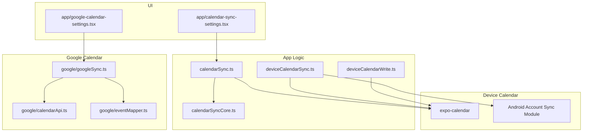
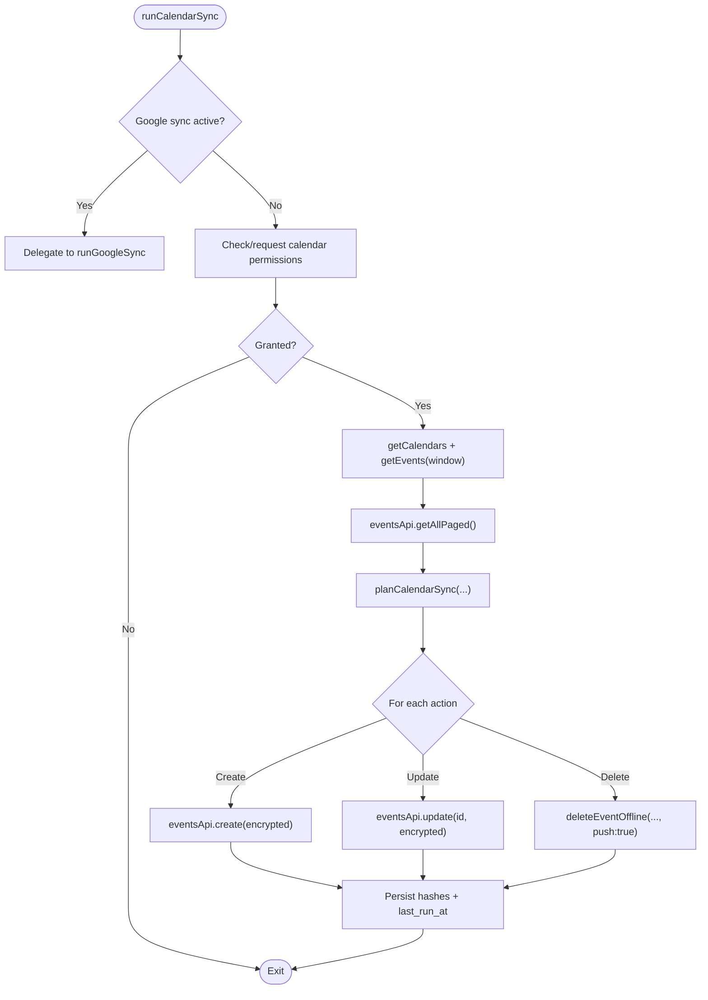
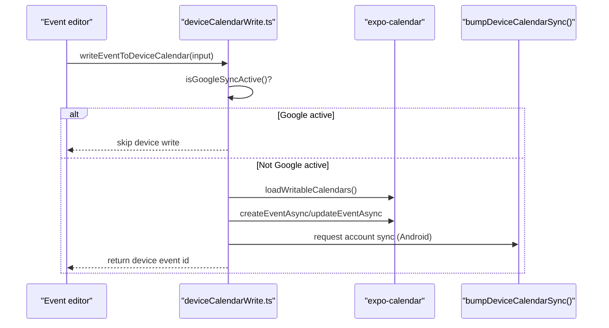
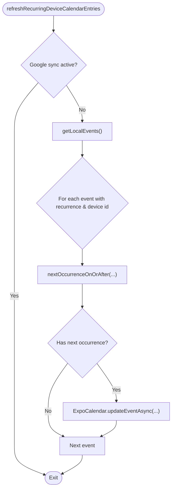
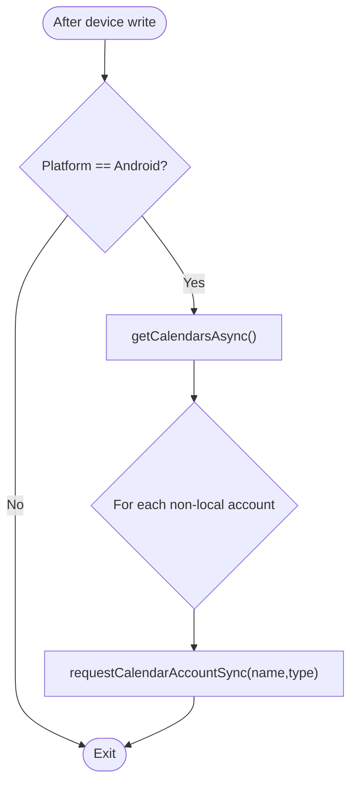
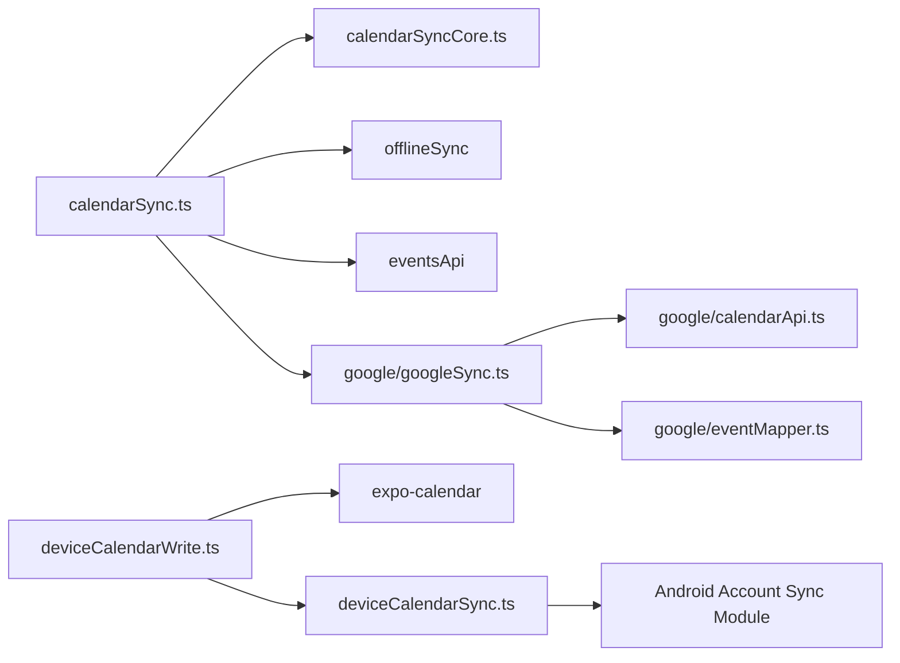

# Device Calendar Synchronization

<cite>
**Referenced Files in This Document**
- [calendarSync.ts](file://src/calendarSync.ts)
- [calendarSyncCore.ts](file://src/calendarSyncCore.ts)
- [deviceCalendarSync.ts](file://src/deviceCalendarSync.ts)
- [deviceCalendarWrite.ts](file://src/deviceCalendarWrite.ts)
- [google/googleSync.ts](file://src/google/googleSync.ts)
- [google/calendarApi.ts](file://src/google/calendarApi.ts)
- [google/eventMapper.ts](file://src/google/eventMapper.ts)
- [modules/calendar-account-sync/index.ts](file://modules/calendar-account-sync/index.ts)
- [modules/calendar-account-sync/android/src/main/java/expo/modules/calendaraccountsync/CalendarAccountSyncModule.kt](file://modules/calendar-account-sync/android/src/main/java/expo/modules/calendaraccountsync/CalendarAccountSyncModule.kt)
- [app/calendar-sync-settings.tsx](file://app/calendar-sync-settings.tsx)
- [app/google-calendar-settings.tsx](file://app/google-calendar-settings.tsx)
- [types.ts](file://src/types.ts)
</cite>

## Table of Contents
1. [Introduction](#introduction)
2. [Project Structure](#project-structure)
3. [Core Components](#core-components)
4. [Architecture Overview](#architecture-overview)
5. [Detailed Component Analysis](#detailed-component-analysis)
6. [Dependency Analysis](#dependency-analysis)
7. [Performance Considerations](#performance-considerations)
8. [Troubleshooting Guide](#troubleshooting-guide)
9. [Conclusion](#conclusion)

## Introduction
This document explains how the app synchronizes events with native device calendars (Apple Calendar, Google Calendar, Outlook/Exchange) and with a selected Google Calendar account. It covers:
- Permission handling for reading/writing device calendars on iOS and Android via expo-calendar
- Discovery and selection of device calendars
- Importing device calendar events into Nueco and exporting Nueco events to the device calendar
- Bidirectional sync algorithm that maps device events to Nueco events using the device_calendar_event_id field
- Conflict detection and safe deletion logic when device events disappear
- Google Calendar two-way sync path (direct REST API), including mapping and last-write-wins policy
- Practical setup steps and troubleshooting guidance

## Project Structure
The synchronization system is split across several modules:
- Device calendar read/write and periodic refresh
- Sync orchestration and throttling/locking
- Pure decision logic for create/update/delete planning
- Google Calendar integration (auth, API, mapping, sync)
- Native module to nudge Android account sync
- UI screens to enable sync, select calendars, and connect Google



**Diagram sources**
- [calendarSync.ts:102-199](file://src/calendarSync.ts#L102-L199)
- [calendarSyncCore.ts:87-148](file://src/calendarSyncCore.ts#L87-L148)
- [deviceCalendarSync.ts:17-95](file://src/deviceCalendarSync.ts#L17-L95)
- [deviceCalendarWrite.ts:24-144](file://src/deviceCalendarWrite.ts#L24-L144)
- [google/googleSync.ts:254-372](file://src/google/googleSync.ts#L254-L372)
- [google/calendarApi.ts:63-146](file://src/google/calendarApi.ts#L63-L146)
- [google/eventMapper.ts:113-147](file://src/google/eventMapper.ts#L113-L147)
- [app/calendar-sync-settings.tsx:18-76](file://app/calendar-sync-settings.tsx#L18-L76)
- [app/google-calendar-settings.tsx:28-121](file://app/google-calendar-settings.tsx#L28-L121)

**Section sources**
- [calendarSync.ts:102-199](file://src/calendarSync.ts#L102-L199)
- [calendarSyncCore.ts:87-148](file://src/calendarSyncCore.ts#L87-L148)
- [deviceCalendarSync.ts:17-95](file://src/deviceCalendarSync.ts#L17-L95)
- [deviceCalendarWrite.ts:24-144](file://src/deviceCalendarWrite.ts#L24-L144)
- [google/googleSync.ts:254-372](file://src/google/googleSync.ts#L254-L372)
- [google/calendarApi.ts:63-146](file://src/google/calendarApi.ts#L63-L146)
- [google/eventMapper.ts:113-147](file://src/google/eventMapper.ts#L113-L147)
- [app/calendar-sync-settings.tsx:18-76](file://app/calendar-sync-settings.tsx#L18-L76)
- [app/google-calendar-settings.tsx:28-121](file://app/google-calendar-settings.tsx#L28-L121)

## Core Components
- Device calendar import/export: reads from and writes to the OS calendar via expo-calendar; supports recurring events by updating the next occurrence and refreshing periodically.
- Sync planner: pure logic that decides whether to create, update, or delete Nueco events based on device events and previous state.
- Google Calendar bridge: direct REST calls to Google Calendar API with OAuth; maps between Nueco and Google event models; applies last-write-wins conflict resolution.
- Android account sync nudging: best-effort call to accelerate server-side propagation after writes.
- UI flows: enable/disable sync, select device calendars, connect/disconnect Google Calendar, and trigger immediate syncs.

Key data model fields used for mapping:
- device_calendar_event_id: links a Nueco event to its device calendar counterpart
- google_event_id / google_calendar_id / google_event_updated: link a Nueco event to a Google Calendar event and track last known update time

**Section sources**
- [types.ts:61-86](file://src/types.ts#L61-L86)
- [calendarSyncCore.ts:8-50](file://src/calendarSyncCore.ts#L8-L50)
- [google/eventMapper.ts:24-74](file://src/google/eventMapper.ts#L24-L74)

## Architecture Overview
Two parallel sync paths exist:
- Device calendar path: pulls from all device calendars the user selects; creates/updates/deletes Nueco events accordingly.
- Google Calendar path: when connected and a calendar is selected, this path takes over and talks directly to Google’s API; device calendar path is bypassed to avoid duplicates.

```mermaid
sequenceDiagram
participant UI as "Settings UI"
participant CS as "calendarSync.ts"
participant GC as "expo-calendar"
participant CORE as "calendarSyncCore.ts"
participant API as "eventsApi"
participant OFF as "offlineSync"
UI->>CS : runCalendarSync(force?)
alt Google sync active
CS->>CS : isGoogleSyncActive()
CS-->>UI : delegate to Google sync
else Device calendar sync
CS->>GC : getCalendarsAsync(), getEventsAsync(range)
CS->>API : getAllPaged()
CS->>CORE : planCalendarSync(deviceEvents, memoMap, hashes, selectionUnchanged)
loop actions
CS->>API : create/update
CS->>OFF : deleteEventOffline(...)
end
CS-->>UI : complete
end
```

**Diagram sources**
- [calendarSync.ts:102-199](file://src/calendarSync.ts#L102-L199)
- [calendarSyncCore.ts:87-148](file://src/calendarSyncCore.ts#L87-L148)

**Section sources**
- [calendarSync.ts:102-199](file://src/calendarSync.ts#L102-L199)
- [google/googleSync.ts:254-372](file://src/google/googleSync.ts#L254-L372)

## Detailed Component Analysis

### Device Calendar Import (Pull)
- Permissions: The flow checks and requests calendar permissions before reading calendars/events.
- Selection: Users choose which device calendars to sync; IDs are persisted.
- Throttling/Locking: Runs at most once per interval unless forced; uses storage-based lock to prevent concurrent runs across foreground/background contexts.
- Data fetch: Reads device events within a past/future window; fetches the entire Nueco event collection to avoid partial reads causing duplicates.
- Planning: Computes hashes of device events; compares with previous hashes; matches by device id to existing Nueco events; plans create/update/delete actions.
- Application: Applies actions via API/offline queue; persists new hashes and last-run timestamp.



**Diagram sources**
- [calendarSync.ts:102-199](file://src/calendarSync.ts#L102-L199)
- [calendarSyncCore.ts:87-148](file://src/calendarSyncCore.ts#L87-L148)

**Section sources**
- [calendarSync.ts:75-199](file://src/calendarSync.ts#L75-L199)
- [calendarSyncCore.ts:52-148](file://src/calendarSyncCore.ts#L52-L148)

### Device Calendar Export (Push)
- Writable calendars: Filters calendars that allow modifications; prefers synced accounts on Android; respects default calendar on iOS.
- Recurring events: Writes a one-off instance pointing to the next occurrence; later refreshed by periodic updates.
- Google override: When Google sync is active, writing to device calendar is skipped to avoid duplicates; outbound goes through Google API instead.
- Android acceleration: After write, triggers account sync to propagate changes faster.



**Diagram sources**
- [deviceCalendarWrite.ts:24-144](file://src/deviceCalendarWrite.ts#L24-L144)
- [deviceCalendarSync.ts:17-30](file://src/deviceCalendarSync.ts#L17-L30)

**Section sources**
- [deviceCalendarWrite.ts:24-144](file://src/deviceCalendarWrite.ts#L24-L144)
- [deviceCalendarSync.ts:17-30](file://src/deviceCalendarSync.ts#L17-L30)

### Recurring Event Refresh
- Purpose: Keeps device calendar entries for recurring events aligned with their next occurrence even when the editor isn’t open.
- Mechanism: On app foreground, iterates local events with recurrence and a device id; computes next occurrence and updates the device event’s start/end times.
- Safety: Best-effort; failures are swallowed per-event; skips if Google sync is active since it owns the bridge.



**Diagram sources**
- [deviceCalendarSync.ts:44-95](file://src/deviceCalendarSync.ts#L44-L95)

**Section sources**
- [deviceCalendarSync.ts:44-95](file://src/deviceCalendarSync.ts#L44-L95)

### Google Calendar Two-Way Sync
- Connection: Users connect a Google account and select a writable calendar.
- Outbound: Saves Nueco events to Google; updates bridge fields back to the local event; retries failed operations via a persistent queue.
- Inbound: Pulls master events (including cancelled ones) from Google; maps to Nueco; creates or updates based on google_event_updated timestamps (last-write-wins); mirrors deletions conservatively within the fetched window.
- Mapping: Converts Nueco recurrence to RRULE where possible; degrades unsupported features to single occurrences with notes; mirrors attendees read-only.

```mermaid
sequenceDiagram
participant UI as "Google Settings"
participant GS as "google/googleSync.ts"
participant GA as "google/calendarApi.ts"
participant EM as "google/eventMapper.ts"
participant OFF as "offlineSync"
UI->>GS : runGoogleSync(force?)
GS->>GA : listEvents(calendarId, timeMin, timeMax, showDeleted=true)
loop For each Google event
alt status == 'cancelled'
GS->>OFF : deleteEventOffline(localId, push : true)
else Normal event
GS->>EM : googleEventToNueco(g)
alt New event
GS->>OFF : createEventOffline(mapped, push : true)
else Existing event
GS->>OFF : updateEventOffline(localId, mapped+bridge, push : true)
end
end
end
Note over GS : Also flush retry queue and persist last_run_at
```

**Diagram sources**
- [google/googleSync.ts:254-372](file://src/google/googleSync.ts#L254-L372)
- [google/calendarApi.ts:85-146](file://src/google/calendarApi.ts#L85-L146)
- [google/eventMapper.ts:247-289](file://src/google/eventMapper.ts#L247-L289)

**Section sources**
- [google/googleSync.ts:254-372](file://src/google/googleSync.ts#L254-L372)
- [google/calendarApi.ts:63-146](file://src/google/calendarApi.ts#L63-L146)
- [google/eventMapper.ts:113-147](file://src/google/eventMapper.ts#L113-L147)
- [google/eventMapper.ts:247-289](file://src/google/eventMapper.ts#L247-L289)

### Android Account Sync Acceleration
- Purpose: Immediately notify Android’s account sync adapter to push recent changes to Google/Exchange servers rather than waiting for the OS schedule.
- Behavior: Best-effort; no-op on iOS/web; errors are swallowed so they never break save/delete flows.



**Diagram sources**
- [deviceCalendarSync.ts:17-30](file://src/deviceCalendarSync.ts#L17-L30)
- [modules/calendar-account-sync/index.ts:10-15](file://modules/calendar-account-sync/index.ts#L10-L15)
- [modules/calendar-account-sync/android/src/main/java/expo/modules/calendaraccountsync/CalendarAccountSyncModule.kt:18-28](file://modules/calendar-account-sync/android/src/main/java/expo/modules/calendaraccountsync/CalendarAccountSyncModule.kt#L18-L28)

**Section sources**
- [deviceCalendarSync.ts:17-30](file://src/deviceCalendarSync.ts#L17-L30)
- [modules/calendar-account-sync/index.ts:10-15](file://modules/calendar-account-sync/index.ts#L10-L15)
- [modules/calendar-account-sync/android/src/main/java/expo/modules/calendaraccountsync/CalendarAccountSyncModule.kt:18-28](file://modules/calendar-account-sync/android/src/main/java/expo/modules/calendaraccountsync/CalendarAccountSyncModule.kt#L18-L28)

## Dependency Analysis
- calendarSync.ts depends on:
  - expo-calendar for device calendar access
  - eventsApi for fetching/updating Nueco events
  - offlineSync for delete operations
  - calendarSyncCore for planning
  - google/googleSync for delegation when Google sync is active
- deviceCalendarWrite.ts depends on:
  - expo-calendar for creating/updating device events
  - deviceCalendarSync for Android sync acceleration
  - google/googleSync to avoid duplicate writes when Google sync is active
- google/googleSync.ts depends on:
  - google/calendarApi for REST calls
  - google/eventMapper for model conversion
  - offlineSync for applying changes locally with push
- UI screens depend on sync functions to present options and trigger runs.



**Diagram sources**
- [calendarSync.ts:102-199](file://src/calendarSync.ts#L102-L199)
- [deviceCalendarWrite.ts:24-144](file://src/deviceCalendarWrite.ts#L24-L144)
- [deviceCalendarSync.ts:17-95](file://src/deviceCalendarSync.ts#L17-L95)
- [google/googleSync.ts:254-372](file://src/google/googleSync.ts#L254-L372)

**Section sources**
- [calendarSync.ts:102-199](file://src/calendarSync.ts#L102-L199)
- [deviceCalendarWrite.ts:24-144](file://src/deviceCalendarWrite.ts#L24-L144)
- [deviceCalendarSync.ts:17-95](file://src/deviceCalendarSync.ts#L17-L95)
- [google/googleSync.ts:254-372](file://src/google/googleSync.ts#L254-L372)

## Performance Considerations
- Throttling: Both device and Google sync throttle to once every 15 minutes unless forced.
- Locking: Storage-based locks prevent overlapping runs across foreground/background contexts.
- Full collection reads: Before planning actions, both sync paths fetch the entire Nueco event set to avoid partial reads that could cause duplicates.
- Windowed device/Google reads: Only pull events within a past/future window to limit payload size.
- Best-effort operations: Recurring refresh and Android account sync nudges are best-effort and do not block primary flows.

[No sources needed since this section provides general guidance]

## Troubleshooting Guide
Common issues and resolutions:
- No calendars found: Ensure calendar permissions are granted; the settings screen will prompt if needed. If still empty, check device settings to add an account (e.g., Google/Outlook).
- Events not appearing in Nueco:
  - Verify sync is enabled and at least one calendar is selected.
  - Tap “Sync Now” to force a run.
  - Check that the full Nueco collection can be pulled; if not, the run is skipped until the next attempt.
- Duplicate events:
  - If Google Calendar sync is active, device calendar sync is bypassed to avoid duplicates. Ensure only one path is active.
  - Confirm you haven’t manually imported the same events multiple times.
- Deletions not mirrored:
  - Deletions require both conditions: unchanged calendar selection and a non-empty device event fetch. If either fails, deletions are deferred safely.
- Recurring events not advancing:
  - The app refreshes recurring entries on foreground; ensure the app is opened regularly. If Google sync is active, device entries are owned by Google sync and won’t be updated here.
- Android changes not reaching server quickly:
  - The app nudges Android’s account sync adapter after writes; if delayed, wait for the OS sync window or re-open the app.

**Section sources**
- [calendarSync.ts:75-199](file://src/calendarSync.ts#L75-L199)
- [calendarSyncCore.ts:87-148](file://src/calendarSyncCore.ts#L87-L148)
- [deviceCalendarSync.ts:44-95](file://src/deviceCalendarSync.ts#L44-L95)
- [deviceCalendarWrite.ts:24-144](file://src/deviceCalendarWrite.ts#L24-L144)
- [google/googleSync.ts:254-372](file://src/google/googleSync.ts#L254-L372)

## Conclusion
The app provides robust, safe synchronization between Nueco and device calendars, plus a dedicated two-way bridge to Google Calendar. It uses careful planning, throttling, locking, and conservative deletion policies to maintain consistency. The device calendar path integrates with Apple Calendar, Google Calendar, and Outlook/Exchange via the OS calendar layer, while the Google path operates directly against Google’s API with explicit conflict resolution. Users can enable sync, select calendars, and trigger immediate syncs from the UI, with background tasks providing additional freshness.

[No sources needed since this section summarizes without analyzing specific files]