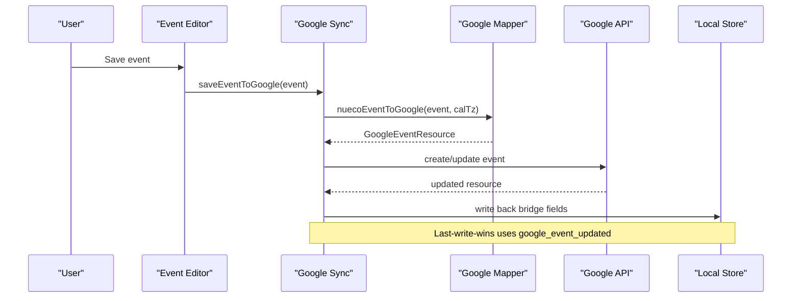
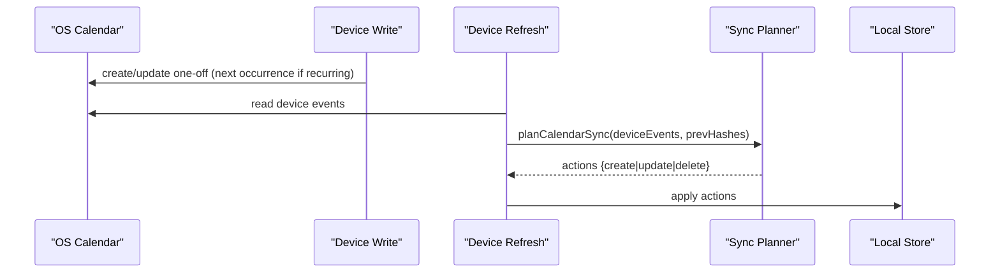
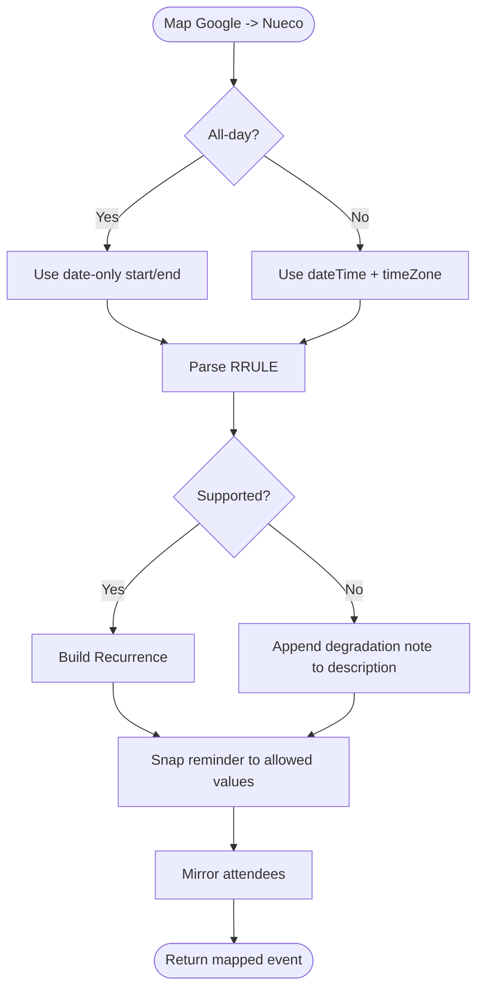
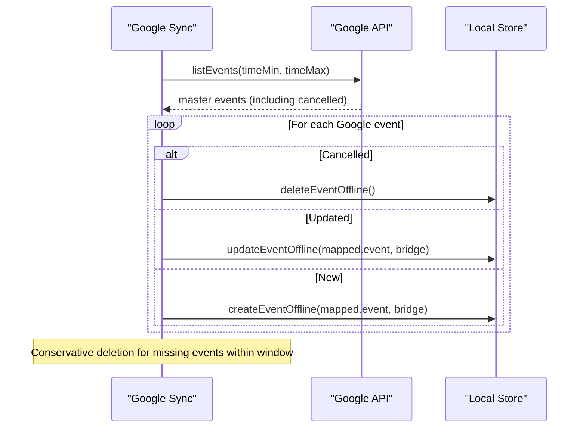
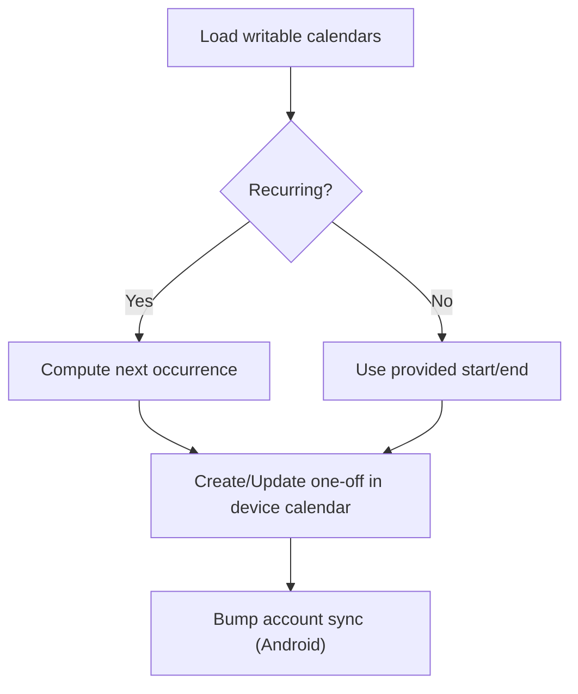
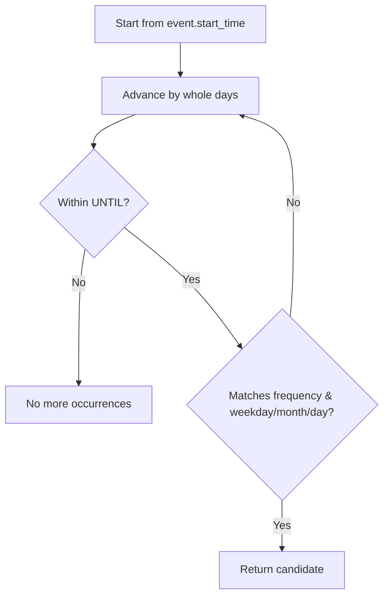
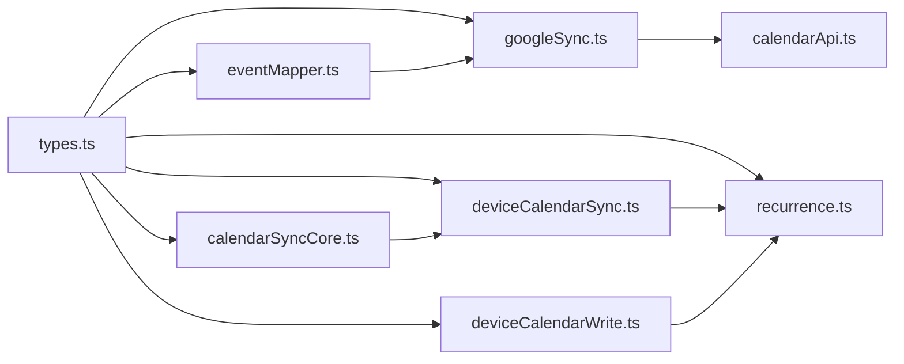

# Event Data Mapping

<cite>
**Referenced Files in This Document**
- [eventMapper.ts](file://src/google/eventMapper.ts)
- [calendarApi.ts](file://src/google/calendarApi.ts)
- [googleSync.ts](file://src/google/googleSync.ts)
- [deviceCalendarSync.ts](file://src/deviceCalendarSync.ts)
- [deviceCalendarWrite.ts](file://src/deviceCalendarWrite.ts)
- [calendarSyncCore.ts](file://src/calendarSyncCore.ts)
- [recurrence.ts](file://src/recurrence.ts)
- [textContent.ts](file://src/textContent.ts)
- [types.ts](file://src/types.ts)
</cite>

## Table of Contents
1. [Introduction](#introduction)
2. [Project Structure](#project-structure)
3. [Core Components](#core-components)
4. [Architecture Overview](#architecture-overview)
5. [Detailed Component Analysis](#detailed-component-analysis)
6. [Dependency Analysis](#dependency-analysis)
7. [Performance Considerations](#performance-considerations)
8. [Troubleshooting Guide](#troubleshooting-guide)
9. [Conclusion](#conclusion)

## Introduction
This document explains how Nueco maps event data between different calendar sources and its internal event model. It covers:
- Transformation logic for Google Calendar events, device (native) calendar events, and Nueco’s own events into a unified format.
- Handling of complex properties: recurrence rules, timezone handling, attendees, and text content normalization.
- Validation and sanitization to maintain data integrity during mapping.
- Practical edge cases such as recurring events with exceptions, multi-timezone spans, and rich content.

The goal is to make the mapping behavior predictable, safe, and consistent across platforms while preserving user intent.

## Project Structure
Nueco implements two parallel sync paths that converge on a unified internal event model:
- Google Calendar bridge: direct client-side API calls to Google Calendar with mapping to/from Nueco events.
- Device (native) calendar bridge: reads/writes to the OS calendar and plans local Nueco updates based on changes.

```mermaid
graph TB
subgraph "Google Bridge"
GAPI["Google Calendar API"]
GM["Google Mapper<br/>eventMapper.ts"]
GS["Google Sync Orchestrator<br/>googleSync.ts"]
end
subgraph "Device Bridge"
DCW["Device Write<br/>deviceCalendarWrite.ts"]
DCS["Device Refresh<br/>deviceCalendarSync.ts"]
CSC["Sync Planner<br/>calendarSyncCore.ts"]
end
subgraph "Core"
T["Types & Models<br/>types.ts"]
R["Recurrence Helpers<br/>recurrence.ts"]
TX["Text Normalization<br/>textContent.ts"]
end
GAPI < --> GS
GS < --> GM
DCW --> DCS
DCS --> CSC
GS --> T
DCS --> T
CSC --> T
GM --> T
R --> DCS
R --> DCW
TX --> GS
TX --> DCS
```

**Diagram sources**
- [googleSync.ts:161-183](file://src/google/googleSync.ts#L161-L183)
- [eventMapper.ts:113-147](file://src/google/eventMapper.ts#L113-L147)
- [deviceCalendarWrite.ts:68-144](file://src/deviceCalendarWrite.ts#L68-L144)
- [deviceCalendarSync.ts:44-95](file://src/deviceCalendarSync.ts#L44-L95)
- [calendarSyncCore.ts:87-148](file://src/calendarSyncCore.ts#L87-L148)
- [recurrence.ts:75-127](file://src/recurrence.ts#L75-L127)
- [textContent.ts:54-67](file://src/textContent.ts#L54-L67)
- [types.ts:61-86](file://src/types.ts#L61-L86)

**Section sources**
- [googleSync.ts:1-388](file://src/google/googleSync.ts#L1-L388)
- [deviceCalendarSync.ts:1-96](file://src/deviceCalendarSync.ts#L1-L96)
- [deviceCalendarWrite.ts:1-145](file://src/deviceCalendarWrite.ts#L1-L145)
- [calendarSyncCore.ts:1-149](file://src/calendarSyncCore.ts#L1-L149)
- [eventMapper.ts:1-290](file://src/google/eventMapper.ts#L1-L290)
- [recurrence.ts:1-276](file://src/recurrence.ts#L1-L276)
- [textContent.ts:1-68](file://src/textContent.ts#L1-L68)
- [types.ts:1-125](file://src/types.ts#L1-L125)

## Core Components
- Unified internal event model: defined by types, including title, description, location, start/end times, all-day flag, recurrence, timezone, reminders, attendees, and bridge fields for Google sync.
- Google mapper: converts between Google Calendar resources and Nueco events, including RRULE parsing and attendee mirroring.
- Google sync orchestrator: manages outbound push/update/delete and inbound pull/merge with last-write-wins semantics.
- Device calendar write: writes one-off instances to the native calendar, computing the next occurrence for recurring events.
- Device refresh: periodically updates device entries for recurring events to point at the upcoming instance.
- Sync planner: compares device calendar state with stored Nueco events and plans create/update/delete actions safely.
- Recurrence helpers: compute next occurrences and day coverage using UTC stepping and local calendar day matching.
- Text normalization: ensures consistent plain text extraction from rich HTML for previews/search/share.

**Section sources**
- [types.ts:50-95](file://src/types.ts#L50-L95)
- [eventMapper.ts:113-147](file://src/google/eventMapper.ts#L113-L147)
- [eventMapper.ts:164-222](file://src/google/eventMapper.ts#L164-L222)
- [eventMapper.ts:247-289](file://src/google/eventMapper.ts#L247-L289)
- [googleSync.ts:161-183](file://src/google/googleSync.ts#L161-L183)
- [googleSync.ts:254-372](file://src/google/googleSync.ts#L254-L372)
- [deviceCalendarWrite.ts:68-144](file://src/deviceCalendarWrite.ts#L68-L144)
- [deviceCalendarSync.ts:44-95](file://src/deviceCalendarSync.ts#L44-L95)
- [calendarSyncCore.ts:87-148](file://src/calendarSyncCore.ts#L87-L148)
- [recurrence.ts:75-127](file://src/recurrence.ts#L75-L127)
- [textContent.ts:54-67](file://src/textContent.ts#L54-L67)

## Architecture Overview
The system maintains two-way synchronization with Google Calendar and one-way synchronization from device calendars into Nueco.



**Diagram sources**
- [googleSync.ts:161-183](file://src/google/googleSync.ts#L161-L183)
- [eventMapper.ts:113-147](file://src/google/eventMapper.ts#L113-L147)
- [calendarApi.ts:112-134](file://src/google/calendarApi.ts#L112-L134)



**Diagram sources**
- [deviceCalendarWrite.ts:68-144](file://src/deviceCalendarWrite.ts#L68-L144)
- [deviceCalendarSync.ts:44-95](file://src/deviceCalendarSync.ts#L44-L95)
- [calendarSyncCore.ts:87-148](file://src/calendarSyncCore.ts#L87-L148)

## Detailed Component Analysis

### Google Calendar Mapping
- Outbound mapping: Converts Nueco events to Google resources, including all-day vs timed events, timezone anchoring, RRULE generation, reminders, and read-only attendees.
- Inbound mapping: Converts Google resources to Nueco events, parsing RRULEs, handling unsupported features by degrading to single occurrence with a note, snapping reminders to allowed values, and mirroring attendees.

Key behaviors:
- All-day events use date-only strings; timed events include ISO datetimes and time zones.
- RRULE support is limited to frequencies and simple weekly BYDAY; unsupported parts cause degradation with a user-visible note appended to description.
- Reminder minutes are snapped to an allowed set to match Nueco’s fixed options.
- Attendees are mirrored read-only with email, optional display name, response status, organizer/self flags.



**Diagram sources**
- [eventMapper.ts:247-289](file://src/google/eventMapper.ts#L247-L289)
- [eventMapper.ts:164-222](file://src/google/eventMapper.ts#L164-L222)
- [eventMapper.ts:13-22](file://src/google/eventMapper.ts#L13-L22)

**Section sources**
- [eventMapper.ts:113-147](file://src/google/eventMapper.ts#L113-L147)
- [eventMapper.ts:164-222](file://src/google/eventMapper.ts#L164-L222)
- [eventMapper.ts:247-289](file://src/google/eventMapper.ts#L247-L289)

### Google Sync Orchestration
- Outbound: Pushes Nueco events to Google, updating or creating based on bridge fields; failures queue for retry.
- Inbound: Pulls master events within a time window, applies updates when Google’s timestamp is newer, creates new events, and mirrors deletions conservatively.

Conflict policy:
- Last-write-wins on Google side using `google_event_updated`. Local edits not yet pushed can be overwritten by newer Google-side edits.



**Diagram sources**
- [googleSync.ts:254-372](file://src/google/googleSync.ts#L254-L372)
- [calendarApi.ts:85-110](file://src/google/calendarApi.ts#L85-L110)

**Section sources**
- [googleSync.ts:161-183](file://src/google/googleSync.ts#L161-L183)
- [googleSync.ts:254-372](file://src/google/googleSync.ts#L254-L372)

### Device Calendar Integration
- Writing: Creates or updates a one-off entry on the device calendar. For recurring events, computes the next occurrence to display rather than writing a native recurrence rule.
- Refreshing: Periodically updates device entries for recurring events to point at the upcoming occurrence. Skips when Google sync is active to avoid duplication.
- Planning: Compares device events with stored Nueco events using hashes; plans create/update/delete actions with safety checks to avoid accidental deletions.



**Diagram sources**
- [deviceCalendarWrite.ts:68-144](file://src/deviceCalendarWrite.ts#L68-L144)
- [deviceCalendarSync.ts:44-95](file://src/deviceCalendarSync.ts#L44-L95)
- [calendarSyncCore.ts:87-148](file://src/calendarSyncCore.ts#L87-L148)

**Section sources**
- [deviceCalendarWrite.ts:68-144](file://src/deviceCalendarWrite.ts#L68-L144)
- [deviceCalendarSync.ts:44-95](file://src/deviceCalendarSync.ts#L44-L95)
- [calendarSyncCore.ts:87-148](file://src/calendarSyncCore.ts#L87-L148)

### Recurrence Handling
- Display and planning rely on a lightweight recurrence helper that steps day-by-day in UTC and matches local calendar days using the event’s timezone.
- Supports daily, weekly (with optional BYDAY), monthly (by day-of-month), and yearly (by month/day).
- Enforces search bounds to avoid unbounded loops; used to find next occurrence and to determine if an event occurs on a given day.



**Diagram sources**
- [recurrence.ts:75-127](file://src/recurrence.ts#L75-L127)

**Section sources**
- [recurrence.ts:75-127](file://src/recurrence.ts#L75-L127)
- [recurrence.ts:164-180](file://src/recurrence.ts#L164-L180)

### Text Content Normalization
- Extracts clean plain text from rich HTML for previews, search, and share text.
- Handles block boundaries, line breaks, tag stripping, entity decoding, and legacy markdown cleanup.
- Ensures consistent formatting regardless of source editor or provider.

**Section sources**
- [textContent.ts:54-67](file://src/textContent.ts#L54-L67)

### Validation Rules and Data Sanitization
- RRULE validation: Only supported frequencies and limited parameters are accepted; unsupported features trigger degradation to a single occurrence with a descriptive note.
- Reminder snapping: Maps arbitrary minute values to the closest allowed option to preserve user intent without breaking constraints.
- Timezone handling: Timed events carry explicit time zones; all-day events use date-only strings to avoid timezone shifts.
- Safe parsing: Date-only parsing avoids UTC midnight pitfalls; local calendar day computation prevents off-by-one errors near DST boundaries.
- Deletion safety: Device-to-Nueco sync only deletes when selection is unchanged and fetch was complete, preventing accidental removal due to partial reads.

**Section sources**
- [eventMapper.ts:164-222](file://src/google/eventMapper.ts#L164-L222)
- [eventMapper.ts:13-22](file://src/google/eventMapper.ts#L13-L22)
- [calendarSyncCore.ts:87-148](file://src/calendarSyncCore.ts#L87-L148)
- [recurrence.ts:30-51](file://src/recurrence.ts#L30-L51)

## Dependency Analysis


**Diagram sources**
- [types.ts:61-95](file://src/types.ts#L61-L95)
- [eventMapper.ts:113-147](file://src/google/eventMapper.ts#L113-L147)
- [googleSync.ts:161-183](file://src/google/googleSync.ts#L161-L183)
- [deviceCalendarWrite.ts:68-144](file://src/deviceCalendarWrite.ts#L68-L144)
- [deviceCalendarSync.ts:44-95](file://src/deviceCalendarSync.ts#L44-L95)
- [calendarSyncCore.ts:87-148](file://src/calendarSyncCore.ts#L87-L148)
- [recurrence.ts:75-127](file://src/recurrence.ts#L75-L127)
- [calendarApi.ts:85-110](file://src/google/calendarApi.ts#L85-L110)

**Section sources**
- [types.ts:61-95](file://src/types.ts#L61-L95)
- [eventMapper.ts:113-147](file://src/google/eventMapper.ts#L113-L147)
- [googleSync.ts:161-183](file://src/google/googleSync.ts#L161-L183)
- [deviceCalendarWrite.ts:68-144](file://src/deviceCalendarWrite.ts#L68-L144)
- [deviceCalendarSync.ts:44-95](file://src/deviceCalendarSync.ts#L44-L95)
- [calendarSyncCore.ts:87-148](file://src/calendarSyncCore.ts#L87-L148)
- [recurrence.ts:75-127](file://src/recurrence.ts#L75-L127)
- [calendarApi.ts:85-110](file://src/google/calendarApi.ts#L85-L110)

## Performance Considerations
- Recurrence search is bounded to a short horizon to avoid heavy computations during UI rendering.
- Day-stepping uses UTC arithmetic with localized day matching to minimize complexity while staying aligned with server behavior.
- Device refresh runs best-effort and swallows per-event errors to keep UI responsive.
- Google sync throttles runs and uses locks to prevent concurrent operations.

[No sources needed since this section provides general guidance]

## Troubleshooting Guide
Common issues and where to look:
- Unsupported RRULE features: Check degradation notes appended to descriptions when importing from Google; indicates features like COUNT, INTERVAL≠1, EXDATE/RDATE, or unsupported BY* clauses.
- Missing attendees: Ensure Google events include emails; empty or malformed entries are filtered out during mapping.
- Reminder mismatches: Reminder minutes are snapped to allowed values; verify the closest allowed value was applied.
- Timezone shifts: Confirm timed events have explicit time zones; all-day events use date-only strings to avoid shifts.
- Device calendar drift: Use device refresh to update recurring entries to the next occurrence; failures are logged but do not block other operations.
- Sync conflicts: Review last-write-wins behavior via `google_event_updated`; newer Google changes overwrite local unsynced edits.

**Section sources**
- [eventMapper.ts:164-222](file://src/google/eventMapper.ts#L164-L222)
- [eventMapper.ts:247-289](file://src/google/eventMapper.ts#L247-L289)
- [deviceCalendarSync.ts:44-95](file://src/deviceCalendarSync.ts#L44-L95)
- [googleSync.ts:254-372](file://src/google/googleSync.ts#L254-L372)

## Conclusion
Nueco’s event mapping system provides a robust, safe bridge between Google Calendar, device calendars, and its internal model. It prioritizes correctness for recurrence and timezones, preserves user intent through careful validation and degradation strategies, and maintains consistency via text normalization. The design balances reliability with performance, ensuring smooth user experiences even under complex scenarios.

[No sources needed since this section summarizes without analyzing specific files]