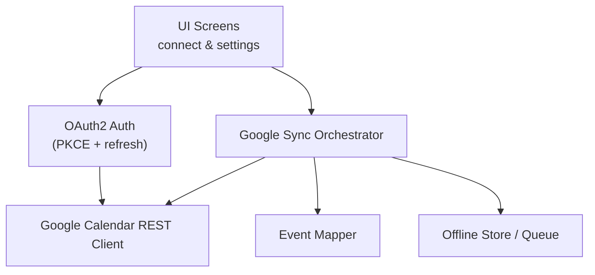
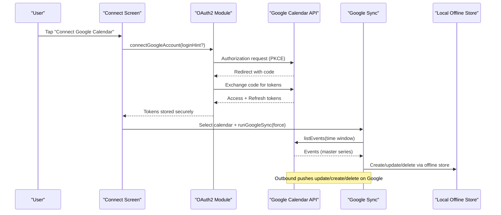
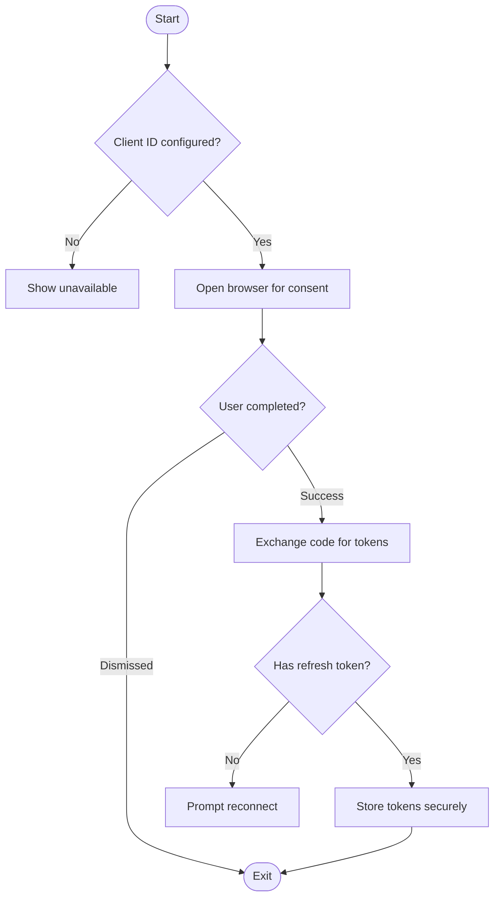
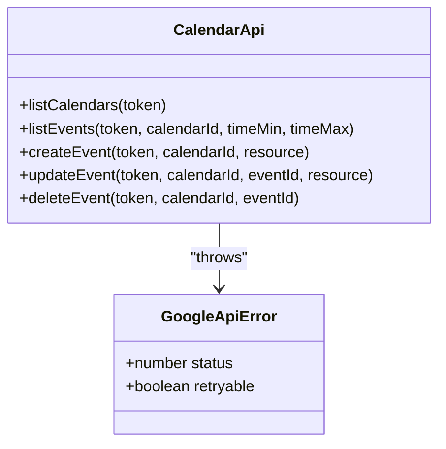
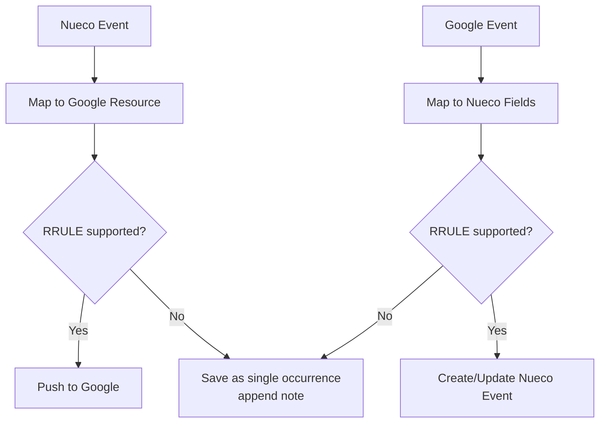
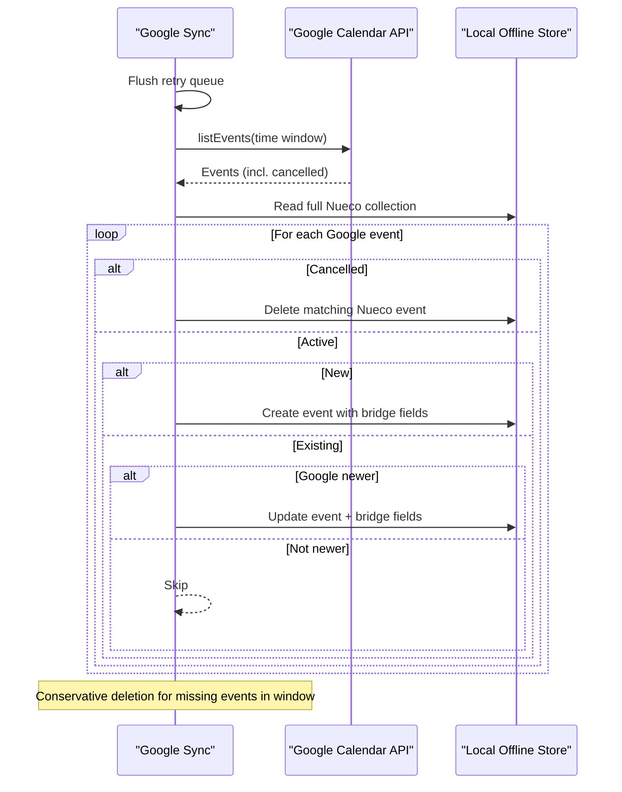
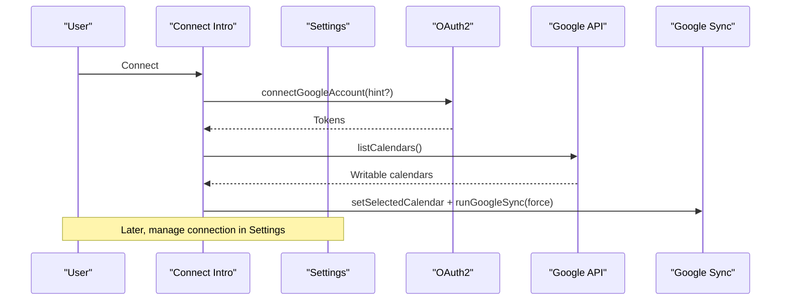
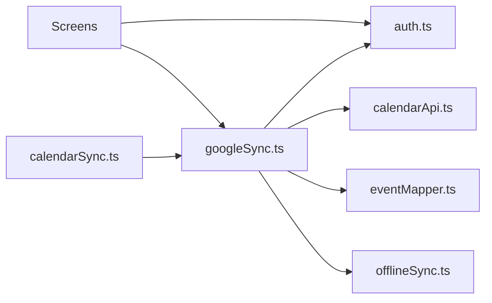

# Google Calendar Integration

<cite>
**Referenced Files in This Document**
- [auth.ts](file://src/google/auth.ts)
- [calendarApi.ts](file://src/google/calendarApi.ts)
- [eventMapper.ts](file://src/google/eventMapper.ts)
- [googleSync.ts](file://src/google/googleSync.ts)
- [oauth2redirect.tsx](file://app/oauth2redirect.tsx)
- [google-connect-intro.tsx](file://app/google-connect-intro.tsx)
- [google-calendar-settings.tsx](file://app/google-calendar-settings.tsx)
- [calendarSync.ts](file://src/calendarSync.ts)
- [types.ts](file://src/types.ts)
- [offlineSync.ts](file://src/offlineSync.ts)
</cite>

## Table of Contents
1. [Introduction](#introduction)
2. [Project Structure](#project-structure)
3. [Core Components](#core-components)
4. [Architecture Overview](#architecture-overview)
5. [Detailed Component Analysis](#detailed-component-analysis)
6. [Dependency Analysis](#dependency-analysis)
7. [Performance Considerations](#performance-considerations)
8. [Troubleshooting Guide](#troubleshooting-guide)
9. [Conclusion](#conclusion)
10. [Appendices](#appendices)

## Introduction
This document explains the Google Calendar integration implemented on the device. It covers:
- OAuth2 authentication flow and token management (including refresh)
- Direct-to-Google API client usage
- Two-way event synchronization strategy with conflict resolution
- Event mapping between Google Calendar and Nueco internal format, including timezone handling, recurrence conversion, and attendee mirroring
- User flows for connecting a Google account and selecting a calendar
- Error handling for rate limits and network failures
- Debugging guidance for sync issues

The design keeps credentials local to the device; the backend never sees Google tokens or reads the user’s calendar directly.

## Project Structure
Google Calendar integration spans UI screens, an OAuth module, a thin REST client, a mapper, and a sync orchestrator. The entry points are:
- Onboarding/settings screens that initiate connection and selection
- A redirect route that completes the OAuth flow
- A sync runner that coordinates inbound/outbound changes

**Diagram sources**
- [google-connect-intro.tsx:60-82](file://app/google-connect-intro.tsx#L60-L82)
- [google-calendar-settings.tsx:61-91](file://app/google-calendar-settings.tsx#L61-L91)
- [oauth2redirect.tsx:1-13](file://app/oauth2redirect.tsx#L1-L13)
- [auth.ts:106-178](file://src/google/auth.ts#L106-L178)
- [calendarApi.ts:20-52](file://src/google/calendarApi.ts#L20-L52)
- [googleSync.ts:254-372](file://src/google/googleSync.ts#L254-L372)
- [eventMapper.ts:113-147](file://src/google/eventMapper.ts#L113-L147)
- [offlineSync.ts:599-700](file://src/offlineSync.ts#L599-L700)

**Section sources**
- [google-connect-intro.tsx:1-176](file://app/google-connect-intro.tsx#L1-L176)
- [google-calendar-settings.tsx:1-270](file://app/google-calendar-settings.tsx#L1-L270)
- [oauth2redirect.tsx:1-13](file://app/oauth2redirect.tsx#L1-L13)
- [auth.ts:1-242](file://src/google/auth.ts#L1-L242)
- [calendarApi.ts:1-147](file://src/google/calendarApi.ts#L1-L147)
- [eventMapper.ts:1-290](file://src/google/eventMapper.ts#L1-L290)
- [googleSync.ts:1-388](file://src/google/googleSync.ts#L1-L388)
- [calendarSync.ts:102-116](file://src/calendarSync.ts#L102-L116)
- [offlineSync.ts:599-700](file://src/offlineSync.ts#L599-L700)

## Core Components
- OAuth2 Authentication: PKCE-based authorization code flow with silent refresh and secure storage.
- Google Calendar REST Client: Thin wrapper around Google Calendar v3 endpoints with error classification.
- Event Mapper: Pure functions to convert between Nueco events and Google Calendar resources, including RRULE translation and attendee mirroring.
- Sync Orchestrator: Two-way sync engine with throttling, locking, retry queue, and last-write-wins conflict policy favoring Google when connected.
- UI Flows: Connect intro screen and settings screen to connect, select a calendar, and trigger syncs.

**Section sources**
- [auth.ts:27-52](file://src/google/auth.ts#L27-L52)
- [calendarApi.ts:10-52](file://src/google/calendarApi.ts#L10-L52)
- [eventMapper.ts:78-147](file://src/google/eventMapper.ts#L78-L147)
- [googleSync.ts:44-63](file://src/google/googleSync.ts#L44-L63)
- [google-connect-intro.tsx:29-82](file://app/google-connect-intro.tsx#L29-L82)
- [google-calendar-settings.tsx:28-91](file://app/google-calendar-settings.tsx#L28-L91)

## Architecture Overview
The system uses a client-side-only approach to Google Calendar:
- OAuth2 is performed in-app using PKCE; tokens are stored securely on-device.
- All Calendar API calls are made directly from the device with the user’s access token.
- Events are mirrored bidirectionally through a sync layer that persists bridge fields locally and retries failed operations.

**Diagram sources**
- [google-connect-intro.tsx:60-82](file://app/google-connect-intro.tsx#L60-L82)
- [auth.ts:106-178](file://src/google/auth.ts#L106-L178)
- [calendarApi.ts:85-110](file://src/google/calendarApi.ts#L85-L110)
- [googleSync.ts:254-372](file://src/google/googleSync.ts#L254-L372)
- [offlineSync.ts:599-700](file://src/offlineSync.ts#L599-L700)

## Detailed Component Analysis

### OAuth2 Authentication Flow and Token Management
- Uses PKCE with an authorization code flow and explicit consent to obtain a refresh token.
- Stores tokens in secure storage and exposes helpers to check connectivity and retrieve a valid token with automatic refresh before expiry.
- Disconnect revokes the grant server-side (best-effort) and clears local tokens.

**Diagram sources**
- [auth.ts:58-67](file://src/google/auth.ts#L58-L67)
- [auth.ts:106-178](file://src/google/auth.ts#L106-L178)
- [auth.ts:185-219](file://src/google/auth.ts#L185-L219)
- [auth.ts:226-242](file://src/google/auth.ts#L226-L242)

**Section sources**
- [auth.ts:27-52](file://src/google/auth.ts#L27-L52)
- [auth.ts:106-178](file://src/google/auth.ts#L106-L178)
- [auth.ts:185-219](file://src/google/auth.ts#L185-L219)
- [auth.ts:226-242](file://src/google/auth.ts#L226-L242)

### Google Calendar REST Client
- Provides methods to list calendars, list events (master series), create, update, and delete events.
- Wraps fetch calls and classifies errors as retryable (rate limits, server errors) or not (auth/permission).

**Diagram sources**
- [calendarApi.ts:10-52](file://src/google/calendarApi.ts#L10-L52)
- [calendarApi.ts:63-147](file://src/google/calendarApi.ts#L63-L147)

**Section sources**
- [calendarApi.ts:20-52](file://src/google/calendarApi.ts#L20-L52)
- [calendarApi.ts:63-147](file://src/google/calendarApi.ts#L63-L147)

### Event Mapping: Google ↔ Nueco
- Nueco → Google: Builds summary, description, location, all-day vs timed start/end, RRULE string, reminders, and ignores attendees writes (read-only mirror).
- Google → Nueco: Parses RRULE into supported subset; degrades unsupported features by saving a single occurrence and appending a note; maps attendees read-only; captures Google’s updated timestamp for conflict resolution.

**Diagram sources**
- [eventMapper.ts:78-147](file://src/google/eventMapper.ts#L78-L147)
- [eventMapper.ts:164-222](file://src/google/eventMapper.ts#L164-L222)
- [eventMapper.ts:247-289](file://src/google/eventMapper.ts#L247-L289)

**Section sources**
- [eventMapper.ts:78-147](file://src/google/eventMapper.ts#L78-L147)
- [eventMapper.ts:164-222](file://src/google/eventMapper.ts#L164-L222)
- [eventMapper.ts:247-289](file://src/google/eventMapper.ts#L247-L289)
- [types.ts:61-86](file://src/types.ts#L61-L86)

### Two-Way Sync Strategy and Conflict Resolution
- When Google is connected, it acts as the source of truth for the selected calendar.
- Outbound: Nueco saves push to Google; failures are queued and retried at the next sync run.
- Inbound: Fetches master events within a fixed window, matches by google_event_id, applies updates only if Google’s updated timestamp is newer than what was last seen, and mirrors deletions conservatively.
- Conflict policy: Last-write-wins based on Google’s updated timestamp; local edits not yet pushed can be overwritten by a newer Google-side edit.

**Diagram sources**
- [googleSync.ts:108-125](file://src/google/googleSync.ts#L108-L125)
- [googleSync.ts:254-372](file://src/google/googleSync.ts#L254-L372)
- [offlineSync.ts:599-700](file://src/offlineSync.ts#L599-L700)

**Section sources**
- [googleSync.ts:127-238](file://src/google/googleSync.ts#L127-L238)
- [googleSync.ts:254-372](file://src/google/googleSync.ts#L254-L372)

### Timezone Handling
- Timed events carry IANA timezone on both sides; all-day events use date-only semantics.
- When mapping Nueco → Google, the calendar’s timezone is used as fallback for timed events without an explicit timezone.

**Section sources**
- [eventMapper.ts:113-147](file://src/google/eventMapper.ts#L113-L147)
- [eventMapper.ts:247-289](file://src/google/eventMapper.ts#L247-L289)

### Recurrence Rule Conversion
- Supported frequencies: daily, weekly, monthly, yearly.
- Weekly supports BYDAY; other frequencies ignore BYDAY.
- Unsupported parts (e.g., INTERVAL≠1, COUNT, EXDATE/RDATE, BYMONTHDAY/BYSETPOS/BYMONTH/BYHOUR/BYMINUTE) cause degradation to a single occurrence with a descriptive note appended to the description.

**Section sources**
- [eventMapper.ts:80-106](file://src/google/eventMapper.ts#L80-L106)
- [eventMapper.ts:164-222](file://src/google/eventMapper.ts#L164-L222)
- [eventMapper.ts:247-289](file://src/google/eventMapper.ts#L247-L289)

### Attendee Processing
- Attendees are mirrored read-only from Google to Nueco for display; Nueco-side attendee changes are not pushed to Google.

**Section sources**
- [eventMapper.ts:224-241](file://src/google/eventMapper.ts#L224-L241)
- [types.ts:88-95](file://src/types.ts#L88-L95)

### Attachments
- The current Google integration does not map attachments. Only title, description, location, timing, recurrence, reminders, and attendees are synchronized.

[No sources needed since this section summarizes behavior without analyzing specific files]

### User Flows: Connecting and Selecting a Calendar
- Intro screen prompts to connect; if Gmail, pre-fills login hint to skip account chooser.
- After successful OAuth, lists writable calendars; auto-selects if only one exists, otherwise shows picker.
- Settings screen allows connecting/disconnecting, picking a calendar, and triggering immediate sync.

**Diagram sources**
- [google-connect-intro.tsx:60-82](file://app/google-connect-intro.tsx#L60-L82)
- [google-calendar-settings.tsx:61-91](file://app/google-calendar-settings.tsx#L61-L91)
- [auth.ts:106-178](file://src/google/auth.ts#L106-L178)
- [calendarApi.ts:63-78](file://src/google/calendarApi.ts#L63-L78)
- [googleSync.ts:66-84](file://src/google/googleSync.ts#L66-L84)

**Section sources**
- [google-connect-intro.tsx:29-82](file://app/google-connect-intro.tsx#L29-L82)
- [google-calendar-settings.tsx:28-91](file://app/google-calendar-settings.tsx#L28-L91)
- [oauth2redirect.tsx:1-13](file://app/oauth2redirect.tsx#L1-L13)

## Dependency Analysis
Key dependencies and coupling:
- UI depends on auth and sync modules to orchestrate connection and sync.
- Sync depends on auth for tokens, calendarApi for Google calls, eventMapper for transformations, and offlineSync for durable local state and queues.
- calendarSync routes to Google sync when active, otherwise falls back to device calendar import.

**Diagram sources**
- [google-connect-intro.tsx:25-27](file://app/google-connect-intro.tsx#L25-L27)
- [google-calendar-settings.tsx:14-26](file://app/google-calendar-settings.tsx#L14-L26)
- [calendarSync.ts:102-116](file://src/calendarSync.ts#L102-L116)
- [googleSync.ts:24-43](file://src/google/googleSync.ts#L24-L43)

**Section sources**
- [calendarSync.ts:102-116](file://src/calendarSync.ts#L102-L116)
- [googleSync.ts:24-43](file://src/google/googleSync.ts#L24-L43)

## Performance Considerations
- Throttling: Sync runs are throttled to avoid excessive API calls.
- Locking: Storage-based lock prevents concurrent sync runs across foreground/background contexts.
- Pagination: Calendar and events listing paginate to handle large datasets efficiently.
- Windowing: Inbound sync queries a bounded past/future window to limit payload size.
- Retry queue: Failed outbound operations are persisted and retried later, avoiding repeated failures during a single run.

**Section sources**
- [googleSync.ts:44-55](file://src/google/googleSync.ts#L44-L55)
- [googleSync.ts:254-275](file://src/google/googleSync.ts#L254-L275)
- [calendarApi.ts:63-110](file://src/google/calendarApi.ts#L63-L110)

## Troubleshooting Guide
Common issues and how to diagnose:
- No writable calendars: Ensure the connected account has owner/writer access to at least one calendar.
- Missing refresh token: Reconnect to obtain a refresh token; without it, the connection expires quickly.
- Rate limits or transient errors: Errors marked retryable are queued and retried automatically; check retry queue persistence.
- Network failures: Treated as transient; retry queue will attempt again when connectivity returns.
- Conflicts: If Google side is newer, it wins; check google_event_updated to understand which side took precedence.
- OAuth redirect not handled: Ensure the app handles the redirect route so expo-auth-session can complete the flow.

Practical steps:
- Use “Sync Now” in settings to force a run and observe outcomes.
- Disconnect and reconnect to reset grants and clear stale tokens.
- Verify the selected calendar and its timezone.

**Section sources**
- [calendarApi.ts:20-52](file://src/google/calendarApi.ts#L20-L52)
- [googleSync.ts:108-125](file://src/google/googleSync.ts#L108-L125)
- [googleSync.ts:254-372](file://src/google/googleSync.ts#L254-L372)
- [auth.ts:185-219](file://src/google/auth.ts#L185-L219)
- [oauth2redirect.tsx:1-13](file://app/oauth2redirect.tsx#L1-L13)

## Conclusion
The integration provides a robust, client-side two-way sync between Nueco and a selected Google calendar. It prioritizes Google as the source of truth when connected, uses last-write-wins based on timestamps, and ensures reliability through throttling, locking, and persistent retries. Mapping logic gracefully degrades unsupported features while preserving user data visibility.

## Appendices

### Practical Setup Checklist
- Configure a Google Cloud project with Calendar API enabled and an OAuth consent screen granting required scopes.
- Create an Android OAuth client ID and bake it into the build configuration.
- Register the custom scheme intent filter for OAuth redirects.
- In the app, open Settings → Calendar → Google Calendar to connect and pick a calendar.

**Section sources**
- [auth.ts:16-21](file://src/google/auth.ts#L16-L21)
- [auth.ts:58-67](file://src/google/auth.ts#L58-L67)
- [google-calendar-settings.tsx:142-160](file://app/google-calendar-settings.tsx#L142-L160)