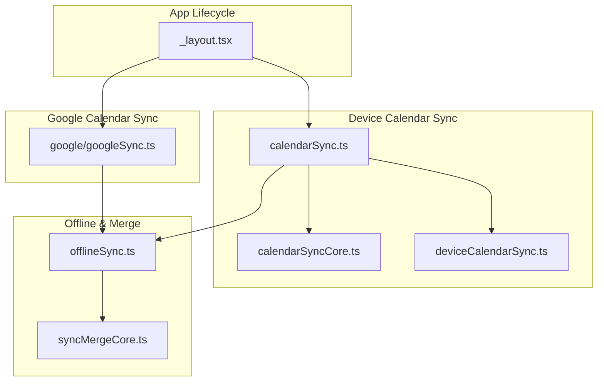
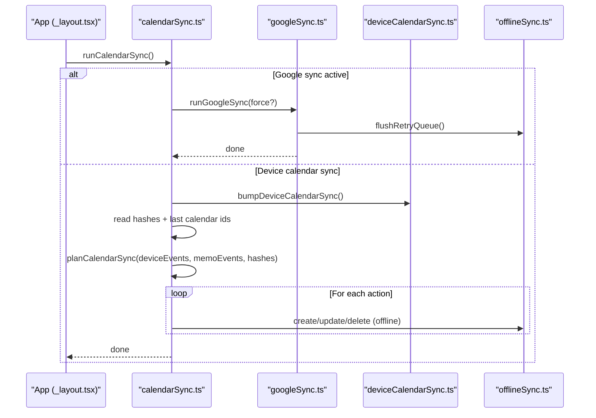
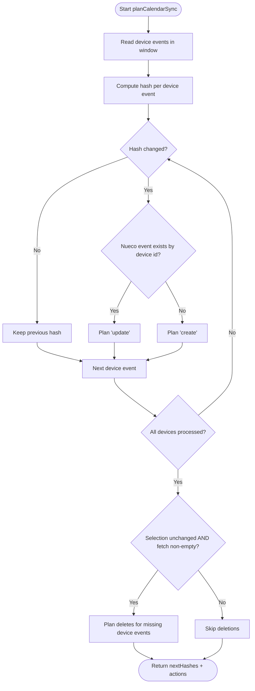
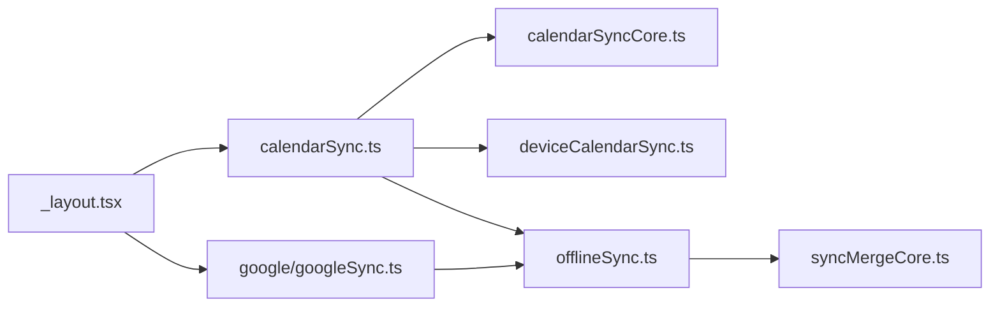

# Synchronization Engine

<cite>
**Referenced Files in This Document**
- [calendarSync.ts](file://src/calendarSync.ts)
- [calendarSyncCore.ts](file://src/calendarSyncCore.ts)
- [calendarSyncTask.ts](file://src/calendarSyncTask.ts)
- [deviceCalendarSync.ts](file://src/deviceCalendarSync.ts)
- [googleSync.ts](file://src/google/googleSync.ts)
- [offlineSync.ts](file://src/offlineSync.ts)
- [syncMergeCore.ts](file://src/syncMergeCore.ts)
- [_layout.tsx](file://app/(tabs)/_layout.tsx)
</cite>

## Table of Contents
1. [Introduction](#introduction)
2. [Project Structure](#project-structure)
3. [Core Components](#core-components)
4. [Architecture Overview](#architecture-overview)
5. [Detailed Component Analysis](#detailed-component-analysis)
6. [Dependency Analysis](#dependency-analysis)
7. [Performance Considerations](#performance-considerations)
8. [Troubleshooting Guide](#troubleshooting-guide)
9. [Conclusion](#conclusion)
10. [Appendices](#appendices)

## Introduction
This document explains the calendar synchronization engine that keeps Nueco events consistent with:
- Device calendars (Apple/Google/Outlook via the OS Calendar app), and
- A selected Google Calendar when connected.

It covers how background and foreground syncs are orchestrated, the planning algorithm that decides create/update/delete actions, throttling and storage-based locking to prevent excessive runs, hash-based change detection for efficient incremental syncs, offline-first queuing, error handling and retry logic, configuration options for sync windows, performance tuning parameters, and monitoring approaches for sync health.

## Project Structure
The calendar sync system is implemented across several modules:
- Orchestration and UI triggers live in the tabs layout and a dedicated sync module.
- Device-calendar sync reads from the OS calendar and plans changes against local Nueco events.
- Google Calendar sync performs two-way synchronization directly with Google’s API using the user’s OAuth token.
- Offline-first persistence and queueing ensure operations survive network outages and device restarts.
- A pure decision module computes actions deterministically based on hashes and state.



**Diagram sources**
- [_layout.tsx:95-109](file://app/(tabs)/_layout.tsx#L95-L109)
- [calendarSync.ts:102-199](file://src/calendarSync.ts#L102-L199)
- [calendarSyncCore.ts:87-149](file://src/calendarSyncCore.ts#L87-L149)
- [deviceCalendarSync.ts:17-96](file://src/deviceCalendarSync.ts#L17-L96)
- [googleSync.ts:254-372](file://src/google/googleSync.ts#L254-L372)
- [offlineSync.ts:785-800](file://src/offlineSync.ts#L785-L800)
- [syncMergeCore.ts:76-140](file://src/syncMergeCore.ts#L76-L140)

**Section sources**
- [_layout.tsx:95-109](file://app/(tabs)/_layout.tsx#L95-L109)
- [calendarSync.ts:102-199](file://src/calendarSync.ts#L102-L199)
- [googleSync.ts:254-372](file://src/google/googleSync.ts#L254-L372)
- [offlineSync.ts:785-800](file://src/offlineSync.ts#L785-L800)

## Core Components
- Foreground/background orchestration: The tabs layout triggers sync on app open and registers a background task for best-effort periodic sync.
- Device calendar sync: Reads device events within a configurable window, compares with local Nueco events, and plans create/update/delete actions.
- Google Calendar sync: Two-way sync with a selected Google calendar, including outbound push and inbound pull, with a persistent retry queue.
- Offline-first queueing: All event mutations write locally first and enqueue operations; background processes flush them when connectivity is available.
- Conflict resolution and merge rules: Reconciliation uses timestamps and completeness flags to avoid accidental deletions and preserve local edits during pulls.

**Section sources**
- [_layout.tsx:95-109](file://app/(tabs)/_layout.tsx#L95-L109)
- [calendarSync.ts:102-199](file://src/calendarSync.ts#L102-L199)
- [googleSync.ts:254-372](file://src/google/googleSync.ts#L254-L372)
- [offlineSync.ts:785-800](file://src/offlineSync.ts#L785-L800)
- [syncMergeCore.ts:76-140](file://src/syncMergeCore.ts#L76-L140)

## Architecture Overview
The engine supports two modes:
- Device calendar mode: Imports device calendar events into Nueco and mirrors deletions conservatively.
- Google Calendar mode: When a Google account is connected and a calendar is selected, this mode owns the bridge and bypasses device-calendar reads to avoid duplicates.

Both modes:
- Throttle runs to avoid excessive work.
- Use storage-based locks to prevent concurrent runs across foreground/background contexts.
- Apply changes incrementally using hashes or timestamps.
- Persist failures to queues for later retries.



**Diagram sources**
- [_layout.tsx:95-109](file://app/(tabs)/_layout.tsx#L95-L109)
- [calendarSync.ts:102-199](file://src/calendarSync.ts#L102-L199)
- [googleSync.ts:254-372](file://src/google/googleSync.ts#L254-L372)
- [deviceCalendarSync.ts:17-30](file://src/deviceCalendarSync.ts#L17-L30)
- [offlineSync.ts:785-800](file://src/offlineSync.ts#L785-L800)

## Detailed Component Analysis

### Sync Planning Algorithm (Device Calendar Mode)
The planning algorithm determines whether to create, update, or delete Nueco events by comparing:
- Current device events within a time window,
- Existing Nueco events keyed by their device event id,
- Previously recorded hashes per device event id,
- Whether the selected calendar set has changed since the last run.

Key behaviors:
- Hash-based change detection avoids unnecessary updates.
- Deletions are conservative: only when the calendar selection is unchanged and the fetch returned at least one event.
- If the full Nueco collection cannot be read, the run aborts safely to avoid duplicating events.



**Diagram sources**
- [calendarSyncCore.ts:87-149](file://src/calendarSyncCore.ts#L87-L149)

**Section sources**
- [calendarSyncCore.ts:87-149](file://src/calendarSyncCore.ts#L87-L149)
- [calendarSync.ts:141-191](file://src/calendarSync.ts#L141-L191)

### Throttling Mechanism
To prevent excessive sync runs:
- Device calendar sync tracks last run timestamp and enforces a minimum interval between runs unless forced.
- Google sync uses an independent throttle with its own last-run key.
- Both use storage-based locks with TTLs to avoid overlapping runs across foreground and background tasks.

Configuration:
- Throttle intervals and lock TTLs are defined per sync path.
- Force flag allows bypassing throttle for manual “Sync now” flows.

**Section sources**
- [calendarSync.ts:40-45](file://src/calendarSync.ts#L40-L45)
- [calendarSync.ts:123-130](file://src/calendarSync.ts#L123-L130)
- [googleSync.ts:51-54](file://src/google/googleSync.ts#L51-L54)
- [googleSync.ts:257-263](file://src/google/googleSync.ts#L257-L263)

### Storage-Based Locking System
- Each sync path stores a lock timestamp in AsyncStorage before starting.
- On start, it checks if a lock exists and is still within TTL; if so, it skips the run.
- After completion (success or failure), the lock is removed.
- This ensures safe execution even when iOS invokes a headless background task separate from the foreground app.

**Section sources**
- [calendarSync.ts:128-130](file://src/calendarSync.ts#L128-L130)
- [calendarSync.ts:192-194](file://src/calendarSync.ts#L192-L194)
- [googleSync.ts:261-263](file://src/google/googleSync.ts#L261-L263)
- [googleSync.ts:366-368](file://src/google/googleSync.ts#L366-L368)

### Hash-Based Change Detection
- Device events are hashed by title, location, notes, all-day flag, and normalized start/end times.
- For all-day events, dates are normalized to UTC date-only strings to avoid timezone shifts.
- If the current hash matches the previous hash, no action is taken.
- On success, next hashes are persisted; on failure, prior hashes are preserved to retry later.

**Section sources**
- [calendarSyncCore.ts:52-64](file://src/calendarSyncCore.ts#L52-L64)
- [calendarSyncCore.ts:96-131](file://src/calendarSyncCore.ts#L96-L131)
- [calendarSync.ts:164-191](file://src/calendarSync.ts#L164-L191)

### Offline-First Approach and Queuing
- All event mutations write locally first and enqueue operations for later network sync.
- The offline sync manager persists large collections to file-backed JSON to avoid AsyncStorage limits.
- Background processes periodically flush queued operations when connectivity is available.
- For Google sync, failed outbound pushes/deletes are stored in a persistent retry queue and flushed at the start of each sync run.

```mermaid
sequenceDiagram
participant UI as "Event Editor"
participant OS as "offlineSync.ts"
participant BG as "Background Sync"
participant API as "Server API"
UI->>OS : create/update/delete event (offline)
OS->>OS : persist local record + enqueue operation
Note over OS,BG : Network unavailable or deferred
BG->>OS : processSyncQueue()
OS->>API : send queued operations
API-->>OS : success/failure
OS->>OS : remove successful ops; keep failed for retry
```

**Diagram sources**
- [offlineSync.ts:785-800](file://src/offlineSync.ts#L785-L800)
- [offlineSync.ts:599-700](file://src/offlineSync.ts#L599-L700)

**Section sources**
- [offlineSync.ts:122-193](file://src/offlineSync.ts#L122-L193)
- [offlineSync.ts:365-415](file://src/offlineSync.ts#L365-L415)
- [offlineSync.ts:599-700](file://src/offlineSync.ts#L599-L700)
- [googleSync.ts:88-125](file://src/google/googleSync.ts#L88-L125)

### Error Handling and Retry Logic
- Device calendar sync:
  - If applying an action fails, it preserves prior hashes to retry next run.
  - If the full Nueco collection cannot be read, the run aborts safely to avoid duplication.
- Google sync:
  - Outbound failures are enqueued for retry; non-retryable errors are dropped.
  - Inbound updates apply only when Google-side changes are newer than last seen.
  - Deletions mirror only when the event was within the fetched window and not reported cancelled.
- Offline sync:
  - Failed operations remain in the queue until connectivity returns.
  - Local writes succeed regardless of network state.

**Section sources**
- [calendarSync.ts:171-186](file://src/calendarSync.ts#L171-L186)
- [calendarSync.ts:153-157](file://src/calendarSync.ts#L153-L157)
- [googleSync.ts:108-125](file://src/google/googleSync.ts#L108-L125)
- [googleSync.ts:205-238](file://src/google/googleSync.ts#L205-L238)
- [googleSync.ts:311-363](file://src/google/googleSync.ts#L311-L363)

### Configuration Options and Tuning Parameters
- Sync windows:
  - Device calendar sync: past days and future days define the range of device events considered.
  - Google sync: same window semantics for pulling master events.
- Throttling:
  - Minimum interval between sync runs to reduce overhead.
- Lock TTL:
  - Maximum duration a storage-based lock is considered valid to guard against stale locks.
- Performance:
  - File-backed JSON storage for large collections avoids AsyncStorage row-size limits.
  - In-memory caches for local collections reduce repeated disk reads.
  - Full sync throttling prevents frequent heavy reconciliation.

**Section sources**
- [calendarSync.ts:40-45](file://src/calendarSync.ts#L40-L45)
- [googleSync.ts:51-54](file://src/google/googleSync.ts#L51-L54)
- [offlineSync.ts:122-193](file://src/offlineSync.ts#L122-L193)
- [offlineSync.ts:785-796](file://src/offlineSync.ts#L785-L796)

### Monitoring Approaches for Sync Health
- Logs:
  - Warnings when full collection reads fail to avoid duplication.
  - Errors logged for failed actions and background task failures.
- State keys:
  - Last run timestamps and lock states can be inspected to verify throttling and concurrency behavior.
- Retry queues:
  - Persistent retry queues indicate pending outbound operations to Google.
- UI triggers:
  - Foreground sync runs on app open; background task registration provides best-effort periodic sync.

**Section sources**
- [calendarSync.ts:153-157](file://src/calendarSync.ts#L153-L157)
- [calendarSync.ts:195-197](file://src/calendarSync.ts#L195-L197)
- [calendarSyncTask.ts:27-35](file://src/calendarSyncTask.ts#L27-L35)
- [googleSync.ts:108-125](file://src/google/googleSync.ts#L108-L125)
- [_layout.tsx:95-109](file://app/(tabs)/_layout.tsx#L95-L109)

## Dependency Analysis
The following diagram shows core dependencies among sync components:



**Diagram sources**
- [_layout.tsx:95-109](file://app/(tabs)/_layout.tsx#L95-L109)
- [calendarSync.ts:102-199](file://src/calendarSync.ts#L102-L199)
- [calendarSyncCore.ts:87-149](file://src/calendarSyncCore.ts#L87-L149)
- [deviceCalendarSync.ts:17-96](file://src/deviceCalendarSync.ts#L17-L96)
- [googleSync.ts:254-372](file://src/google/googleSync.ts#L254-L372)
- [offlineSync.ts:785-800](file://src/offlineSync.ts#L785-L800)
- [syncMergeCore.ts:76-140](file://src/syncMergeCore.ts#L76-L140)

**Section sources**
- [_layout.tsx:95-109](file://app/(tabs)/_layout.tsx#L95-L109)
- [calendarSync.ts:102-199](file://src/calendarSync.ts#L102-L199)
- [googleSync.ts:254-372](file://src/google/googleSync.ts#L254-L372)
- [offlineSync.ts:785-800](file://src/offlineSync.ts#L785-L800)

## Performance Considerations
- Avoid duplicate imports: When Google sync is active, device-calendar reads are skipped to prevent double-importing events.
- Incremental syncs: Hash-based detection minimizes updates; timestamp-based conflict resolution reduces unnecessary merges.
- Large data handling: File-backed JSON storage prevents AsyncStorage limitations and improves reliability for large collections.
- Concurrency control: Storage-based locks and throttles reduce redundant work and contention.
- Background vs foreground: Foreground sync ensures timely updates; background task provides best-effort maintenance.

[No sources needed since this section provides general guidance]

## Troubleshooting Guide
Common issues and resolutions:
- Sync does not run:
  - Verify sync is enabled and at least one calendar is selected.
  - Check last run timestamp and throttle interval.
  - Ensure permissions are granted for device calendar access.
- Duplicate events:
  - Confirm Google sync is not active while device sync is also importing.
  - Validate that full collection reads complete; partial reads cause aborts to prevent duplication.
- Missing deletions:
  - Deletions require unchanged calendar selection and non-empty fetch results.
  - Review logs for warnings about skipping due to incomplete reads.
- Stale device entries:
  - Recurring entries are refreshed on app open; failures are best-effort and logged.
- Retry queue backlog:
  - Inspect Google sync retry queue; non-retryable errors are dropped automatically.

**Section sources**
- [calendarSync.ts:117-134](file://src/calendarSync.ts#L117-L134)
- [calendarSync.ts:153-157](file://src/calendarSync.ts#L153-L157)
- [calendarSyncCore.ts:133-145](file://src/calendarSyncCore.ts#L133-L145)
- [deviceCalendarSync.ts:44-96](file://src/deviceCalendarSync.ts#L44-L96)
- [googleSync.ts:108-125](file://src/google/googleSync.ts#L108-L125)

## Conclusion
The calendar synchronization engine provides robust, offline-first synchronization between Nueco and both device calendars and Google Calendar. It employs careful planning, throttling, locking, and hashing to ensure efficiency and safety. Failures are handled gracefully with retries and conservative deletion policies. Configuration options allow tuning sync windows and performance characteristics, while logging and state keys support monitoring and troubleshooting.

[No sources needed since this section summarizes without analyzing specific files]

## Appendices

### Key Entry Points and Triggers
- App open triggers foreground sync and background task registration.
- Manual “Sync now” can force bypass of throttle where supported.

**Section sources**
- [_layout.tsx:95-109](file://app/(tabs)/_layout.tsx#L95-L109)
- [calendarSyncTask.ts:40-51](file://src/calendarSyncTask.ts#L40-L51)