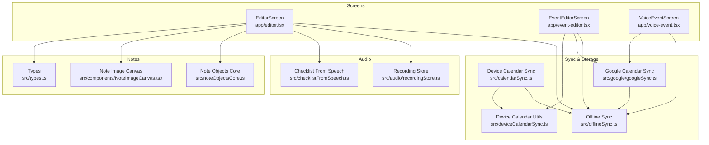
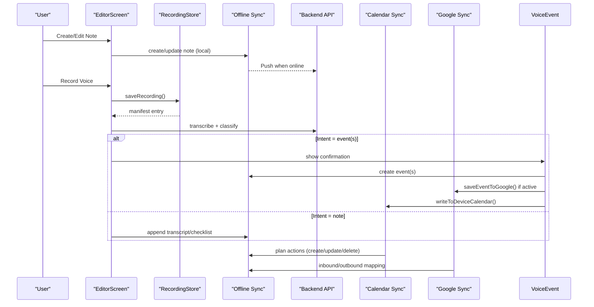
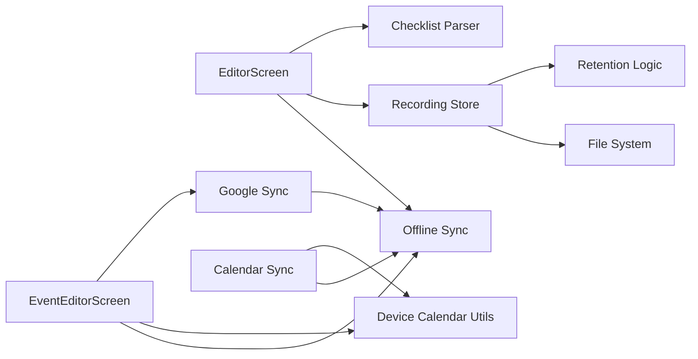

# Core Features

<cite>
**Referenced Files in This Document**
- [editor.tsx](file://app/editor.tsx)
- [event-editor.tsx](file://app/event-editor.tsx)
- [voice-event.tsx](file://app/voice-event.tsx)
- [noteObjectsCore.ts](file://src/noteObjectsCore.ts)
- [NoteImageCanvas.tsx](file://src/components/NoteImageCanvas.tsx)
- [calendarSync.ts](file://src/calendarSync.ts)
- [calendarSyncCore.ts](file://src/calendarSyncCore.ts)
- [deviceCalendarSync.ts](file://src/deviceCalendarSync.ts)
- [googleSync.ts](file://src/google/googleSync.ts)
- [recordingStore.ts](file://src/audio/recordingStore.ts)
- [checklistFromSpeech.ts](file://src/checklistFromSpeech.ts)
- [types.ts](file://src/types.ts)
- [offlineSync.ts](file://src/offlineSync.ts)
</cite>

## Table of Contents
1. Introduction
2. Project Structure
3. Core Components
4. Architecture Overview
5. Detailed Component Analysis
6. Dependency Analysis
7. Performance Considerations
8. Troubleshooting Guide
9. Conclusion
10. Appendices

## Introduction
This document explains the core application features: note management with rich text editing, image attachments and floating images, tagging, bidirectional calendar synchronization (device calendars and Google Calendar), and voice recording with speech-to-text and transcription processing. It covers user interface patterns, data models, state management, offline capabilities, background synchronization, conflict resolution, and practical workflows that integrate these features.

## Project Structure
The app is a React Native/Expo project organized by feature:
- App screens under app/: editor.tsx (notes), event-editor.tsx (events), voice-event.tsx (voice to event confirmation).
- Shared logic under src/: calendar sync, device calendar integration, Google Calendar sync, audio recording storage, checklist parsing from speech, types, and offline sync.
- UI components under src/components/: NoteImageCanvas for free-floating images, plus other shared UI.

**Diagram sources**
- [editor.tsx:1-120](file://app/editor.tsx#L1-L120)
- [event-editor.tsx:1-60](file://app/event-editor.tsx#L1-L60)
- [voice-event.tsx:1-40](file://app/voice-event.tsx#L1-L40)
- [calendarSync.ts:1-60](file://src/calendarSync.ts#L1-L60)
- [googleSync.ts:1-60](file://src/google/googleSync.ts#L1-L60)
- [deviceCalendarSync.ts:1-30](file://src/deviceCalendarSync.ts#L1-L30)
- [recordingStore.ts:1-40](file://src/audio/recordingStore.ts#L1-L40)
- [checklistFromSpeech.ts:1-30](file://src/checklistFromSpeech.ts#L1-L30)
- [noteObjectsCore.ts:1-30](file://src/noteObjectsCore.ts#L1-L30)
- [NoteImageCanvas.tsx:1-30](file://src/components/NoteImageCanvas.tsx#L1-L30)
- [types.ts:1-40](file://src/types.ts#L1-L40)
- [offlineSync.ts:1-40](file://src/offlineSync.ts#L1-L40)

**Section sources**
- [editor.tsx:1-120](file://app/editor.tsx#L1-L120)
- [event-editor.tsx:1-60](file://app/event-editor.tsx#L1-L60)
- [voice-event.tsx:1-40](file://app/voice-event.tsx#L1-L40)
- [calendarSync.ts:1-60](file://src/calendarSync.ts#L1-L60)
- [googleSync.ts:1-60](file://src/google/googleSync.ts#L1-L60)
- [deviceCalendarSync.ts:1-30](file://src/deviceCalendarSync.ts#L1-L30)
- [recordingStore.ts:1-40](file://src/audio/recordingStore.ts#L1-L40)
- [checklistFromSpeech.ts:1-30](file://src/checklistFromSpeech.ts#L1-L30)
- [noteObjectsCore.ts:1-30](file://src/noteObjectsCore.ts#L1-L30)
- [NoteImageCanvas.tsx:1-30](file://src/components/NoteImageCanvas.tsx#L1-L30)
- [types.ts:1-40](file://src/types.ts#L1-L40)
- [offlineSync.ts:1-40](file://src/offlineSync.ts#L1-L40)

## Core Components
- Notes: Rich text editor with tables, wrapped images, free-floating images, tags, attachments, PDF import/export, and sharing.
- Calendar: Bidirectional sync with device calendars and optional Google Calendar; recurring events; reminders; linked notes.
- Voice: Recording capture, silence detection, transcription, intent classification, checklist creation, and event extraction.

Key data models:
- Note, Tag, Attachment, NoteObject (free-floating images).
- CalendarEvent, Recurrence, ReminderMinutes, ExtractedEvent, VoiceIntent.

State management:
- Offline-first persistence via file-backed JSON stores and a sync queue.
- Local caches for recordings manifest and calendar sync state.
- UI state in screen components (editor, event editor, voice confirm).

**Section sources**
- [types.ts:1-125](file://src/types.ts#L1-L125)
- [offlineSync.ts:1-200](file://src/offlineSync.ts#L1-L200)
- [recordingStore.ts:1-120](file://src/audio/recordingStore.ts#L1-L120)
- [calendarSync.ts:1-120](file://src/calendarSync.ts#L1-L120)
- [googleSync.ts:1-120](file://src/google/googleSync.ts#L1-L120)

## Architecture Overview
The system follows an offline-first architecture with local persistence and background sync:
- Editor and Event screens write locally first, then push to server via offline sync.
- Calendar sync reads device calendars or Google Calendar and applies changes to Nueco events.
- Voice recording is stored on-device with a manifest; transcripts are processed and can create events or enrich notes.

**Diagram sources**
- [editor.tsx:600-760](file://app/editor.tsx#L600-L760)
- [recordingStore.ts:78-140](file://src/audio/recordingStore.ts#L78-L140)
- [voice-event.tsx:140-230](file://app/voice-event.tsx#L140-L230)
- [calendarSync.ts:100-199](file://src/calendarSync.ts#L100-L199)
- [googleSync.ts:200-370](file://src/google/googleSync.ts#L200-L370)
- [offlineSync.ts:1-120](file://src/offlineSync.ts#L1-L120)

## Detailed Component Analysis

### Note Management: Rich Text Editing, Images, Tags, Attachments
- Rich text body powered by a WebView-based editor with bridges for tables, wrapped images, placeholders, and content height measurement.
- Free-floating images: normalized coordinates, aspect-ratio-preserving scaling, drag/scale clamping, z-index ordering.
- Tags: color-coded tag chips persisted with notes.
- Attachments: upload with progress, download+decrypt for viewing, share sheet integration including embedded images.
- PDF import: extract text/images into note body; export to PDF with pagination and styling.

UI patterns:
- Modal bottom sheets for image picker and event picker.
- Live waveform and elapsed timer during recording.
- Inline toolbar toggles for formatting based on editor state.

Data model highlights:
- Note includes title, HTML content, tags, linked events, attachments, and objects (free-floating images).
- NoteObject captures intrinsic dimensions, normalized position, scale, rotation, z-index, and upload status.

State management:
- Local draft state in screen components; autosave via offline sync queue.
- Manifest-driven list of recordings linked to notes; migration of temporary IDs to server-assigned IDs.

Performance considerations:
- Wrapped images resized before embedding to reduce payload size.
- Content height measured via ResizeObserver bridge to avoid layout thrashing.
- File-backed stores prevent AsyncStorage row-size limits.

Common workflows:
- Create note -> attach images -> add tags -> record voice -> transcribe -> insert checklist or text -> link event -> share/export.

**Section sources**
- [editor.tsx:239-590](file://app/editor.tsx#L239-L590)
- [editor.tsx:592-800](file://app/editor.tsx#L592-L800)
- [noteObjectsCore.ts:12-122](file://src/noteObjectsCore.ts#L12-L122)
- [NoteImageCanvas.tsx:1-75](file://src/components/NoteImageCanvas.tsx#L1-L75)
- [types.ts:16-48](file://src/types.ts#L16-L48)
- [recordingStore.ts:78-148](file://src/audio/recordingStore.ts#L78-L148)

### Calendar Integration: Device Calendars and Google Calendar
Bidirectional sync ensures Nueco events mirror device calendars and optionally Google Calendar:
- Device calendar sync:
  - Reads selected calendars within a time window.
  - Plans create/update/delete actions using pure decision logic.
  - Applies actions via offline sync; deletes conservatively only when selection unchanged and fetch non-empty.
  - Refreshes recurring entries and nudges Android account sync.
- Google Calendar sync:
  - Two-way sync with one selected calendar using client-side Google API.
  - Outbound: pushes updates/deletes with retry queue; writes back bridge fields.
  - Inbound: imports new events, updates when newer, mirrors deletions conservatively.
  - Conflict policy: last-write-wins on Google side; inbound applies only when newer than last seen.

UI patterns:
- Settings screens to enable/disable sync and select calendars.
- Event editor integrates device calendar write and Google sync triggers.

Data model highlights:
- CalendarEvent includes recurrence, timezone, reminder minutes, device_calendar_event_id, and Google bridge fields.
- Recurrence defines frequency, byweekday, and until date.

Conflict resolution:
- Device sync uses hash-based change detection and conservative deletion rules.
- Google sync uses updated timestamps to decide inbound updates.

Background synchronization:
- Throttled runs with lock keys to avoid concurrent execution.
- Retry queues persist across app restarts.

**Section sources**
- [calendarSync.ts:1-199](file://src/calendarSync.ts#L1-L199)
- [calendarSyncCore.ts:1-149](file://src/calendarSyncCore.ts#L1-L149)
- [deviceCalendarSync.ts:1-96](file://src/deviceCalendarSync.ts#L1-L96)
- [googleSync.ts:1-388](file://src/google/googleSync.ts#L1-L388)
- [types.ts:53-86](file://src/types.ts#L53-L86)

### Voice Recording and Transcription
Capabilities:
- Capture audio with metering for live waveform; silence detection provides “you’ve gone quiet” hints.
- Save recordings to managed storage with a JSON manifest; retention policies sweep expired files.
- Transcribe audio; classify intent to determine whether to create events, itineraries, or append text to notes.
- Checklist parsing recognizes spoken commands and builds interactive task lists directly in the editor.

UI patterns:
- Recording controls with chimes, elapsed timer, and waveform visualization.
- Consent modal for conversation mode; audible announcement preference.
- Confirmation screen for extracted events with editable fields and trip naming.

Processing logic:
- On stop, transcript is sent to backend classifier; results staged for review.
- For checklists, local deterministic parsing avoids extra AI calls.
- For events, device calendar write and Google sync are triggered after saving.

State management:
- Manifest tracks recordings, links to notes, marks transcribed, saves word timings and duration.
- Pending voice extractions passed between screens; pending linked event IDs staged for immediate display.

Offline and background:
- Recordings survive cache eviction; manifest persists locally.
- Transcripts and linked events queued via offline sync for later push.

**Section sources**
- [editor.tsx:664-771](file://app/editor.tsx#L664-L771)
- [recordingStore.ts:1-263](file://src/audio/recordingStore.ts#L1-L263)
- [checklistFromSpeech.ts:1-72](file://src/checklistFromSpeech.ts#L1-L72)
- [voice-event.tsx:1-545](file://app/voice-event.tsx#L1-L545)

### Data Models and State Management
- Note: title, content (HTML), tags, linked events, attachments, free-floating objects, timestamps.
- CalendarEvent: title, description, location, all_day flag, start/end times, linked notes, reminders, recurrence, timezone, device and Google bridge fields.
- NoteObject: type, intrinsic dimensions, normalized position, scale, rotation, z-index, upload status.
- Local stores: file-backed JSON for notes/events/trips/sync queue; manifest for recordings.
- Sync queue: operations with entity type, operation, payload, timestamp, retries.

State flows:
- Screen-level state drives UI; offline sync persists and reconciles with server.
- Calendar sync maintains hashes and locks to ensure safe, idempotent runs.
- Recording store serializes manifest mutations to avoid race conditions.

**Section sources**
- [types.ts:1-125](file://src/types.ts#L1-L125)
- [offlineSync.ts:28-120](file://src/offlineSync.ts#L28-L120)
- [recordingStore.ts:64-120](file://src/audio/recordingStore.ts#L64-L120)
- [calendarSync.ts:31-73](file://src/calendarSync.ts#L31-L73)
- [googleSync.ts:44-84](file://src/google/googleSync.ts#L44-L84)

## Dependency Analysis
Key dependencies and relationships:
- Editor depends on offline sync, recording store, checklist parser, and crypto utilities for attachments and notes.
- Event editor depends on offline sync, device calendar utils, and Google sync for outbound/inbound sync.
- Calendar sync depends on device calendar module and offline sync; delegates to Google sync when active.
- Google sync depends on auth and calendar API clients, event mapper, and offline sync.
- Recording store depends on file system, crypto, and retention logic.

**Diagram sources**
- [editor.tsx:26-60](file://app/editor.tsx#L26-L60)
- [event-editor.tsx:10-20](file://app/event-editor.tsx#L10-L20)
- [calendarSync.ts:17-25](file://src/calendarSync.ts#L17-L25)
- [googleSync.ts:24-42](file://src/google/googleSync.ts#L24-L42)
- [recordingStore.ts:11-22](file://src/audio/recordingStore.ts#L11-L22)

**Section sources**
- [editor.tsx:26-60](file://app/editor.tsx#L26-L60)
- [event-editor.tsx:10-20](file://app/event-editor.tsx#L10-L20)
- [calendarSync.ts:17-25](file://src/calendarSync.ts#L17-L25)
- [googleSync.ts:24-42](file://src/google/googleSync.ts#L24-L42)
- [recordingStore.ts:11-22](file://src/audio/recordingStore.ts#L11-L22)

## Performance Considerations
- Image resizing before embedding reduces network and storage overhead.
- File-backed JSON stores avoid AsyncStorage row-size limits for large collections.
- Content height measured via ResizeObserver prevents layout instability and unnecessary reflows.
- Sync throttling and locking prevent redundant work and collisions.
- Retry queues ensure resilience against transient failures without blocking UI.

[No sources needed since this section provides general guidance]

## Troubleshooting Guide
Common issues and resolutions:
- Calendar sync not applying deletions:
  - Ensure calendar selection unchanged and fetch returned at least one event; otherwise deletions are skipped for safety.
  - Check throttle and lock keys to avoid concurrent runs.
- Google sync not pushing events:
  - Verify connection and selected calendar; check retry queue for failed items.
  - Review bridge fields (google_event_id, google_calendar_id, google_event_updated) on local events.
- Recordings disappear:
  - Confirm retention policy and sweep process; check manifest for expired entries.
  - Ensure note ID migration occurred so recordings remain linked after server assignment.
- Rich text editor not showing content:
  - Wait for editor-ready message; use measured height instead of estimated height once available.
  - Avoid setContent before webview readiness; rely on initialContent mount pattern.

**Section sources**
- [calendarSync.ts:102-199](file://src/calendarSync.ts#L102-L199)
- [calendarSyncCore.ts:72-149](file://src/calendarSyncCore.ts#L72-L149)
- [googleSync.ts:200-370](file://src/google/googleSync.ts#L200-L370)
- [recordingStore.ts:176-242](file://src/audio/recordingStore.ts#L176-L242)
- [editor.tsx:464-590](file://app/editor.tsx#L464-L590)

## Conclusion
The application implements a robust offline-first architecture with integrated note management, bidirectional calendar synchronization, and voice recording/transcription. The design emphasizes reliability through throttling, locking, retry queues, and conservative conflict resolution. Users benefit from seamless workflows that combine rich editing, media attachments, tagging, calendar integrations, and voice-driven automation.

[No sources needed since this section summarizes without analyzing specific files]

## Appendices

### Practical Workflows

- Create a note with images and tags:
  - Open editor, pick images, resize and embed, add tags, save locally, sync to server.
- Link an event to a note:
  - Create/edit event, choose device calendar or Google sync, save; editor displays linked event card.
- Voice to event:
  - Record in editor, transcribe, confirm extracted event(s), save to calendar and optionally link to note.
- Import PDF into note:
  - Pick PDF, extract text/images, append to note body, export to PDF with proper pagination.

[No sources needed since this section describes conceptual workflows]