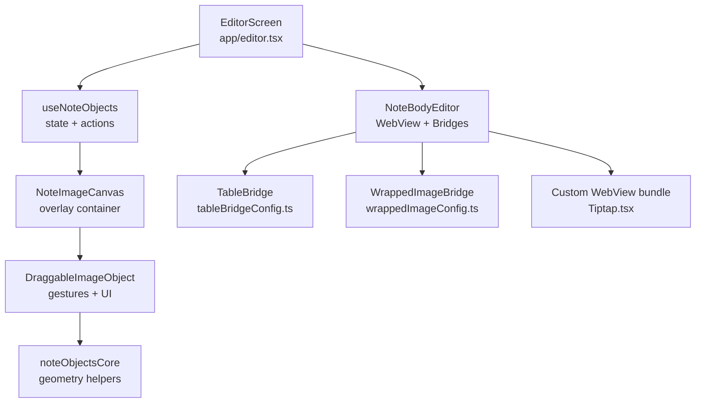
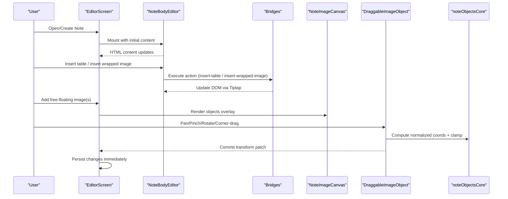
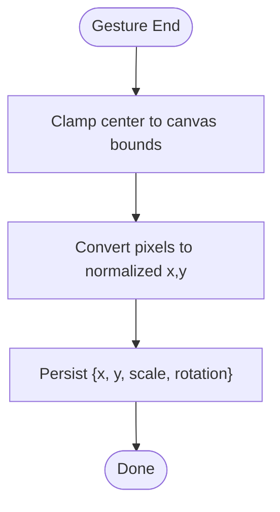
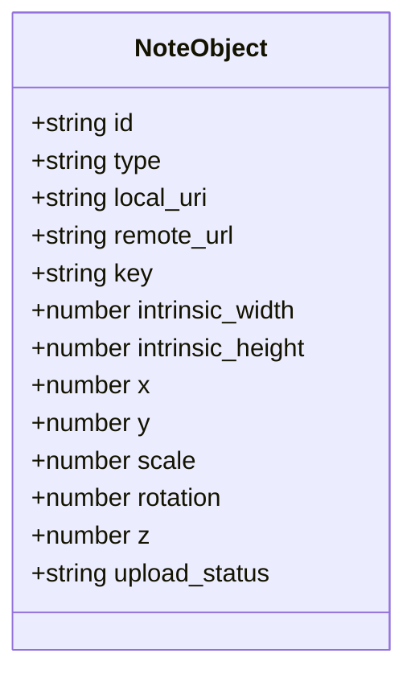
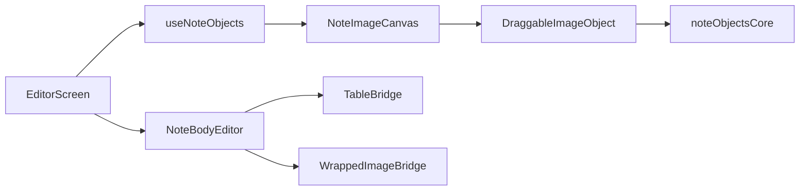

# Note Creation & Editing

<cite>
**Referenced Files in This Document**
- [editor.tsx](file://app/editor.tsx)
- [NoteImageCanvas.tsx](file://src/components/NoteImageCanvas.tsx)
- [DraggableImageObject.tsx](file://src/components/DraggableImageObject.tsx)
- [noteObjectsCore.ts](file://src/noteObjectsCore.ts)
- [useNoteObjects.ts](file://src/useNoteObjects.ts)
- [types.ts](file://src/types.ts)
- [customEditorHtml.ts](file://src/editor/customEditorHtml.ts)
- [Tiptap.tsx](file://webEditor/Tiptap.tsx)
- [tableBridgeConfig.ts](file://src/editor/tableBridgeConfig.ts)
- [wrappedImageConfig.ts](file://src/editor/wrappedImageConfig.ts)
</cite>

## Table of Contents
1. [Introduction](#introduction)
2. [Project Structure](#project-structure)
3. [Core Components](#core-components)
4. [Architecture Overview](#architecture-overview)
5. [Detailed Component Analysis](#detailed-component-analysis)
6. [Dependency Analysis](#dependency-analysis)
7. [Performance Considerations](#performance-considerations)
8. [Troubleshooting Guide](#troubleshooting-guide)
9. [Conclusion](#conclusion)

## Introduction
This document explains how notes are created and edited with a rich text editor that supports formatted content, tables, and images. It focuses on two complementary image systems:
- Text-wrapped images inside the note body (rendered by the WebView-based editor).
- Free-floating image objects layered over the note via a canvas overlay, supporting drag-and-drop positioning, pinch scaling, rotation, and corner resize with aspect ratio preservation.

It also details normalized coordinate geometry for stable cross-device layouts and provides examples for creating notes with embedded images, manipulating positions/sizes, and using gesture interactions.

## Project Structure
The note editor spans React Native screens, a WebView-based rich text editor, and a native canvas overlay for free-floating objects. Key areas:
- Editor screen orchestrates state, persistence, and bridges to the WebView.
- Rich text editor uses custom bridges for tables and wrapped images.
- Canvas overlay renders draggable image objects with gesture-driven transforms.
- Geometry helpers compute normalized coordinates and display dimensions.

**Diagram sources**
- [editor.tsx:464-589](file://app/editor.tsx#L464-L589)
- [Tiptap.tsx:32-52](file://webEditor/Tiptap.tsx#L32-L52)
- [tableBridgeConfig.ts:46-86](file://src/editor/tableBridgeConfig.ts#L46-L86)
- [wrappedImageConfig.ts:253-297](file://src/editor/wrappedImageConfig.ts#L253-L297)
- [NoteImageCanvas.tsx:31-67](file://src/components/NoteImageCanvas.tsx#L31-L67)
- [DraggableImageObject.tsx:78-268](file://src/components/DraggableImageObject.tsx#L78-L268)
- [noteObjectsCore.ts:16-121](file://src/noteObjectsCore.ts#L16-L121)

**Section sources**
- [editor.tsx:464-589](file://app/editor.tsx#L464-L589)
- [Tiptap.tsx:32-52](file://webEditor/Tiptap.tsx#L32-L52)
- [tableBridgeConfig.ts:46-86](file://src/editor/tableBridgeConfig.ts#L46-L86)
- [wrappedImageConfig.ts:253-297](file://src/editor/wrappedImageConfig.ts#L253-L297)
- [NoteImageCanvas.tsx:31-67](file://src/components/NoteImageCanvas.tsx#L31-L67)
- [DraggableImageObject.tsx:78-268](file://src/components/DraggableImageObject.tsx#L78-L268)
- [noteObjectsCore.ts:16-121](file://src/noteObjectsCore.ts#L16-L121)

## Core Components
- Editor screen: mounts the rich text editor, manages note metadata, attachments, and integrates both wrapped images and free-floating objects.
- Rich text editor: WebView-based editor with custom bridges for tables and wrapped images; includes a custom web bundle to include extensions.
- Free-floating object system: canvas overlay with draggable, pinchable, rotatable images; geometry helpers ensure consistent sizing and clamping.
- State hook: handles adding images, selecting, transforming, and deleting objects; persists changes immediately.

**Section sources**
- [editor.tsx:464-589](file://app/editor.tsx#L464-L589)
- [Tiptap.tsx:32-52](file://webEditor/Tiptap.tsx#L32-L52)
- [tableBridgeConfig.ts:46-86](file://src/editor/tableBridgeConfig.ts#L46-L86)
- [wrappedImageConfig.ts:253-297](file://src/editor/wrappedImageConfig.ts#L253-L297)
- [useNoteObjects.ts:23-130](file://src/useNoteObjects.ts#L23-L130)
- [NoteImageCanvas.tsx:31-67](file://src/components/NoteImageCanvas.tsx#L31-L67)
- [DraggableImageObject.tsx:78-268](file://src/components/DraggableImageObject.tsx#L78-L268)
- [noteObjectsCore.ts:16-121](file://src/noteObjectsCore.ts#L16-L121)

## Architecture Overview
The editor composes three layers:
- Content layer: WebView-based rich text editor with bridges for tables and wrapped images.
- Overlay layer: A relative region that measures layout and hosts absolute-positioned free-floating image objects.
- Geometry layer: Pure math functions for normalized coordinates, display sizing, and clamping.

**Diagram sources**
- [editor.tsx:464-589](file://app/editor.tsx#L464-L589)
- [tableBridgeConfig.ts:46-86](file://src/editor/tableBridgeConfig.ts#L46-L86)
- [wrappedImageConfig.ts:253-297](file://src/editor/wrappedImageConfig.ts#L253-L297)
- [NoteImageCanvas.tsx:31-67](file://src/components/NoteImageCanvas.tsx#L31-L67)
- [DraggableImageObject.tsx:121-133](file://src/components/DraggableImageObject.tsx#L121-L133)
- [noteObjectsCore.ts:26-35](file://src/noteObjectsCore.ts#L26-L35)

## Detailed Component Analysis

### Rich Text Editor Implementation
- The editor is mounted with a custom WebView bundle that includes bridges for tables and wrapped images.
- Tables: A minimal mobile-friendly set of actions (insert, add row/column, delete row/column, delete table) with touch-friendly CSS.
- Wrapped images: A custom node type that floats left/right or fills full width; resizing adjusts width while preserving aspect ratio via height:auto.

Key behaviors:
- Inserting a wrapped image appends it at the end of the document unless the note is empty, where it becomes block-level full width.
- Resize handle allows converting from full-width to a floated wrap image by dragging.
- CSS ensures responsive rendering and proper spacing around wrapped images.

**Section sources**
- [Tiptap.tsx:32-52](file://webEditor/Tiptap.tsx#L32-L52)
- [tableBridgeConfig.ts:46-86](file://src/editor/tableBridgeConfig.ts#L46-L86)
- [wrappedImageConfig.ts:62-126](file://src/editor/wrappedImageConfig.ts#L62-L126)
- [wrappedImageConfig.ts:128-247](file://src/editor/wrappedImageConfig.ts#L128-L247)
- [wrappedImageConfig.ts:253-297](file://src/editor/wrappedImageConfig.ts#L253-L297)

### Free-Floating Image Objects: Gestures and Rendering
- DraggableImageObject composes pan, pinch, and rotation gestures simultaneously, updating shared values for smooth UI-thread performance.
- On gesture end, transforms are clamped and converted to normalized coordinates for persistence.
- Corner handles enable proportional resize independent of two-finger pinch.
- Selection outlines and delete handles appear when an object is selected.

Rendering model:
- Each object’s layout box is centered so translateX/Y map directly to center position.
- Transform order: translate, rotate, scale.
- A padded halo provides visual breathing room without true text wrap.

**Section sources**
- [DraggableImageObject.tsx:78-268](file://src/components/DraggableImageObject.tsx#L78-L268)
- [NoteImageCanvas.tsx:31-67](file://src/components/NoteImageCanvas.tsx#L31-L67)

### Geometry: Normalized Coordinates and Display Dimensions
- Positions are stored as normalized 0..1 values relative to canvas width for both axes, ensuring consistent proportions across devices.
- Display dimensions derive from intrinsic aspect ratio and a base width fraction scaled by current scale factor.
- Clamping keeps at least a minimum visible portion within the canvas after drag ends.
- Corner drag computes uniform scale based on projected movement along the corner’s diagonal direction, accounting for current rotation.

**Diagram sources**
- [DraggableImageObject.tsx:121-133](file://src/components/DraggableImageObject.tsx#L121-L133)
- [noteObjectsCore.ts:26-35](file://src/noteObjectsCore.ts#L26-L35)
- [noteObjectsCore.ts:75-89](file://src/noteObjectsCore.ts#L75-L89)

**Section sources**
- [noteObjectsCore.ts:16-121](file://src/noteObjectsCore.ts#L16-L121)

### Note Object Model and Lifecycle
- NoteObject represents a free-floating image with id, intrinsic dimensions, normalized position, scale, rotation, z-index, and upload status.
- useNoteObjects manages adding images from camera/gallery, selecting objects, committing transforms, and deleting objects.
- Multi-select adds staggered positions to avoid overlap and assigns increasing z-index values.

**Diagram sources**
- [types.ts:16-33](file://src/types.ts#L16-L33)

**Section sources**
- [useNoteObjects.ts:23-130](file://src/useNoteObjects.ts#L23-L130)
- [types.ts:16-33](file://src/types.ts#L16-L33)

### Editor Integration and Persistence
- The editor screen wires up the rich text editor and the free-floating object system.
- Changes to the note body (HTML) are debounced and persisted.
- Free-floating object transforms are committed immediately upon gesture end.
- The custom WebView bundle includes necessary bridges so actions like inserting tables and wrapped images work inside the WebView.

**Section sources**
- [editor.tsx:464-589](file://app/editor.tsx#L464-L589)
- [customEditorHtml.ts:1-5](file://src/editor/customEditorHtml.ts#L1-L5)

## Dependency Analysis
- Editor depends on:
  - WebView-based rich text editor with custom bridges.
  - Canvas overlay for free-floating objects.
  - Geometry helpers for consistent calculations.
- Bridges depend on shared configuration files for actions and rendering.
- DraggableImageObject depends on gesture handlers and reanimated shared values.

**Diagram sources**
- [editor.tsx:464-589](file://app/editor.tsx#L464-L589)
- [useNoteObjects.ts:23-130](file://src/useNoteObjects.ts#L23-L130)
- [NoteImageCanvas.tsx:31-67](file://src/components/NoteImageCanvas.tsx#L31-L67)
- [DraggableImageObject.tsx:78-268](file://src/components/DraggableImageObject.tsx#L78-L268)
- [noteObjectsCore.ts:16-121](file://src/noteObjectsCore.ts#L16-L121)
- [tableBridgeConfig.ts:46-86](file://src/editor/tableBridgeConfig.ts#L46-L86)
- [wrappedImageConfig.ts:253-297](file://src/editor/wrappedImageConfig.ts#L253-L297)

**Section sources**
- [editor.tsx:464-589](file://app/editor.tsx#L464-L589)
- [useNoteObjects.ts:23-130](file://src/useNoteObjects.ts#L23-L130)
- [NoteImageCanvas.tsx:31-67](file://src/components/NoteImageCanvas.tsx#L31-L67)
- [DraggableImageObject.tsx:78-268](file://src/components/DraggableImageObject.tsx#L78-L268)
- [noteObjectsCore.ts:16-121](file://src/noteObjectsCore.ts#L16-L121)
- [tableBridgeConfig.ts:46-86](file://src/editor/tableBridgeConfig.ts#L46-L86)
- [wrappedImageConfig.ts:253-297](file://src/editor/wrappedImageConfig.ts#L253-L297)

## Performance Considerations
- Gesture-driven transforms use shared values to avoid React state churn during interactions.
- Layout box size is computed once per canvas/intrinsic-size change; pinch scaling applies only via transform, preventing mid-gesture layout passes.
- Normalized coordinates decouple storage from device-specific pixel sizes, reducing drift across rotations and screen sizes.
- Debounced HTML updates prevent excessive writes while typing.

[No sources needed since this section provides general guidance]

## Troubleshooting Guide
Common issues and resolutions:
- Images not appearing in WebView: Ensure wrapped images are inserted via the bridge and that the custom WebView bundle includes the necessary bridges.
- Wrapped image not wrapping text: Confirm align mode and CSS margins; dragging the resize handle can convert full-width to a floated wrap image.
- Free-floating object disappears after drag: Check clamping logic and canvas dimensions; ensure commit converts to normalized coordinates correctly.
- Rotation feels off: Verify transform order (translate, rotate, scale) and that corner resize accounts for current rotation.
- Multi-select overlap: Staggered initial positions help; adjust offsets if needed.

**Section sources**
- [wrappedImageConfig.ts:128-247](file://src/editor/wrappedImageConfig.ts#L128-L247)
- [DraggableImageObject.tsx:121-133](file://src/components/DraggableImageObject.tsx#L121-L133)
- [noteObjectsCore.ts:75-89](file://src/noteObjectsCore.ts#L75-L89)

## Conclusion
The note creation and editing system combines a robust WebView-based rich text editor with a native canvas overlay for free-floating images. Tables and wrapped images integrate seamlessly into the note body, while free-floating objects provide advanced manipulation with gesture support. Geometry helpers ensure consistent behavior across devices, and immediate persistence maintains data integrity.

[No sources needed since this section summarizes without analyzing specific files]

## Appendices

### Examples

#### Creating a Note with Embedded Images
- Use the editor’s toolbar to insert tables and wrapped images.
- For free-floating images, add them via the image picker flow; they render as overlays with drag/pinch/rotate capabilities.

**Section sources**
- [tableBridgeConfig.ts:46-86](file://src/editor/tableBridgeConfig.ts#L46-L86)
- [wrappedImageConfig.ts:253-297](file://src/editor/wrappedImageConfig.ts#L253-L297)
- [useNoteObjects.ts:38-85](file://src/useNoteObjects.ts#L38-L85)

#### Manipulating Image Positions and Sizes
- Drag to move, pinch to scale uniformly, rotate with two fingers, and use corner handles for proportional resize.
- All transformations are clamped to keep objects reachable and preserve aspect ratios.

**Section sources**
- [DraggableImageObject.tsx:135-197](file://src/components/DraggableImageObject.tsx#L135-L197)
- [noteObjectsCore.ts:42-52](file://src/noteObjectsCore.ts#L42-L52)
- [noteObjectsCore.ts:97-116](file://src/noteObjectsCore.ts#L97-L116)

#### Working with Gesture-Based Interactions
- Simultaneous pan, pinch, and rotation gestures update shared values for smooth UI.
- On gesture end, transforms are committed and persisted immediately.

**Section sources**
- [DraggableImageObject.tsx:135-178](file://src/components/DraggableImageObject.tsx#L135-L178)
- [DraggableImageObject.tsx:121-133](file://src/components/DraggableImageObject.tsx#L121-L133)