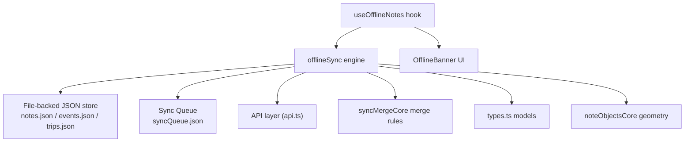
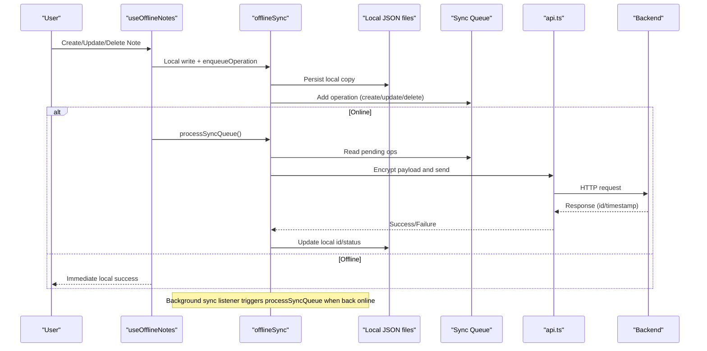
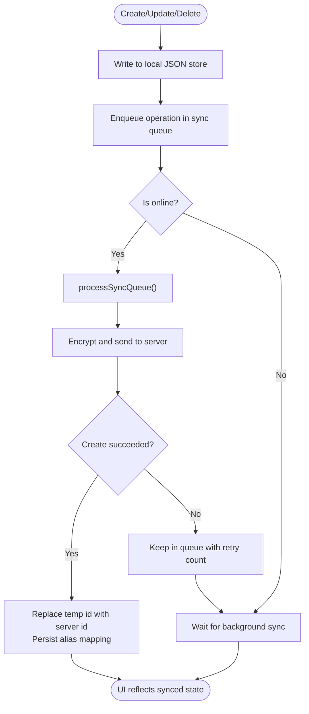
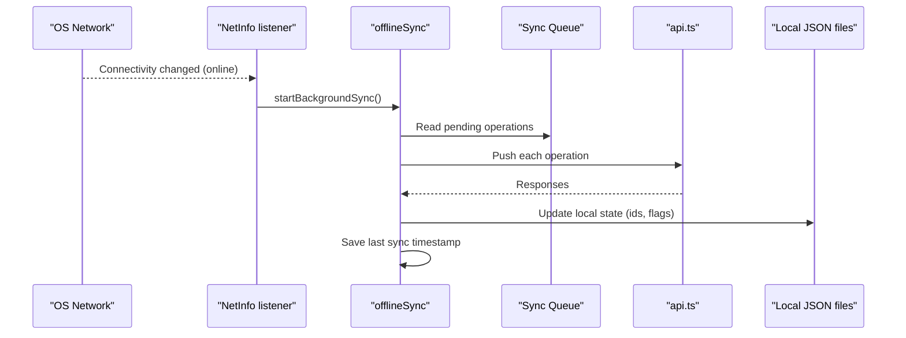
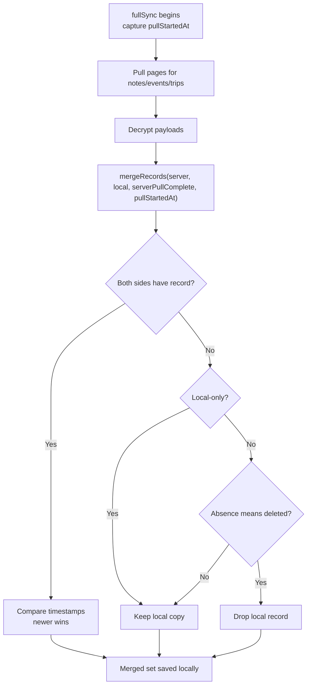
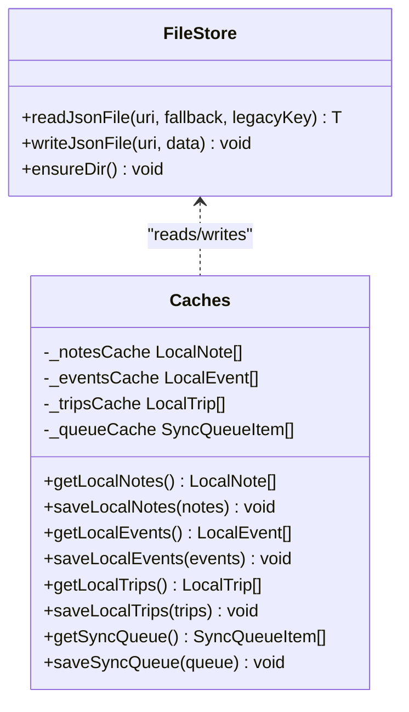
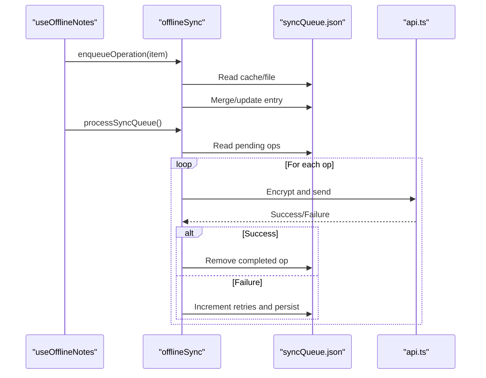
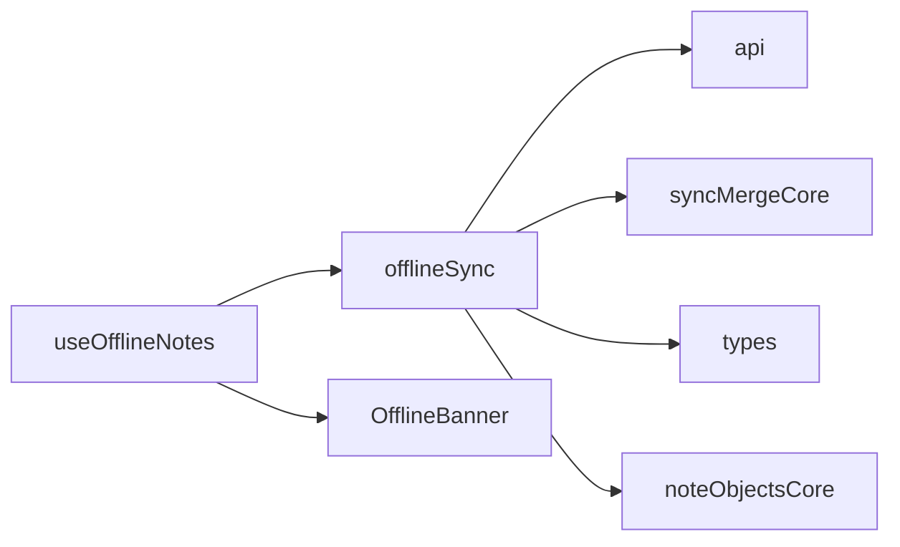

# Note Lifecycle & Synchronization

<cite>
**Referenced Files in This Document**
- [useOfflineNotes.ts](file://src/useOfflineNotes.ts)
- [offlineSync.ts](file://src/offlineSync.ts)
- [syncMergeCore.ts](file://src/syncMergeCore.ts)
- [api.ts](file://src/api.ts)
- [types.ts](file://src/types.ts)
- [noteObjectsCore.ts](file://src/noteObjectsCore.ts)
- [OfflineBanner.tsx](file://src/components/OfflineBanner.tsx)
</cite>

## Table of Contents
1. Introduction
2. Project Structure
3. Core Components
4. Architecture Overview
5. Detailed Component Analysis
6. Dependency Analysis
7. Performance Considerations
8. Troubleshooting Guide
9. Conclusion

## Introduction
This document explains the complete lifecycle of notes from creation to synchronization, focusing on the offline-first architecture that allows users to create and edit notes without internet connectivity. It details how background synchronization automatically pushes changes when connectivity is available, how conflicts are resolved when multiple devices modify the same note, and how data persistence and sync queue management ensure reliability. It also provides practical guidance for working with notes offline, interpreting sync status indicators, and troubleshooting synchronization issues.

## Project Structure
The note system spans several modules:
- UI hooks for offline-aware CRUD and sync orchestration
- Offline sync engine for local storage, queueing, and network reconciliation
- Merge logic for conflict resolution between server and local states
- API layer for authenticated requests, paging, and token refresh
- Types defining note objects and relationships
- Geometry utilities for free-floating image objects in notes
- UI banner indicating sync status

**Diagram sources**
- [useOfflineNotes.ts:40-213](file://src/useOfflineNotes.ts#L40-L213)
- [offlineSync.ts:112-193](file://src/offlineSync.ts#L112-L193)
- [offlineSync.ts:365-415](file://src/offlineSync.ts#L365-L415)
- [offlineSync.ts:785-1071](file://src/offlineSync.ts#L785-L1071)
- [syncMergeCore.ts:16-139](file://src/syncMergeCore.ts#L16-L139)
- [api.ts:140-220](file://src/api.ts#L140-L220)
- [types.ts:16-48](file://src/types.ts#L16-L48)
- [noteObjectsCore.ts:1-122](file://src/noteObjectsCore.ts#L1-L122)
- [OfflineBanner.tsx:18-61](file://src/components/OfflineBanner.tsx#L18-L61)

**Section sources**
- [useOfflineNotes.ts:40-213](file://src/useOfflineNotes.ts#L40-L213)
- [offlineSync.ts:112-193](file://src/offlineSync.ts#L112-L193)
- [syncMergeCore.ts:16-139](file://src/syncMergeCore.ts#L16-L139)
- [api.ts:140-220](file://src/api.ts#L140-L220)
- [types.ts:16-48](file://src/types.ts#L16-L48)
- [noteObjectsCore.ts:1-122](file://src/noteObjectsCore.ts#L1-L122)
- [OfflineBanner.tsx:18-61](file://src/components/OfflineBanner.tsx#L18-L61)

## Core Components
- useOfflineNotes hook: Provides offline-first CRUD for notes and events, manages online state, triggers full sync on app foreground and after login, and coordinates background sync.
- offlineSync engine: Implements local file-backed storage, sync queue, background sync via NetInfo, full sync pull-and-merge, and per-entity operation processors.
- syncMergeCore: Defines deterministic conflict resolution using timestamps and completeness flags for paginated pulls.
- api.ts: Encapsulates authenticated HTTP calls, pagination, token refresh, and endpoints for notes/events/trips.
- types.ts: Defines core models like Note, CalendarEvent, Recurrence, and related structures.
- noteObjectsCore: Pure functions for normalized coordinates and scaling of free-floating images within notes.
- OfflineBanner: UI indicator that shows “Uploading your notes” or “Up to date” when connectivity returns.

**Section sources**
- [useOfflineNotes.ts:40-213](file://src/useOfflineNotes.ts#L40-L213)
- [offlineSync.ts:112-193](file://src/offlineSync.ts#L112-L193)
- [offlineSync.ts:365-415](file://src/offlineSync.ts#L365-L415)
- [offlineSync.ts:785-1071](file://src/offlineSync.ts#L785-L1071)
- [syncMergeCore.ts:16-139](file://src/syncMergeCore.ts#L16-L139)
- [api.ts:140-220](file://src/api.ts#L140-L220)
- [types.ts:16-48](file://src/types.ts#L16-L48)
- [noteObjectsCore.ts:1-122](file://src/noteObjectsCore.ts#L1-L122)
- [OfflineBanner.tsx:18-61](file://src/components/OfflineBanner.tsx#L18-L61)

## Architecture Overview
The system follows an offline-first pattern:
- All writes happen locally first and immediately update the UI.
- Changes are enqueued into a persistent sync queue.
- When online, the queue is processed to push changes to the server.
- Periodically or on connectivity change, a full sync pulls all collections, decrypts them, and merges with local state using newest-write-wins rules.
- Background sync listens to network state changes to resume queued operations automatically.

**Diagram sources**
- [useOfflineNotes.ts:146-201](file://src/useOfflineNotes.ts#L146-L201)
- [offlineSync.ts:388-415](file://src/offlineSync.ts#L388-L415)
- [offlineSync.ts:798-836](file://src/offlineSync.ts#L798-L836)
- [offlineSync.ts:838-928](file://src/offlineSync.ts#L838-L928)
- [api.ts:140-220](file://src/api.ts#L140-L220)

## Detailed Component Analysis

### Offline-first Note Creation and Editing
- Notes are created with temporary local IDs and marked as local-only until the server assigns a real ID.
- Updates stamp updated_at and enqueue either a create or update depending on whether the note has been synced yet.
- Deletes mark notes as pending delete locally so they disappear immediately; actual deletion is queued and executed when online.
- The editor can defer pushing to avoid swapping temp IDs mid-session; deferred ops flush on exit or background sync.

**Diagram sources**
- [offlineSync.ts:449-502](file://src/offlineSync.ts#L449-L502)
- [offlineSync.ts:509-537](file://src/offlineSync.ts#L509-L537)
- [offlineSync.ts:838-882](file://src/offlineSync.ts#L838-L882)
- [useOfflineNotes.ts:146-201](file://src/useOfflineNotes.ts#L146-L201)

**Section sources**
- [offlineSync.ts:449-502](file://src/offlineSync.ts#L449-L502)
- [offlineSync.ts:509-537](file://src/offlineSync.ts#L509-L537)
- [useOfflineNotes.ts:146-201](file://src/useOfflineNotes.ts#L146-L201)

### Background Synchronization
- A NetInfo listener starts once when the notes list mounts and triggers processSyncQueue whenever the device becomes connected and reachable.
- App foreground transitions trigger a forced full sync to reconcile any changes made while backgrounded.
- Full sync is throttled to avoid excessive network usage and JS thread contention.

**Diagram sources**
- [offlineSync.ts:1043-1070](file://src/offlineSync.ts#L1043-L1070)
- [offlineSync.ts:798-836](file://src/offlineSync.ts#L798-L836)
- [useOfflineNotes.ts:118-142](file://src/useOfflineNotes.ts#L118-L142)

**Section sources**
- [offlineSync.ts:1043-1070](file://src/offlineSync.ts#L1043-L1070)
- [useOfflineNotes.ts:118-142](file://src/useOfflineNotes.ts#L118-L142)

### Conflict Resolution Strategy
- Reconciliation uses newest-write-wins based on updated_at (or created_at fallback).
- Local-only records always survive until successfully pushed.
- Pending-delete records remain hidden even if the server still returns them; tombstones clear once the server confirms absence.
- Absence from server responses only means deletion when the pull is known to be complete and the record was not edited during the pull window.

**Diagram sources**
- [syncMergeCore.ts:16-139](file://src/syncMergeCore.ts#L16-L139)
- [offlineSync.ts:932-1037](file://src/offlineSync.ts#L932-L1037)

**Section sources**
- [syncMergeCore.ts:16-139](file://src/syncMergeCore.ts#L16-L139)
- [offlineSync.ts:932-1037](file://src/offlineSync.ts#L932-L1037)

### Data Persistence Layer
- Large collections (notes, events, trips, sync queue) are persisted to plain JSON files under a dedicated directory to avoid AsyncStorage CursorWindow size limits.
- In-memory caches mirror on-disk arrays to reduce repeated parsing overhead; caches are invalidated on writes and account deletion.
- Migration path supports legacy AsyncStorage keys by reading and migrating once to file-backed storage.

**Diagram sources**
- [offlineSync.ts:112-193](file://src/offlineSync.ts#L112-L193)
- [offlineSync.ts:329-363](file://src/offlineSync.ts#L329-L363)
- [offlineSync.ts:376-386](file://src/offlineSync.ts#L376-L386)

**Section sources**
- [offlineSync.ts:112-193](file://src/offlineSync.ts#L112-L193)
- [offlineSync.ts:329-363](file://src/offlineSync.ts#L329-L363)
- [offlineSync.ts:376-386](file://src/offlineSync.ts#L376-L386)

### Sync Queue Management
- Operations are enqueued with entity type, operation kind, payload, timestamp, and retry count.
- Duplicate operations for the same id are merged; deletes cancel prior creates for unsynced items.
- processSyncQueue runs serially, processes each item, and persists failed items with incremented retries up to a limit.

**Diagram sources**
- [offlineSync.ts:388-415](file://src/offlineSync.ts#L388-L415)
- [offlineSync.ts:798-836](file://src/offlineSync.ts#L798-L836)
- [offlineSync.ts:838-928](file://src/offlineSync.ts#L838-L928)

**Section sources**
- [offlineSync.ts:388-415](file://src/offlineSync.ts#L388-L415)
- [offlineSync.ts:798-836](file://src/offlineSync.ts#L798-L836)
- [offlineSync.ts:838-928](file://src/offlineSync.ts#L838-L928)

### Working with Notes in Offline Mode
- Create notes: Immediately saved locally with a temporary id; appears in the list instantly.
- Edit notes: Changes applied locally and enqueued; visible immediately; sync occurs when online.
- Delete notes: Marked as pending delete locally; removed from UI immediately; actual deletion queued.
- Use push:false for autosave scenarios to avoid swapping temp ids mid-session; deferred flush happens on exit/background sync.

**Section sources**
- [useOfflineNotes.ts:146-201](file://src/useOfflineNotes.ts#L146-L201)
- [offlineSync.ts:449-502](file://src/offlineSync.ts#L449-L502)
- [offlineSync.ts:509-537](file://src/offlineSync.ts#L509-L537)

### Understanding Sync Status Indicators
- Online flag: Indicates current connectivity state used to decide immediate push vs. queuing.
- Is syncing flag: Shows when processSyncQueue or fullSync is running.
- OfflineBanner: Displays “Uploading your notes” while syncing and “Up to date” when complete after coming back online.

**Section sources**
- [useOfflineNotes.ts:40-44](file://src/useOfflineNotes.ts#L40-L44)
- [useOfflineNotes.ts:93-110](file://src/useOfflineNotes.ts#L93-L110)
- [OfflineBanner.tsx:18-61](file://src/components/OfflineBanner.tsx#L18-L61)

### Free-Floating Image Objects in Notes
- Normalized coordinates keep layout consistent across devices by anchoring positions to canvas width.
- Scaling and clamping preserve aspect ratios and keep objects reachable within the canvas bounds.
- These utilities are pure and safe to call from UI threads.

**Section sources**
- [noteObjectsCore.ts:1-122](file://src/noteObjectsCore.ts#L1-L122)

## Dependency Analysis
- useOfflineNotes depends on offlineSync for data access, queueing, and sync orchestration.
- offlineSync depends on api.ts for network operations and syncMergeCore for reconciliation rules.
- Types define shared contracts for notes, events, and recurrence.
- OfflineBanner consumes online/isSyncing state from the hook to provide user feedback.

**Diagram sources**
- [useOfflineNotes.ts:18-36](file://src/useOfflineNotes.ts#L18-L36)
- [offlineSync.ts:12-26](file://src/offlineSync.ts#L12-L26)
- [api.ts:140-220](file://src/api.ts#L140-L220)
- [syncMergeCore.ts:16-139](file://src/syncMergeCore.ts#L16-L139)
- [types.ts:16-48](file://src/types.ts#L16-L48)
- [noteObjectsCore.ts:1-122](file://src/noteObjectsCore.ts#L1-L122)
- [OfflineBanner.tsx:18-61](file://src/components/OfflineBanner.tsx#L18-L61)

**Section sources**
- [useOfflineNotes.ts:18-36](file://src/useOfflineNotes.ts#L18-L36)
- [offlineSync.ts:12-26](file://src/offlineSync.ts#L12-L26)
- [api.ts:140-220](file://src/api.ts#L140-L220)
- [syncMergeCore.ts:16-139](file://src/syncMergeCore.ts#L16-L139)
- [types.ts:16-48](file://src/types.ts#L16-L48)
- [noteObjectsCore.ts:1-122](file://src/noteObjectsCore.ts#L1-L122)
- [OfflineBanner.tsx:18-61](file://src/components/OfflineBanner.tsx#L18-L61)

## Performance Considerations
- File-backed storage avoids AsyncStorage row-size limits for large note payloads with embedded images.
- In-memory caches reduce repeated JSON parse overhead across reads and merges.
- Full sync throttling prevents frequent resyncs from competing with UI transitions.
- Paged pulls fetch manageable page sizes to control memory and payload peaks.
- Fetch timeout prevents hung requests from blocking the entire sync pipeline.

[No sources needed since this section provides general guidance]

## Troubleshooting Guide
Common issues and resolutions:
- Stuck sync due to hung network request: The API layer enforces a fetch timeout to abort long-running requests and allow retries. If sync appears frozen, check network stability and logs for timeouts.
- Token expiration: On 401 responses, the API attempts a single-flight token refresh; if it fails, prompts re-login. Ensure refresh tokens are valid.
- Missing notes after sync: Verify that full sync completes and that serverPullComplete is true; incomplete pulls intentionally do not treat absence as deletion.
- Deleted notes reappear: Pending-delete tombstones prevent resurrection until the server confirms absence; ensure delete operations succeed and queue is processed.
- Recording links lost after restart: Alias mapping persists temp-to-server id swaps and repairs orphaned recording links at startup.

**Section sources**
- [api.ts:23-33](file://src/api.ts#L23-L33)
- [api.ts:74-121](file://src/api.ts#L74-L121)
- [offlineSync.ts:932-1037](file://src/offlineSync.ts#L932-L1037)
- [offlineSync.ts:270-327](file://src/offlineSync.ts#L270-L327)

## Conclusion
The note system implements a robust offline-first architecture with reliable persistence, resilient sync queues, and deterministic conflict resolution. Users can create, edit, and delete notes without connectivity, with automatic background synchronization ensuring consistency when online. The design balances performance and correctness through file-backed storage, caching, throttled full syncs, and careful handling of paginated pulls. With clear status indicators and safeguards against common pitfalls, the system provides a smooth experience across online and offline scenarios.