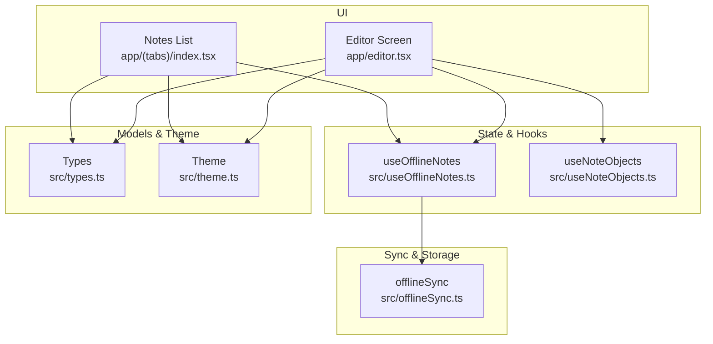
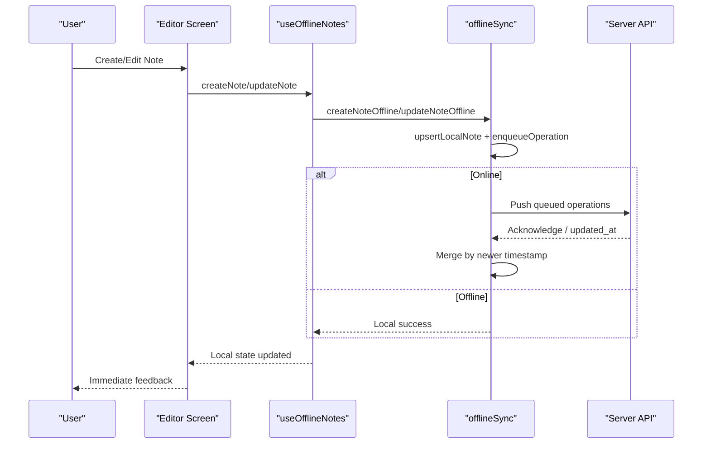
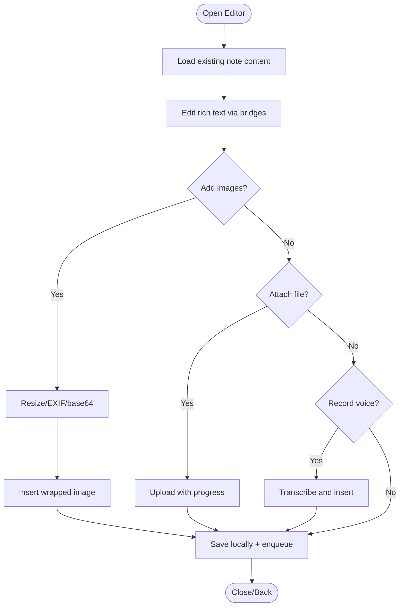
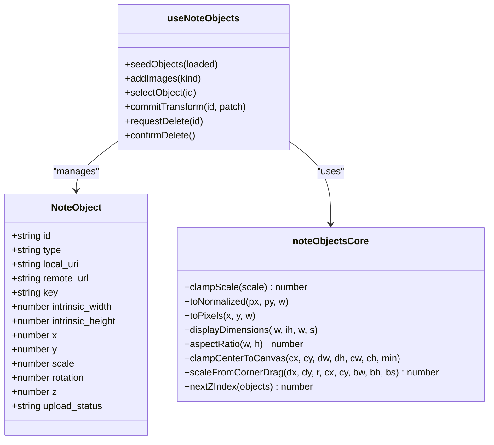
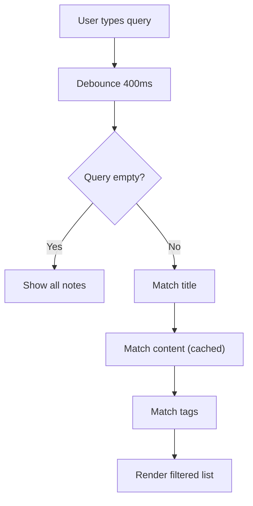
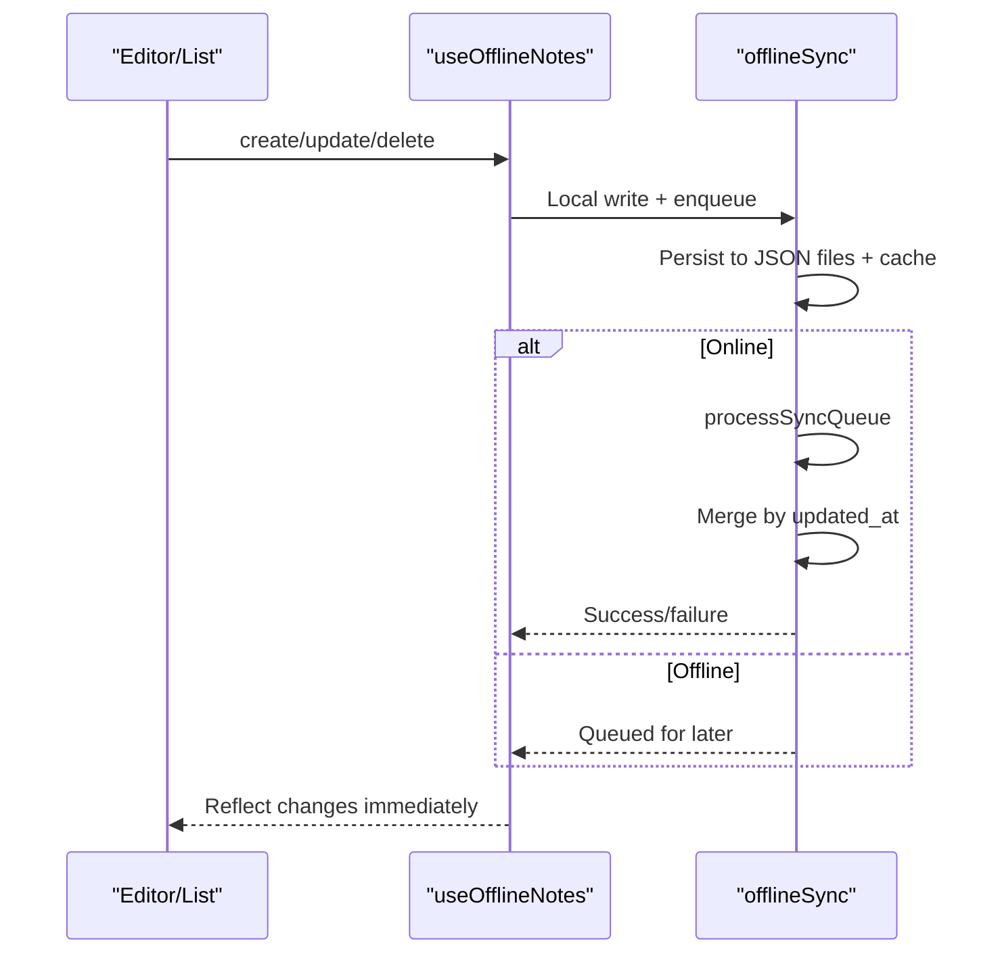
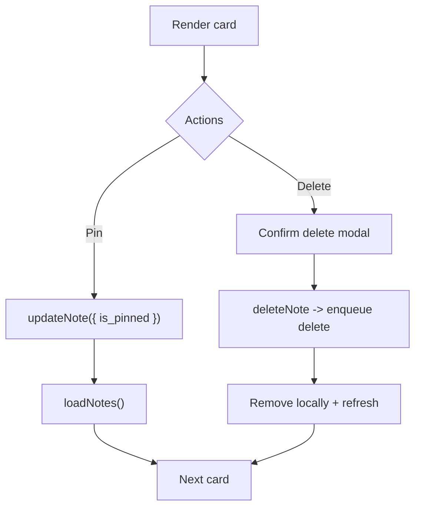
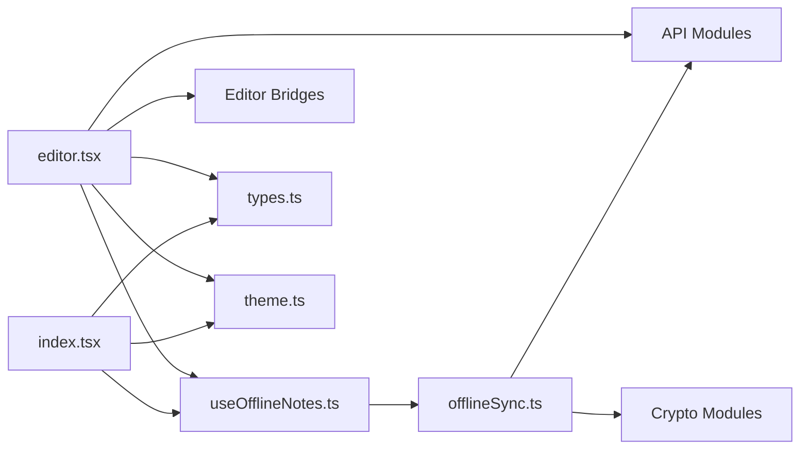

# Note Management

<cite>
**Referenced Files in This Document**
- [editor.tsx](file://app/editor.tsx)
- [index.tsx](file://app/(tabs)/index.tsx)
- [useOfflineNotes.ts](file://src/useOfflineNotes.ts)
- [offlineSync.ts](file://src/offlineSync.ts)
- [types.ts](file://src/types.ts)
- [theme.ts](file://src/theme.ts)
- [noteObjectsCore.ts](file://src/noteObjectsCore.ts)
- [useNoteObjects.ts](file://src/useNoteObjects.ts)
</cite>

## Table of Contents
1. Introduction
2. Project Structure
3. Core Components
4. Architecture Overview
5. Detailed Component Analysis
6. Dependency Analysis
7. Performance Considerations
8. Troubleshooting Guide
9. Conclusion
10. Appendices

## Introduction
This document explains the note management system with a focus on creating, editing, and organizing notes; rich text editing capabilities (including images, tables, and formatted content); tagging with color-coded tags and search; offline-first architecture; note lifecycle from creation to synchronization including conflict resolution; and user interface patterns for note cards, search filtering, and bulk operations. It also provides common workflows such as creating notes with attachments, organizing with tags, and searching across content.

## Project Structure
The note feature spans UI screens, hooks, sync engine, and editor bridges:
- Editor screen: Rich text editing, image handling, attachments, voice transcription, PDF import/export, and tag management.
- Notes list screen: Card rendering, search filtering, pinning, deletion, and linked event display.
- Offline hook: Local-first CRUD, background sync orchestration, and state management.
- Sync engine: File-backed persistence, sync queue, conflict resolution, and network reconciliation.
- Types and theme: Shared data models and design tokens including tag colors.
- Image objects: Free-floating image layering over the note body with geometry utilities.

**Diagram sources**
- [editor.tsx:44-58](file://app/editor.tsx#L44-L58)
- [index.tsx:19-27](file://app/(tabs)/index.tsx#L19-L27)
- [useOfflineNotes.ts:18-36](file://src/useOfflineNotes.ts#L18-L36)
- [useNoteObjects.ts:14-21](file://src/useNoteObjects.ts#L14-L21)
- [offlineSync.ts:12-26](file://src/offlineSync.ts#L12-L26)
- [types.ts:1-48](file://src/types.ts#L1-L48)
- [theme.ts:73-80](file://src/theme.ts#L73-L80)

**Section sources**
- [editor.tsx:44-58](file://app/editor.tsx#L44-L58)
- [index.tsx:19-27](file://app/(tabs)/index.tsx#L19-L27)
- [useOfflineNotes.ts:18-36](file://src/useOfflineNotes.ts#L18-L36)
- [offlineSync.ts:12-26](file://src/offlineSync.ts#L12-L26)
- [types.ts:1-48](file://src/types.ts#L1-L48)
- [theme.ts:73-80](file://src/theme.ts#L73-L80)

## Core Components
- Editor screen: Provides rich text editing via a WebView-based editor with custom bridges for tables, wrapped images, placeholders, and dynamic height measurement. Supports adding images (camera/gallery), file attachments, voice recording/transcription, PDF import, and exporting to PDF or sharing with embedded images and attachments.
- Notes list: Renders note cards with title/preview, thumbnails, pinned sections, attachment counts, linked events, and tags. Includes debounced search across title, content, and tags. Offers pin toggle and delete with confirmation modal.
- Offline hook: Wraps local-first CRUD, triggers background sync, manages online status, and optimizes re-renders by comparing layout/data signatures.
- Sync engine: Persists notes/events/trips to JSON files to avoid AsyncStorage limits, maintains a durable sync queue, enforces conflict resolution by timestamps, and reconciles with server when online.
- Image objects: Manages free-floating images layered over the note body with normalized coordinates, aspect-ratio-preserving scaling, rotation, and z-index ordering.
- Types and theme: Defines shared models like Tag, Attachment, NoteObject, and provides color tokens including tag colors.

**Section sources**
- [editor.tsx:213-232](file://app/editor.tsx#L213-L232)
- [editor.tsx:456-462](file://app/editor.tsx#L456-L462)
- [editor.tsx:592-639](file://app/editor.tsx#L592-L639)
- [index.tsx:191-205](file://app/(tabs)/index.tsx#L191-L205)
- [index.tsx:428-446](file://app/(tabs)/index.tsx#L428-L446)
- [useOfflineNotes.ts:40-116](file://src/useOfflineNotes.ts#L40-L116)
- [offlineSync.ts:122-193](file://src/offlineSync.ts#L122-L193)
- [offlineSync.ts:388-415](file://src/offlineSync.ts#L388-L415)
- [useNoteObjects.ts:23-85](file://src/useNoteObjects.ts#L23-L85)
- [noteObjectsCore.ts:16-52](file://src/noteObjectsCore.ts#L16-L52)
- [types.ts:1-48](file://src/types.ts#L1-L48)
- [theme.ts:73-80](file://src/theme.ts#L73-L80)

## Architecture Overview
The system follows an offline-first pattern: edits are written locally first, then queued for background sync. The editor composes rich content and persists changes through the offline hook. The notes list renders cached data immediately and refreshes after sync. Conflict resolution uses timestamps to decide which version wins during merges.

**Diagram sources**
- [editor.tsx:44-58](file://app/editor.tsx#L44-L58)
- [useOfflineNotes.ts:146-161](file://src/useOfflineNotes.ts#L146-L161)
- [offlineSync.ts:419-502](file://src/offlineSync.ts#L419-L502)
- [offlineSync.ts:798-800](file://src/offlineSync.ts#L798-L800)

## Detailed Component Analysis

### Rich Text Editor and Content Handling
- Bridges: Custom extensions enable table insertion, wrapped images, placeholder behavior, and accurate content height reporting.
- Image handling: Prepares inline images with EXIF correction and size caps; supports camera/gallery picks and sketch exports.
- Attachments: Uploads files with progress tracking; supports multiple formats aligned with backend allowlist.
- Voice and transcription: Records audio, segments silence, transcribes, and inserts results into the note body.
- Export/share: Builds printable HTML for PDF export and shares combined text plus embedded images and attachments.

**Diagram sources**
- [editor.tsx:117-144](file://app/editor.tsx#L117-L144)
- [editor.tsx:146-211](file://app/editor.tsx#L146-L211)
- [editor.tsx:456-462](file://app/editor.tsx#L456-L462)
- [editor.tsx:283-438](file://app/editor.tsx#L283-L438)

**Section sources**
- [editor.tsx:117-144](file://app/editor.tsx#L117-L144)
- [editor.tsx:146-211](file://app/editor.tsx#L146-L211)
- [editor.tsx:283-438](file://app/editor.tsx#L283-L438)
- [editor.tsx:456-462](file://app/editor.tsx#L456-L462)

### Free-Floating Image Objects
- Adds images as draggable, scalable, rotatable overlays with normalized coordinates relative to canvas width.
- Geometry utilities ensure consistent aspect ratios, clamped scales, and reachable positions within the canvas.
- Selection brings objects to front; multi-select staggers placement; transforms persist immediately.

**Diagram sources**
- [types.ts:16-33](file://src/types.ts#L16-L33)
- [useNoteObjects.ts:23-129](file://src/useNoteObjects.ts#L23-L129)
- [noteObjectsCore.ts:16-121](file://src/noteObjectsCore.ts#L16-L121)

**Section sources**
- [useNoteObjects.ts:23-129](file://src/useNoteObjects.ts#L23-L129)
- [noteObjectsCore.ts:16-121](file://src/noteObjectsCore.ts#L16-L121)
- [types.ts:16-33](file://src/types.ts#L16-L33)

### Tags and Search
- Tags: Color-coded chips rendered per note; colors defined centrally.
- Search: Debounced input filters notes by title, plain-text content, and tag names; preview and thumbnail derived efficiently with caching.

**Diagram sources**
- [index.tsx:221-231](file://app/(tabs)/index.tsx#L221-L231)
- [index.tsx:428-446](file://app/(tabs)/index.tsx#L428-L446)
- [theme.ts:73-80](file://src/theme.ts#L73-L80)

**Section sources**
- [index.tsx:221-231](file://app/(tabs)/index.tsx#L221-L231)
- [index.tsx:428-446](file://app/(tabs)/index.tsx#L428-L446)
- [theme.ts:73-80](file://src/theme.ts#L73-L80)

### Offline-First Lifecycle and Synchronization
- Creation: Generates a temporary local ID, writes locally, enqueues a create operation, and pushes if online.
- Updates: Merges into stored note, updates timestamp, enqueues update or merge into pending create if still local.
- Deletion: Marks pending-delete locally for immediate UI removal; enqueues delete; removes locally after successful push.
- Conflict resolution: Uses newer timestamps to resolve conflicts during full sync and local upserts.
- Queue: File-backed JSON storage avoids AsyncStorage row-size limits; cache reduces repeated parsing overhead.

**Diagram sources**
- [useOfflineNotes.ts:146-201](file://src/useOfflineNotes.ts#L146-L201)
- [offlineSync.ts:419-537](file://src/offlineSync.ts#L419-L537)
- [offlineSync.ts:388-415](file://src/offlineSync.ts#L388-L415)
- [offlineSync.ts:122-193](file://src/offlineSync.ts#L122-L193)

**Section sources**
- [useOfflineNotes.ts:146-201](file://src/useOfflineNotes.ts#L146-L201)
- [offlineSync.ts:419-537](file://src/offlineSync.ts#L419-L537)
- [offlineSync.ts:388-415](file://src/offlineSync.ts#L388-L415)
- [offlineSync.ts:122-193](file://src/offlineSync.ts#L122-L193)

### Note Cards and Bulk Operations
- Cards show title, preview, thumbnail, attachment count, linked event info, tags, and time labels.
- Pin toggle and delete actions are handled via offline-first paths to ensure consistency.
- Pinned notes render in a dedicated section; search filters across both sections.

**Diagram sources**
- [index.tsx:448-482](file://app/(tabs)/index.tsx#L448-L482)
- [index.tsx:489-604](file://app/(tabs)/index.tsx#L489-L604)
- [useOfflineNotes.ts:152-201](file://src/useOfflineNotes.ts#L152-L201)

**Section sources**
- [index.tsx:448-482](file://app/(tabs)/index.tsx#L448-L482)
- [index.tsx:489-604](file://app/(tabs)/index.tsx#L489-L604)
- [useOfflineNotes.ts:152-201](file://src/useOfflineNotes.ts#L152-L201)

## Dependency Analysis
- Editor depends on bridges and APIs for rich content and attachments; integrates with offlineSync via the hook for persistence.
- Notes list depends on useOfflineNotes for data and actions; uses offlineSync for queue inspection and event resolution.
- Offline hook orchestrates offlineSync functions for CRUD and sync; listens to app state and auth readiness.
- Sync engine depends on crypto modules for encryption/decryption and API modules for network calls.
- Types and theme provide shared contracts and visual tokens used across components.

**Diagram sources**
- [editor.tsx:44-58](file://app/editor.tsx#L44-L58)
- [index.tsx:19-27](file://app/(tabs)/index.tsx#L19-L27)
- [useOfflineNotes.ts:18-36](file://src/useOfflineNotes.ts#L18-L36)
- [offlineSync.ts:12-26](file://src/offlineSync.ts#L12-L26)
- [types.ts:1-48](file://src/types.ts#L1-L48)
- [theme.ts:73-80](file://src/theme.ts#L73-L80)

**Section sources**
- [editor.tsx:44-58](file://app/editor.tsx#L44-L58)
- [index.tsx:19-27](file://app/(tabs)/index.tsx#L19-L27)
- [useOfflineNotes.ts:18-36](file://src/useOfflineNotes.ts#L18-L36)
- [offlineSync.ts:12-26](file://src/offlineSync.ts#L12-L26)
- [types.ts:1-48](file://src/types.ts#L1-L48)
- [theme.ts:73-80](file://src/theme.ts#L73-L80)

## Performance Considerations
- Avoid large reads/writes blocking UI: File-backed JSON stores prevent AsyncStorage row-size issues; caches reduce repeated parsing.
- Minimize re-renders: Use signature comparison to gate layout animations and setNotes; memoize derived card text and thumbnails.
- Efficient search: Debounce input; precompute plain-text haystack once per note and cache results.
- Image handling: Cap dimensions and compress inline images to reduce payload sizes; reuse prepared URIs where possible.
- Background sync throttling: Throttle full syncs to avoid competing with transitions; run only when necessary.

[No sources needed since this section provides general guidance]

## Troubleshooting Guide
- Images not appearing in share sheet: Ensure embedded images are converted to base64 and written to temp files before sharing.
- Attachments failing to download: Verify URLs and permissions; handle errors gracefully without breaking share flow.
- Sync failures: Check online status; review queue items; retry via background sync or manual pull-to-refresh.
- Deleted notes lingering: Confirm pending-delete flag is set and queue processed; verify local removal after successful push.
- Large library jank: Rely on FlatList windowing and memoized computations; avoid heavy work on every render.

**Section sources**
- [editor.tsx:146-211](file://app/editor.tsx#L146-L211)
- [index.tsx:611-622](file://app/(tabs)/index.tsx#L611-L622)
- [useOfflineNotes.ts:93-116](file://src/useOfflineNotes.ts#L93-L116)
- [offlineSync.ts:388-415](file://src/offlineSync.ts#L388-L415)

## Conclusion
The note management system delivers a robust, offline-first experience with rich editing, flexible organization via tags, efficient search, and reliable synchronization with conflict resolution. The modular architecture separates concerns between UI, state, sync, and models, enabling maintainability and performance at scale.

[No sources needed since this section summarizes without analyzing specific files]

## Appendices

### Common Workflows

- Create a note with attachments
  - Open editor, add images or files, save; changes are persisted locally and synced when online.
  - References: [editor.tsx:117-211](file://app/editor.tsx#L117-L211), [useOfflineNotes.ts:146-161](file://src/useOfflineNotes.ts#L146-L161), [offlineSync.ts:419-469](file://src/offlineSync.ts#L419-L469)

- Organize with tags
  - Assign color-coded tags in the editor; filter notes by tag name in the list.
  - References: [theme.ts:73-80](file://src/theme.ts#L73-L80), [index.tsx:428-446](file://app/(tabs)/index.tsx#L428-L446)

- Search across content
  - Type in the search box; results match title, content, and tags with debounced queries.
  - References: [index.tsx:221-231](file://app/(tabs)/index.tsx#L221-L231), [index.tsx:428-446](file://app/(tabs)/index.tsx#L428-L446)

- Export or share a note
  - Generate PDF or share with embedded images and attachments; handles platform-specific requirements.
  - References: [editor.tsx:283-438](file://app/editor.tsx#L283-L438), [editor.tsx:146-211](file://app/editor.tsx#L146-L211)