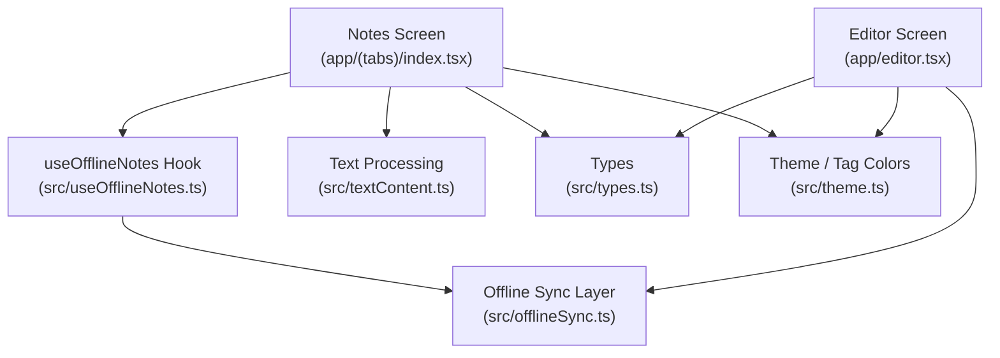
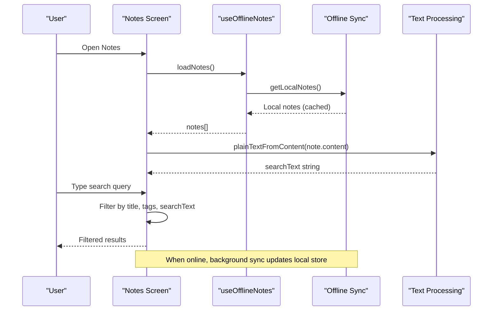
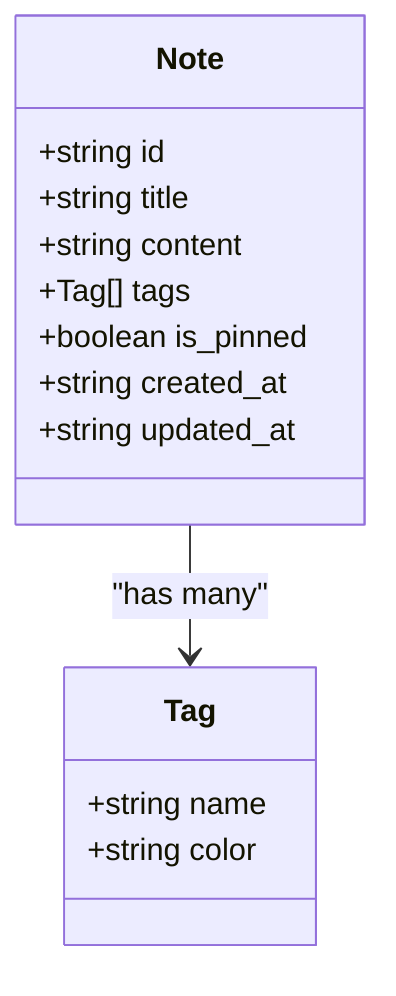
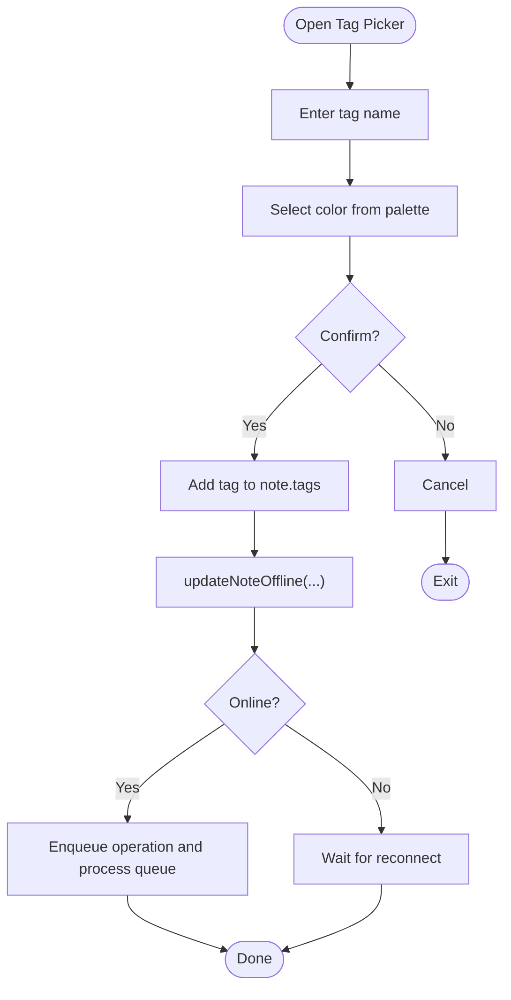
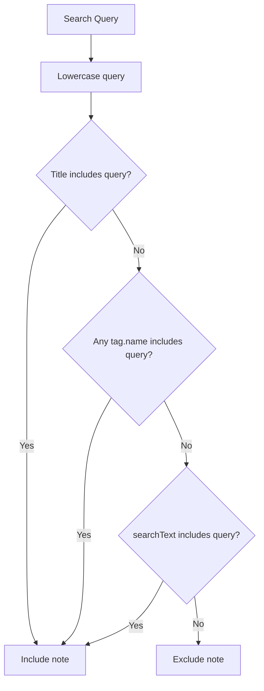
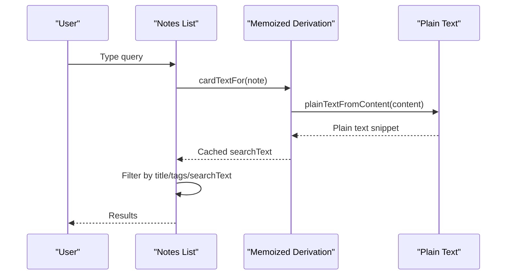
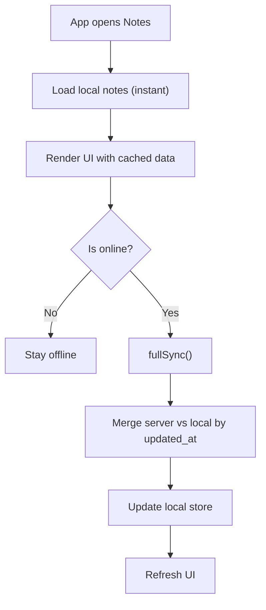
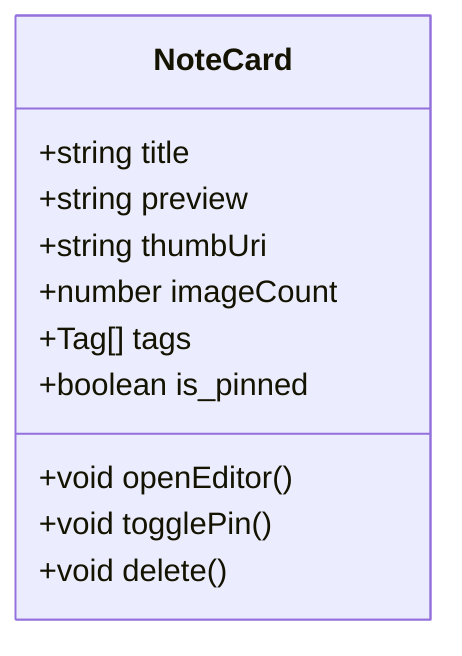
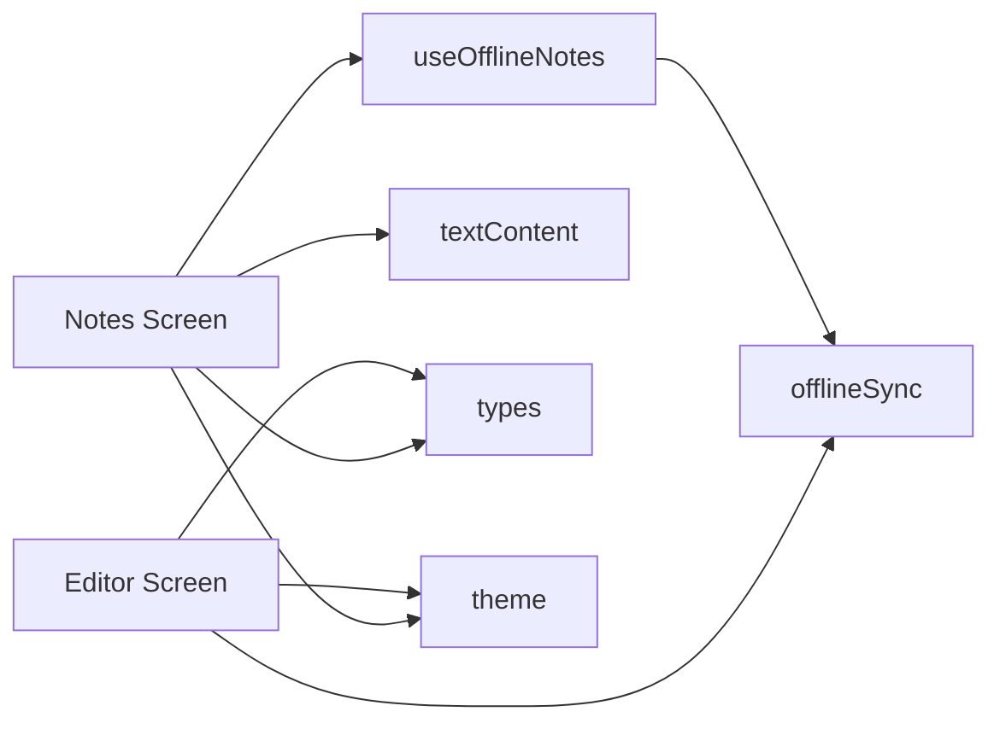

# Note Organization & Search

<cite>
**Referenced Files in This Document**
- [index.tsx](file://app/(tabs)/index.tsx)
- [editor.tsx](file://app/editor.tsx)
- [useOfflineNotes.ts](file://src/useOfflineNotes.ts)
- [offlineSync.ts](file://src/offlineSync.ts)
- [types.ts](file://src/types.ts)
- [textContent.ts](file://src/textContent.ts)
- [theme.ts](file://src/theme.ts)
</cite>

## Table of Contents
1. [Introduction](#introduction)
2. [Project Structure](#project-structure)
3. [Core Components](#core-components)
4. [Architecture Overview](#architecture-overview)
5. [Detailed Component Analysis](#detailed-component-analysis)
6. [Dependency Analysis](#dependency-analysis)
7. [Performance Considerations](#performance-considerations)
8. [Troubleshooting Guide](#troubleshooting-guide)
9. [Conclusion](#conclusion)
10. [Appendices](#appendices)

## Introduction
This document explains how notes are organized and searched in the application, focusing on:
- Tagging system with color-coded tags, tag assignment workflows, and tag-based filtering
- Search functionality that indexes note content and metadata for fast retrieval
- Offline-first architecture enabling full search without internet connectivity
- Note card interface showing previews, tags, and quick actions
- Practical examples for organizing notes with multiple tags, searching across content, and managing large collections efficiently

## Project Structure
The note organization and search features span UI screens, hooks, offline sync, and shared utilities:
- Notes list screen renders cards, provides search input, and filters notes locally
- Editor screen manages note content and tag assignment
- Hooks provide offline-aware CRUD and synchronization
- Offline sync layer persists data locally and queues operations for later sync
- Text processing utilities convert rich HTML to plain text for previews and search indexing
- Theme defines the tag color palette

**Diagram sources**
- [index.tsx:191-446](file://app/(tabs)/index.tsx#L191-L446)
- [useOfflineNotes.ts:40-116](file://src/useOfflineNotes.ts#L40-L116)
- [offlineSync.ts:419-537](file://src/offlineSync.ts#L419-L537)
- [textContent.ts:54-67](file://src/textContent.ts#L54-L67)
- [types.ts:1-48](file://src/types.ts#L1-L48)
- [theme.ts:73-80](file://src/theme.ts#L73-L80)

**Section sources**
- [index.tsx:191-446](file://app/(tabs)/index.tsx#L191-L446)
- [useOfflineNotes.ts:40-116](file://src/useOfflineNotes.ts#L40-L116)
- [offlineSync.ts:419-537](file://src/offlineSync.ts#L419-L537)
- [textContent.ts:54-67](file://src/textContent.ts#L54-L67)
- [types.ts:1-48](file://src/types.ts#L1-L48)
- [theme.ts:73-80](file://src/theme.ts#L73-L80)

## Core Components
- Notes list screen: Renders a searchable list of notes, shows previews, thumbnails, pinned sections, and tag chips; supports pin toggle and delete actions
- Editor screen: Provides rich editing, attachments, audio recordings, and a tag picker with color selection
- Offline hook: Loads local notes immediately, performs background sync, and exposes create/update/delete methods
- Offline sync: Persists notes/events/trips to file-backed storage, maintains a sync queue, resolves conflicts by timestamps, and handles online/offline transitions
- Text processing: Converts rich HTML content into clean plain text for previews and search indexing
- Types and theme: Define note/tag structures and the available tag colors

**Section sources**
- [index.tsx:191-768](file://app/(tabs)/index.tsx#L191-L768)
- [editor.tsx:2809-2868](file://app/editor.tsx#L2809-L2868)
- [useOfflineNotes.ts:40-214](file://src/useOfflineNotes.ts#L40-L214)
- [offlineSync.ts:122-193](file://src/offlineSync.ts#L122-L193)
- [textContent.ts:54-67](file://src/textContent.ts#L54-L67)
- [types.ts:1-48](file://src/types.ts#L1-L48)
- [theme.ts:73-80](file://src/theme.ts#L73-L80)

## Architecture Overview
The system is offline-first:
- The notes list loads cached notes instantly from local storage
- Background sync reconciles changes with the server when online
- Search runs entirely against local data using precomputed plain text
- Tags are stored per note and rendered as color-coded chips

**Diagram sources**
- [index.tsx:424-446](file://app/(tabs)/index.tsx#L424-L446)
- [useOfflineNotes.ts:66-116](file://src/useOfflineNotes.ts#L66-L116)
- [offlineSync.ts:329-339](file://src/offlineSync.ts#L329-L339)
- [textContent.ts:54-67](file://src/textContent.ts#L54-L67)

## Detailed Component Analysis

### Tagging System and Color-Coded Tags
- Data model: Each note carries an array of tags, each with a name and color
- Tag colors: A curated palette is provided for consistent visual identity
- Tag chips: Rendered with a light tint background and colored border/text
- Tag picker: In the editor, users can add tags by typing a name and selecting a color from the palette

**Diagram sources**
- [types.ts:1-48](file://src/types.ts#L1-L48)

**Section sources**
- [types.ts:1-48](file://src/types.ts#L1-L48)
- [theme.ts:73-80](file://src/theme.ts#L73-L80)
- [editor.tsx:2809-2868](file://app/editor.tsx#L2809-L2868)
- [index.tsx:587-597](file://app/(tabs)/index.tsx#L587-L597)

### Tag Assignment Workflow
- Add tag: Open tag picker, enter tag name, select a color, confirm to add
- Remove tag: Tap close icon on existing tag chip
- Persisting tags: Changes go through offline-first update flow, which writes locally first and enqueues network push if online

**Diagram sources**
- [editor.tsx:2809-2868](file://app/editor.tsx#L2809-L2868)
- [useOfflineNotes.ts:152-161](file://src/useOfflineNotes.ts#L152-L161)
- [offlineSync.ts:471-502](file://src/offlineSync.ts#L471-L502)

**Section sources**
- [editor.tsx:2809-2868](file://app/editor.tsx#L2809-L2868)
- [useOfflineNotes.ts:152-161](file://src/useOfflineNotes.ts#L152-L161)
- [offlineSync.ts:471-502](file://src/offlineSync.ts#L471-L502)

### Tag-Based Filtering
- Notes list filters by:
  - Title match
  - Tag name match
  - Content match via precomputed plain text
- Debounced search reduces re-computation during typing

**Diagram sources**
- [index.tsx:424-446](file://app/(tabs)/index.tsx#L424-L446)

**Section sources**
- [index.tsx:424-446](file://app/(tabs)/index.tsx#L424-L446)

### Search Functionality and Indexing
- Precomputed plain text:
  - Rich HTML content is converted to clean plain text once per note version
  - The result is cached to avoid repeated expensive parsing
- Search scope:
  - Title
  - Tags
  - Body content (via cached plain text)
- Performance:
  - Memoized derivation and bounded cache size prevent thrashing
  - Debounced input reduces filter frequency

**Diagram sources**
- [index.tsx:104-189](file://app/(tabs)/index.tsx#L104-L189)
- [index.tsx:424-446](file://app/(tabs)/index.tsx#L424-L446)
- [textContent.ts:54-67](file://src/textContent.ts#L54-L67)

**Section sources**
- [index.tsx:104-189](file://app/(tabs)/index.tsx#L104-L189)
- [index.tsx:424-446](file://app/(tabs)/index.tsx#L424-L446)
- [textContent.ts:54-67](file://src/textContent.ts#L54-L67)

### Offline-First Architecture
- Immediate local read:
  - Notes list loads cached notes instantly from file-backed storage
- Background sync:
  - When online, full sync reconciles with server and updates local store
  - Operations are queued and retried automatically
- Conflict resolution:
  - Uses updated_at timestamps to keep newer versions
- Robust persistence:
  - Large collections stored in JSON files to avoid platform storage limits

**Diagram sources**
- [useOfflineNotes.ts:66-116](file://src/useOfflineNotes.ts#L66-L116)
- [offlineSync.ts:785-800](file://src/offlineSync.ts#L785-L800)
- [offlineSync.ts:122-193](file://src/offlineSync.ts#L122-L193)

**Section sources**
- [useOfflineNotes.ts:66-116](file://src/useOfflineNotes.ts#L66-L116)
- [offlineSync.ts:122-193](file://src/offlineSync.ts#L122-L193)
- [offlineSync.ts:785-800](file://src/offlineSync.ts#L785-L800)

### Note Card Interface
- Preview:
  - Shows truncated plain-text preview derived from content
  - Thumbnail extracted from inline images or gallery
- Tags:
  - Displays color-coded tag chips
- Quick actions:
  - Pin toggle to prioritize notes
  - Delete with confirmation modal
- Grouping:
  - Pinned notes shown in a dedicated section above all notes

**Diagram sources**
- [index.tsx:489-604](file://app/(tabs)/index.tsx#L489-L604)

**Section sources**
- [index.tsx:489-604](file://app/(tabs)/index.tsx#L489-L604)

## Dependency Analysis
- Notes screen depends on:
  - useOfflineNotes for data and sync state
  - Text processing for search indexing
  - Types for data contracts
  - Theme for colors
- Editor depends on:
  - Types and theme for tag UI
  - Offline sync for persisting changes
- Offline sync depends on:
  - File system for persistent storage
  - Network info for online detection
  - Crypto modules for encrypted payloads (not detailed here)

**Diagram sources**
- [index.tsx:191-446](file://app/(tabs)/index.tsx#L191-L446)
- [editor.tsx:2809-2868](file://app/editor.tsx#L2809-L2868)
- [useOfflineNotes.ts:40-116](file://src/useOfflineNotes.ts#L40-L116)
- [offlineSync.ts:419-537](file://src/offlineSync.ts#L419-L537)

**Section sources**
- [index.tsx:191-446](file://app/(tabs)/index.tsx#L191-L446)
- [editor.tsx:2809-2868](file://app/editor.tsx#L2809-L2868)
- [useOfflineNotes.ts:40-116](file://src/useOfflineNotes.ts#L40-L116)
- [offlineSync.ts:419-537](file://src/offlineSync.ts#L419-L537)

## Performance Considerations
- Debounced search reduces frequent filtering and text processing
- Memoized card text derivation caches plain text per note version
- Bounded cache prevents memory growth with large libraries
- FlatList windowing limits rendering to visible items
- File-backed storage avoids AsyncStorage row-size limits for large datasets
- Background sync throttling prevents excessive network requests

[No sources needed since this section provides general guidance]

## Troubleshooting Guide
- No search results:
  - Ensure query matches title, tag names, or body content
  - Verify debounced search has time to compute
- Tags not appearing:
  - Confirm tags were added via the tag picker and saved
  - Check that tags have both name and color set
- Offline behavior:
  - If offline, changes are queued and will sync when online
  - Use the offline banner to check sync status and pending operations
- Large library performance:
  - Rely on memoization and windowing; avoid unnecessary re-renders
  - Keep tag count reasonable to maintain UI responsiveness

**Section sources**
- [index.tsx:424-446](file://app/(tabs)/index.tsx#L424-L446)
- [editor.tsx:2809-2868](file://app/editor.tsx#L2809-L2868)
- [useOfflineNotes.ts:90-116](file://src/useOfflineNotes.ts#L90-L116)

## Conclusion
The note organization and search system combines a robust tagging workflow with efficient offline-first search. Users can assign color-coded tags, filter notes by tags, and perform fast searches across titles, tags, and content. The offline-first design ensures immediate access to notes and reliable synchronization when connectivity is available. The note card interface provides clear previews, tag visibility, and quick actions to manage notes effectively.

[No sources needed since this section summarizes without analyzing specific files]

## Appendices

### Examples

- Organizing notes with multiple tags:
  - Create a note and add several tags with distinct colors
  - Use descriptive tag names to categorize topics
  - Pin frequently accessed notes to the top section
  - Reference: [editor.tsx:2809-2868](file://app/editor.tsx#L2809-L2868), [index.tsx:587-597](file://app/(tabs)/index.tsx#L587-L597)

- Performing searches across content:
  - Type keywords in the search bar to find notes by title, tag, or content
  - Use short queries for broad results and longer phrases for precision
  - Reference: [index.tsx:424-446](file://app/(tabs)/index.tsx#L424-L446), [textContent.ts:54-67](file://src/textContent.ts#L54-L67)

- Managing large note collections efficiently:
  - Leverage pinned notes for priority items
  - Use tags to group related notes
  - Rely on debounced search and memoized previews for smooth performance
  - Reference: [index.tsx:424-446](file://app/(tabs)/index.tsx#L424-L446), [offlineSync.ts:122-193](file://src/offlineSync.ts#L122-L193)