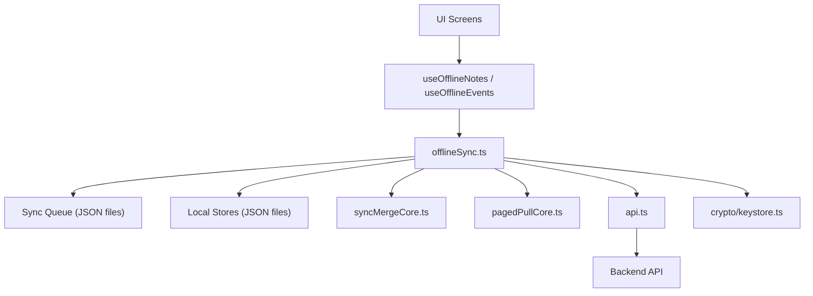
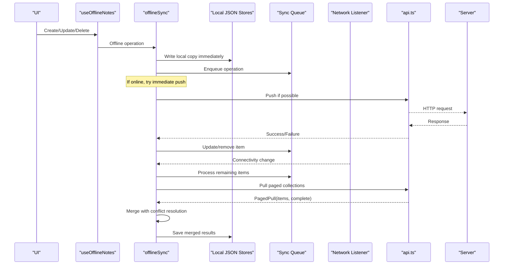
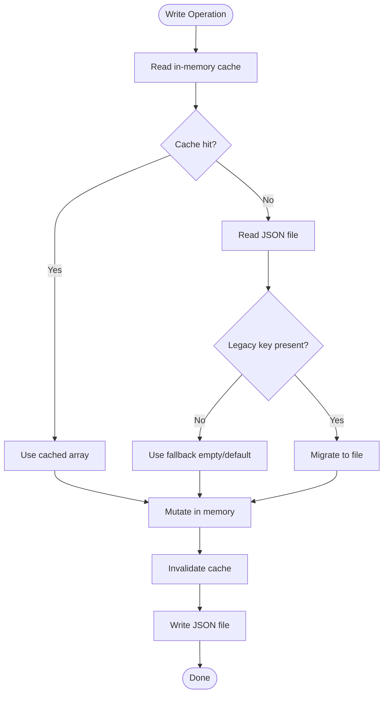
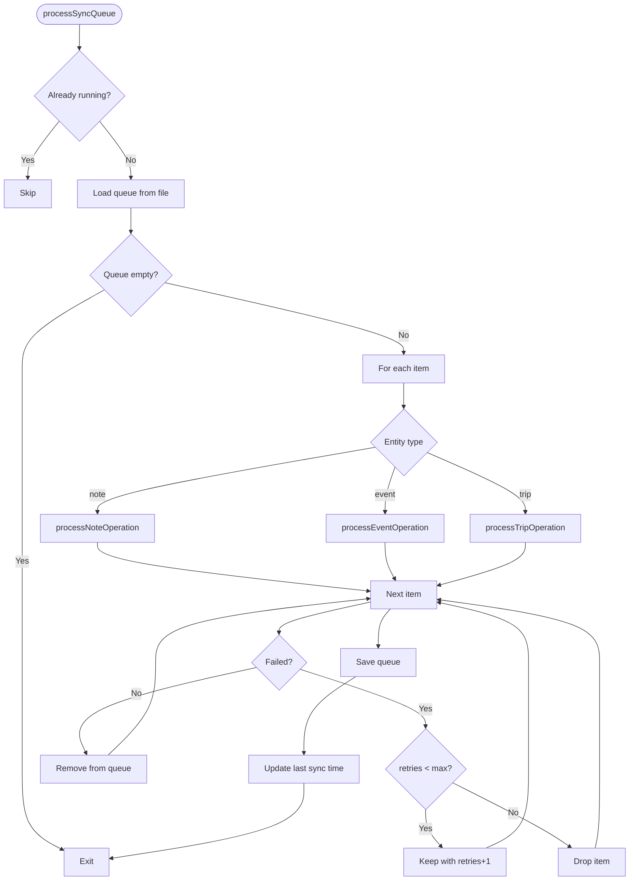
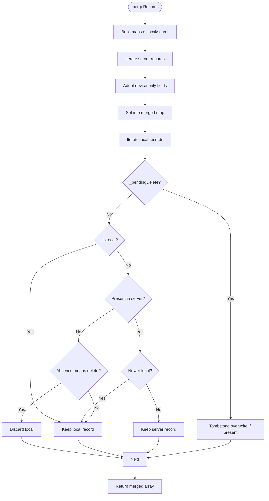
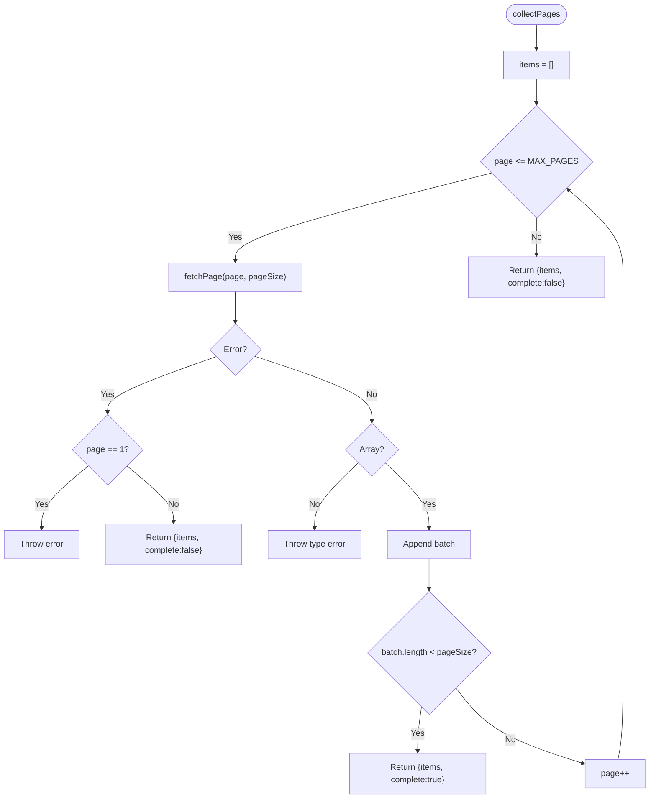
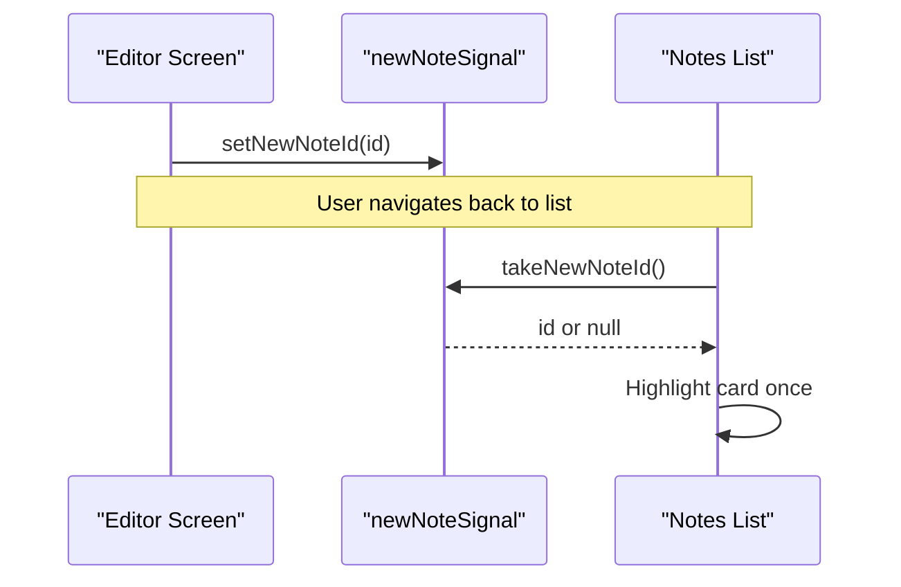
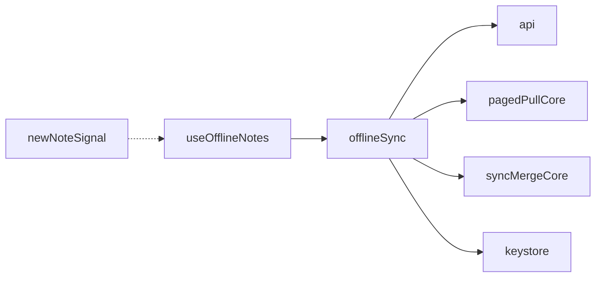

# Offline Capabilities

<cite>
**Referenced Files in This Document**
- [offlineSync.ts](file://src/offlineSync.ts)
- [pagedPullCore.ts](file://src/pagedPullCore.ts)
- [syncMergeCore.ts](file://src/syncMergeCore.ts)
- [useOfflineNotes.ts](file://src/useOfflineNotes.ts)
- [newNoteSignal.ts](file://src/newNoteSignal.ts)
- [api.ts](file://src/api.ts)
- [keystore.ts](file://src/crypto/keystore.ts)
</cite>

## Table of Contents
1. [Introduction](#introduction)
2. [Project Structure](#project-structure)
3. [Core Components](#core-components)
4. [Architecture Overview](#architecture-overview)
5. [Detailed Component Analysis](#detailed-component-analysis)
6. [Dependency Analysis](#dependency-analysis)
7. [Performance Considerations](#performance-considerations)
8. [Troubleshooting Guide](#troubleshooting-guide)
9. [Conclusion](#conclusion)

## Introduction
This document explains the offline-first architecture that keeps the app fully functional without internet connectivity. It covers local data storage for notes, events, and trips; a background synchronization engine that queues operations and reconciles data when connectivity is restored; conflict resolution algorithms; paged pull for efficient data loading; and signal-based communication between components. It also provides examples of offline workflows, sync queue management, and troubleshooting connectivity issues.

## Project Structure
The offline system is centered around a small set of modules:
- Local persistence and sync orchestration live in one cohesive module that manages file-backed JSON stores, an in-memory cache, and a durable sync queue.
- A generic paging utility assembles full collections from paginated server responses.
- A pure merge core implements conflict resolution rules independent of I/O.
- React hooks wrap the sync layer to provide UI-friendly APIs with automatic background sync and state updates.
- A tiny module provides one-shot signals for cross-screen coordination.
- The API layer handles authentication, token refresh, timeouts, and paged collection pulls.
- Secure storage holds the device encryption key used to encrypt payloads before they leave the device.

**Diagram sources**
- [offlineSync.ts:112-135](file://src/offlineSync.ts#L112-L135)
- [pagedPullCore.ts:21-69](file://src/pagedPullCore.ts#L21-L69)
- [syncMergeCore.ts:16-140](file://src/syncMergeCore.ts#L16-L140)
- [useOfflineNotes.ts:18-36](file://src/useOfflineNotes.ts#L18-L36)
- [api.ts:123-138](file://src/api.ts#L123-L138)
- [keystore.ts:1-53](file://src/crypto/keystore.ts#L1-L53)

**Section sources**
- [offlineSync.ts:112-135](file://src/offlineSync.ts#L112-L135)
- [pagedPullCore.ts:21-69](file://src/pagedPullCore.ts#L21-L69)
- [syncMergeCore.ts:16-140](file://src/syncMergeCore.ts#L16-L140)
- [useOfflineNotes.ts:18-36](file://src/useOfflineNotes.ts#L18-L36)
- [api.ts:123-138](file://src/api.ts#L123-L138)
- [keystore.ts:1-53](file://src/crypto/keystore.ts#L1-L53)

## Core Components
- Local storage strategy: Large collections are persisted to plain JSON files on disk to avoid platform storage limits. An in-memory cache reduces repeated parsing. A migration path reads legacy AsyncStorage keys once and migrates them to files.
- Sync queue: A durable queue persists pending create/update/delete operations with retry counts. Operations are merged to avoid duplicates and to handle delete-before-create scenarios.
- Background sync: A network listener triggers queue processing when connectivity returns. Full sync is throttled to avoid redundant work.
- Conflict resolution: Newest-write-wins using updated_at or created_at timestamps. Absence means deletion only when the server pull is known complete and the record was not edited during the pull window.
- Paged pull: Collects all pages up to a safe ceiling, marking whether the collection was fully retrieved so merges can safely interpret absence.
- Signal-based communication: A module-level one-shot signal lets the editor notify the notes list about a newly created note for a one-time highlight.

**Section sources**
- [offlineSync.ts:122-188](file://src/offlineSync.ts#L122-L188)
- [offlineSync.ts:207-244](file://src/offlineSync.ts#L207-L244)
- [offlineSync.ts:365-415](file://src/offlineSync.ts#L365-L415)
- [offlineSync.ts:785-836](file://src/offlineSync.ts#L785-L836)
- [offlineSync.ts:930-1037](file://src/offlineSync.ts#L930-L1037)
- [pagedPullCore.ts:21-69](file://src/pagedPullCore.ts#L21-L69)
- [syncMergeCore.ts:16-140](file://src/syncMergeCore.ts#L16-L140)
- [newNoteSignal.ts:1-18](file://src/newNoteSignal.ts#L1-L18)

## Architecture Overview
The offline-first flow ensures immediate responsiveness by writing locally first, then synchronizing in the background. When online, queued operations are pushed to the server and full sync reconciles server state with local changes using robust conflict resolution.

**Diagram sources**
- [useOfflineNotes.ts:146-201](file://src/useOfflineNotes.ts#L146-L201)
- [offlineSync.ts:419-537](file://src/offlineSync.ts#L419-L537)
- [offlineSync.ts:785-836](file://src/offlineSync.ts#L785-L836)
- [offlineSync.ts:930-1037](file://src/offlineSync.ts#L930-L1037)
- [pagedPullCore.ts:45-69](file://src/pagedPullCore.ts#L45-L69)
- [api.ts:123-138](file://src/api.ts#L123-L138)

## Detailed Component Analysis

### Local Data Storage Strategy
- File-backed JSON stores persist notes, events, trips, and the sync queue under a dedicated directory. This avoids platform-specific storage row-size limits that could silently truncate large datasets.
- In-memory caches mirror the on-disk arrays to reduce parse overhead. Writes invalidate the cache and save atomically via serialized access where needed.
- Migration support reads legacy AsyncStorage keys once and moves them to files, ensuring continuity across upgrades.

**Diagram sources**
- [offlineSync.ts:122-188](file://src/offlineSync.ts#L122-L188)
- [offlineSync.ts:207-244](file://src/offlineSync.ts#L207-L244)
- [offlineSync.ts:329-363](file://src/offlineSync.ts#L329-L363)

**Section sources**
- [offlineSync.ts:122-188](file://src/offlineSync.ts#L122-L188)
- [offlineSync.ts:207-244](file://src/offlineSync.ts#L207-L244)
- [offlineSync.ts:329-363](file://src/offlineSync.ts#L329-L363)

### Background Synchronization Engine
- The sync queue persists pending operations with entity type, operation kind, payload, timestamp, and retry count. Duplicate operations are merged intelligently (e.g., delete cancels a pending create).
- processSyncQueue runs serially to prevent concurrent writes from corrupting state. It processes each item, handling create/update/delete per entity, updating local IDs after successful creates, and saving failed items back to the queue with incremented retries up to a limit.
- startBackgroundSync registers a network listener that triggers queue processing when connectivity is restored. stopBackgroundSync removes the listener.

**Diagram sources**
- [offlineSync.ts:785-836](file://src/offlineSync.ts#L785-L836)
- [offlineSync.ts:838-928](file://src/offlineSync.ts#L838-L928)

**Section sources**
- [offlineSync.ts:365-415](file://src/offlineSync.ts#L365-L415)
- [offlineSync.ts:785-836](file://src/offlineSync.ts#L785-L836)
- [offlineSync.ts:838-928](file://src/offlineSync.ts#L838-L928)

### Conflict Resolution Algorithms
- newest-write-wins: Records are compared by updated_at if available, otherwise created_at. Unparseable timestamps lose comparisons to avoid incorrect wins.
- Absence semantics: A missing server record is treated as deleted only if the pull reached the end of the collection and the local record was not modified after the pull started. This prevents accidental deletion due to pagination gaps or mid-pull edits.
- Local-only records always survive until successfully synced. Pending deletes are preserved as tombstones until the server stops returning them.

**Diagram sources**
- [syncMergeCore.ts:16-140](file://src/syncMergeCore.ts#L16-L140)

**Section sources**
- [syncMergeCore.ts:16-140](file://src/syncMergeCore.ts#L16-L140)

### Paged Pull Mechanism
- collectPages fetches pages sequentially until a page returns fewer items than the requested size, indicating the end of the collection. It enforces a maximum number of pages per pull to guard against infinite loops.
- Failure behavior is asymmetric: a first-page failure throws to avoid merging an empty collection as “server has nothing”; later-page failures return partial results marked incomplete so the merge treats absence as non-authoritative.

**Diagram sources**
- [pagedPullCore.ts:21-69](file://src/pagedPullCore.ts#L21-L69)

**Section sources**
- [pagedPullCore.ts:21-69](file://src/pagedPullCore.ts#L21-L69)
- [api.ts:123-138](file://src/api.ts#L123-L138)

### Signal-Based Communication Between Components
- A module-level one-shot signal allows the editor to announce a newly created note id. The notes list consumes it on focus to play a one-time visual cue, then clears it.

**Diagram sources**
- [newNoteSignal.ts:1-18](file://src/newNoteSignal.ts#L1-L18)

**Section sources**
- [newNoteSignal.ts:1-18](file://src/newNoteSignal.ts#L1-L18)

### Offline Workflows Examples
- Creating a note offline:
  - Generate a temporary local id and write locally immediately.
  - Enqueue a create operation with payload and timestamp.
  - If online, attempt immediate push; on success, replace temp id with server id and remove from queue. On failure, remain queued for background sync.
- Updating a note offline:
  - Resolve any alias from temp to server id if applicable.
  - Update local copy with a fresh timestamp.
  - Enqueue update (or merge into a pending create if never synced).
  - If online, attempt immediate push; otherwise rely on background sync.
- Deleting a note offline:
  - If never synced, remove locally and drop the pending create from the queue.
  - Otherwise, mark as pending-delete locally for instant UI removal, enqueue delete, and optionally push now if online. After successful delete, remove locally.

These flows ensure the UI remains responsive while guaranteeing durability through the queue and eventual consistency via full sync.

**Section sources**
- [offlineSync.ts:419-537](file://src/offlineSync.ts#L419-L537)
- [useOfflineNotes.ts:146-201](file://src/useOfflineNotes.ts#L146-L201)

### Sync Queue Management
- enqueueOperation deduplicates and merges operations to minimize redundant network calls and to handle edge cases like deleting an unsynced create.
- processSyncQueue executes operations in order, handling errors by incrementing retries and resaving the queue. Successful operations remove their entries.
- Last sync time is recorded to aid diagnostics.

**Section sources**
- [offlineSync.ts:365-415](file://src/offlineSync.ts#L365-L415)
- [offlineSync.ts:785-836](file://src/offlineSync.ts#L785-L836)

### Full Sync and Reconciliation
- fullSync pushes pending changes first, then pulls notes, events, and trips concurrently. Each pull uses the paged mechanism and reports completeness.
- Decryption occurs before merging. Merge applies newest-write-wins and preserves device-only fields where necessary.
- Throttling prevents excessive full syncs triggered by frequent focus changes.

**Section sources**
- [offlineSync.ts:930-1037](file://src/offlineSync.ts#L930-L1037)
- [pagedPullCore.ts:21-69](file://src/pagedPullCore.ts#L21-L69)
- [syncMergeCore.ts:16-140](file://src/syncMergeCore.ts#L16-L140)

### Security and Encryption Integration
- Outbound payloads are encrypted before being sent to the server. The device’s Data Encryption Key is stored securely in the OS keystore and memoized in-process to avoid repeated native calls.
- During full sync, server responses are decrypted before merging into plaintext local stores.

**Section sources**
- [offlineSync.ts:17-25](file://src/offlineSync.ts#L17-L25)
- [api.ts:15-21](file://src/api.ts#L15-L21)
- [keystore.ts:1-53](file://src/crypto/keystore.ts#L1-L53)

## Dependency Analysis
- offlineSync depends on:
  - api.ts for network requests and paged pulls
  - pagedPullCore for collecting full collections
  - syncMergeCore for conflict resolution
  - crypto modules for encryption/decryption and keystore access
  - NetInfo for connectivity detection
- useOfflineNotes composes offlineSync to expose React-friendly methods and manages lifecycle (background sync, app state changes).
- newNoteSignal is a lightweight dependency for cross-screen signaling.

**Diagram sources**
- [offlineSync.ts:12-26](file://src/offlineSync.ts#L12-L26)
- [useOfflineNotes.ts:18-36](file://src/useOfflineNotes.ts#L18-L36)
- [newNoteSignal.ts:1-18](file://src/newNoteSignal.ts#L1-L18)

**Section sources**
- [offlineSync.ts:12-26](file://src/offlineSync.ts#L12-L26)
- [useOfflineNotes.ts:18-36](file://src/useOfflineNotes.ts#L18-L36)
- [newNoteSignal.ts:1-18](file://src/newNoteSignal.ts#L1-L18)

## Performance Considerations
- File-backed JSON stores avoid platform storage limits and enable large datasets without silent truncation.
- In-memory caches reduce repeated parsing; mutex-like serialization protects critical read-modify-write sequences for notes to prevent race conditions.
- Full sync throttling reduces redundant network and decryption work.
- Paged pulls cap the number of requests per sync to protect against misbehaving servers.
- Token refresh is single-flighted to avoid concurrent invalidations.
- Network requests include timeouts to prevent indefinite hangs that could block sync.

[No sources needed since this section provides general guidance]

## Troubleshooting Guide
- Connectivity issues:
  - Verify background sync listener is active and triggers on connectivity restoration.
  - Inspect queue for stuck items; check retry counts and logs for specific failures.
  - Confirm last sync timestamp is updated after successful runs.
- Stale or missing data:
  - Ensure full sync completes and reports whether pulls were complete; incomplete pulls preserve local records that may be newer.
  - Check merge logic for presence of updated_at vs created_at and confirm timestamps are valid.
- UI inconsistencies:
  - Confirm local writes occur before enqueueing operations to keep UI responsive.
  - Validate alias resolution for notes whose ids swap from temporary to server-assigned values.
- Encryption problems:
  - Ensure DEK is loaded before full sync; otherwise sync is skipped to avoid storing ciphertext in plaintext stores.
  - Verify encryption/decryption boundaries are applied consistently for notes, events, and trips.

**Section sources**
- [offlineSync.ts:1039-1071](file://src/offlineSync.ts#L1039-L1071)
- [offlineSync.ts:930-1037](file://src/offlineSync.ts#L930-L1037)
- [api.ts:74-121](file://src/api.ts#L74-L121)
- [keystore.ts:1-53](file://src/crypto/keystore.ts#L1-L53)

## Conclusion
The offline-first architecture delivers a resilient, user-friendly experience by prioritizing local writes, maintaining a durable sync queue, and reconciling data with robust conflict resolution. Paged pulls and throttled full syncs optimize performance, while secure encryption protects sensitive data. Together, these components ensure the app remains functional offline and converges reliably when connectivity is restored.

[No sources needed since this section summarizes without analyzing specific files]