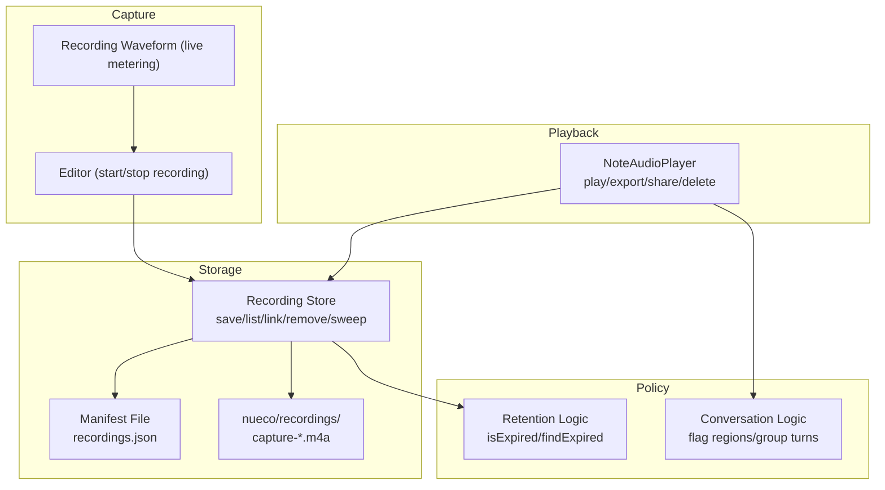
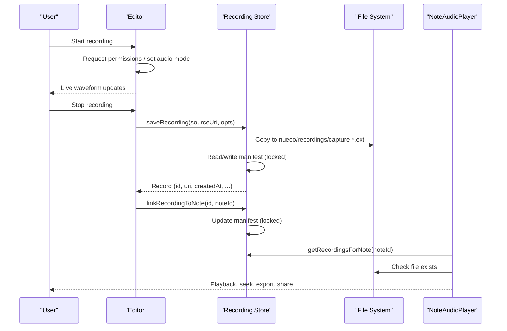
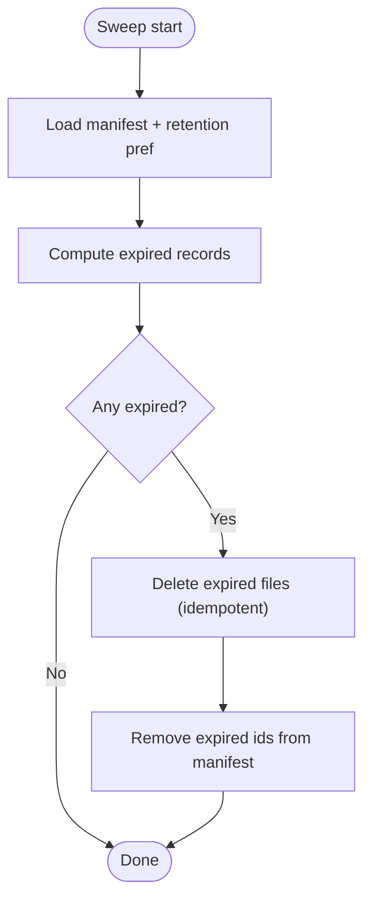
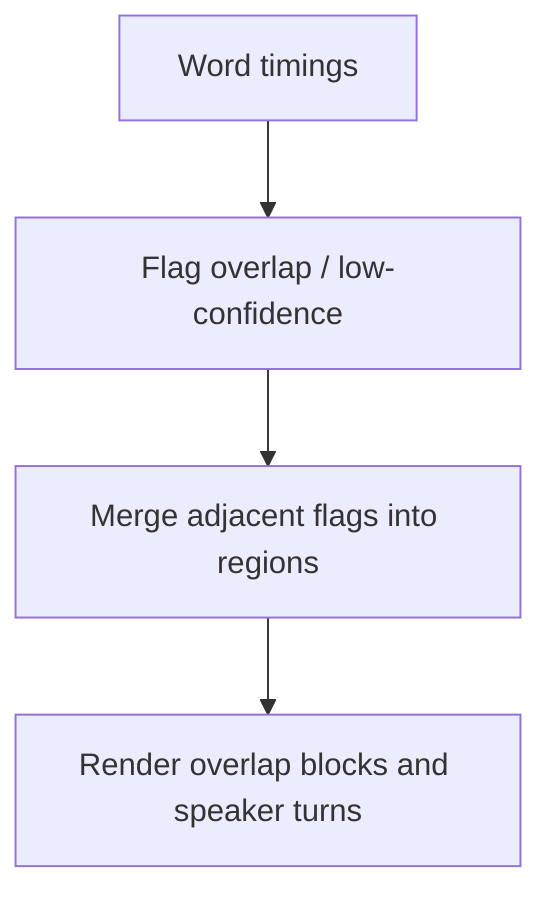
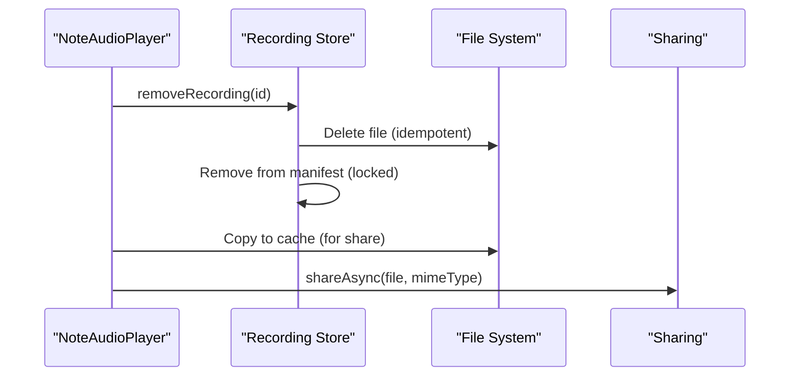
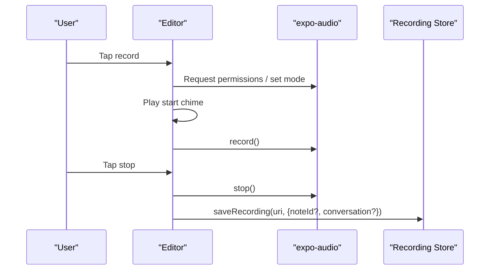
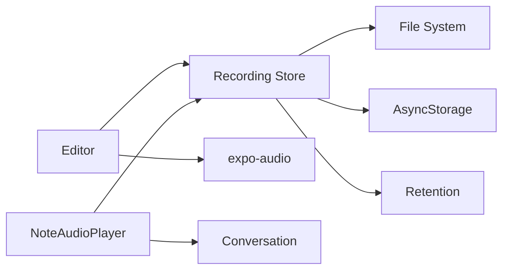

# Audio Capture & Recording

<cite>
**Referenced Files in This Document**
- [recordingStore.ts](file://src/audio/recordingStore.ts)
- [retention.ts](file://src/audio/retention.ts)
- [conversation.ts](file://src/audio/conversation.ts)
- [NoteAudioPlayer.tsx](file://src/components/NoteAudioPlayer.tsx)
- [RecordingWaveform.tsx](file://src/components/RecordingWaveform.tsx)
- [editor.tsx](file://app/editor.tsx)
</cite>

## Table of Contents
1. [Introduction](#introduction)
2. [Project Structure](#project-structure)
3. [Core Components](#core-components)
4. [Architecture Overview](#architecture-overview)
5. [Detailed Component Analysis](#detailed-component-analysis)
6. [Dependency Analysis](#dependency-analysis)
7. [Performance Considerations](#performance-considerations)
8. [Troubleshooting Guide](#troubleshooting-guide)
9. [Conclusion](#conclusion)
10. [Appendices](#appendices)

## Introduction
This document explains the audio capture and recording system with a focus on storage management, manifest-based tracking, lifecycle from capture to persistent storage, naming conventions, directory structure, error handling, queueing and concurrency via manifest locks, and performance considerations for large audio files. It also provides examples for saving recordings, linking them to notes, and managing metadata such as capture time, size, transcription status, and conversation flags.

## Project Structure
The audio subsystem is centered around:
- A storage layer that persists captured audio files and a JSON manifest under the app’s document directory.
- Retention policies that determine when recordings expire.
- Conversation-mode logic that flags overlapping or low-confidence segments.
- UI components that play back recordings, render transcripts, and support export/sharing.
- The editor screen that orchestrates capture, VAD-based segmentation, permissions, and post-capture flows.

**Diagram sources**
- [recordingStore.ts:23-62](file://src/audio/recordingStore.ts#L23-L62)
- [retention.ts:56-81](file://src/audio/retention.ts#L56-L81)
- [conversation.ts:64-106](file://src/audio/conversation.ts#L64-L106)
- [NoteAudioPlayer.tsx:100-150](file://src/components/NoteAudioPlayer.tsx#L100-L150)
- [editor.tsx:1823-1938](file://app/editor.tsx#L1823-L1938)

**Section sources**
- [recordingStore.ts:23-62](file://src/audio/recordingStore.ts#L23-L62)
- [retention.ts:56-81](file://src/audio/retention.ts#L56-L81)
- [conversation.ts:64-106](file://src/audio/conversation.ts#L64-L106)
- [NoteAudioPlayer.tsx:100-150](file://src/components/NoteAudioPlayer.tsx#L100-L150)
- [editor.tsx:1823-1938](file://app/editor.tsx#L1823-L1938)

## Core Components
- Recording store: manages file copying from expo-audio cache to persistent storage, maintains a JSON manifest, enforces retention sweeps, and serializes concurrent operations via a manifest lock.
- Retention module: defines retention preferences, computes expiration windows, and identifies expired or soon-to-expire recordings.
- Conversation module: detects overlap and low-confidence regions and groups speaker turns for display.
- Note audio player: plays stored recordings, renders word-level transcript or conversation segments, supports speed control, seek-by-word, export/sharing, and deletion.
- Editor: handles microphone permissions, starts/stops recording, configures audio mode, and triggers post-recapture workflows.

**Section sources**
- [recordingStore.ts:78-112](file://src/audio/recordingStore.ts#L78-L112)
- [retention.ts:11-54](file://src/audio/retention.ts#L11-L54)
- [conversation.ts:32-106](file://src/audio/conversation.ts#L32-L106)
- [NoteAudioPlayer.tsx:87-150](file://src/components/NoteAudioPlayer.tsx#L87-L150)
- [editor.tsx:1823-1938](file://app/editor.tsx#L1823-L1938)

## Architecture Overview
The system follows a clear pipeline:
1. Capture: The editor requests permissions, sets audio mode, and starts recording. Live waveform reflects real-time metering.
2. Persist: On stop, the recording URI is copied from the temporary cache into nueco/recordings/ with a human-readable timestamped filename. A manifest entry is created with metadata.
3. Track: Manifest entries include id, uri, createdAt, sizeBytes, noteId, conversation flag, transcribedAt, words, durationSeconds, and transcriptText.
4. Manage: Retention sweeps delete expired files and remove their manifest entries based on user preference and conversation-specific rules.
5. Play: The note audio player reads the manifest record, verifies file existence, and provides playback, seek-by-word, speed control, export, and share.

**Diagram sources**
- [editor.tsx:1823-1938](file://app/editor.tsx#L1823-L1938)
- [recordingStore.ts:78-112](file://src/audio/recordingStore.ts#L78-L112)
- [recordingStore.ts:121-126](file://src/audio/recordingStore.ts#L121-L126)
- [recordingStore.ts:145-158](file://src/audio/recordingStore.ts#L145-L158)
- [NoteAudioPlayer.tsx:135-150](file://src/components/NoteAudioPlayer.tsx#L135-L150)

## Detailed Component Analysis

### Storage Management and Manifest-Based Tracking
- Directory layout:
  - Base directory: documentDirectory/nueco/
  - Recordings directory: documentDirectory/nueco/recordings/
  - Manifest file: documentDirectory/nueco/recordings.json
- File naming:
  - Each recording is copied with a human-readable name using an ISO-like timestamp stamp, e.g., capture-YYYY-MM-DDTHHMMSS.ext. The extension is preserved from the source; defaults to .m4a if none is detected.
- Manifest record fields:
  - id: unique identifier
  - uri: absolute path to the persisted file
  - createdAt: epoch ms at capture completion
  - sizeBytes: optional file size
  - noteId: optional association to a note
  - conversation: boolean flag for multi-party sessions
  - transcribedAt: epoch ms after transcription completes
  - words: optional array of word timings
  - durationSeconds: optional total duration
  - transcriptText: optional full transcript string
- Persistence strategy:
  - Manifest is cached in memory and written atomically per operation. All mutations are serialized through a manifest lock to prevent race conditions during parallel calls (e.g., linking, sweeping, transcript saves).

Examples:
- Save a recording: call saveRecording with sourceUri and optional noteId and conversation flags.
- Link to a note: call linkRecordingToNote with the recording id and note id.
- Mark transcribed: call markTranscribed to set transcribedAt.
- Save transcript metadata: call saveTranscript to persist words, duration, and transcript text.

Error handling:
- File copy and size read failures do not abort recording save; size is cosmetic.
- Deletion operations use idempotent deletes; missing files are tolerated while still cleaning up manifest entries.
- Manifest read errors fall back to an empty list to keep the app resilient.

**Section sources**
- [recordingStore.ts:23-62](file://src/audio/recordingStore.ts#L23-L62)
- [recordingStore.ts:78-112](file://src/audio/recordingStore.ts#L78-L112)
- [recordingStore.ts:114-141](file://src/audio/recordingStore.ts#L114-L141)
- [recordingStore.ts:161-174](file://src/audio/recordingStore.ts#L161-L174)

### Retention Policy and Sweep
- Preferences: immediate, 30d, indefinite. Stored in AsyncStorage.
- Rules:
  - Immediate: recordings are eligible for deletion once transcribed (except conversation recordings which follow a stricter rule).
  - 30d: recordings expire 30 days after creation.
  - Indefinite: no automatic expiry, except conversation recordings have a hard 24-hour ceiling regardless of preference.
- Sweep:
  - Periodically scans manifest, deletes expired files, and removes their entries. Per-file failures are ignored to ensure sweep completeness.

**Diagram sources**
- [recordingStore.ts:226-242](file://src/audio/recordingStore.ts#L226-L242)
- [retention.ts:56-81](file://src/audio/retention.ts#L56-L81)

**Section sources**
- [retention.ts:11-31](file://src/audio/retention.ts#L11-L31)
- [retention.ts:56-81](file://src/audio/retention.ts#L56-L81)
- [recordingStore.ts:176-184](file://src/audio/recordingStore.ts#L176-L184)
- [recordingStore.ts:226-242](file://src/audio/recordingStore.ts#L226-L242)

### Conversation Mode and Transcript Segmentation
- Session cap: conversation recordings stop after a configured maximum duration.
- Overlap detection:
  - Flags regions where speakers overlap or confidence is low.
  - Merges adjacent flagged words into contiguous blocks for UI rendering.
- Speaker grouping:
  - Groups consecutive words by speaker into turns for block display.
- UI integration:
  - The note player renders overlap blocks without attributing speakers and highlights low-confidence words distinctly.

**Diagram sources**
- [conversation.ts:64-106](file://src/audio/conversation.ts#L64-L106)
- [NoteAudioPlayer.tsx:44-72](file://src/components/NoteAudioPlayer.tsx#L44-L72)

**Section sources**
- [conversation.ts:14-20](file://src/audio/conversation.ts#L14-L20)
- [conversation.ts:64-106](file://src/audio/conversation.ts#L64-L106)
- [NoteAudioPlayer.tsx:110-118](file://src/components/NoteAudioPlayer.tsx#L110-L118)

### Playback, Export, and Sharing
- Playback:
  - Uses an audio player bound to the persisted URI.
  - Supports play/pause, seek-by-word, scrubber, and variable speed.
- Export and sharing:
  - Copies the recording to cache for sharing with appropriate MIME type.
  - For conversation-mode audio, prompts once before sharing to raise awareness about including other people’s voices.
  - Transcript can be exported as plain text and shared similarly.
- Deletion:
  - Removes the file and its manifest entry; UI shows “expired” state if the file is missing.

**Diagram sources**
- [NoteAudioPlayer.tsx:236-301](file://src/components/NoteAudioPlayer.tsx#L236-L301)
- [recordingStore.ts:161-174](file://src/audio/recordingStore.ts#L161-L174)

**Section sources**
- [NoteAudioPlayer.tsx:228-301](file://src/components/NoteAudioPlayer.tsx#L228-L301)
- [NoteAudioPlayer.tsx:303-313](file://src/components/NoteAudioPlayer.tsx#L303-L313)

### Capture Flow in the Editor
- Permissions and audio mode:
  - Requests microphone permission and configures audio mode for recording.
  - On Android, may request notification permission to show a persistent foreground service notification.
- Start/stop:
  - Plays start/stop chimes for feedback.
  - Tracks recording duration and emits analytics events.
  - Stops recording and returns the final URI for persistence.

**Diagram sources**
- [editor.tsx:1823-1938](file://app/editor.tsx#L1823-L1938)
- [recordingStore.ts:78-112](file://src/audio/recordingStore.ts#L78-L112)

**Section sources**
- [editor.tsx:82-102](file://app/editor.tsx#L82-L102)
- [editor.tsx:1823-1938](file://app/editor.tsx#L1823-L1938)

## Dependency Analysis
- The editor depends on expo-audio for capture and on the recording store for persistence.
- The recording store depends on file system APIs and AsyncStorage for preferences.
- Retention and conversation modules are pure logic used by both storage and UI layers.
- The note audio player depends on the recording store for CRUD and on conversation logic for segment rendering.

**Diagram sources**
- [editor.tsx:1823-1938](file://app/editor.tsx#L1823-L1938)
- [recordingStore.ts:11-21](file://src/audio/recordingStore.ts#L11-L21)
- [NoteAudioPlayer.tsx:10-14](file://src/components/NoteAudioPlayer.tsx#L10-L14)

**Section sources**
- [recordingStore.ts:11-21](file://src/audio/recordingStore.ts#L11-L21)
- [NoteAudioPlayer.tsx:10-14](file://src/components/NoteAudioPlayer.tsx#L10-L14)

## Performance Considerations
- Large files:
  - Copying large audio files can be I/O intensive; consider batching or deferring non-essential work until after capture completes.
  - Size metadata is retrieved via a lightweight file stat; avoid repeated heavy reads.
- Manifest concurrency:
  - All manifest mutations are serialized via a promise-based lock to prevent interleaved writes that could drop links or records.
- Retention sweeps:
  - Sweeps run with per-file failure tolerance so one missing file does not block cleanup of others.
- Playback:
  - Duration fallbacks (status, stored value, last word end) reduce perceived latency before media loads.
  - Word-level seek avoids decoding entire files to find positions.

[No sources needed since this section provides general guidance]

## Troubleshooting Guide
Common issues and resolutions:
- Missing recording file:
  - The player checks file existence and displays an “expired” message when the file is gone. Ensure retention settings are appropriate and sweeps have not removed the file.
- Export failures:
  - Sharing copies the file to cache first; ensure sufficient cache space and correct MIME types. Conversation-mode exports prompt once to confirm sharing audio that includes other people.
- Manifest corruption:
  - Reads handle parse errors gracefully by resetting to an empty manifest. If inconsistencies occur, re-run a sweep to clean orphaned entries.
- Permission errors:
  - Microphone permission must be granted before starting recording. On Android, notification permission may be required for background recording notifications.

**Section sources**
- [NoteAudioPlayer.tsx:135-150](file://src/components/NoteAudioPlayer.tsx#L135-L150)
- [NoteAudioPlayer.tsx:236-301](file://src/components/NoteAudioPlayer.tsx#L236-L301)
- [recordingStore.ts:40-62](file://src/audio/recordingStore.ts#L40-L62)
- [recordingStore.ts:226-242](file://src/audio/recordingStore.ts#L226-L242)
- [editor.tsx:1823-1847](file://app/editor.tsx#L1823-L1847)

## Conclusion
The audio capture and recording system provides robust, user-friendly management of voice recordings with clear separation between capture, persistence, policy enforcement, and playback. The manifest-based approach ensures reliable tracking of metadata and associations, while serialization protects against concurrent access pitfalls. Retention policies balance privacy and usability, and conversation-mode features surface quality signals like overlap and low confidence. Together, these components deliver a resilient experience for capturing, organizing, and reviewing voice content within notes.

[No sources needed since this section summarizes without analyzing specific files]

## Appendices

### Examples

- Save a recording and link it to a note:
  - Call saveRecording with the source URI and options including noteId and conversation flag.
  - Later, call linkRecordingToNote to associate the recording with a note.

- Mark transcription complete and save transcript metadata:
  - Call markTranscribed to set transcribedAt.
  - Call saveTranscript to persist words, duration, and transcript text.

- Retrieve recordings for a note:
  - Call getRecordingsForNote to list all captures linked to a note, ordered by creation time.

- Manage retention:
  - Get or set retention preference via getRetentionPref/setRetentionPref.
  - Run sweepExpiredRecordings to delete expired files and update the manifest.

**Section sources**
- [recordingStore.ts:78-112](file://src/audio/recordingStore.ts#L78-L112)
- [recordingStore.ts:114-141](file://src/audio/recordingStore.ts#L114-L141)
- [recordingStore.ts:145-158](file://src/audio/recordingStore.ts#L145-L158)
- [recordingStore.ts:176-184](file://src/audio/recordingStore.ts#L176-L184)
- [recordingStore.ts:226-242](file://src/audio/recordingStore.ts#L226-L242)