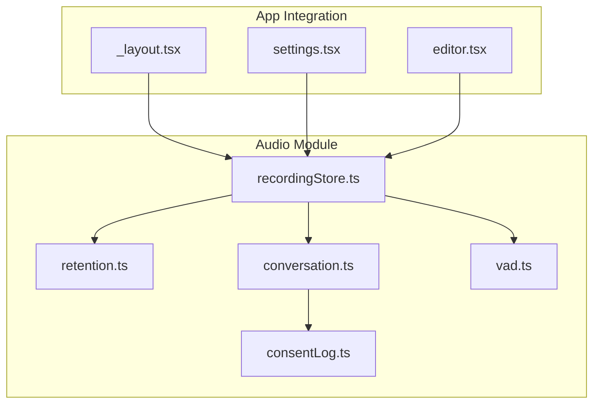
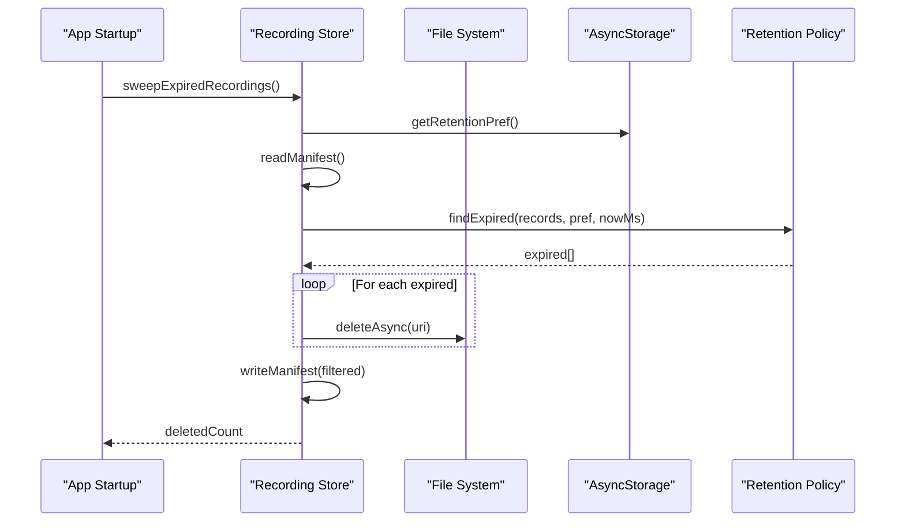
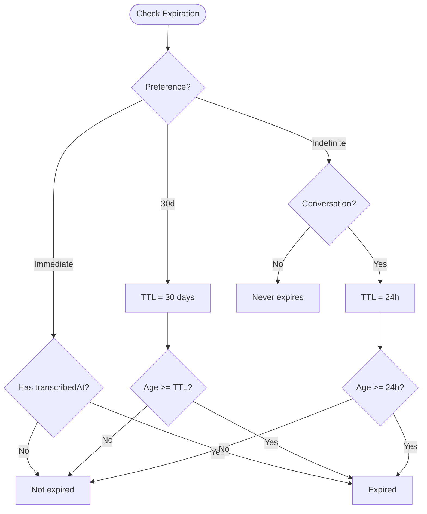
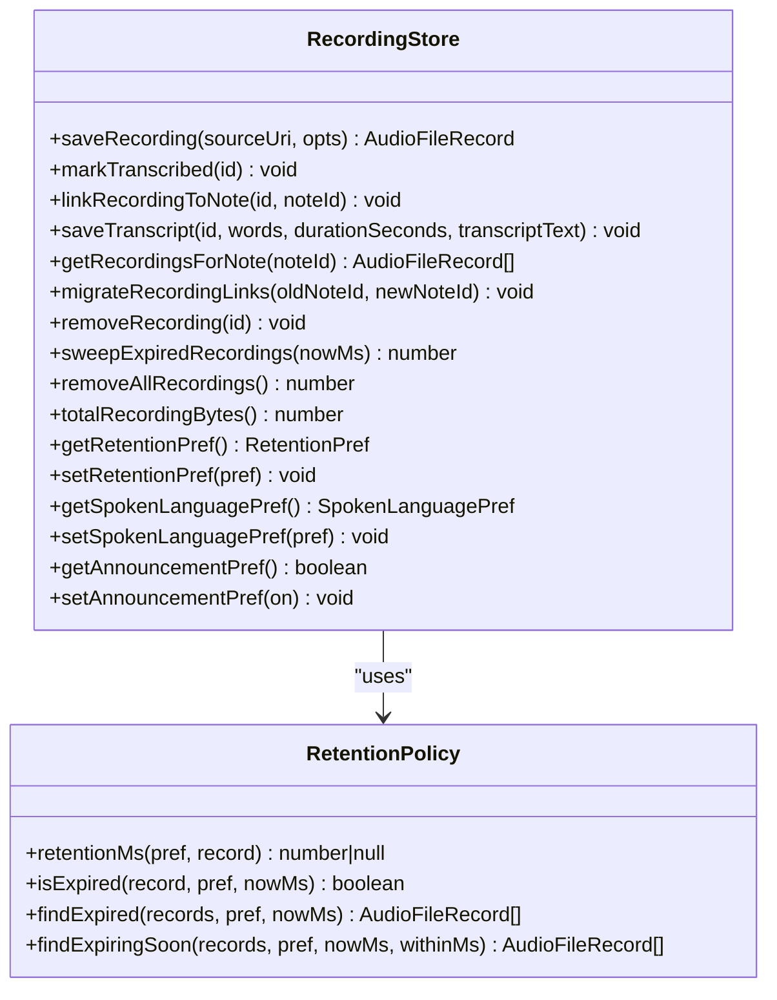
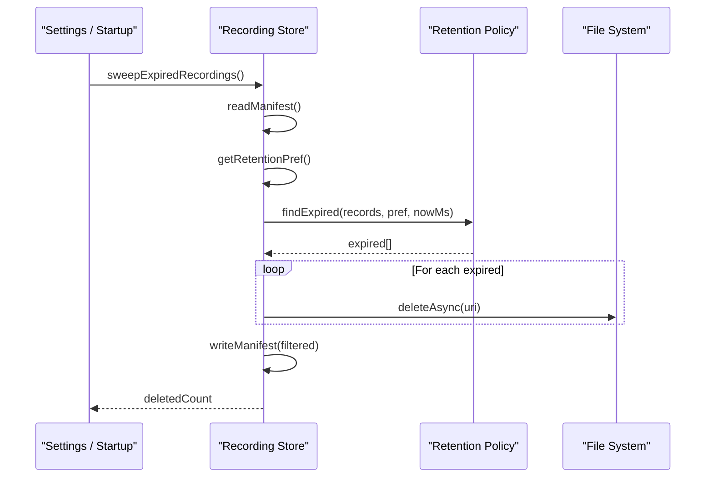
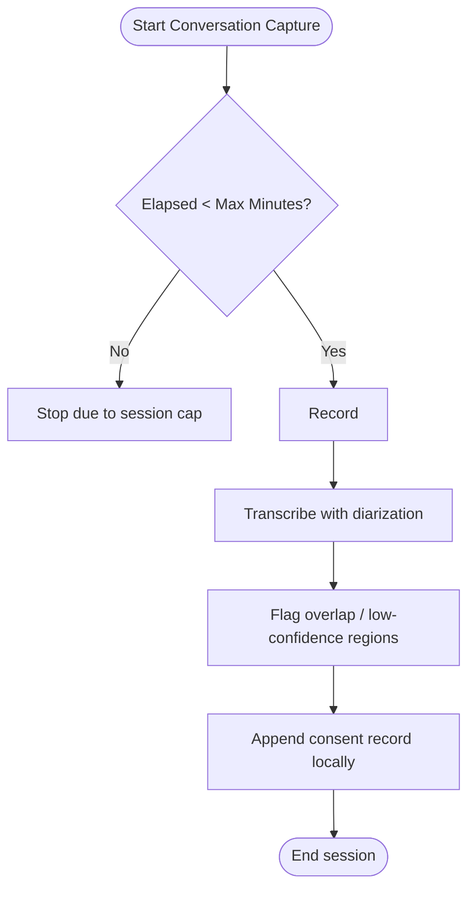
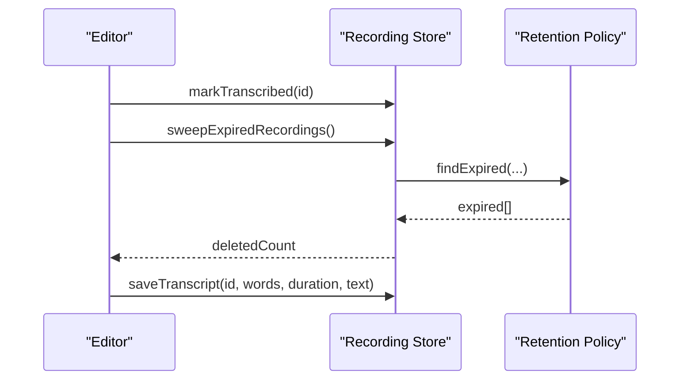
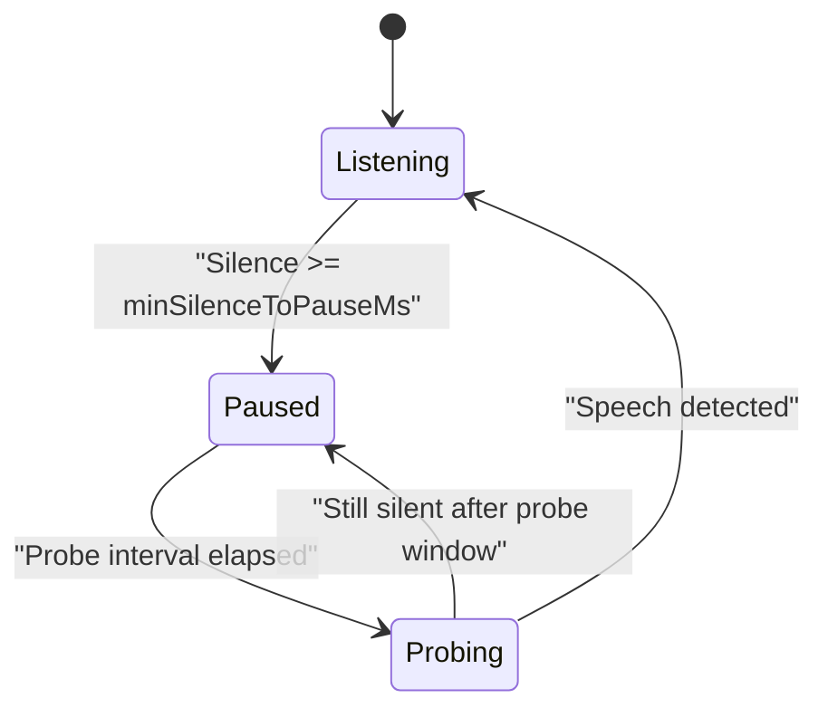
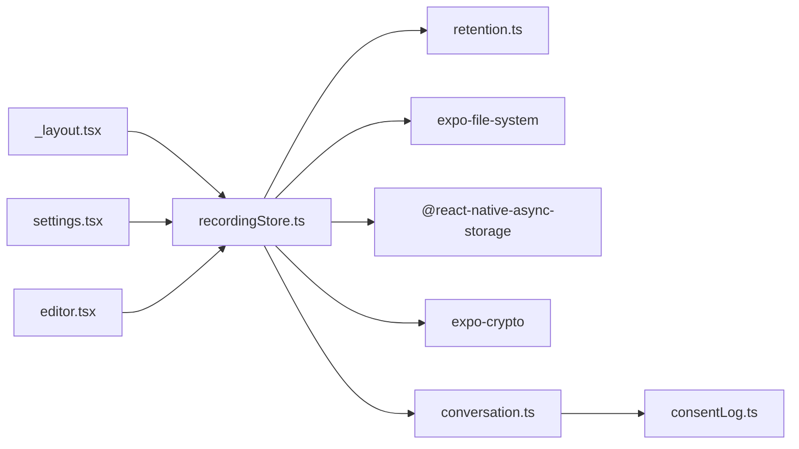

# Recording Retention & Cleanup

<cite>
**Referenced Files in This Document**
- [retention.ts](file://src/audio/retention.ts)
- [recordingStore.ts](file://src/audio/recordingStore.ts)
- [conversation.ts](file://src/audio/conversation.ts)
- [consentLog.ts](file://src/audio/consentLog.ts)
- [vad.ts](file://src/audio/vad.ts)
- [_layout.tsx](file://app/_layout.tsx)
- [settings.tsx](file://app/settings.tsx)
- [editor.tsx](file://app/editor.tsx)
</cite>

## Table of Contents
1. [Introduction](#introduction)
2. [Project Structure](#project-structure)
3. [Core Components](#core-components)
4. [Architecture Overview](#architecture-overview)
5. [Detailed Component Analysis](#detailed-component-analysis)
6. [Dependency Analysis](#dependency-analysis)
7. [Performance Considerations](#performance-considerations)
8. [Troubleshooting Guide](#troubleshooting-guide)
9. [Conclusion](#conclusion)
10. [Appendices](#appendices)

## Introduction
This document explains the recording retention and cleanup system that manages the lifecycle of audio recordings on the device. It covers:
- Retention policy configuration (immediate, 30-day, indefinite)
- Automated sweep mechanisms for expired recordings
- Storage space management strategies
- File deletion algorithms and manifest synchronization during cleanup
- User preference handling for retention policies
- Cleanup scheduling and integration points
- Error handling during file operations
- Monitoring of storage usage
- Examples for configuring retention policies, manual cleanup procedures, and troubleshooting storage-related issues

The system ensures that recordings are retained according to user preferences while protecting privacy for conversation-mode captures and keeping storage usage under control.

## Project Structure
The retention and cleanup logic is implemented in the audio module and integrated into app startup and settings flows:
- Policy and utilities live in a pure-logic module
- Storage and manifest management live in a store module backed by the file system and async storage
- Conversation-mode policy adds stricter rules and consent logging
- App layout triggers automated sweeps at startup
- Settings UI exposes configuration and manual controls
- Editor integrates transcription completion with immediate eligibility for deletion under “immediate” retention

**Diagram sources**
- [retention.ts:1-114](file://src/audio/retention.ts#L1-L114)
- [recordingStore.ts:1-263](file://src/audio/recordingStore.ts#L1-L263)
- [conversation.ts:1-130](file://src/audio/conversation.ts#L1-L130)
- [consentLog.ts:1-37](file://src/audio/consentLog.ts#L1-L37)
- [vad.ts:1-128](file://src/audio/vad.ts#L1-L128)
- [_layout.tsx:15-48](file://app/_layout.tsx#L15-L48)
- [settings.tsx:118-176](file://app/settings.tsx#L118-L176)
- [editor.tsx:1970-2000](file://app/editor.tsx#L1970-L2000)

**Section sources**
- [retention.ts:1-114](file://src/audio/retention.ts#L1-L114)
- [recordingStore.ts:1-263](file://src/audio/recordingStore.ts#L1-L263)
- [conversation.ts:1-130](file://src/audio/conversation.ts#L1-L130)
- [consentLog.ts:1-37](file://src/audio/consentLog.ts#L1-L37)
- [vad.ts:1-128](file://src/audio/vad.ts#L1-L128)
- [_layout.tsx:15-48](file://app/_layout.tsx#L15-L48)
- [settings.tsx:118-176](file://app/settings.tsx#L118-L176)
- [editor.tsx:1970-2000](file://app/editor.tsx#L1970-L2000)

## Core Components
- Retention policy engine: defines preferences, TTL calculation, expiration checks, and near-expiry detection
- Recording store: persists files, maintains a JSON manifest, enforces retention via sweeps, and provides CRUD operations
- Conversation mode: enforces stricter retention for multi-party sessions and flags transcript regions for overlap or low confidence
- Consent log: local-only attestation records for conversation-mode sessions
- Voice activity detection: reduces upload size by pausing during extended silence; complements storage optimization

Key responsibilities:
- Decide whether a recording is expired based on user preference and record attributes
- Safely delete expired files and keep the manifest synchronized
- Expose user-facing options to configure retention and language preferences
- Provide monitoring helpers for total bytes and expiring soon

**Section sources**
- [retention.ts:11-104](file://src/audio/retention.ts#L11-L104)
- [recordingStore.ts:23-179](file://src/audio/recordingStore.ts#L23-L179)
- [conversation.ts:14-106](file://src/audio/conversation.ts#L14-L106)
- [consentLog.ts:7-37](file://src/audio/consentLog.ts#L7-L37)
- [vad.ts:16-44](file://src/audio/vad.ts#L16-L44)

## Architecture Overview
The system combines policy logic with persistent storage and app-level scheduling:

**Diagram sources**
- [_layout.tsx:40-48](file://app/_layout.tsx#L40-L48)
- [recordingStore.ts:226-242](file://src/audio/recordingStore.ts#L226-L242)
- [retention.ts:70-81](file://src/audio/retention.ts#L70-L81)

## Detailed Component Analysis

### Retention Policy Engine
- Preferences: immediate, 30-day, indefinite
- TTL calculation:
  - Immediate: eligible for deletion after transcription completes
  - 30-day: rolling window from capture time
  - Indefinite: no automatic expiry
- Special rule: conversation-mode recordings always expire within 24 hours regardless of preference
- Utilities: formatBytes, formatClock, findExpiringSoon for UI warnings

**Diagram sources**
- [retention.ts:56-77](file://src/audio/retention.ts#L56-L77)

**Section sources**
- [retention.ts:11-104](file://src/audio/retention.ts#L11-L104)

### Recording Store: Storage and Manifest
- Stores audio files under a dedicated directory and keeps a JSON manifest alongside them
- Ensures directories exist before writes
- Serializes manifest mutations to avoid race conditions when multiple operations run concurrently
- Provides:
  - Save recording and link to notes
  - Mark transcription complete
  - Save transcript metadata (word timings, duration, full text)
  - List recordings and query by note
  - Migrate links when note IDs change
  - Remove single recording or all recordings
  - Sweep expired recordings
  - Get total bytes used by recordings
  - Persist user preferences (retention, spoken language, announcement)

**Diagram sources**
- [recordingStore.ts:74-179](file://src/audio/recordingStore.ts#L74-L179)
- [retention.ts:56-97](file://src/audio/retention.ts#L56-L97)

**Section sources**
- [recordingStore.ts:23-179](file://src/audio/recordingStore.ts#L23-L179)
- [retention.ts:56-97](file://src/audio/retention.ts#L56-L97)

### Automated Sweep Mechanism
- Triggered on every app start and also when retention preference tightens
- Reads current manifest and user preference
- Computes expired set using policy logic
- Deletes files best-effort (idempotent deletes)
- Updates manifest to remove entries for deleted files
- Returns count of deleted recordings

**Diagram sources**
- [_layout.tsx:40-48](file://app/_layout.tsx#L40-L48)
- [settings.tsx:132-138](file://app/settings.tsx#L132-L138)
- [recordingStore.ts:226-242](file://src/audio/recordingStore.ts#L226-L242)
- [retention.ts:70-81](file://src/audio/retention.ts#L70-L81)

**Section sources**
- [_layout.tsx:40-48](file://app/_layout.tsx#L40-L48)
- [settings.tsx:132-138](file://app/settings.tsx#L132-L138)
- [recordingStore.ts:226-242](file://src/audio/recordingStore.ts#L226-L242)

### Conversation Mode and Consent
- Conversation-mode recordings have a strict 24-hour ceiling even under indefinite retention
- Session length cap enforced to limit continuous recording
- Transcript regions flagged for overlap or low confidence to avoid presenting unreliable attributions
- Local-only consent log tracks per-session attestations and counts confirmed sessions

**Diagram sources**
- [conversation.ts:14-39](file://src/audio/conversation.ts#L14-L39)
- [conversation.ts:64-106](file://src/audio/conversation.ts#L64-L106)
- [consentLog.ts:12-37](file://src/audio/consentLog.ts#L12-L37)

**Section sources**
- [conversation.ts:14-106](file://src/audio/conversation.ts#L14-L106)
- [consentLog.ts:12-37](file://src/audio/consentLog.ts#L12-L37)

### Editor Integration and Immediate Retention
- After transcription completes, the recording is marked as transcribed, making it eligible for deletion under “immediate” retention
- A sweep runs immediately to enforce the tightened policy without waiting for next app start
- Transcript metadata (word timings, duration, full text) is persisted so the player can seek and export

**Diagram sources**
- [editor.tsx:1970-2000](file://app/editor.tsx#L1970-L2000)
- [recordingStore.ts:114-141](file://src/audio/recordingStore.ts#L114-L141)
- [retention.ts:70-81](file://src/audio/retention.ts#L70-L81)

**Section sources**
- [editor.tsx:1970-2000](file://app/editor.tsx#L1970-L2000)
- [recordingStore.ts:114-141](file://src/audio/recordingStore.ts#L114-L141)

### Voice Activity Detection (Storage Optimization)
- Pauses recording during extended silence to reduce file size and upload volume
- Uses thresholds and hysteresis to avoid flapping between listening and paused states
- Probes periodically while paused to resume if speech is detected

**Diagram sources**
- [vad.ts:16-44](file://src/audio/vad.ts#L16-L44)
- [vad.ts:57-128](file://src/audio/vad.ts#L57-L128)

**Section sources**
- [vad.ts:16-128](file://src/audio/vad.ts#L16-L128)

## Dependency Analysis
- The recording store depends on:
  - Retention policy for TTL and expiration decisions
  - File system for reading/writing manifests and deleting files
  - Async storage for user preferences
- App layout triggers sweeps at startup
- Settings UI reads/writes preferences and triggers immediate sweeps when tightening retention
- Editor marks recordings transcribed and triggers sweeps post-transcription

**Diagram sources**
- [_layout.tsx:15-48](file://app/_layout.tsx#L15-L48)
- [settings.tsx:20-37](file://app/settings.tsx#L20-L37)
- [editor.tsx:29-30](file://app/editor.tsx#L29-L30)
- [recordingStore.ts:11-21](file://src/audio/recordingStore.ts#L11-L21)
- [conversation.ts:12-13](file://src/audio/conversation.ts#L12-L13)
- [consentLog.ts:7-8](file://src/audio/consentLog.ts#L7-L8)

**Section sources**
- [_layout.tsx:15-48](file://app/_layout.tsx#L15-L48)
- [settings.tsx:20-37](file://app/settings.tsx#L20-L37)
- [editor.tsx:29-30](file://app/editor.tsx#L29-L30)
- [recordingStore.ts:11-21](file://src/audio/recordingStore.ts#L11-L21)
- [conversation.ts:12-13](file://src/audio/conversation.ts#L12-L13)
- [consentLog.ts:7-8](file://src/audio/consentLog.ts#L7-L8)

## Performance Considerations
- Manifest cache avoids repeated disk reads for listing operations
- Manifest mutations are serialized to prevent race conditions and data loss
- File deletions use idempotent operations to tolerate missing files
- Conversational recordings have a short TTL to limit long-term storage growth
- Voice activity detection reduces file sizes by pausing during extended silence

[No sources needed since this section provides general guidance]

## Troubleshooting Guide
Common issues and resolutions:
- Recordings not being deleted:
  - Verify retention preference is set correctly
  - Ensure sweep ran at app start or after changing preference
  - Check that transcription was marked for “immediate” retention
- Manifest inconsistencies:
  - Manifest mutations are serialized; failures during delete still update the manifest to remove unmanaged files
- Storage usage remains high:
  - Use “Delete all recordings” in settings to clear everything
  - Tighten retention preference to apply cleanup immediately
- Conversation-mode concerns:
  - Confirm 24-hour TTL applies even under indefinite retention
  - Review flagged transcript regions for overlap or low confidence

Operational tips:
- Monitor total bytes via the settings screen to track storage usage
- Use “expiring soon” detection to warn users before audio is removed
- For conversation-mode, ensure consent logs are present locally for transparency

**Section sources**
- [recordingStore.ts:161-179](file://src/audio/recordingStore.ts#L161-L179)
- [recordingStore.ts:226-262](file://src/audio/recordingStore.ts#L226-L262)
- [settings.tsx:118-176](file://app/settings.tsx#L118-L176)
- [conversation.ts:64-106](file://src/audio/conversation.ts#L64-L106)
- [consentLog.ts:21-37](file://src/audio/consentLog.ts#L21-L37)

## Conclusion
The recording retention and cleanup system provides robust, user-configurable lifecycle management for audio files. It enforces retention policies through automated sweeps, safeguards privacy with stricter rules for conversation-mode captures, and offers tools for monitoring and manual cleanup. The design emphasizes safety (serialized manifest updates), resilience (best-effort file deletions), and performance (caching and voice activity detection).

[No sources needed since this section summarizes without analyzing specific files]

## Appendices

### Configuration Examples
- Set retention preference to immediate:
  - In settings, choose “Delete after transcription”
  - On next transcription, recordings become eligible for deletion immediately
- Set retention preference to 30-day:
  - Choose “Keep for 30 days”
  - Recordings roll off after 30 days from capture time
- Set retention preference to indefinite:
  - Choose “Keep until I delete them”
  - Conversation-mode recordings still expire within 24 hours

**Section sources**
- [settings.tsx:118-138](file://app/settings.tsx#L118-L138)
- [retention.ts:27-31](file://src/audio/retention.ts#L27-L31)

### Manual Cleanup Procedures
- Delete all recordings:
  - Open settings and confirm deletion
  - All managed files are removed and manifest cleared
- Run an immediate sweep:
  - Change retention preference to a tighter option
  - Sweep runs automatically to enforce the new policy

**Section sources**
- [settings.tsx:160-176](file://app/settings.tsx#L160-L176)
- [settings.tsx:132-138](file://app/settings.tsx#L132-L138)
- [recordingStore.ts:244-257](file://src/audio/recordingStore.ts#L244-L257)

### Monitoring Storage Usage
- View total bytes used by recordings in settings
- Use “expiring soon” detection to proactively manage storage

**Section sources**
- [settings.tsx:122-130](file://app/settings.tsx#L122-L130)
- [recordingStore.ts:259-262](file://src/audio/recordingStore.ts#L259-L262)
- [retention.ts:83-97](file://src/audio/retention.ts#L83-L97)