# Transcription Processing

<cite>
**Referenced Files in This Document**
- [editor.tsx](file://app/editor.tsx)
- [api.ts](file://src/api.ts)
- [recordingStore.ts](file://src/audio/recordingStore.ts)
- [retention.ts](file://src/audio/retention.ts)
- [conversation.ts](file://src/audio/conversation.ts)
- [NoteAudioPlayer.tsx](file://src/components/NoteAudioPlayer.tsx)
- [checklistFromSpeech.ts](file://src/checklistFromSpeech.ts)
- [schedulingHints.ts](file://src/voice/schedulingHints.ts)
- [pendingVoiceEvents.ts](file://src/pendingVoiceEvents.ts)
- [voice-event.tsx](file://app/voice-event.tsx)
- [voice-onboarding.tsx](file://app/voice-onboarding.tsx)
- [types.ts](file://src/types.ts)
</cite>

## Table of Contents
1. [Introduction](#introduction)
2. [Project Structure](#project-structure)
3. [Core Components](#core-components)
4. [Architecture Overview](#architecture-overview)
5. [Detailed Component Analysis](#detailed-component-analysis)
6. [Dependency Analysis](#dependency-analysis)
7. [Performance Considerations](#performance-considerations)
8. [Troubleshooting Guide](#troubleshooting-guide)
9. [Conclusion](#conclusion)
10. [Appendices](#appendices)

## Introduction
This document explains the transcription processing pipeline that converts voice recordings into structured text content within the app. It covers speech-to-text integration, language detection and selection (auto-detect vs manual), accuracy optimization techniques, checklist generation from voice input, automatic formatting of spoken content into structured notes, preservation of word-level timing data, transcript storage format, integration with the note editor’s player for seeking by word, and export capabilities. It also includes examples of transcription workflows, language preference handling, and performance considerations for long recordings.

## Project Structure
The transcription pipeline spans UI, audio capture, local storage, API calls to a backend transcription service, intent classification, and playback/export features:

- Capture and recording management live in the editor screen and onboarding flow.
- Local storage and retention policies manage audio files, manifests, and transcripts.
- The API layer handles authentication, timeouts, token refresh, and transcription requests.
- Post-transcription logic detects checklists and scheduling intents, then routes to confirmation screens or inserts content into the note.
- Playback and interaction are provided by a dedicated audio player component with word-level seek and conversation mode support.

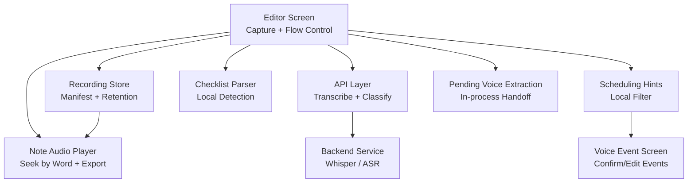

**Diagram sources**
- [editor.tsx:1965-2057](file://app/editor.tsx#L1965-L2057)
- [api.ts:361-423](file://src/api.ts#L361-L423)
- [recordingStore.ts:78-141](file://src/audio/recordingStore.ts#LL78-L141)
- [NoteAudioPlayer.tsx:87-118](file://src/components/NoteAudioPlayer.tsx#L87-L118)
- [checklistFromSpeech.ts:46-71](file://src/checklistFromSpeech.ts#L46-L71)
- [schedulingHints.ts:68-81](file://src/voice/schedulingHints.ts#L68-L81)
- [pendingVoiceEvents.ts:19-30](file://src/pendingVoiceEvents.ts#L19-L30)
- [voice-event.tsx:71-102](file://app/voice-event.tsx#L71-L102)

**Section sources**
- [editor.tsx:1965-2057](file://app/editor.tsx#L1965-L2057)
- [api.ts:361-423](file://src/api.ts#L361-L423)
- [recordingStore.ts:78-141](file://src/audio/recordingStore.ts#L78-L141)
- [NoteAudioPlayer.tsx:87-118](file://src/components/NoteAudioPlayer.tsx#L87-L118)
- [checklistFromSpeech.ts:46-71](file://src/checklistFromSpeech.ts#L46-L71)
- [schedulingHints.ts:68-81](file://src/voice/schedulingHints.ts#L68-L81)
- [pendingVoiceEvents.ts:19-30](file://src/pendingVoiceEvents.ts#L19-L30)
- [voice-event.tsx:71-102](file://app/voice-event.tsx#L71-L102)

## Core Components
- Speech-to-text integration: The editor triggers transcription via an API call that sends the recorded file to the backend; optional diarization is enabled for conversation-mode captures.
- Language detection and selection: A user preference controls whether to auto-detect language per recording or pin to English or Bahasa Indonesia; this preference is passed to the backend when not set to auto.
- Accuracy optimization: Conversation mode flags overlap and low-confidence regions; speaker turns are grouped; explicit language selection improves reliability for short or quiet clips.
- Checklist generation: Local deterministic parsing recognizes “create me a checklist” style prompts and builds TipTap-compatible task list markup without additional AI calls.
- Automatic formatting: Text can be organized via a backend text-processing endpoint; the editor supports inserting structured content and linking events back to notes.
- Word-level timing preservation: Word timings, duration, and full transcript text are stored locally so the player can seek by word and render accurate progress even if audio expires.
- Transcript storage format: Each recording record stores URI, timestamps, optional words array, duration, and transcript text; retention policies govern deletion.
- Player integration: The note audio player renders waveform-like bars from word timings, supports speed control, tap-to-seek, speaker rename in conversation mode, and exports audio or transcript.
- Export capabilities: Users can share audio files and plain transcript text; PDF export of notes includes linked events and attachments metadata.

**Section sources**
- [editor.tsx:1965-2057](file://app/editor.tsx#L1965-L2057)
- [api.ts:361-423](file://src/api.ts#L361-L423)
- [recordingStore.ts:176-205](file://src/audio/recordingStore.ts#L176-L205)
- [conversation.ts:64-106](file://src/audio/conversation.ts#L64-L106)
- [checklistFromSpeech.ts:46-71](file://src/checklistFromSpeech.ts#L46-L71)
- [retention.ts:33-54](file://src/audio/retention.ts#L33-L54)
- [NoteAudioPlayer.tsx:228-301](file://src/components/NoteAudioPlayer.tsx#L228-L301)

## Architecture Overview
The end-to-end flow begins with capturing audio in the editor or onboarding screen, storing it locally, transcribing via the backend, optionally classifying intent, and either inserting text into the note or routing to event confirmation. Word-level timing enables interactive playback and precise seeking.

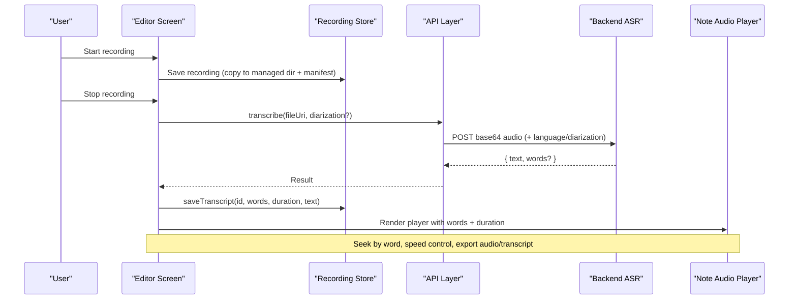

**Diagram sources**
- [editor.tsx:1965-2057](file://app/editor.tsx#L1965-L2057)
- [api.ts:361-423](file://src/api.ts#L361-L423)
- [recordingStore.ts:78-141](file://src/audio/recordingStore.ts#L78-L141)
- [NoteAudioPlayer.tsx:87-118](file://src/components/NoteAudioPlayer.tsx#L87-L118)

## Detailed Component Analysis

### Speech-to-Text Integration
- The editor orchestrates recording and transcription. On stop, it calls the transcription API with the recording URI and optional diarization flag for conversation-mode sessions.
- The API reads the file as base64, attaches auth headers, and posts to the backend transcription endpoint. If a spoken language preference is set (not auto), it is included in the request payload.
- After receiving the result, the editor marks the recording as transcribed, sweeps expired recordings based on retention policy, and persists word timings, duration, and transcript text to the local manifest.

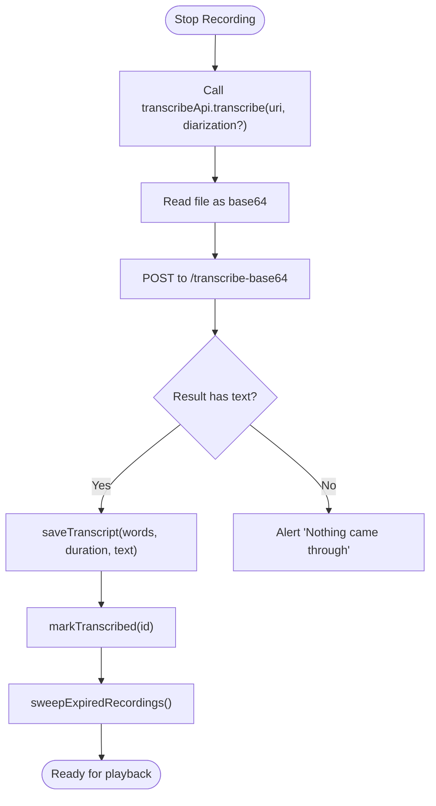

**Diagram sources**
- [editor.tsx:1965-2057](file://app/editor.tsx#L1965-L2057)
- [api.ts:361-423](file://src/api.ts#L361-L423)
- [recordingStore.ts:114-141](file://src/audio/recordingStore.ts#L114-L141)

**Section sources**
- [editor.tsx:1965-2057](file://app/editor.tsx#L1965-L2057)
- [api.ts:361-423](file://src/api.ts#L361-L423)
- [recordingStore.ts:114-141](file://src/audio/recordingStore.ts#L114-L141)

### Language Detection and Selection
- Auto-detect is the default; users can pin language to English or Bahasa Indonesia. The preference is read at transcription time and sent to the backend only when not set to auto.
- This helps avoid misclassification caused by short or quiet clips where Whisper’s per-clip detection may flip languages incorrectly.

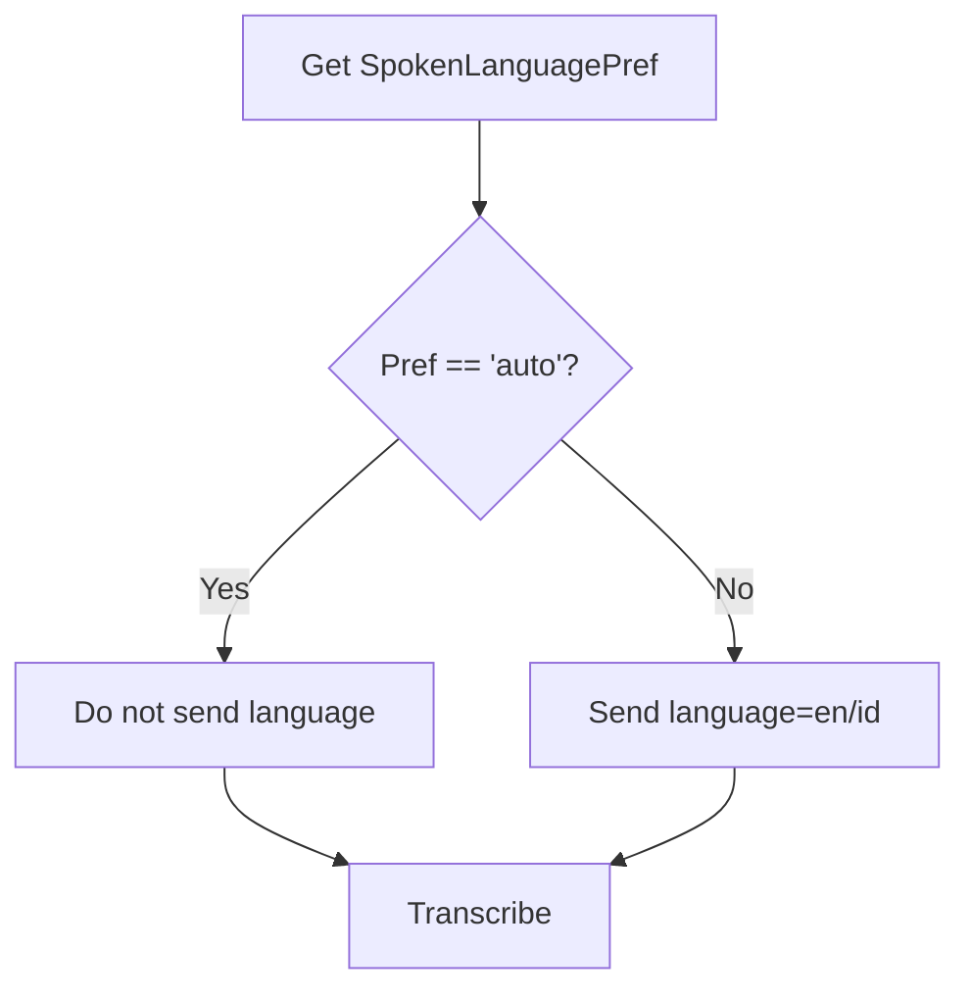

**Diagram sources**
- [recordingStore.ts:176-205](file://src/audio/recordingStore.ts#L176-L205)
- [api.ts:361-423](file://src/api.ts#L361-L423)

**Section sources**
- [recordingStore.ts:176-205](file://src/audio/recordingStore.ts#L176-L205)
- [api.ts:361-423](file://src/api.ts#L361-L423)

### Transcription Accuracy Optimization
- Conversation mode uses diarization to detect overlapping speech and unattributable segments. Words flagged for overlap or low confidence are merged into contiguous regions and visually marked rather than silently attributed.
- Speaker turns are grouped for display; low-confidence words are highlighted to encourage verification against the original audio.

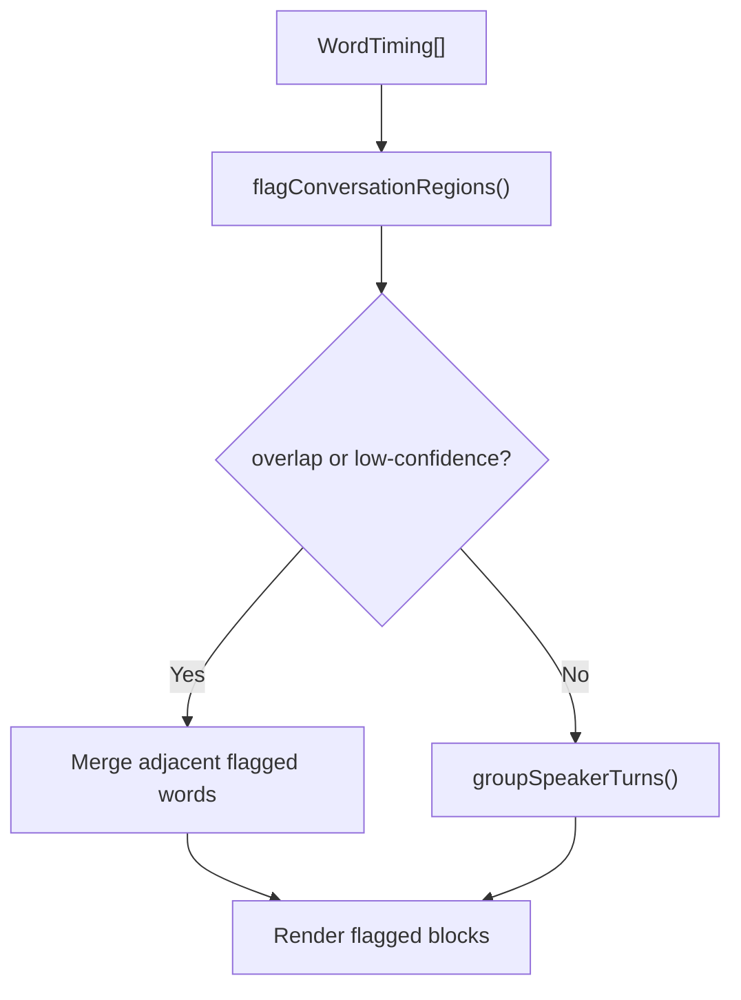

**Diagram sources**
- [conversation.ts:64-106](file://src/audio/conversation.ts#L64-L106)
- [conversation.ts:116-129](file://src/audio/conversation.ts#L116-L129)

**Section sources**
- [conversation.ts:64-106](file://src/audio/conversation.ts#L64-L106)
- [conversation.ts:116-129](file://src/audio/conversation.ts#L116-L129)

### Checklist Generation from Voice Input
- Local deterministic parser recognizes common checklist commands at the start of the transcript and extracts items separated by commas, semicolons, newlines, or “and”.
- When detected, the editor can build TipTap-compatible task list HTML directly, avoiding extra AI round-trips.

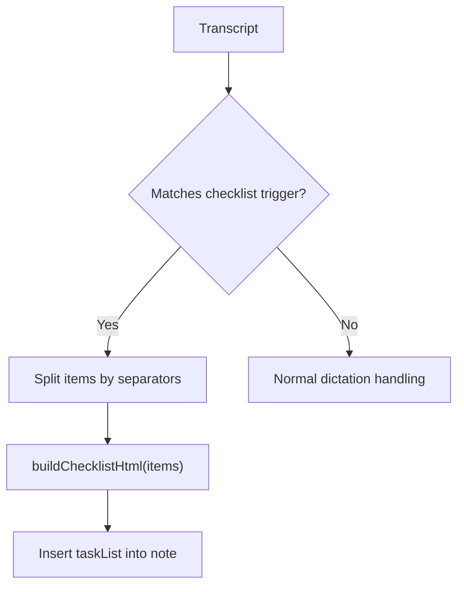

**Diagram sources**
- [checklistFromSpeech.ts:24-56](file://src/checklistFromSpeech.ts#L24-L56)
- [checklistFromSpeech.ts:62-71](file://src/checklistFromSpeech.ts#L62-L71)

**Section sources**
- [checklistFromSpeech.ts:24-56](file://src/checklistFromSpeech.ts#L24-L56)
- [checklistFromSpeech.ts:62-71](file://src/checklistFromSpeech.ts#L62-L71)

### Automatic Formatting of Spoken Content
- The editor can organize dictated text using a backend text-processing endpoint that detects note type and restructures content accordingly.
- For first-run onboarding, users can choose to keep raw text or organize it before saving.

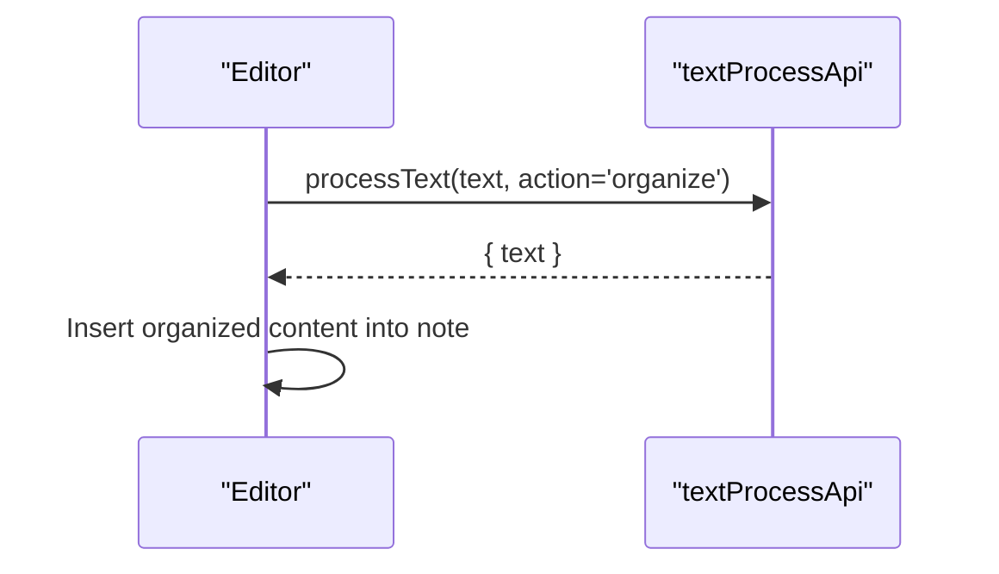

**Diagram sources**
- [api.ts:427-458](file://src/api.ts#L427-L458)
- [voice-onboarding.tsx:151-183](file://app/voice-onboarding.tsx#L151-L183)

**Section sources**
- [api.ts:427-458](file://src/api.ts#L427-L458)
- [voice-onboarding.tsx:151-183](file://app/voice-onboarding.tsx#L151-L183)

### Word-Level Timing Data Preservation
- Word timings include start/end times, optional speaker labels, and confidence values. These are persisted alongside total duration and full transcript text.
- The player uses these timings to render a waveform-like strip, highlight active words, and enable tap-to-seek.

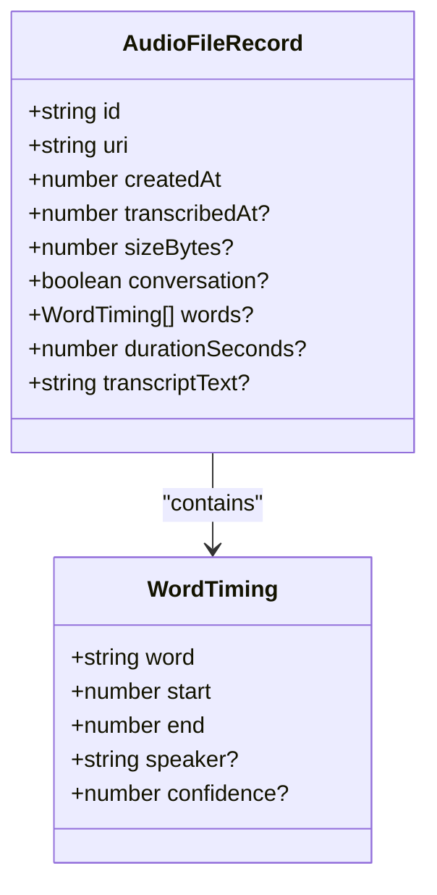

**Diagram sources**
- [retention.ts:15-25](file://src/audio/retention.ts#L15-L25)
- [retention.ts:33-54](file://src/audio/retention.ts#L33-L54)

**Section sources**
- [retention.ts:15-25](file://src/audio/retention.ts#L15-L25)
- [retention.ts:33-54](file://src/audio/retention.ts#L33-L54)

### Transcript Storage Format
- Each recording record stores:
  - File URI and creation timestamp
  - Optional transcription completion timestamp
  - Size in bytes
  - Conversation flag
  - Words array (if available)
  - Duration in seconds
  - Full transcript text
- Retention policies determine when recordings are deleted; conversation-mode recordings have stricter ceilings.

**Section sources**
- [retention.ts:33-54](file://src/audio/retention.ts#L33-L54)
- [retention.ts:56-81](file://src/audio/retention.ts#L56-L81)
- [recordingStore.ts:78-141](file://src/audio/recordingStore.ts#L78-L141)

### Integration with Note Editor’s Player for Seeking by Word
- The player renders a waveform strip derived from word timings and allows seeking by tapping anywhere on the strip or individual words.
- In conversation mode, speaker turns and flagged regions are displayed; users can rename speakers temporarily and play specific segments.

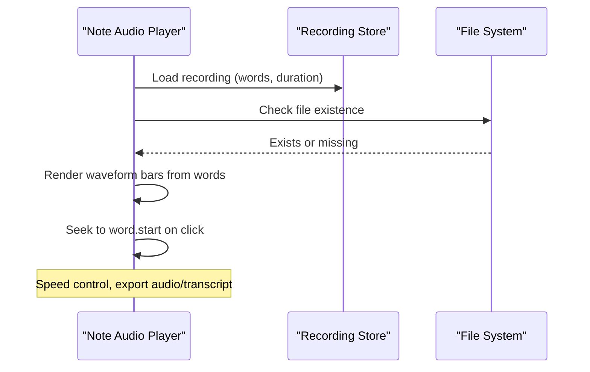

**Diagram sources**
- [NoteAudioPlayer.tsx:87-118](file://src/components/NoteAudioPlayer.tsx#L87-L118)
- [NoteAudioPlayer.tsx:135-150](file://src/components/NoteAudioPlayer.tsx#L135-L150)
- [NoteAudioPlayer.tsx:221-226](file://src/components/NoteAudioPlayer.tsx#L221-L226)

**Section sources**
- [NoteAudioPlayer.tsx:87-118](file://src/components/NoteAudioPlayer.tsx#L87-L118)
- [NoteAudioPlayer.tsx:135-150](file://src/components/NoteAudioPlayer.tsx#L135-L150)
- [NoteAudioPlayer.tsx:221-226](file://src/components/NoteAudioPlayer.tsx#L221-L226)

### Export Capabilities
- Audio export: Copies the recording to cache and shares via system sheet; conversation-mode audio includes a one-time warning about sharing other people’s voices.
- Transcript export: Writes transcript text to a temporary file and shares as plain text.
- Note export: Builds printable HTML including title, tags, source post card, linked events, and attachments; uses pagination-friendly CSS for multi-page notes.

**Section sources**
- [NoteAudioPlayer.tsx:228-301](file://src/components/NoteAudioPlayer.tsx#L228-L301)
- [editor.tsx:283-438](file://app/editor.tsx#L283-L438)

### Examples of Transcription Workflows
- Basic dictation: Record → transcribe → insert text into note → optional organize → save.
- Checklist creation: Speak “create me a checklist …” → local parser detects intent → build task list HTML → insert into note.
- Scheduling intent: Record → transcribe → local scheduling hints filter → classify intent → route to voice event screen → confirm/edit → save to calendar and optionally link to note.

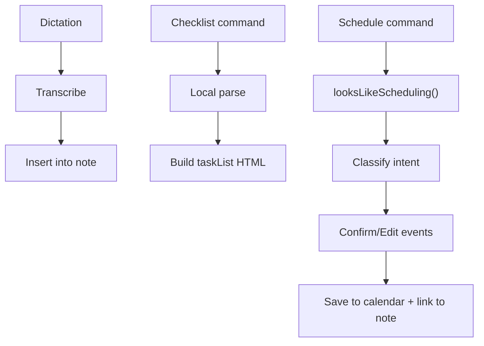

**Diagram sources**
- [checklistFromSpeech.ts:46-71](file://src/checklistFromSpeech.ts#L46-L71)
- [schedulingHints.ts:68-81](file://src/voice/schedulingHints.ts#L68-L81)
- [voice-event.tsx:141-231](file://app/voice-event.tsx#L141-L231)

**Section sources**
- [checklistFromSpeech.ts:46-71](file://src/checklistFromSpeech.ts#L46-L71)
- [schedulingHints.ts:68-81](file://src/voice/schedulingHints.ts#L68-L81)
- [voice-event.tsx:141-231](file://app/voice-event.tsx#L141-L231)

### Language Preference Handling
- Preferences are stored locally and retrieved at transcription time.
- Options include auto-detect, English, and Bahasa Indonesia; auto-detect is used unless explicitly overridden.

**Section sources**
- [recordingStore.ts:176-205](file://src/audio/recordingStore.ts#L176-L205)
- [api.ts:361-423](file://src/api.ts#L361-L423)

### Performance Considerations for Long Recordings
- Session length cap: Conversation-mode recordings automatically stop after a configured maximum duration to protect privacy and manage resources.
- Retention sweep: Expired recordings are deleted on app start or after transcription; immediate retention deletes audio once transcription completes.
- Manifest locking: Concurrent manifest mutations are serialized to prevent clobbering and ensure consistency.
- Token refresh and timeouts: API calls use timeouts and retry on 401 to avoid hanging sync operations.

**Section sources**
- [conversation.ts:18-20](file://src/audio/conversation.ts#L18-L20)
- [editor.tsx:757-771](file://app/editor.tsx#L757-L771)
- [recordingStore.ts:222-242](file://src/audio/recordingStore.ts#L222-L242)
- [api.ts:23-33](file://src/api.ts#L23-L33)
- [api.ts:74-121](file://src/api.ts#L74-L121)

## Dependency Analysis
The transcription pipeline depends on several modules:

- Editor orchestrates capture, transcription, and insertion.
- API layer provides authenticated requests with timeouts and token refresh.
- Recording store manages local file persistence, manifest updates, retention policies, and language preferences.
- Conversation utilities analyze word timings for overlap and low-confidence regions.
- Player integrates with stored words and durations for interactive playback and export.
- Checklist and scheduling modules provide fast local heuristics to reduce unnecessary network calls.

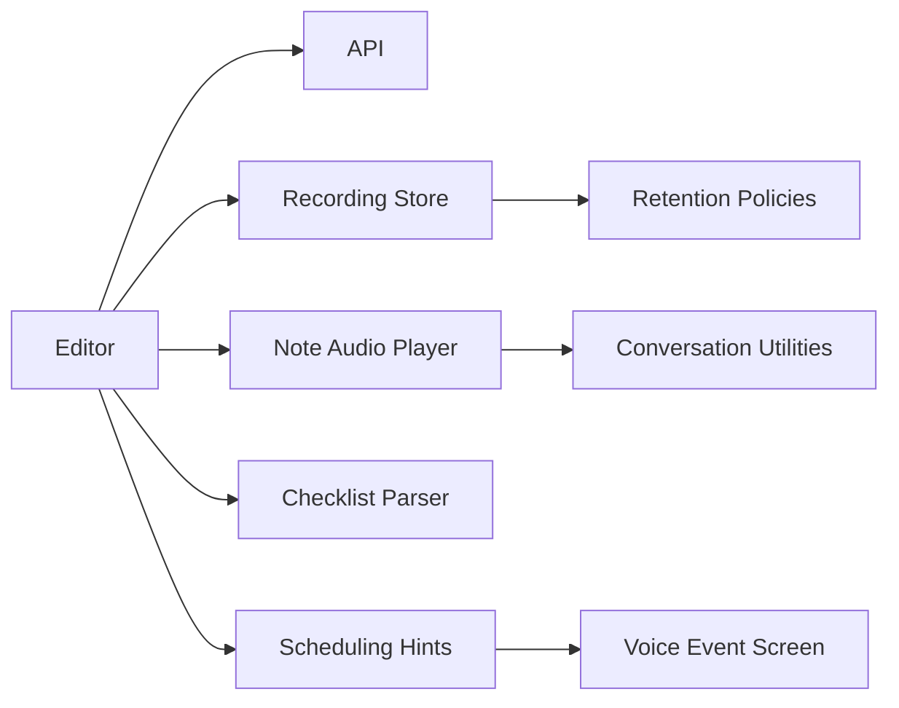

**Diagram sources**
- [editor.tsx:1965-2057](file://app/editor.tsx#L1965-L2057)
- [api.ts:361-423](file://src/api.ts#L361-L423)
- [recordingStore.ts:78-141](file://src/audio/recordingStore.ts#L78-L141)
- [NoteAudioPlayer.tsx:87-118](file://src/components/NoteAudioPlayer.tsx#L87-L118)
- [conversation.ts:64-106](file://src/audio/conversation.ts#L64-L106)
- [checklistFromSpeech.ts:46-71](file://src/checklistFromSpeech.ts#L46-L71)
- [schedulingHints.ts:68-81](file://src/voice/schedulingHints.ts#L68-L81)
- [voice-event.tsx:71-102](file://app/voice-event.tsx#L71-L102)

**Section sources**
- [editor.tsx:1965-2057](file://app/editor.tsx#L1965-L2057)
- [api.ts:361-423](file://src/api.ts#L361-L423)
- [recordingStore.ts:78-141](file://src/audio/recordingStore.ts#L78-L141)
- [NoteAudioPlayer.tsx:87-118](file://src/components/NoteAudioPlayer.tsx#L87-L118)
- [conversation.ts:64-106](file://src/audio/conversation.ts#L64-L106)
- [checklistFromSpeech.ts:46-71](file://src/checklistFromSpeech.ts#L46-L71)
- [schedulingHints.ts:68-81](file://src/voice/schedulingHints.ts#L68-L81)
- [voice-event.tsx:71-102](file://app/voice-event.tsx#L71-L102)

## Performance Considerations
- Use auto-detect language unless you experience frequent misclassification; pinning language reduces ambiguity for short or quiet clips.
- Enable diarization only for conversation-mode captures to gain overlap detection at the cost of additional processing.
- Keep retention policy aligned with storage needs; immediate retention frees space quickly but removes audio after transcription.
- Avoid redundant AI calls by leveraging local parsers for checklists and scheduling hints.
- Monitor session length caps in conversation mode to prevent excessively long recordings.

[No sources needed since this section provides general guidance]

## Troubleshooting Guide
- Empty transcription: If no text is returned, the app alerts the user and suggests trying again; backend filters silence hallucinations.
- Speaker labels unavailable: In conversation mode, if diarization is not supported by the server, the app notifies the user and continues with single-voice transcription.
- Missing audio: If the underlying file is deleted by retention sweeps, the player shows an expired message while preserving transcript text.
- Save failures: Event creation failures show an alert and allow retry; device calendar write failures are best-effort and do not block saving.

**Section sources**
- [editor.tsx:2046-2057](file://app/editor.tsx#L2046-L2057)
- [editor.tsx:1970-1976](file://app/editor.tsx#L1970-L1976)
- [NoteAudioPlayer.tsx:135-150](file://src/components/NoteAudioPlayer.tsx#L135-L150)
- [voice-event.tsx:177-190](file://app/voice-event.tsx#L177-L190)
- [voice-event.tsx:226-231](file://app/voice-event.tsx#L226-L231)

## Conclusion
The transcription pipeline combines robust local storage, flexible language preferences, accuracy-focused conversation analysis, and seamless integration with the note editor’s player. It supports efficient workflows for dictation, checklist creation, and scheduling, while preserving word-level timing for precise playback and export. Retention policies and session caps help manage storage and privacy, and local heuristics reduce unnecessary network calls.

[No sources needed since this section summarizes without analyzing specific files]

## Appendices

### Data Models
```mermaid
erDiagram
AUDIO_FILE_RECORD {
string id PK
string uri
number createdAt
number transcribedAt?
number sizeBytes?
boolean conversation
number durationSeconds?
string transcriptText?
}
WORD_TIMING {
string word
number start
number end
string speaker?
number confidence?
}
AUDIO_FILE_RECORD ||--o{ WORD_TIMING : "contains"
```

**Diagram sources**
- [retention.ts:15-25](file://src/audio/retention.ts#L15-L25)
- [retention.ts:33-54](file://src/audio/retention.ts#L33-L54)

**Section sources**
- [retention.ts:15-25](file://src/audio/retention.ts#L15-L25)
- [retention.ts:33-54](file://src/audio/retention.ts#L33-L54)