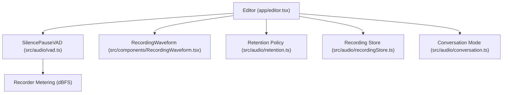
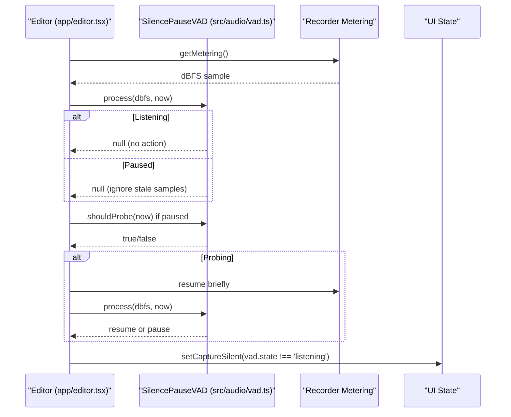
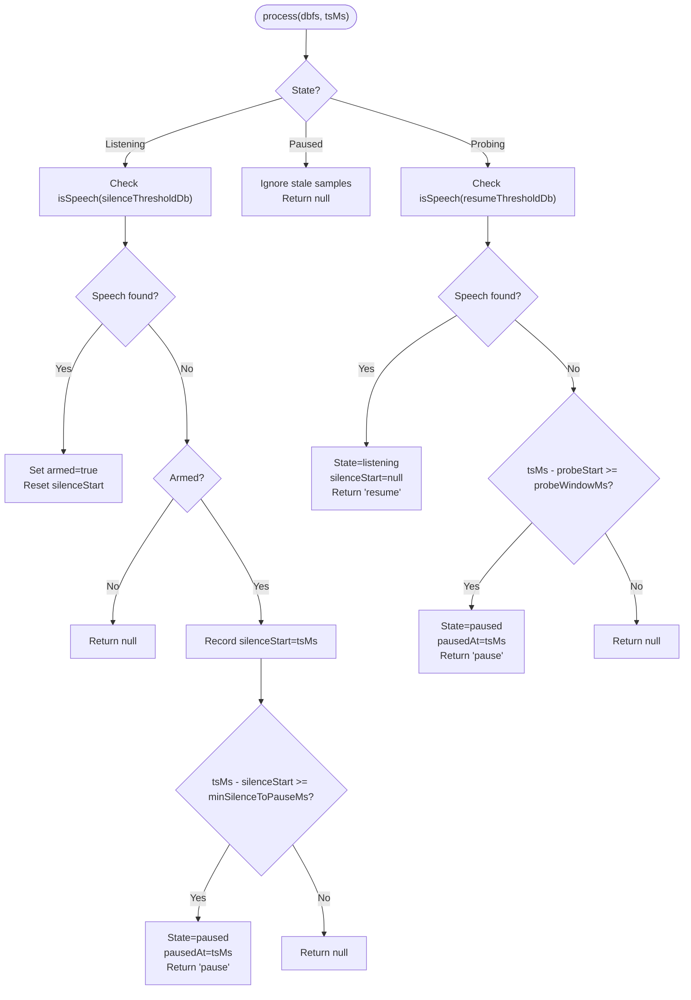
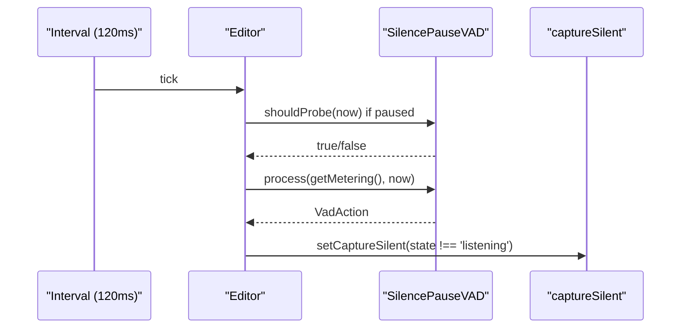
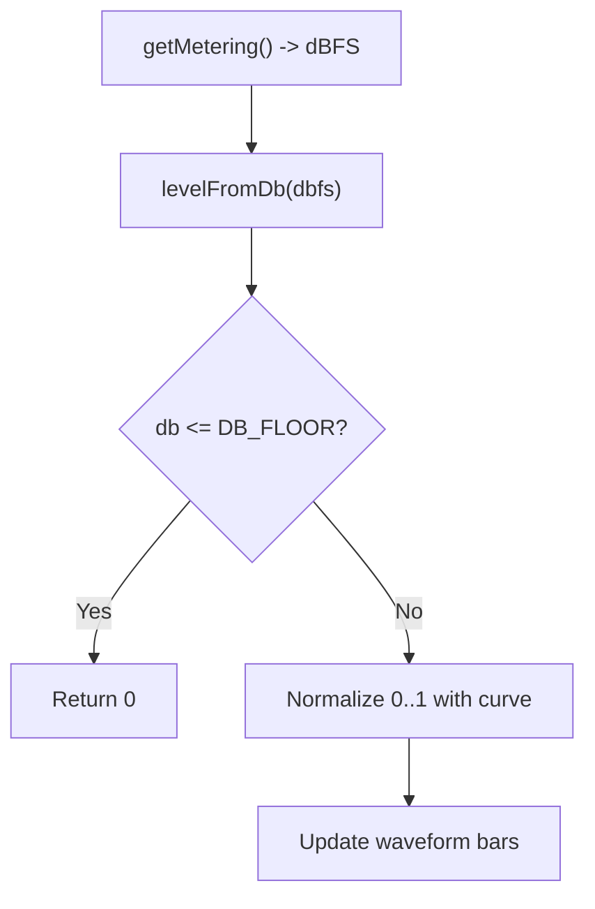
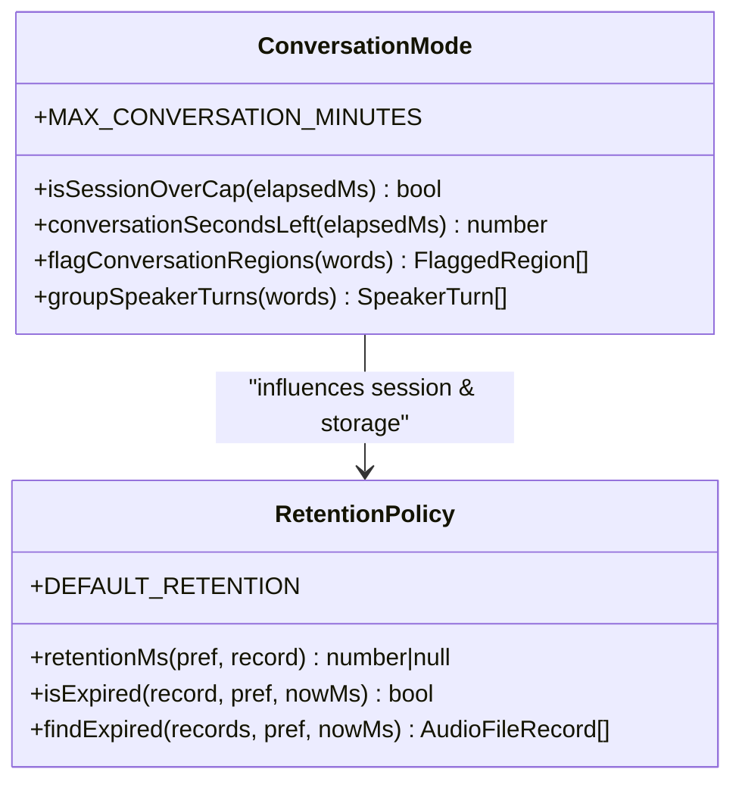
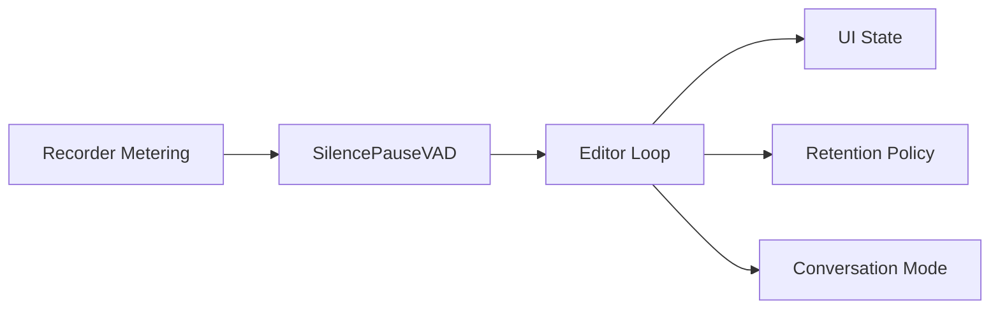

# Voice Activity Detection (VAD)

<cite>
**Referenced Files in This Document**
- [vad.ts](file://src/audio/vad.ts)
- [vad.test.ts](file://src/audio/vad.test.ts)
- [editor.tsx](file://app/editor.tsx)
- [RecordingWaveform.tsx](file://src/components/RecordingWaveform.tsx)
- [conversation.ts](file://src/audio/conversation.ts)
- [retention.ts](file://src/audio/retention.ts)
- [recordingStore.ts](file://src/audio/recordingStore.ts)
</cite>

## Table of Contents
1. [Introduction](#introduction)
2. [Project Structure](#project-structure)
3. [Core Components](#core-components)
4. [Architecture Overview](#architecture-overview)
5. [Detailed Component Analysis](#detailed-component-analysis)
6. [Dependency Analysis](#dependency-analysis)
7. [Performance Considerations](#performance-considerations)
8. [Troubleshooting Guide](#troubleshooting-guide)
9. [Conclusion](#conclusion)
10. [Appendices](#appendices)

## Introduction
This document explains the Voice Activity Detection (VAD) system that detects speech segments within audio recordings and integrates with the app’s recording workflow. The VAD uses a “segment, do not strip” strategy: it preserves natural pauses under a configured duration to maintain speech rhythm while pausing on extended silence to reduce upload size. It also includes a probe mechanism to avoid getting stuck paused when the user resumes speaking.

The VAD is implemented as pure logic without UI dependencies, making it easy to integrate into different recording flows. It processes real-time dBFS metering samples from the recorder, identifies speech boundaries using configurable thresholds, and emits actions for the caller to apply to the recorder or UI state.

## Project Structure
The VAD system spans several modules:
- Core VAD algorithm and configuration in src/audio/vad.ts
- Integration with the note editor’s recording loop in app/editor.tsx
- Real-time waveform visualization driven by metering in src/components/RecordingWaveform.tsx
- Conversation-mode policy and retention policies in src/audio/conversation.ts and src/audio/retention.ts
- Recording storage and manifest management in src/audio/recordingStore.ts

**Diagram sources**
- [editor.tsx:670-695](file://app/editor.tsx#L670-L695)
- [vad.ts:16-55](file://src/audio/vad.ts#L16-L55)
- [RecordingWaveform.tsx:1-28](file://src/components/RecordingWaveform.tsx#L1-L28)
- [retention.ts:11-54](file://src/audio/retention.ts#L11-L54)
- [recordingStore.ts:78-111](file://src/audio/recordingStore.ts#L78-L111)
- [conversation.ts:14-20](file://src/audio/conversation.ts#L14-L20)

**Section sources**
- [vad.ts:16-55](file://src/audio/vad.ts#L16-L55)
- [editor.tsx:670-695](file://app/editor.tsx#L670-L695)
- [RecordingWaveform.tsx:1-28](file://src/components/RecordingWaveform.tsx#L1-L28)
- [retention.ts:11-54](file://src/audio/retention.ts#L11-L54)
- [recordingStore.ts:78-111](file://src/audio/recordingStore.ts#L78-L111)
- [conversation.ts:14-20](file://src/audio/conversation.ts#L14-L20)

## Core Components
- SilencePauseVAD: A state machine that transitions between listening, paused, and probing states based on dBFS metering and time-based thresholds. It emits actions to pause/resume the recorder or update UI hints.
- Configuration: SilencePauseConfig defines thresholds and timing parameters for sensitivity tuning, including silence threshold, resume threshold, minimum silence duration, probe interval/window, and arm-on-first-speech behavior.
- Editor integration: The editor polls metering at ~16 Hz, feeds samples to VAD, updates capture silent state, and schedules probes while paused.
- Waveform visualization: Uses dBFS metering to render a live waveform, treating low levels as silence for display purposes.
- Conversation mode and retention: Conversation-mode policies and retention rules influence session length caps and local storage behavior around recorded content.

**Section sources**
- [vad.ts:19-44](file://src/audio/vad.ts#L19-L44)
- [vad.ts:57-127](file://src/audio/vad.ts#L57-L127)
- [editor.tsx:670-695](file://app/editor.tsx#L670-L695)
- [RecordingWaveform.tsx:16-28](file://src/components/RecordingWaveform.tsx#L16-L28)
- [conversation.ts:14-20](file://src/audio/conversation.ts#L14-L20)
- [retention.ts:11-54](file://src/audio/retention.ts#L11-L54)

## Architecture Overview
The VAD operates as a lightweight state machine integrated into the recording loop. It receives periodic dBFS samples from the recorder via the editor, evaluates them against configured thresholds, and returns actions to control recording or UI feedback. While paused, the VAD periodically probes for speech to ensure responsiveness.

**Diagram sources**
- [editor.tsx:670-695](file://app/editor.tsx#L670-L695)
- [vad.ts:74-117](file://src/audio/vad.ts#L74-L117)

## Detailed Component Analysis

### SilencePauseVAD Algorithm
The VAD implements a three-state machine:
- Listening: Records continuously; arms after first speech; tracks sustained silence start time.
- Paused: Ignores metering samples; waits for probe interval before checking again.
- Probing: Briefly resumes to listen; if speech above resume threshold is detected, returns to listening; otherwise re-pauses after probe window.

Key behaviors:
- Hysteresis: Resume threshold is higher than silence threshold to prevent flapping due to ambient noise.
- Natural pauses preserved: Short pauses below minSilenceToPauseMs are kept in the recording to preserve rhythm.
- Robustness: Undefined or NaN metering treated as silence; reset restores initial armed state.

**Diagram sources**
- [vad.ts:74-117](file://src/audio/vad.ts#L74-L117)

**Section sources**
- [vad.ts:19-44](file://src/audio/vad.ts#L19-L44)
- [vad.ts:57-127](file://src/audio/vad.ts#L57-L127)
- [vad.test.ts:25-147](file://src/audio/vad.test.ts#L25-L147)

### Editor Integration and Real-Time Processing
The editor sets up a VAD instance with modified probe settings for live UI feedback rather than recorder control. It polls metering every ~120 ms, feeds samples to VAD, updates capture silent state, and triggers probes when paused.

**Diagram sources**
- [editor.tsx:670-695](file://app/editor.tsx#L670-L695)
- [vad.ts:111-117](file://src/audio/vad.ts#L111-L117)

**Section sources**
- [editor.tsx:670-695](file://app/editor.tsx#L670-L695)
- [vad.ts:111-117](file://src/audio/vad.ts#L111-L117)

### Waveform Visualization and Metering
The waveform component uses dBFS metering to render a live visual representation of audio levels. It treats levels below a floor as silence to avoid flattening the visible range during quiet periods.

**Diagram sources**
- [RecordingWaveform.tsx:16-28](file://src/components/RecordingWaveform.tsx#L16-L28)

**Section sources**
- [RecordingWaveform.tsx:1-28](file://src/components/RecordingWaveform.tsx#L1-L28)

### Conversation Mode and Retention Policies
Conversation mode enforces session length caps and flags regions where overlap or low confidence is detected. Retention policies determine how long recordings are kept locally, with conversation-mode recordings subject to stricter expiration.

**Diagram sources**
- [conversation.ts:14-20](file://src/audio/conversation.ts#L14-L20)
- [conversation.ts:64-106](file://src/audio/conversation.ts#L64-L106)
- [retention.ts:11-54](file://src/audio/retention.ts#L11-L54)
- [retention.ts:59-81](file://src/audio/retention.ts#L59-L81)

**Section sources**
- [conversation.ts:14-20](file://src/audio/conversation.ts#L14-L20)
- [conversation.ts:64-106](file://src/audio/conversation.ts#L64-L106)
- [retention.ts:11-54](file://src/audio/retention.ts#L11-L54)
- [retention.ts:59-81](file://src/audio/retention.ts#L59-L81)

## Dependency Analysis
The VAD depends on:
- Recorder metering: Provides dBFS samples used for activity detection.
- Editor loop: Polls metering and applies VAD decisions to UI state and recorder controls.
- Retention and conversation policies: Influence session behavior and storage lifecycle.

**Diagram sources**
- [editor.tsx:670-695](file://app/editor.tsx#L670-L695)
- [vad.ts:74-117](file://src/audio/vad.ts#L74-L117)
- [retention.ts:59-81](file://src/audio/retention.ts#L59-L81)
- [conversation.ts:64-106](file://src/audio/conversation.ts#L64-L106)

**Section sources**
- [editor.tsx:670-695](file://app/editor.tsx#L670-L695)
- [vad.ts:74-117](file://src/audio/vad.ts#L74-L117)
- [retention.ts:59-81](file://src/audio/retention.ts#L59-L81)
- [conversation.ts:64-106](file://src/audio/conversation.ts#L64-L106)

## Performance Considerations
- Sampling rate: The editor polls metering at approximately 16 Hz (~120 ms intervals), balancing responsiveness with CPU usage.
- Threshold tuning: Adjust silenceThresholdDb and resumeThresholdDb to match device microphone characteristics and environment noise.
- Probe interval/window: For UI-only feedback, probeIntervalMs can be zeroed to evaluate every tick; for recorder control, tune probeIntervalMs and probeWindowMs to balance responsiveness and power usage.
- Natural pauses: minSilenceToPauseMs preserves short pauses to maintain speech rhythm; increase for more aggressive silence trimming.

[No sources needed since this section provides general guidance]

## Troubleshooting Guide
Common issues and resolutions:
- False positives (pausing too early): Increase minSilenceToPauseMs or adjust silenceThresholdDb to be less sensitive.
- Missed detections (not resuming quickly enough): Decrease probeIntervalMs or probeWindowMs; ensure resumeThresholdDb is appropriately set.
- Ambient noise causing flapping: Use hysteresis by ensuring resumeThresholdDb is higher than silenceThresholdDb.
- Stuck paused: Verify probe cycle is active; check that shouldProbe is called at appropriate intervals.
- Undefined/NaN metering: Treated as silence; ensure recorder status is available and metering is enabled.

**Section sources**
- [vad.ts:19-44](file://src/audio/vad.ts#L19-L44)
- [vad.ts:74-117](file://src/audio/vad.ts#L74-L117)
- [vad.test.ts:122-134](file://src/audio/vad.test.ts#L122-L134)

## Conclusion
The VAD system provides a robust, configurable approach to detecting speech segments in real-time audio recordings. By preserving natural pauses and using a probe mechanism, it balances accuracy with efficiency. Integration with the editor enables responsive UI feedback and optional recorder control. Tuning thresholds and timing parameters allows adaptation to different devices and environments.

[No sources needed since this section summarizes without analyzing specific files]

## Appendices

### Configuration Options
- silenceThresholdDb: dBFS level below which samples count as silence.
- resumeThresholdDb: dBFS level above which samples count as speech during probing (hysteresis).
- minSilenceToPauseMs: Minimum sustained silence required to trigger pause.
- probeIntervalMs: Interval between probes while paused.
- probeWindowMs: Duration to listen during a probe before re-pausing.
- armOnFirstSpeech: Whether to wait for first speech before allowing pause.

**Section sources**
- [vad.ts:19-44](file://src/audio/vad.ts#L19-L44)

### VAD Output Formats
- VadState: 'listening' | 'paused' | 'probing'
- VadAction: 'pause' | 'resume' | null
- SilencePauseConfig: Object with threshold and timing parameters

**Section sources**
- [vad.ts:16-55](file://src/audio/vad.ts#L16-L55)