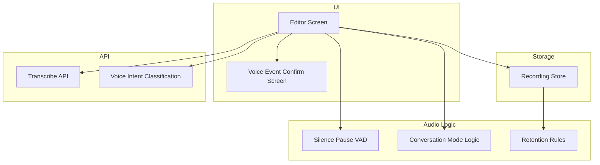
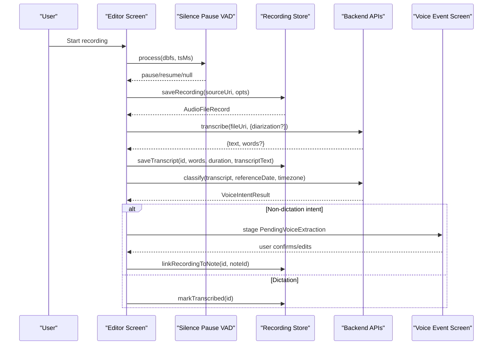
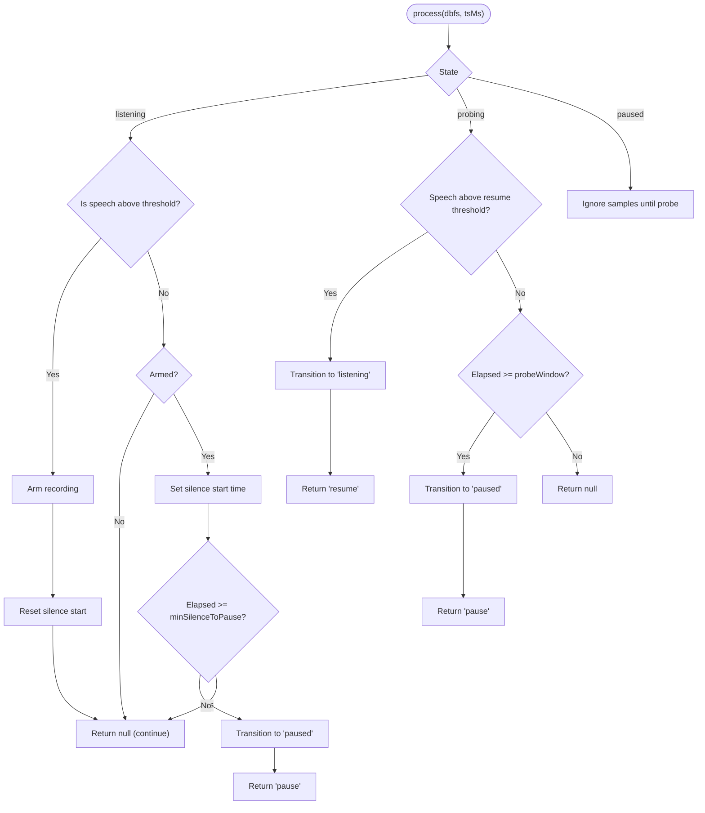
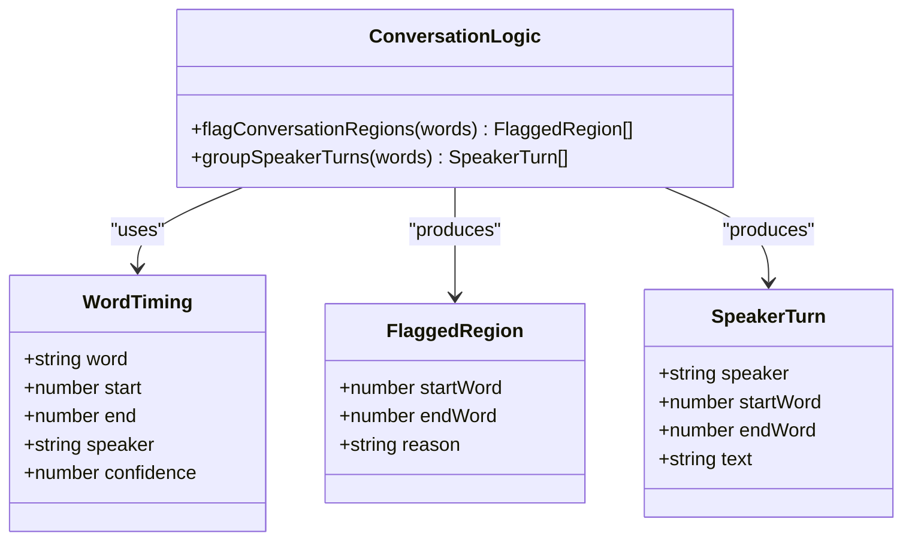
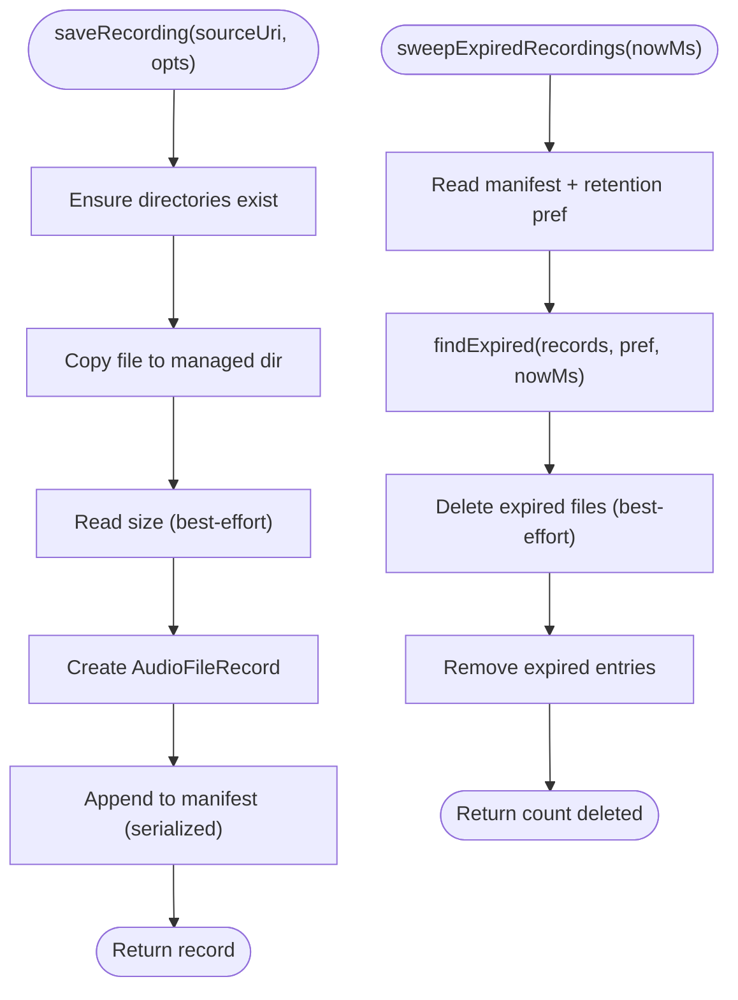
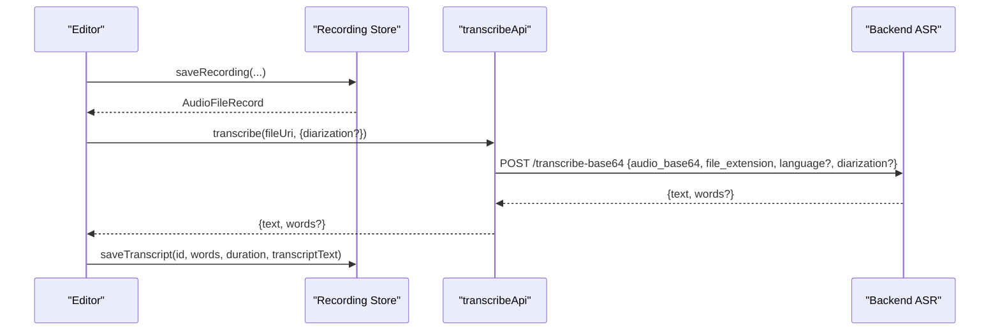
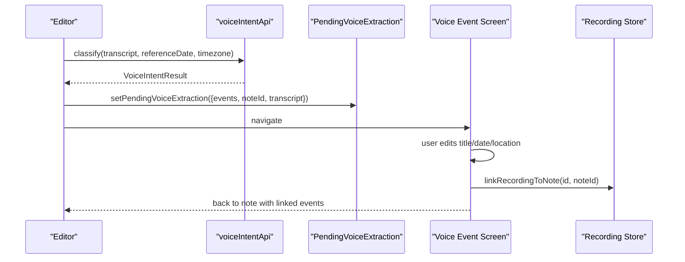
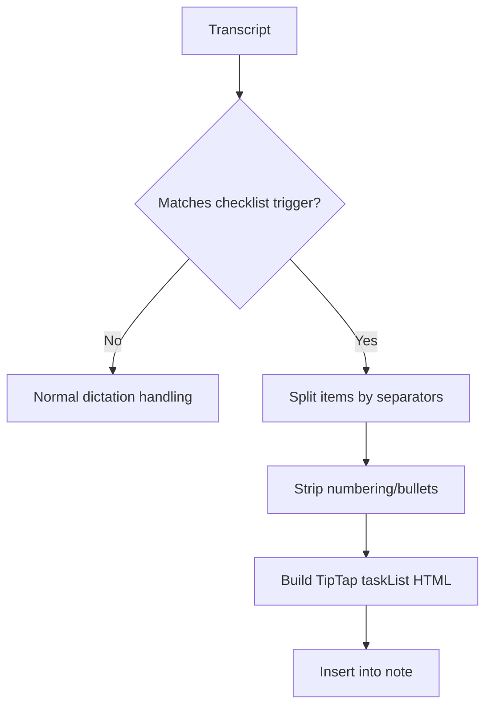
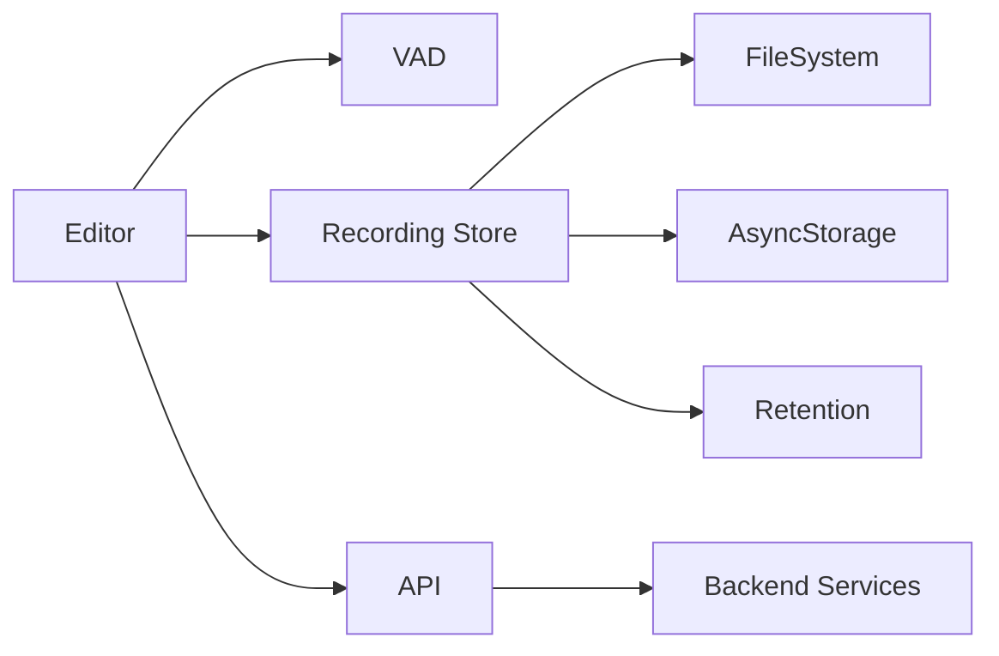

# Voice Recording

<cite>
**Referenced Files in This Document**
- [editor.tsx](file://app/editor.tsx)
- [voice-event.tsx](file://app/voice-event.tsx)
- [conversation.ts](file://src/audio/conversation.ts)
- [recordingStore.ts](file://src/audio/recordingStore.ts)
- [retention.ts](file://src/audio/retention.ts)
- [vad.ts](file://src/audio/vad.ts)
- [checklistFromSpeech.ts](file://src/checklistFromSpeech.ts)
- [api.ts](file://src/api.ts)
- [pendingVoiceEvents.ts](file://src/pendingVoiceEvents.ts)
- [RecordingWaveform.tsx](file://src/components/RecordingWaveform.tsx)
</cite>

## Table of Contents
1. [Introduction](#introduction)
2. [Project Structure](#project-structure)
3. [Core Components](#core-components)
4. [Architecture Overview](#architecture-overview)
5. [Detailed Component Analysis](#detailed-component-analysis)
6. [Dependency Analysis](#dependency-analysis)
7. [Performance Considerations](#performance-considerations)
8. [Troubleshooting Guide](#troubleshooting-guide)
9. [Conclusion](#conclusion)

## Introduction
This document explains the voice recording system implemented in the frontend codebase. It covers audio capture, voice activity detection (VAD), storage and retention policies, transcription integration, processing of transcriptions into structured notes, and checklist generation from spoken input. It also provides examples of typical workflows, accuracy considerations, and performance techniques for handling large audio files.

## Project Structure
The voice recording feature spans UI screens, audio utilities, storage management, and API integrations:
- Editor screen orchestrates recording, VAD, transcription, and post-processing.
- Audio utilities implement VAD, conversation-mode logic, and retention rules.
- Storage manages local file persistence and manifest tracking.
- API layer integrates with backend services for transcription and intent classification.
- Checklist parsing converts specific spoken commands into structured task lists.

**Diagram sources**
- [editor.tsx:29-38](file://app/editor.tsx#L29-L38)
- [recordingStore.ts:1-20](file://src/audio/recordingStore.ts#L1-L20)
- [vad.ts:1-15](file://src/audio/vad.ts#L1-L15)
- [conversation.ts:1-20](file://src/audio/conversation.ts#L1-L20)
- [retention.ts:1-15](file://src/audio/retention.ts#L1-L15)
- [api.ts:361-423](file://src/api.ts#L361-L423)
- [api.ts:460-486](file://src/api.ts#L460-L486)

**Section sources**
- [editor.tsx:29-38](file://app/editor.tsx#L29-L38)
- [recordingStore.ts:1-20](file://src/audio/recordingStore.ts#L1-L20)
- [vad.ts:1-15](file://src/audio/vad.ts#L1-L15)
- [conversation.ts:1-20](file://src/audio/conversation.ts#L1-L20)
- [retention.ts:1-15](file://src/audio/retention.ts#L1-L15)
- [api.ts:361-423](file://src/api.ts#L361-L423)
- [api.ts:460-486](file://src/api.ts#L460-L486)

## Core Components
- Audio capture and waveform visualization: The editor uses a recorder and displays live metering via a waveform component to confirm mic activity.
- Voice activity detection: A silence-pause VAD pauses recording during extended quiet periods and probes periodically to resume when speech is detected.
- Conversation mode: Detects overlapping speech and low-confidence segments; groups speaker turns and flags regions that should not be presented as confident single-speaker transcripts.
- Storage and retention: Recordings are copied to managed storage with a JSON manifest; retention policies determine deletion timing, including stricter limits for conversation recordings.
- Transcription integration: Audio is uploaded to a backend endpoint for transcription; optional diarization can return word-level timings and speaker labels.
- Post-processing: Transcripts can be classified for voice intents (events/trips) or parsed into structured checklists using deterministic local logic.

**Section sources**
- [editor.tsx:29-38](file://app/editor.tsx#L29-L38)
- [RecordingWaveform.tsx:1-20](file://src/components/RecordingWaveform.tsx#L1-L20)
- [vad.ts:16-44](file://src/audio/vad.ts#L16-L44)
- [conversation.ts:41-106](file://src/audio/conversation.ts#L41-L106)
- [recordingStore.ts:78-141](file://src/audio/recordingStore.ts#L78-L141)
- [retention.ts:11-57](file://src/audio/retention.ts#L11-L57)
- [api.ts:361-423](file://src/api.ts#L361-L423)
- [api.ts:460-486](file://src/api.ts#L460-L486)

## Architecture Overview
The voice recording flow begins in the editor screen, which controls recording, applies VAD, saves audio locally, transcribes via the backend, and processes results into notes or events.

**Diagram sources**
- [editor.tsx:29-38](file://app/editor.tsx#L29-L38)
- [recordingStore.ts:78-141](file://src/audio/recordingStore.ts#L78-L141)
- [api.ts:361-423](file://src/api.ts#L361-L423)
- [api.ts:460-486](file://src/api.ts#L460-L486)
- [pendingVoiceEvents.ts:11-30](file://src/pendingVoiceEvents.ts#L11-L30)
- [voice-event.tsx:71-102](file://app/voice-event.tsx#L71-L102)

## Detailed Component Analysis

### Audio Capture and Waveform Visualization
- The editor integrates an audio recorder and exposes metering values to a waveform component. The waveform polls metering at a moderate interval to reflect real-time audio levels without overloading the JS thread.
- Visual feedback includes chimes on start/stop and a foreground notification on Android to make capture state obvious.

Key behaviors:
- Metering polling interval balances responsiveness and performance.
- Levels are normalized and clamped to avoid flat visuals during long silences.

**Section sources**
- [editor.tsx:82-102](file://app/editor.tsx#L82-L102)
- [RecordingWaveform.tsx:12-28](file://src/components/RecordingWaveform.tsx#L12-L28)

### Voice Activity Detection (VAD)
- The VAD implements a “segment, do not strip” strategy: natural short pauses remain in the recording to preserve rhythm and punctuation cues; only extended silence triggers pausing.
- States: listening, paused, probing. While paused, it periodically resumes briefly to detect speech and re-pauses if still silent.
- Configurable thresholds include silence/resume dBFS levels, minimum silence duration, probe intervals, and an arm-on-first-speech behavior to avoid immediate pausing on fresh recordings.

**Diagram sources**
- [vad.ts:57-127](file://src/audio/vad.ts#L57-L127)

**Section sources**
- [vad.ts:16-44](file://src/audio/vad.ts#L16-L44)
- [vad.ts:57-127](file://src/audio/vad.ts#L57-L127)

### Conversation Mode Logic
- Flags regions where overlapping speech or missing speaker labels occur, and marks low-confidence words. Adjacent flagged words merge into contiguous regions for UI rendering.
- Groups words into speaker turns for display, preserving text per turn.

**Diagram sources**
- [conversation.ts:41-106](file://src/audio/conversation.ts#L41-L106)
- [retention.ts:15-25](file://src/audio/retention.ts#L15-L25)

**Section sources**
- [conversation.ts:41-106](file://src/audio/conversation.ts#L41-L106)

### Recording Storage Management and Retention
- Recordings are copied from the recorder’s cache into a managed directory with a JSON manifest storing metadata (id, uri, createdAt, sizeBytes, noteId, conversation flag, words, durationSeconds, transcriptText).
- Manifest mutations are serialized to prevent concurrent writes from clobbering each other.
- Retention policy determines how long recordings persist:
  - Immediate: delete after transcription completes (except conversation recordings, which follow stricter rules).
  - 30 days: rolling window.
  - Indefinite: keep until manually deleted.
  - Conversation recordings have a fixed ceiling regardless of preference.
- Sweep function deletes expired files and cleans up manifest entries.

**Diagram sources**
- [recordingStore.ts:78-141](file://src/audio/recordingStore.ts#L78-L141)
- [recordingStore.ts:222-241](file://src/audio/recordingStore.ts#L222-L241)
- [retention.ts:59-81](file://src/audio/retention.ts#L59-L81)

**Section sources**
- [recordingStore.ts:23-72](file://src/audio/recordingStore.ts#L23-L72)
- [recordingStore.ts:78-141](file://src/audio/recordingStore.ts#L78-L141)
- [recordingStore.ts:176-184](file://src/audio/recordingStore.ts#L176-L184)
- [recordingStore.ts:222-241](file://src/audio/recordingStore.ts#L222-L241)
- [retention.ts:11-57](file://src/audio/retention.ts#L11-L57)
- [retention.ts:59-81](file://src/audio/retention.ts#L59-L81)

### Integration with Speech-to-Text Services
- The editor uploads recorded audio to a backend endpoint for transcription. The request includes base64-encoded audio, file extension, optional diarization, and optionally a pinned language preference.
- Responses contain full transcript text and optional word-level timings (for seekable playback and speaker grouping).
- After transcription, the app persists word timings, duration, and transcript text onto the recording record.

**Diagram sources**
- [api.ts:361-423](file://src/api.ts#L361-L423)
- [recordingStore.ts:128-141](file://src/audio/recordingStore.ts#L128-L141)

**Section sources**
- [api.ts:361-423](file://src/api.ts#L361-L423)
- [recordingStore.ts:128-141](file://src/audio/recordingStore.ts#L128-L141)

### Voice Intent Classification and Event Creation
- If the transcript indicates non-dictation intent (e.g., scheduling events or creating a trip), the app calls a classification endpoint to extract structured event data.
- Results are staged in memory and navigated to a confirmation screen where users can edit titles, dates, locations, and recurrence before saving.
- Saving writes to device calendar, creates offline records, and optionally links back to the note.

**Diagram sources**
- [api.ts:460-486](file://src/api.ts#L460-L486)
- [pendingVoiceEvents.ts:11-30](file://src/pendingVoiceEvents.ts#L11-L30)
- [voice-event.tsx:71-102](file://app/voice-event.tsx#L71-L102)
- [voice-event.tsx:141-232](file://app/voice-event.tsx#L141-L232)
- [recordingStore.ts:121-126](file://src/audio/recordingStore.ts#L121-L126)

**Section sources**
- [api.ts:460-486](file://src/api.ts#L460-L486)
- [pendingVoiceEvents.ts:11-30](file://src/pendingVoiceEvents.ts#L11-L30)
- [voice-event.tsx:71-102](file://app/voice-event.tsx#L71-L102)
- [voice-event.tsx:141-232](file://app/voice-event.tsx#L141-L232)

### Checklist Generation from Voice Input
- Deterministic local parsing recognizes spoken requests like “create me a checklist…” and extracts items separated by commas, semicolons, newlines, or “and”.
- Generates TipTap-compatible HTML for interactive task lists, ensuring proper escaping and structure.

**Diagram sources**
- [checklistFromSpeech.ts:24-56](file://src/checklistFromSpeech.ts#L24-L56)
- [checklistFromSpeech.ts:62-71](file://src/checklistFromSpeech.ts#L62-L71)

**Section sources**
- [checklistFromSpeech.ts:24-56](file://src/checklistFromSpeech.ts#L24-L56)
- [checklistFromSpeech.ts:62-71](file://src/checklistFromSpeech.ts#L62-L71)

## Dependency Analysis
- Editor depends on VAD, Recording Store, Conversation Logic, and API modules to orchestrate the full voice workflow.
- Recording Store depends on FileSystem and AsyncStorage for persistence and preferences; it also relies on retention logic for cleanup decisions.
- API module centralizes network calls, including transcription and intent classification, with token refresh and timeout handling.
- Checklist parsing is self-contained and deterministic, avoiding additional AI calls.

**Diagram sources**
- [editor.tsx:29-38](file://app/editor.tsx#L29-L38)
- [recordingStore.ts:11-21](file://src/audio/recordingStore.ts#L11-L21)
- [api.ts:15-21](file://src/api.ts#L15-L21)
- [api.ts:84-121](file://src/api.ts#L84-L121)

**Section sources**
- [editor.tsx:29-38](file://app/editor.tsx#L29-L38)
- [recordingStore.ts:11-21](file://src/audio/recordingStore.ts#L11-L21)
- [api.ts:15-21](file://src/api.ts#L15-L21)
- [api.ts:84-121](file://src/api.ts#L84-L121)

## Performance Considerations
- VAD reduces upload size by pausing during extended silence and only resuming briefly to probe for speech, minimizing unnecessary audio capture.
- Waveform polling uses a moderate interval to balance responsiveness and CPU usage.
- Manifest mutations are serialized to prevent race conditions and ensure consistent state across parallel operations.
- Large audio files are handled by streaming encrypted uploads for attachments; transcription uploads use base64 payloads to a backend service. For very large files, consider chunking strategies server-side or optimizing audio formats to reduce payload size.
- Retention sweeps run safely on app start and delete expired files without failing the entire operation.

[No sources needed since this section provides general guidance]

## Troubleshooting Guide
- Token refresh failures: The API layer retries once on 401 Unauthorized; if refresh fails, it throws a session-expired error prompting login.
- Transcription errors: Network or backend issues throw descriptive errors; ensure correct file extension and language preference settings.
- Storage issues: Filesystem operations are best-effort; missing files are ignored during deletion, and manifests are updated accordingly.
- VAD stuck states: The probing mechanism prevents getting stuck paused; ensure the caller invokes shouldProbe and resumes the recorder as needed.

**Section sources**
- [api.ts:104-114](file://src/api.ts#L104-L114)
- [api.ts:409-421](file://src/api.ts#L409-L421)
- [recordingStore.ts:161-173](file://src/audio/recordingStore.ts#L161-L173)
- [vad.ts:111-117](file://src/audio/vad.ts#L111-L117)

## Conclusion
The voice recording system combines robust audio capture, intelligent VAD, reliable storage with configurable retention, and seamless integration with backend transcription and intent classification. It supports conversation-mode safeguards, structured checklist generation, and event creation workflows. With careful attention to performance and error handling, it delivers a responsive and privacy-conscious voice experience suitable for both casual dictation and structured scheduling tasks.

[No sources needed since this section summarizes without analyzing specific files]