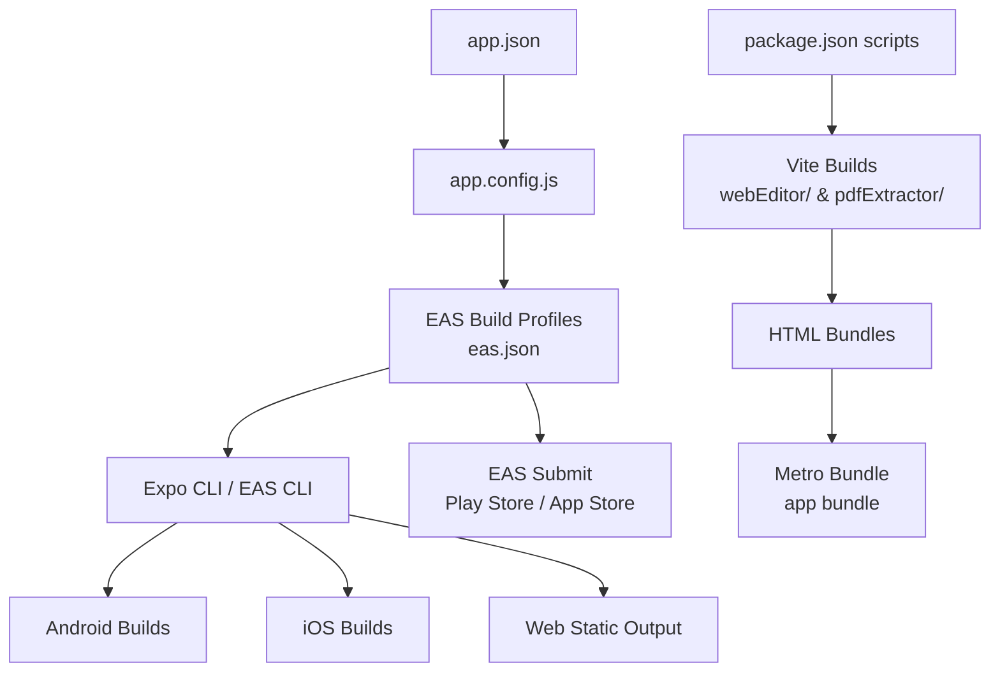
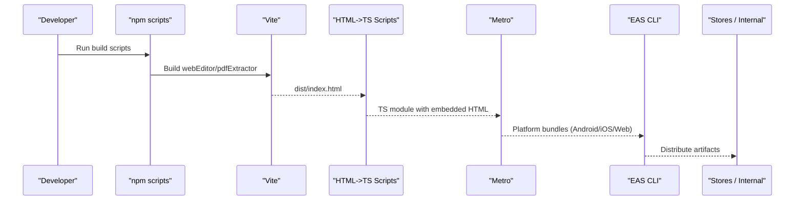
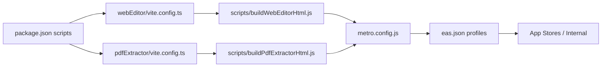

# Deployment & Build

<cite>
**Referenced Files in This Document**
- [package.json](file://package.json)
- [app.config.js](file://app.config.js)
- [app.json](file://app.json)
- [eas.json](file://eas.json)
- [metro.config.js](file://metro.config.js)
- [webEditor/vite.config.ts](file://webEditor/vite.config.ts)
- [pdfExtractor/vite.config.ts](file://pdfExtractor/vite.config.ts)
- [scripts/buildWebEditorHtml.js](file://scripts/buildWebEditorHtml.js)
- [scripts/buildPdfExtractorHtml.js](file://scripts/buildPdfExtractorHtml.js)
- [src/crypto/flags.ts](file://src/crypto/flags.ts)
- [src/backendBaseUrl.ts](file://src/backendBaseUrl.ts)
</cite>

## Table of Contents
1. [Introduction](#introduction)
2. [Project Structure](#project-structure)
3. [Core Components](#core-components)
4. [Architecture Overview](#architecture-overview)
5. [Detailed Component Analysis](#detailed-component-analysis)
6. [Dependency Analysis](#dependency-analysis)
7. [Performance Considerations](#performance-considerations)
8. [Troubleshooting Guide](#troubleshooting-guide)
9. [Conclusion](#conclusion)
10. [Appendices](#appendices)

## Introduction
This document explains the complete deployment and build pipeline for this Expo-based application. It covers:
- EAS configuration for building iOS, Android, and web artifacts
- Build scripts that generate the web editor HTML and PDF extractor utilities
- Environment configuration management and feature flags
- CI/CD integration points, automated testing, and deployment automation
- App store submission, beta distribution, and over-the-air updates
- Troubleshooting common build issues and platform-specific problems
- Examples of custom build configurations and deployment workflows

## Project Structure
The project uses a layered configuration approach:
- app.json defines static metadata (name, slug, version, icons, permissions, plugins).
- app.config.js dynamically augments app.json with environment-driven settings and feature flags.
- eas.json defines EAS build profiles, environment variables, and submission targets.
- package.json provides npm scripts for development, testing, and specialized builds (web editor, PDF extractor).
- metro.config.js configures Metro bundling behavior and web-native stubs.
- Vite configs under webEditor/ and pdfExtractor/ produce single-file HTML bundles consumed by the app at runtime.

**Diagram sources**
- [app.json:1-159](file://app.json#L1-L159)
- [app.config.js:1-57](file://app.config.js#L1-L57)
- [eas.json:1-67](file://eas.json#L1-L67)
- [package.json:1-125](file://package.json#L1-L125)

**Section sources**
- [app.json:1-159](file://app.json#L1-L159)
- [app.config.js:1-57](file://app.config.js#L1-L57)
- [eas.json:1-67](file://eas.json#L1-L67)
- [package.json:1-125](file://package.json#L1-L125)

## Core Components
- EAS build profiles define environments for development, preview, and production builds, including environment variables and distribution types.
- Dynamic app configuration gates cleartext traffic and feature flags based on build profile or release markers.
- Web asset pipelines use Vite to create self-contained HTML files for the editor and PDF extractor, then convert them into TypeScript modules for inclusion in the main bundle.
- Metro is configured to avoid native-only dependencies on the web target by aliasing them to safe stubs.
- Feature flags are read at runtime from expo-constants and influence UI and behavior.

Key responsibilities:
- EAS profiles: isolate secrets and toggles per environment; control auto-increment and distribution.
- app.config.js: compute isProduction, set cleartext permission, and expose extra flags to the app.
- Vite configs: inline assets and ensure single-file outputs suitable for WebView loading.
- Scripts: transform built HTML into TS modules consumable by Metro at bundle time.
- Metro: provide stable caching and web-safe resolution.

**Section sources**
- [eas.json:1-67](file://eas.json#L1-L67)
- [app.config.js:1-57](file://app.config.js#L1-L57)
- [webEditor/vite.config.ts:1-40](file://webEditor/vite.config.ts#L1-L40)
- [pdfExtractor/vite.config.ts:1-22](file://pdfExtractor/vite.config.ts#L1-L22)
- [scripts/buildWebEditorHtml.js:1-23](file://scripts/buildWebEditorHtml.js#L1-L23)
- [scripts/buildPdfExtractorHtml.js:1-25](file://scripts/buildPdfExtractorHtml.js#L1-L25)
- [metro.config.js:1-37](file://metro.config.js#L1-L37)

## Architecture Overview
The build and deployment architecture spans three layers:
- Configuration layer: app.json + app.config.js + eas.json define app identity, platform settings, and environment-specific behavior.
- Build layer: Vite produces single-file HTML assets; scripts embed them as TS constants; Metro bundles the app for each platform.
- Distribution layer: EAS builds and submits artifacts to stores or internal distribution channels.

**Diagram sources**
- [package.json:1-125](file://package.json#L1-L125)
- [webEditor/vite.config.ts:1-40](file://webEditor/vite.config.ts#L1-L40)
- [pdfExtractor/vite.config.ts:1-22](file://pdfExtractor/vite.config.ts#L1-L22)
- [scripts/buildWebEditorHtml.js:1-23](file://scripts/buildWebEditorHtml.js#L1-L23)
- [scripts/buildPdfExtractorHtml.js:1-25](file://scripts/buildPdfExtractorHtml.js#L1-L25)
- [eas.json:1-67](file://eas.json#L1-L67)

## Detailed Component Analysis

### EAS Configuration and Build Profiles
- Profiles:
  - development: development client, internal distribution, APK output, env vars for analytics and Google OAuth.
  - preview: internal distribution, APK output, same env as development.
  - preview-bundle: internal distribution, Android app bundle output.
  - production: auto-increment enabled, sets NUESCO_RELEASE to mark production, includes env vars.
  - production-apk: explicit APK variant for production.
- Submission: submit section defined for production.

Operational notes:
- Use eas build --profile <name> to select the desired environment.
- Production profiles set NUESCO_RELEASE=1 to disable cleartext and diagnostics in app.config.js.
- The cli.version enforces a minimum EAS CLI version.

**Section sources**
- [eas.json:1-67](file://eas.json#L1-L67)

### Dynamic App Configuration and Feature Flags
- isProduction is derived from EAS_BUILD_PROFILE or NUESCO_RELEASE.
- Cleartext traffic is disabled in production via expo-build-properties plugin.
- Feature flags exposed through extra:
  - e2eeKeys: always true in this codebase.
  - e2eeMigration: controlled by E2EE_MIGRATION environment variable.
  - diagnostics: disabled in production.
  - feedbackToast: build-time toggle.
  - googleAndroidClientId: optional, enables Google Calendar connect flow when set.

Runtime consumption:
- Feature flags are read via expo-constants.extra in the app.
- Crypto-related flags are centralized in src/crypto/flags.ts.

Environment variables:
- EXPO_PUBLIC_BACKEND_URL overrides backend origin if provided; otherwise defaults to production URL.

**Section sources**
- [app.config.js:1-57](file://app.config.js#L1-L57)
- [src/crypto/flags.ts:1-34](file://src/crypto/flags.ts#L1-L34)
- [src/backendBaseUrl.ts:1-14](file://src/backendBaseUrl.ts#L1-L14)

### Web Editor and PDF Extractor Pipelines
- Vite builds produce single-file HTML bundles for both the editor and PDF extractor.
- Scripts convert these HTML files into TypeScript modules exporting the HTML content as strings.
- The generated TS modules are checked into source so Metro can include them at bundle time without external loaders.

Build commands:
- build:web-editor runs Vite for webEditor/, then transforms the output HTML into a TS module.
- build:pdf-extractor runs Vite for pdfExtractor/, then transforms the output HTML into a TS module.

Optimization details:
- Single-file output ensures no separate script/style fetches inside WebView contexts.
- Assets are inlined to keep the bundle self-contained.

**Section sources**
- [webEditor/vite.config.ts:1-40](file://webEditor/vite.config.ts#L1-L40)
- [pdfExtractor/vite.config.ts:1-22](file://pdfExtractor/vite.config.ts#L1-L22)
- [scripts/buildWebEditorHtml.js:1-23](file://scripts/buildWebEditorHtml.js#L1-L23)
- [scripts/buildPdfExtractorHtml.js:1-25](file://scripts/buildPdfExtractorHtml.js#L1-L25)
- [package.json:1-125](file://package.json#L1-L125)

### Metro Configuration and Web Compatibility
- Stable on-disk cache via FileStore improves rebuild performance across platforms.
- Native-only packages are stubbed out for web builds to prevent import-time crashes.
- Worker count reduced to limit resource usage during builds.

Common impact:
- Ensures web builds do not pull in native modules that would fail at runtime.
- Improves local dev iteration speed with persistent caching.

**Section sources**
- [metro.config.js:1-37](file://metro.config.js#L1-L37)

### Testing Integration
- Test scripts run unit tests for crypto, sharing, sync, audio, and Google integrations using Node with a custom resolver.
- These can be integrated into CI to validate core logic before builds.

Suggested CI steps:
- Install dependencies
- Run linting
- Execute test suites
- Trigger EAS builds for preview and production profiles

**Section sources**
- [package.json:1-125](file://package.json#L1-L125)

### CI/CD Pipeline Setup
While no CI/CD file is present in the repository, you can integrate with GitHub Actions or similar by:
- Installing dependencies
- Running tests and lint
- Building web assets (editor and PDF extractor)
- Triggering EAS builds with appropriate profiles
- Uploading artifacts or submitting to stores using EAS CLI

Example workflow outline:
- On push to main: trigger production build and submit
- On PR: trigger preview builds and run tests
- Cache node_modules and EAS credentials securely

[No sources needed since this section provides general guidance]

### Deployment Automation and OTA Updates
- EAS Update supports over-the-air updates for JavaScript changes without rebuilding native binaries.
- Configure EAS Update projects and publish updates after successful builds.
- Ensure update channel alignment with app versions and feature flags.

[No sources needed since this section provides general guidance]

### App Store Submission Processes
- EAS submit integrates with Play Store and App Store Connect.
- Use eas submit --platform android|ios --profile production to upload artifacts.
- Ensure signing keys and provisioning profiles are configured in EAS.

**Section sources**
- [eas.json:1-67](file://eas.json#L1-L67)

### Beta Distribution
- Preview and development profiles distribute internally via EAS.
- Use eas build --profile preview or development to generate installable artifacts.
- Share links with testers or integrate with internal distribution tools.

**Section sources**
- [eas.json:1-67](file://eas.json#L1-L67)

## Dependency Analysis
The build process has clear separation between configuration, asset generation, and platform bundling.

**Diagram sources**
- [package.json:1-125](file://package.json#L1-L125)
- [webEditor/vite.config.ts:1-40](file://webEditor/vite.config.ts#L1-L40)
- [pdfExtractor/vite.config.ts:1-22](file://pdfExtractor/vite.config.ts#L1-L22)
- [scripts/buildWebEditorHtml.js:1-23](file://scripts/buildWebEditorHtml.js#L1-L23)
- [scripts/buildPdfExtractorHtml.js:1-25](file://scripts/buildPdfExtractorHtml.js#L1-L25)
- [metro.config.js:1-37](file://metro.config.js#L1-L37)
- [eas.json:1-67](file://eas.json#L1-L67)

**Section sources**
- [package.json:1-125](file://package.json#L1-L125)
- [metro.config.js:1-37](file://metro.config.js#L1-L37)
- [eas.json:1-67](file://eas.json#L1-L67)

## Performance Considerations
- Use stable cache roots for Metro to reduce rebuild times across platforms.
- Limit worker threads to balance CPU usage during builds.
- Inline assets in Vite outputs to avoid network requests in WebView contexts.
- Keep feature flags minimal and evaluate only once at startup.
- Prefer preview builds for faster iteration; reserve production builds for final releases.

[No sources needed since this section provides general guidance]

## Troubleshooting Guide
Common issues and resolutions:
- Web build fails due to native modules:
  - Ensure metro.config.js aliases native-only packages to stubs for web.
  - Verify that webNativeStubs.js exists and exports safe placeholders.
- Cleartext traffic warnings on Android:
  - Confirm isProduction disables usesCleartextTraffic in production builds.
  - Ensure backend URLs use HTTPS in production.
- Missing environment variables:
  - Check eas.json env blocks for required keys like POSTHOG and GOOGLE_ANDROID_CLIENT_ID.
  - Validate EXPO_PUBLIC_BACKEND_URL if overriding backend origin.
- Feature flags not taking effect:
  - Confirm app.config.js extra fields are set correctly for the selected profile.
  - Verify runtime reads from Constants.expoConfig.extra.
- Slow builds:
  - Increase METRO_CACHE_ROOT size or clean stale caches if necessary.
  - Reduce maxWorkers if system resources are constrained.

**Section sources**
- [metro.config.js:1-37](file://metro.config.js#L1-L37)
- [app.config.js:1-57](file://app.config.js#L1-L57)
- [eas.json:1-67](file://eas.json#L1-L67)
- [src/backendBaseUrl.ts:1-14](file://src/backendBaseUrl.ts#L1-L14)

## Conclusion
This project employs a robust, layered build and deployment strategy:
- EAS profiles isolate environments and control feature exposure.
- Vite-based pipelines generate self-contained HTML assets for embedded use.
- Metro ensures cross-platform compatibility and efficient builds.
- Tests and linting can be integrated into CI to maintain quality.
- EAS submit streamlines store submissions and beta distribution.

Adopting the recommended CI/CD patterns and troubleshooting steps will help maintain reliable releases and rapid iteration.

[No sources needed since this section summarizes without analyzing specific files]

## Appendices

### Build Commands Reference
- Start development server: npm start
- Run platform-specific dev servers: npm run android | ios | web
- Build web editor HTML: npm run build:web-editor
- Build PDF extractor HTML: npm run build:pdf-extractor
- Run tests: npm run test:crypto | test:share | test:sync | test:vad | test:google
- Lint: npm run lint

**Section sources**
- [package.json:1-125](file://package.json#L1-L125)

### Example Custom Build Configurations
- Add a new EAS profile for staging:
  - Define a staging profile with its own env vars and distribution type.
  - Set feature flags via extra in app.config.js based on a staging marker.
- Customize backend origin:
  - Provide EXPO_PUBLIC_BACKEND_URL in the environment to route API calls to a staging endpoint.
- Enable migration builds:
  - Set E2EE_MIGRATION=1 for builds that should perform one-time data migrations.

**Section sources**
- [eas.json:1-67](file://eas.json#L1-L67)
- [app.config.js:1-57](file://app.config.js#L1-L57)
- [src/backendBaseUrl.ts:1-14](file://src/backendBaseUrl.ts#L1-L14)