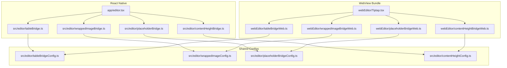
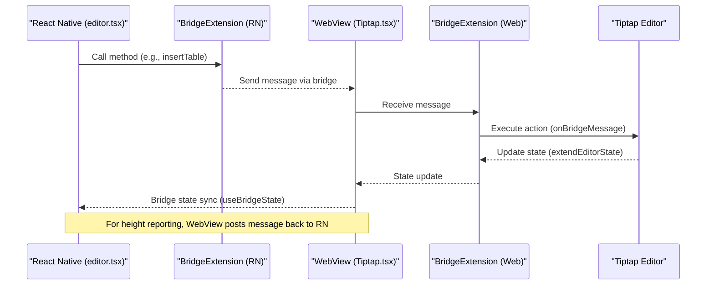
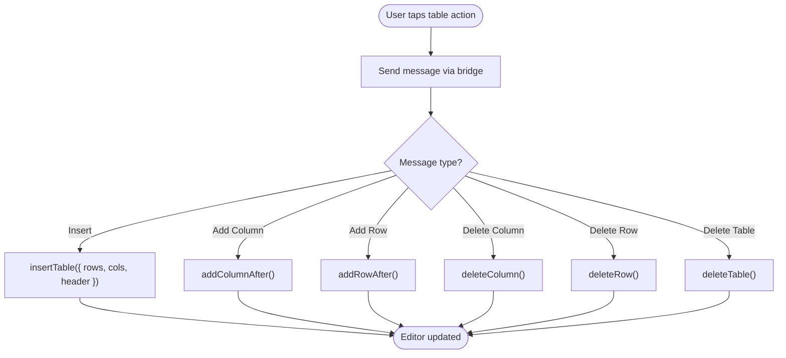
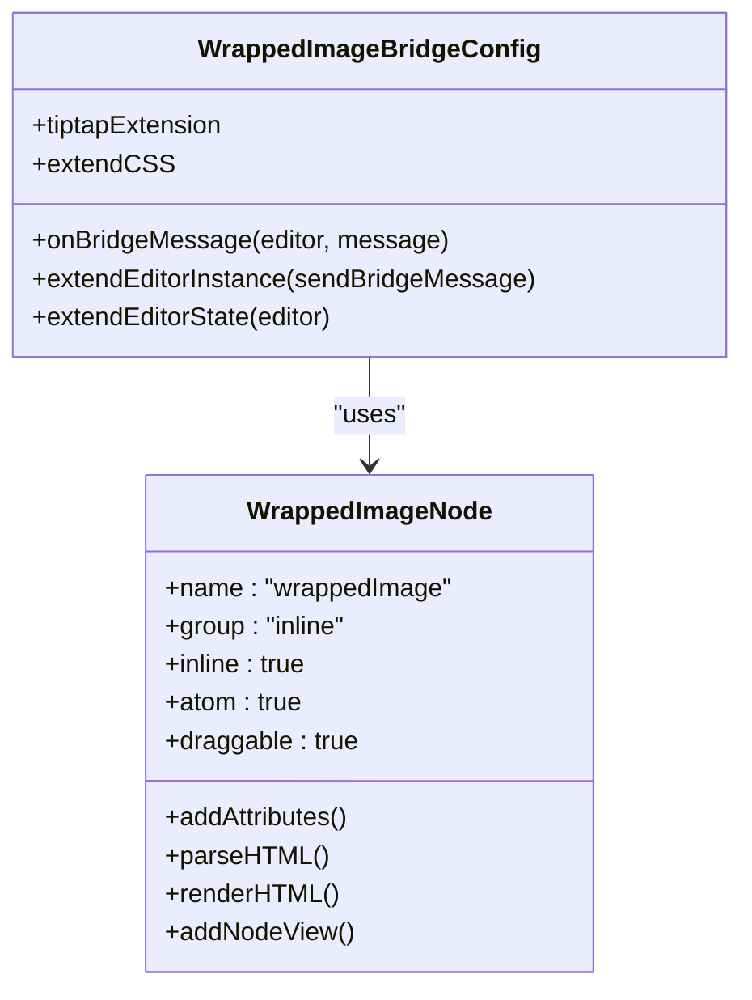
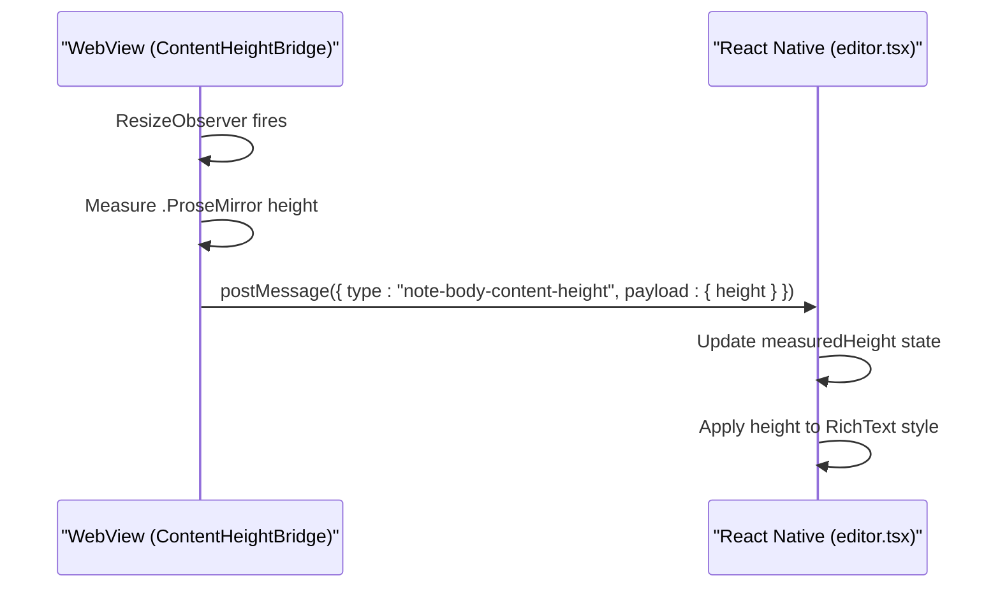
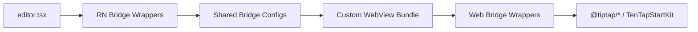

# Bridge Architecture

<cite>
**Referenced Files in This Document**
- [editor.tsx](file://app/editor.tsx)
- [tableBridge.ts](file://src/editor/tableBridge.ts)
- [wrappedImageBridge.ts](file://src/editor/wrappedImageBridge.ts)
- [placeholderBridge.ts](file://src/editor/placeholderBridge.ts)
- [contentHeightBridge.ts](file://src/editor/contentHeightBridge.ts)
- [tableBridgeConfig.ts](file://src/editor/tableBridgeConfig.ts)
- [wrappedImageConfig.ts](file://src/editor/wrappedImageConfig.ts)
- [placeholderBridgeConfig.ts](file://src/editor/placeholderBridgeConfig.ts)
- [contentHeightConfig.ts](file://src/editor/contentHeightConfig.ts)
- [Tiptap.tsx](file://webEditor/Tiptap.tsx)
- [tableBridgeWeb.ts](file://webEditor/tableBridgeWeb.ts)
- [wrappedImageBridgeWeb.ts](file://webEditor/wrappedImageBridgeWeb.ts)
- [placeholderBridgeWeb.ts](file://webEditor/placeholderBridgeWeb.ts)
- [contentHeightBridgeWeb.ts](file://webEditor/contentHeightBridgeWeb.ts)
- [buildWebEditorHtml.js](file://scripts/buildWebEditorHtml.js)
</cite>

## Table of Contents
1. [Introduction](#introduction)
2. [Project Structure](#project-structure)
3. [Core Components](#core-components)
4. [Architecture Overview](#architecture-overview)
5. [Detailed Component Analysis](#detailed-component-analysis)
6. [Dependency Analysis](#dependency-analysis)
7. [Performance Considerations](#performance-considerations)
8. [Troubleshooting Guide](#troubleshooting-guide)
9. [Conclusion](#conclusion)

## Introduction
This document explains the editor bridge architecture that enables platform-specific implementations while maintaining consistent APIs across React Native and web environments. It focuses on the BridgeExtension pattern used to abstract platform differences, the configuration-based approach for defining bridge behaviors, and how bridges communicate between React Native and the web via a WebView. It also covers creating custom bridges, implementing platform-specific logic, handling data serialization, integrating with Tiptap, error handling strategies, and performance considerations for cross-platform communication.

## Project Structure
The bridge system is split into two sides:
- React Native side: thin wrappers that import shared configs and declare type augmentations for EditorBridge/BridgeState.
- Web side (inside a custom WebView bundle): corresponding wrappers that import the same configs but use the web export of BridgeExtension.

Key directories and files:
- app/editor.tsx: Composes TenTapStartKit with custom bridges, wires up message handling, and exposes an imperative API to drive the editor.
- src/editor/*: Shared configurations and RN-side wrapper modules for each bridge.
- webEditor/*: Web-side wrappers and the custom Tiptap entry that registers bridges inside the WebView bundle.
- scripts/buildWebEditorHtml.js: Builds the custom web editor HTML and embeds it into the RN app so the WebView can load it.

**Diagram sources**
- [editor.tsx:456-462](file://app/editor.tsx#L456-L462)
- [tableBridge.ts:14-22](file://src/editor/tableBridge.ts#L14-L22)
- [wrappedImageBridge.ts:8-16](file://src/editor/wrappedImageBridge.ts#L8-L16)
- [placeholderBridge.ts:12-15](file://src/editor/placeholderBridge.ts#L12-L15)
- [contentHeightBridge.ts:8-11](file://src/editor/contentHeightBridge.ts#L8-L11)
- [tableBridgeConfig.ts:20-124](file://src/editor/tableBridgeConfig.ts#L20-L124)
- [wrappedImageConfig.ts:25-308](file://src/editor/wrappedImageConfig.ts#L25-L308)
- [placeholderBridgeConfig.ts:18-37](file://src/editor/placeholderBridgeConfig.ts#L18-L37)
- [contentHeightConfig.ts:43-106](file://src/editor/contentHeightConfig.ts#L43-L106)
- [Tiptap.tsx:17-54](file://webEditor/Tiptap.tsx#L17-L54)
- [tableBridgeWeb.ts:8-11](file://webEditor/tableBridgeWeb.ts#L8-L11)
- [wrappedImageBridgeWeb.ts:9-12](file://webEditor/wrappedImageBridgeWeb.ts#L9-L12)
- [placeholderBridgeWeb.ts:6-9](file://webEditor/placeholderBridgeWeb.ts#L6-L9)
- [contentHeightBridgeWeb.ts:9-12](file://webEditor/contentHeightBridgeWeb.ts#L9-L12)

**Section sources**
- [editor.tsx:456-480](file://app/editor.tsx#L456-L480)
- [buildWebEditorHtml.js:1-23](file://scripts/buildWebEditorHtml.js#L1-L23)

## Core Components
- BridgeExtension pattern: Each bridge is a configuration object describing the Tiptap extension, message handlers, instance/state extensions, and optional CSS. The RN and web sides instantiate BridgeExtension from their respective paths using the same config.
- Shared configs: Contain all behavior and types; they are imported by both sides to ensure consistency.
- Custom WebView bundle: The web side includes only the necessary bridges and replaces default components (e.g., placeholder) to match app requirements.
- Message channel: Bridges send messages from RN to WebView and receive messages back (e.g., content height).

Examples of bridges:
- TableBridge: Adds table operations and state.
- WrappedImageBridge: Adds text-wrapped images with resize handle and alignment.
- NotePlaceholderBridge: Replaces stock placeholder to show only when the first paragraph is empty.
- ContentHeightBridge: Reports real rendered height from the WebView back to RN.

**Section sources**
- [tableBridge.ts:14-22](file://src/editor/tableBridge.ts#L14-L22)
- [tableBridgeConfig.ts:20-124](file://src/editor/tableBridgeConfig.ts#L20-L124)
- [wrappedImageBridge.ts:8-16](file://src/editor/wrappedImageBridge.ts#L8-L16)
- [wrappedImageConfig.ts:25-308](file://src/editor/wrappedImageConfig.ts#L25-L308)
- [placeholderBridge.ts:12-15](file://src/editor/placeholderBridge.ts#L12-L15)
- [placeholderBridgeConfig.ts:18-37](file://src/editor/placeholderBridgeConfig.ts#L18-L37)
- [contentHeightBridge.ts:8-11](file://src/editor/contentHeightBridge.ts#L8-L11)
- [contentHeightConfig.ts:43-106](file://src/editor/contentHeightConfig.ts#L43-L106)

## Architecture Overview
The editor uses a WebView to run a custom-built Tiptap bundle. The RN side composes TenTapStartKit with custom bridges and passes them to the editor. The WebView bundle mirrors this composition, ensuring both sides understand the same bridge names and messages.

**Diagram sources**
- [editor.tsx:456-480](file://app/editor.tsx#L456-L480)
- [Tiptap.tsx:32-54](file://webEditor/Tiptap.tsx#L32-L54)
- [tableBridgeConfig.ts:46-86](file://src/editor/tableBridgeConfig.ts#L46-L86)
- [contentHeightConfig.ts:62-106](file://src/editor/contentHeightConfig.ts#L62-L106)

## Detailed Component Analysis

### Table Bridge
Purpose:
- Provides table creation and manipulation actions suitable for mobile touch interactions.
- Exposes methods like insertTable, addColumnAfter, addRowAfter, deleteColumn, deleteRow, deleteTable.
- Tracks whether a table is active to enable/disable toolbar buttons.

Implementation highlights:
- Shared config defines actions, message types, and Tiptap commands.
- RN wrapper augments EditorBridge/BridgeState types for IDE support.
- Web wrapper imports the same config and instantiates BridgeExtension from the web path.

**Diagram sources**
- [tableBridgeConfig.ts:46-86](file://src/editor/tableBridgeConfig.ts#L46-L86)

**Section sources**
- [tableBridge.ts:14-22](file://src/editor/tableBridge.ts#L14-L22)
- [tableBridgeConfig.ts:20-124](file://src/editor/tableBridgeConfig.ts#L20-L124)
- [tableBridgeWeb.ts:8-11](file://webEditor/tableBridgeWeb.ts#L8-L11)

### Wrapped Image Bridge
Purpose:
- Inserts images that wrap text with configurable alignment and width.
- Supports a drag handle to resize width while preserving aspect ratio.
- Defaults to full-width block mode when inserted into an empty note.

Implementation highlights:
- Shared config defines a custom Tiptap node with parsing/rendering and a NodeView for interactive resizing.
- RN wrapper augments types; web wrapper instantiates BridgeExtension from web path.
- Messages carry image source, initial width, and alignment.

**Diagram sources**
- [wrappedImageConfig.ts:62-247](file://src/editor/wrappedImageConfig.ts#L62-L247)
- [wrappedImageConfig.ts:253-308](file://src/editor/wrappedImageConfig.ts#L253-L308)

**Section sources**
- [wrappedImageBridge.ts:8-16](file://src/editor/wrappedImageBridge.ts#L8-L16)
- [wrappedImageConfig.ts:25-308](file://src/editor/wrappedImageConfig.ts#L25-L308)
- [wrappedImageBridgeWeb.ts:9-12](file://webEditor/wrappedImageBridgeWeb.ts#L9-L12)

### Placeholder Bridge
Purpose:
- Shows placeholder text only when the first paragraph is empty, avoiding ghost text overlapping checklist items.

Implementation highlights:
- Shared config configures Tiptap Placeholder with a function that checks node type and editor.isEmpty.
- RN and web wrappers replace the stock PlaceholderBridge with a note-specific one.

**Section sources**
- [placeholderBridge.ts:12-15](file://src/editor/placeholderBridge.ts#L12-L15)
- [placeholderBridgeConfig.ts:18-37](file://src/editor/placeholderBridgeConfig.ts#L18-L37)
- [placeholderBridgeWeb.ts:6-9](file://webEditor/placeholderBridgeWeb.ts#L6-L9)

### Content Height Bridge
Purpose:
- Reports the actual rendered height of the note body back to RN to size the WebView correctly.
- Replaces a stubbed dynamic height mechanism that does not work on Expo.

Implementation highlights:
- Uses a ResizeObserver on the ProseMirror container to measure height.
- Posts JSON messages back to RN via window.ReactNativeWebView.postMessage.
- Includes a clearfix CSS to ensure floated images contribute to measured height.

**Diagram sources**
- [contentHeightConfig.ts:62-106](file://src/editor/contentHeightConfig.ts#L62-L106)
- [editor.tsx:497-505](file://app/editor.tsx#L497-L505)

**Section sources**
- [contentHeightBridge.ts:8-11](file://src/editor/contentHeightBridge.ts#L8-L11)
- [contentHeightConfig.ts:43-106](file://src/editor/contentHeightConfig.ts#L43-L106)
- [contentHeightBridgeWeb.ts:9-12](file://webEditor/contentHeightBridgeWeb.ts#L9-L12)
- [editor.tsx:497-505](file://app/editor.tsx#L497-L505)

### Creating Custom Bridges
Steps:
1. Define a shared config file under src/editor with:
   - Tiptap extension or node
   - Message types and payloads
   - onBridgeMessage to execute editor commands
   - extendEditorInstance to expose methods to RN
   - extendEditorState to read editor state
   - Optional extendCSS for styling
2. Create an RN wrapper:
   - Import BridgeExtension from the package root
   - Augment EditorBridge/BridgeState if needed
   - Instantiate BridgeExtension with the shared config
3. Create a web wrapper:
   - Import BridgeExtension from "/web"
   - Instantiate BridgeExtension with the same shared config
4. Register bridges:
   - In RN: include in the bridgeExtensions array passed to useEditorBridge
   - In web: include in the custom Tiptap bundle’s extension list

**Section sources**
- [tableBridgeConfig.ts:20-124](file://src/editor/tableBridgeConfig.ts#L20-L124)
- [tableBridge.ts:14-22](file://src/editor/tableBridge.ts#L14-L22)
- [tableBridgeWeb.ts:8-11](file://webEditor/tableBridgeWeb.ts#L8-L11)
- [Tiptap.tsx:32-54](file://webEditor/Tiptap.tsx#L32-L54)
- [editor.tsx:456-480](file://app/editor.tsx#L456-L480)

### Implementing Platform-Specific Logic
- Keep platform-neutral behavior in shared configs (commands, messages, state).
- Use RN wrappers to augment types and integrate with RN-only concerns.
- Use web wrappers to instantiate BridgeExtension from the web path and register in the custom WebView bundle.
- If a feature requires DOM access or browser APIs, implement it in the web wrapper or within the Tiptap extension defined in the shared config.

**Section sources**
- [tableBridge.ts:14-22](file://src/editor/tableBridge.ts#L14-L22)
- [tableBridgeWeb.ts:8-11](file://webEditor/tableBridgeWeb.ts#L8-L11)
- [wrappedImageConfig.ts:62-247](file://src/editor/wrappedImageConfig.ts#L62-L247)

### Handling Data Serialization
- Messages are plain JSON objects with a type discriminator and optional payload.
- Ensure numeric attributes are parsed explicitly (e.g., width) to avoid string coercion issues.
- For complex nodes, define parseHTML and renderHTML to guarantee round-trip fidelity.

**Section sources**
- [tableBridgeConfig.ts:44-86](file://src/editor/tableBridgeConfig.ts#L44-L86)
- [wrappedImageConfig.ts:77-107](file://src/editor/wrappedImageConfig.ts#L77-L107)
- [wrappedImageConfig.ts:253-308](file://src/editor/wrappedImageConfig.ts#L253-L308)

### Relationship with Tiptap Editor
- Bridges encapsulate Tiptap extensions and commands, exposing a stable API to RN.
- The web bundle composes these extensions alongside TenTapStartKit.
- State and instance methods are synchronized across the bridge boundary via messages and state updates.

**Section sources**
- [Tiptap.tsx:17-54](file://webEditor/Tiptap.tsx#L17-L54)
- [tableBridgeConfig.ts:46-86](file://src/editor/tableBridgeConfig.ts#L46-L86)
- [wrappedImageConfig.ts:253-308](file://src/editor/wrappedImageConfig.ts#L253-L308)

## Dependency Analysis
Bridges depend on:
- @10play/tentap-editor for BridgeExtension and TenTapStartKit
- @tiptap/core/extensions for Tiptap primitives
- Platform-specific imports differ between RN and web wrappers

**Diagram sources**
- [editor.tsx:456-480](file://app/editor.tsx#L456-L480)
- [tableBridgeConfig.ts:20-124](file://src/editor/tableBridgeConfig.ts#L20-L124)
- [Tiptap.tsx:17-54](file://webEditor/Tiptap.tsx#L17-L54)

**Section sources**
- [buildWebEditorHtml.js:1-23](file://scripts/buildWebEditorHtml.js#L1-L23)
- [tableBridge.ts:14-22](file://src/editor/tableBridge.ts#L14-L22)
- [tableBridgeWeb.ts:8-11](file://webEditor/tableBridgeWeb.ts#L8-L11)

## Performance Considerations
- Avoid heavy computations in onBridgeMessage; keep messages minimal and synchronous.
- Debounce expensive operations on the RN side (e.g., content changes) to reduce bridge traffic.
- Use efficient selectors and state updates; minimize re-renders by leveraging memoization where appropriate.
- For content height, prefer ResizeObserver-based measurement rather than heuristics to avoid layout thrashing and scroll mismatches.
- Ensure CSS optimizations (e.g., clearfix for floats) to prevent unnecessary reflows and clipping.

[No sources needed since this section provides general guidance]

## Troubleshooting Guide
Common issues and resolutions:
- Placeholder overlaps checklist items: Use a function-based placeholder that checks node type and editor.isEmpty.
- Images appear resized after reopening notes: Ensure higher priority parse rules for custom nodes to override generic img rules.
- WebView height mismatch causing clipped content: Use the content height bridge to report accurate heights and reset internal scroll positions.
- Bridge methods no-op in WebView: Ensure the custom WebView bundle includes the same bridges as RN; rebuild the bundle when adding new bridges.

**Section sources**
- [placeholderBridgeConfig.ts:18-37](file://src/editor/placeholderBridgeConfig.ts#L18-L37)
- [wrappedImageConfig.ts:77-107](file://src/editor/wrappedImageConfig.ts#L77-L107)
- [contentHeightConfig.ts:62-106](file://src/editor/contentHeightConfig.ts#L62-L106)
- [Tiptap.tsx:32-54](file://webEditor/Tiptap.tsx#L32-L54)

## Conclusion
The bridge architecture leverages a configuration-driven BridgeExtension pattern to unify platform-specific implementations behind consistent APIs. Shared configs centralize behavior and types, while RN and web wrappers adapt to their environments. Communication occurs via structured messages and state synchronization, enabling rich editing experiences across platforms. By following the patterns outlined here, you can create robust, maintainable bridges that integrate seamlessly with Tiptap and scale with your application needs.