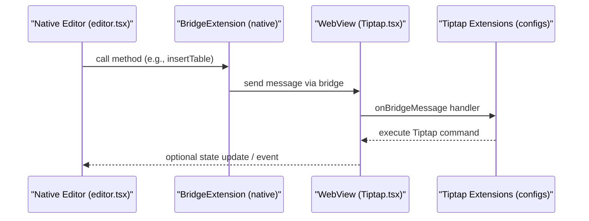
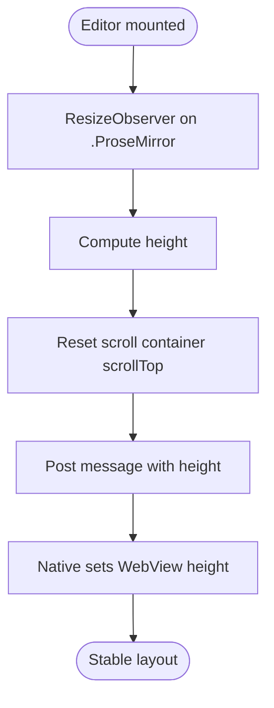
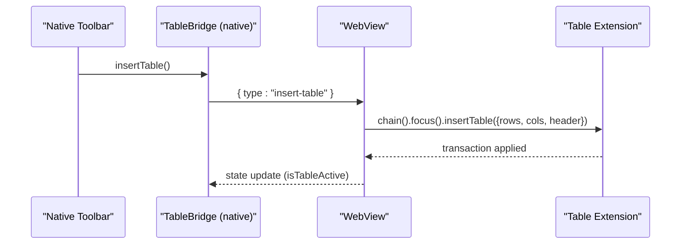
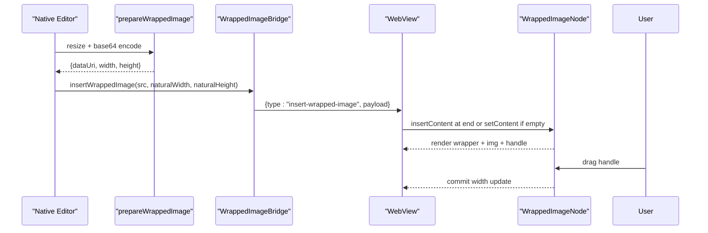
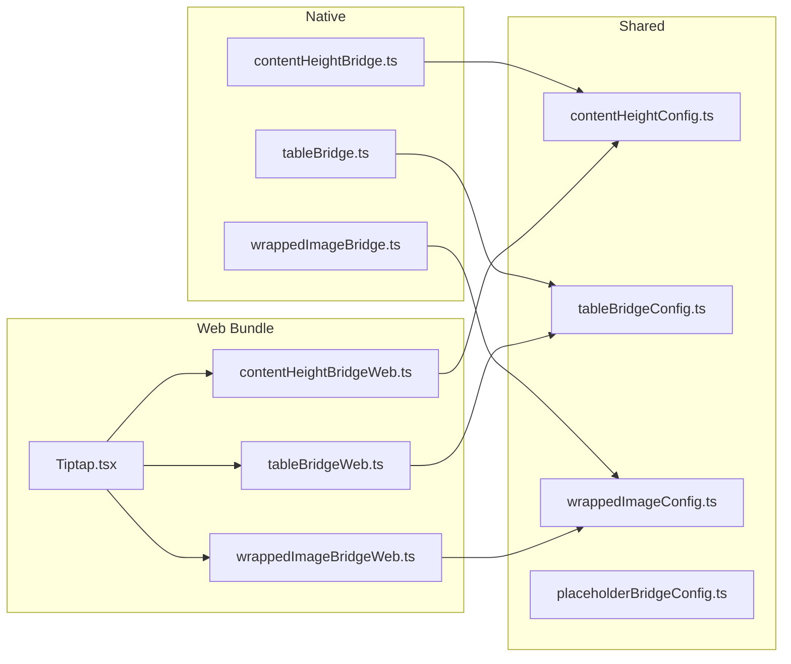

# Content Processing Pipeline

<cite>
**Referenced Files in This Document**
- [editor.tsx](file://app/editor.tsx)
- [contentHeightBridge.ts](file://src/editor/contentHeightBridge.ts)
- [contentHeightConfig.ts](file://src/editor/contentHeightConfig.ts)
- [tableBridge.ts](file://src/editor/tableBridge.ts)
- [tableBridgeConfig.ts](file://src/editor/tableBridgeConfig.ts)
- [wrappedImageBridge.ts](file://src/editor/wrappedImageBridge.ts)
- [wrappedImageConfig.ts](file://src/editor/wrappedImageConfig.ts)
- [placeholderBridgeConfig.ts](file://src/editor/placeholderBridgeConfig.ts)
- [Tiptap.tsx](file://webEditor/Tiptap.tsx)
- [contentHeightBridgeWeb.ts](file://webEditor/contentHeightBridgeWeb.ts)
- [tableBridgeWeb.ts](file://webEditor/tableBridgeWeb.ts)
- [wrappedImageBridgeWeb.ts](file://webEditor/wrappedImageBridgeWeb.ts)
- [textContent.ts](file://src/textContent.ts)
- [index.html](file://webEditor/index.html)
</cite>

## Table of Contents
1. [Introduction](#introduction)
2. [Project Structure](#project-structure)
3. [Core Components](#core-components)
4. [Architecture Overview](#architecture-overview)
5. [Detailed Component Analysis](#detailed-component-analysis)
6. [Dependency Analysis](#dependency-analysis)
7. [Performance Considerations](#performance-considerations)
8. [Troubleshooting Guide](#troubleshooting-guide)
9. [Conclusion](#conclusion)
10. [Appendices](#appendices)

## Introduction
This document explains the content processing pipeline that powers rich text editing, media embedding, and format conversions within the editor system. It covers how content flows through validation, transformation, and optimization stages; details pipelines for content height calculation, table structure manipulation, and wrapped image handling; documents data structures and serialization formats; and provides guidance on extending the pipeline, handling edge cases, optimizing performance, ensuring error recovery and content integrity, and migrating content across formats.

## Project Structure
The editor spans a React Native host and an embedded web editor (WebView). The native side composes bridge extensions to expose editor capabilities and receive state updates from the WebView. The web-side bundle includes custom bridges and Tiptap extensions that implement the actual behavior inside the WebView.

```mermaid
graph TB
subgraph "Native App"
A["app/editor.tsx"]
B["src/editor/*Bridge.ts"]
end
subgraph "WebView Bundle"
C["webEditor/Tiptap.tsx"]
D["webEditor/*BridgeWeb.ts"]
E["webEditor/index.html"]
end
subgraph "Shared Config"
F["src/editor/*BridgeConfig.ts"]
end
A --> B
B --> F
C --> D
D --> F
C --> E
A < --> |postMessage| C
```

**Diagram sources**
- [editor.tsx:456-482](file://app/editor.tsx#L456-L482)
- [Tiptap.tsx:32-45](file://webEditor/Tiptap.tsx#L32-L45)
- [contentHeightBridge.ts:8-11](file://src/editor/contentHeightBridge.ts#L8-L11)
- [tableBridge.ts:14-22](file://src/editor/tableBridge.ts#L14-L22)
- [wrappedImageBridge.ts:8-16](file://src/editor/wrappedImageBridge.ts#L8-L16)
- [contentHeightBridgeWeb.ts:9-12](file://webEditor/contentHeightBridgeWeb.ts#L9-L12)
- [tableBridgeWeb.ts:8-11](file://webEditor/tableBridgeWeb.ts#L8-L11)
- [wrappedImageBridgeWeb.ts:9-12](file://webEditor/wrappedImageBridgeWeb.ts#L9-L12)

**Section sources**
- [editor.tsx:456-482](file://app/editor.tsx#L456-L482)
- [Tiptap.tsx:32-45](file://webEditor/Tiptap.tsx#L32-L45)
- [index.html:11-37](file://webEditor/index.html#L11-L37)

## Core Components
- Bridge extensions: Provide typed interfaces between native and WebView for tables, wrapped images, placeholder behavior, and content height reporting.
- Shared configs: Define Tiptap extensions, message handlers, instance/state augmentation, and CSS overrides.
- Web bundle entry: Assembles the editor with custom bridges and filters by whitelist.
- Text conversion utilities: Convert between plain text and HTML, decode entities, and normalize legacy markers.

Key responsibilities:
- Validate incoming messages and ensure safe transformations.
- Transform content via Tiptap commands and node views.
- Optimize rendering and size via measured heights and image resizing.
- Serialize content consistently as HTML for storage and export.

**Section sources**
- [tableBridgeConfig.ts:20-86](file://src/editor/tableBridgeConfig.ts#L20-L86)
- [wrappedImageConfig.ts:62-126](file://src/editor/wrappedImageConfig.ts#L62-L126)
- [contentHeightConfig.ts:62-105](file://src/editor/contentHeightConfig.ts#L62-L105)
- [placeholderBridgeConfig.ts:22-36](file://src/editor/placeholderBridgeConfig.ts#L22-L36)
- [textContent.ts:20-67](file://src/textContent.ts#L20-L67)

## Architecture Overview
The editor uses a bridge pattern:
- Native app registers bridge extensions and exposes methods to drive the editor.
- WebView runs a custom Tiptap build that includes matching bridges and extensions.
- Messages flow both ways:
  - Native → WebView: actions like insert table or insert wrapped image.
  - WebView → Native: state updates and events like content height measurement.



**Diagram sources**
- [editor.tsx:456-482](file://app/editor.tsx#L456-L482)
- [tableBridgeConfig.ts:46-86](file://src/editor/tableBridgeConfig.ts#L46-L86)
- [Tiptap.tsx:32-45](file://webEditor/Tiptap.tsx#L32-L45)

## Detailed Component Analysis

### Content Height Calculation Pipeline
Purpose: Report the real rendered height of the note body to the native container to avoid scroll misalignment and clipping.

Flow:
- WebView extension observes the ProseMirror DOM and computes height.
- On change, it resets internal scroll position and posts a message to native with the measured height.
- Native sets the WebView container height to the measured value, falling back to a heuristic until the first report.



**Diagram sources**
- [contentHeightConfig.ts:62-105](file://src/editor/contentHeightConfig.ts#L62-L105)
- [editor.tsx:493-538](file://app/editor.tsx#L493-L538)

Key behaviors:
- Uses a clearfix to ensure floated images contribute to height.
- Caps reported height to a sanity maximum to prevent runaway sizes.
- Falls back to an estimated height based on block count, text length, and image placeholders until the first real measurement arrives.

**Section sources**
- [contentHeightConfig.ts:62-105](file://src/editor/contentHeightConfig.ts#L62-L105)
- [editor.tsx:493-538](file://app/editor.tsx#L493-L538)

### Table Structure Manipulation Pipeline
Purpose: Provide mobile-friendly table operations (insert, add/remove rows/columns, delete table) via a minimal action set.

Flow:
- Native calls editor methods exposed by the bridge.
- Bridge sends a typed message to the WebView.
- WebView executes corresponding Tiptap commands.
- State is updated to reflect whether a table is active.



**Diagram sources**
- [tableBridgeConfig.ts:46-86](file://src/editor/tableBridgeConfig.ts#L46-L86)
- [tableBridge.ts:14-22](file://src/editor/tableBridge.ts#L14-L22)

Mobile considerations:
- Disables default desktop-oriented resize handles.
- Adds horizontal scrolling and touch-friendly cell styles.

**Section sources**
- [tableBridgeConfig.ts:46-123](file://src/editor/tableBridgeConfig.ts#L46-L123)

### Wrapped Image Handling Pipeline
Purpose: Embed images that wrap around text with a resizable handle and support full-width mode when inserted into empty notes.

Flow:
- Native prepares image data (resize, base64 encode) and calls insertWrappedImage.
- Bridge sends a message with src, width, and alignment.
- WebView inserts a wrappedImage node at the end of the document (or replaces empty content), defaulting to full-width block mode.
- NodeView renders a float-based wrapper with a draggable resize handle.
- Dragging adjusts width while preserving aspect ratio; committing updates the node attributes.



**Diagram sources**
- [editor.tsx:128-144](file://app/editor.tsx#L128-L144)
- [wrappedImageConfig.ts:253-297](file://src/editor/wrappedImageConfig.ts#L253-L297)
- [wrappedImageConfig.ts:62-247](file://src/editor/wrappedImageConfig.ts#L62-L247)

Serialization and parsing:
- Custom parse rule ensures correct attribute types and priority over generic image rules.
- Attributes include src, width (number), and align ('left' | 'right' | 'full').
- Rendered HTML uses a data attribute marker to identify wrapped images.

Edge cases:
- Full-width mode converts to floating wrap when resized.
- Clearing floats prevents inline wrapping issues after insertion.
- Width clamped to min/max bounds during resize.

**Section sources**
- [wrappedImageConfig.ts:62-126](file://src/editor/wrappedImageConfig.ts#L62-L126)
- [wrappedImageConfig.ts:128-247](file://src/editor/wrappedImageConfig.ts#L128-L247)
- [wrappedImageConfig.ts:253-297](file://src/editor/wrappedImageConfig.ts#L253-L297)

### Placeholder Behavior
Purpose: Show placeholder text only when the editor is entirely empty and the cursor is in the root paragraph, avoiding ghost text in newly created checklist items.

Behavior:
- Placeholder function checks node type and editor emptiness.
- CSS positions the placeholder before the first child when empty.

**Section sources**
- [placeholderBridgeConfig.ts:22-36](file://src/editor/placeholderBridgeConfig.ts#L22-L36)

### Text Conversion Utilities
Purpose: Normalize content for previews, search, and sharing; convert plain text to editor-ready HTML; decode entities safely.

Operations:
- Decode numeric and named HTML entities.
- Convert plain text to HTML paragraphs with preserved line breaks.
- Strip tags and legacy markdown to produce clean plain text.

**Section sources**
- [textContent.ts:20-67](file://src/textContent.ts#L20-L67)

## Dependency Analysis
Bridges are split into native wrappers and web wrappers that share configuration modules. The web bundle includes all necessary bridges and filters them by whitelist.



**Diagram sources**
- [contentHeightBridge.ts:8-11](file://src/editor/contentHeightBridge.ts#L8-L11)
- [tableBridge.ts:14-22](file://src/editor/tableBridge.ts#L14-L22)
- [wrappedImageBridge.ts:8-16](file://src/editor/wrappedImageBridge.ts#L8-L16)
- [contentHeightBridgeWeb.ts:9-12](file://webEditor/contentHeightBridgeWeb.ts#L9-L12)
- [tableBridgeWeb.ts:8-11](file://webEditor/tableBridgeWeb.ts#L8-L11)
- [wrappedImageBridgeWeb.ts:9-12](file://webEditor/wrappedImageBridgeWeb.ts#L9-L12)
- [Tiptap.tsx:32-45](file://webEditor/Tiptap.tsx#L32-L45)

Coupling and cohesion:
- Each bridge config encapsulates its Tiptap extension, message handling, instance/state augmentation, and CSS—high cohesion per feature.
- Native and web sides depend only on shared configs—low coupling between platforms.

Potential circular dependencies:
- None observed; bridges import configs but not vice versa.

External integrations:
- Tiptap core and extensions for tables and placeholders.
- WebView postMessage channel for cross-boundary communication.

**Section sources**
- [tableBridgeConfig.ts:46-86](file://src/editor/tableBridgeConfig.ts#L46-L86)
- [wrappedImageConfig.ts:253-297](file://src/editor/wrappedImageConfig.ts#L253-L297)
- [contentHeightConfig.ts:62-105](file://src/editor/contentHeightConfig.ts#L62-L105)

## Performance Considerations
- Measured height via ResizeObserver avoids expensive heuristics after first report; fallback heuristic covers initial mount window.
- Images are resized and base64-encoded once on insertion to reduce downstream processing and ensure consistent rendering.
- Table rendering uses horizontal scrolling and fixed layouts optimized for narrow screens.
- Debounced HTML extraction reduces frequent state updates.

Optimization recommendations:
- Keep image dimensions capped to avoid oversized payloads.
- Avoid excessive nested blocks; prefer concise paragraphs and lists.
- Reuse prepared images where possible to minimize recomputation.

[No sources needed since this section provides general guidance]

## Troubleshooting Guide
Common issues and resolutions:
- WebView height mismatch causing clipped content: Ensure content height bridge is enabled and messages are received; verify sanity cap and fallback logic.
- Images not wrapping correctly: Confirm clearfix CSS is applied and clear:both is set on wrapper; check that parsed attributes preserve align and width.
- Tables unusable on mobile: Verify extendCSS is included and default resize handles are disabled; confirm horizontal scrolling is enabled.
- Placeholder appearing in checklist items: Use the configured placeholder function that checks node type and editor emptiness.

Error handling patterns:
- Graceful fallbacks when measurements fail or messages cannot be posted.
- Sanitized filename generation for exports.
- Safe decoding of entities and stripping of legacy markup.

**Section sources**
- [contentHeightConfig.ts:62-105](file://src/editor/contentHeightConfig.ts#L62-L105)
- [wrappedImageConfig.ts:128-247](file://src/editor/wrappedImageConfig.ts#L128-L247)
- [tableBridgeConfig.ts:87-123](file://src/editor/tableBridgeConfig.ts#L87-L123)
- [placeholderBridgeConfig.ts:22-36](file://src/editor/placeholderBridgeConfig.ts#L22-L36)
- [editor.tsx:272-281](file://app/editor.tsx#L272-L281)

## Conclusion
The editor’s content processing pipeline combines a robust bridge architecture with Tiptap extensions to deliver reliable rich text editing, media embedding, and format conversions. Measured content height, mobile-optimized tables, and wrapped images provide a smooth user experience. The modular design enables easy extension with custom processors, while careful validation, error handling, and performance strategies maintain content integrity and responsiveness.

[No sources needed since this section summarizes without analyzing specific files]

## Appendices

### Data Structures and Serialization Formats
- Table actions: Enumerated action types with optional payloads; state includes boolean flags indicating activation.
- Wrapped image attributes: src (string), width (number), align (enum); serialized as HTML with data attributes for identification.
- Placeholder configuration: Function-based placeholder tied to paragraph nodes and editor emptiness.
- Text conversion: Functions to decode entities, convert plain text to HTML, and extract clean plain text from HTML.

**Section sources**
- [tableBridgeConfig.ts:20-44](file://src/editor/tableBridgeConfig.ts#L20-L44)
- [wrappedImageConfig.ts:27-56](file://src/editor/wrappedImageConfig.ts#L27-L56)
- [placeholderBridgeConfig.ts:22-36](file://src/editor/placeholderBridgeConfig.ts#L22-L36)
- [textContent.ts:20-67](file://src/textContent.ts#L20-L67)

### Extending the Pipeline with Custom Processors
Steps:
- Create a shared config module defining a Tiptap extension, message types, and handlers.
- Add native and web bridge wrappers that import the appropriate BridgeExtension path.
- Register the bridge in the native extension list and include it in the web bundle assembly.
- Implement extendCSS to tailor rendering for mobile constraints.

Guidelines:
- Keep actions minimal and mobile-friendly.
- Validate inputs and sanitize outputs.
- Provide sensible defaults and bounds for interactive elements.

**Section sources**
- [tableBridgeConfig.ts:46-86](file://src/editor/tableBridgeConfig.ts#L46-L86)
- [wrappedImageConfig.ts:253-297](file://src/editor/wrappedImageConfig.ts#L253-L297)
- [Tiptap.tsx:32-45](file://webEditor/Tiptap.tsx#L32-L45)

### Migration Strategies for Content Format Changes
- Preserve backward compatibility by supporting legacy markers and gracefully normalizing content.
- Use explicit parse rules with higher priority to override generic rules when introducing new node types.
- Maintain stable attribute names and types; coerce string values to expected types during parsing.
- Provide conversion utilities to migrate old content to new schemas during load time.

**Section sources**
- [wrappedImageConfig.ts:77-106](file://src/editor/wrappedImageConfig.ts#L77-L106)
- [textContent.ts:54-67](file://src/textContent.ts#L54-L67)