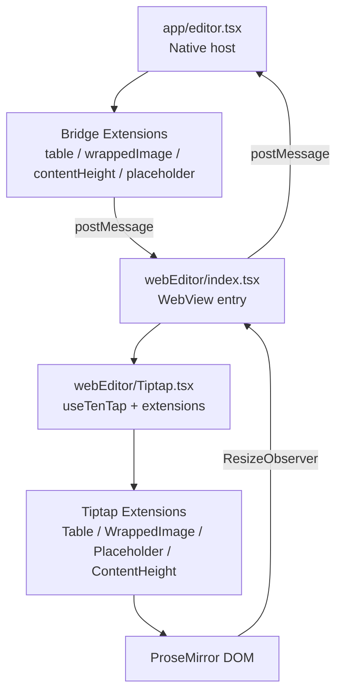
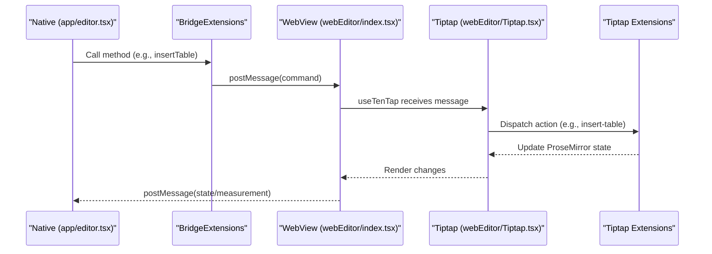
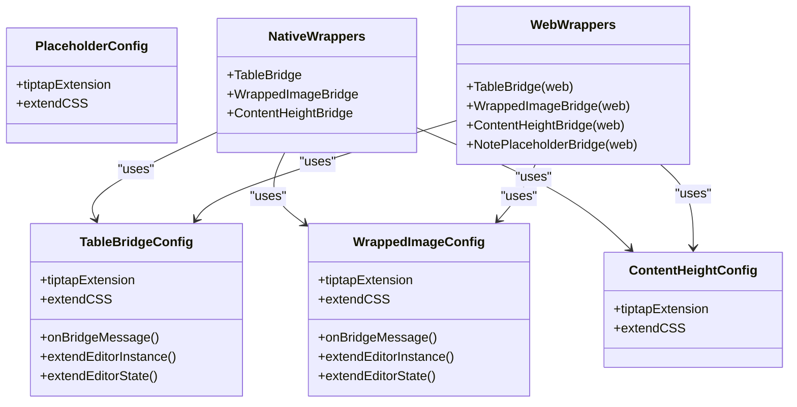
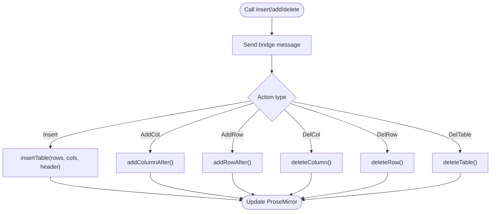
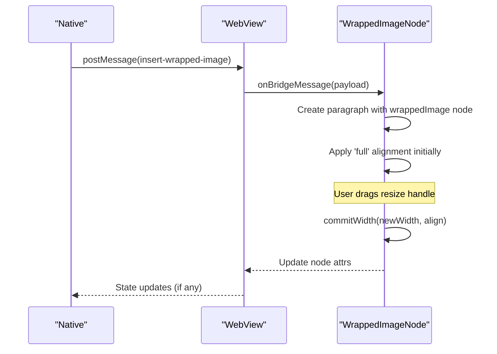
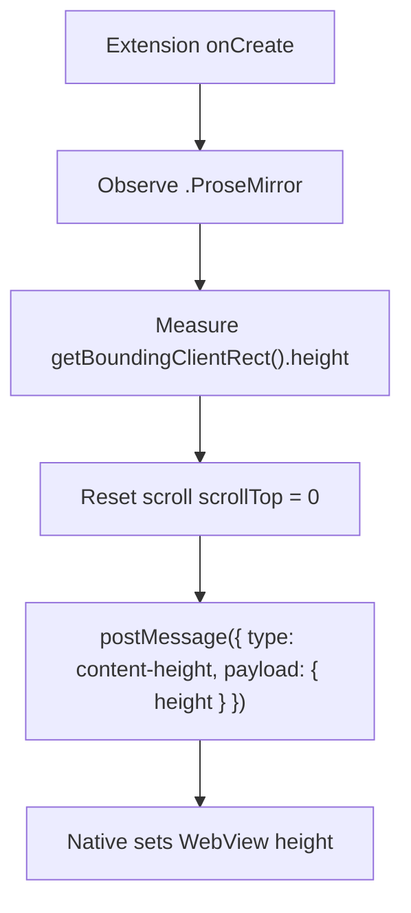
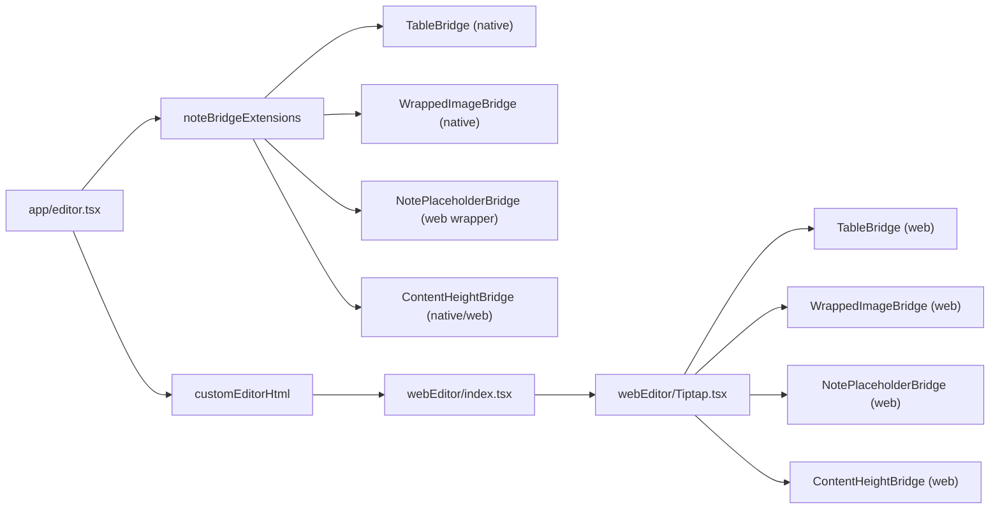
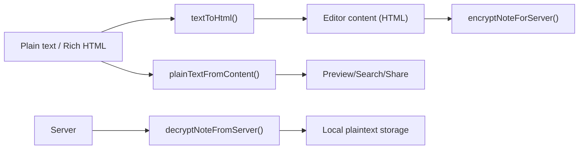

# Editor System

<cite>
**Referenced Files in This Document**
- [app/editor.tsx](file://app/editor.tsx)
- [src/editor/tableBridgeConfig.ts](file://src/editor/tableBridgeConfig.ts)
- [src/editor/wrappedImageConfig.ts](file://src/editor/wrappedImageConfig.ts)
- [src/editor/contentHeightConfig.ts](file://src/editor/contentHeightConfig.ts)
- [src/editor/placeholderBridgeConfig.ts](file://src/editor/placeholderBridgeConfig.ts)
- [src/editor/tableBridge.ts](file://src/editor/tableBridge.ts)
- [src/editor/wrappedImageBridge.ts](file://src/editor/wrappedImageBridge.ts)
- [src/editor/contentHeightBridge.ts](file://src/editor/contentHeightBridge.ts)
- [webEditor/Tiptap.tsx](file://webEditor/Tiptap.tsx)
- [webEditor/index.tsx](file://webEditor/index.tsx)
- [webEditor/tableBridgeWeb.ts](file://webEditor/tableBridgeWeb.ts)
- [webEditor/wrappedImageBridgeWeb.ts](file://webEditor/wrappedImageBridgeWeb.ts)
- [webEditor/contentHeightBridgeWeb.ts](file://webEditor/contentHeightBridgeWeb.ts)
- [webEditor/placeholderBridgeWeb.ts](file://webEditor/placeholderBridgeWeb.ts)
- [scripts/buildWebEditorHtml.js](file://scripts/buildWebEditorHtml.js)
- [src/crypto/noteCrypto.ts](file://src/crypto/noteCrypto.ts)
- [src/textContent.ts](file://src/textContent.ts)
</cite>

## Table of Contents
1. Introduction
2. Project Structure
3. Core Components
4. Architecture Overview
5. Detailed Component Analysis
6. Dependency Analysis
7. Performance Considerations
8. Troubleshooting Guide
9. Conclusion
10. Appendices

## Introduction
This document explains the rich text editor system that powers notes on both mobile and web platforms. It covers the bridge architecture that unifies platform-specific implementations behind consistent APIs, the custom bridges for content height calculation, table manipulation, and wrapped image handling, and the Tiptap-based web editor implementation with custom extensions and plugins. It also documents the content transformation pipeline between formats (HTML, plain text, encrypted payloads), performance optimizations for large documents, memory management, rendering efficiency, and guidance for extending the editor with new content types, bridges, and encryption integration.

## Project Structure
The editor spans two main areas:
- Native side (React Native): orchestrates the TenTap editor, registers bridge extensions, manages WebView lifecycle, and handles messages from the web bundle.
- Web side (custom WebView bundle): a minimal React app built with Vite that mounts Tiptap with the required bridges and renders editable content.

**Diagram sources**
- [app/editor.tsx:456-480](file://app/editor.tsx#L456-L480)
- [webEditor/Tiptap.tsx:32-45](file://webEditor/Tiptap.tsx#L32-L45)
- [webEditor/index.tsx:17-26](file://webEditor/index.tsx#L17-L26)

**Section sources**
- [app/editor.tsx:456-480](file://app/editor.tsx#L456-L480)
- [webEditor/Tiptap.tsx:32-45](file://webEditor/Tiptap.tsx#L32-L45)
- [webEditor/index.tsx:17-26](file://webEditor/index.tsx#L17-L26)
- [scripts/buildWebEditorHtml.js:1-23](file://scripts/buildWebEditorHtml.js#L1-L23)

## Core Components
- Bridge extensions:
  - Table bridge: actions to insert and manipulate tables; shared config used by both native and web wrappers.
  - Wrapped image bridge: custom inline node with float-based text wrapping and a resize handle; shared config used by both sides.
  - Content height bridge: reports real rendered height via ResizeObserver to avoid scroll clipping issues.
  - Placeholder bridge: shows placeholder only when the note is empty (paragraph-only).
- WebView bootstrap:
  - A custom HTML bundle includes the necessary bridges so the native host can call into them.
- Host orchestration:
  - The native screen wires up the editor, sets initial content, listens for messages, and exposes an imperative API for toolbar and integrations.

**Section sources**
- [src/editor/tableBridgeConfig.ts:20-86](file://src/editor/tableBridgeConfig.ts#L20-L86)
- [src/editor/wrappedImageConfig.ts:62-247](file://src/editor/wrappedImageConfig.ts#L62-L247)
- [src/editor/contentHeightConfig.ts:62-105](file://src/editor/contentHeightConfig.ts#L62-L105)
- [src/editor/placeholderBridgeConfig.ts:22-36](file://src/editor/placeholderBridgeConfig.ts#L22-L36)
- [webEditor/Tiptap.tsx:32-45](file://webEditor/Tiptap.tsx#L32-L45)
- [app/editor.tsx:456-480](file://app/editor.tsx#L456-L480)

## Architecture Overview
The system uses a bridge pattern to keep a single API surface across platforms:
- Native side declares BridgeExtension instances that augment EditorBridge/BridgeState types and expose methods like insertTable or insertWrappedImage.
- Web side builds a separate bundle that includes the same extension logic but imports BridgeExtension from the web subpath to avoid parsing Flow code under Vite.
- Messages flow via postMessage:
  - Native → Web: commands (e.g., insert table, insert wrapped image).
  - Web → Native: state updates and measurements (e.g., content height).

**Diagram sources**
- [app/editor.tsx:456-480](file://app/editor.tsx#L456-L480)
- [webEditor/Tiptap.tsx:32-45](file://webEditor/Tiptap.tsx#L32-L45)
- [webEditor/index.tsx:17-26](file://webEditor/index.tsx#L17-L26)
- [src/editor/tableBridgeConfig.ts:46-86](file://src/editor/tableBridgeConfig.ts#L46-L86)

## Detailed Component Analysis

### Bridge Architecture
- Shared configs define Tiptap extensions, message handlers, instance/state shims, and CSS overrides.
- Native wrappers import BridgeExtension from the package root and augment EditorBridge/BridgeState types.
- Web wrappers import BridgeExtension from the "/web" export to build the custom WebView bundle without pulling in native-only code.

**Diagram sources**
- [src/editor/tableBridgeConfig.ts:20-86](file://src/editor/tableBridgeConfig.ts#L20-L86)
- [src/editor/wrappedImageConfig.ts:253-307](file://src/editor/wrappedImageConfig.ts#L253-L307)
- [src/editor/contentHeightConfig.ts:96-105](file://src/editor/contentHeightConfig.ts#L96-L105)
- [src/editor/placeholderBridgeConfig.ts:22-36](file://src/editor/placeholderBridgeConfig.ts#L22-L36)
- [src/editor/tableBridge.ts:14-22](file://src/editor/tableBridge.ts#L14-L22)
- [src/editor/wrappedImageBridge.ts:8-16](file://src/editor/wrappedImageBridge.ts#L8-L16)
- [src/editor/contentHeightBridge.ts:8-11](file://src/editor/contentHeightBridge.ts#L8-L11)
- [webEditor/tableBridgeWeb.ts:8-11](file://webEditor/tableBridgeWeb.ts#L8-L11)
- [webEditor/wrappedImageBridgeWeb.ts:1-12](file://webEditor/wrappedImageBridgeWeb.ts#L1-L12)
- [webEditor/contentHeightBridgeWeb.ts:9-12](file://webEditor/contentHeightBridgeWeb.ts#L9-L12)
- [webEditor/placeholderBridgeWeb.ts:6-9](file://webEditor/placeholderBridgeWeb.ts#L6-L9)

**Section sources**
- [src/editor/tableBridgeConfig.ts:20-86](file://src/editor/tableBridgeConfig.ts#L20-L86)
- [src/editor/wrappedImageConfig.ts:253-307](file://src/editor/wrappedImageConfig.ts#L253-L307)
- [src/editor/contentHeightConfig.ts:96-105](file://src/editor/contentHeightConfig.ts#L96-L105)
- [src/editor/placeholderBridgeConfig.ts:22-36](file://src/editor/placeholderBridgeConfig.ts#L22-L36)
- [src/editor/tableBridge.ts:14-22](file://src/editor/tableBridge.ts#L14-L22)
- [src/editor/wrappedImageBridge.ts:8-16](file://src/editor/wrappedImageBridge.ts#L8-L16)
- [src/editor/contentHeightBridge.ts:8-11](file://src/editor/contentHeightBridge.ts#L8-L11)
- [webEditor/tableBridgeWeb.ts:8-11](file://webEditor/tableBridgeWeb.ts#L8-L11)
- [webEditor/wrappedImageBridgeWeb.ts:1-12](file://webEditor/wrappedImageBridgeWeb.ts#L1-L12)
- [webEditor/contentHeightBridgeWeb.ts:9-12](file://webEditor/contentHeightBridgeWeb.ts#L9-L12)
- [webEditor/placeholderBridgeWeb.ts:6-9](file://webEditor/placeholderBridgeWeb.ts#L6-L9)

### Table Manipulation Bridge
- Provides a minimal set of actions suitable for mobile touch UIs: insert table, add column/row after, delete column/row, delete table.
- Uses Tiptap’s table extension with disabled resizing for better phone-width usability.
- Applies mobile-friendly CSS to make tables horizontally scrollable and readable.

**Diagram sources**
- [src/editor/tableBridgeConfig.ts:46-86](file://src/editor/tableBridgeConfig.ts#L46-L86)

**Section sources**
- [src/editor/tableBridgeConfig.ts:20-124](file://src/editor/tableBridgeConfig.ts#L20-L124)

### Wrapped Image Handling
- Custom inline node that floats left/right or fills full width when inserted into an empty note.
- Includes a draggable resize handle to adjust width while preserving aspect ratio.
- Parses and serializes attributes (src, width, align) with explicit priority to avoid conflicts with stock image parsing.

**Diagram sources**
- [src/editor/wrappedImageConfig.ts:253-297](file://src/editor/wrappedImageConfig.ts#L253-L297)
- [src/editor/wrappedImageConfig.ts:128-247](file://src/editor/wrappedImageConfig.ts#L128-L247)

**Section sources**
- [src/editor/wrappedImageConfig.ts:62-247](file://src/editor/wrappedImageConfig.ts#L62-L247)
- [src/editor/wrappedImageConfig.ts:253-307](file://src/editor/wrappedImageConfig.ts#L253-L307)

### Content Height Calculation Bridge
- Uses a ResizeObserver on the ProseMirror container to measure real content height.
- Reports height back to native via postMessage to size the WebView accurately and prevent scroll clipping.
- Resets internal scroll position on each report to avoid caret visibility bugs.

**Diagram sources**
- [src/editor/contentHeightConfig.ts:62-105](file://src/editor/contentHeightConfig.ts#L62-L105)
- [app/editor.tsx:497-505](file://app/editor.tsx#L497-L505)

**Section sources**
- [src/editor/contentHeightConfig.ts:1-106](file://src/editor/contentHeightConfig.ts#L1-L106)
- [app/editor.tsx:497-505](file://app/editor.tsx#L497-L505)

### Placeholder Behavior
- Shows placeholder text only when the note is completely empty (single paragraph), avoiding ghost text inside newly created checklist items.

**Section sources**
- [src/editor/placeholderBridgeConfig.ts:1-37](file://src/editor/placeholderBridgeConfig.ts#L1-L37)

### WebView Bootstrap and Custom Bundle
- The native host injects a prebuilt HTML string containing the web-side editor.
- The web entry waits for content injection before mounting React to avoid timing issues on Android.
- The Tiptap component composes the required bridges and filters them by a whitelist if present.

**Section sources**
- [scripts/buildWebEditorHtml.js:1-23](file://scripts/buildWebEditorHtml.js#L1-L23)
- [webEditor/index.tsx:1-27](file://webEditor/index.tsx#L1-L27)
- [webEditor/Tiptap.tsx:1-54](file://webEditor/Tiptap.tsx#L1-L54)
- [app/editor.tsx:474-480](file://app/editor.tsx#L474-L480)

## Dependency Analysis
- Native host depends on:
  - TenTapStartKit and bridge extensions (table, wrapped image, placeholder, content height).
  - Custom WebView bundle injected via a generated HTML string.
- Web bundle depends on:
  - Tiptap and TenTap web exports.
  - Bridge wrappers that import BridgeExtension from the web subpath.
- Shared configs are imported by both native and web wrappers to keep behavior consistent.

**Diagram sources**
- [app/editor.tsx:456-480](file://app/editor.tsx#L456-L480)
- [webEditor/Tiptap.tsx:32-45](file://webEditor/Tiptap.tsx#L32-L45)
- [webEditor/index.tsx:17-26](file://webEditor/index.tsx#L17-L26)

**Section sources**
- [app/editor.tsx:456-480](file://app/editor.tsx#L456-L480)
- [webEditor/Tiptap.tsx:32-45](file://webEditor/Tiptap.tsx#L32-L45)
- [webEditor/index.tsx:17-26](file://webEditor/index.tsx#L17-L26)

## Performance Considerations
- Measured height vs heuristic sizing:
  - Real-time height reporting avoids stale WebView sizes and prevents scrolling glitches.
  - Heuristic fallback covers the brief window before the first measurement arrives.
- Large document decryption:
  - Decrypting many notes yields periodically to avoid blocking the UI thread.
  - Yield thresholds are based on item count and cumulative bytes to balance responsiveness.
- Rendering efficiency:
  - Tables disable resizing to improve mobile performance and UX.
  - Wrapped images use float-based wrapping and a lightweight resize handle to minimize layout thrashing.
- Memory management:
  - Avoid keeping large base64 images beyond what is necessary; cap dimensions during preparation.
  - Use efficient selectors and avoid unnecessary re-renders in the web bundle.

[No sources needed since this section provides general guidance]

## Troubleshooting Guide
- Images appear clipped or resized incorrectly:
  - Ensure wrapped image nodes parse with higher priority than stock image rules to preserve attributes.
  - Verify extendCSS clears floats to include images in measured height.
- Placeholder appears in checklist items:
  - Confirm placeholder function checks node type and emptiness to show only on the initial paragraph.
- WebView not resizing correctly:
  - Check that content height messages are received and applied to the WebView style height.
  - Validate that the internal scroll reset occurs on each height report.
- Commands no-op in WebView:
  - Ensure the custom WebView bundle includes the required bridges and that the whitelist allows them.

**Section sources**
- [src/editor/wrappedImageConfig.ts:77-107](file://src/editor/wrappedImageConfig.ts#L77-L107)
- [src/editor/contentHeightConfig.ts:96-105](file://src/editor/contentHeightConfig.ts#L96-L105)
- [src/editor/placeholderBridgeConfig.ts:22-36](file://src/editor/placeholderBridgeConfig.ts#L22-L36)
- [app/editor.tsx:497-505](file://app/editor.tsx#L497-L505)
- [webEditor/Tiptap.tsx:32-45](file://webEditor/Tiptap.tsx#L32-L45)

## Conclusion
The editor system combines a robust bridge architecture with Tiptap-based extensions to deliver a consistent editing experience across mobile and web. Custom bridges provide precise control over table manipulation, wrapped image behavior, and accurate content height measurement. The custom WebView bundle ensures all extensions are available at runtime, while the native host manages lifecycle, messaging, and UI state. With careful attention to performance and memory, the system scales to large documents and complex media.

[No sources needed since this section summarizes without analyzing specific files]

## Appendices

### Content Transformation Pipeline
- Plain text to HTML:
  - Converts line breaks and paragraphs into HTML for insertion into the editor.
- Rich HTML to plain text:
  - Strips tags, decodes entities, and normalizes whitespace for previews/search/share.
- Encryption boundary:
  - Encrypts note fields before sending to server; decrypts on pull with periodic yielding to maintain responsiveness.

**Diagram sources**
- [src/textContent.ts:39-67](file://src/textContent.ts#L39-L67)
- [src/crypto/noteCrypto.ts:46-92](file://src/crypto/noteCrypto.ts#L46-L92)

**Section sources**
- [src/textContent.ts:1-68](file://src/textContent.ts#L1-L68)
- [src/crypto/noteCrypto.ts:1-93](file://src/crypto/noteCrypto.ts#L1-L93)

### Extending the Editor with New Content Types
- Define a Tiptap Node or Extension in a shared config file.
- Implement onBridgeMessage to handle incoming commands and extendEditorInstance to expose methods to the native host.
- Provide extendCSS for styling and ensure parseHTML/renderHTML round-trip attributes correctly.
- Wrap the config with BridgeExtension on both native and web sides, importing BridgeExtension from the correct path per platform.

**Section sources**
- [src/editor/tableBridgeConfig.ts:20-86](file://src/editor/tableBridgeConfig.ts#L20-L86)
- [src/editor/wrappedImageConfig.ts:62-247](file://src/editor/wrappedImageConfig.ts#L62-L247)
- [src/editor/tableBridge.ts:14-22](file://src/editor/tableBridge.ts#L14-L22)
- [webEditor/tableBridgeWeb.ts:8-11](file://webEditor/tableBridgeWeb.ts#L8-L11)

### Implementing a New Bridge
- Create a shared config with tiptapExtension, onBridgeMessage, extendEditorInstance, extendEditorState, and extendCSS.
- Build native wrapper using BridgeExtension from the package root and augment EditorBridge/BridgeState types.
- Build web wrapper using BridgeExtension from the "/web" export and include it in the custom WebView bundle.
- Wire the bridge into noteBridgeExtensions on the native side and into the Tiptap composition on the web side.

**Section sources**
- [src/editor/tableBridgeConfig.ts:46-86](file://src/editor/tableBridgeConfig.ts#L46-L86)
- [src/editor/contentHeightConfig.ts:62-105](file://src/editor/contentHeightConfig.ts#L62-L105)
- [app/editor.tsx:456-480](file://app/editor.tsx#L456-L480)
- [webEditor/Tiptap.tsx:32-45](file://webEditor/Tiptap.tsx#L32-L45)

### Integrating with the Encryption System
- Encrypt outgoing payloads using the provided encrypt function; guard against missing keys to avoid pushing plaintext.
- Decrypt incoming payloads with periodic yielding to keep the UI responsive during bulk operations.
- Ensure content transformations (HTML/plain text) operate on decrypted data locally and encrypted data on the wire.

**Section sources**
- [src/crypto/noteCrypto.ts:46-92](file://src/crypto/noteCrypto.ts#L46-L92)
- [src/textContent.ts:39-67](file://src/textContent.ts#L39-L67)