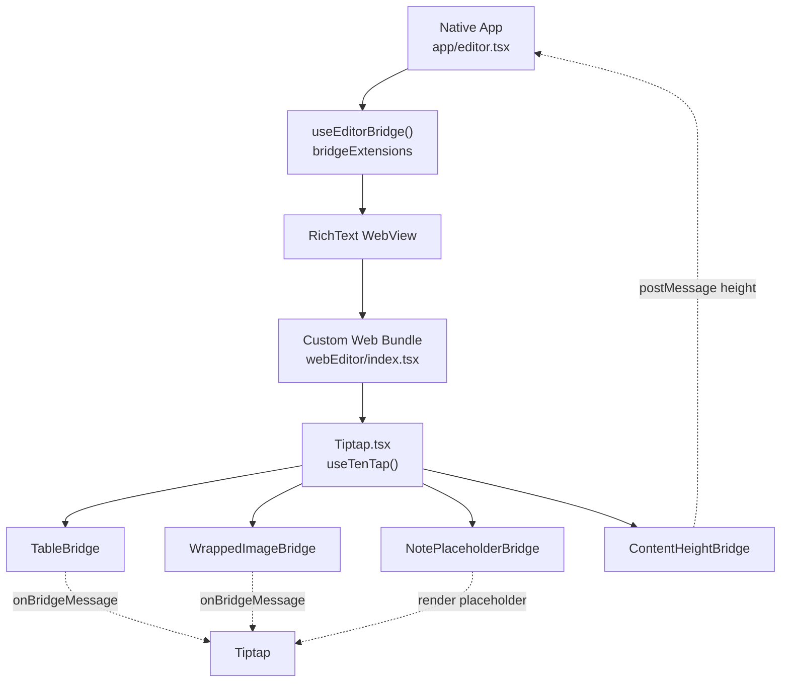
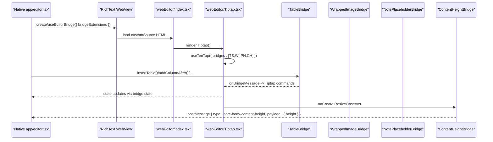
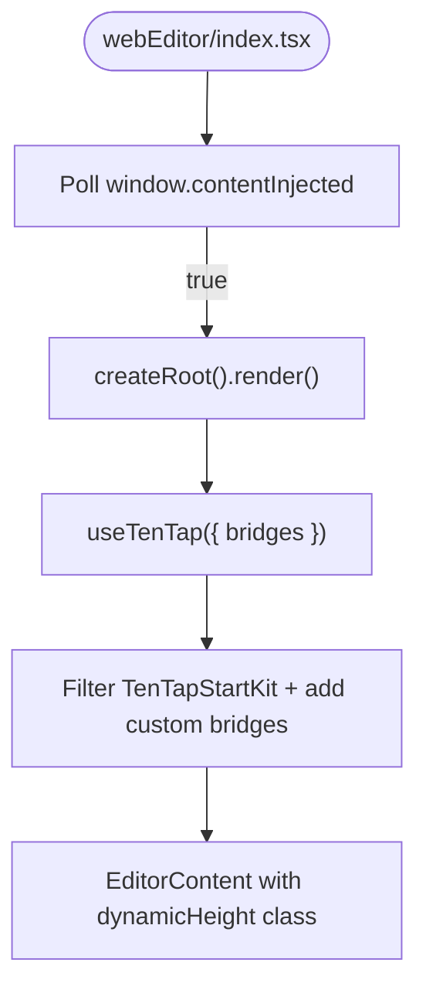
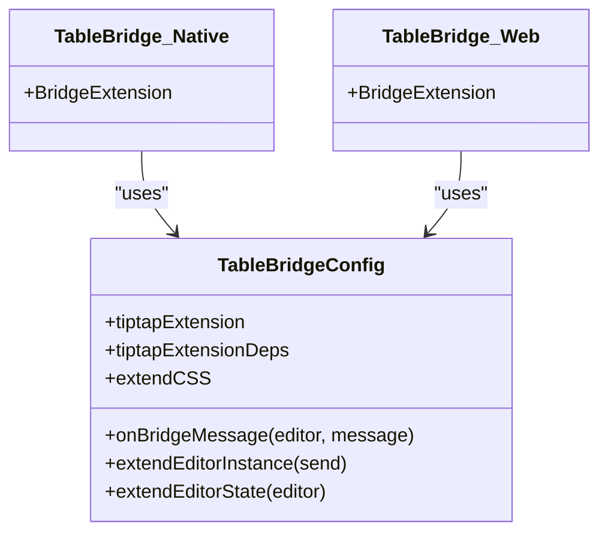
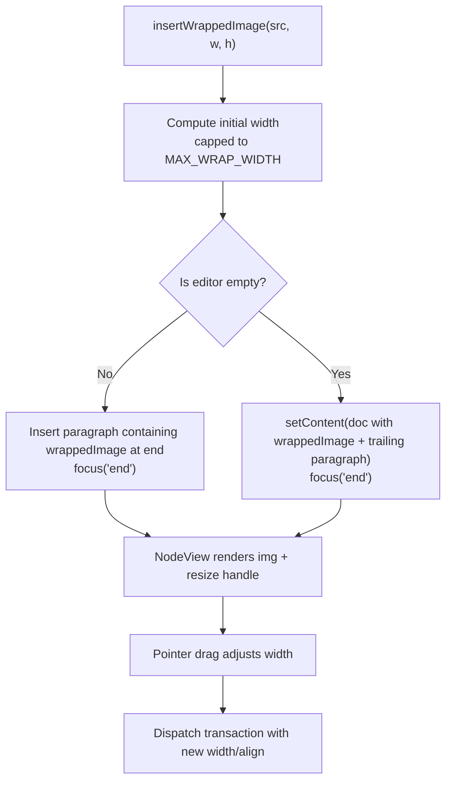
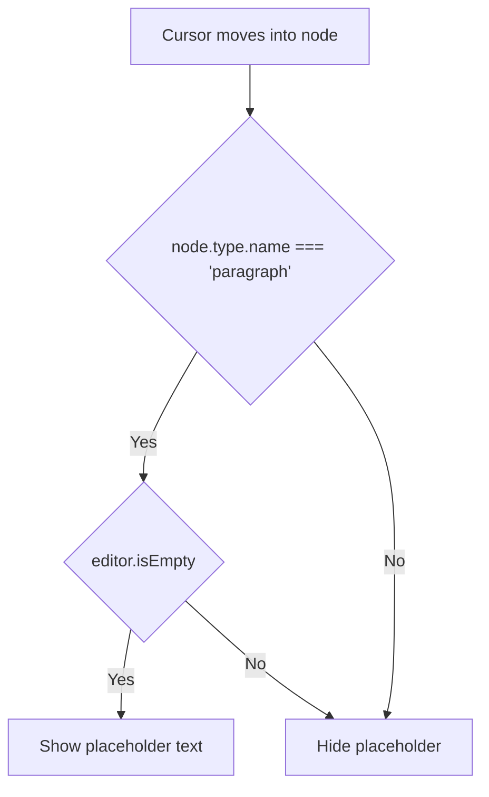
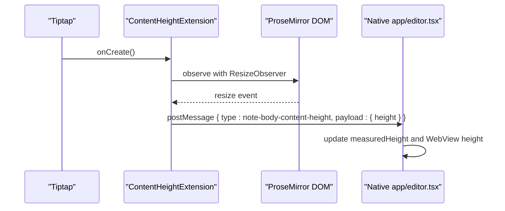
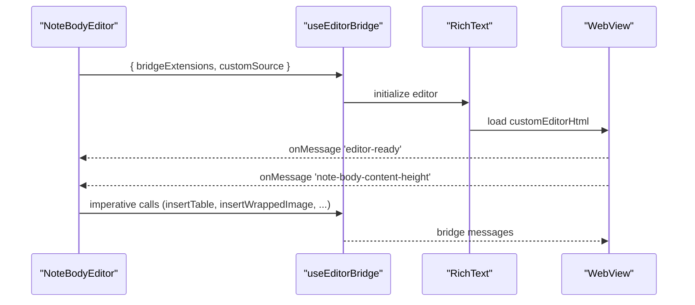
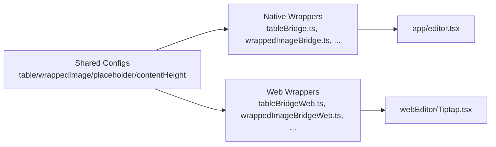

# Web Editor Implementation

<cite>
**Referenced Files in This Document**
- [Tiptap.tsx](file://webEditor/Tiptap.tsx)
- [index.tsx](file://webEditor/index.tsx)
- [tableBridgeConfig.ts](file://src/editor/tableBridgeConfig.ts)
- [wrappedImageConfig.ts](file://src/editor/wrappedImageConfig.ts)
- [placeholderBridgeConfig.ts](file://src/editor/placeholderBridgeConfig.ts)
- [contentHeightConfig.ts](file://src/editor/contentHeightConfig.ts)
- [tableBridge.ts](file://src/editor/tableBridge.ts)
- [wrappedImageBridge.ts](file://src/editor/wrappedImageBridge.ts)
- [placeholderBridge.ts](file://src/editor/placeholderBridge.ts)
- [contentHeightBridge.ts](file://src/editor/contentHeightBridge.ts)
- [tableBridgeWeb.ts](file://webEditor/tableBridgeWeb.ts)
- [wrappedImageBridgeWeb.ts](file://webEditor/wrappedImageBridgeWeb.ts)
- [placeholderBridgeWeb.ts](file://webEditor/placeholderBridgeWeb.ts)
- [contentHeightBridgeWeb.ts](file://webEditor/contentHeightBridgeWeb.ts)
- [customEditorHtml.ts](file://src/editor/customEditorHtml.ts)
- [editor.tsx](file://app/editor.tsx)
</cite>

## Table of Contents
1. [Introduction](#introduction)
2. [Project Structure](#project-structure)
3. [Core Components](#core-components)
4. [Architecture Overview](#architecture-overview)
5. [Detailed Component Analysis](#detailed-component-analysis)
6. [Dependency Analysis](#dependency-analysis)
7. [Performance Considerations](#performance-considerations)
8. [Troubleshooting Guide](#troubleshooting-guide)
9. [Conclusion](#conclusion)
10. [Appendices](#appendices)

## Introduction
This document explains the web-based editor implementation built on Tiptap and integrated via TenTap’s bridge system. It covers component architecture, initialization, custom extensions and commands, web-specific bridge implementations for content height, tables, wrapped images, and placeholder handling, configuration examples, user interaction handling, performance optimization for large documents, browser compatibility, accessibility considerations, and debugging techniques.

## Project Structure
The editor is split into two cooperating parts:
- Native side (React Native): configures bridges, mounts a WebView with a custom-built web bundle, and drives editor actions via the bridge API.
- Web side (WebView): builds a minimal Tiptap editor that includes only the necessary extensions and bridges, and reports state back to native through messages.

**Diagram sources**
- [editor.tsx:456-480](file://app/editor.tsx#L456-L480)
- [Tiptap.tsx:32-45](file://webEditor/Tiptap.tsx#L32-L45)
- [tableBridgeConfig.ts:46-86](file://src/editor/tableBridgeConfig.ts#L46-L86)
- [wrappedImageConfig.ts:253-298](file://src/editor/wrappedImageConfig.ts#L253-L298)
- [placeholderBridgeConfig.ts:22-36](file://src/editor/placeholderBridgeConfig.ts#L22-L36)
- [contentHeightConfig.ts:62-105](file://src/editor/contentHeightConfig.ts#L62-L105)

**Section sources**
- [editor.tsx:456-480](file://app/editor.tsx#L456-L480)
- [Tiptap.tsx:1-54](file://webEditor/Tiptap.tsx#L1-L54)
- [index.tsx:1-27](file://webEditor/index.tsx#L1-L27)

## Core Components
- Custom web entrypoint: waits for content injection before mounting React root and rendering the editor.
- Tiptap root: assembles TenTapStartKit minus stock placeholder, then adds custom bridges for tables, wrapped images, note placeholder, and content height reporting.
- Bridges: each feature is implemented as a shared config plus platform-specific wrappers that instantiate BridgeExtension from the correct path.

Key responsibilities:
- Initialization and lifecycle management in the web bundle.
- Extension composition and filtering by whitelist.
- Bridge message routing between native and web sides.
- Content height measurement and reporting to native.

**Section sources**
- [index.tsx:11-27](file://webEditor/index.tsx#L11-L27)
- [Tiptap.tsx:32-53](file://webEditor/Tiptap.tsx#L32-L53)
- [tableBridge.ts:14-23](file://src/editor/tableBridge.ts#L14-L23)
- [wrappedImageBridge.ts:8-17](file://src/editor/wrappedImageBridge.ts#L8-L17)
- [placeholderBridge.ts:12-16](file://src/editor/placeholderBridge.ts#L12-L16)
- [contentHeightBridge.ts:1-12](file://src/editor/contentHeightBridge.ts#L1-L12)

## Architecture Overview
The editor uses a bridge pattern:
- Native side constructs a list of bridge extensions and passes them to useEditorBridge.
- The WebView loads a custom HTML bundle that re-instantiates matching bridges using the same shared configs.
- Commands invoked from native are routed to Tiptap via onBridgeMessage handlers; state updates flow back via extendEditorState or postMessage.

**Diagram sources**
- [editor.tsx:469-480](file://app/editor.tsx#L469-L480)
- [Tiptap.tsx:32-45](file://webEditor/Tiptap.tsx#L32-L45)
- [tableBridgeConfig.ts:46-86](file://src/editor/tableBridgeConfig.ts#L46-L86)
- [contentHeightConfig.ts:62-105](file://src/editor/contentHeightConfig.ts#L62-L105)

## Detailed Component Analysis

### Tiptap Root and Initialization
- The web entry polls for content injection and renders the editor once available.
- Tiptap filters out the stock PlaceholderBridge and adds custom bridges. A whitelist can be set via window.whiteListBridgeExtensions for testing or feature flags.
- Dynamic height class is applied based on window.dynamicHeight.

**Diagram sources**
- [index.tsx:11-27](file://webEditor/index.tsx#L11-L27)
- [Tiptap.tsx:32-53](file://webEditor/Tiptap.tsx#L32-L53)

**Section sources**
- [index.tsx:1-27](file://webEditor/index.tsx#L1-L27)
- [Tiptap.tsx:1-54](file://webEditor/Tiptap.tsx#L1-L54)

### Table Bridge
- Shared config defines Tiptap table extension dependencies, action types, message handler, instance methods, state, and mobile-friendly CSS.
- Native wrapper augments EditorBridge/BridgeState types and exports a BridgeExtension.
- Web wrapper instantiates the same config with the web-specific BridgeExtension import.

**Diagram sources**
- [tableBridgeConfig.ts:20-124](file://src/editor/tableBridgeConfig.ts#L20-L124)
- [tableBridge.ts:14-23](file://src/editor/tableBridge.ts#L14-L23)
- [tableBridgeWeb.ts:1-12](file://webEditor/tableBridgeWeb.ts#L1-L12)

Commands exposed:
- Insert table, add column after, add row after, delete column, delete row, delete table.

Behavior:
- All commands focus the editor and execute Tiptap chain commands.
- State exposes whether a table is active.
- CSS ensures horizontal scrolling and touch-friendly cells.

**Section sources**
- [tableBridgeConfig.ts:20-124](file://src/editor/tableBridgeConfig.ts#L20-L124)
- [tableBridge.ts:14-23](file://src/editor/tableBridge.ts#L14-L23)
- [tableBridgeWeb.ts:1-12](file://webEditor/tableBridgeWeb.ts#L1-L12)

### Wrapped Image Bridge
- Defines a custom inline node with attributes src, width, align (left/right/full).
- Provides parseHTML with higher priority to avoid being downgraded by stock image parsing.
- Renders static HTML and an interactive NodeView with a draggable resize handle.
- Bridge config handles insertion logic: defaults to full-width block when inserted into empty notes; otherwise appended at end in its own paragraph.
- Instance method insertWrappedImage computes initial width based on natural dimensions and caps it.

**Diagram sources**
- [wrappedImageConfig.ts:62-247](file://src/editor/wrappedImageConfig.ts#L62-L247)
- [wrappedImageConfig.ts:253-298](file://src/editor/wrappedImageConfig.ts#L253-L298)

Accessibility and UX:
- Images are draggable but not selectable as text; pointer events are isolated for the handle.
- Full mode clears floats to ensure next content starts below.

**Section sources**
- [wrappedImageConfig.ts:1-308](file://src/editor/wrappedImageConfig.ts#L1-L308)
- [wrappedImageBridge.ts:8-17](file://src/editor/wrappedImageBridge.ts#L8-L17)
- [wrappedImageBridgeWeb.ts:1-13](file://webEditor/wrappedImageBridgeWeb.ts#L1-L13)

### Placeholder Bridge
- Replaces stock placeholder with a function that shows ghost text only when the current node is a paragraph and the editor is empty.
- Adds CSS to style the placeholder pseudo-element.

**Diagram sources**
- [placeholderBridgeConfig.ts:22-36](file://src/editor/placeholderBridgeConfig.ts#L22-L36)

**Section sources**
- [placeholderBridgeConfig.ts:1-37](file://src/editor/placeholderBridgeConfig.ts#L1-L37)
- [placeholderBridge.ts:12-16](file://src/editor/placeholderBridge.ts#L12-L16)
- [placeholderBridgeWeb.ts:1-10](file://webEditor/placeholderBridgeWeb.ts#L1-L10)

### Content Height Bridge
- Creates a Tiptap Extension that observes the ProseMirror DOM node and posts measured height back to native via postMessage.
- Resets internal scroll container scrollTop to prevent caret-scroll mismatch.
- Adds a clearfix to ensure floated images contribute to measured height.

**Diagram sources**
- [contentHeightConfig.ts:62-105](file://src/editor/contentHeightConfig.ts#L62-L105)
- [contentHeightBridge.ts:1-12](file://src/editor/contentHeightBridge.ts#L1-L12)
- [contentHeightBridgeWeb.ts:1-13](file://webEditor/contentHeightBridgeWeb.ts#L1-L13)

**Section sources**
- [contentHeightConfig.ts:1-106](file://src/editor/contentHeightConfig.ts#L1-L106)
- [contentHeightBridge.ts:1-12](file://src/editor/contentHeightBridge.ts#L1-L12)
- [contentHeightBridgeWeb.ts:1-13](file://webEditor/contentHeightBridgeWeb.ts#L1-L13)

### Native Integration and Configuration
- Native side composes noteBridgeExtensions by filtering out the stock PlaceholderBridge and adding custom ones.
- Uses useEditorBridge with customSource to load the prebuilt web bundle that includes all required bridges.
- Handles editor-ready and content height messages to drive UI and layout.

**Diagram sources**
- [editor.tsx:456-480](file://app/editor.tsx#L456-L480)
- [editor.tsx:497-505](file://app/editor.tsx#L497-L505)
- [customEditorHtml.ts:1-6](file://src/editor/customEditorHtml.ts#L1-L6)

**Section sources**
- [editor.tsx:456-505](file://app/editor.tsx#L456-L505)
- [customEditorHtml.ts:1-6](file://src/editor/customEditorHtml.ts#L1-L6)

## Dependency Analysis
- The web bundle depends on TenTapStartKit and custom bridges.
- Each bridge has a shared config and two wrappers (native/web) importing BridgeExtension from different paths to avoid Flow syntax issues in Vite.
- The native app imports bridge wrappers and injects them into the editor via useEditorBridge.

**Diagram sources**
- [tableBridgeConfig.ts:1-124](file://src/editor/tableBridgeConfig.ts#L1-L124)
- [wrappedImageConfig.ts:1-308](file://src/editor/wrappedImageConfig.ts#L1-L308)
- [placeholderBridgeConfig.ts:1-37](file://src/editor/placeholderBridgeConfig.ts#L1-L37)
- [contentHeightConfig.ts:1-106](file://src/editor/contentHeightConfig.ts#L1-L106)
- [tableBridge.ts:14-23](file://src/editor/tableBridge.ts#L14-L23)
- [wrappedImageBridge.ts:8-17](file://src/editor/wrappedImageBridge.ts#L8-L17)
- [placeholderBridge.ts:12-16](file://src/editor/placeholderBridge.ts#L12-L16)
- [contentHeightBridge.ts:1-12](file://src/editor/contentHeightBridge.ts#L1-L12)
- [tableBridgeWeb.ts:1-12](file://webEditor/tableBridgeWeb.ts#L1-L12)
- [wrappedImageBridgeWeb.ts:1-13](file://webEditor/wrappedImageBridgeWeb.ts#L1-L13)
- [placeholderBridgeWeb.ts:1-10](file://webEditor/placeholderBridgeWeb.ts#L1-L10)
- [contentHeightBridgeWeb.ts:1-13](file://webEditor/contentHeightBridgeWeb.ts#L1-L13)
- [editor.tsx:456-480](file://app/editor.tsx#L456-L480)
- [Tiptap.tsx:32-45](file://webEditor/Tiptap.tsx#L32-L45)

**Section sources**
- [editor.tsx:456-480](file://app/editor.tsx#L456-L480)
- [Tiptap.tsx:32-45](file://webEditor/Tiptap.tsx#L32-L45)

## Performance Considerations
- Debounced HTML updates: useEditorContent debounces HTML changes to reduce overhead during rapid edits.
- Measured height vs heuristic: contentHeightBridge provides real-time height measurements; a fallback heuristic estimates height until the first report arrives.
- Image sizing: wrapped images cap natural width to avoid oversized base64 payloads; resizing maintains aspect ratio and avoids storing height.
- Table rendering: disabled resizable tables and provided mobile-friendly CSS to minimize layout thrash.
- Placeholder function: avoids unnecessary placeholder rendering on non-paragraph nodes.

[No sources needed since this section provides general guidance]

## Troubleshooting Guide
Common issues and resolutions:
- Editor not ready: rely on 'editor-ready' message rather than state.isReady; the latter is always true after interactions and may not reflect actual readiness.
- Content clipped after initial load: after bridge ready, scroll to top to fix offset caused by font/layout reflow.
- Height mismatches: ensure contentHeightBridge is included and that the WebView listens for note-body-content-height messages; verify bodyHeight is updated and capped to a sanity maximum.
- Placeholder overlapping checklist items: use NotePlaceholderBridge which restricts placeholder to paragraph nodes only.
- Images appearing resized after reload: ensure wrappedImage parse rule has higher priority than stock image parsing to preserve attributes.

**Section sources**
- [editor.tsx:484-515](file://app/editor.tsx#L484-L515)
- [contentHeightConfig.ts:1-106](file://src/editor/contentHeightConfig.ts#L1-L106)
- [placeholderBridgeConfig.ts:1-37](file://src/editor/placeholderBridgeConfig.ts#L1-L37)
- [wrappedImageConfig.ts:77-107](file://src/editor/wrappedImageConfig.ts#L77-L107)

## Conclusion
The web editor integrates tightly with TenTap’s bridge system to provide a robust, mobile-optimized editing experience. Custom bridges for tables, wrapped images, placeholders, and content height enable precise control over behavior and layout. The shared configuration approach ensures consistency across native and web sides while allowing platform-specific integration points. Proper initialization, message handling, and performance optimizations make the editor suitable for large documents and varied device capabilities.

[No sources needed since this section summarizes without analyzing specific files]

## Appendices

### Configuration Examples
- Adding a custom node:
  - Create a shared config defining the Tiptap node and bridge glue similar to wrappedImageConfig.ts.
  - Add a native wrapper exporting BridgeExtension with the config.
  - Add a web wrapper importing BridgeExtension from "/web" and the same config.
  - Include both wrappers in noteBridgeExtensions and Tiptap.tsx’s bridges array.

- Handling user interactions:
  - Expose commands via extendEditorInstance to send messages from native to web.
  - Implement onBridgeMessage to run Tiptap chains or dispatch transactions.

- Optimizing for large documents:
  - Debounce HTML updates.
  - Rely on measured height instead of heuristics.
  - Cap image sizes and avoid storing redundant attributes.

- Browser compatibility:
  - Ensure pointer events are supported for resize handles.
  - Use float clearing and clearfixes for accurate height measurement.

- Accessibility:
  - Provide meaningful alt text for images where applicable.
  - Ensure keyboard navigation works for toolbar actions and table operations.

- Debugging techniques:
  - Use window.whiteListBridgeExtensions to isolate specific bridges.
  - Log bridge messages and state updates in the native onMessage handler.
  - Inspect DOM structure and CSS classes added by extensions.

[No sources needed since this section provides general guidance]