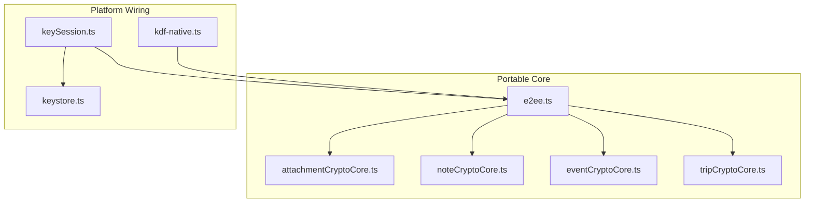
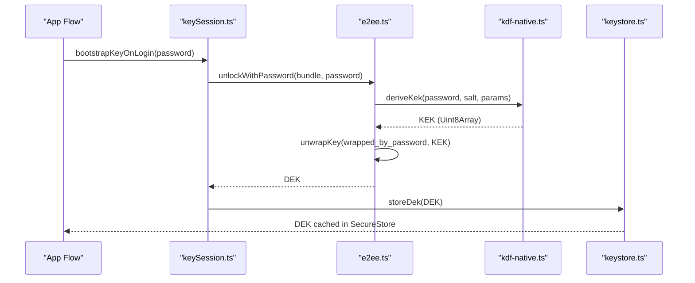
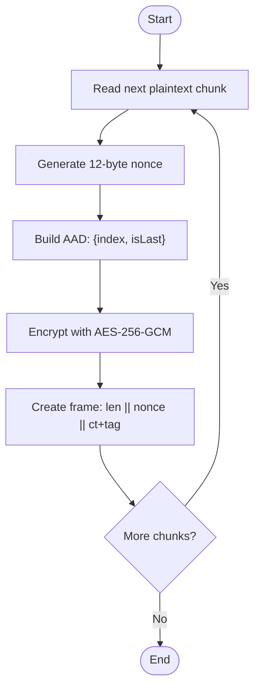
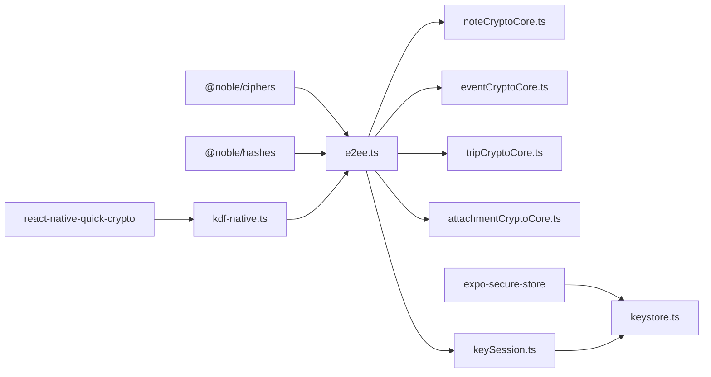

# Cryptographic Algorithms

<cite>
**Referenced Files in This Document**
- [e2ee.ts](file://src/crypto/e2ee.ts)
- [kdf-native.ts](file://src/crypto/kdf-native.ts)
- [attachmentCryptoCore.ts](file://src/crypto/attachmentCryptoCore.ts)
- [noteCryptoCore.ts](file://src/crypto/noteCryptoCore.ts)
- [eventCryptoCore.ts](file://src/crypto/eventCryptoCore.ts)
- [tripCryptoCore.ts](file://src/crypto/tripCryptoCore.ts)
- [keystore.ts](file://src/crypto/keystore.ts)
- [keySession.ts](file://src/crypto/keySession.ts)
- [e2ee.test.ts](file://src/crypto/e2ee.test.ts)
- [attachmentCryptoCore.test.ts](file://src/crypto/attachmentCryptoCore.test.ts)
</cite>

## Table of Contents
1. [Introduction](#introduction)
2. [Project Structure](#project-structure)
3. [Core Components](#core-components)
4. [Architecture Overview](#architecture-overview)
5. [Detailed Component Analysis](#detailed-component-analysis)
6. [Dependency Analysis](#dependency-analysis)
7. [Performance Considerations](#performance-considerations)
8. [Troubleshooting Guide](#troubleshooting-guide)
9. [Conclusion](#conclusion)
10. [Appendices](#appendices)

## Introduction
This document explains the cryptographic algorithms and their implementation within the encryption engine. It focuses on:
- AES-256-GCM for symmetric encryption, including initialization vector generation, authentication tag handling, and memory-safe operations
- PBKDF2 key derivation parameters (salt generation, iteration counts, hash functions)
- Configuration and usage of primitives from @noble/ciphers
- Security considerations, performance characteristics, and platform-specific optimizations
- Code examples via references to source files demonstrating algorithm usage and parameter selection rationale

The design separates portable core logic from platform wiring so that tests can run under Node while production uses native acceleration on React Native.

## Project Structure
The encryption engine is organized into a portable core and platform-specific wiring:
- Portable core provides AES-256-GCM encryption/decryption, PBKDF2 configuration, key wrapping, and per-entity field encryption helpers
- Platform wiring injects a native PBKDF2 implementation for performance
- Per-entity modules (notes, events, trips) build on the portable core to encrypt specific fields
- Attachment encryption streams large files in chunks with authenticated framing to avoid memory spikes

**Diagram sources**
- [e2ee.ts:21-27](file://src/crypto/e2ee.ts#L21-L27)
- [attachmentCryptoCore.ts:26-42](file://src/crypto/attachmentCryptoCore.ts#L26-L42)
- [noteCryptoCore.ts:14-16](file://src/crypto/noteCryptoCore.ts#L14-L16)
- [eventCryptoCore.ts:14-16](file://src/crypto/eventCryptoCore.ts#L14-L16)
- [tripCryptoCore.ts:11-13](file://src/crypto/tripCryptoCore.ts#L11-L13)
- [kdf-native.ts:12-21](file://src/crypto/kdf-native.ts#L12-L21)
- [keySession.ts:15-23](file://src/crypto/keySession.ts#L15-L23)
- [keystore.ts:1-11](file://src/crypto/keystore.ts#L1-11)

**Section sources**
- [e2ee.ts:1-27](file://src/crypto/e2ee.ts#L1-L27)
- [attachmentCryptoCore.ts:1-42](file://src/crypto/attachmentCryptoCore.ts#L1-L42)
- [noteCryptoCore.ts:1-16](file://src/crypto/noteCryptoCore.ts#L1-L16)
- [eventCryptoCore.ts:1-16](file://src/crypto/eventCryptoCore.ts#L1-L16)
- [tripCryptoCore.ts:1-13](file://src/crypto/tripCryptoCore.ts#L1-L13)
- [kdf-native.ts:1-21](file://src/crypto/kdf-native.ts#L1-L21)
- [keySession.ts:1-23](file://src/crypto/keySession.ts#L1-L23)
- [keystore.ts:1-11](file://src/crypto/keystore.ts#L1-L11)

## Core Components
- AES-256-GCM encryption/decryption for strings and bytes using @noble/ciphers
- PBKDF2-based Key Encryption Key (KEK) derivation with configurable salt, iterations, and hash
- Data Encryption Key (DEK) generation and secure storage in device keystore
- Chunked, authenticated encryption for large attachments with AAD-bound frames
- Per-entity encryption helpers for notes, events, and trips with migration-aware behavior

Key constants and defaults:
- AES-GCM nonce size: 12 bytes
- AES-256 key size: 32 bytes
- PBKDF2 default: SHA-512, 600,000 iterations, 32-byte derived key length
- Attachment chunk size: 1 MiB with small per-frame overhead

Security properties:
- Random nonces per encryption operation
- Authentication tags verify integrity and authenticity; decryption throws on tampering or wrong keys
- AAD binds each attachment chunk to its index and finality flag to prevent reordering, duplication, or truncation attacks
- Escrow bundles store only wrapped DEKs; server never sees plaintext DEK

**Section sources**
- [e2ee.ts:21-41](file://src/crypto/e2ee.ts#L21-L41)
- [e2ee.ts:99-158](file://src/crypto/e2ee.ts#L99-L158)
- [attachmentCryptoCore.ts:31-48](file://src/crypto/attachmentCryptoCore.ts#L31-L48)
- [attachmentCryptoCore.ts:71-105](file://src/crypto/attachmentCryptoCore.ts#L71-L105)
- [keystore.ts:1-11](file://src/crypto/keystore.ts#L1-L11)

## Architecture Overview
The system composes primitives into layered functionality:
- e2ee.ts defines AES-GCM encryption/decryption, PBKDF2 configuration, and key wrapping
- kdf-native.ts wires a native PBKDF2 implementation into e2ee.ts for performance
- noteCryptoCore.ts, eventCryptoCore.ts, tripCryptoCore.ts apply string encryption to entity fields
- attachmentCryptoCore.ts handles large binary data with chunked, authenticated frames
- keySession.ts orchestrates login flows, escrow creation/unlocking, and DEK lifecycle
- keystore.ts persists the DEK securely on-device

**Diagram sources**
- [keySession.ts:35-54](file://src/crypto/keySession.ts#L35-L54)
- [e2ee.ts:145-158](file://src/crypto/e2ee.ts#L145-L158)
- [kdf-native.ts:15-21](file://src/crypto/kdf-native.ts#L15-L21)
- [keystore.ts:30-41](file://src/crypto/keystore.ts#L30-L41)

## Detailed Component Analysis

### AES-256-GCM Symmetric Encryption (Strings and Bytes)
Implementation highlights:
- Nonce: 12 random bytes generated per encryption via @noble/hashes CSPRNG
- Cipher: gcm(key, nonce).encrypt/decrypt from @noble/ciphers/aes.js
- Tag: appended by library; decryption verifies tag and throws on mismatch
- Token format: versioned string “v{ENC_VERSION}.<base64-nonce>.<base64-ciphertext>”
- Memory safety: operates on Uint8Array buffers; base64 conversion is dependency-free

Usage patterns:
- Encrypt/decrypt arbitrary UTF-8 strings through helper functions
- Wrap/unwrap DEKs with KEKs for escrow storage

Security considerations:
- Never reuse nonces; random per operation ensures confidentiality and integrity
- Wrong key or tampered ciphertext results in decryption failure (authenticated encryption)

Performance characteristics:
- Pure JS AES-GCM via @noble/ciphers; fast enough for small payloads
- For large payloads, use chunked attachment encryption to limit memory footprint

Code example references:
- String encryption/decryption: [e2ee.ts:99-124](file://src/crypto/e2ee.ts#L99-L124)
- Key wrap/unwrap: [e2ee.ts:152-158](file://src/crypto/e2ee.ts#L152-L158)
- Tests verifying correctness and tamper detection: [e2ee.test.ts:66-90](file://src/crypto/e2ee.test.ts#L66-L90), [e2ee.test.ts:103-110](file://src/crypto/e2ee.test.ts#L103-L110)

**Section sources**
- [e2ee.ts:21-27](file://src/crypto/e2ee.ts#L21-L27)
- [e2ee.ts:99-124](file://src/crypto/e2ee.ts#L99-L124)
- [e2ee.ts:152-158](file://src/crypto/e2ee.ts#L152-L158)
- [e2ee.test.ts:66-90](file://src/crypto/e2ee.test.ts#L66-L90)
- [e2ee.test.ts:103-110](file://src/crypto/e2ee.test.ts#L103-L110)

### PBKDF2 Key Derivation Function
Parameters:
- Hash: SHA-512 (configurable to SHA-256)
- Iterations: 600,000 (meets OWASP baseline and fits mobile login budget when native)
- Derived key length: 32 bytes (AES-256)
- Salt: 16 random bytes per escrow entry

Implementation details:
- Portable core exposes configureKdf(fn) to inject platform-specific PBKDF2
- On React Native, kdf-native.ts wires react-native-quick-crypto’s pbkdf2Sync for speed
- In Node tests, node:crypto.pbkdf2Sync is injected

Security considerations:
- High iteration count resists brute-force attacks
- Unique salts per escrow ensure distinct KEKs even for identical passwords
- Correct error handling: wrong password yields decryption failure during unwrap

Performance characteristics:
- Native PBKDF2 reduces login time to tens of milliseconds vs seconds in pure JS
- Default parameters chosen to balance security and UX on mid-range Android devices

Code example references:
- Default KDF parameters: [e2ee.ts:30-41](file://src/crypto/e2ee.ts#L30-L41)
- KDF injection and usage: [e2ee.ts:136-150](file://src/crypto/e2ee.ts#L136-L150)
- Native wiring: [kdf-native.ts:1-21](file://src/crypto/kdf-native.ts#L1-L21)
- Test coverage for determinism and output length: [e2ee.test.ts:92-101](file://src/crypto/e2ee.test.ts#L92-L101)

**Section sources**
- [e2ee.ts:30-41](file://src/crypto/e2ee.ts#L30-L41)
- [e2ee.ts:136-150](file://src/crypto/e2ee.ts#L136-L150)
- [kdf-native.ts:1-21](file://src/crypto/kdf-native.ts#L1-L21)
- [e2ee.test.ts:92-101](file://src/crypto/e2ee.test.ts#L92-L101)

### @noble/ciphers Library Usage and Configuration
- AES-GCM primitive: imported from @noble/ciphers/aes.js
- CSPRNG: randomBytes from @noble/hashes/utils.js used for nonces and salts
- No custom cipher mode configuration beyond standard GCM parameters (nonce, optional AAD)
- Behavior: encrypt returns ciphertext + tag; decrypt verifies tag and throws on failure

Configuration rationale:
- Standard-compliant GCM with 12-byte nonces
- Optional AAD used in attachment chunking to bind frames to index and finality

Code example references:
- Import and usage: [e2ee.ts:21-22](file://src/crypto/e2ee.ts#L21-L22), [e2ee.ts:101-113](file://src/crypto/e2ee.ts#L101-L113)
- AAD usage in chunked encryption: [attachmentCryptoCore.ts:71-105](file://src/crypto/attachmentCryptoCore.ts#L71-L105)

**Section sources**
- [e2ee.ts:21-22](file://src/crypto/e2ee.ts#L21-L22)
- [e2ee.ts:101-113](file://src/crypto/e2ee.ts#L101-L113)
- [attachmentCryptoCore.ts:71-105](file://src/crypto/attachmentCryptoCore.ts#L71-L105)

### Chunked Attachment Encryption (Memory-Safe Operations)
Design goals:
- Process large files (up to 100 MB) without holding entire plaintext/ciphertext in memory
- Maintain authenticated integrity across chunks with AAD binding

Data format:
- Header: magic bytes + format version
- Frames: length-prefixed chunk containing nonce + ciphertext (+16-byte GCM tag)
- Overhead per frame: fixed small constant (length prefix + nonce + tag)

Processing logic:
- Each chunk encrypted with fresh nonce and AAD = {index (u32 BE), isLast (byte)}
- Decryption validates index and finality flag; rejects reordered, duplicated, or truncated files

Memory and performance:
- CHUNK_SIZE set to 1 MiB to balance overhead and peak memory
- Encrypted size calculation accounts for header and per-chunk overhead

Code example references:
- Constants and framing: [attachmentCryptoCore.ts:31-48](file://src/crypto/attachmentCryptoCore.ts#L31-L48)
- AAD construction and chunk encrypt/decrypt: [attachmentCryptoCore.ts:71-105](file://src/crypto/attachmentCryptoCore.ts#L71-L105)
- Tamper resistance tests: [attachmentCryptoCore.test.ts:95-120](file://src/crypto/attachmentCryptoCore.test.ts#L95-L120)

**Diagram sources**
- [attachmentCryptoCore.ts:71-105](file://src/crypto/attachmentCryptoCore.ts#L71-L105)

**Section sources**
- [attachmentCryptoCore.ts:31-48](file://src/crypto/attachmentCryptoCore.ts#L31-L48)
- [attachmentCryptoCore.ts:71-105](file://src/crypto/attachmentCryptoCore.ts#L71-L105)
- [attachmentCryptoCore.test.ts:95-120](file://src/crypto/attachmentCryptoCore.test.ts#L95-L120)

### Per-Entity Field Encryption (Notes, Events, Trips)
Common pattern:
- Identify encryptable fields per entity type
- Encrypt only present fields; mark payload with enc_version to indicate ciphertext
- Decrypt safely: if a field fails to decrypt, replace with placeholder instead of crashing lists

Notes:
- Encrypts title, content, tag names, and attachment filenames
- Leaves non-sensitive metadata (e.g., tag color, S3 keys) plaintext for storage compatibility

Events:
- Encrypts title, description, location
- Leaves scheduling-related fields plaintext for sync and reminders

Trips:
- Encrypts name and description

Migration support:
- Legacy plaintext entries have enc_version null and pass through unchanged
- Migration helpers identify items needing encryption

Code example references:
- Notes encryption/decryption: [noteCryptoCore.ts:65-127](file://src/crypto/noteCryptoCore.ts#L65-L127)
- Events encryption/decryption: [eventCryptoCore.ts:36-79](file://src/crypto/eventCryptoCore.ts#L36-L79)
- Trips encryption/decryption: [tripCryptoCore.ts:32-67](file://src/crypto/tripCryptoCore.ts#L32-L67)

**Section sources**
- [noteCryptoCore.ts:65-127](file://src/crypto/noteCryptoCore.ts#L65-L127)
- [eventCryptoCore.ts:36-79](file://src/crypto/eventCryptoCore.ts#L36-L79)
- [tripCryptoCore.ts:32-67](file://src/crypto/tripCryptoCore.ts#L32-L67)

### Key Management and Lifecycle
- DEK generation: cryptographically secure random 32-byte key
- Escrow bundle: stores DEK wrapped under two KEKs (password-derived and recovery-code-derived) plus salts and KDF params
- Login flow: derive KEK from password, unwrap DEK, store in SecureStore
- Recovery flow: derive KEK from normalized recovery code, unwrap DEK, rewrap under new password
- Logout: clear DEK from SecureStore

Code example references:
- Escrow creation and unlocking: [e2ee.ts:177-227](file://src/crypto/e2ee.ts#L177-L227)
- Session orchestration: [keySession.ts:35-81](file://src/crypto/keySession.ts#L35-L81)
- Secure storage: [keystore.ts:30-52](file://src/crypto/keystore.ts#L30-L52)

**Section sources**
- [e2ee.ts:177-227](file://src/crypto/e2ee.ts#L177-L227)
- [keySession.ts:35-81](file://src/crypto/keySession.ts#L35-L81)
- [keystore.ts:30-52](file://src/crypto/keystore.ts#L30-L52)

## Dependency Analysis
- e2ee.ts depends on @noble/ciphers (AES-GCM) and @noble/hashes (CSPRNG)
- kdf-native.ts depends on react-native-quick-crypto for native PBKDF2
- Per-entity cores depend on e2ee.ts for string encryption/decryption
- keySession.ts depends on e2ee.ts and keystore.ts for escrow and DEK management
- attachmentCryptoCore.ts depends on @noble/ciphers for chunked encryption

**Diagram sources**
- [e2ee.ts:21-22](file://src/crypto/e2ee.ts#L21-L22)
- [kdf-native.ts:12-13](file://src/crypto/kdf-native.ts#L12-L13)
- [noteCryptoCore.ts:14-16](file://src/crypto/noteCryptoCore.ts#L14-L16)
- [eventCryptoCore.ts:14-16](file://src/crypto/eventCryptoCore.ts#L14-L16)
- [tripCryptoCore.ts:11-13](file://src/crypto/tripCryptoCore.ts#L11-L13)
- [attachmentCryptoCore.ts:26-29](file://src/crypto/attachmentCryptoCore.ts#L26-L29)
- [keySession.ts:15-23](file://src/crypto/keySession.ts#L15-L23)
- [keystore.ts:9-11](file://src/crypto/keystore.ts#L9-L11)

**Section sources**
- [e2ee.ts:21-22](file://src/crypto/e2ee.ts#L21-L22)
- [kdf-native.ts:12-13](file://src/crypto/kdf-native.ts#L12-L13)
- [noteCryptoCore.ts:14-16](file://src/crypto/noteCryptoCore.ts#L14-L16)
- [eventCryptoCore.ts:14-16](file://src/crypto/eventCryptoCore.ts#L14-L16)
- [tripCryptoCore.ts:11-13](file://src/crypto/tripCryptoCore.ts#L11-L13)
- [attachmentCryptoCore.ts:26-29](file://src/crypto/attachmentCryptoCore.ts#L26-L29)
- [keySession.ts:15-23](file://src/crypto/keySession.ts#L15-L23)
- [keystore.ts:9-11](file://src/crypto/keystore.ts#L9-L11)

## Performance Considerations
- PBKDF2: Native implementation reduces login time significantly compared to pure JS; default 600k iterations balances security and UX
- AES-GCM: Efficient for small payloads; for large files, chunked processing avoids OOM issues
- Memory usage: Attachment encryption limits peak memory to chunk size plus small overhead
- Platform specifics: React Native requires CSPRNG polyfill; web path currently defers E2EE to native-only due to SecureStore absence

[No sources needed since this section provides general guidance]

## Troubleshooting Guide
Common issues and resolutions:
- Wrong password or recovery code: unwrapKey throws; handle gracefully and prompt user
- Malformed ciphertext token: decryptString throws; validate token format before decryption
- Reordered or truncated attachments: chunk decryption throws due to AAD mismatch; ensure correct index and finality flags
- Missing KDF configuration: deriveKek throws if not configured at app entry; import kdf-native.ts early

Diagnostic tips:
- Verify token format matches versioned structure
- Check that nonces are unique per encryption call
- Ensure chunk indices and isLast flags match the original file layout

**Section sources**
- [e2ee.ts:106-114](file://src/crypto/e2ee.ts#L106-L114)
- [attachmentCryptoCore.ts:94-105](file://src/crypto/attachmentCryptoCore.ts#L94-L105)
- [e2ee.test.ts:81-90](file://src/crypto/e2ee.test.ts#L81-L90)
- [attachmentCryptoCore.test.ts:95-120](file://src/crypto/attachmentCryptoCore.test.ts#L95-L120)

## Conclusion
The encryption engine implements robust, modern cryptography:
- AES-256-GCM with unique nonces and authenticated tags ensures confidentiality and integrity
- PBKDF2 with strong parameters and native acceleration delivers secure key derivation with acceptable performance
- Chunked attachment encryption enables safe handling of large files with minimal memory usage
- Clear separation between portable core and platform wiring supports testing and cross-platform deployment
- Comprehensive error handling and migration support maintain resilience and usability

[No sources needed since this section summarizes without analyzing specific files]

## Appendices

### Algorithm Parameters Summary
- AES-256-GCM: 32-byte key, 12-byte nonce, 16-byte authentication tag
- PBKDF2: SHA-512, 600,000 iterations, 32-byte derived key, 16-byte salt
- Attachment chunk size: 1 MiB; per-frame overhead includes length prefix, nonce, and tag

### Example References
- String encryption/decryption: [e2ee.ts:116-124](file://src/crypto/e2ee.ts#L116-L124)
- Key wrapping/unwrap: [e2ee.ts:152-158](file://src/crypto/e2ee.ts#L152-L158)
- PBKDF2 configuration: [e2ee.ts:136-150](file://src/crypto/e2ee.ts#L136-L150), [kdf-native.ts:15-21](file://src/crypto/kdf-native.ts#L15-L21)
- Chunked encryption workflow: [attachmentCryptoCore.ts:71-105](file://src/crypto/attachmentCryptoCore.ts#L71-L105)
- Entity field encryption: [noteCryptoCore.ts:65-127](file://src/crypto/noteCryptoCore.ts#L65-L127), [eventCryptoCore.ts:36-79](file://src/crypto/eventCryptoCore.ts#L36-L79), [tripCryptoCore.ts:32-67](file://src/crypto/tripCryptoCore.ts#L32-L67)

[No sources needed since this section aggregates references already cited above]