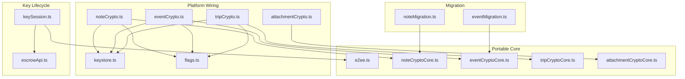
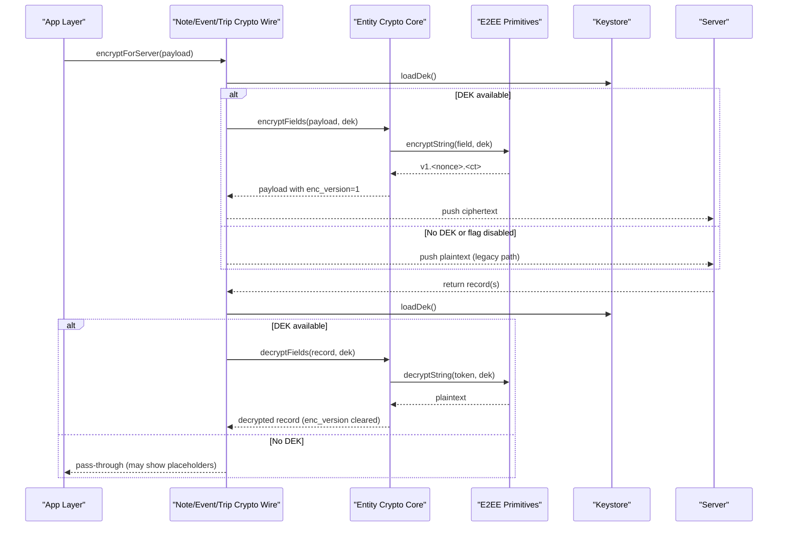
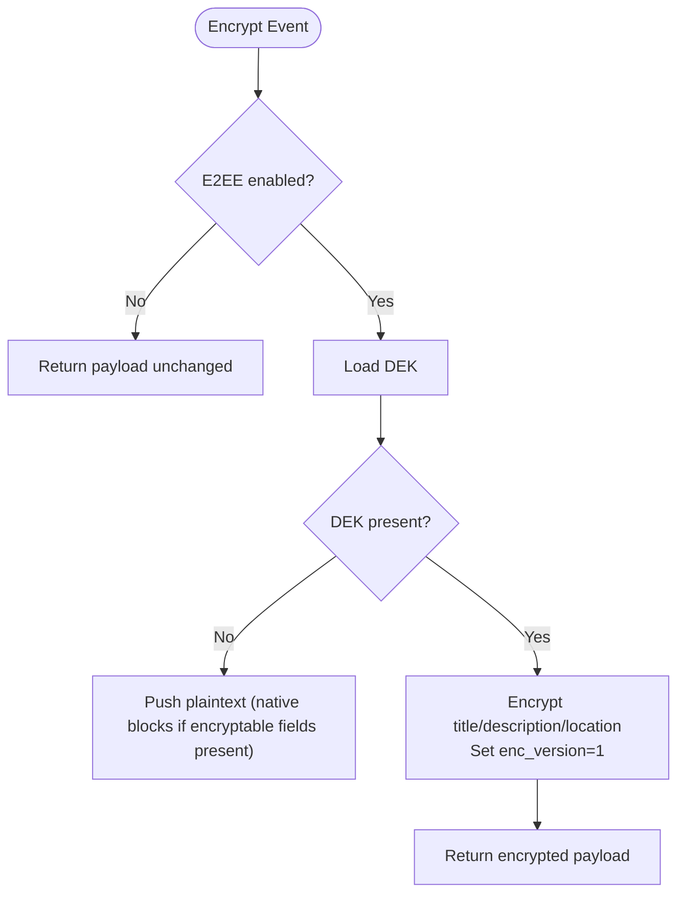
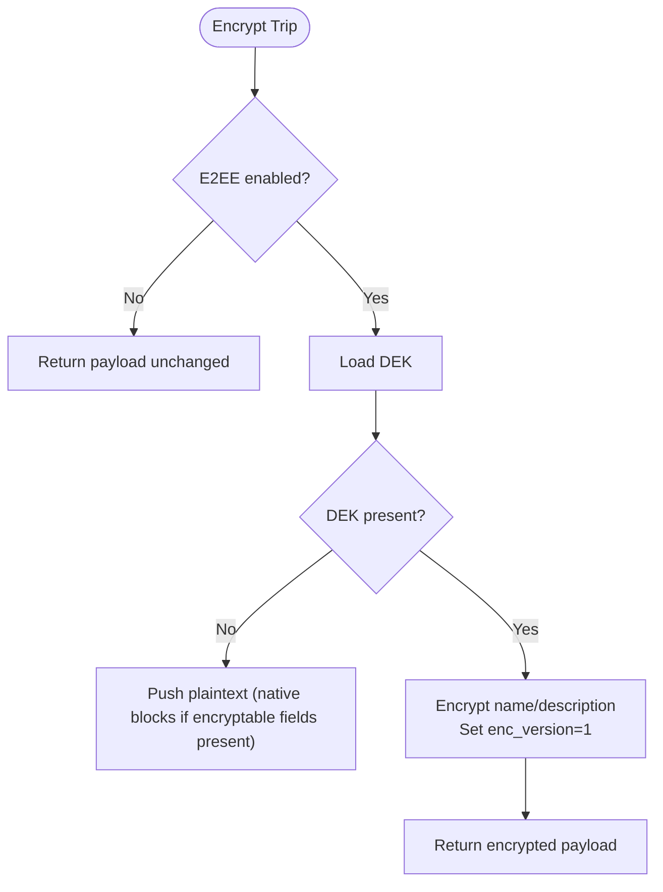
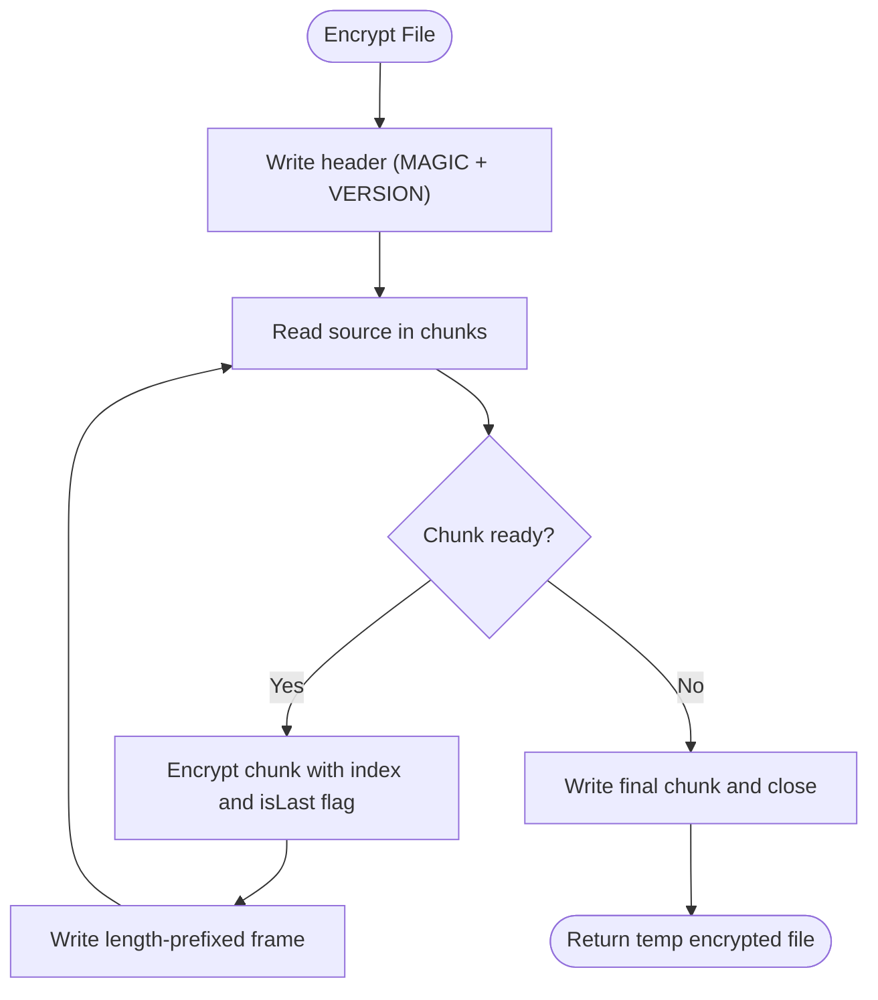
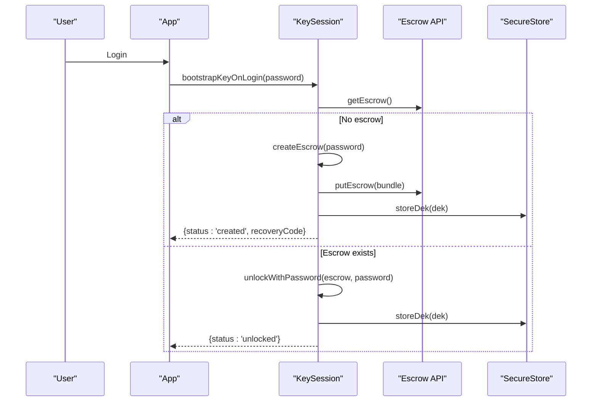
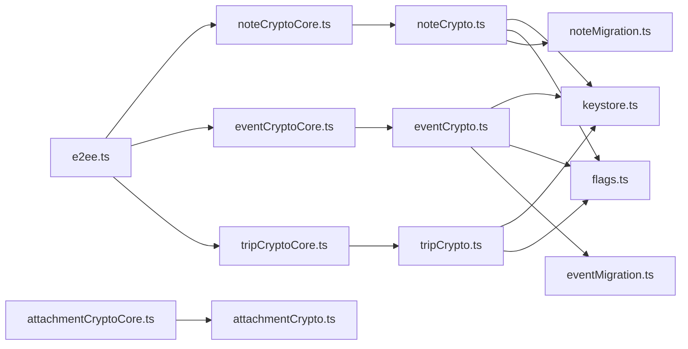

# Data Encryption Patterns

<cite>
**Referenced Files in This Document**
- [e2ee.ts](file://src/crypto/e2ee.ts)
- [keystore.ts](file://src/crypto/keystore.ts)
- [keySession.ts](file://src/crypto/keySession.ts)
- [escrowApi.ts](file://src/crypto/escrowApi.ts)
- [flags.ts](file://src/crypto/flags.ts)
- [noteCrypto.ts](file://src/crypto/noteCrypto.ts)
- [noteCryptoCore.ts](file://src/crypto/noteCryptoCore.ts)
- [eventCrypto.ts](file://src/crypto/eventCrypto.ts)
- [eventCryptoCore.ts](file://src/crypto/eventCryptoCore.ts)
- [tripCrypto.ts](file://src/crypto/tripCrypto.ts)
- [tripCryptoCore.ts](file://src/crypto/tripCryptoCore.ts)
- [attachmentCrypto.ts](file://src/crypto/attachmentCrypto.ts)
- [attachmentCryptoCore.ts](file://src/crypto/attachmentCryptoCore.ts)
- [noteMigration.ts](file://src/crypto/noteMigration.ts)
- [eventMigration.ts](file://src/crypto/eventMigration.ts)
</cite>

## Table of Contents
1. [Introduction](#introduction)
2. [Project Structure](#project-structure)
3. [Core Components](#core-components)
4. [Architecture Overview](#architecture-overview)
5. [Detailed Component Analysis](#detailed-component-analysis)
6. [Dependency Analysis](#dependency-analysis)
7. [Performance Considerations](#performance-considerations)
8. [Troubleshooting Guide](#troubleshooting-guide)
9. [Conclusion](#conclusion)
10. [Appendices](#appendices)

## Introduction
This document explains the data-specific encryption patterns implemented for notes, calendar events, trips, and attachments. It covers field-level encryption, metadata handling, content transformation, streaming binary encryption, versioning, migration strategies, and backward compatibility. It also provides examples of encrypt/decrypt operations for each data type and clarifies how encryption layers relate to data models.

## Project Structure
The encryption system is organized into:
- A portable core that implements cryptographic primitives and per-entity logic without platform dependencies
- Platform wiring modules that connect the core to device storage (SecureStore), feature flags, and I/O streams
- Migration utilities that convert legacy plaintext records to ciphertext
- Key lifecycle management for bootstrapping, unlocking, and rotating keys

**Diagram sources**
- [e2ee.ts:24-27](file://src/crypto/e2ee.ts#L24-L27)
- [noteCrypto.ts:10-19](file://src/crypto/noteCrypto.ts#L10-L19)
- [eventCrypto.ts:11-20](file://src/crypto/eventCrypto.ts#L11-L20)
- [tripCrypto.ts:10-19](file://src/crypto/tripCrypto.ts#L10-L19)
- [attachmentCrypto.ts:13-24](file://src/crypto/attachmentCrypto.ts#L13-L24)
- [keystore.ts:1-53](file://src/crypto/keystore.ts#L1-L53)
- [flags.ts:1-34](file://src/crypto/flags.ts#L1-L34)
- [keySession.ts:1-82](file://src/crypto/keySession.ts#L1-L82)
- [escrowApi.ts:1-39](file://src/crypto/escrowApi.ts#L1-L39)
- [noteMigration.ts:1-87](file://src/crypto/noteMigration.ts#L1-L87)
- [eventMigration.ts:1-90](file://src/crypto/eventMigration.ts#L1-L90)

**Section sources**
- [e2ee.ts:24-27](file://src/crypto/e2ee.ts#L24-L27)
- [noteCrypto.ts:1-93](file://src/crypto/noteCrypto.ts#L1-L93)
- [eventCrypto.ts:1-73](file://src/crypto/eventCrypto.ts#L1-L73)
- [tripCrypto.ts:1-72](file://src/crypto/tripCrypto.ts#L1-L72)
- [attachmentCrypto.ts:1-224](file://src/crypto/attachmentCrypto.ts#L1-L224)
- [keystore.ts:1-53](file://src/crypto/keystore.ts#L1-L53)
- [keySession.ts:1-82](file://src/crypto/keySession.ts#L1-L82)
- [escrowApi.ts:1-39](file://src/crypto/escrowApi.ts#L1-L39)
- [flags.ts:1-34](file://src/crypto/flags.ts#L1-L34)
- [noteMigration.ts:1-87](file://src/crypto/noteMigration.ts#L1-L87)
- [eventMigration.ts:1-90](file://src/crypto/eventMigration.ts#L1-L90)

## Core Components
- End-to-end encryption primitives: AES-GCM with per-field nonces, base64 tokens, PBKDF2 key derivation, escrow bundle creation/unwrapping, and recovery code support.
- Per-entity encryption cores: define which fields are encrypted, handle idempotent encryption/decryption, and mark records with an encryption version.
- Platform wiring: gate encryption by feature flags, load the Data Encryption Key (DEK) from SecureStore, and stream large attachments.
- Key session orchestration: bootstrap DEK at login, recover via recovery code, rewrap on password change, and clear on logout.
- Migration utilities: one-time eager migration of legacy plaintext notes and events to ciphertext.

**Section sources**
- [e2ee.ts:24-27](file://src/crypto/e2ee.ts#L24-L27)
- [e2ee.ts:100-124](file://src/crypto/e2ee.ts#L100-L124)
- [e2ee.ts:145-227](file://src/crypto/e2ee.ts#L145-L227)
- [noteCryptoCore.ts:1-158](file://src/crypto/noteCryptoCore.ts#L1-L158)
- [eventCryptoCore.ts:1-109](file://src/crypto/eventCryptoCore.ts#L1-L109)
- [tripCryptoCore.ts:1-97](file://src/crypto/tripCryptoCore.ts#L1-L97)
- [attachmentCryptoCore.ts:1-111](file://src/crypto/attachmentCryptoCore.ts#L1-L111)
- [keystore.ts:1-53](file://src/crypto/keystore.ts#L1-L53)
- [keySession.ts:1-82](file://src/crypto/keySession.ts#L1-L82)
- [noteMigration.ts:1-87](file://src/crypto/noteMigration.ts#L1-L87)
- [eventMigration.ts:1-90](file://src/crypto/eventMigration.ts#L1-L90)

## Architecture Overview
Encryption is layered:
- Field-level encryption uses a per-user DEK to encrypt sensitive text fields. Each record carries an enc_version to indicate whether it is ciphertext or legacy plaintext.
- Binary attachments are streamed and chunked with authenticated frames to protect integrity and detect truncation/reordering.
- Keys are derived from user secrets (password or recovery code) using PBKDF2 and stored as wrapped bundles on the server; the DEK is cached in the device keystore.

**Diagram sources**
- [noteCrypto.ts:46-72](file://src/crypto/noteCrypto.ts#L46-L72)
- [eventCrypto.ts:37-61](file://src/crypto/eventCrypto.ts#L37-L61)
- [tripCrypto.ts:36-60](file://src/crypto/tripCrypto.ts#L36-L60)
- [noteCryptoCore.ts:65-127](file://src/crypto/noteCryptoCore.ts#L65-L127)
- [eventCryptoCore.ts:36-79](file://src/crypto/eventCryptoCore.ts#L36-L79)
- [tripCryptoCore.ts:32-67](file://src/crypto/tripCryptoCore.ts#L32-L67)
- [e2ee.ts:100-124](file://src/crypto/e2ee.ts#L100-L124)
- [keystore.ts:36-42](file://src/crypto/keystore.ts#L36-L42)

## Detailed Component Analysis

### Notes: Field-Level Encryption
- Encryptable fields: title, content, tag names, and attachment filenames. Tag color and other attachment metadata remain plaintext to support UI rendering and storage operations.
- Versioning: encrypted notes carry enc_version = 1; legacy notes have null and pass through unchanged during decryption.
- Idempotency: already-encrypted payloads are returned unchanged to prevent double encryption.
- Graceful degradation: if a field cannot be decrypted, it is replaced with a placeholder so lists remain usable.

**Diagram sources**
- [noteCrypto.ts:46-60](file://src/crypto/noteCrypto.ts#L46-L60)
- [noteCryptoCore.ts:65-95](file://src/crypto/noteCryptoCore.ts#L65-L95)

**Section sources**
- [noteCryptoCore.ts:1-158](file://src/crypto/noteCryptoCore.ts#L1-L158)
- [noteCrypto.ts:1-93](file://src/crypto/noteCrypto.ts#L1-L93)

#### Example Operations (Notes)
- Encrypt a note before sending to server: call the wire function with the note payload; it returns a new object with enc_version set and sensitive fields transformed to ciphertext tokens.
- Decrypt a note after receiving from server: call the wire function with the server note; it returns a new object with sensitive fields decrypted and enc_version cleared.

**Section sources**
- [noteCrypto.ts:46-72](file://src/crypto/noteCrypto.ts#L46-L72)
- [noteCryptoCore.ts:65-127](file://src/crypto/noteCryptoCore.ts#L65-L127)

### Calendar Events: Field-Level Encryption with Recurrence Support
- Encryptable fields: title, description, location. Fields required for scheduling and reminders (start_time, end_time, reminder_minutes, linked_note_ids, device_calendar_event_id) remain plaintext to preserve functionality.
- Versioning: encrypted events carry enc_version = 1; legacy events pass through unchanged.
- Recurrence: recurrence metadata is not encrypted here; only textual fields are protected. The same encrypt/decrypt flow applies regardless of recurrence presence.

**Diagram sources**
- [eventCrypto.ts:37-49](file://src/crypto/eventCrypto.ts#L37-L49)
- [eventCryptoCore.ts:36-56](file://src/crypto/eventCryptoCore.ts#L36-L56)

**Section sources**
- [eventCryptoCore.ts:1-109](file://src/crypto/eventCryptoCore.ts#L1-L109)
- [eventCrypto.ts:1-73](file://src/crypto/eventCrypto.ts#L1-L73)

#### Example Operations (Events)
- Encrypt an event before sending to server: call the wire function with the event payload; it returns a new object with enc_version set and sensitive fields transformed to ciphertext tokens.
- Decrypt an event after receiving from server: call the wire function with the server event; it returns a new object with sensitive fields decrypted and enc_version cleared.

**Section sources**
- [eventCrypto.ts:37-61](file://src/crypto/eventCrypto.ts#L37-L61)
- [eventCryptoCore.ts:36-79](file://src/crypto/eventCryptoCore.ts#L36-L79)

### Trips: Field-Level Encryption for Travel Data
- Encryptable fields: name, description. Other trip metadata remains plaintext to support listing and display.
- Versioning: encrypted trips carry enc_version = 1; legacy trips pass through unchanged.

**Diagram sources**
- [tripCrypto.ts:36-48](file://src/crypto/tripCrypto.ts#L36-L48)
- [tripCryptoCore.ts:32-46](file://src/crypto/tripCryptoCore.ts#L32-L46)

**Section sources**
- [tripCryptoCore.ts:1-97](file://src/crypto/tripCryptoCore.ts#L1-L97)
- [tripCrypto.ts:1-72](file://src/crypto/tripCrypto.ts#L1-L72)

#### Example Operations (Trips)
- Encrypt a trip before sending to server: call the wire function with the trip payload; it returns a new object with enc_version set and sensitive fields transformed to ciphertext tokens.
- Decrypt a trip after receiving from server: call the wire function with the server trip; it returns a new object with sensitive fields decrypted and enc_version cleared.

**Section sources**
- [tripCrypto.ts:36-60](file://src/crypto/tripCrypto.ts#L36-L60)
- [tripCryptoCore.ts:32-67](file://src/crypto/tripCryptoCore.ts#L32-L67)

### Attachments: Streaming Binary Encryption
- Chunked format: header (magic + version), followed by frames where each frame contains length-prefixed nonce and ciphertext plus GCM tag. Additional authenticated data binds each chunk to its index and finality to detect tampering, reordering, or truncation.
- Streaming I/O: reads/writes in fixed-size chunks to keep memory usage proportional to chunk size rather than file size.
- Legacy compatibility: files without the Nueco header are treated as plaintext and passed through unchanged.

**Diagram sources**
- [attachmentCrypto.ts:67-119](file://src/crypto/attachmentCrypto.ts#L67-L119)
- [attachmentCryptoCore.ts:50-92](file://src/crypto/attachmentCryptoCore.ts#L50-L92)

**Section sources**
- [attachmentCrypto.ts:1-224](file://src/crypto/attachmentCrypto.ts#L1-L224)
- [attachmentCryptoCore.ts:1-111](file://src/crypto/attachmentCryptoCore.ts#L1-L111)

#### Example Operations (Attachments)
- Encrypt a file: provide the source URI and DEK; returns a temporary encrypted file suitable for upload.
- Decrypt a file: provide the source URI, DEK, and output filename; returns a temporary decrypted file, handling legacy plaintext files transparently.

**Section sources**
- [attachmentCrypto.ts:67-119](file://src/crypto/attachmentCrypto.ts#L67-L119)
- [attachmentCrypto.ts:128-224](file://src/crypto/attachmentCrypto.ts#L128-L224)

### Key Management and Session Orchestration
- DEK lifecycle: created at first login, stored in SecureStore, unwrapped on subsequent logins, cleared on logout.
- Escrow: server stores wrapped DEK blobs under password-derived and recovery-code-derived KEKs; supports recovery when password changes out-of-band.
- Feature flags: encryption is gated by build-time flags; migration runs only when explicitly enabled.

**Diagram sources**
- [keySession.ts:35-54](file://src/crypto/keySession.ts#L35-L54)
- [e2ee.ts:179-227](file://src/crypto/e2ee.ts#L179-L227)
- [escrowApi.ts:21-38](file://src/crypto/escrowApi.ts#L21-L38)
- [keystore.ts:30-42](file://src/crypto/keystore.ts#L30-L42)

**Section sources**
- [keySession.ts:1-82](file://src/crypto/keySession.ts#L1-L82)
- [e2ee.ts:179-227](file://src/crypto/e2ee.ts#L179-L227)
- [escrowApi.ts:1-39](file://src/crypto/escrowApi.ts#L1-L39)
- [keystore.ts:1-53](file://src/crypto/keystore.ts#L1-L53)
- [flags.ts:1-34](file://src/crypto/flags.ts#L1-L34)

## Dependency Analysis
- Portable cores depend only on e2ee primitives, ensuring testability across platforms.
- Platform wires depend on keystore and flags to gate behavior and supply the DEK.
- Migrations depend on entity cores and APIs to re-encrypt legacy records.
- Attachment encryption depends on a custom chunked format and streaming I/O.

**Diagram sources**
- [e2ee.ts:24-27](file://src/crypto/e2ee.ts#L24-L27)
- [noteCryptoCore.ts:1-158](file://src/crypto/noteCryptoCore.ts#L1-L158)
- [eventCryptoCore.ts:1-109](file://src/crypto/eventCryptoCore.ts#L1-L109)
- [tripCryptoCore.ts:1-97](file://src/crypto/tripCryptoCore.ts#L1-L97)
- [noteCrypto.ts:1-93](file://src/crypto/noteCrypto.ts#L1-L93)
- [eventCrypto.ts:1-73](file://src/crypto/eventCrypto.ts#L1-L73)
- [tripCrypto.ts:1-72](file://src/crypto/tripCrypto.ts#L1-L72)
- [attachmentCryptoCore.ts:1-111](file://src/crypto/attachmentCryptoCore.ts#L1-L111)
- [attachmentCrypto.ts:1-224](file://src/crypto/attachmentCrypto.ts#L1-L224)
- [noteMigration.ts:1-87](file://src/crypto/noteMigration.ts#L1-L87)
- [eventMigration.ts:1-90](file://src/crypto/eventMigration.ts#L1-L90)

**Section sources**
- [noteCryptoCore.ts:1-158](file://src/crypto/noteCryptoCore.ts#L1-L158)
- [eventCryptoCore.ts:1-109](file://src/crypto/eventCryptoCore.ts#L1-L109)
- [tripCryptoCore.ts:1-97](file://src/crypto/tripCryptoCore.ts#L1-L97)
- [attachmentCryptoCore.ts:1-111](file://src/crypto/attachmentCryptoCore.ts#L1-L111)
- [noteCrypto.ts:1-93](file://src/crypto/noteCrypto.ts#L1-L93)
- [eventCrypto.ts:1-73](file://src/crypto/eventCrypto.ts#L1-L73)
- [tripCrypto.ts:1-72](file://src/crypto/tripCrypto.ts#L1-L72)
- [attachmentCrypto.ts:1-224](file://src/crypto/attachmentCrypto.ts#L1-L224)
- [noteMigration.ts:1-87](file://src/crypto/noteMigration.ts#L1-L87)
- [eventMigration.ts:1-90](file://src/crypto/eventMigration.ts#L1-L90)

## Performance Considerations
- Decryption batching with periodic yields prevents UI stalls when decrypting large batches of notes or events.
- Attachment encryption/decryption streams data in fixed-size chunks to avoid OOM on large files.
- DEK caching reduces repeated SecureStore calls within a single operation batch.

[No sources needed since this section provides general guidance]

## Troubleshooting Guide
- Missing DEK on native: pushing plaintext while server still holds ciphertext can corrupt future decryption; the wire layer refuses to push plaintext when encryptable fields are present and no DEK is loaded.
- Unsupported attachment format: decryption validates the header version and throws if unsupported.
- Partial updates: ensure only encryptable fields are included; otherwise enc_version may not be set and backend exclude_unset preserves existing values.
- Migration failures: migrations are best-effort and retry on next login; check logs for failed items.

**Section sources**
- [noteCrypto.ts:46-60](file://src/crypto/noteCrypto.ts#L46-L60)
- [eventCrypto.ts:37-49](file://src/crypto/eventCrypto.ts#L37-L49)
- [tripCrypto.ts:36-48](file://src/crypto/tripCrypto.ts#L36-L48)
- [attachmentCrypto.ts:171-178](file://src/crypto/attachmentCrypto.ts#L171-L178)
- [noteMigration.ts:55-86](file://src/crypto/noteMigration.ts#L55-L86)
- [eventMigration.ts:58-89](file://src/crypto/eventMigration.ts#L58-L89)

## Conclusion
The encryption system applies consistent, versioned field-level encryption across notes, events, and trips, with robust streaming encryption for attachments. Keys are managed securely with escrow and recovery, and migrations enable safe upgrades from plaintext to ciphertext. The design emphasizes idempotency, graceful degradation, and performance to maintain app responsiveness and reliability.

[No sources needed since this section summarizes without analyzing specific files]

## Appendices

### Encryption Versioning and Backward Compatibility
- Records carry enc_version to distinguish ciphertext from legacy plaintext. Decryption skips records without the expected version.
- Attachment files include a header with magic bytes and format version; legacy files without headers are treated as plaintext.
- Migration functions identify legacy records by missing enc_version and re-encrypt them once.

**Section sources**
- [noteCryptoCore.ts:12-15](file://src/crypto/noteCryptoCore.ts#L12-L15)
- [eventCryptoCore.ts:10-13](file://src/crypto/eventCryptoCore.ts#L10-L13)
- [tripCryptoCore.ts:7-10](file://src/crypto/tripCryptoCore.ts#L7-L10)
- [attachmentCryptoCore.ts:13-25](file://src/crypto/attachmentCryptoCore.ts#L13-L25)
- [attachmentCrypto.ts:121-178](file://src/crypto/attachmentCrypto.ts#L121-L178)
- [noteMigration.ts:55-86](file://src/crypto/noteMigration.ts#L55-L86)
- [eventMigration.ts:58-89](file://src/crypto/eventMigration.ts#L58-L89)

### Relationship Between Encryption Layers and Data Models
- Notes: title, content, tag names, and attachment filenames are encrypted; other metadata remains readable for storage and UI.
- Events: title, description, location are encrypted; scheduling-related fields remain plaintext.
- Trips: name and description are encrypted; other fields remain plaintext.
- Attachments: entire file bytes are encrypted in chunks; filenames are handled separately for notes.

**Section sources**
- [noteCryptoCore.ts:7-15](file://src/crypto/noteCryptoCore.ts#L7-L15)
- [eventCryptoCore.ts:7-13](file://src/crypto/eventCryptoCore.ts#L7-L13)
- [tripCryptoCore.ts:7-10](file://src/crypto/tripCryptoCore.ts#L7-L10)
- [attachmentCrypto.ts:1-12](file://src/crypto/attachmentCrypto.ts#L1-L12)