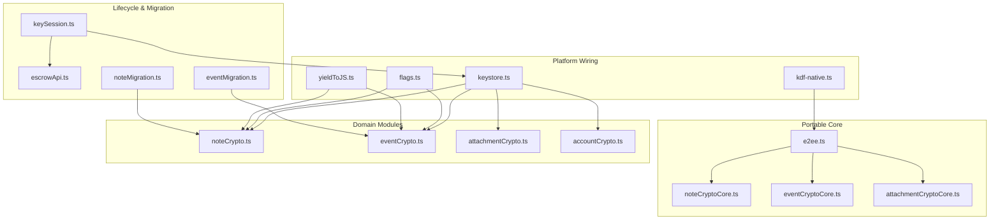
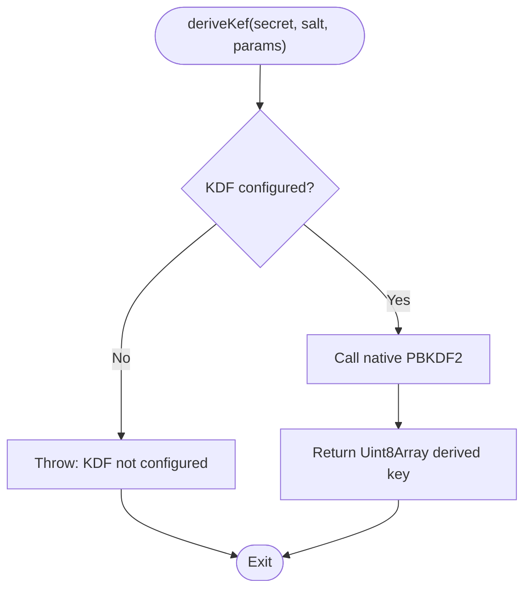
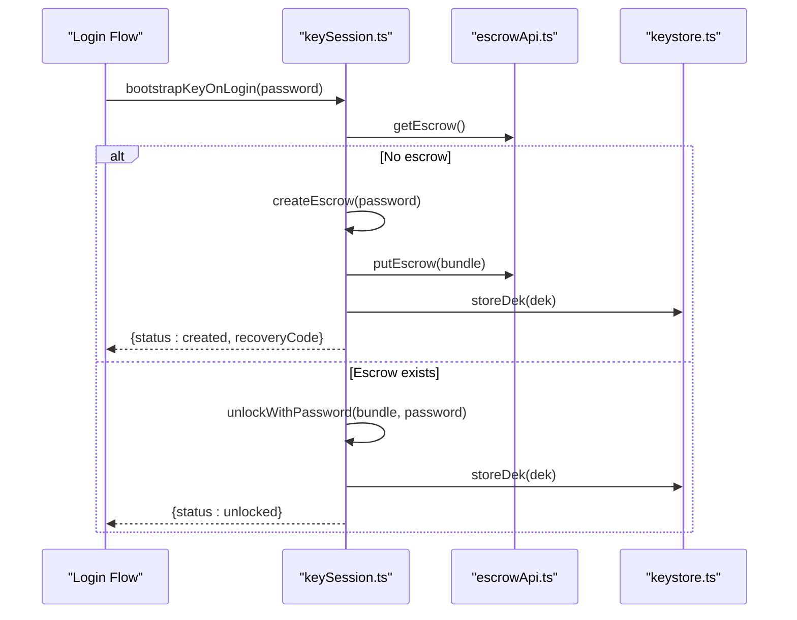
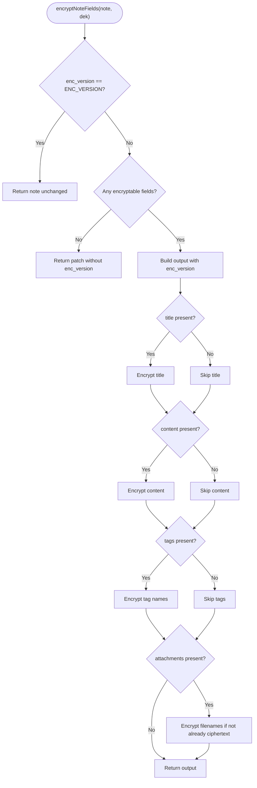
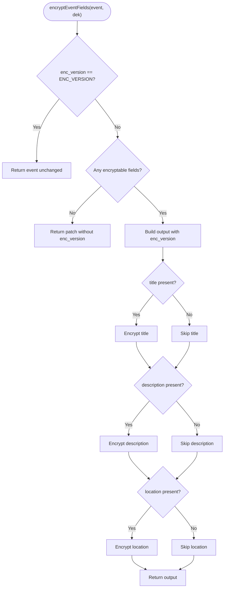
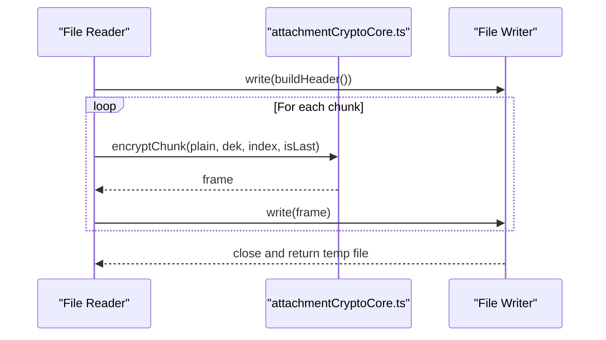
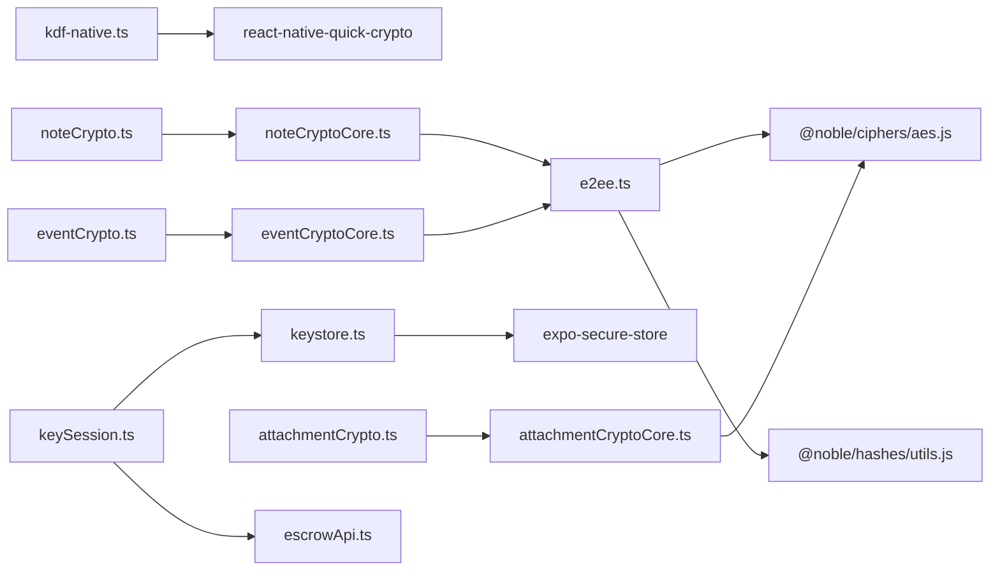

# Encryption Engine

<cite>
**Referenced Files in This Document**
- [e2ee.ts](file://src/crypto/e2ee.ts)
- [kdf-native.ts](file://src/crypto/kdf-native.ts)
- [keystore.ts](file://src/crypto/keystore.ts)
- [accountCrypto.ts](file://src/crypto/accountCrypto.ts)
- [noteCrypto.ts](file://src/crypto/noteCrypto.ts)
- [noteCryptoCore.ts](file://src/crypto/noteCryptoCore.ts)
- [eventCrypto.ts](file://src/crypto/eventCrypto.ts)
- [eventCryptoCore.ts](file://src/crypto/eventCryptoCore.ts)
- [attachmentCrypto.ts](file://src/crypto/attachmentCrypto.ts)
- [attachmentCryptoCore.ts](file://src/crypto/attachmentCryptoCore.ts)
- [keySession.ts](file://src/crypto/keySession.ts)
- [escrowApi.ts](file://src/crypto/escrowApi.ts)
- [flags.ts](file://src/crypto/flags.ts)
- [yieldToJS.ts](file://src/crypto/yieldToJS.ts)
- [noteMigration.ts](file://src/crypto/noteMigration.ts)
- [eventMigration.ts](file://src/crypto/eventMigration.ts)
- [e2ee.test.ts](file://src/crypto/e2ee.test.ts)
- [noteCryptoCore.test.ts](file://src/crypto/noteCryptoCore.test.ts)
- [eventCryptoCore.test.ts](file://src/crypto/eventCryptoCore.test.ts)
- [attachmentCryptoCore.test.ts](file://src/crypto/attachmentCryptoCore.test.ts)
</cite>

## Table of Contents
1. Introduction
2. Project Structure
3. Core Components
4. Architecture Overview
5. Detailed Component Analysis
6. Dependency Analysis
7. Performance Considerations
8. Troubleshooting Guide
9. Conclusion
10. Appendices

## Introduction
This document explains the end-to-end encryption (E2EE) engine used to protect sensitive data on-device and in transit to the server. It covers:
- Cryptographic algorithms: AES-256-GCM for authenticated encryption and PBKDF2 for key derivation.
- Key management: generation, secure storage, rotation, recovery, and backup via server-side escrow.
- Data encryption workflows for notes, events, and attachments, including metadata handling and integrity verification.
- Native KDF optimizations, memory-safe streaming, and performance considerations.
- Migration strategies for legacy plaintext data, version compatibility, and secure destruction.
- Code examples are referenced by file paths rather than inline code blocks.

## Project Structure
The E2EE system is organized into layered modules:
- Portable core primitives: e2ee.ts provides AES-GCM field encryption, PBKDF2 configuration, key wrapping, and escrow bundle structure.
- Platform wiring: kdf-native.ts injects a native PBKDF2 implementation; keystore.ts stores the Data Encryption Key (DEK) in the OS keystore.
- Domain encryptors: noteCryptoCore.ts and eventCryptoCore.ts define per-domain encryption rules; noteCrypto.ts and eventCrypto.ts wire them to device context.
- Attachment streaming: attachmentCryptoCore.ts defines a chunked format; attachmentCrypto.ts streams large files with minimal memory footprint.
- Lifecycle and migration: keySession.ts orchestrates login/recovery/rotation; noteMigration.ts and eventMigration.ts migrate legacy data.
- Feature flags and utilities: flags.ts gates features; yieldToJS.ts prevents UI stalls during bulk decryption.



**Diagram sources**
- [e2ee.ts:1-228](file://src/crypto/e2ee.ts#L1-L228)
- [kdf-native.ts:1-22](file://src/crypto/kdf-native.ts#L1-L22)
- [keystore.ts:1-53](file://src/crypto/keystore.ts#L1-L53)
- [noteCryptoCore.ts:1-158](file://src/crypto/noteCryptoCore.ts#L1-L158)
- [eventCryptoCore.ts:1-109](file://src/crypto/eventCryptoCore.ts#L1-L109)
- [attachmentCryptoCore.ts:1-111](file://src/crypto/attachmentCryptoCore.ts#L1-L111)
- [noteCrypto.ts:1-93](file://src/crypto/noteCrypto.ts#L1-L93)
- [eventCrypto.ts:1-73](file://src/crypto/eventCrypto.ts#L1-L73)
- [attachmentCrypto.ts:1-224](file://src/crypto/attachmentCrypto.ts#L1-L224)
- [accountCrypto.ts:1-47](file://src/crypto/accountCrypto.ts#L1-L47)
- [keySession.ts:1-82](file://src/crypto/keySession.ts#L1-L82)
- [escrowApi.ts:1-39](file://src/crypto/escrowApi.ts#L1-L39)
- [flags.ts:1-34](file://src/crypto/flags.ts#L1-L34)
- [yieldToJS.ts:1-9](file://src/crypto/yieldToJS.ts#L1-L9)
- [noteMigration.ts:1-87](file://src/crypto/noteMigration.ts#L1-L87)
- [eventMigration.ts:1-90](file://src/crypto/eventMigration.ts#L1-L90)

**Section sources**
- [e2ee.ts:1-228](file://src/crypto/e2ee.ts#L1-L228)
- [kdf-native.ts:1-22](file://src/crypto/kdf-native.ts#L1-L22)
- [keystore.ts:1-53](file://src/crypto/keystore.ts#L1-L53)
- [noteCryptoCore.ts:1-158](file://src/crypto/noteCryptoCore.ts#L1-L158)
- [eventCryptoCore.ts:1-109](file://src/crypto/eventCryptoCore.ts#L1-L109)
- [attachmentCryptoCore.ts:1-111](file://src/crypto/attachmentCryptoCore.ts#L1-L111)
- [noteCrypto.ts:1-93](file://src/crypto/noteCrypto.ts#L1-L93)
- [eventCrypto.ts:1-73](file://src/crypto/eventCrypto.ts#L1-L73)
- [attachmentCrypto.ts:1-224](file://src/crypto/attachmentCrypto.ts#L1-L224)
- [accountCrypto.ts:1-47](file://src/crypto/accountCrypto.ts#L1-L47)
- [keySession.ts:1-82](file://src/crypto/keySession.ts#L1-L82)
- [escrowApi.ts:1-39](file://src/crypto/escrowApi.ts#L1-L39)
- [flags.ts:1-34](file://src/crypto/flags.ts#L1-L34)
- [yieldToJS.ts:1-9](file://src/crypto/yieldToJS.ts#L1-L9)
- [noteMigration.ts:1-87](file://src/crypto/noteMigration.ts#L1-L87)
- [eventMigration.ts:1-90](file://src/crypto/eventMigration.ts#L1-L90)

## Core Components
- AES-256-GCM authenticated encryption for strings and chunks, producing versioned tokens and frames that include nonces and authentication tags.
- PBKDF2 key derivation with configurable iterations and hash, injected via a pluggable interface to use native implementations for performance.
- DEK lifecycle managed in the OS keystore with in-process caching to minimize expensive keystore calls.
- Server-side escrow storing wrapped DEKs derived from password and recovery code, enabling recovery without exposing secrets to the server.
- Per-domain encryption boundaries for notes and events, with safe fallbacks for legacy or corrupted data.
- Streaming attachment encryption/decryption with chunk binding to prevent reordering, duplication, and truncation attacks.

**Section sources**
- [e2ee.ts:21-158](file://src/crypto/e2ee.ts#L21-L158)
- [kdf-native.ts:1-22](file://src/crypto/kdf-native.ts#L1-L22)
- [keystore.ts:1-53](file://src/crypto/keystore.ts#L1-L53)
- [noteCryptoCore.ts:1-158](file://src/crypto/noteCryptoCore.ts#L1-L158)
- [eventCryptoCore.ts:1-109](file://src/crypto/eventCryptoCore.ts#L1-L109)
- [attachmentCryptoCore.ts:1-111](file://src/crypto/attachmentCryptoCore.ts#L1-L111)

## Architecture Overview
The E2EE architecture separates portable crypto logic from platform-specific concerns:
- The portable core uses @noble ciphers and hashes for AES-GCM and random bytes, with a pluggable PBKDF2 implementation.
- Platform wiring injects native PBKDF2 and persists the DEK in the OS keystore.
- Domain modules apply encryption only to sensitive fields while preserving necessary metadata for operations like calendar sync and storage access.
- Migration modules perform one-time upgrades from plaintext to ciphertext with idempotent, best-effort behavior.

```mermaid
sequenceDiagram
participant App as "App Layer"
participant Note as "noteCrypto.ts"
participant CoreNote as "noteCryptoCore.ts"
participant E2EE as "e2ee.ts"
participant KDF as "kdf-native.ts"
participant Store as "keystore.ts"
participant Escrow as "escrowApi.ts"
App->>Store : loadDek()
Store-->>App : DEK (or null)
App->>Note : encryptNoteForServer(payload)
Note->>Store : loadDek()
alt DEK available
Note->>CoreNote : encryptNoteFields(payload, dek)
CoreNote->>E2EE : encryptString(field, dek)
E2EE-->>CoreNote : ciphertext token
CoreNote-->>Note : encrypted payload
Note-->>App : payload ready for upload
else No DEK
Note-->>App : return payload unchanged (web) or error (native)
end
```

**Diagram sources**
- [noteCrypto.ts:41-72](file://src/crypto/noteCrypto.ts#L41-L72)
- [noteCryptoCore.ts:65-95](file://src/crypto/noteCryptoCore.ts#L65-L95)
- [e2ee.ts:99-124](file://src/crypto/e2ee.ts#L99-L124)
- [kdf-native.ts:12-21](file://src/crypto/kdf-native.ts#L12-L21)
- [keystore.ts:30-42](file://src/crypto/keystore.ts#L30-L42)
- [escrowApi.ts:20-38](file://src/crypto/escrowApi.ts#L20-L38)

## Detailed Component Analysis

### Cryptographic Primitives and Key Derivation
- AES-256-GCM: Used for authenticated encryption of strings and chunks, producing versioned tokens with nonce and ciphertext. Decryption verifies authenticity and rejects tampered inputs.
- PBKDF2: Configurable parameters (iterations, hash, derived key length). A pluggable interface allows native PBKDF2 injection for performance. Default parameters target ~350 ms on mid-range Android.
- Key wrapping: DEK is wrapped under two KEKs (password-derived and recovery-code-derived) and stored server-side as an opaque bundle.



**Diagram sources**
- [e2ee.ts:136-150](file://src/crypto/e2ee.ts#L136-L150)
- [kdf-native.ts:12-21](file://src/crypto/kdf-native.ts#L12-L21)

**Section sources**
- [e2ee.ts:21-41](file://src/crypto/e2ee.ts#L21-L41)
- [e2ee.ts:99-158](file://src/crypto/e2ee.ts#L99-L158)
- [kdf-native.ts:1-22](file://src/crypto/kdf-native.ts#L1-L22)

### Key Management System
- Generation: DEK generated cryptographically securely using CSPRNG-backed randomBytes.
- Storage: DEK persisted in OS keystore via SecureStore with in-process memoization to reduce keystore round-trips. Web returns null (E2EE native-only).
- Rotation: Authenticated password change re-wraps the DEK under a new password with fresh salt; recovery flow re-wraps via recovery code when password reset occurs.
- Backup: Server-side escrow stores wrapped DEKs; server never sees plaintext DEK or content.



**Diagram sources**
- [keySession.ts:35-54](file://src/crypto/keySession.ts#L35-L54)
- [escrowApi.ts:20-38](file://src/crypto/escrowApi.ts#L20-L38)
- [keystore.ts:30-42](file://src/crypto/keystore.ts#L30-L42)
- [e2ee.ts:177-227](file://src/crypto/e2ee.ts#L177-L227)

**Section sources**
- [keySession.ts:1-82](file://src/crypto/keySession.ts#L1-L82)
- [keystore.ts:1-53](file://src/crypto/keystore.ts#L1-L53)
- [e2ee.ts:126-227](file://src/crypto/e2ee.ts#L126-L227)
- [escrowApi.ts:1-39](file://src/crypto/escrowApi.ts#L1-L39)

### Notes Encryption Workflow
- Encryptable fields: title, content, tag names, and attachment filenames. Tag colors and other metadata remain plaintext for rendering and storage operations.
- Idempotency: Already-encrypted payloads (enc_version set) are returned unchanged to avoid double encryption.
- Migration: Legacy plaintext notes (enc_version null) are selected and re-PUT with encrypted fields; failures are best-effort and retried next login.



**Diagram sources**
- [noteCryptoCore.ts:65-95](file://src/crypto/noteCryptoCore.ts#L65-L95)

**Section sources**
- [noteCryptoCore.ts:1-158](file://src/crypto/noteCryptoCore.ts#L1-L158)
- [noteCrypto.ts:1-93](file://src/crypto/noteCrypto.ts#L1-L93)
- [noteMigration.ts:1-87](file://src/crypto/noteMigration.ts#L1-L87)

### Events Encryption Workflow
- Encryptable fields: title, description, location. Scheduling-related fields (start_time, end_time, reminder_minutes, linked_note_ids) remain plaintext for functionality.
- Idempotency and migration mirror notes: already-encrypted events pass through; legacy events are migrated once.



**Diagram sources**
- [eventCryptoCore.ts:36-56](file://src/crypto/eventCryptoCore.ts#L36-L56)

**Section sources**
- [eventCryptoCore.ts:1-109](file://src/crypto/eventCryptoCore.ts#L1-L109)
- [eventCrypto.ts:1-73](file://src/crypto/eventCrypto.ts#L1-L73)
- [eventMigration.ts:1-90](file://src/crypto/eventMigration.ts#L1-L90)

### Attachments Streaming Encryption
- Chunked format: header (magic + version), followed by frames with length prefix, nonce, and ciphertext plus GCM tag.
- Integrity: Each frame’s additional authenticated data binds index and finality flag to prevent reordering, duplication, and truncation.
- Memory safety: Streams read/write in fixed-size chunks to keep peak memory proportional to CHUNK_SIZE, not file size.



**Diagram sources**
- [attachmentCrypto.ts:67-119](file://src/crypto/attachmentCrypto.ts#L67-L119)
- [attachmentCryptoCore.ts:50-92](file://src/crypto/attachmentCryptoCore.ts#L50-L92)

**Section sources**
- [attachmentCrypto.ts:1-224](file://src/crypto/attachmentCrypto.ts#L1-L224)
- [attachmentCryptoCore.ts:1-111](file://src/crypto/attachmentCryptoCore.ts#L1-L111)

### Account Name Decryption
- Decrypts account name from server responses when marked as encrypted; otherwise passes through.
- Graceful fallback: If decryption fails or DEK unavailable, shows a placeholder instead of crashing.

**Section sources**
- [accountCrypto.ts:1-47](file://src/crypto/accountCrypto.ts#L1-L47)

### Feature Flags and Utilities
- Feature flags gate key bootstrap and migration to control rollout safely.
- Yield utility breaks up long decryption loops to maintain UI responsiveness.

**Section sources**
- [flags.ts:1-34](file://src/crypto/flags.ts#L1-L34)
- [yieldToJS.ts:1-9](file://src/crypto/yieldToJS.ts#L1-L9)

## Dependency Analysis
- Core dependencies: @noble/ciphers/aes.js for AES-GCM and @noble/hashes/utils.js for CSPRNG.
- Platform dependency: react-native-quick-crypto for native PBKDF2; expo-secure-store for OS keystore.
- Module coupling:
  - Domain modules depend on portable core and keystore.
  - Migration modules depend on domain encryptors and API clients.
  - Key session depends on escrow API and keystore.



**Diagram sources**
- [e2ee.ts:21-22](file://src/crypto/e2ee.ts#L21-L22)
- [kdf-native.ts:12-13](file://src/crypto/kdf-native.ts#L12-L13)
- [keystore.ts:9-11](file://src/crypto/keystore.ts#L9-L11)
- [noteCryptoCore.ts:16-16](file://src/crypto/noteCryptoCore.ts#L16-L16)
- [eventCryptoCore.ts:14-14](file://src/crypto/eventCryptoCore.ts#L14-L14)
- [attachmentCryptoCore.ts:26-29](file://src/crypto/attachmentCryptoCore.ts#L26-L29)
- [noteCrypto.ts:10-18](file://src/crypto/noteCrypto.ts#L10-L18)
- [eventCrypto.ts:11-19](file://src/crypto/eventCrypto.ts#L11-L19)
- [attachmentCrypto.ts:13-24](file://src/crypto/attachmentCrypto.ts#L13-L24)
- [keySession.ts:15-23](file://src/crypto/keySession.ts#L15-L23)
- [escrowApi.ts:8-10](file://src/crypto/escrowApi.ts#L8-L10)

**Section sources**
- [e2ee.ts:21-22](file://src/crypto/e2ee.ts#L21-L22)
- [kdf-native.ts:12-13](file://src/crypto/kdf-native.ts#L12-L13)
- [keystore.ts:9-11](file://src/crypto/keystore.ts#L9-L11)
- [noteCryptoCore.ts:16-16](file://src/crypto/noteCryptoCore.ts#L16-L16)
- [eventCryptoCore.ts:14-14](file://src/crypto/eventCryptoCore.ts#L14-L14)
- [attachmentCryptoCore.ts:26-29](file://src/crypto/attachmentCryptoCore.ts#L26-L29)
- [noteCrypto.ts:10-18](file://src/crypto/noteCrypto.ts#L10-L18)
- [eventCrypto.ts:11-19](file://src/crypto/eventCrypto.ts#L11-L19)
- [attachmentCrypto.ts:13-24](file://src/crypto/attachmentCrypto.ts#L13-L24)
- [keySession.ts:15-23](file://src/crypto/keySession.ts#L15-L23)
- [escrowApi.ts:8-10](file://src/crypto/escrowApi.ts#L8-L10)

## Performance Considerations
- Native PBKDF2: Injected via react-native-quick-crypto to meet login time budgets (~350 ms on mid-range devices).
- Streaming attachments: Fixed chunk size keeps memory usage low; overhead is negligible even for large files.
- Bulk decryption yields: Periodic yields prevent UI stalls during large batch decrypts.
- Keystore caching: In-process memoization reduces repeated SecureStore reads within a single operation.

[No sources needed since this section provides general guidance]

## Troubleshooting Guide
- Wrong key or tampered ciphertext: AES-GCM authentication fails; fields show placeholder instead of crashing.
- Unsupported attachment format: Version mismatch raises an error; ensure client and server formats align.
- Missing DEK: On native, pushing plaintext while enc_version indicates encryption is refused; on web, plaintext is allowed.
- Migration failures: Best-effort retries on next login; per-user markers track completion.

**Section sources**
- [noteCryptoCore.ts:147-158](file://src/crypto/noteCryptoCore.ts#L147-L158)
- [eventCryptoCore.ts:99-109](file://src/crypto/eventCryptoCore.ts#L99-L109)
- [attachmentCrypto.ts:171-178](file://src/crypto/attachmentCrypto.ts#L171-L178)
- [noteCrypto.ts:46-60](file://src/crypto/noteCrypto.ts#L46-L60)
- [eventCrypto.ts:37-49](file://src/crypto/eventCrypto.ts#L37-L49)
- [noteMigration.ts:55-86](file://src/crypto/noteMigration.ts#L55-L86)
- [eventMigration.ts:58-89](file://src/crypto/eventMigration.ts#L58-L89)

## Conclusion
The E2EE engine combines robust cryptographic primitives with careful platform integration to protect user data end-to-end. It balances security with performance through native KDF acceleration, streaming encryption for large files, and resilient decryption flows that handle legacy and corrupted data gracefully. Key management ensures recoverability without exposing secrets to the server, and migration tools enable safe upgrades across data versions.

[No sources needed since this section summarizes without analyzing specific files]

## Appendices

### Code Examples (by path)
- Field encryption/decryption: [e2ee.ts:99-124](file://src/crypto/e2ee.ts#L99-L124)
- PBKDF2 configuration and usage: [e2ee.ts:136-150](file://src/crypto/e2ee.ts#L136-L150), [kdf-native.ts:12-21](file://src/crypto/kdf-native.ts#L12-L21)
- Key wrap/unwrap: [e2ee.ts:152-158](file://src/crypto/e2ee.ts#L152-L158)
- Escrow creation and unlocking: [e2ee.ts:177-227](file://src/crypto/e2ee.ts#L177-L227)
- Note encryption boundary: [noteCrypto.ts:41-72](file://src/crypto/noteCrypto.ts#L41-L72), [noteCryptoCore.ts:65-95](file://src/crypto/noteCryptoCore.ts#L65-L95)
- Event encryption boundary: [eventCrypto.ts:37-61](file://src/crypto/eventCrypto.ts#L37-L61), [eventCryptoCore.ts:36-56](file://src/crypto/eventCryptoCore.ts#L36-L56)
- Attachment streaming encrypt/decrypt: [attachmentCrypto.ts:67-119](file://src/crypto/attachmentCrypto.ts#L67-L119), [attachmentCrypto.ts:128-224](file://src/crypto/attachmentCrypto.ts#L128-L224)
- Key lifecycle (login/recovery/rotation): [keySession.ts:35-82](file://src/crypto/keySession.ts#L35-L82)
- Migration triggers: [noteMigration.ts:55-86](file://src/crypto/noteMigration.ts#L55-L86), [eventMigration.ts:58-89](file://src/crypto/eventMigration.ts#L58-L89)

### Unit Tests (by path)
- Core primitives and escrow: [e2ee.test.ts:1-155](file://src/crypto/e2ee.test.ts#L1-L155)
- Notes encryption core: [noteCryptoCore.test.ts:1-198](file://src/crypto/noteCryptoCore.test.ts#L1-L198)
- Events encryption core: [eventCryptoCore.test.ts:1-159](file://src/crypto/eventCryptoCore.test.ts#L1-L159)
- Attachment core: [attachmentCryptoCore.test.ts:1-143](file://src/crypto/attachmentCryptoCore.test.ts#L1-L143)