# Key Management System

<cite>
**Referenced Files in This Document**
- [e2ee.ts](file://src/crypto/e2ee.ts)
- [keystore.ts](file://src/crypto/keystore.ts)
- [kdf-native.ts](file://src/crypto/kdf-native.ts)
- [kdf-native.web.ts](file://src/crypto/kdf-native.web.ts)
- [keySession.ts](file://src/crypto/keySession.ts)
- [escrowApi.ts](file://src/crypto/escrowApi.ts)
- [noteCryptoCore.ts](file://src/crypto/noteCryptoCore.ts)
- [eventCryptoCore.ts](file://src/crypto/eventCryptoCore.ts)
- [tripCryptoCore.ts](file://src/crypto/tripCryptoCore.ts)
- [attachmentCryptoCore.ts](file://src/crypto/attachmentCryptoCore.ts)
- [noteCrypto.ts](file://src/crypto/noteCrypto.ts)
- [eventCrypto.ts](file://src/crypto/eventCrypto.ts)
- [tripCrypto.ts](file://src/crypto/tripCrypto.ts)
- [attachmentCrypto.ts](file://src/crypto/attachmentCrypto.ts)
- [accountCrypto.ts](file://src/crypto/accountCrypto.ts)
- [flags.ts](file://src/crypto/flags.ts)
- [yieldToJS.ts](file://src/crypto/yieldToJS.ts)
- [noteMigration.ts](file://src/crypto/noteMigration.ts)
- [eventMigration.ts](file://src/crypto/eventMigration.ts)
</cite>

## Table of Contents
1. [Introduction](#introduction)
2. [Project Structure](#project-structure)
3. [Core Components](#core-components)
4. [Architecture Overview](#architecture-overview)
5. [Detailed Component Analysis](#detailed-component-analysis)
6. [Dependency Analysis](#dependency-analysis)
7. [Performance Considerations](#performance-considerations)
8. [Troubleshooting Guide](#troubleshooting-guide)
9. [Conclusion](#conclusion)
10. [Appendices](#appendices)

## Introduction
This document explains the end-to-end key management system for encrypting user data on-device and securely storing keys. It covers:
- Data Encryption Key (DEK) and Master Key (MK) architecture
- Secure storage using device keystore and secure storage
- Key derivation with native KDF optimizations and web fallbacks
- Backup and recovery via server-side escrow
- Key rotation strategies
- Key validation, integrity verification, and secure destruction
- Examples of key operations and error handling patterns

The system ensures that only ciphertext and opaque wrapped keys are stored on the server; plaintext never leaves the device unencrypted.

## Project Structure
The key management system is organized into layered modules:
- Core cryptography primitives and portable encryption logic
- Platform-specific KDF wiring (native vs web)
- Device keystore for DEK persistence
- Escrow API to store/retrieve wrapped keys from the server
- Domain-specific encryption layers for notes, events, trips, attachments, and account fields
- Migration utilities to convert legacy plaintext to ciphertext
- Feature flags and performance helpers

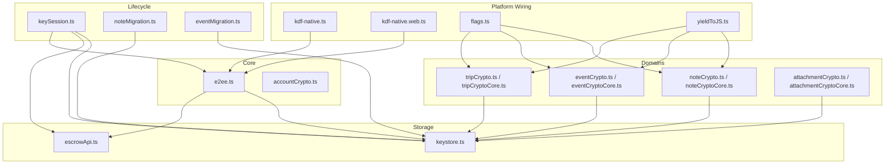

**Diagram sources**
- [e2ee.ts:1-228](file://src/crypto/e2ee.ts#L1-L228)
- [keystore.ts:1-53](file://src/crypto/keystore.ts#L1-L53)
- [kdf-native.ts:1-22](file://src/crypto/kdf-native.ts#L1-L22)
- [kdf-native.web.ts:1-16](file://src/crypto/kdf-native.web.ts#L1-L16)
- [keySession.ts:1-82](file://src/crypto/keySession.ts#L1-L82)
- [escrowApi.ts:1-39](file://src/crypto/escrowApi.ts#L1-L39)
- [noteCrypto.ts:1-93](file://src/crypto/noteCrypto.ts#L1-L93)
- [eventCrypto.ts:1-73](file://src/crypto/eventCrypto.ts#L1-L73)
- [tripCrypto.ts:1-72](file://src/crypto/tripCrypto.ts#L1-L72)
- [attachmentCrypto.ts:1-224](file://src/crypto/attachmentCrypto.ts#L1-L224)
- [accountCrypto.ts:1-47](file://src/crypto/accountCrypto.ts#L1-L47)
- [flags.ts:1-34](file://src/crypto/flags.ts#L1-L34)
- [yieldToJS.ts:1-9](file://src/crypto/yieldToJS.ts#L1-L9)
- [noteMigration.ts:1-87](file://src/crypto/noteMigration.ts#L1-L87)
- [eventMigration.ts:1-90](file://src/crypto/eventMigration.ts#L1-L90)

**Section sources**
- [e2ee.ts:1-228](file://src/crypto/e2ee.ts#L1-L228)
- [keystore.ts:1-53](file://src/crypto/keystore.ts#L1-L53)
- [kdf-native.ts:1-22](file://src/crypto/kdf-native.ts#L1-L22)
- [kdf-native.web.ts:1-16](file://src/crypto/kdf-native.web.ts#L1-L16)
- [keySession.ts:1-82](file://src/crypto/keySession.ts#L1-L82)
- [escrowApi.ts:1-39](file://src/crypto/escrowApi.ts#L1-L39)
- [noteCrypto.ts:1-93](file://src/crypto/noteCrypto.ts#L1-L93)
- [eventCrypto.ts:1-73](file://src/crypto/eventCrypto.ts#L1-L73)
- [tripCrypto.ts:1-72](file://src/crypto/tripCrypto.ts#L1-L72)
- [attachmentCrypto.ts:1-224](file://src/crypto/attachmentCrypto.ts#L1-L224)
- [accountCrypto.ts:1-47](file://src/crypto/accountCrypto.ts#L1-L47)
- [flags.ts:1-34](file://src/crypto/flags.ts#L1-L34)
- [yieldToJS.ts:1-9](file://src/crypto/yieldToJS.ts#L1-L9)
- [noteMigration.ts:1-87](file://src/crypto/noteMigration.ts#L1-L87)
- [eventMigration.ts:1-90](file://src/crypto/eventMigration.ts#L1-L90)

## Core Components
- DEK generation and usage: Random 32-byte keys used for AES-GCM encryption of domain fields.
- MK concept: The term “Master Key” corresponds to Key Encryption Keys (KEKs) derived from password or recovery code via PBKDF2. These KEKs wrap the DEK.
- Secure storage: DEK is persisted in the OS keystore via secure storage; not sent to the server.
- Escrow: Server stores wrapped DEKs under two KEKs (password-derived and recovery-derived), plus salts and KDF parameters.
- KDF wiring: Native PBKDF2 on React Native; pure-JS PBKDF2 fallback on web.
- Domain encryption: Notes, events, trips, attachments, and account name fields are encrypted per-field with versioned tokens.
- Lifecycle: Bootstrap at login, recover after password reset, rotate on authenticated password change, clear on logout.

Key responsibilities by file:
- e2ee.ts: DEK/MK (KEK) concepts, KDF interface, escrow bundle structure, wrap/unwrap, string encryption primitives.
- keystore.ts: In-process cache and secure storage for DEK.
- kdf-native.ts / kdf-native.web.ts: Platform-specific PBKDF2 implementation wired into e2ee core.
- keySession.ts: Login bootstrap, recovery, rewrap, logout.
- escrowApi.ts: Client for server-side escrow endpoints.
- note/event/trip crypto: Per-domain encryption boundaries and migration helpers.
- attachment crypto: Streaming chunk-based encryption for large files.
- account crypto: Decrypt account display name when needed.
- flags.ts: Feature gates for E2EE features and migrations.
- yieldToJS.ts: Performance helper to avoid UI stalls during bulk decryption.

**Section sources**
- [e2ee.ts:24-51](file://src/crypto/e2ee.ts#L24-L51)
- [e2ee.ts:127-158](file://src/crypto/e2ee.ts#L127-L158)
- [keystore.ts:1-53](file://src/crypto/keystore.ts#L1-L53)
- [kdf-native.ts:1-22](file://src/crypto/kdf-native.ts#L1-L22)
- [kdf-native.web.ts:1-16](file://src/crypto/kdf-native.web.ts#L1-L16)
- [keySession.ts:1-82](file://src/crypto/keySession.ts#L1-L82)
- [escrowApi.ts:1-39](file://src/crypto/escrowApi.ts#L1-L39)
- [noteCryptoCore.ts:1-158](file://src/crypto/noteCryptoCore.ts#L1-L158)
- [eventCryptoCore.ts:1-109](file://src/crypto/eventCryptoCore.ts#L1-L109)
- [tripCryptoCore.ts:1-97](file://src/crypto/tripCryptoCore.ts#L1-L97)
- [attachmentCryptoCore.ts:1-111](file://src/crypto/attachmentCryptoCore.ts#L1-L111)
- [accountCrypto.ts:1-47](file://src/crypto/accountCrypto.ts#L1-L47)
- [flags.ts:1-34](file://src/crypto/flags.ts#L1-L34)
- [yieldToJS.ts:1-9](file://src/crypto/yieldToJS.ts#L1-L9)

## Architecture Overview
The system separates concerns across layers:
- Portable core (e2ee.ts) defines algorithms, formats, and interfaces without platform dependencies.
- Platform wiring injects a fast PBKDF2 implementation (native on RN, JS on web).
- Device keystore persists the DEK securely.
- Escrow API manages server-side wrapped keys for backup and recovery.
- Domain modules apply encryption to specific data types with safe migration paths.
- Lifecycle module orchestrates login, recovery, rotation, and logout flows.

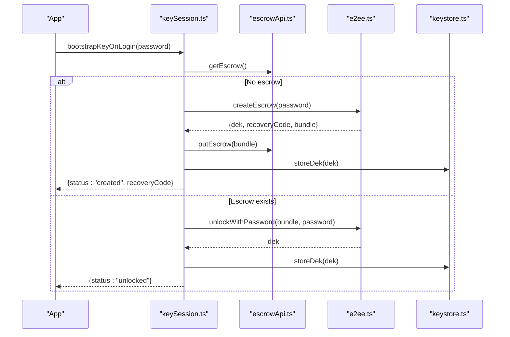

**Diagram sources**
- [keySession.ts:35-54](file://src/crypto/keySession.ts#L35-L54)
- [escrowApi.ts:21-28](file://src/crypto/escrowApi.ts#L21-L28)
- [e2ee.ts:179-207](file://src/crypto/e2ee.ts#L179-L207)
- [keystore.ts:30-42](file://src/crypto/keystore.ts#L30-L42)

**Section sources**
- [keySession.ts:1-82](file://src/crypto/keySession.ts#L1-L82)
- [escrowApi.ts:1-39](file://src/crypto/escrowApi.ts#L1-L39)
- [e2ee.ts:179-227](file://src/crypto/e2ee.ts#L179-L227)
- [keystore.ts:1-53](file://src/crypto/keystore.ts#L1-L53)

## Detailed Component Analysis

### DEK and MK (KEK) Architecture
- DEK: A random 32-byte key used for AES-GCM encryption of domain fields. Generated once per user session and stored in secure storage.
- MK (KEK): Two KEKs derived from password and recovery code via PBKDF2. Each wraps the DEK independently, enabling recovery without server involvement.
- EscrowBundle: Contains wrapped DEKs, salts, KDF algorithm and parameters, and encryption version.

Key operations:
- generateDek(): Creates a new DEK.
- deriveKek(): Derives a KEK from secret + salt + params using configured PBKDF2.
- wrapKey()/unwrapKey(): Encrypt/decrypt the DEK with a KEK.
- createEscrow(): Builds a fresh DEK and recovery code, derives both KEKs, wraps DEK, and returns bundle.
- unlockWithPassword()/unlockWithRecovery(): Recover DEK from either source.
- rewrapWithDek()/rewrapForNewPassword(): Rotate password KEK while preserving DEK.

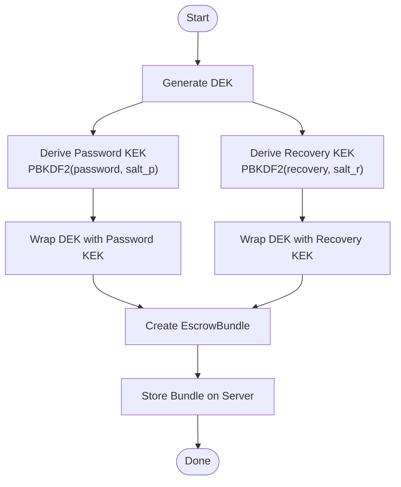

**Diagram sources**
- [e2ee.ts:127-158](file://src/crypto/e2ee.ts#L127-L158)
- [e2ee.ts:179-207](file://src/crypto/e2ee.ts#L179-L207)

**Section sources**
- [e2ee.ts:24-51](file://src/crypto/e2ee.ts#L24-L51)
- [e2ee.ts:127-158](file://src/crypto/e2ee.ts#L127-L158)
- [e2ee.ts:179-227](file://src/crypto/e2ee.ts#L179-L227)

### Secure Storage Mechanisms
- Device keystore: DEK is stored base64-encoded in the OS keystore via secure storage. Web builds do not persist DEK (no-op).
- In-process cache: Avoids repeated keystore reads within a single operation.
- Clearing: On logout or rotation, the cached DEK is invalidated and removed from secure storage.

Operational notes:
- loadDek(): Returns cached DEK if present, otherwise fetches from secure storage.
- storeDek(): Persists DEK and updates cache.
- clearDek(): Removes DEK from secure storage and clears cache.
- hasDek(): Checks presence of DEK.

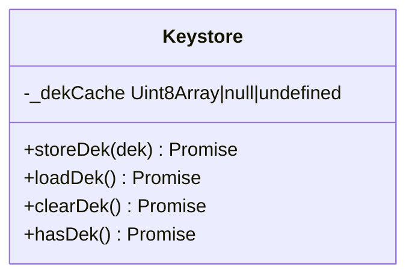

**Diagram sources**
- [keystore.ts:16-53](file://src/crypto/keystore.ts#L16-L53)

**Section sources**
- [keystore.ts:1-53](file://src/crypto/keystore.ts#L1-L53)

### Key Derivation Processes and Cross-Platform Compatibility
- Native path (React Native): Uses PBKDF2 via quick-crypto for high performance.
- Web fallback: Uses @noble PBKDF2 with SHA-256/SHA-512 based on configuration.
- Configuration: configureKdf() wires the chosen implementation once at app entry.

Behavior:
- DEFAULT_KDF uses PBKDF2-HMAC-SHA-512 with 600k iterations for strong security and acceptable performance on devices.
- deriveKek() enforces that KDF is configured before use.

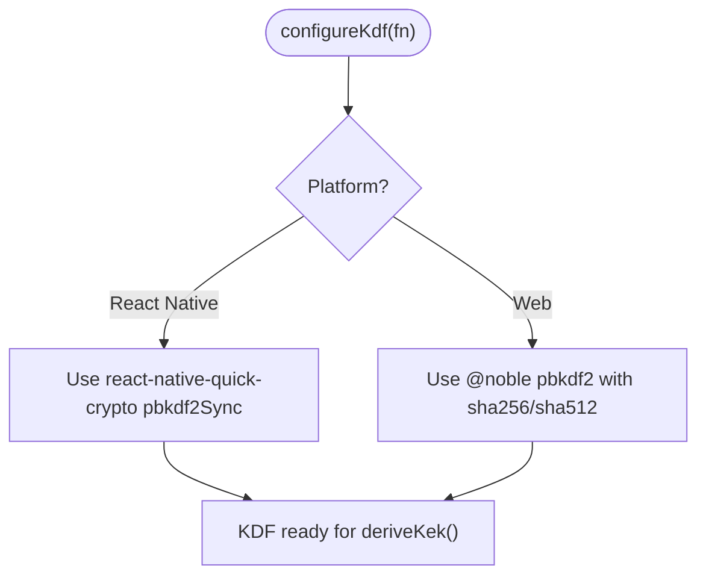

**Diagram sources**
- [kdf-native.ts:1-22](file://src/crypto/kdf-native.ts#L1-L22)
- [kdf-native.web.ts:1-16](file://src/crypto/kdf-native.web.ts#L1-L16)
- [e2ee.ts:136-150](file://src/crypto/e2ee.ts#L136-L150)

**Section sources**
- [kdf-native.ts:1-22](file://src/crypto/kdf-native.ts#L1-L22)
- [kdf-native.web.ts:1-16](file://src/crypto/kdf-native.web.ts#L1-L16)
- [e2ee.ts:36-41](file://src/crypto/e2ee.ts#L36-L41)
- [e2ee.ts:136-150](file://src/crypto/e2ee.ts#L136-L150)

### Backup and Recovery Procedures
- Backup: EscrowBundle is uploaded to the server containing wrapped DEKs and KDF metadata.
- Recovery: If password no longer works (e.g., email-reset scenario), use recovery code to unwrap DEK and rewrap under new password.
- Authenticated rotation: When user changes password while logged in, rewrap DEK under new password without exposing DEK to server.

Flow:
- bootstrapKeyOnLogin(): Attempts to unlock with password; if fails, signals needs_recovery.
- recoverKeyWithCode(): Unwraps DEK with recovery code, rewrites escrow with new password, stores DEK.
- rewrapDekForNewPassword(): Updates escrow with new password KEK using in-memory DEK.

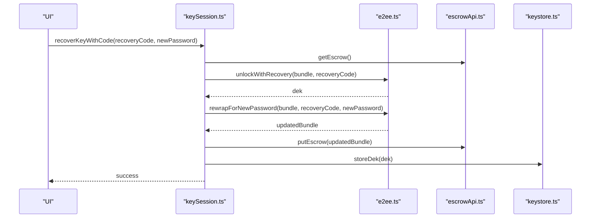

**Diagram sources**
- [keySession.ts:60-67](file://src/crypto/keySession.ts#L60-L67)
- [e2ee.ts:209-227](file://src/crypto/e2ee.ts#L209-L227)
- [escrowApi.ts:31-38](file://src/crypto/escrowApi.ts#L31-L38)
- [keystore.ts:30-42](file://src/crypto/keystore.ts#L30-L42)

**Section sources**
- [keySession.ts:35-77](file://src/crypto/keySession.ts#L35-L77)
- [e2ee.ts:204-227](file://src/crypto/e2ee.ts#L204-L227)
- [escrowApi.ts:21-38](file://src/crypto/escrowApi.ts#L21-L38)

### Key Rotation Strategies
- Password rotation (authenticated): rewrapDekForNewPassword() updates server escrow with new password KEK while keeping DEK unchanged.
- Password reset (recovery): recoverKeyWithCode() recovers DEK via recovery code and rewraps under new password.
- Logout: clearKeyOnLogout() removes DEK from secure storage.

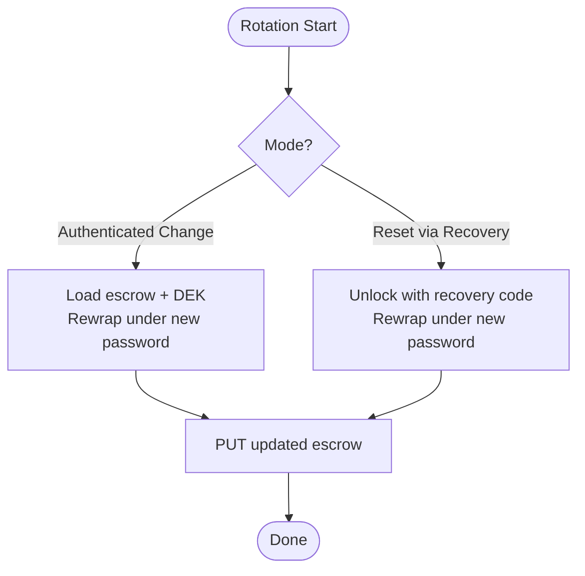

**Diagram sources**
- [keySession.ts:73-81](file://src/crypto/keySession.ts#L73-L81)
- [e2ee.ts:214-227](file://src/crypto/e2ee.ts#L214-L227)

**Section sources**
- [keySession.ts:73-81](file://src/crypto/keySession.ts#L73-L81)
- [e2ee.ts:214-227](file://src/crypto/e2ee.ts#L214-L227)

### Domain Encryption: Notes, Events, Trips, Attachments, Account
- Notes: Title, content, tag names, and attachment filenames are encrypted; color and other metadata remain plaintext for rendering/storage.
- Events: Title, description, location are encrypted; scheduling fields remain plaintext.
- Trips: Name and description are encrypted.
- Attachments: Large files are streamed and chunk-encrypted with AES-GCM, including AAD to prevent tampering and truncation.
- Account: Display name is decrypted on read when necessary.

Encryption properties:
- Versioned tokens ensure idempotent encryption and safe migration.
- Safe decrypt replaces failures with placeholders to avoid UI crashes.
- Bulk decryption yields to JS periodically to maintain responsiveness.

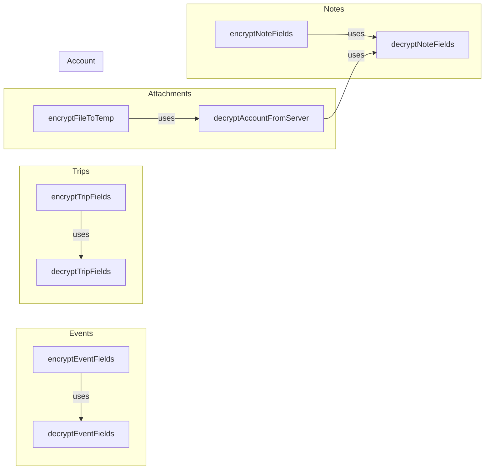

**Diagram sources**
- [noteCryptoCore.ts:65-127](file://src/crypto/noteCryptoCore.ts#L65-L127)
- [eventCryptoCore.ts:36-79](file://src/crypto/eventCryptoCore.ts#L36-L79)
- [tripCryptoCore.ts:32-67](file://src/crypto/tripCryptoCore.ts#L32-L67)
- [attachmentCrypto.ts:67-119](file://src/crypto/attachmentCrypto.ts#L67-L119)
- [attachmentCrypto.ts:128-224](file://src/crypto/attachmentCrypto.ts#L128-L224)
- [accountCrypto.ts:35-46](file://src/crypto/accountCrypto.ts#L35-L46)

**Section sources**
- [noteCryptoCore.ts:1-158](file://src/crypto/noteCryptoCore.ts#L1-L158)
- [eventCryptoCore.ts:1-109](file://src/crypto/eventCryptoCore.ts#L1-L109)
- [tripCryptoCore.ts:1-97](file://src/crypto/tripCryptoCore.ts#L1-L97)
- [attachmentCryptoCore.ts:1-111](file://src/crypto/attachmentCryptoCore.ts#L1-L111)
- [attachmentCrypto.ts:1-224](file://src/crypto/attachmentCrypto.ts#L1-L224)
- [accountCrypto.ts:1-47](file://src/crypto/accountCrypto.ts#L1-L47)

### Migration to Ciphertext
- One-time eager migration for notes and events converts legacy plaintext to ciphertext server-side.
- Gated by feature flag and requires DEK availability.
- Idempotent: Only processes items missing encryption version.
- Non-blocking: Best-effort with retries on next login; marks completion per user.

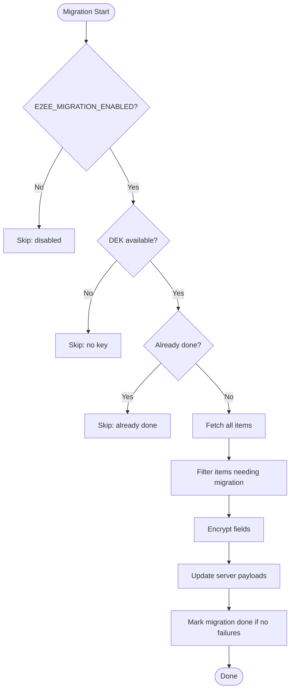

**Diagram sources**
- [noteMigration.ts:55-86](file://src/crypto/noteMigration.ts#L55-L86)
- [eventMigration.ts:58-88](file://src/crypto/eventMigration.ts#L58-L88)
- [flags.ts:17-24](file://src/crypto/flags.ts#L17-L24)

**Section sources**
- [noteMigration.ts:1-87](file://src/crypto/noteMigration.ts#L1-L87)
- [eventMigration.ts:1-90](file://src/crypto/eventMigration.ts#L1-L90)
- [flags.ts:17-24](file://src/crypto/flags.ts#L17-L24)

### Key Validation, Integrity Verification, and Secure Destruction
- Validation:
  - Ciphertext format includes version prefix; decrypt validates token structure and throws on malformed input.
  - Attachment frames include length prefixes and AAD binding index and finality to detect tampering and truncation.
- Integrity:
  - AES-GCM authentication tags verify integrity; any tamper causes decryption failure.
  - Attachment decryption tries both “not final” and “final” modes per frame; only one authenticates correctly.
- Secure destruction:
  - clearDek() deletes DEK from secure storage and invalidates in-process cache.
  - clearKeyOnLogout() calls clearDek() to remove DEK from device.

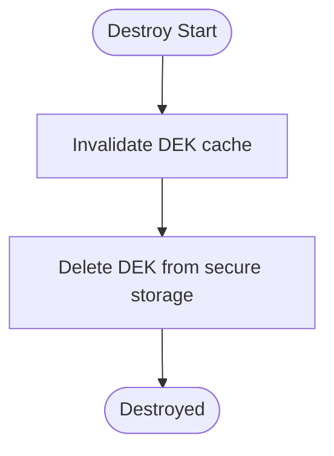

**Diagram sources**
- [keystore.ts:25-48](file://src/crypto/keystore.ts#L25-L48)
- [keySession.ts:79-81](file://src/crypto/keySession.ts#L79-L81)

**Section sources**
- [e2ee.ts:106-114](file://src/crypto/e2ee.ts#L106-L114)
- [attachmentCryptoCore.ts:71-105](file://src/crypto/attachmentCryptoCore.ts#L71-L105)
- [attachmentCrypto.ts:198-210](file://src/crypto/attachmentCrypto.ts#L198-L210)
- [keystore.ts:25-48](file://src/crypto/keystore.ts#L25-L48)
- [keySession.ts:79-81](file://src/crypto/keySession.ts#L79-L81)

### Examples of Key Operations and Error Handling Patterns
- Create escrow and store DEK on first login:
  - See bootstrapKeyOnLogin() flow and createEscrow().
- Unlock with password or recovery:
  - Use unlockWithPassword() and unlockWithRecovery(); errors indicate wrong secret.
- Rotate password:
  - Use rewrapWithDek() for authenticated changes; use recoverKeyWithCode() for resets.
- Encrypt/decrypt domain fields:
  - Use encryptNoteFields()/decryptNoteFields(), similar functions for events/trips.
- Stream attachment encryption/decryption:
  - Use encryptFileToTemp() and decryptFileToTemp() for large files.
- Error handling:
  - Malformed ciphertext or wrong key throws during unwrap/decrypt.
  - Decryption failures in lists return placeholders instead of crashing.
  - Migration failures are logged and retried on next login.

**Section sources**
- [keySession.ts:35-77](file://src/crypto/keySession.ts#L35-L77)
- [e2ee.ts:179-227](file://src/crypto/e2ee.ts#L179-L227)
- [noteCryptoCore.ts:65-127](file://src/crypto/noteCryptoCore.ts#L65-L127)
- [eventCryptoCore.ts:36-79](file://src/crypto/eventCryptoCore.ts#L36-L79)
- [tripCryptoCore.ts:32-67](file://src/crypto/tripCryptoCore.ts#L32-L67)
- [attachmentCrypto.ts:67-119](file://src/crypto/attachmentCrypto.ts#L67-L119)
- [attachmentCrypto.ts:128-224](file://src/crypto/attachmentCrypto.ts#L128-L224)
- [noteMigration.ts:55-86](file://src/crypto/noteMigration.ts#L55-L86)
- [eventMigration.ts:58-88](file://src/crypto/eventMigration.ts#L58-L88)

## Dependency Analysis
The system exhibits clear layering and minimal coupling:
- e2ee.ts depends on @noble libraries and exposes KDF interface.
- keystore.ts depends on secure storage and e2ee encoding utilities.
- kdf-native.ts/kdf-native.web.ts depend on e2ee to register KDF.
- keySession.ts depends on e2ee, escrowApi, and keystore.
- Domain modules depend on e2ee and keystore; they also use flags and yield helpers.
- Attachment crypto depends on e2ee primitives and streaming I/O.

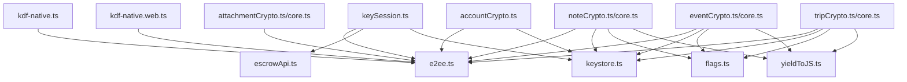

**Diagram sources**
- [e2ee.ts:136-150](file://src/crypto/e2ee.ts#L136-L150)
- [keystore.ts:1-53](file://src/crypto/keystore.ts#L1-L53)
- [kdf-native.ts:1-22](file://src/crypto/kdf-native.ts#L1-L22)
- [kdf-native.web.ts:1-16](file://src/crypto/kdf-native.web.ts#L1-L16)
- [keySession.ts:1-82](file://src/crypto/keySession.ts#L1-L82)
- [escrowApi.ts:1-39](file://src/crypto/escrowApi.ts#L1-L39)
- [noteCrypto.ts:1-93](file://src/crypto/noteCrypto.ts#L1-L93)
- [eventCrypto.ts:1-73](file://src/crypto/eventCrypto.ts#L1-L73)
- [tripCrypto.ts:1-72](file://src/crypto/tripCrypto.ts#L1-L72)
- [attachmentCrypto.ts:1-224](file://src/crypto/attachmentCrypto.ts#L1-L224)
- [accountCrypto.ts:1-47](file://src/crypto/accountCrypto.ts#L1-L47)
- [flags.ts:1-34](file://src/crypto/flags.ts#L1-L34)
- [yieldToJS.ts:1-9](file://src/crypto/yieldToJS.ts#L1-L9)

**Section sources**
- [e2ee.ts:136-150](file://src/crypto/e2ee.ts#L136-L150)
- [keystore.ts:1-53](file://src/crypto/keystore.ts#L1-L53)
- [kdf-native.ts:1-22](file://src/crypto/kdf-native.ts#L1-L22)
- [kdf-native.web.ts:1-16](file://src/crypto/kdf-native.web.ts#L1-L16)
- [keySession.ts:1-82](file://src/crypto/keySession.ts#L1-L82)
- [escrowApi.ts:1-39](file://src/crypto/escrowApi.ts#L1-L39)
- [noteCrypto.ts:1-93](file://src/crypto/noteCrypto.ts#L1-L93)
- [eventCrypto.ts:1-73](file://src/crypto/eventCrypto.ts#L1-L73)
- [tripCrypto.ts:1-72](file://src/crypto/tripCrypto.ts#L1-L72)
- [attachmentCrypto.ts:1-224](file://src/crypto/attachmentCrypto.ts#L1-L224)
- [accountCrypto.ts:1-47](file://src/crypto/accountCrypto.ts#L1-L47)
- [flags.ts:1-34](file://src/crypto/flags.ts#L1-L34)
- [yieldToJS.ts:1-9](file://src/crypto/yieldToJS.ts#L1-L9)

## Performance Considerations
- KDF performance: Native PBKDF2 reduces login time significantly compared to pure-JS; default iterations balance security and UX.
- Bulk decryption: Periodic yields break long loops to keep UI responsive.
- Attachment streaming: Chunked processing keeps memory usage bounded regardless of file size.
- Secure storage access: In-process caching avoids repeated keystore reads during a single operation.

[No sources needed since this section provides general guidance]

## Troubleshooting Guide
Common issues and resolutions:
- Wrong password or recovery code:
  - unlockWithPassword/unlockWithRecovery throw on mismatch; handle by prompting correct secret or recovery.
- Unsupported or malformed ciphertext:
  - decryptBytes checks version and token structure; fix by ensuring consistent encryption versions and avoiding corruption.
- Missing DEK:
  - On native, pushing plaintext while enc_version=1 is refused; wait for DEK availability or re-bootstrap.
- Migration failures:
  - Logged and retried on next login; ensure DEK is present and network connectivity is stable.
- Attachment truncation or tampering:
  - Decryption detects truncated or reordered chunks; re-download or verify integrity.

**Section sources**
- [e2ee.ts:106-114](file://src/crypto/e2ee.ts#L106-L114)
- [noteCrypto.ts:46-59](file://src/crypto/noteCrypto.ts#L46-L59)
- [eventCrypto.ts:37-48](file://src/crypto/eventCrypto.ts#L37-L48)
- [tripCrypto.ts:36-47](file://src/crypto/tripCrypto.ts#L36-L47)
- [attachmentCrypto.ts:198-210](file://src/crypto/attachmentCrypto.ts#L198-L210)
- [noteMigration.ts:68-83](file://src/crypto/noteMigration.ts#L68-L83)
- [eventMigration.ts:71-86](file://src/crypto/eventMigration.ts#L71-L86)

## Conclusion
The key management system implements a robust, cross-platform approach to securing user data:
- DEK is generated and stored securely on-device; MKs (KEKs) enable backup and recovery without server exposure.
- Native KDF optimization ensures acceptable performance on mobile devices, with a web fallback.
- Domain-specific encryption protects sensitive fields while maintaining functionality for non-sensitive metadata.
- Migration tools provide safe, idempotent conversion from plaintext to ciphertext.
- Strong integrity checks and graceful error handling protect against tampering and corruption.
- Rotation and secure destruction support lifecycle management aligned with user actions.

[No sources needed since this section summarizes without analyzing specific files]

## Appendices

### Appendix A: Key Types and Formats
- Encrypted string format: v{version}.{base64(nonce)}.{base64(ciphertext)}
- Attachment format: Header (magic + version) followed by frames (length + nonce + ciphertext+tag)
- EscrowBundle fields: wrapped_by_password, wrapped_by_recovery, kdf_salt, recovery_salt, kdf, kdf_params, enc_version

**Section sources**
- [e2ee.ts:24-51](file://src/crypto/e2ee.ts#L24-L51)
- [e2ee.ts:100-114](file://src/crypto/e2ee.ts#L100-L114)
- [attachmentCryptoCore.ts:13-25](file://src/crypto/attachmentCryptoCore.ts#L13-L25)

### Appendix B: Feature Flags
- E2EE_KEYS_ENABLED: Gates key bootstrap and recovery code presentation.
- E2EE_MIGRATION_ENABLED: Gates one-time migration of legacy data to ciphertext.
- DIAGNOSTICS_ENABLED: Gates dev-only diagnostic UI.

**Section sources**
- [flags.ts:1-34](file://src/crypto/flags.ts#L1-L34)