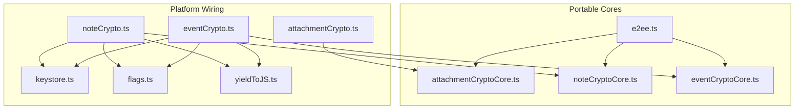
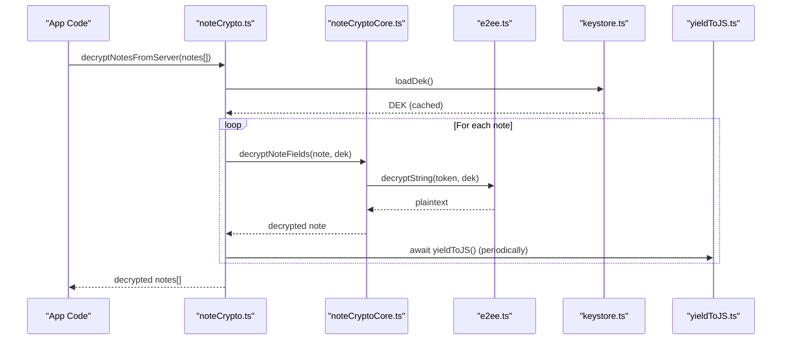
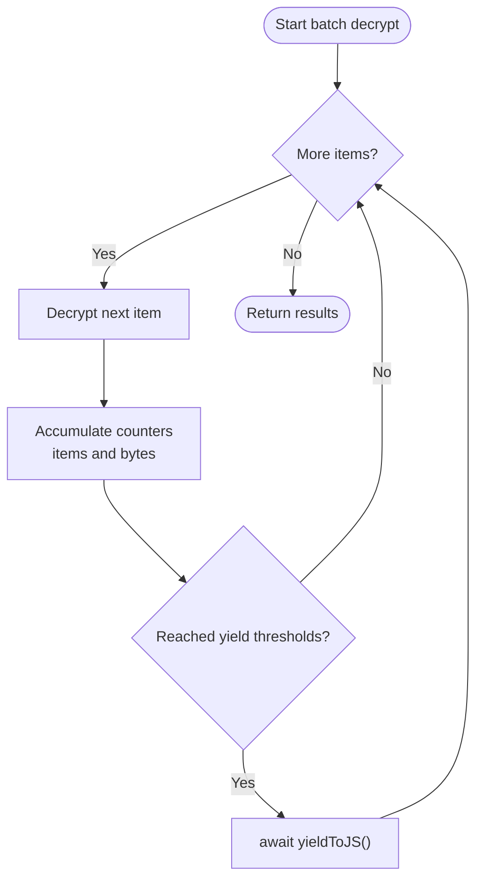
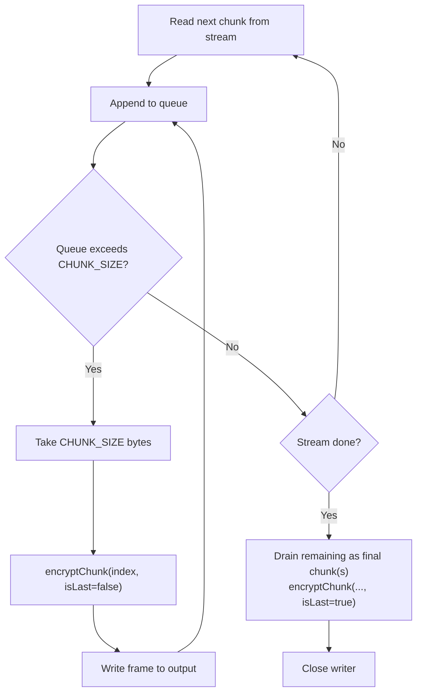
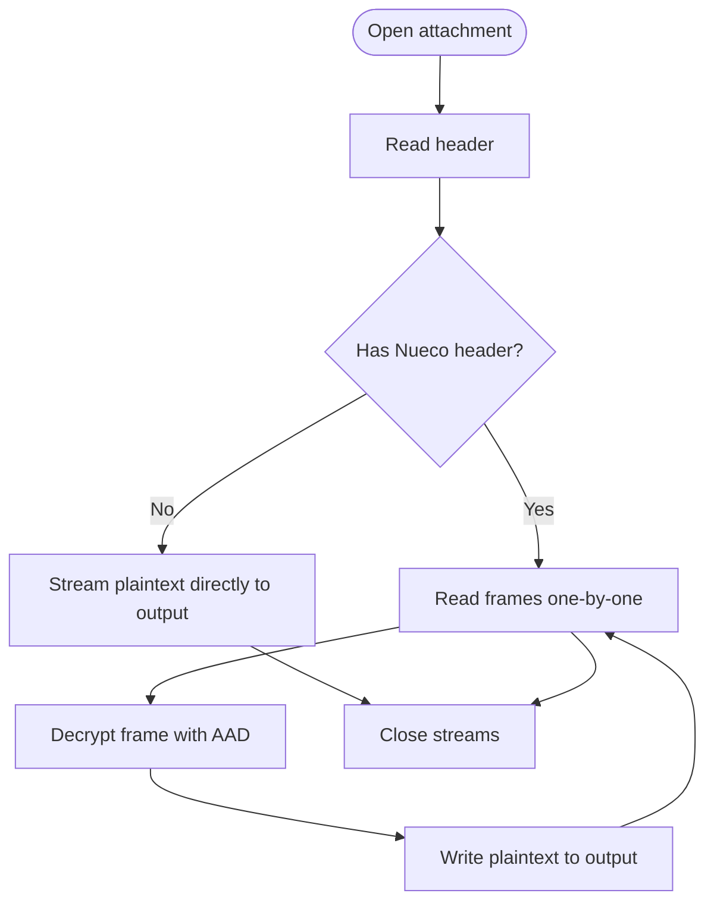
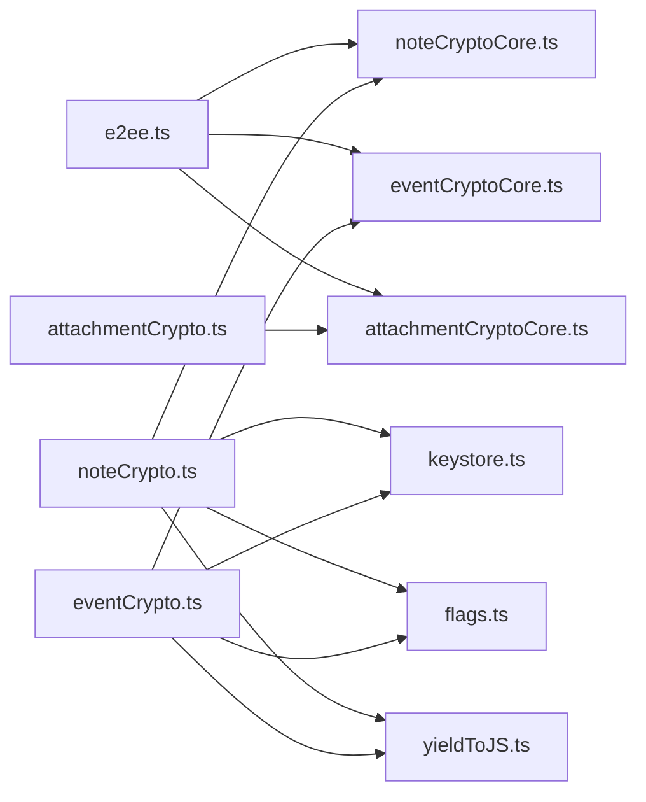

# Performance Optimization

<cite>
**Referenced Files in This Document**
- [yieldToJS.ts](file://src/crypto/yieldToJS.ts)
- [e2ee.ts](file://src/crypto/e2ee.ts)
- [attachmentCryptoCore.ts](file://src/crypto/attachmentCryptoCore.ts)
- [attachmentCrypto.ts](file://src/crypto/attachmentCrypto.ts)
- [noteCryptoCore.ts](file://src/crypto/noteCryptoCore.ts)
- [noteCrypto.ts](file://src/crypto/noteCrypto.ts)
- [eventCryptoCore.ts](file://src/crypto/eventCryptoCore.ts)
- [eventCrypto.ts](file://src/crypto/eventCrypto.ts)
- [keystore.ts](file://src/crypto/keystore.ts)
- [flags.ts](file://src/crypto/flags.ts)
</cite>

## Table of Contents
1. [Introduction](#introduction)
2. [Project Structure](#project-structure)
3. [Core Components](#core-components)
4. [Architecture Overview](#architecture-overview)
5. [Detailed Component Analysis](#detailed-component-analysis)
6. [Dependency Analysis](#dependency-analysis)
7. [Performance Considerations](#performance-considerations)
8. [Troubleshooting Guide](#troubleshooting-guide)
9. [Conclusion](#conclusion)
10. [Appendices](#appendices)

## Introduction
This document explains the performance optimization strategies implemented in the encryption engine to keep the UI responsive during large-scale decryption and to minimize memory pressure on resource-constrained devices. It covers:
- Yield-to-JavaScript scheduling to prevent UI blocking
- Chunked processing for large attachments
- Batch operation optimizations for notes and events
- Memory management techniques and resource cleanup
- Caching strategies for keys and derived data
- Guidance for optimizing operations across different data sizes and platforms

## Project Structure
The encryption subsystem is split into portable cores (pure crypto logic) and platform wiring modules that integrate with storage, flags, and device capabilities. The key files are:
- Core primitives and KDF configuration: e2ee.ts
- Attachment streaming and chunking: attachmentCryptoCore.ts and attachmentCrypto.ts
- Note field encryption: noteCryptoCore.ts and noteCrypto.ts
- Event field encryption: eventCryptoCore.ts and eventCrypto.ts
- Key caching and lifecycle: keystore.ts
- Feature flags: flags.ts
- Yield helper: yieldToJS.ts



**Diagram sources**
- [e2ee.ts:1-228](file://src/crypto/e2ee.ts#L1-L228)
- [attachmentCryptoCore.ts:1-111](file://src/crypto/attachmentCryptoCore.ts#L1-L111)
- [attachmentCrypto.ts:1-224](file://src/crypto/attachmentCrypto.ts#L1-L224)
- [noteCryptoCore.ts:1-158](file://src/crypto/noteCryptoCore.ts#L1-L158)
- [noteCrypto.ts:1-93](file://src/crypto/noteCrypto.ts#L1-L93)
- [eventCryptoCore.ts:1-109](file://src/crypto/eventCryptoCore.ts#L1-L109)
- [eventCrypto.ts:1-73](file://src/crypto/eventCrypto.ts#L1-L73)
- [keystore.ts:1-53](file://src/crypto/keystore.ts#L1-L53)
- [flags.ts:1-34](file://src/crypto/flags.ts#L1-L34)
- [yieldToJS.ts:1-9](file://src/crypto/yieldToJS.ts#L1-L9)

**Section sources**
- [e2ee.ts:1-228](file://src/crypto/e2ee.ts#L1-L228)
- [attachmentCryptoCore.ts:1-111](file://src/crypto/attachmentCryptoCore.ts#L1-L111)
- [attachmentCrypto.ts:1-224](file://src/crypto/attachmentCrypto.ts#L1-L224)
- [noteCryptoCore.ts:1-158](file://src/crypto/noteCryptoCore.ts#L1-L158)
- [noteCrypto.ts:1-93](file://src/crypto/noteCrypto.ts#L1-L93)
- [eventCryptoCore.ts:1-109](file://src/crypto/eventCryptoCore.ts#L1-L109)
- [eventCrypto.ts:1-73](file://src/crypto/eventCrypto.ts#L1-L73)
- [keystore.ts:1-53](file://src/crypto/keystore.ts#L1-L53)
- [flags.ts:1-34](file://src/crypto/flags.ts#L1-L34)
- [yieldToJS.ts:1-9](file://src/crypto/yieldToJS.ts#L1-L9)

## Core Components
- AES-GCM authenticated encryption and base64 helpers: e2ee.ts
- Chunked attachment format and per-chunk auth via AAD: attachmentCryptoCore.ts
- Streaming file encrypt/decrypt with bounded memory: attachmentCrypto.ts
- Note field encryption/decryption with safe fallbacks: noteCryptoCore.ts
- Note boundary with batch yields and byte-based throttling: noteCrypto.ts
- Event field encryption/decryption with batch yields: eventCryptoCore.ts
- Event boundary with batch yields: eventCrypto.ts
- In-process DEK cache to avoid repeated SecureStore reads: keystore.ts
- Feature flags gating encryption features: flags.ts
- Yield helper to break long loops into microtasks: yieldToJS.ts

Key performance characteristics:
- Chunk size for attachments is fixed at 1 MiB to balance overhead and memory footprint.
- Batch decryption yields every ~25 items or after a threshold of bytes processed to keep UI responsive.
- DEK is cached in process memory to reduce native keystore calls.

**Section sources**
- [e2ee.ts:21-158](file://src/crypto/e2ee.ts#L21-L158)
- [attachmentCryptoCore.ts:31-48](file://src/crypto/attachmentCryptoCore.ts#L31-L48)
- [attachmentCrypto.ts:67-119](file://src/crypto/attachmentCrypto.ts#L67-L119)
- [noteCryptoCore.ts:65-127](file://src/crypto/noteCryptoCore.ts#L65-L127)
- [noteCrypto.ts:21-31](file://src/crypto/noteCrypto.ts#L21-L31)
- [eventCryptoCore.ts:36-79](file://src/crypto/eventCryptoCore.ts#L36-L79)
- [eventCrypto.ts:22-72](file://src/crypto/eventCrypto.ts#L22-L72)
- [keystore.ts:16-41](file://src/crypto/keystore.ts#L16-L41)
- [flags.ts:1-34](file://src/crypto/flags.ts#L1-L34)
- [yieldToJS.ts:1-9](file://src/crypto/yieldToJS.ts#L1-L9)

## Architecture Overview
The architecture separates pure cryptographic logic from platform-specific concerns. Platform boundaries handle:
- Loading/storing the DEK securely
- Applying feature flags
- Scheduling yields to keep the UI responsive
- Streaming I/O for large attachments



**Diagram sources**
- [noteCrypto.ts:74-92](file://src/crypto/noteCrypto.ts#L74-L92)
- [noteCryptoCore.ts:104-127](file://src/crypto/noteCryptoCore.ts#L104-L127)
- [e2ee.ts:106-124](file://src/crypto/e2ee.ts#L106-L124)
- [keystore.ts:36-41](file://src/crypto/keystore.ts#L36-L41)
- [yieldToJS.ts:6-8](file://src/crypto/yieldToJS.ts#L6-L8)

## Detailed Component Analysis

### Yield-to-JavaScript Mechanism
- Purpose: Break up synchronous work so the JS event loop can handle touch and animations.
- Implementation: A simple Promise-based yield using setTimeout(0).
- Usage:
  - Notes: yields every 25 notes or after accumulating 128 KiB of content bytes.
  - Events: yields every 25 events.



**Diagram sources**
- [noteCrypto.ts:74-92](file://src/crypto/noteCrypto.ts#L74-L92)
- [eventCrypto.ts:63-72](file://src/crypto/eventCrypto.ts#L63-L72)
- [yieldToJS.ts:6-8](file://src/crypto/yieldToJS.ts#L6-L8)

**Section sources**
- [yieldToJS.ts:1-9](file://src/crypto/yieldToJS.ts#L1-L9)
- [noteCrypto.ts:21-31](file://src/crypto/noteCrypto.ts#L21-L31)
- [eventCrypto.ts:22-72](file://src/crypto/eventCrypto.ts#L22-L72)

### Chunked Processing for Large Attachments
- Strategy: Stream file bytes and encrypt/decrypt in 1 MiB chunks to bound peak memory regardless of file size.
- Format: Header + frames; each frame includes length prefix, nonce, ciphertext, and GCM tag.
- Security: Each chunk’s index and “isLast” flag are bound via AES-GCM Additional Authenticated Data (AAD), preventing reordering, duplication, or truncation attacks.
- Streaming details:
  - Encryption writes header then frames as they become available; final frame is correctly marked even when file size is an exact multiple of chunk size.
  - Decryption reads headers and frames incrementally, supports legacy plaintext passthrough, and validates integrity per frame.



**Diagram sources**
- [attachmentCrypto.ts:67-119](file://src/crypto/attachmentCrypto.ts#L67-L119)
- [attachmentCryptoCore.ts:71-105](file://src/crypto/attachmentCryptoCore.ts#L71-L105)

**Section sources**
- [attachmentCryptoCore.ts:1-48](file://src/crypto/attachmentCryptoCore.ts#L1-L48)
- [attachmentCryptoCore.ts:71-111](file://src/crypto/attachmentCryptoCore.ts#L71-L111)
- [attachmentCrypto.ts:67-119](file://src/crypto/attachmentCrypto.ts#L67-L119)
- [attachmentCrypto.ts:128-224](file://src/crypto/attachmentCrypto.ts#L128-L224)

### Batch Operation Optimizations for Notes and Events
- Notes:
  - Yields based on both item count and accumulated content bytes to account for heavy payloads (e.g., inline images).
  - Safe decryption replaces corrupt fields with a placeholder instead of failing the entire list.
- Events:
  - Yields every fixed number of events to keep UI responsive during bulk sync.

```mermaid
sequenceDiagram
participant Sync as "Sync Layer"
participant Note as "noteCrypto.ts"
participant Core as "noteCryptoCore.ts"
participant Store as "keystore.ts"
Sync->>Note : decryptNotesFromServer(notes[])
Note->>Store : loadDek()
loop For each note
Note->>Core : decryptNoteFields(note, dek)
Core-->>Note : decrypted note
Note->>Note : update counters (items, bytes)
alt Threshold reached
Note->>Note : await yieldToJS()
end
end
Note-->>Sync : decrypted notes[]
```

**Diagram sources**
- [noteCrypto.ts:74-92](file://src/crypto/noteCrypto.ts#L74-L92)
- [noteCryptoCore.ts:104-127](file://src/crypto/noteCryptoCore.ts#L104-L127)
- [keystore.ts:36-41](file://src/crypto/keystore.ts#L36-L41)

**Section sources**
- [noteCrypto.ts:21-31](file://src/crypto/noteCrypto.ts#L21-L31)
- [noteCrypto.ts:74-92](file://src/crypto/noteCrypto.ts#L74-L92)
- [eventCrypto.ts:63-72](file://src/crypto/eventCrypto.ts#L63-L72)

### Memory Management Techniques
- Attachment streaming:
  - Bounded by CHUNK_SIZE (1 MiB) rather than file size, avoiding OOM on mid-range Android devices.
  - Uses readable/writable streams and temporary files in cache directory.
  - Ensures reader locks are released and temp files deleted on errors.
- Plaintext vs ciphertext handling:
  - Legacy plaintext attachments are passed through without loading entirely into memory.
- Key caching:
  - DEK is memoized in process memory to avoid repeated SecureStore reads per operation.



**Diagram sources**
- [attachmentCrypto.ts:128-224](file://src/crypto/attachmentCrypto.ts#L128-L224)
- [attachmentCryptoCore.ts:50-69](file://src/crypto/attachmentCryptoCore.ts#L50-L69)

**Section sources**
- [attachmentCrypto.ts:1-12](file://src/crypto/attachmentCrypto.ts#L1-L12)
- [attachmentCrypto.ts:67-119](file://src/crypto/attachmentCrypto.ts#L67-L119)
- [attachmentCrypto.ts:128-224](file://src/crypto/attachmentCrypto.ts#L128-L224)
- [keystore.ts:16-41](file://src/crypto/keystore.ts#L16-L41)

### Resource Cleanup Procedures
- Streams:
  - Reader locks are released in finally blocks.
  - Writers are aborted on errors.
- Temporary files:
  - Unique temp filenames are generated and deleted on error paths.
- Key cache invalidation:
  - Explicit function to clear in-process DEK cache on sign-out or key rotation.

**Section sources**
- [attachmentCrypto.ts:112-118](file://src/crypto/attachmentCrypto.ts#L112-L118)
- [attachmentCrypto.ts:216-222](file://src/crypto/attachmentCrypto.ts#L216-L222)
- [keystore.ts:25-28](file://src/crypto/keystore.ts#L25-L28)

### Caching Strategies
- DEK cache:
  - In-process memoization avoids repeated native keystore reads within a single session.
  - Cache invalidated on logout or key rotation.
- Migration guards:
  - Already-encrypted payloads are skipped to avoid redundant work.

**Section sources**
- [keystore.ts:16-41](file://src/crypto/keystore.ts#L16-L41)
- [noteCryptoCore.ts:65-69](file://src/crypto/noteCryptoCore.ts#L65-L69)
- [eventCryptoCore.ts:36-40](file://src/crypto/eventCryptoCore.ts#L36-L40)

### Lazy Loading Patterns
- Notes and events:
  - Decryption occurs only when needed; if no DEK is present, payloads pass through unchanged, deferring work until keys are available.
- Attachments:
  - Streaming ensures data is processed lazily as it is read, not loaded all at once.

**Section sources**
- [noteCrypto.ts:68-72](file://src/crypto/noteCrypto.ts#L68-L72)
- [eventCrypto.ts:57-61](file://src/crypto/eventCrypto.ts#L57-L61)
- [attachmentCrypto.ts:128-177](file://src/crypto/attachmentCrypto.ts#L128-L177)

## Dependency Analysis
The components have clear separation between core crypto and platform wiring:
- e2ee.ts provides primitives used by all other modules.
- attachmentCryptoCore.ts defines the chunked format and per-chunk auth.
- noteCryptoCore.ts and eventCryptoCore.ts depend on e2ee.ts and provide domain-specific encryption/decryption.
- noteCrypto.ts and eventCrypto.ts add platform behavior (flags, keystore, yields).
- attachmentCrypto.ts depends on attachmentCryptoCore.ts and handles streaming I/O.
- keystore.ts supplies DEK access with in-process caching.
- flags.ts gates features at build time.



**Diagram sources**
- [e2ee.ts:21-158](file://src/crypto/e2ee.ts#L21-L158)
- [noteCryptoCore.ts:1-158](file://src/crypto/noteCryptoCore.ts#L1-L158)
- [eventCryptoCore.ts:1-109](file://src/crypto/eventCryptoCore.ts#L1-L109)
- [attachmentCryptoCore.ts:1-111](file://src/crypto/attachmentCryptoCore.ts#L1-L111)
- [noteCrypto.ts:1-93](file://src/crypto/noteCrypto.ts#L1-L93)
- [eventCrypto.ts:1-73](file://src/crypto/eventCrypto.ts#L1-L73)
- [attachmentCrypto.ts:1-224](file://src/crypto/attachmentCrypto.ts#L1-L224)
- [keystore.ts:1-53](file://src/crypto/keystore.ts#L1-L53)
- [flags.ts:1-34](file://src/crypto/flags.ts#L1-L34)
- [yieldToJS.ts:1-9](file://src/crypto/yieldToJS.ts#L1-L9)

**Section sources**
- [e2ee.ts:21-158](file://src/crypto/e2ee.ts#L21-L158)
- [noteCryptoCore.ts:1-158](file://src/crypto/noteCryptoCore.ts#L1-L158)
- [eventCryptoCore.ts:1-109](file://src/crypto/eventCryptoCore.ts#L1-L109)
- [attachmentCryptoCore.ts:1-111](file://src/crypto/attachmentCryptoCore.ts#L1-L111)
- [noteCrypto.ts:1-93](file://src/crypto/noteCrypto.ts#L1-L93)
- [eventCrypto.ts:1-73](file://src/crypto/eventCrypto.ts#L1-L73)
- [attachmentCrypto.ts:1-224](file://src/crypto/attachmentCrypto.ts#L1-L224)
- [keystore.ts:1-53](file://src/crypto/keystore.ts#L1-L53)
- [flags.ts:1-34](file://src/crypto/flags.ts#L1-L34)
- [yieldToJS.ts:1-9](file://src/crypto/yieldToJS.ts#L1-L9)

## Performance Considerations
- Yield scheduling:
  - Use item-count and byte-threshold triggers to ensure consistent responsiveness under varying payload sizes.
  - For notes, combine both metrics to avoid stalls caused by large inline images.
- Chunk sizing:
  - 1 MiB chunks balance low per-frame overhead (~0.003% growth) against memory usage.
  - Adjust chunk size only if profiling shows a different bottleneck on target devices.
- Streaming I/O:
  - Always prefer streaming for attachments to keep peak memory proportional to chunk size.
  - Validate headers early to short-circuit legacy plaintext passthrough.
- Key access:
  - Rely on in-process DEK cache to minimize native keystore round-trips.
  - Invalidate cache on logout or key rotation to maintain correctness.
- Error resilience:
  - Replace undecryptable fields with placeholders to avoid crashing lists.
  - Ensure streams are closed and temp files cleaned up on errors.

[No sources needed since this section provides general guidance]

## Troubleshooting Guide
Common issues and remedies:
- UI freezes during bulk decryption:
  - Verify yields are triggered appropriately (item count and bytes for notes).
  - Check that batch functions return promises and are awaited.
- Out-of-memory errors on large attachments:
  - Confirm streaming path is used and chunk size is appropriate.
  - Ensure readers/writers are properly closed and temp files deleted.
- Wrong key or tampered data:
  - Decryption will throw or produce placeholders; inspect logs around decryptChunk and decryptString.
- Unexpected plaintext pushes:
  - On native, pushing plaintext while server holds enc_version=1 is refused; ensure DEK is loaded before push.

**Section sources**
- [noteCrypto.ts:46-60](file://src/crypto/noteCrypto.ts#L46-L60)
- [eventCrypto.ts:37-49](file://src/crypto/eventCrypto.ts#L37-L49)
- [attachmentCrypto.ts:112-118](file://src/crypto/attachmentCrypto.ts#L112-L118)
- [attachmentCrypto.ts:216-222](file://src/crypto/attachmentCrypto.ts#L216-L222)
- [noteCryptoCore.ts:147-157](file://src/crypto/noteCryptoCore.ts#L147-L157)
- [eventCryptoCore.ts:99-108](file://src/crypto/eventCryptoCore.ts#L99-L108)

## Conclusion
The encryption engine employs several targeted performance optimizations to keep the app responsive and memory-efficient:
- Yield-to-JavaScript scheduling prevents UI blocking during large batches.
- Chunked streaming bounds memory usage for large attachments.
- Batch thresholds adapt to payload sizes to maintain consistent UX.
- In-process key caching reduces native overhead.
- Robust error handling and resource cleanup ensure stability.

These patterns provide a solid foundation for scaling encryption/decryption across diverse data sizes and platform constraints.

[No sources needed since this section summarizes without analyzing specific files]

## Appendices

### Optimization Guidelines by Data Size and Platform
- Small payloads (text-only notes/events):
  - Standard batch yields suffice; focus on minimizing redundant work via migration guards.
- Medium payloads (notes with small images):
  - Rely on byte-threshold yields to prevent stalls; consider reducing chunk size if memory spikes occur.
- Large payloads (videos/large attachments):
  - Always use streaming; validate headers early; ensure proper cleanup on errors.
- Platform constraints:
  - Native: leverage secure store caching; be mindful of keystore latency.
  - Web: E2EE is disabled; ensure graceful fallbacks and no-op paths.

[No sources needed since this section provides general guidance]