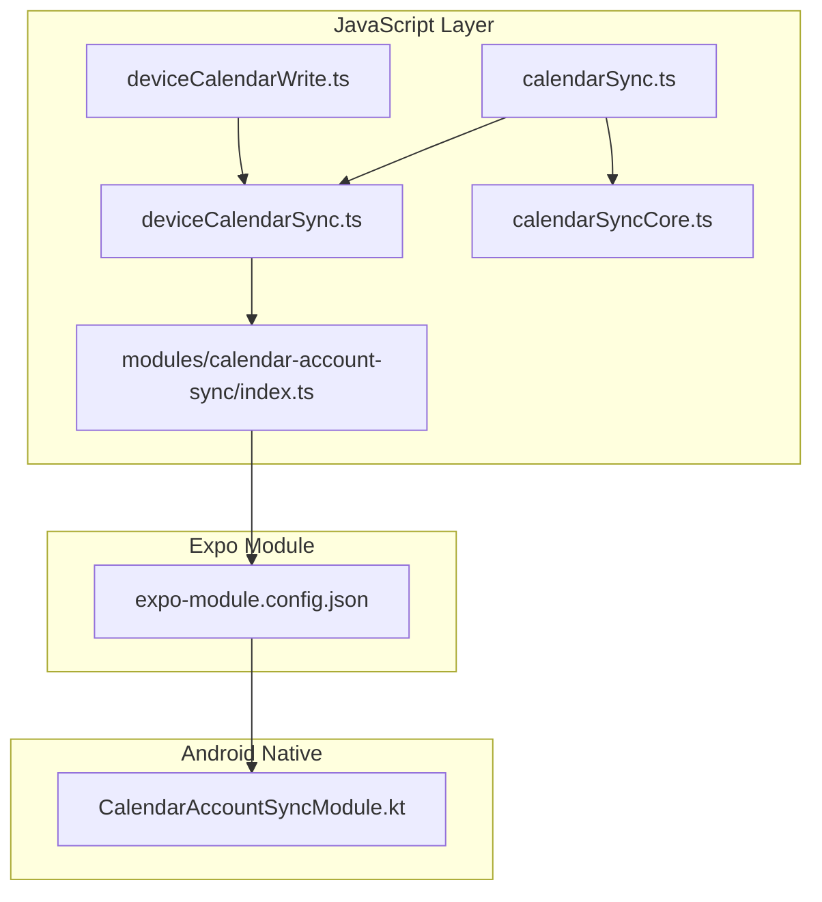
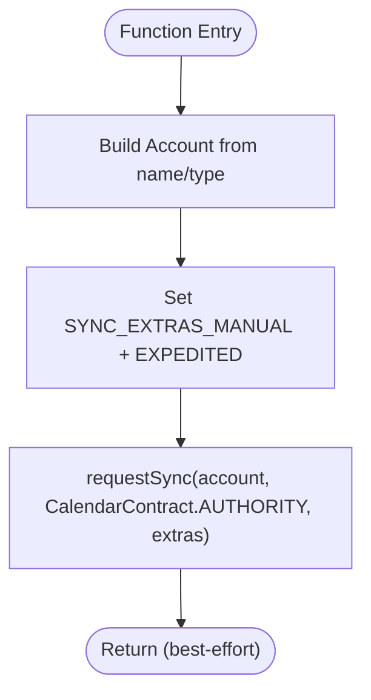
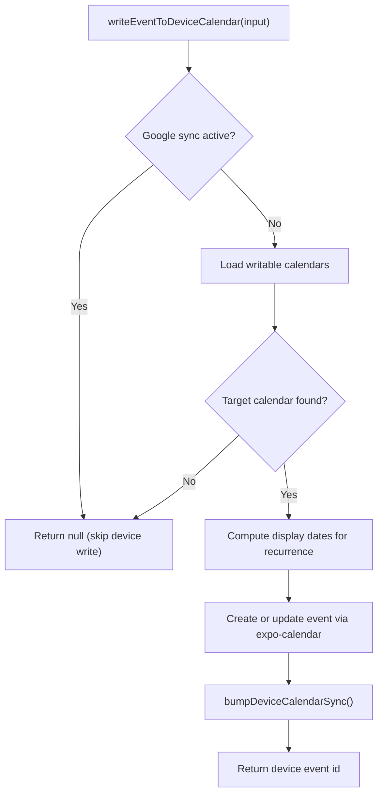
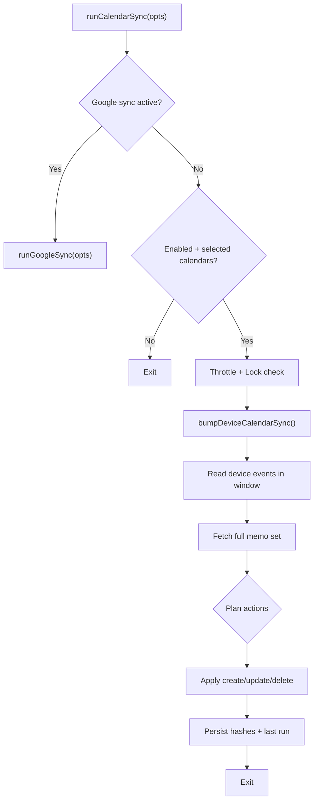
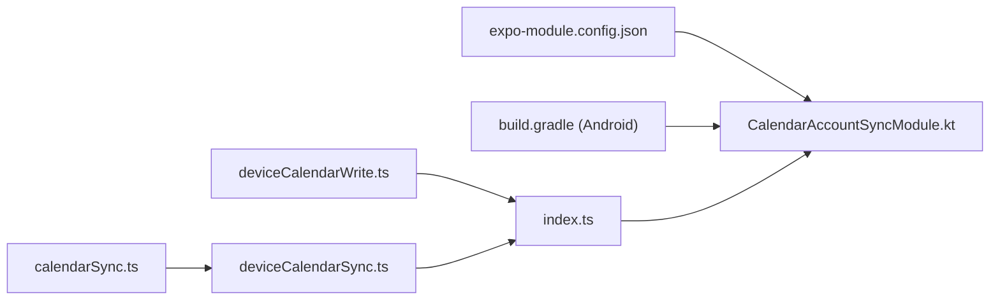

# Android Implementation

<cite>
**Referenced Files in This Document**
- [CalendarAccountSyncModule.kt](file://modules/calendar-account-sync/android/src/main/java/expo/modules/calendaraccountsync/CalendarAccountSyncModule.kt)
- [build.gradle (Android module)](file://modules/calendar-account-sync/android/build.gradle)
- [expo-module.config.json](file://modules/calendar-account-sync/expo-module.config.json)
- [index.ts (JS bridge)](file://modules/calendar-account-sync/index.ts)
- [deviceCalendarSync.ts](file://src/deviceCalendarSync.ts)
- [deviceCalendarWrite.ts](file://src/deviceCalendarWrite.ts)
- [calendarSync.ts](file://src/calendarSync.ts)
- [calendarSyncCore.ts](file://src/calendarSyncCore.ts)
- [app.config.js](file://app.config.js)
- [package.json](file://package.json)
</cite>

## Table of Contents
1. [Introduction](#introduction)
2. [Project Structure](#project-structure)
3. [Core Components](#core-components)
4. [Architecture Overview](#architecture-overview)
5. [Detailed Component Analysis](#detailed-component-analysis)
6. [Dependency Analysis](#dependency-analysis)
7. [Performance Considerations](#performance-considerations)
8. [Troubleshooting Guide](#troubleshooting-guide)
9. [Conclusion](#conclusion)
10. [Appendices](#appendices)

## Introduction
This document explains the Android native implementation for calendar synchronization in the project. It focuses on the CalendarAccountSyncModule, its exposure to JavaScript via Expo Modules, and how it integrates with Android’s AccountManager and SyncAdapter through ContentResolver.requestSync. It also covers the surrounding TypeScript logic that triggers sync nudges after device calendar writes, periodic refresh of recurring events, and background/foreground sync orchestration. Build configuration, dependency management, debugging techniques, and extension patterns are included to help you extend and maintain the module safely across Android versions.

## Project Structure
The calendar sync feature spans a small Android native module and several TypeScript modules:
- Native Android module: exposes a single function to request an immediate sync for a given account.
- JS bridge: provides a safe, best-effort wrapper to call the native function only on Android when available.
- Device calendar integration: writes events to the device calendar and triggers a “nudge” to speed up server-side propagation.
- Sync orchestration: runs periodic or foreground syncs, plans create/update/delete actions, and persists state.



**Diagram sources**
- [deviceCalendarSync.ts:17-30](file://src/deviceCalendarSync.ts#L17-L30)
- [deviceCalendarWrite.ts:68-145](file://src/deviceCalendarWrite.ts#L68-L145)
- [calendarSync.ts:102-199](file://src/calendarSync.ts#L102-L199)
- [calendarSyncCore.ts:87-149](file://src/calendarSyncCore.ts#L87-L149)
- [index.ts:1-16](file://modules/calendar-account-sync/index.ts#L1-L16)
- [expo-module.config.json:1-7](file://modules/calendar-account-sync/expo-module.config.json#L1-L7)
- [CalendarAccountSyncModule.kt:14-30](file://modules/calendar-account-sync/android/src/main/java/expo/modules/calendaraccountsync/CalendarAccountSyncModule.kt#L14-L30)

**Section sources**
- [CalendarAccountSyncModule.kt:14-30](file://modules/calendar-account-sync/android/src/main/java/expo/modules/calendaraccountsync/CalendarAccountSyncModule.kt#L14-L30)
- [index.ts:1-16](file://modules/calendar-account-sync/index.ts#L1-L16)
- [deviceCalendarSync.ts:17-30](file://src/deviceCalendarSync.ts#L17-L30)
- [deviceCalendarWrite.ts:68-145](file://src/deviceCalendarWrite.ts#L68-L145)
- [calendarSync.ts:102-199](file://src/calendarSync.ts#L102-L199)
- [calendarSyncCore.ts:87-149](file://src/calendarSyncCore.ts#L87-L149)
- [expo-module.config.json:1-7](file://modules/calendar-account-sync/expo-module.config.json#L1-L7)

## Core Components
- CalendarAccountSyncModule (Kotlin): Exposes a single function to request an expedited manual sync for a specific calendar account using ContentResolver.requestSync against CalendarContract.AUTHORITY. Errors are intentionally swallowed to keep this a best-effort performance nudge.
- JS Bridge (index.ts): Safely requires the native module only on Android and calls requestSync with account name and type. No-op on iOS/web or when unavailable.
- Device Calendar Write (deviceCalendarWrite.ts): Creates or updates events on the device calendar and then triggers a sync nudge to accelerate server propagation.
- Device Calendar Sync Nudge (deviceCalendarSync.ts): Enumerates non-local calendars and requests a sync per account; also periodically refreshes recurring event occurrences on the device calendar and nudges sync afterward.
- Sync Orchestration (calendarSync.ts + calendarSyncCore.ts): Runs periodic or forced syncs, reads device events, plans changes, and applies them to the backend while persisting hashes and throttling state.

**Section sources**
- [CalendarAccountSyncModule.kt:14-30](file://modules/calendar-account-sync/android/src/main/java/expo/modules/calendaraccountsync/CalendarAccountSyncModule.kt#L14-L30)
- [index.ts:1-16](file://modules/calendar-account-sync/index.ts#L1-L16)
- [deviceCalendarWrite.ts:68-145](file://src/deviceCalendarWrite.ts#L68-L145)
- [deviceCalendarSync.ts:17-30](file://src/deviceCalendarSync.ts#L17-L30)
- [calendarSync.ts:102-199](file://src/calendarSync.ts#L102-L199)
- [calendarSyncCore.ts:87-149](file://src/calendarSyncCore.ts#L87-L149)

## Architecture Overview
The system uses a layered approach:
- The app writes or updates events on the device calendar via expo-calendar.
- Immediately after write operations, the app enumerates accounts and requests an expedited sync via the native module.
- Periodically or on app foreground, the app pulls device calendar events into the backend, planning create/update/delete actions based on hashes and selection stability.

```mermaid
sequenceDiagram
participant App as "App Code"
participant DCW as "deviceCalendarWrite.ts"
participant DCS as "deviceCalendarSync.ts"
participant Bridge as "index.ts"
participant Mod as "CalendarAccountSyncModule.kt"
participant CR as "ContentResolver"
participant CA as "CalendarContract"
App->>DCW : writeEventToDeviceCalendar(...)
DCW->>DCW : create/update event via expo-calendar
DCW->>DCS : bumpDeviceCalendarSync()
DCS->>Bridge : requestCalendarAccountSync(name,type)
Bridge->>Mod : requestSync(name,type)
Mod->>CR : requestSync(account, AUTHORITY, extras)
CR-->>Mod : fire-and-forget
Note over Mod,CR : Best-effort nudge; exceptions ignored
```

**Diagram sources**
- [deviceCalendarWrite.ts:68-145](file://src/deviceCalendarWrite.ts#L68-L145)
- [deviceCalendarSync.ts:17-30](file://src/deviceCalendarSync.ts#L17-L30)
- [index.ts:1-16](file://modules/calendar-account-sync/index.ts#L1-L16)
- [CalendarAccountSyncModule.kt:14-30](file://modules/calendar-account-sync/android/src/main/java/expo/modules/calendaraccountsync/CalendarAccountSyncModule.kt#L14-L30)

## Detailed Component Analysis

### CalendarAccountSyncModule (Android Native)
Responsibilities:
- Provide a best-effort mechanism to trigger an immediate sync for a given calendar account.
- Use ContentResolver.requestSync with SYNC_EXTRAS_MANUAL and SYNC_EXTRAS_EXPEDITED to ask the OS to synchronize now rather than waiting for the periodic window.
- Swallow exceptions so failures do not impact user-facing flows.

Key behaviors:
- Constructs an Account from name and type.
- Sets Bundle extras for manual and expedited sync.
- Calls ContentResolver.requestSync with CalendarContract.AUTHORITY.



**Diagram sources**
- [CalendarAccountSyncModule.kt:14-30](file://modules/calendar-account-sync/android/src/main/java/expo/modules/calendaraccountsync/CalendarAccountSyncModule.kt#L14-L30)

**Section sources**
- [CalendarAccountSyncModule.kt:14-30](file://modules/calendar-account-sync/android/src/main/java/expo/modules/calendaraccountsync/CalendarAccountSyncModule.kt#L14-L30)

### JS Bridge (index.ts)
Responsibilities:
- Load the native module only on Android and when present.
- Provide a safe wrapper that ignores missing modules or invalid inputs.

Behavior:
- Requires the native module conditionally.
- Calls requestSync only if both accountName and accountType are provided.
- Catches and ignores errors to keep it best-effort.

**Section sources**
- [index.ts:1-16](file://modules/calendar-account-sync/index.ts#L1-L16)

### Device Calendar Write (deviceCalendarWrite.ts)
Responsibilities:
- Create or update an event on the device calendar.
- Avoid double-writing when Google Calendar sync is active.
- For recurring events, store a one-off occurrence pointing at the next upcoming instance.
- Trigger a sync nudge after successful write.

Key decisions:
- If Google sync is active, skip writing to device calendar to avoid duplicates.
- Prefer synced calendars on Android to ensure events leave the device.
- Compute display start/end for recurring events by calculating the next occurrence.



**Diagram sources**
- [deviceCalendarWrite.ts:68-145](file://src/deviceCalendarWrite.ts#L68-L145)

**Section sources**
- [deviceCalendarWrite.ts:68-145](file://src/deviceCalendarWrite.ts#L68-L145)

### Device Calendar Sync Nudge (deviceCalendarSync.ts)
Responsibilities:
- After writes, enumerate all non-local calendars and request a sync per account.
- Periodically refresh recurring device calendar entries to point at the next occurrence.
- Only run when Google sync is not active (to avoid conflicts).

Behavior:
- Skips local accounts and duplicates by source identity.
- Updates recurring events’ start/end times to the next occurrence and then nudges sync.

```mermaid
sequenceDiagram
participant Caller as "Caller"
participant DCS as "deviceCalendarSync.ts"
participant Bridge as "index.ts"
participant Mod as "CalendarAccountSyncModule.kt"
Caller->>DCS : bumpDeviceCalendarSync()
DCS->>DCS : getCalendarsAsync()
DCS->>Bridge : requestCalendarAccountSync(name,type) per account
Bridge->>Mod : requestSync(name,type)
Mod-->>Bridge : best-effort
Note over DCS,Bridge : Ignores errors; no-op on iOS/web
```

**Diagram sources**
- [deviceCalendarSync.ts:17-30](file://src/deviceCalendarSync.ts#L17-L30)
- [index.ts:1-16](file://modules/calendar-account-sync/index.ts#L1-L16)
- [CalendarAccountSyncModule.kt:14-30](file://modules/calendar-account-sync/android/src/main/java/expo/modules/calendaraccountsync/CalendarAccountSyncModule.kt#L14-L30)

**Section sources**
- [deviceCalendarSync.ts:17-30](file://src/deviceCalendarSync.ts#L17-L30)

### Sync Orchestration (calendarSync.ts + calendarSyncCore.ts)
Responsibilities:
- Run periodic or forced syncs, reading device calendar events within a time window.
- Plan create/update/delete actions based on hashes and selection stability.
- Persist hashes, last run timestamps, and throttle concurrent runs.

Key logic:
- Throttle runs to once every THROTTLE_MS unless forced.
- Use a storage-based lock to prevent overlapping runs across contexts.
- When Google sync is active, delegate to Google-specific flow instead of device calendar read.
- Apply actions to the backend and update persisted hashes accordingly.



**Diagram sources**
- [calendarSync.ts:102-199](file://src/calendarSync.ts#L102-L199)
- [calendarSyncCore.ts:87-149](file://src/calendarSyncCore.ts#L87-L149)

**Section sources**
- [calendarSync.ts:102-199](file://src/calendarSync.ts#L102-L199)
- [calendarSyncCore.ts:87-149](file://src/calendarSyncCore.ts#L87-L149)

## Dependency Analysis
- Native module registration:
  - expo-module.config.json declares the Android platform and the module class path.
  - build.gradle defines the Android library plugin and namespace.
- JS bridge:
  - index.ts loads the native module only on Android and calls into it.
- Integration points:
  - deviceCalendarWrite.ts and deviceCalendarSync.ts depend on expo-calendar and the JS bridge.
  - calendarSync.ts depends on expo-calendar, AsyncStorage, and the sync nudge.



**Diagram sources**
- [expo-module.config.json:1-7](file://modules/calendar-account-sync/expo-module.config.json#L1-L7)
- [build.gradle (Android module):1-16](file://modules/calendar-account-sync/android/build.gradle#L1-L16)
- [index.ts:1-16](file://modules/calendar-account-sync/index.ts#L1-L16)
- [deviceCalendarWrite.ts:68-145](file://src/deviceCalendarWrite.ts#L68-L145)
- [deviceCalendarSync.ts:17-30](file://src/deviceCalendarSync.ts#L17-L30)
- [calendarSync.ts:102-199](file://src/calendarSync.ts#L102-L199)

**Section sources**
- [expo-module.config.json:1-7](file://modules/calendar-account-sync/expo-module.config.json#L1-L7)
- [build.gradle (Android module):1-16](file://modules/calendar-account-sync/android/build.gradle#L1-L16)
- [index.ts:1-16](file://modules/calendar-account-sync/index.ts#L1-L16)

## Performance Considerations
- Best-effort sync nudges: The native requestSync call is fire-and-forget and exceptions are ignored to avoid blocking UI or failing writes. This keeps user interactions fast and resilient.
- Throttling and locking: Sync runs are throttled to reduce network and CPU usage, and a storage-based lock prevents overlapping runs across foreground and background contexts.
- Selective calendar enumeration: The nudge skips local accounts and deduplicates by source identity to minimize redundant work.
- Recurring event refresh: Instead of relying on native recurrence rules (which can vary across platforms), the app computes the next occurrence and updates the device entry, then nudges sync. This avoids complex recurrence edge cases and ensures consistent display.
- Avoiding duplicate writes: When Google sync is active, device calendar writes are skipped to prevent double-creating events on Google.

[No sources needed since this section provides general guidance]

## Troubleshooting Guide
Common issues and strategies:
- Missing native module: On iOS or web, the bridge is a no-op. Ensure you are testing on Android and that the module is built and registered.
- Permissions: Calendar reads/writes require permissions. The code checks and prompts for permissions before accessing calendars.
- Sync not triggering immediately: requestSync is best-effort; some devices may delay or ignore expedited requests. Verify that the account exists and is a synced account (not local).
- Duplicate events: If Google sync is active, device writes are skipped. If you see duplicates, confirm whether Google sync is enabled and adjust flows accordingly.
- Recurring events stale: Ensure refreshRecurringDeviceCalendarEntries runs on app foreground and that bumpDeviceCalendarSync is called after updates.

Debugging tips:
- Add logging around key steps in deviceCalendarWrite.ts and deviceCalendarSync.ts to trace which calendars are enumerated and which accounts are nudged.
- Inspect the Android logs for any underlying sync adapter errors when requestSync is invoked.
- Validate that the account name and type match those reported by the device calendar source.

**Section sources**
- [deviceCalendarWrite.ts:68-145](file://src/deviceCalendarWrite.ts#L68-L145)
- [deviceCalendarSync.ts:17-30](file://src/deviceCalendarSync.ts#L17-L30)
- [calendarSync.ts:102-199](file://src/calendarSync.ts#L102-L199)

## Conclusion
The Android native module provides a lightweight, best-effort mechanism to accelerate calendar synchronization by requesting an expedited sync for relevant accounts. Combined with TypeScript logic that writes to the device calendar, enumerates accounts, and orchestrates periodic syncs, the system achieves timely propagation to cloud providers while remaining robust and performant. The design isolates concerns, handles platform differences gracefully, and includes safeguards to avoid duplicate writes and destructive actions.

[No sources needed since this section summarizes without analyzing specific files]

## Appendices

### Build Configuration and Dependencies
- Android module:
  - Uses com.android.library and expo-module-gradle-plugin.
  - Namespace and version defined in build.gradle.
- Expo module registration:
  - expo-module.config.json registers the Android module class.
- App-level dependencies:
  - package.json includes expo-calendar and other Expo packages used by the sync logic.
- App config:
  - app.config.js sets build-time flags and plugins, including cleartext traffic settings for non-production builds.

**Section sources**
- [build.gradle (Android module):1-16](file://modules/calendar-account-sync/android/build.gradle#L1-L16)
- [expo-module.config.json:1-7](file://modules/calendar-account-sync/expo-module.config.json#L1-L7)
- [package.json:21-100](file://package.json#L21-L100)
- [app.config.js:1-57](file://app.config.js#L1-L57)

### Extending the Module
To add additional calendar operations:
- Extend CalendarAccountSyncModule with new functions exposed to JavaScript via ModuleDefinition.
- Update index.ts to expose typed wrappers for the new functions.
- Integrate with deviceCalendarWrite.ts or deviceCalendarSync.ts where appropriate to trigger nudges or refreshes.

When handling different Android versions:
- Keep requestSync calls best-effort and tolerant of platform variations.
- Test on multiple Android versions to ensure behavior consistency.
- Use conditional logic in TypeScript to adapt to platform capabilities when necessary.

[No sources needed since this section provides general guidance]