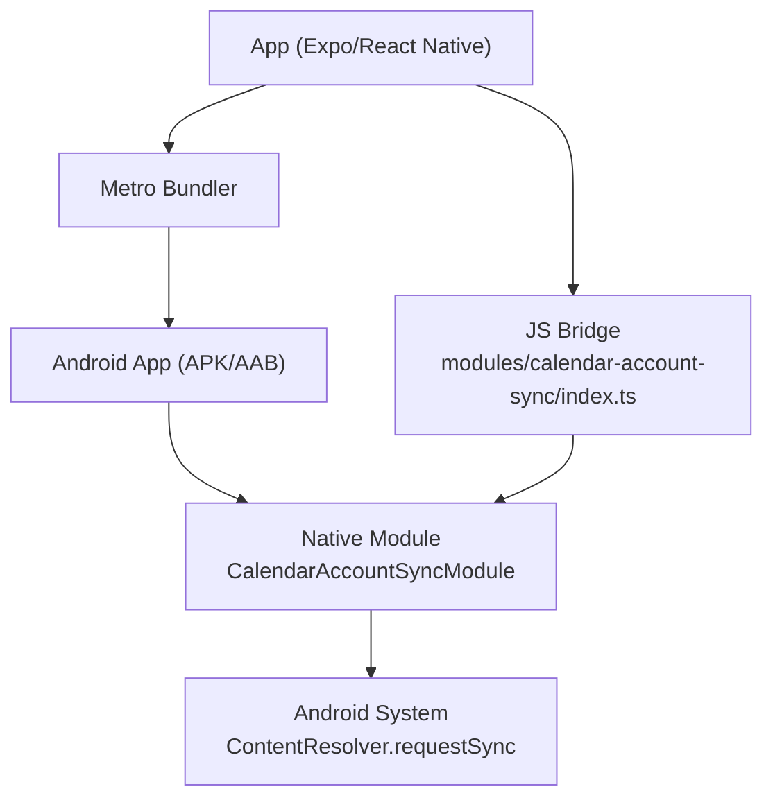
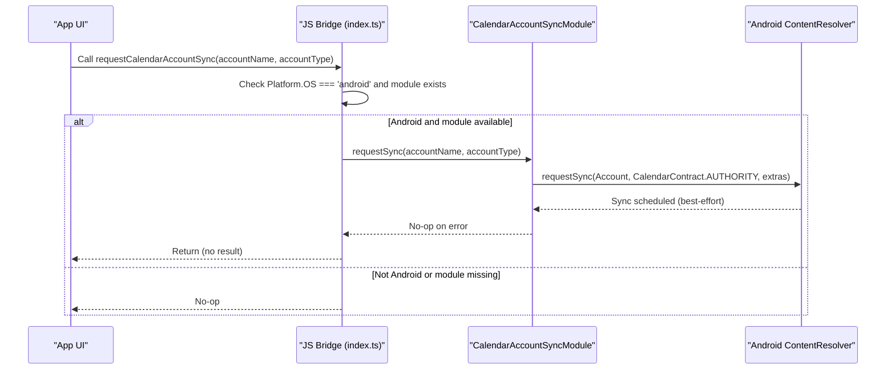
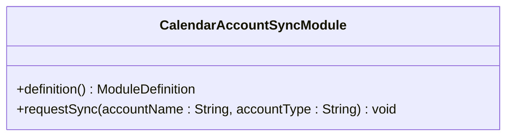
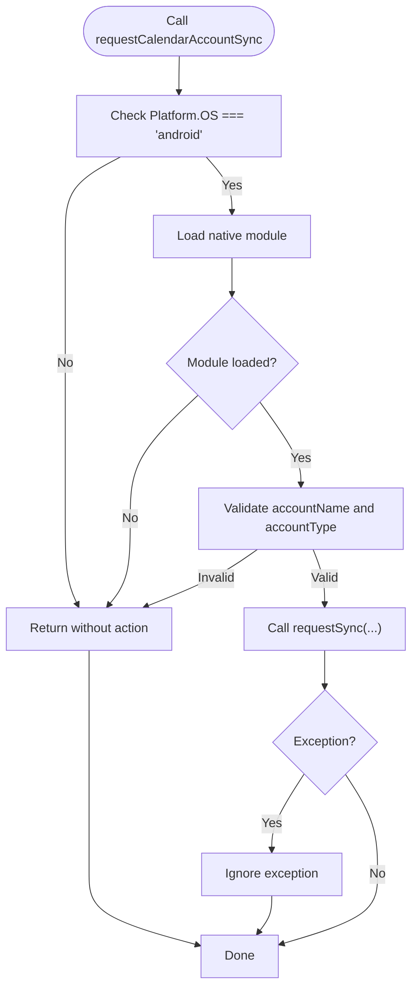
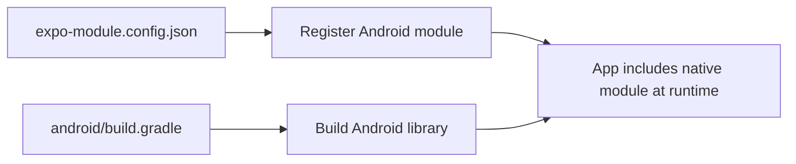
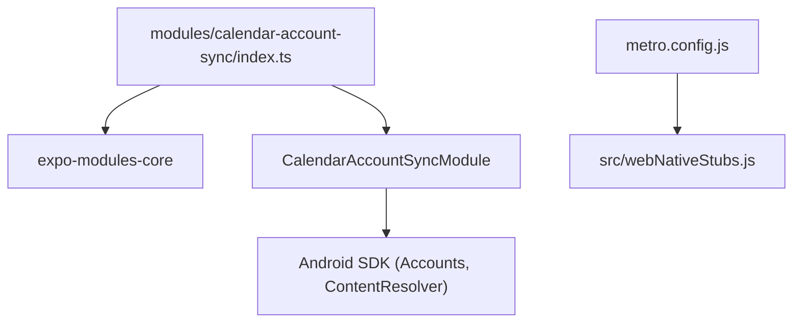

# Development Workflow

<cite>
**Referenced Files in This Document**
- [CalendarAccountSyncModule.kt](file://modules/calendar-account-sync/android/src/main/java/expo/modules/calendaraccountsync/CalendarAccountSyncModule.kt)
- [build.gradle (native module)](file://modules/calendar-account-sync/android/build.gradle)
- [expo-module.config.json](file://modules/calendar-account-sync/expo-module.config.json)
- [index.ts (JS bridge)](file://modules/calendar-account-sync/index.ts)
- [app.json](file://app.json)
- [app.config.js](file://app.config.js)
- [eas.json](file://eas.json)
- [metro.config.js](file://metro.config.js)
- [webNativeStubs.js](file://src/webNativeStubs.js)
- [_ts-resolver.mjs](file://src/crypto/_ts-resolver.mjs)
- [package.json](file://package.json)
</cite>

## Table of Contents
1. [Introduction](#introduction)
2. [Project Structure](#project-structure)
3. [Core Components](#core-components)
4. [Architecture Overview](#architecture-overview)
5. [Detailed Component Analysis](#detailed-component-analysis)
6. [Dependency Analysis](#dependency-analysis)
7. [Performance Considerations](#performance-considerations)
8. [Troubleshooting Guide](#troubleshooting-guide)
9. [Conclusion](#conclusion)
10. [Appendices](#appendices)

## Introduction
This document describes the native module development workflow and best practices for this Expo-based Android project. It covers environment setup, Gradle configuration, debugging native code, building and hot reloading, testing strategies, code organization and naming conventions, version management, iterative development workflows, integration into the main app, deployment considerations, and release processes. The example native module is a small Android-only feature that triggers an immediate calendar account sync via the system ContentResolver.

## Project Structure
The repository follows a standard Expo + React Native layout with a dedicated native module under modules/. Key areas:
- modules/calendar-account-sync: Android-native module exposing a JS API to trigger calendar sync on Android.
- app.json/app.config.js: App metadata, permissions, and dynamic build-time flags.
- metro.config.js: Metro bundler configuration including web stubs for native-only packages.
- package.json: Scripts for running, building, and testing.
- eas.json: EAS Build profiles for development, preview, and production builds.

**Diagram sources**
- [CalendarAccountSyncModule.kt:1-31](file://modules/calendar-account-sync/android/src/main/java/expo/modules/calendaraccountsync/CalendarAccountSyncModule.kt#L1-L31)
- [index.ts:1-16](file://modules/calendar-account-sync/index.ts#L1-L16)
- [metro.config.js:1-36](file://metro.config.js#L1-L36)

**Section sources**
- [app.json:22-67](file://app.json#L22-L67)
- [app.config.js:1-57](file://app.config.js#L1-L57)
- [package.json:5-20](file://package.json#L5-L20)

## Core Components
- Native module implementation: Kotlin class extending Expo’s Module base and exposing a function to request an expedited calendar sync.
- JS bridge: Platform-aware wrapper that calls the native method only on Android when available.
- Module registration: expo-module.config.json declares the platform and fully-qualified module class.
- Gradle config: Declares Android library plugin and Expo module Gradle plugin; sets group, namespace, and versions.
- App configuration: Declares required Android permissions and integrates plugins.

**Section sources**
- [CalendarAccountSyncModule.kt:10-29](file://modules/calendar-account-sync/android/src/main/java/expo/modules/calendaraccountsync/CalendarAccountSyncModule.kt#L10-L29)
- [index.ts:1-16](file://modules/calendar-account-sync/index.ts#L1-L16)
- [expo-module.config.json:1-7](file://modules/calendar-account-sync/expo-module.config.json#L1-L7)
- [build.gradle (native module):1-16](file://modules/calendar-account-sync/android/build.gradle#L1-L16)
- [app.json:22-37](file://app.json#L22-L37)

## Architecture Overview
The native module exposes a single JS function that, on Android, requests an expedited sync for a given calendar account. The flow:
- JS layer checks platform and availability of the native module.
- If present, it invokes the native function with account name and type.
- The native module constructs an Account and calls ContentResolver.requestSync with manual/expedited extras.
- Errors are swallowed to keep the call best-effort.

**Diagram sources**
- [index.ts:4-15](file://modules/calendar-account-sync/index.ts#L4-L15)
- [CalendarAccountSyncModule.kt:14-29](file://modules/calendar-account-sync/android/src/main/java/expo/modules/calendaraccountsync/CalendarAccountSyncModule.kt#L14-L29)

## Detailed Component Analysis

### Native Module (Kotlin)
- Purpose: Trigger an immediate calendar sync for a specific account using ContentResolver with manual/expedited flags.
- Implementation highlights:
  - Extends Expo Module and defines a function named requestSync.
  - Uses Account and Bundle to set SYNC_EXTRAS_MANUAL and SYNC_EXTRAS_EXPEDITED.
  - Swallows exceptions to ensure best-effort behavior.

**Diagram sources**
- [CalendarAccountSyncModule.kt:14-29](file://modules/calendar-account-sync/android/src/main/java/expo/modules/calendaraccountsync/CalendarAccountSyncModule.kt#L14-L29)

**Section sources**
- [CalendarAccountSyncModule.kt:10-29](file://modules/calendar-account-sync/android/src/main/java/expo/modules/calendaraccountsync/CalendarAccountSyncModule.kt#L10-L29)

### JS Bridge (TypeScript)
- Purpose: Provide a safe, cross-platform API that calls the native module only on Android when available.
- Behavior:
  - Uses requireOptionalNativeModule to load the native module by its registered name.
  - Guards against missing module (e.g., Expo Go) and invalid parameters.
  - Wraps invocation in try/catch to avoid crashes.

**Diagram sources**
- [index.ts:4-15](file://modules/calendar-account-sync/index.ts#L4-L15)

**Section sources**
- [index.ts:1-16](file://modules/calendar-account-sync/index.ts#L1-L16)

### Module Registration and Gradle
- expo-module.config.json registers the Android platform and the fully-qualified module class.
- build.gradle applies com.android.library and expo-module-gradle-plugin, sets group, namespace, and versioning.

**Diagram sources**
- [expo-module.config.json:1-7](file://modules/calendar-account-sync/expo-module.config.json#L1-L7)
- [build.gradle (native module):1-16](file://modules/calendar-account-sync/android/build.gradle#L1-L16)

**Section sources**
- [expo-module.config.json:1-7](file://modules/calendar-account-sync/expo-module.config.json#L1-L7)
- [build.gradle (native module):1-16](file://modules/calendar-account-sync/android/build.gradle#L1-L16)

### App Integration and Permissions
- app.json declares Android permissions needed for calendar access and other features.
- app.config.js dynamically enables cleartext traffic for non-production builds and injects build-time flags.

**Section sources**
- [app.json:22-37](file://app.json#L22-L37)
- [app.config.js:1-57](file://app.config.js#L1-L57)

## Dependency Analysis
- JS side depends on expo-modules-core for optional native module loading.
- Native side depends on Android SDK (Accounts, ContentResolver, CalendarContract).
- Metro configuration maps certain native-only packages to web stubs to prevent crashes during web builds.

**Diagram sources**
- [index.ts:1-4](file://modules/calendar-account-sync/index.ts#L1-L4)
- [CalendarAccountSyncModule.kt:3-7](file://modules/calendar-account-sync/android/src/main/java/expo/modules/calendaraccountsync/CalendarAccountSyncModule.kt#L3-L7)
- [metro.config.js:14-31](file://metro.config.js#L14-L31)
- [webNativeStubs.js:1-11](file://src/webNativeStubs.js#L1-L11)

**Section sources**
- [metro.config.js:14-31](file://metro.config.js#L14-L31)
- [webNativeStubs.js:1-11](file://src/webNativeStubs.js#L1-L11)

## Performance Considerations
- Native sync request is lightweight but should be invoked judiciously to avoid excessive system sync operations.
- Metro workers are limited to reduce resource usage during development.
- Web builds avoid native dependencies via stubs to keep bundle size and startup time reasonable.

[No sources needed since this section provides general guidance]

## Troubleshooting Guide
Common issues and how to address them:
- Module not found on Android:
  - Ensure expo-module.config.json lists the correct platform and fully-qualified module class.
  - Confirm the module is included in the build and the app has necessary permissions.
- Crashes on web:
  - Verify metro.config.js maps native-only packages to webNativeStubs.js.
- Debugging native code:
  - Use Android Studio to attach to the running process from the dev client or local build.
  - Set breakpoints in the Kotlin module and inspect arguments and exceptions.
- Testing JS bridge:
  - Run unit tests with Node using the test resolver hook to support extensionless imports.

**Section sources**
- [expo-module.config.json:1-7](file://modules/calendar-account-sync/expo-module.config.json#L1-L7)
- [app.json:22-37](file://app.json#L22-L37)
- [metro.config.js:14-31](file://metro.config.js#L14-L31)
- [_ts-resolver.mjs:1-26](file://src/crypto/_ts-resolver.mjs#L1-L26)

## Conclusion
This project demonstrates a minimal, robust native module pattern using Expo Modules on Android. The JS bridge safely exposes functionality, the native implementation performs a best-effort system sync, and the build pipeline supports both development and production workflows with clear separation of concerns. Following the guidelines here will help you add new native capabilities efficiently while maintaining stability across platforms and environments.

[No sources needed since this section summarizes without analyzing specific files]

## Appendices

### Environment Setup and Tools
- Required tools:
  - Node.js and Yarn (or npm) for JS tooling.
  - Android SDK and emulator/device for native development.
  - Android Studio for debugging native code and building APK/AAB.
  - EAS CLI for cloud builds and submission.
- Local development:
  - Install dependencies and start the dev server with the provided scripts.
  - Use the development profile to run a dev client on device.

**Section sources**
- [package.json:5-20](file://package.json#L5-L20)
- [eas.json:6-18](file://eas.json#L6-L18)

### Build Process and Hot Reloading
- Build types:
  - Development: internal distribution with dev client enabled.
  - Preview: internal distribution for sharing builds.
  - Production: auto-incremented versions and release flags.
- Hot reloading:
  - Metro supports fast refresh and live reload during development.
  - Native changes require rebuilding the native module and restarting the app.

**Section sources**
- [eas.json:6-61](file://eas.json#L6-L61)
- [package.json:5-20](file://package.json#L5-L20)

### Testing Strategies
- Unit tests:
  - Use Node with the custom resolver to run tests that rely on Metro-style extensionless imports.
  - Organize tests per domain (crypto, share, sync, etc.) and run via scripts.
- Native testing:
  - Test the JS bridge on real devices or emulators to validate platform-specific behavior.
  - Use Android Studio to step through native code and verify system interactions.

**Section sources**
- [_ts-resolver.mjs:1-26](file://src/crypto/_ts-resolver.mjs#L1-L26)
- [package.json:12-19](file://package.json#L12-L19)

### Code Organization and Naming Conventions
- Native module:
  - Place Kotlin classes under modules/<module>/android/src/main/java/<namespace>.
  - Use descriptive class names and consistent package namespaces.
- JS bridge:
  - Keep platform checks and optional native loading in a single entry file.
  - Export stable, typed functions for consumers.
- Configuration:
  - Register modules in expo-module.config.json with explicit platform scoping.
  - Maintain Gradle group and namespace aligned with package structure.

**Section sources**
- [expo-module.config.json:1-7](file://modules/calendar-account-sync/expo-module.config.json#L1-L7)
- [build.gradle (native module):1-16](file://modules/calendar-account-sync/android/build.gradle#L1-L16)
- [index.ts:1-16](file://modules/calendar-account-sync/index.ts#L1-L16)

### Version Management
- Native module:
  - Define versionCode and versionName in Gradle defaultConfig.
  - Align module version with app versioning strategy.
- App builds:
  - Use EAS profiles to control auto-increment and environment variables.
  - Bake build-time flags via app.config.js for feature toggles and cleartext settings.

**Section sources**
- [build.gradle (native module):6-15](file://modules/calendar-account-sync/android/build.gradle#L6-L15)
- [eas.json:41-61](file://eas.json#L41-L61)
- [app.config.js:14-56](file://app.config.js#L14-L56)

### Iterative Development Workflow
- Typical cycle:
  - Implement JS bridge changes and test in-app behavior.
  - Modify native code and rebuild the module.
  - Use dev client to iterate quickly; attach Android Studio debugger to native code as needed.
  - Commit changes and run tests before integrating into the main app.

[No sources needed since this section provides general guidance]

### Integrating Changes into the Main Application
- Ensure the module is declared in expo-module.config.json and built by Gradle.
- Update app permissions if the module requires additional capabilities.
- Validate end-to-end on device/emulator before promoting to preview/production.

**Section sources**
- [expo-module.config.json:1-7](file://modules/calendar-account-sync/expo-module.config.json#L1-L7)
- [app.json:22-37](file://app.json#L22-L37)

### Deployment and Release Processes
- EAS Profiles:
  - development: dev client for internal testing.
  - preview: internal distribution for broader testing.
  - production: auto-increment and release flags; submit via EAS Submit.
- Security:
  - Disable cleartext traffic in production builds.
  - Avoid committing secrets; use environment variables and EAS secrets.

**Section sources**
- [eas.json:6-67](file://eas.json#L6-L67)
- [app.config.js:14-56](file://app.config.js#L14-L56)